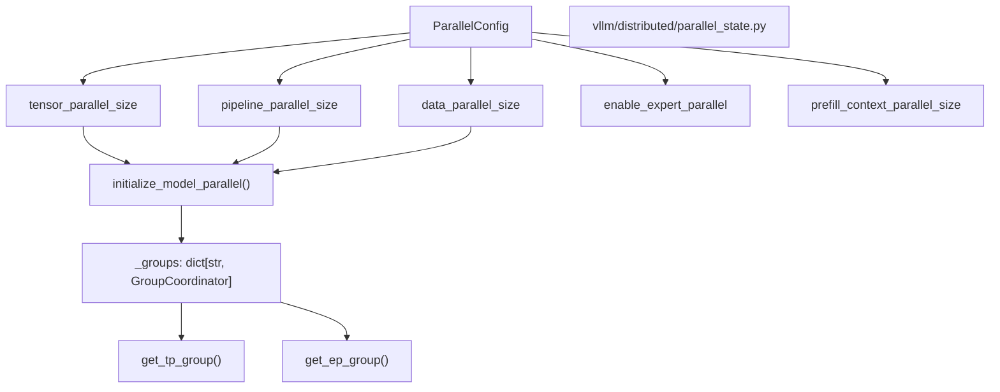
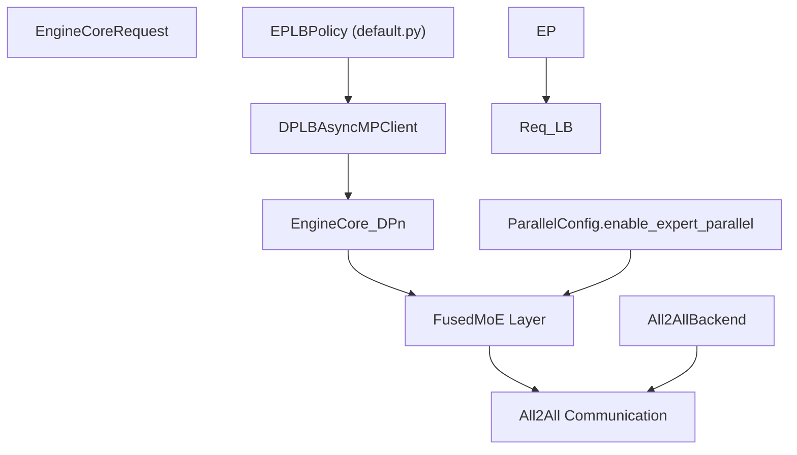

# 并行策略

相关源文件

-   [.buildkite/scripts/scheduled\_integration\_test/deepseek\_v2\_lite\_ep\_eplb.sh](https://github.com/vllm-project/vllm/blob/7cc302dd/.buildkite/scripts/scheduled_integration_test/deepseek_v2_lite_ep_eplb.sh)
-   [.buildkite/scripts/scheduled\_integration\_test/qwen3\_next\_mtp\_async\_eplb.sh](https://github.com/vllm-project/vllm/blob/7cc302dd/.buildkite/scripts/scheduled_integration_test/qwen3_next_mtp_async_eplb.sh)
-   [docs/design/moe\_kernel\_features.md](https://github.com/vllm-project/vllm/blob/7cc302dd/docs/design/moe_kernel_features.md?plain=1)
-   [tests/compile/passes/distributed/test\_async\_tp.py](https://github.com/vllm-project/vllm/blob/7cc302dd/tests/compile/passes/distributed/test_async_tp.py)
-   [tests/distributed/eplb\_utils.py](https://github.com/vllm-project/vllm/blob/7cc302dd/tests/distributed/eplb_utils.py)
-   [tests/distributed/test\_eplb\_algo.py](https://github.com/vllm-project/vllm/blob/7cc302dd/tests/distributed/test_eplb_algo.py)
-   [tests/distributed/test\_eplb\_execute.py](https://github.com/vllm-project/vllm/blob/7cc302dd/tests/distributed/test_eplb_execute.py)
-   [tests/distributed/test\_eplb\_fused\_moe\_layer.py](https://github.com/vllm-project/vllm/blob/7cc302dd/tests/distributed/test_eplb_fused_moe_layer.py)
-   [tests/distributed/test\_eplb\_spec\_decode.py](https://github.com/vllm-project/vllm/blob/7cc302dd/tests/distributed/test_eplb_spec_decode.py)
-   [tests/entrypoints/test\_api\_server\_process\_manager.py](https://github.com/vllm-project/vllm/blob/7cc302dd/tests/entrypoints/test_api_server_process_manager.py)
-   [tests/kernels/moe/modular\_kernel\_tools/mk\_objects.py](https://github.com/vllm-project/vllm/blob/7cc302dd/tests/kernels/moe/modular_kernel_tools/mk_objects.py)
-   [tests/v1/engine/test\_engine\_core.py](https://github.com/vllm-project/vllm/blob/7cc302dd/tests/v1/engine/test_engine_core.py)
-   [tests/v1/engine/test\_engine\_core\_client.py](https://github.com/vllm-project/vllm/blob/7cc302dd/tests/v1/engine/test_engine_core_client.py)
-   [vllm/config/parallel.py](https://github.com/vllm-project/vllm/blob/7cc302dd/vllm/config/parallel.py)
-   [vllm/distributed/device\_communicators/all2all.py](https://github.com/vllm-project/vllm/blob/7cc302dd/vllm/distributed/device_communicators/all2all.py)
-   [vllm/distributed/device\_communicators/base\_device\_communicator.py](https://github.com/vllm-project/vllm/blob/7cc302dd/vllm/distributed/device_communicators/base_device_communicator.py)
-   [vllm/distributed/device\_communicators/cuda\_communicator.py](https://github.com/vllm-project/vllm/blob/7cc302dd/vllm/distributed/device_communicators/cuda_communicator.py)
-   [vllm/distributed/device\_communicators/pynccl.py](https://github.com/vllm-project/vllm/blob/7cc302dd/vllm/distributed/device_communicators/pynccl.py)
-   [vllm/distributed/elastic\_ep/elastic\_execute.py](https://github.com/vllm-project/vllm/blob/7cc302dd/vllm/distributed/elastic_ep/elastic_execute.py)
-   [vllm/distributed/elastic\_ep/elastic\_state.py](https://github.com/vllm-project/vllm/blob/7cc302dd/vllm/distributed/elastic_ep/elastic_state.py)
-   [vllm/distributed/eplb/\_\_init\_\_.py](https://github.com/vllm-project/vllm/blob/7cc302dd/vllm/distributed/eplb/__init__.py)
-   [vllm/distributed/eplb/async\_worker.py](https://github.com/vllm-project/vllm/blob/7cc302dd/vllm/distributed/eplb/async_worker.py)
-   [vllm/distributed/eplb/eplb\_state.py](https://github.com/vllm-project/vllm/blob/7cc302dd/vllm/distributed/eplb/eplb_state.py)
-   [vllm/distributed/eplb/policy/\_\_init\_\_.py](https://github.com/vllm-project/vllm/blob/7cc302dd/vllm/distributed/eplb/policy/__init__.py)
-   [vllm/distributed/eplb/policy/abstract.py](https://github.com/vllm-project/vllm/blob/7cc302dd/vllm/distributed/eplb/policy/abstract.py)
-   [vllm/distributed/eplb/policy/default.py](https://github.com/vllm-project/vllm/blob/7cc302dd/vllm/distributed/eplb/policy/default.py)
-   [vllm/distributed/eplb/rebalance\_execute.py](https://github.com/vllm-project/vllm/blob/7cc302dd/vllm/distributed/eplb/rebalance_execute.py)
-   [vllm/distributed/parallel\_state.py](https://github.com/vllm-project/vllm/blob/7cc302dd/vllm/distributed/parallel_state.py)
-   [vllm/distributed/utils.py](https://github.com/vllm-project/vllm/blob/7cc302dd/vllm/distributed/utils.py)
-   [vllm/engine/async\_llm\_engine.py](https://github.com/vllm-project/vllm/blob/7cc302dd/vllm/engine/async_llm_engine.py)
-   [vllm/engine/llm\_engine.py](https://github.com/vllm-project/vllm/blob/7cc302dd/vllm/engine/llm_engine.py)
-   [vllm/engine/protocol.py](https://github.com/vllm-project/vllm/blob/7cc302dd/vllm/engine/protocol.py)
-   [vllm/entrypoints/cli/serve.py](https://github.com/vllm-project/vllm/blob/7cc302dd/vllm/entrypoints/cli/serve.py)
-   [vllm/entrypoints/launcher.py](https://github.com/vllm-project/vllm/blob/7cc302dd/vllm/entrypoints/launcher.py)
-   [vllm/entrypoints/llm.py](https://github.com/vllm-project/vllm/blob/7cc302dd/vllm/entrypoints/llm.py)
-   [vllm/model\_executor/layers/fused\_moe/all2all\_utils.py](https://github.com/vllm-project/vllm/blob/7cc302dd/vllm/model_executor/layers/fused_moe/all2all_utils.py)
-   [vllm/model\_executor/layers/fused\_moe/fused\_marlin\_moe.py](https://github.com/vllm-project/vllm/blob/7cc302dd/vllm/model_executor/layers/fused_moe/fused_marlin_moe.py)
-   [vllm/v1/engine/async\_llm.py](https://github.com/vllm-project/vllm/blob/7cc302dd/vllm/v1/engine/async_llm.py)
-   [vllm/v1/engine/coordinator.py](https://github.com/vllm-project/vllm/blob/7cc302dd/vllm/v1/engine/coordinator.py)
-   [vllm/v1/engine/core.py](https://github.com/vllm-project/vllm/blob/7cc302dd/vllm/v1/engine/core.py)
-   [vllm/v1/engine/core\_client.py](https://github.com/vllm-project/vllm/blob/7cc302dd/vllm/v1/engine/core_client.py)
-   [vllm/v1/engine/llm\_engine.py](https://github.com/vllm-project/vllm/blob/7cc302dd/vllm/v1/engine/llm_engine.py)
-   [vllm/v1/engine/utils.py](https://github.com/vllm-project/vllm/blob/7cc302dd/vllm/v1/engine/utils.py)
-   [vllm/v1/utils.py](https://github.com/vllm-project/vllm/blob/7cc302dd/vllm/v1/utils.py)

本文档介绍 vLLM 用于跨多个 GPU 和节点的分布式推理的并行策略。它涵盖张量并行（TP）、流水线并行（PP）、数据并行（DP）、上下文并行（CP）以及用于 Mixture-of-Experts（MoE）模型的专家并行（EP）。

## 概述

vLLM 支持五种可组合的并行策略，用于在多个设备上扩展推理：

| 并行类型 | 用途 | ParallelConfig 字段 | CLI 参数 | 对 World Size 的影响 |
| --- | --- | --- | --- | --- |
| **张量并行（TP）** | 在设备之间拆分模型层 | `tensor_parallel_size` | `-tp`, `--tensor-parallel-size` | 使 world_size 成倍扩大 |
| **流水线并行（PP）** | 将模型层拆分为多个阶段 | `pipeline_parallel_size` | `-pp`, `--pipeline-parallel-size` | 使 world_size 成倍扩大 |
| **数据并行（DP）** | 在设备之间复制模型 | `data_parallel_size` | `-dp`, `--data-parallel-size` | 复制实例 |
| **上下文并行（CP）** | 拆分序列维度 | `prefill_context_parallel_size` | `--prefill-context-parallel-size` | 复用 TP 设备 |
| **专家并行（EP）** | 在设备之间拆分 MoE 专家 | `enable_expert_parallel` | `--enable-expert-parallel` | 使用 TP×DP rank |

`ParallelConfig.world_size` 字段表示每个数据并行副本所对应的设备数量。对于启用 EP 的 MoE 模型，专家会分片到 `tensor_parallel_size × data_parallel_size` 个 rank 上，其放置方式由 `expert_placement_strategy` 控制。[vllm/config/parallel.py99-110](https://github.com/vllm-project/vllm/blob/7cc302dd/vllm/config/parallel.py#L99-L110)

**来源：** [vllm/config/parallel.py99-110](https://github.com/vllm-project/vllm/blob/7cc302dd/vllm/config/parallel.py#L99-L110) [vllm/distributed/parallel\_state.py12-24](https://github.com/vllm-project/vllm/blob/7cc302dd/vllm/distributed/parallel_state.py#L12-L24)

## 通过 ParallelConfig 进行配置

所有并行策略都通过 [vllm/config/parallel.py96-359](https://github.com/vllm-project/vllm/blob/7cc302dd/vllm/config/parallel.py#L96-L359) 中定义的 `ParallelConfig` 类进行配置

**图：ParallelConfig 到分布式状态转换** **来源：** [vllm/config/parallel.py99-162](https://github.com/vllm-project/vllm/blob/7cc302dd/vllm/config/parallel.py#L99-L162) [vllm/distributed/parallel\_state.py107-135](https://github.com/vllm-project/vllm/blob/7cc302dd/vllm/distributed/parallel_state.py#L107-L135)

### ParallelConfig 关键字段

`ParallelConfig` dataclass 包含以下主要字段：

**并行维度：**

-   `tensor_parallel_size: int = 1`：张量并行组的数量。[vllm/config/parallel.py101](https://github.com/vllm-project/vllm/blob/7cc302dd/vllm/config/parallel.py#L101-L101)
-   `pipeline_parallel_size: int = 1`：流水线并行阶段的数量。[vllm/config/parallel.py99](https://github.com/vllm-project/vllm/blob/7cc302dd/vllm/config/parallel.py#L99-L99)
-   `data_parallel_size: int = 1`：数据并行组的数量。[vllm/config/parallel.py105](https://github.com/vllm-project/vllm/blob/7cc302dd/vllm/config/parallel.py#L105-L105)
-   `prefill_context_parallel_size: int = 1`：prefill 上下文并行组的数量。[vllm/config/parallel.py103](https://github.com/vllm-project/vllm/blob/7cc302dd/vllm/config/parallel.py#L103-L103)

**专家并行（MoE）：**

-   `enable_expert_parallel: bool = False`：对 MoE 层使用专家并行而非张量并行。[vllm/config/parallel.py137](https://github.com/vllm-project/vllm/blob/7cc302dd/vllm/config/parallel.py#L137-L137)
-   `expert_placement_strategy: ExpertPlacementStrategy = "linear"`：专家分布策略（`"linear"` 或 `"round_robin"`）。[vllm/config/parallel.py150](https://github.com/vllm-project/vllm/blob/7cc302dd/vllm/config/parallel.py#L150-L150)
-   `all2all_backend: All2AllBackend = "allgather_reducescatter"`：专家路由的通信后端。[vllm/config/parallel.py159](https://github.com/vllm-project/vllm/blob/7cc302dd/vllm/config/parallel.py#L159-L159)

**来源：** [vllm/config/parallel.py96-162](https://github.com/vllm-project/vllm/blob/7cc302dd/vllm/config/parallel.py#L96-L162)

## 张量并行（TP）

张量并行将单个模型层（权重矩阵）拆分到多个设备上。结果通过 all-reduce 操作进行聚合。

### TP 实现细节

-   **通信后端**：vLLM 在 `parallel_state.py` 中自行管理分布式状态，从而接管 PyTorch 的控制权。[vllm/distributed/parallel\_state.py8-10](https://github.com/vllm-project/vllm/blob/7cc302dd/vllm/distributed/parallel_state.py#L8-L10)
-   **对称内存**：在受支持的硬件上，vLLM 利用对称内存（`torch.distributed._symmetric_memory`）通过直接的 peer 访问优化集合通信。[vllm/distributed/parallel\_state.py42](https://github.com/vllm-project/vllm/blob/7cc302dd/vllm/distributed/parallel_state.py#L42-L42)
-   **进程管理**：在 V1 中，`MultiprocExecutor` 负责管理 TP 执行所需的 worker 进程生命周期。[vllm/entrypoints/cli/serve.py22](https://github.com/vllm-project/vllm/blob/7cc302dd/vllm/entrypoints/cli/serve.py#L22-L22)

**来源：** [vllm/distributed/parallel\_state.py8-42](https://github.com/vllm-project/vllm/blob/7cc302dd/vllm/distributed/parallel_state.py#L8-L42) [vllm/entrypoints/cli/serve.py22](https://github.com/vllm-project/vllm/blob/7cc302dd/vllm/entrypoints/cli/serve.py#L22-L22)

## 流水线并行（PP）

流水线并行将模型拆分为多个阶段，每个阶段包含一部分连续层。

-   **批队列**：vLLM V1 在 `EngineCore` 中使用 `batch_queue` 异步调度和执行批次，这是消除流水线气泡所必需的。[vllm/v1/engine/core.py181-186](https://github.com/vllm-project/vllm/blob/7cc302dd/vllm/v1/engine/core.py#L181-L186)
-   **并发性**：`Executor` 的 `max_concurrent_batches` 属性决定流水线批队列的大小。[vllm/v1/engine/core.py185](https://github.com/vllm-project/vllm/blob/7cc302dd/vllm/v1/engine/core.py#L185-L185)

**来源：** [vllm/v1/engine/core.py181-186](https://github.com/vllm-project/vllm/blob/7cc302dd/vllm/v1/engine/core.py#L181-L186)

## 上下文并行（CP）

上下文并行将序列维度拆分到多个设备上。vLLM 当前暴露 `prefill_context_parallel_size` 和 `decode_context_parallel_size` 来处理长序列。[vllm/v1/engine/core.py139-140](https://github.com/vllm-project/vllm/blob/7cc302dd/vllm/v1/engine/core.py#L139-L140)

-   **块大小缩放**：调度器块大小会通过将基础 `block_size` 乘以上下文并行大小来进行调整。[vllm/v1/engine/core.py137-141](https://github.com/vllm-project/vllm/blob/7cc302dd/vllm/v1/engine/core.py#L137-L141)

**来源：** [vllm/v1/engine/core.py137-141](https://github.com/vllm-project/vllm/blob/7cc302dd/vllm/v1/engine/core.py#L137-L141) [vllm/config/parallel.py103](https://github.com/vllm-project/vllm/blob/7cc302dd/vllm/config/parallel.py#L103-L103)

## 数据并行（DP）

数据并行将引擎复制到多个组中。在 vLLM V1 中，这由 `DPCoordinator` 管理。[vllm/v1/engine/core\_client.py46](https://github.com/vllm-project/vllm/blob/7cc302dd/vllm/v1/engine/core_client.py#L46-L46)

-   **后端选项**：DP 可以使用 `"mp"`（多进程）或 `"ray"` 后端。[vllm/config/parallel.py121](https://github.com/vllm-project/vllm/blob/7cc302dd/vllm/config/parallel.py#L121-L121)
-   **负载均衡**：vLLM 支持多种 LB 模式：
    -   **内部 LB**：`DPLBAsyncMPClient` 将请求均衡到所有 DP rank。[vllm/v1/engine/core\_client.py129](https://github.com/vllm-project/vllm/blob/7cc302dd/vllm/v1/engine/core_client.py#L129-L129)
    -   **外部 LB**：`DPAsyncMPClient`，其中客户端管理特定的 DP rank。[vllm/v1/engine/core\_client.py127](https://github.com/vllm-project/vllm/blob/7cc302dd/vllm/v1/engine/core_client.py#L127-L127)
    -   **混合 LB**：结合节点内 DP 均衡与节点间外部 LB。[vllm/config/parallel.py128-134](https://github.com/vllm-project/vllm/blob/7cc302dd/vllm/config/parallel.py#L128-L134)

**来源：** [vllm/config/parallel.py121-134](https://github.com/vllm-project/vllm/blob/7cc302dd/vllm/config/parallel.py#L121-L134) [vllm/v1/engine/core\_client.py46-129](https://github.com/vllm-project/vllm/blob/7cc302dd/vllm/v1/engine/core_client.py#L46-L129)

## 专家并行（EP）

专家并行将 MoE 专家分片到多个设备上。该功能通过 `enable_expert_parallel` 进行配置。[vllm/config/parallel.py137](https://github.com/vllm-project/vllm/blob/7cc302dd/vllm/config/parallel.py#L137-L137)

**图：专家并行执行与配置** **来源：** [vllm/config/parallel.py137-168](https://github.com/vllm-project/vllm/blob/7cc302dd/vllm/config/parallel.py#L137-L168) [vllm/v1/engine/core\_client.py124-130](https://github.com/vllm-project/vllm/blob/7cc302dd/vllm/v1/engine/core_client.py#L124-L130)

### 专家并行负载均衡（EPLB）

EPLB 会重新排列专家，以避免某些 rank 处理明显更多 token 的热点问题。

-   **EPLBConfig**：配置用于负载记录的 `window_size` 和用于重排的 `step_interval`。[vllm/config/parallel.py53-85](https://github.com/vllm-project/vllm/blob/7cc302dd/vllm/config/parallel.py#L53-L85)
-   **冗余**：支持 `num_redundant_experts`，将高频使用的专家复制到多个 rank 上。[vllm/config/parallel.py66](https://github.com/vllm-project/vllm/blob/7cc302dd/vllm/config/parallel.py#L66-L66)
-   **弹性 EP**：vLLM 支持动态上调或下调 EP rank 数量。[vllm/v1/engine/core.py120-121](https://github.com/vllm-project/vllm/blob/7cc302dd/vllm/v1/engine/core.py#L120-L121)

**来源：** [vllm/config/parallel.py53-85](https://github.com/vllm-project/vllm/blob/7cc302dd/vllm/config/parallel.py#L53-L85) [vllm/v1/engine/core.py120-121](https://github.com/vllm-project/vllm/blob/7cc302dd/vllm/v1/engine/core.py#L120-L121)

## 通信操作概览

vLLM 为集合通信操作提供函数式封装，这些封装会与已注册的 `GroupCoordinator` 实例交互：

-   `all_reduce(tensor, group_name)`：对指定组执行 all-reduce。[vllm/distributed/parallel\_state.py130](https://github.com/vllm-project/vllm/blob/7cc302dd/vllm/distributed/parallel_state.py#L130-L130)
-   `all_gather(tensor, dim, world_size, group_name)`：在组内收集张量。[vllm/distributed/parallel\_state.py160](https://github.com/vllm-project/vllm/blob/7cc302dd/vllm/distributed/parallel_state.py#L160-L160)
-   `reduce_scatter(tensor, dim, world_size, group_name)`：分散归约结果。[vllm/distributed/parallel\_state.py142](https://github.com/vllm-project/vllm/blob/7cc302dd/vllm/distributed/parallel_state.py#L142-L142)

**来源：** [vllm/distributed/parallel\_state.py130-170](https://github.com/vllm-project/vllm/blob/7cc302dd/vllm/distributed/parallel_state.py#L130-L170)
