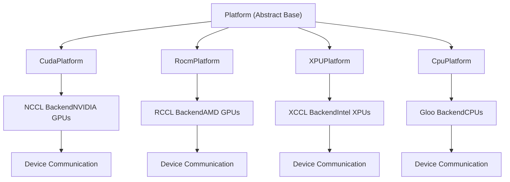

# 通信基础设施

相关源文件

-   [benchmarks/kernels/benchmark\_fused\_collective.py](https://github.com/vllm-project/vllm/blob/7cc302dd/benchmarks/kernels/benchmark_fused_collective.py)
-   [docs/design/cuda\_graphs.md](https://github.com/vllm-project/vllm/blob/7cc302dd/docs/design/cuda_graphs.md?plain=1)
-   [docs/design/cuda\_graphs\_multimodal.md](https://github.com/vllm-project/vllm/blob/7cc302dd/docs/design/cuda_graphs_multimodal.md?plain=1)
-   [docs/design/moe\_kernel\_features.md](https://github.com/vllm-project/vllm/blob/7cc302dd/docs/design/moe_kernel_features.md?plain=1)
-   [examples/offline\_inference/load\_sharded\_state.py](https://github.com/vllm-project/vllm/blob/7cc302dd/examples/offline_inference/load_sharded_state.py)
-   [examples/offline\_inference/save\_sharded\_state.py](https://github.com/vllm-project/vllm/blob/7cc302dd/examples/offline_inference/save_sharded_state.py)
-   [tests/basic\_correctness/test\_basic\_correctness.py](https://github.com/vllm-project/vllm/blob/7cc302dd/tests/basic_correctness/test_basic_correctness.py)
-   [tests/compile/fusions\_e2e/\_\_init\_\_.py](https://github.com/vllm-project/vllm/blob/7cc302dd/tests/compile/fusions_e2e/__init__.py)
-   [tests/compile/passes/distributed/test\_fusion\_all\_reduce.py](https://github.com/vllm-project/vllm/blob/7cc302dd/tests/compile/passes/distributed/test_fusion_all_reduce.py)
-   [tests/compile/passes/test\_fusion\_attn.py](https://github.com/vllm-project/vllm/blob/7cc302dd/tests/compile/passes/test_fusion_attn.py)
-   [tests/distributed/test\_shm\_broadcast.py](https://github.com/vllm-project/vllm/blob/7cc302dd/tests/distributed/test_shm_broadcast.py)
-   [tests/distributed/test\_symm\_mem\_allreduce.py](https://github.com/vllm-project/vllm/blob/7cc302dd/tests/distributed/test_symm_mem_allreduce.py)
-   [tests/kernels/moe/modular\_kernel\_tools/mk\_objects.py](https://github.com/vllm-project/vllm/blob/7cc302dd/tests/kernels/moe/modular_kernel_tools/mk_objects.py)
-   [tests/models/language/generation/test\_common.py](https://github.com/vllm-project/vllm/blob/7cc302dd/tests/models/language/generation/test_common.py)
-   [tests/samplers/test\_no\_bad\_words.py](https://github.com/vllm-project/vllm/blob/7cc302dd/tests/samplers/test_no_bad_words.py)
-   [tests/v1/core/test\_scheduler\_e2e.py](https://github.com/vllm-project/vllm/blob/7cc302dd/tests/v1/core/test_scheduler_e2e.py)
-   [tests/v1/sample/test\_sampling\_params\_e2e.py](https://github.com/vllm-project/vllm/blob/7cc302dd/tests/v1/sample/test_sampling_params_e2e.py)
-   [vllm/compilation/passes/fusion/act\_quant\_fusion.py](https://github.com/vllm-project/vllm/blob/7cc302dd/vllm/compilation/passes/fusion/act_quant_fusion.py)
-   [vllm/compilation/passes/fusion/allreduce\_rms\_fusion.py](https://github.com/vllm-project/vllm/blob/7cc302dd/vllm/compilation/passes/fusion/allreduce_rms_fusion.py)
-   [vllm/compilation/passes/fusion/attn\_quant\_fusion.py](https://github.com/vllm-project/vllm/blob/7cc302dd/vllm/compilation/passes/fusion/attn_quant_fusion.py)
-   [vllm/compilation/passes/fusion/matcher\_utils.py](https://github.com/vllm-project/vllm/blob/7cc302dd/vllm/compilation/passes/fusion/matcher_utils.py)
-   [vllm/compilation/passes/fusion/rms\_quant\_fusion.py](https://github.com/vllm-project/vllm/blob/7cc302dd/vllm/compilation/passes/fusion/rms_quant_fusion.py)
-   [vllm/distributed/device\_communicators/all2all.py](https://github.com/vllm-project/vllm/blob/7cc302dd/vllm/distributed/device_communicators/all2all.py)
-   [vllm/distributed/device\_communicators/all\_reduce\_utils.py](https://github.com/vllm-project/vllm/blob/7cc302dd/vllm/distributed/device_communicators/all_reduce_utils.py)
-   [vllm/distributed/device\_communicators/base\_device\_communicator.py](https://github.com/vllm-project/vllm/blob/7cc302dd/vllm/distributed/device_communicators/base_device_communicator.py)
-   [vllm/distributed/device\_communicators/cuda\_communicator.py](https://github.com/vllm-project/vllm/blob/7cc302dd/vllm/distributed/device_communicators/cuda_communicator.py)
-   [vllm/distributed/device\_communicators/custom\_all\_reduce.py](https://github.com/vllm-project/vllm/blob/7cc302dd/vllm/distributed/device_communicators/custom_all_reduce.py)
-   [vllm/distributed/device\_communicators/flashinfer\_all\_reduce.py](https://github.com/vllm-project/vllm/blob/7cc302dd/vllm/distributed/device_communicators/flashinfer_all_reduce.py)
-   [vllm/distributed/device\_communicators/pynccl.py](https://github.com/vllm-project/vllm/blob/7cc302dd/vllm/distributed/device_communicators/pynccl.py)
-   [vllm/distributed/device\_communicators/shm\_broadcast.py](https://github.com/vllm-project/vllm/blob/7cc302dd/vllm/distributed/device_communicators/shm_broadcast.py)
-   [vllm/distributed/device\_communicators/symm\_mem.py](https://github.com/vllm-project/vllm/blob/7cc302dd/vllm/distributed/device_communicators/symm_mem.py)
-   [vllm/distributed/elastic\_ep/elastic\_execute.py](https://github.com/vllm-project/vllm/blob/7cc302dd/vllm/distributed/elastic_ep/elastic_execute.py)
-   [vllm/distributed/elastic\_ep/elastic\_state.py](https://github.com/vllm-project/vllm/blob/7cc302dd/vllm/distributed/elastic_ep/elastic_state.py)
-   [vllm/distributed/parallel\_state.py](https://github.com/vllm-project/vllm/blob/7cc302dd/vllm/distributed/parallel_state.py)
-   [vllm/distributed/utils.py](https://github.com/vllm-project/vllm/blob/7cc302dd/vllm/distributed/utils.py)
-   [vllm/model\_executor/layers/fused\_moe/all2all\_utils.py](https://github.com/vllm-project/vllm/blob/7cc302dd/vllm/model_executor/layers/fused_moe/all2all_utils.py)
-   [vllm/model\_executor/layers/fused\_moe/fused\_marlin\_moe.py](https://github.com/vllm-project/vllm/blob/7cc302dd/vllm/model_executor/layers/fused_moe/fused_marlin_moe.py)
-   [vllm/model\_executor/models/arctic.py](https://github.com/vllm-project/vllm/blob/7cc302dd/vllm/model_executor/models/arctic.py)
-   [vllm/model\_executor/models/chatglm.py](https://github.com/vllm-project/vllm/blob/7cc302dd/vllm/model_executor/models/chatglm.py)
-   [vllm/model\_executor/models/commandr.py](https://github.com/vllm-project/vllm/blob/7cc302dd/vllm/model_executor/models/commandr.py)
-   [vllm/model\_executor/models/dbrx.py](https://github.com/vllm-project/vllm/blob/7cc302dd/vllm/model_executor/models/dbrx.py)
-   [vllm/model\_executor/models/exaone4.py](https://github.com/vllm-project/vllm/blob/7cc302dd/vllm/model_executor/models/exaone4.py)
-   [vllm/model\_executor/models/gemma.py](https://github.com/vllm-project/vllm/blob/7cc302dd/vllm/model_executor/models/gemma.py)
-   [vllm/model\_executor/models/gemma2.py](https://github.com/vllm-project/vllm/blob/7cc302dd/vllm/model_executor/models/gemma2.py)
-   [vllm/model\_executor/models/gemma3.py](https://github.com/vllm-project/vllm/blob/7cc302dd/vllm/model_executor/models/gemma3.py)
-   [vllm/model\_executor/models/phi.py](https://github.com/vllm-project/vllm/blob/7cc302dd/vllm/model_executor/models/phi.py)

本文档记录了 vLLM 的分布式通信基础设施，包括后端选择（NCCL、XCCL、Gloo）、拓扑检测、设备通信器以及自定义集合通信操作。该基础设施支撑张量并行、流水线并行、专家并行以及其他分布式执行策略。

关于高级并行策略，请参见 [并行策略](/vllm-project/vllm/9.1-parallelism-strategies)。关于多进程引擎管理与协调，请参见 [多进程引擎管理](/vllm-project/vllm/9.3-multi-process-engine-management)。关于解耦式服务中的 KV cache 传输，请参见 [KV Cache 传输与解耦式服务](/vllm-project/vllm/9.4-kv-cache-transfer-and-disaggregated-serving)。

---

## 通信后端选择

每个平台都会通过 `Platform` 类中的 `dist_backend` 属性定义一个特定的分布式通信后端。该后端由 PyTorch 的 distributed 包用于进程间通信。

### 按平台的后端映射

| 平台 | 后端 | 描述 |
| --- | --- | --- |
| CUDA | `nccl` | 用于 GPU 通信的 NVIDIA Collective Communications Library |
| ROCm | `nccl` | 用于 AMD GPU 通信的 RCCL（NCCL 的 ROCm 分支） |
| XPU | `xccl` | 用于 XPU 设备的 Intel 集体通信库 |
| CPU | `gloo` | 用于基于 CPU 的分布式通信的 Gloo 库 |
| TPU | 平台特定 | 由外部 TPU 推理包处理 |

**来源：**

-   [vllm/platforms/interface.py134](https://github.com/vllm-project/vllm/blob/7cc302dd/vllm/platforms/interface.py#L134-L134)
-   [vllm/platforms/cuda.py118](https://github.com/vllm-project/vllm/blob/7cc302dd/vllm/platforms/cuda.py#L118-L118)
-   [vllm/platforms/rocm.py361](https://github.com/vllm-project/vllm/blob/7cc302dd/vllm/platforms/rocm.py#L361-L361)
-   [vllm/platforms/xpu.py38](https://github.com/vllm-project/vllm/blob/7cc302dd/vllm/platforms/xpu.py#L38-L38)
-   [vllm/platforms/cpu.py77](https://github.com/vllm-project/vllm/blob/7cc302dd/vllm/platforms/cpu.py#L77-L77)

### 后端选择图

**来源：**

-   [vllm/platforms/interface.py100-140](https://github.com/vllm-project/vllm/blob/7cc302dd/vllm/platforms/interface.py#L100-L140)
-   [vllm/platforms/cuda.py112-123](https://github.com/vllm-project/vllm/blob/7cc302dd/vllm/platforms/cuda.py#L112-L123)
-   [vllm/platforms/rocm.py355-368](https://github.com/vllm-project/vllm/blob/7cc302dd/vllm/platforms/rocm.py#L355-L368)

---

## 设备通信器与自定义集合通信

vLLM 实现了专用通信器，用于封装 `torch.distributed`，并为 `all_reduce` 和 `all_to_all` 等常见操作提供优化实现。

### CudaCommunicator 与 All-Reduce

`CudaCommunicator` 会协调多个 all-reduce 后端，并根据环境变量和硬件拓扑选择最有效的后端。它具体管理 `pynccl_comm`、`ca_comm`（Custom Allreduce）和 `fi_ar_comm`（FlashInfer）[vllm/distributed/device_communicators/cuda_communicator.py73-97](https://github.com/vllm-project/vllm/blob/7cc302dd/vllm/distributed/device_communicators/cuda_communicator.py#L73-L97)

| 后端 | 代码实体 | 触发条件 |
| --- | --- | --- |
| **NCCL** | `PyNcclCommunicator` | `world_size > 1` 时的默认选择 [vllm/distributed/device_communicators/cuda_communicator.py75](https://github.com/vllm-project/vllm/blob/7cc302dd/vllm/distributed/device_communicators/cuda_communicator.py#L75-L75) |
| **自定义 All-Reduce** | `CustomAllreduce` | `_ENABLE_CUSTOM_ALL_REDUCE` 为 `True` [vllm/distributed/device_communicators/cuda_communicator.py101](https://github.com/vllm-project/vllm/blob/7cc302dd/vllm/distributed/device_communicators/cuda_communicator.py#L101-L101) |
| **对称内存** | `SymmMemCommunicator` | `VLLM_ALLREDUCE_USE_SYMM_MEM` [vllm/distributed/device_communicators/cuda_communicator.py88](https://github.com/vllm-project/vllm/blob/7cc302dd/vllm/distributed/device_communicators/cuda_communicator.py#L88-L88) |
| **FlashInfer** | `FlashInferAllReduce` | `VLLM_ALLREDUCE_USE_FLASHINFER` [vllm/distributed/device_communicators/cuda_communicator.py94](https://github.com/vllm-project/vllm/blob/7cc302dd/vllm/distributed/device_communicators/cuda_communicator.py#L94-L94) |
| **快速归约** | `QuickAllReduce` | 仅适用于 ROCm MI300 系列 [vllm/distributed/device_communicators/cuda_communicator.py115](https://github.com/vllm-project/vllm/blob/7cc302dd/vllm/distributed/device_communicators/cuda_communicator.py#L115-L115) |

**来源：**

-   [vllm/distributed/device_communicators/cuda_communicator.py25-116](https://github.com/vllm-project/vllm/blob/7cc302dd/vllm/distributed/device_communicators/cuda_communicator.py#L25-L116)

### MoE All-to-All 基础设施

对于专家并行（EP），vLLM 使用 `All2AllManager` 来处理 token 分发和结果合并。后端通过 `ParallelConfig.all2all_backend` 进行配置 [vllm/distributed/device_communicators/base_device_communicator.py171-175](https://github.com/vllm-project/vllm/blob/7cc302dd/vllm/distributed/device_communicators/base_device_communicator.py#L171-L175)

vLLM 支持多种高级 all2all 后端：

-   `NaiveAll2AllManager`：使用标准 broadcast/all-reduce 进行调试 [vllm/distributed/device_communicators/all2all.py41-50](https://github.com/vllm-project/vllm/blob/7cc302dd/vllm/distributed/device_communicators/all2all.py#L41-L50)
-   `AgRsAll2AllManager`：基于 all-gather 和 reduce-scatter [vllm/distributed/device_communicators/all2all.py150-158](https://github.com/vllm-project/vllm/blob/7cc302dd/vllm/distributed/device_communicators/all2all.py#L150-L158)
-   `DeepEPHTAll2AllManager`：使用 DeepEP 库的高吞吐后端 [vllm/distributed/device_communicators/all2all.py130-135](https://github.com/vllm-project/vllm/blob/7cc302dd/vllm/distributed/device_communicators/all2all.py#L130-L135)
-   `FlashInferNVLinkTwoSidedManager`：用于双向通信的优化 NVLink 后端 [vllm/distributed/device_communicators/all2all.py162-166](https://github.com/vllm-project/vllm/blob/7cc302dd/vllm/distributed/device_communicators/all2all.py#L162-L166)

**来源：**

-   [vllm/distributed/device_communicators/all2all.py40-170](https://github.com/vllm-project/vllm/blob/7cc302dd/vllm/distributed/device_communicators/all2all.py#L40-L170)
-   [vllm/distributed/device_communicators/base_device_communicator.py28-115](https://github.com/vllm-project/vllm/blob/7cc302dd/vllm/distributed/device_communicators/base_device_communicator.py#L28-L115)

---

## 分布式状态与组管理

`parallel_state` 模块负责管理分布式进程组的生命周期。它提供了一个 `GroupCoordinator` 对象注册表，这些对象封装了 `torch.distributed` 进程组。

### 关键函数与生命周期

1.  **初始化**：`init_distributed_environment` 设置初始 world [vllm/distributed/parallel\_state.py12](https://github.com/vllm-project/vllm/blob/7cc302dd/vllm/distributed/parallel_state.py#L12-L12)
2.  **模型并行**：`initialize_model_parallel` 设置 TP、PP 和 EP 组 [vllm/distributed/parallel\_state.py13-14](https://github.com/vllm-project/vllm/blob/7cc302dd/vllm/distributed/parallel_state.py#L13-L14)
3.  **集合通信封装**：`all_reduce`、`all_gather` 和 `reduce_scatter` 等函数会按名称查找相应的 `GroupCoordinator` [vllm/distributed/parallel\_state.py130-167](https://github.com/vllm-project/vllm/blob/7cc302dd/vllm/distributed/parallel_state.py#L130-L167)

### 无状态通信与共享内存广播

vLLM 引入了 `StatelessProcessGroup`，用于在没有完整 PyTorch 进程组开销的情况下传递元数据（例如张量形状）。它使用 `Store`（例如 `TCPStore`）来交换已序列化的对象 [vllm/distributed/utils.py167-202](https://github.com/vllm-project/vllm/blob/7cc302dd/vllm/distributed/utils.py#L167-L202)

此外，`SpinCondition` 类为共享内存广播提供了一种无锁同步机制：它使用 ZMQ socket 在忙轮询自旋一段时间后通知读取方有新数据 [vllm/distributed/device_communicators/shm_broadcast.py92-108](https://github.com/vllm-project/vllm/blob/7cc302dd/vllm/distributed/device_communicators/shm_broadcast.py#L92-L108)

**来源：**

-   [vllm/distributed/parallel\_state.py8-130](https://github.com/vllm-project/vllm/blob/7cc302dd/vllm/distributed/parallel_state.py#L8-L130)
-   [vllm/distributed/utils.py167-202](https://github.com/vllm-project/vllm/blob/7cc302dd/vllm/distributed/utils.py#L167-L202)
-   [vllm/distributed/device_communicators/shm_broadcast.py49-108](https://github.com/vllm-project/vllm/blob/7cc302dd/vllm/distributed/device_communicators/shm_broadcast.py#L49-L108)

---

## 通信与计算重叠

vLLM 支持高级技术来隐藏通信延迟，尤其适用于 MoE 模型。

### 双批次重叠（DBO）

DBO 允许将一个微批次的通信与另一个微批次的计算重叠。这由 `deepep_high_throughput` 和 `deepep_low_latency` 等后端支持 [docs/design/moe\_kernel\_features.md33-39](https://github.com/vllm-project/vllm/blob/7cc302dd/docs/design/moe_kernel_features.md?plain=1#L33-L39)

### FlashInfer All-Reduce 融合

vLLM 支持使用 FlashInfer 将 All-Reduce 与 RMSNorm 等其他操作融合。该功能由 `FlashInferAllReduce` 管理，它会初始化一个专用工作区 [vllm/distributed/device_communicators/flashinfer_all_reduce.py40-89](https://github.com/vllm-project/vllm/blob/7cc302dd/vllm/distributed/device_communicators/flashinfer_all_reduce.py#L40-L89) 它支持不同的后端，例如 `mnnvl`（多节点）和 `trtllm`（单节点） [vllm/distributed/device_communicators/flashinfer_all_reduce.py92-110](https://github.com/vllm-project/vllm/blob/7cc302dd/vllm/distributed/device_communicators/flashinfer_all_reduce.py#L92-L110)

**来源：**

-   [docs/design/moe\_kernel\_features.md1-40](https://github.com/vllm-project/vllm/blob/7cc302dd/docs/design/moe_kernel_features.md?plain=1#L1-L40)
-   [vllm/distributed/device_communicators/flashinfer_all_reduce.py40-110](https://github.com/vllm-project/vllm/blob/7cc302dd/vllm/distributed/device_communicators/flashinfer_all_reduce.py#L40-L110)

---

## 拓扑检测与 CUDA Graphs

通信基础设施必须感知 CUDA Graph 捕获，因为标准集合通信可能无法被捕获，或者需要特定的内存管理。

### PyNccl 与对称内存

-   **PyNccl**：NCCL 的 Python 封装，通过管理其自己的内部缓冲区和通信器来支持 CUDA Graph 捕获 [vllm/distributed/device_communicators/cuda_communicator.py73-80](https://github.com/vllm-project/vllm/blob/7cc302dd/vllm/distributed/device_communicators/cuda_communicator.py#L73-L80)
-   **对称内存**：启用直接的点对点内存访问，通常用于优化 CUDA Graph 中的 all-reduce。vLLM 通过 `is_symmetric_memory_enabled()` 检查是否启用了对称内存 [vllm/distributed/device_communicators/pynccl_allocator.py14-18](https://github.com/vllm-project/vllm/blob/7cc302dd/vllm/distributed/device_communicators/pynccl_allocator.py#L14-L18)

### 图捕获集成

`CudagraphDispatcher` 充当中央控制器，自动为每个 batch 选择所需的运行时模式和 CUDA Graphs [docs/design/cuda\_graphs.md5-8](https://github.com/vllm-project/vllm/blob/7cc302dd/docs/design/cuda_graphs.md?plain=1#L5-L8) 它使用 `BatchDescriptor` 作为运行时 batch 的唯一表示，用于分发 [docs/design/cuda\_graphs.md81-92](https://github.com/vllm-project/vllm/blob/7cc302dd/docs/design/cuda_graphs.md?plain=1#L81-L92)

| 模式 | 描述 |
| --- | --- |
| `PIECEWISE` | Attention 保持 eager，其他所有部分进入 CUDA Graphs [docs/design/cuda\_graphs.md43-44](https://github.com/vllm-project/vllm/blob/7cc302dd/docs/design/cuda_graphs.md?plain=1#L43-L44) |
| `FULL` | 为非均匀 batch 捕获完整的 CUDA Graphs [docs/design/cuda\_graphs.md44-45](https://github.com/vllm-project/vllm/blob/7cc302dd/docs/design/cuda_graphs.md?plain=1#L44-L45) |
| `FULL_AND_PIECEWISE` | 默认模式；对均匀 decode 使用 full，对其他情况使用 piecewise [docs/design/cuda\_graphs.md46-47](https://github.com/vllm-project/vllm/blob/7cc302dd/docs/design/cuda_graphs.md?plain=1#L46-L47) |

**来源：**

-   [vllm/distributed/device_communicators/cuda_communicator.py71-91](https://github.com/vllm-project/vllm/blob/7cc302dd/vllm/distributed/device_communicators/cuda_communicator.py#L71-L91)
-   [docs/design/cuda\_graphs.md1-92](https://github.com/vllm-project/vllm/blob/7cc302dd/docs/design/cuda_graphs.md?plain=1#L1-L92)
-   [vllm/distributed/device_communicators/pynccl_allocator.py14-18](https://github.com/vllm-project/vllm/blob/7cc302dd/vllm/distributed/device_communicators/pynccl_allocator.py#L14-L18)
