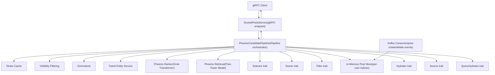
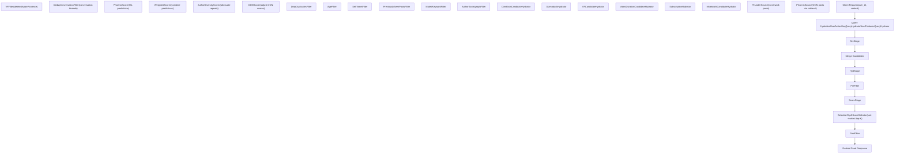
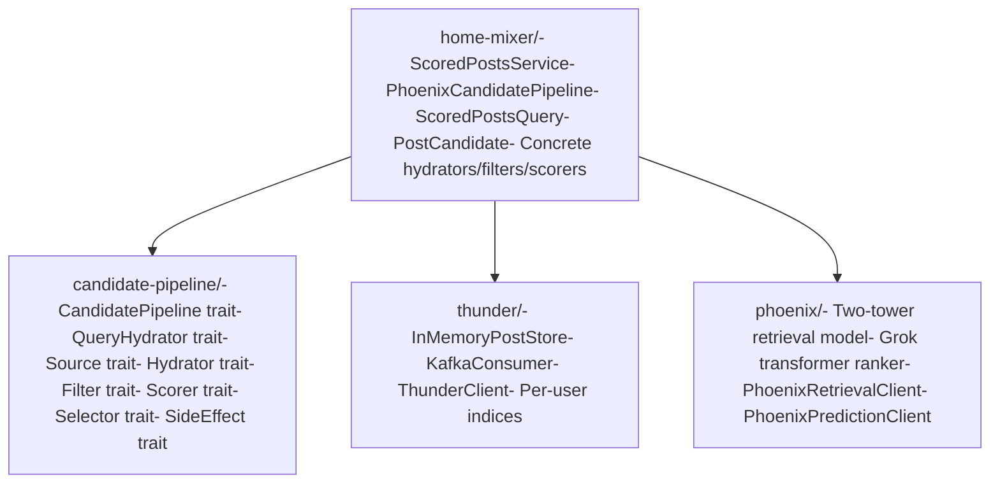

# 概览 (Overview)

相关源文件

-   [README.md](https://github.com/xai-org/x-algorithm/blob/aaa167b3/README.md?plain=1)

本文档对 X Algorithm 代码库进行了高层级的介绍，该代码库实现了“为您推荐 (For You)”馈送流推荐系统。它在概念层面上解释了系统的用途、架构组件和系统组织。

有关特定子系统的详细信息，请参阅：

-   框架内部机制：[候选管道框架 (Candidate Pipeline Framework)](/xai-org/x-algorithm/3-candidate-pipeline-framework)
-   主混频器 (Home Mixer) 实现细节：[主混频器 (Home Mixer) 实现](/xai-org/x-algorithm/4-home-mixer-implementation)
-   外部服务集成模式：[外部服务集成 (External Services Integration)](/xai-org/x-algorithm/5-external-services-integration)
-   开发设置和配置：[快速入门 (Quick Start)](/xai-org/x-algorithm/1.1-quick-start)

## 系统用途

X Algorithm 代码库包含了为 X（原 Twitter）上的“为您推荐”馈送流提供支持的核心推荐引擎。该系统从两个不同的来源检索、排序并过滤帖子：

| 来源类型 | 组件 | 用途 |
| --- | --- | --- |
| **网络内 (In-Network)** | Thunder | 用户关注的账号发布的帖子 |
| **网络外 (Out-of-Network)** | Phoenix Retrieval | 通过机器学习 (ML) 从全局语料库中发现的帖子 |

这两组候选集会被合并、充实元数据、过滤掉不符合条件的帖子，并使用基于 Grok 的 Transformer 模型进行评分，该模型用于预测用户参与的可能性。最终的馈送流是一个经过排序的帖子列表，并针对每个用户进行了相关性优化。

**来源：** [README.md1-36](https://github.com/xai-org/x-algorithm/blob/aaa167b3/README.md?plain=1#L1-L36)

## 架构组件

该系统由四个主要的子系统组成：

### 主混频器 (Home Mixer)

**位置：** [home-mixer/](https://github.com/xai-org/x-algorithm/blob/aaa167b3/home-mixer/)

这是实现 `ScoredPostsService` gRPC 端点的编排层。主混频器 (Home Mixer) 实例化并执行 `PhoenixCandidatePipeline`，后者协调候选检索、充实、过滤、评分和选择的所有阶段。它通过客户端抽象与外部服务集成，并将最终排序后的馈送流返回给客户端。

**关键类型：**

-   `ScoredPostsQuery` - 包含用户 ID 和上下文的请求查询对象
-   `PostCandidate` - 带有充实后的元数据和分数的候选帖子
-   `PhoenixCandidatePipeline` - 主管道编排器

**来源：** [README.md128-146](https://github.com/xai-org/x-algorithm/blob/aaa167b3/README.md?plain=1#L128-L146)

### Thunder

**位置：** [thunder/](https://github.com/xai-org/x-algorithm/blob/aaa167b3/thunder/)

一个实时的内存中帖子存储，维护所有用户的最新帖子。Thunder 从 Kafka 使用帖子创建/删除事件，并为网络内内容提供亚毫秒级的查找。它为每个用户维护独立的存储，用于：

-   原创帖子
-   回复和转推
-   视频帖子

帖子会根据可配置的保留期自动修剪。当用户请求其馈送流时，Thunder 会检索其关注的所有账号的帖子，而无需查询外部数据库。

**来源：** [README.md149-161](https://github.com/xai-org/x-algorithm/blob/aaa167b3/README.md?plain=1#L149-L161)

### Phoenix

**位置：** [phoenix/](https://github.com/xai-org/x-algorithm/blob/aaa167b3/phoenix/)

具有两个主要功能的机器学习 (ML) 子系统：

**1. 检索 (双塔模型 (Two-Tower Model))**

通过相似度搜索发现相关的网络外帖子：

-   **用户塔 (User Tower)：** 将用户特征和参与历史编码为嵌入向量 (embedding vector)
-   **候选塔 (Candidate Tower)：** 将所有帖子编码为嵌入向量
-   **相似度搜索：** 通过点积相似度返回前 K 个帖子

**2. 排序 (Grok Transformer)**

预测候选帖子的参与概率：

-   输入：用户上下文（参与历史）+ 候选帖子
-   架构：具有候选隔离注意力掩码 (candidate isolation attention masking) 的 Transformer
-   输出：多种动作类型（喜欢、回复、转推、点击等）的概率

候选隔离机制确保每个帖子的分数独立于批次中的其他帖子进行计算，从而实现了分数的一致性和缓存。

**来源：** [README.md164-183](https://github.com/xai-org/x-algorithm/blob/aaa167b3/README.md?plain=1#L164-L183)

### 候选管道框架 (Candidate Pipeline Framework)

**位置：** [candidate-pipeline/](https://github.com/xai-org/x-algorithm/blob/aaa167b3/candidate-pipeline/)

一个用于构建推荐管道的通用、可复用的框架。它为候选处理的每个阶段定义了基于 Trait (特性) 的抽象：

| Trait | 用途 | 执行模式 |
| --- | --- | --- |
| `QueryHydrator<Q>` | 使用用户上下文充实查询 | 并行 (Parallel) |
| `Source<Q,C>` | 检索候选集 | 并行 |
| `Hydrator<Q,C>` | 使用元数据充实候选对象 | 并行 |
| `Filter<Q,C>` | 移除不符合条件的候选对象 | 顺序 (Sequential) |
| `Scorer<Q,C>` | 为候选对象分配分数 | 顺序 |
| `Selector<Q,C>` | 排序并选择前 K 个 | 顺序 |
| `SideEffect<Q,C>` | 异步操作（日志记录、缓存） | 异步 (Async) |

该框架处理并行化、错误处理和执行编排，允许实现专注于业务逻辑。

**来源：** [README.md186-202](https://github.com/xai-org/x-algorithm/blob/aaa167b3/README.md?plain=1#L186-L202)

## 高层系统架构

下图说明了主要组件如何交互以响应“为您推荐”馈送流请求：


**描述：** 该架构展示了从客户端到排序后的馈送流响应的请求流。主混频器 (Home Mixer) 的 `ScoredPostsService` 接收 gRPC 请求并委派给实现了通用框架 trait 的 `PhoenixCandidatePipeline`。管道向 Thunder 查询网络内帖子，向 Phoenix 查询网络外帖子，通过外部服务充实候选对象，并使用 Phoenix 排序器进行评分。Thunder 通过实时的 Kafka 摄取来维护其状态。

**来源：** [README.md38-122](https://github.com/xai-org/x-algorithm/blob/aaa167b3/README.md?plain=1#L38-L122) [README.md126-202](https://github.com/xai-org/x-algorithm/blob/aaa167b3/README.md?plain=1#L126-L202)

## 管道执行流程

下图展示了 `PhoenixCandidatePipeline` 中请求处理的顺序阶段：


**描述：** 此流程图追踪了数据通过管道阶段的转换过程。查询首先使用用户上下文进行充实，然后从 Thunder 和 Phoenix 并行检索候选对象。候选对象通过并行充实器 (Hydrator) 充实元数据，按顺序进行过滤器 (Filter) 以移除不符合条件的内容，由多个评分器 (Scorer) 按顺序评分，最后选择器 (Selector) 选择前 K 个并通过选择后过滤器进行验证。

**来源：** [README.md206-239](https://github.com/xai-org/x-algorithm/blob/aaa167b3/README.md?plain=1#L206-L239)

## 代码组织

代码库被组织成与架构组件相对应的不同 Crate：


**描述：** 代码库被组织在四个主要目录中。`candidate-pipeline/` Crate 定义了用于构建推荐系统的通用 trait。`home-mixer/` Crate 提供了“为您推荐”馈送流的具体实现，包括管道编排器和所有阶段的实现。`thunder/` 和 `phoenix/` Crate 提供了主混频器 (Home Mixer) 所依赖的数据和机器学习 (ML) 服务。

**来源：** [README.md7-22](https://github.com/xai-org/x-algorithm/blob/aaa167b3/README.md?plain=1#L7-L22) [README.md128-202](https://github.com/xai-org/x-algorithm/blob/aaa167b3/README.md?plain=1#L128-L202)

## 请求处理摘要

典型的请求遵循以下模式：

1.  **客户端请求：** 带有用户 ID 和上下文的 `ScoredPostsService` gRPC 调用
2.  **查询充实：** 获取用户参与历史和特征
3.  **候选检索：**
    -   Thunder 返回所关注账号的最新帖子（网络内）
    -   Phoenix Retrieval 从全局语料库返回相似帖子（网络外）
4.  **充实：** 候选元数据（作者信息、媒体、可见性）的并行充实 (Hydration)
5.  **预评分过滤：** 移除重复内容、旧帖子、被屏蔽的作者、屏蔽的关键词
6.  **评分：**
    -   Phoenix 评分器 (Scorer) 预测参与概率
    -   加权评分器 (Weighted Scorer) 将预测结果合并为最终分数
    -   多样性评分器 (Diversity Scorer) 衰减重复的作者
7.  **选择：** 按分数排序，选择前 K 个候选对象
8.  **选择后验证：** 最终的可见性过滤和对话去重
9.  **响应：** 向客户端返回排序后的帖子列表

**来源：** [README.md206-298](https://github.com/xai-org/x-algorithm/blob/aaa167b3/README.md?plain=1#L206-L298)

## 评分机制 (Scoring Mechanism)

Phoenix 评分器 (Scorer) 为多种参与类型生成预测：

| 预测动作 | 权重方向 | 用途 |
| --- | --- | --- |
| `P(favorite)` | 正向 | 表明用户会喜欢该帖子 |
| `P(reply)` | 正向 | 表明用户会进行深度互动 |
| `P(repost)` | 正向 | 表明用户认为内容有价值 |
| `P(quote)` | 正向 | 表明用户想通过评论进行分享 |
| `P(click)` | 正向 | 表明用户对详情视图感兴趣 |
| `P(video_view)` | 正向 | 表明视频内容的参与度 |
| `P(share)` | 正向 | 表明外部分享意图 |
| `P(follow_author)` | 正向 | 表明发现了有价值的创作者 |
| `P(not_interested)` | 负向 | 表明内容不相关 |
| `P(block_author)` | 负向 | 表明强烈的内容拒绝 |
| `P(mute_author)` | 负向 | 表明对作者的疲劳感 |
| `P(report)` | 负向 | 表明内容违反政策 |

`WeightedScorer` 使用可配置的权重合并这些预测：

```
weighted_score = Σ (weight_i × P(action_i))
```
正向动作会增加分数，而负向动作会减少分数，从而压低用户可能拒绝的内容。

**来源：** [README.md242-272](https://github.com/xai-org/x-algorithm/blob/aaa167b3/README.md?plain=1#L242-L272)

## 关键设计原则

### 无人工工程特征 (No Hand-Engineered Features)

系统完全依赖于基于 Grok 的 Transformer 从用户参与序列中学习相关性模式。没有手动设计的相关性特征，这显著降低了数据管道和服务基础设施的复杂性。

### 排序期间的候选隔离 (Candidate Isolation During Ranking)

Transformer 使用特殊的注意力掩码，防止候选对象在推理期间相互关注。每个候选对象仅关注用户上下文（参与历史）。这确保了候选对象的分数独立于批次中的其他候选对象，从而实现了分数的一致性和缓存。

### 基于 Trait (特性) 的可组合性 (Trait-Based Composability)

`candidate-pipeline` 框架使用 Rust 的 Trait (特性) 为每个管道阶段定义接口。这提供了：

-   **关注点分离 (Separation of concerns)：** 管道执行逻辑与业务逻辑分离
-   **并行执行 (Parallel execution)：** 独立的阶段（来源、充实器 (Hydrator)）并行运行
-   **易于扩展 (Easy extension)：** 可以通过实现 Trait (特性) 来添加新阶段
-   **可测试性 (Testability)：** 可以使用模拟实现对阶段进行隔离测试

### 多动作预测 (Multi-Action Prediction)

模型不是预测单个“相关性”分数，而是预测许多不同动作的概率。这实现了：

-   **更丰富的信号：** 不同的参与类型携带不同的价值
-   **可配置的优化：** 可以针对每种动作类型调整权重
-   **负面反馈：** 对拒绝信号（屏蔽、静音、举报）进行显式建模
-   **副作用 (SideEffect)**：通过副作用机制处理异步非关键路径操作

**来源：** [README.md300-322](https://github.com/xai-org/x-algorithm/blob/aaa167b3/README.md?plain=1#L300-L322)

## 相关文档

有关实现细节和子系统的深入探讨，请参阅：

-   **框架设计：** [候选管道框架 (Candidate Pipeline Framework)](/xai-org/x-algorithm/3-candidate-pipeline-framework)
-   **管道阶段：** [管道执行模型 (Pipeline Execution Model)](/xai-org/x-algorithm/3.1-pipeline-execution-model) 到 [SideEffect Trait](/xai-org/x-algorithm/3.8-sideeffect-trait)
-   **主混频器 (Home Mixer) 详情：** [Phoenix 候选管道 (Phoenix Candidate Pipeline)](/xai-org/x-algorithm/4.1-phoenix-candidate-pipeline), [数据模型 (Data Models)](/xai-org/x-algorithm/4.2-data-models)
-   **候选来源：** [Thunder 来源 (Thunder Source)](/xai-org/x-algorithm/4.3.1-thunder-source), [Phoenix 检索来源 (Phoenix Retrieval Source)](/xai-org/x-algorithm/4.3.2-phoenix-retrieval-source)
-   **充实：** [查询充实器 (Query Hydrator)](/xai-org/x-algorithm/4.4-query-hydrators), [候选充实器 (Candidate Hydrator)](/xai-org/x-algorithm/4.5-candidate-hydrators)
-   **过滤：** [过滤器 (Filter)](/xai-org/x-algorithm/4.6-filters)
-   **评分：** [Phoenix 评分器 (Phoenix Scorer)](/xai-org/x-algorithm/4.7.1-phoenix-scorer), [加权评分器 (Weighted Scorer)](/xai-org/x-algorithm/4.7.2-weighted-scorer)
-   **外部服务：** [客户端架构 (Client Architecture)](/xai-org/x-algorithm/5.1-client-architecture) 到 [Strato 和其他服务 (Strato and Other Services)](/xai-org/x-algorithm/5.7-strato-and-other-services)

**来源：** [README.md1-326](https://github.com/xai-org/x-algorithm/blob/aaa167b3/README.md?plain=1#L1-L326)
