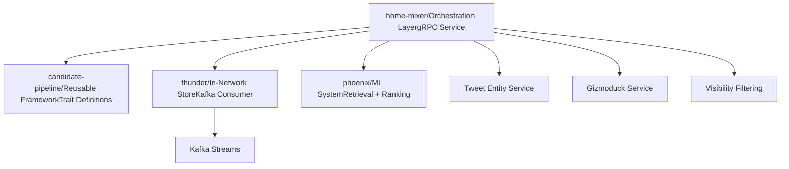

# 快速入门 (Quick Start)

相关源文件

-   [.gitignore](https://github.com/xai-org/x-algorithm/blob/aaa167b3/.gitignore)
-   [README.md](https://github.com/xai-org/x-algorithm/blob/aaa167b3/README.md?plain=1)

本指南旨在帮助开发人员设置、浏览并理解 X Algorithm 代码库的结构。它提供了项目组织、关键组件以及如何开始使用代码库的概览。

有关详细的架构信息，请参阅[架构 (Architecture)](/xai-org/x-algorithm/2-architecture)。有关特定组件的实现，请参阅[主混频器 (Home Mixer) 实现](/xai-org/x-algorithm/4-home-mixer-implementation)。

---

## 目的与范围

本页涵盖：

-   代码库结构和组织
-   主要组件的位置及其用途
-   关键代码实体及其查找位置
-   组件如何映射到整体架构
-   新加入代码库的开发人员的导航指南

这是一份引导指南。有关部署和操作的详细信息，请参阅特定组件的文档。

来源： [README.md1-326](https://github.com/xai-org/x-algorithm/blob/aaa167b3/README.md?plain=1#L1-L326)

---

## 代码库概览

X Algorithm 代码库使用模块化架构实现了“为您推荐 (For You)”馈送流推荐系统。代码库被组织成四个主要的子系统，每个子系统位于其各自的目录中。

### 高层级结构

**目录结构**

| 目录 | 用途 | 关键实体 |
| --- | --- | --- |
| `home-mixer/` | 馈送流编排和 gRPC 服务端点 | `ScoredPostsService`, `PhoenixCandidatePipeline` |
| `candidate-pipeline/` | 带有可复用 Trait (特性) 的通用管道框架 | `CandidatePipeline`, `Source`, `Hydrator`, `Filter`, `Scorer`, `Selector` |
| `thunder/` | 带有 Kafka 摄取的实时网络内帖子存储 | `ThunderSource`, `ThunderClient`, 用户独立存储 |
| `phoenix/` | 使用 Grok Transformer 进行基于 ML 的检索和评分 | `PhoenixRetrievalClient`, `PhoenixPredictionClient`, 双塔模型 (two-tower model) |

来源： [README.md126-202](https://github.com/xai-org/x-algorithm/blob/aaa167b3/README.md?plain=1#L126-L202)

---

## 组件位置与代码映射

下图将高层级的系统概念映射到其实际的代码位置，使导航代码库变得更加容易。

```mermaid
flowchart TD
    SPS["ScoredPostsService(gRPC Endpoint)"]
    PCP["PhoenixCandidatePipeline(Pipeline Implementation)"]
    SPQ["ScoredPostsQuery(Query Structure)"]
    PC["PostCandidate(Candidate Structure)"]
    TS["ThunderSource(In-Network)"]
    PS["PhoenixSource(Out-of-Network)"]
    CDCH["CoreDataCandidateHydrator"]
    GH["GizmoduckHydrator"]
    VFH["VFCandidateHydrator"]
    AF["AgeFilter"]
    ASF["AuthorSocialgraphFilter"]
    DDF["DropDuplicatesFilter"]
    PhS["PhoenixScorer"]
    WS["WeightedScorer"]
    ADS["AuthorDiversityScorer"]
    TKS["TopKScoreSelector"]
    CPT["CandidatePipeline(Trait Definition)"]
    QHT["QueryHydrator<Q>"]
    ST["Source<Q,C>"]
    HT["Hydrator<Q,C>"]
    FT["Filter<Q,C>"]
    ScT["Scorer<Q,C>"]
    SelT["Selector<Q,C>"]
    SET["SideEffect<Q,C>"]
    TC["ThunderClient(Query Interface)"]
    KI["Kafka Ingestion(Event Consumer)"]
    UPS["Per-User Stores(In-Memory)"]
    PRC["PhoenixRetrievalClient(Two-Tower Model)"]
    PPC["PhoenixPredictionClient(Grok Transformer)"]
    UT["User Tower"]
    CT["Candidate Tower"]

    SPS --> PCP
    PCP --> CPT
    TS --> ST
    PS --> ST
    CDCH --> HT
    AF --> FT
    PhS --> ScT
    TKS --> SelT
    PCP --> SPQ
    PCP --> PC
    TS --> TC
    PS --> PRC
    PhS --> PPC
    TC --> UPS
    KI --> UPS
    PRC --> UT
    PRC --> CT
```

来源： [README.md128-202](https://github.com/xai-org/x-algorithm/blob/aaa167b3/README.md?plain=1#L128-L202)

---

## 关键子系统

### home-mixer/

**目的：** 编排层，通过实现候选管道框架来组装“为您推荐”馈送流。

**关键组件：**

-   `ScoredPostsService` - 处理客户端请求的 gRPC 端点
-   `PhoenixCandidatePipeline` - 使用 `PostCandidate` 和 `ScoredPostsQuery` 类型的具体管道实现
-   查询充实器 (Query Hydrator)（例如：`UserActionSeqQueryHydrator`, `UserFeaturesQueryHydrator`）
-   候选来源 (Candidate Source)（`ThunderSource`, `PhoenixSource`）
-   候选充实器 (Candidate Hydrator)（`CoreDataCandidateHydrator`, `GizmoduckHydrator`, `VFCandidateHydrator` 等）
-   过滤器 (Filter)（`AgeFilter`, `AuthorSocialgraphFilter`, `DropDuplicatesFilter` 等）
-   评分器 (Scorer)（`PhoenixScorer`, `WeightedScorer`, `AuthorDiversityScorer`, `OONScorer`）
-   选择器 (Selector)（`TopKScoreSelector`）

**入口点：** `ScoredPostsService` gRPC 服务接收请求并调用管道。

来源： [README.md128-146](https://github.com/xai-org/x-algorithm/blob/aaa167b3/README.md?plain=1#L128-L146)

### candidate-pipeline/

**目的：** 可复用的框架，为构建推荐管道提供基于 Trait (特性) 的抽象。

**核心 Trait：**

| Trait | 类型参数 | 用途 |
| --- | --- | --- |
| `CandidatePipeline` | `Q`, `C` | 编排所有阶段的管道执行 |
| `QueryHydrator` | `Q` | 使用用户上下文充实查询 |
| `Source` | `Q`, `C` | 检索初始候选集 |
| `Hydrator` | `Q`, `C` | 使用额外数据充实候选对象 |
| `Filter` | `Q`, `C` | 移除不符合条件的候选对象 |
| `Scorer` | `Q`, `C` | 为候选对象分配分数 |
| `Selector` | `Q`, `C` | 排序并选择前 K 个候选对象 |
| `SideEffect` | `Q`, `C` | 在不阻塞的情况下执行异步操作 |

**使用模式：** 主混频器 (Home Mixer) 使用具体类型（`Q=ScoredPostsQuery`, `C=PostCandidate`）实现这些 Trait (特性)。

有关详细的 Trait (特性) 规范，请参阅[候选管道框架 (Candidate Pipeline Framework)](/xai-org/x-algorithm/3-candidate-pipeline-framework)。

来源： [README.md186-202](https://github.com/xai-org/x-algorithm/blob/aaa167b3/README.md?plain=1#L186-L202)

### thunder/

**目的：** 用于实时网络内内容的内存中帖子存储，具有基于 Kafka 的摄取功能。

**功能：**

-   从 Kafka 流中消费帖子创建/删除事件
-   为不同类型的帖子（原创帖子、回复/转推、视频帖子）维护用户独立存储
-   从关注的账号中提供网络内候选对象
-   自动修剪早于保留期的帖子
-   提供亚毫秒级的查找性能

**客户端接口：** `ThunderClient` 提供由 `ThunderSource` 使用的查询接口。

有关 Thunder 架构详情，请参阅[Thunder 来源 (Thunder Source)](/xai-org/x-algorithm/4.3.1-thunder-source)。

来源： [README.md149-161](https://github.com/xai-org/x-algorithm/blob/aaa167b3/README.md?plain=1#L149-L161)

### phoenix/

**目的：** 提供检索（双塔模型 (two-tower model)）和评分（Grok Transformer）的机器学习 (ML) 系统。

**两个主要功能：**

1.  **检索 (双塔模型 (Two-Tower Model))**

    -   `User Tower` - 编码用户特征和参与历史
    -   `Candidate Tower` - 将帖子内容编码为嵌入 (embeddings)
    -   通过点积相似度搜索查找前 K 个网络外帖子
    -   客户端接口：`PhoenixRetrievalClient`
2.  **排序 (Grok Transformer)**

    -   预测多种动作（喜欢、回复、转推等）的参与概率
    -   使用候选隔离注意力掩码 (candidate isolation attention masking)（候选对象之间不能相互关注）
    -   实现一致的、可缓存的分数
    -   客户端接口：`PhoenixPredictionClient`

有关 Phoenix 架构详情，请参阅 [Phoenix 机器学习服务 (Phoenix ML Services)](/xai-org/x-algorithm/5.5-phoenix-ml-services) 和 [Phoenix 评分器 (Phoenix Scorer)](/xai-org/x-algorithm/4.7.1-phoenix-scorer)。

来源： [README.md164-183](https://github.com/xai-org/x-algorithm/blob/aaa167b3/README.md?plain=1#L164-L183)

---

## 理解管道流程

下表将管道阶段映射到它们的实现和位置：

| 阶段 | 实现位置 | 关键类/Trait | 用途 |
| --- | --- | --- | --- |
| **查询充实 (Query Hydration)** | `home-mixer/` | `UserActionSeqQueryHydrator`, `UserFeaturesQueryHydrator` | 获取用户参与历史和特征 |
| **候选搜寻 (Candidate Sourcing)** | `home-mixer/` | `ThunderSource`, `PhoenixSource` | 检索网络内和网络外的候选对象 |
| **候选充实 (Candidate Hydration)** | `home-mixer/` | `CoreDataCandidateHydrator`, `GizmoduckHydrator`, `VFCandidateHydrator` 等 | 使用元数据充实候选对象 |
| **评分前过滤 (Pre-Scoring Filtering)** | `home-mixer/` | `AgeFilter`, `DropDuplicatesFilter`, `AuthorSocialgraphFilter` 等 | 移除不符合条件的候选对象 |
| **评分 (Scoring)** | `home-mixer/` | `PhoenixScorer`, `WeightedScorer`, `AuthorDiversityScorer` | 预测参与度并计算最终分数 |
| **选择 (Selection)** | `home-mixer/` | `TopKScoreSelector` | 按分数排序并选择前 K 个 |
| **选择后处理 (Post-Selection)** | `home-mixer/` | `VFFilter`, `DedupConversationFilter` | 最终验证和去重 |

有关详细的执行流程，请参阅[数据流和执行模型 (Data Flow and Execution Model)](/xai-org/x-algorithm/2-architecture#数据流和执行模型)。

来源： [README.md207-239](https://github.com/xai-org/x-algorithm/blob/aaa167b3/README.md?plain=1#L207-L239)

---

## 数据模型

管道对两个主要的数据结构进行操作：

### ScoredPostsQuery

包含用户上下文 and 请求参数的查询对象。这在查询充实 (Hydration) 阶段通过以下方式进行充实：

-   用户 ID 和客户端上下文
-   用户参与历史（动作序列 (action sequence)）
-   关注列表和用户特征
-   以前见过/提供过的帖子 ID
-   用于高效查找的布隆过滤器 (Bloom filters)

有关详细结构，请参阅 [ScoredPostsQuery](/xai-org/x-algorithm/4.2.1-scoredpostsquery)。

### PostCandidate

表示帖子在流经管道时的候选对象。逐步充实 (Hydration) 会添加：

-   核心推文数据（文本、作者 ID、媒体）
-   作者信息（用户名、粉丝数量）
-   Phoenix 分数（参与概率）
-   加权最终分数 (Weighted final score)
-   元数据（视频时长、订阅状态、可见性原因）

有关详细结构，请参阅 [PostCandidate](/xai-org/x-algorithm/4.2.2-postcandidate)。

来源： [README.md128-146](https://github.com/xai-org/x-algorithm/blob/aaa167b3/README.md?plain=1#L128-L146)

---

## 导航代码库

### 按用例

**我想了解候选对象是如何检索的：**

-   从 `home-mixer/` → `ThunderSource` 和 `PhoenixSource` 开始
-   请参阅[候选来源 (Candidate Sources)](/xai-org/x-algorithm/4.3-candidate-sources)

**我想了解机器学习 (ML) 模型：**

-   从 `phoenix/` → `PhoenixRetrievalClient` 和 `PhoenixPredictionClient` 开始
-   请参阅 [Phoenix 机器学习服务 (Phoenix ML Services)](/xai-org/x-algorithm/5.5-phoenix-ml-services) 和 [Phoenix 评分器 (Phoenix Scorer)](/xai-org/x-algorithm/4.7.1-phoenix-scorer)

**我想了解过滤是如何工作的：**

-   从 `home-mixer/` → 过滤器 (Filter) 实现开始
-   请参阅[过滤器 (Filters)](/xai-org/x-algorithm/4.6-filters)

**我想了解评分逻辑：**

-   从 `home-mixer/` → `PhoenixScorer`, `WeightedScorer` 开始
-   请参阅[评分器 (Scorers)](/xai-org/x-algorithm/4.7-scorers)

**我想构建一个新的管道阶段：**

-   从 `candidate-pipeline/` → Trait (特性) 定义开始
-   请参阅[候选管道框架 (Candidate Pipeline Framework)](/xai-org/x-algorithm/3-candidate-pipeline-framework)

### 按组件类型

**框架抽象：** `candidate-pipeline/`

-   通用 Trait (特性)：`Source`, `Hydrator`, `Filter`, `Scorer`, `Selector`, `SideEffect`
-   管道编排：`CandidatePipeline`

**具体实现：** `home-mixer/`

-   所有的管道阶段实现
-   数据模型：`ScoredPostsQuery`, `PostCandidate`
-   服务端点：`ScoredPostsService`

**数据源：** `thunder/`, `phoenix/`

-   网络内存储：`thunder/`
-   机器学习 (ML) 服务：`phoenix/`

来源： [README.md1-326](https://github.com/xai-org/x-algorithm/blob/aaa167b3/README.md?plain=1#L1-L326)

---

## 管道执行概览

了解执行模型有助于浏览代码：

> **[Mermaid sequence]**
> *(图表结构无法解析)*

**执行特征：**

-   **并行 (Parallel)：** 查询充实器 (Hydrator)、来源 (Source)、候选充实器 (Hydrator) 同时运行
-   **顺序 (Sequential)：** 过滤器 (Filter) 和评分器 (Scorer) 按顺序运行（每个都依赖于前一个阶段）
-   **错误处理 (Error Handling)：** 每个阶段均可配置（故障开启 (fail-open) 与故障关闭 (fail-closed)）
-   **副作用 (Side Effects)：** 在不阻塞响应的情况下异步执行

有关详细的执行语义，请参阅[管道执行模型 (Pipeline Execution Model)](/xai-org/x-algorithm/3.1-pipeline-execution-model)。

来源： [README.md207-239](https://github.com/xai-org/x-algorithm/blob/aaa167b3/README.md?plain=1#L207-L239)

---

## 后续步骤

在熟悉了代码库结构后，请探索特定领域：

**了解架构：**

-   [架构 (Architecture)](/xai-org/x-algorithm/2-architecture) - 系统组件与设计
-   [数据流和执行模型 (Data Flow and Execution Model)](/xai-org/x-algorithm/2-architecture#数据流和执行模型) - 数据如何通过各个阶段进行转换

**使用管道框架：**

-   [候选管道框架 (Candidate Pipeline Framework)](/xai-org/x-algorithm/3-candidate-pipeline-framework) - 通用 Trait (特性) 定义
-   [管道执行模型 (Pipeline Execution Model)](/xai-org/x-algorithm/3.1-pipeline-execution-model) - 编排与错误处理

**实现或修改管道阶段：**

-   [Phoenix 候选管道 (Phoenix Candidate Pipeline)](/xai-org/x-algorithm/4.1-phoenix-candidate-pipeline) - 具体实现
-   [候选来源 (Candidate Sources)](/xai-org/x-algorithm/4.3-candidate-sources) - Thunder 和 Phoenix 检索
-   [过滤器 (Filters)](/xai-org/x-algorithm/4.6-filters) - 评分前和选择后过滤
-   [评分器 (Scorers)](/xai-org/x-algorithm/4.7-scorers) - 机器学习 (ML) 预测和分数构成

**了解外部集成：**

-   [外部服务集成 (External Services Integration)](/xai-org/x-algorithm/5-external-services-integration) - 客户端架构和服务抽象

来源： [README.md1-326](https://github.com/xai-org/x-algorithm/blob/aaa167b3/README.md?plain=1#L1-L326)
