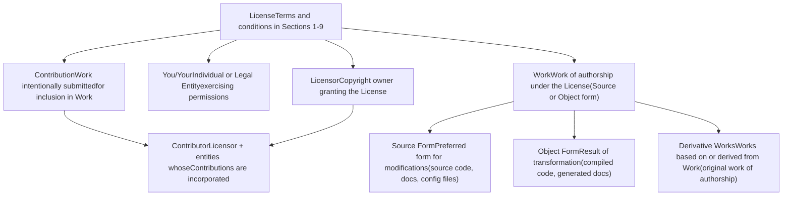
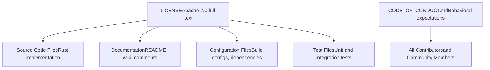
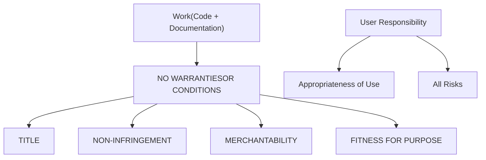
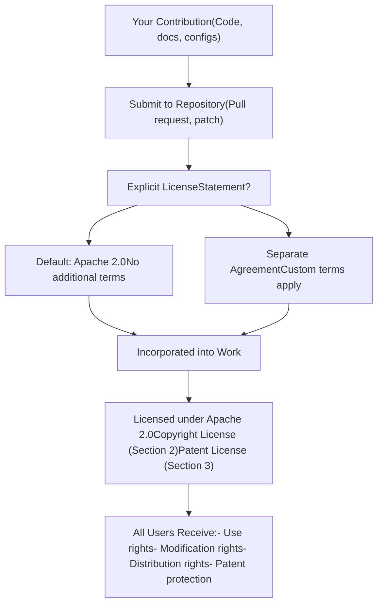

# 许可证与行为准则 (License and Code of Conduct)

相关源文件

-   [CODE\_OF\_CONDUCT.md](https://github.com/xai-org/x-algorithm/blob/aaa167b3/CODE_OF_CONDUCT.md?plain=1)
-   [LICENSE](https://github.com/xai-org/x-algorithm/blob/aaa167b3/LICENSE)

## 目的与范围

本页面记录了 X Algorithm 代码库的许可条款和社区行为预期。本代码库中的所有源代码、文档和相关材料均根据 Apache License 2.0 发布。行为准则 (Code of Conduct) 为贡献者和用户建立了社区标准。

有关代码库入门和开发环境设置的信息，请参阅[快速入门 (Quick Start)](/xai-org/x-algorithm/1.1-quick-start)。有关此许可证涵盖系统的架构详情，请参阅[概览 (Overview)](/xai-org/x-algorithm/1-overview) 和 [架构 (Architecture)](/xai-org/x-algorithm/2-architecture)。

---

## Apache License 2.0

X Algorithm 代码库根据 Apache License 2.0 版获得许可。这是一种宽松的开源许可证，授予了使用、修改和分发软件的广泛权利，同时提供专利保护并限制责任。

### 许可证概览

Apache 2.0 许可证提供以下核心许可和保护：

| 许可/保护 | 描述 |
| --- | --- |
| **使用 (Use)** | 出于任何目的自由使用软件的权利 |
| **修改 (Modification)** | 修改并创建衍生作品的权利 |
| **分发 (Distribution)** | 分发原始版本和修改后版本的权利 |
| **分许可 (Sublicensing)** | 对衍生作品进行分许可的能力 |
| **专利授予 (Patent Grant)** | 贡献者提供的明确专利许可 |
| **无担保 (No Warranty)** | 软件按“现状 (AS IS)”提供，不提供担保 |
| **有限责任 (Limited Liability)** | 贡献者不对损害负责 |

**来源：** [LICENSE1-202](https://github.com/xai-org/x-algorithm/blob/aaa167b3/LICENSE#L1-L202)

### 关键定义

该许可证定义了几个规范其应用的重要术语：


**来源：** [LICENSE7-64](https://github.com/xai-org/x-algorithm/blob/aaa167b3/LICENSE#L7-L64)

### 许可材料的范围

Apache 2.0 许可证适用于 X Algorithm 代码库中的所有材料：


**来源：** [LICENSE1-202](https://github.com/xai-org/x-algorithm/blob/aaa167b3/LICENSE#L1-L202) [CODE\_OF\_CONDUCT.md1-2](https://github.com/xai-org/x-algorithm/blob/aaa167b3/CODE_OF_CONDUCT.md?plain=1#L1-L2)

### 版权许可授予

每位贡献者向用户授予永久的、全球性的、非排他的、免费的、不可撤销的版权许可，并享有以下权利：

-   **复制 (Reproduce)** - 制作作品的副本
-   **准备衍生作品 (Prepare Derivative Works)** - 创建修改版本
-   **公开展示 (Publicly Display)** - 公开展示作品
-   **公开执行 (Publicly Perform)** - 执行或演示作品
-   **分许可 (Sublicense)** - 向他人授予权利
-   **分发 (Distribute)** - 以源代码或对象形式分享作品和衍生作品

这些权利适用于原始作品以及您创建的任何衍生作品。

**来源：** [LICENSE66-71](https://github.com/xai-org/x-algorithm/blob/aaa167b3/LICENSE#L66-L71)

### 专利许可授予

除了版权许可外，每位贡献者还授予专利许可：

-   **范围**：永久的、全球性的、非排他的、免费的、不可撤销的专利许可
-   **权利**：制造、使用、许诺销售、销售、进口和转让作品
-   **涵盖范围**：仅由贡献本身或其与作品结合而必然侵犯的专利权利要求
-   **终止条款**：如果您提起声称该作品侵权的专利诉讼，则专利许可终止

此专利授予保护用户免受贡献者关于其贡献的专利指控。

**来源：** [LICENSE73-87](https://github.com/xai-org/x-algorithm/blob/aaa167b3/LICENSE#L73-L87)

### 重新分发要求

在重新分发作品或衍生作品时，您必须遵守以下条件：

| 要求 | 描述 | 参考 |
| --- | --- | --- |
| **包含许可证 (Include License)** | 向接收者提供 Apache 2.0 许可证的副本 | [LICENSE94-95](https://github.com/xai-org/x-algorithm/blob/aaa167b3/LICENSE#L94-L95) |
| **修改通知 (Notice of Changes)** | 在修改后的文件中标明显著的修改通知 | [LICENSE97-98](https://github.com/xai-org/x-algorithm/blob/aaa167b3/LICENSE#L97-L98) |
| **保留通知 (Retain Notices)** | 保留源代码形式中的版权、专利、商标和归属通知 | [LICENSE100-104](https://github.com/xai-org/x-algorithm/blob/aaa167b3/LICENSE#L100-L104) |
| **包含 NOTICE (Include NOTICE)** | 如果存在 NOTICE 文件，请包含其归属内容的可读副本 | [LICENSE106-121](https://github.com/xai-org/x-algorithm/blob/aaa167b3/LICENSE#L106-L121) |
| **可选归属 (Optional Attribution)** | 可以在原始归属旁添加您自己的归属通知 | [LICENSE117-121](https://github.com/xai-org/x-algorithm/blob/aaa167b3/LICENSE#L117-L121) |

您可以为您自己的修改添加版权声明和许可条款，前提是它们符合原始作品的 Apache 2.0 许可证条件。

**来源：** [LICENSE89-128](https://github.com/xai-org/x-algorithm/blob/aaa167b3/LICENSE#L89-L128)

### 贡献提交与许可

> **[Mermaid sequence]**
> *(图表结构无法解析)*

**默认许可条款**：除非您另有明确说明，否则任何有意提交并包含在作品中的贡献都将自动根据 Apache 2.0 获得许可，且不附加任何条款或条件。

**来源：** [LICENSE130-136](https://github.com/xai-org/x-algorithm/blob/aaa167b3/LICENSE#L130-L136)

### 商标限制

Apache 2.0 许可证**不**授予使用以下各项的许可：

-   商号 (Trade names)
-   商标 (Trademarks)
-   服务标记 (Service marks)
-   许可人的产品名称

例外：仅允许在对作品来源进行合理和惯例的描述以及复制 NOTICE 文件内容时使用商标。

**来源：** [LICENSE138-141](https://github.com/xai-org/x-algorithm/blob/aaa167b3/LICENSE#L138-L141)

### 免责声明 (Warranty Disclaimer)

作品按**“现状 (AS IS)”**提供，并附带以下免责声明：


**用户责任**：您全权负责确定使用或重新分发作品的恰当性，并承担行使本许可证项下许可所涉及的所有风险。

**来源：** [LICENSE143-151](https://github.com/xai-org/x-algorithm/blob/aaa167b3/LICENSE#L143-L151)

### 责任限制 (Limitation of Liability)

根据以下条款，贡献者的责任有限：

| 场景 | 责任限制 |
| --- | --- |
| **侵权索赔 (Tort Claims)** | 除非法律要求（故意/重大过失行为），否则不承担责任 |
| **合同索赔 (Contract Claims)** | 除非书面同意，否则不承担责任 |
| **损害类型 (Damage Types)** | 对直接、间接、特殊、附带或后果性损害不承担责任 |
| **特定损害 (Specific Damages)** | 包括商誉损失、停工、电脑故障、商业损害 |
| **通知要求 (Notice Requirement)** | 即使贡献者已被告知发生损害的可能性，该限制仍然适用 |

**来源：** [LICENSE153-163](https://github.com/xai-org/x-algorithm/blob/aaa167b3/LICENSE#L153-L163)

### 承担额外责任

在重新分发作品或衍生作品时：

-   **可选**：您可以选择提供支持、担保、赔偿或其他责任义务
-   **要求**：此类义务必须与 Apache 2.0 许可证一致
-   **责任**：您代表您自己并承担全部责任
-   **赔偿**：您必须就因您接受额外义务而产生的任何责任对其他贡献者进行赔偿并使其免受损害

**来源：** [LICENSE165-174](https://github.com/xai-org/x-algorithm/blob/aaa167b3/LICENSE#L165-L174)

---

## 行为准则 (Code of Conduct)

X Algorithm 代码库维护着一份简单、直接的行为准则 (Code of Conduct)：

> **善待彼此 (Be excellent to each other)。**

这一原则为所有社区互动奠定了基础，包括：

-   贡献和代码审查
-   问题讨论和功能请求
-   文档改进
-   社区支持和协作

贡献者和社区成员应在所有与项目相关的活动中以尊重和建设性的方式参与。

**来源：** [CODE\_OF\_CONDUCT.md1-2](https://github.com/xai-org/x-algorithm/blob/aaa167b3/CODE_OF_CONDUCT.md?plain=1#L1-L2)

---

## 将许可证应用于贡献

### 许可证如何应用于您的工作

当向 X Algorithm 代码库投稿时，Apache 许可证通过以下机制自动适用：


**来源：** [LICENSE130-136](https://github.com/xai-org/x-algorithm/blob/aaa167b3/LICENSE#L130-L136) [LICENSE66-87](https://github.com/xai-org/x-algorithm/blob/aaa167b3/LICENSE#L66-L87)

### 版权声明模板

LICENSE 文件包含一个附录，其中包含一个推荐的版权声明模板，用于将许可证应用于您的工作：

```
Copyright [yyyy] [name of copyright owner]

Licensed under the Apache License, Version 2.0 (the "License");
you may not use this file except in compliance with the License.
You may obtain a copy of the License at

    http://www.apache.org/licenses/LICENSE-2.0

Unless required by applicable law or agreed to in writing, software
distributed under the License is distributed on an "AS IS" BASIS,
WITHOUT WARRANTIES OR CONDITIONS OF ANY KIND, either express or implied.
See the License for the specific language governing permissions and
limitations under the License.
```
此通知应根据每个文件格式置于适当的注释语法中。

**来源：** [LICENSE178-201](https://github.com/xai-org/x-algorithm/blob/aaa167b3/LICENSE#L178-L201)

---

## 摘要：关键权利与义务

### 授予用户的权利

| 权利 | 范围 | 来源章节 |
| --- | --- | --- |
| **使用 (Use)** | 任何目的，商业或非商业 | 第 2 节 |
| **修改 (Modify)** | 创建衍生作品 | 第 2 节 |
| **分发 (Distribute)** | 分享原始或修改版本 | 第 2 节 |
| **分许可 (Sublicense)** | 向下游用户授予权利 | 第 2 节 |
| **专利使用 (Patent Use)** | 使用时无来自贡献者的专利诉讼风险 | 第 3 节 |

### 重新分发时的义务

| 义务 | 要求 | 来源章节 |
| --- | --- | --- |
| **许可证副本 (License Copy)** | 包含 Apache 2.0 许可证文本 | 第 4(a) 节 |
| **修改通知 (Change Notices)** | 在修改的文件中附带通知 | 第 4(b) 节 |
| **归属 (Attribution)** | 保留版权和归属通知 | 第 4(c) 节 |
| **NOTICE 文件 (NOTICE File)** | 如果存在 NOTICE 文件，请将其包含在内 | 第 4(d) 节 |

### 免责声明与限制

| 保护 | 含义 | 来源章节 |
| --- | --- | --- |
| **无担保 (No Warranty)** | 软件按“现状 (AS IS)”提供 | 第 7 节 |
| **无责任 (No Liability)** | 贡献者不对损害负责 | 第 8 节 |
| **无商标权 (No Trademark Rights)** | 不能使用许可人的商标 | 第 6 节 |

**来源：** [LICENSE1-202](https://github.com/xai-org/x-algorithm/blob/aaa167b3/LICENSE#L1-L202)
