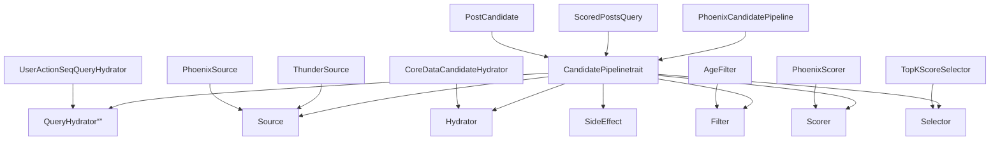
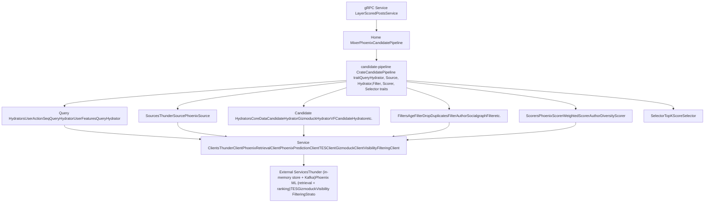
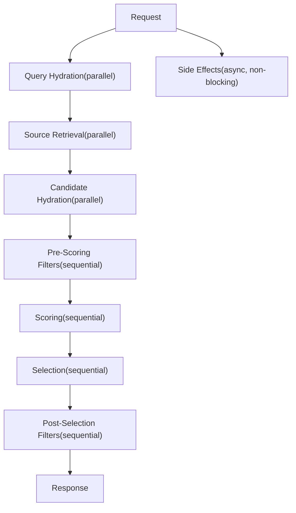

# 架构 (Architecture)

相关源文件

-   [README.md](https://github.com/xai-org/x-algorithm/blob/aaa167b3/README.md?plain=1)
-   [candidate-pipeline/lib.rs](https://github.com/xai-org/x-algorithm/blob/aaa167b3/candidate-pipeline/lib.rs)
-   [home-mixer/candidate\_pipeline/mod.rs](https://github.com/xai-org/x-algorithm/blob/aaa167b3/home-mixer/candidate_pipeline/mod.rs)

## 用途与范围

本页面提供了 X Algorithm 推荐系统的全面架构概览，重点关注基于框架的设计、组件关系和系统拓扑。有关特定组件的实现细节，请参阅[系统组件 (System Components)](/xai-org/x-algorithm/2.1-system-components)。有关执行流程和数据转换模式，请参阅[数据流与执行模型 (Data Flow and Execution Model)](/xai-org/x-algorithm/2.2-data-flow-and-execution-model)。有关详细的 Trait 规范，请参阅[候选管道框架 (Candidate Pipeline Framework)](/xai-org/x-algorithm/3-candidate-pipeline-framework)。有关具体的 Home Mixer 实现，请参阅[主混频器实现 (Home Mixer Implementation)](/xai-org/x-algorithm/4-home-mixer-implementation)。

## 架构方法

X Algorithm 系统建立在**基于框架的架构**之上，该架构将通用的推荐管道抽象与特定领域的实现分离。这种设计实现了：

-   **模块化**：每个管道阶段（来源、充实器、过滤器、评分器）都是独立实现的
-   **可复用性**：`candidate-pipeline` 框架可用于不同的推荐系统
-   **可测试性**：基于 Trait 的抽象使得模拟 (mocking) 和测试变得容易
-   **并行执行**：独立的阶段并发执行以提高性能
-   **类型安全**：泛型类型参数强制执行编译时正确性

系统由三个主要层组成：

| 层 | 用途 | 关键组件 |
| --- | --- | --- |
| **编排层 (Orchestration)** | 请求处理和管道协调 | `home-mixer`，gRPC 服务端点 |
| **框架层 (Framework)** | 通用管道执行和 Trait 定义 | `candidate-pipeline` crate |
| **服务层 (Services)** | 候选来源和外部数据提供者 | Thunder, Phoenix ML, TES, Gizmoduck |

**来源：** [README.md38-124](https://github.com/xai-org/x-algorithm/blob/aaa167b3/README.md?plain=1#L38-L124) [candidate-pipeline/lib.rs1-10](https://github.com/xai-org/x-algorithm/blob/aaa167b3/candidate-pipeline/lib.rs#L1-L10)

## 基于框架的设计

### 通用 Trait 系统

该架构建立在 `candidate-pipeline` crate 中定义的基于 Trait 的抽象层之上。每个管道阶段由一个具有查询 (`Q`) 和候选对象 (`C`) 泛型类型参数的 Trait 表示。

**基于 Trait 的架构，将代码实体映射到框架**

通用的框架 Trait 定义在：

-   `QueryHydrator`：[candidate-pipeline/query\_hydrator.rs](https://github.com/xai-org/x-algorithm/blob/aaa167b3/candidate-pipeline/query_hydrator.rs)
-   `Source`：[candidate-pipeline/source.rs](https://github.com/xai-org/x-algorithm/blob/aaa167b3/candidate-pipeline/source.rs)
-   `Hydrator`：[candidate-pipeline/hydrator.rs](https://github.com/xai-org/x-algorithm/blob/aaa167b3/candidate-pipeline/hydrator.rs)
-   `Filter`：[candidate-pipeline/filter.rs](https://github.com/xai-org/x-algorithm/blob/aaa167b3/candidate-pipeline/filter.rs)
-   `Scorer`：[candidate-pipeline/scorer.rs](https://github.com/xai-org/x-algorithm/blob/aaa167b3/candidate-pipeline/scorer.rs)
-   `Selector`：[candidate-pipeline/selector.rs](https://github.com/xai-org/x-algorithm/blob/aaa167b3/candidate-pipeline/selector.rs)
-   `SideEffect`：[candidate-pipeline/side\_effect.rs](https://github.com/xai-org/x-algorithm/blob/aaa167b3/candidate-pipeline/side_effect.rs)

Home Mixer 的实现在 [home-mixer/candidate\_pipeline/](https://github.com/xai-org/x-algorithm/blob/aaa167b3/home-mixer/candidate_pipeline/) 中提供了具体的类型和实现。

**来源：** [candidate-pipeline/lib.rs1-10](https://github.com/xai-org/x-algorithm/blob/aaa167b3/candidate-pipeline/lib.rs#L1-L10) [home-mixer/candidate\_pipeline/mod.rs1-6](https://github.com/xai-org/x-algorithm/blob/aaa167b3/home-mixer/candidate_pipeline/mod.rs#L1-L6) [README.md186-202](https://github.com/xai-org/x-algorithm/blob/aaa167b3/README.md?plain=1#L186-L202)

## 系统拓扑

### 主要组件与依赖关系

下图展示了主要的组件、它们的职责以及组件间的依赖关系：

```mermaid
flowchart TD
    GrpcClient["gRPC Client"]
    SPS["ScoredPostsServicegRPC endpoint"]
    PCP["PhoenixCandidatePipelineCandidatePipeline impl"]
    UASQH["UserActionSeqQueryHydrator"]
    UFQH["UserFeaturesQueryHydrator"]
    ThunderSrc["ThunderSourceSource<ScoredPostsQuery, PostCandidate>"]
    PhoenixSrc["PhoenixSourceSource<ScoredPostsQuery, PostCandidate>"]
    CoreHyd["CoreDataCandidateHydrator"]
    GizmoHyd["GizmoduckHydrator"]
    VFHyd["VFCandidateHydrator"]
    VideoHyd["VideoDurationCandidateHydrator"]
    SubHyd["SubscriptionHydrator"]
    InNetHyd["InNetworkCandidateHydrator"]
    DupFlt["DropDuplicatesFilter"]
    AgeFlt["AgeFilter"]
    SelfFlt["SelfTweetFilter"]
    SeenFlt["PreviouslySeenPostsFilter"]
    MuteKwFlt["MutedKeywordFilter"]
    SgFlt["AuthorSocialgraphFilter"]
    PhxScorer["PhoenixScorer"]
    WgtScorer["WeightedScorer"]
    DivScorer["AuthorDiversityScorer"]
    OONScorer["OONScorer"]
    TopK["TopKScoreSelector"]
    ThunderStore["In-Memory Post Storeper-user buckets"]
    KafkaConsumer["Kafka Consumerpost events"]
    PhxRetrieval["Phoenix RetrievalTwo-Tower Model"]
    PhxRanking["Phoenix RankingGrok Transformer"]
    TES["Tweet Entity Service"]
    Gizmoduck["Gizmoduck Service"]
    VFService["Visibility Filtering"]
    UserActionSvc["User Action Service"]
    Strato["Strato Cache"]
    Kafka["Kafka"]

    GrpcClient --> SPS
    SPS --> PCP
    PCP --> UASQH
    PCP --> UFQH
    PCP --> ThunderSrc
    PCP --> PhoenixSrc
    PCP --> CoreHyd
    PCP --> GizmoHyd
    PCP --> VFHyd
    PCP --> VideoHyd
    PCP --> SubHyd
    PCP --> InNetHyd
    PCP --> DupFlt
    PCP --> AgeFlt
    PCP --> SelfFlt
    PCP --> SeenFlt
    PCP --> MuteKwFlt
    PCP --> SgFlt
    PCP --> PhxScorer
    PCP --> WgtScorer
    PCP --> DivScorer
    PCP --> OONScorer
    PCP --> TopK
    UASQH --> UserActionSvc
    ThunderSrc --> ThunderStore
    PhoenixSrc --> PhxRetrieval
    CoreHyd --> TES
    GizmoHyd --> Gizmoduck
    VFHyd --> VFService
    VideoHyd --> TES
    SubHyd --> TES
    PhxScorer --> PhxRanking
    PCP --> Strato
    KafkaConsumer --> Kafka
    KafkaConsumer --> ThunderStore
    SPS --> GrpcClient
```

**带有代码实体名称的系统拓扑**

**来源：** [README.md38-124](https://github.com/xai-org/x-algorithm/blob/aaa167b3/README.md?plain=1#L38-L124) [README.md126-147](https://github.com/xai-org/x-algorithm/blob/aaa167b3/README.md?plain=1#L126-L147) [home-mixer/candidate\_pipeline/mod.rs1-6](https://github.com/xai-org/x-algorithm/blob/aaa167b3/home-mixer/candidate_pipeline/mod.rs#L1-L6)

### 组件职责

| 组件 | 文件位置 | 职责 |
| --- | --- | --- |
| **PhoenixCandidatePipeline** | [home-mixer/candidate\_pipeline/phoenix\_candidate\_pipeline.rs](https://github.com/xai-org/x-algorithm/blob/aaa167b3/home-mixer/candidate_pipeline/phoenix_candidate_pipeline.rs) | 管道编排、阶段执行、错误处理 |
| **ThunderSource** | [home-mixer/candidate\_pipeline/sources/thunder\_source.rs](https://github.com/xai-org/x-algorithm/blob/aaa167b3/home-mixer/candidate_pipeline/sources/thunder_source.rs) | 从 Thunder 的内存存储中检索网络内帖子 |
| **PhoenixSource** | [home-mixer/candidate\_pipeline/sources/phoenix\_source.rs](https://github.com/xai-org/x-algorithm/blob/aaa167b3/home-mixer/candidate_pipeline/sources/phoenix_source.rs) | 通过双塔模型检索网络外帖子 |
| **CoreDataCandidateHydrator** | [home-mixer/candidate\_pipeline/hydrators/core\_data.rs](https://github.com/xai-org/x-algorithm/blob/aaa167b3/home-mixer/candidate_pipeline/hydrators/core_data.rs) | 从 TES 获取推文元数据（文本、作者、媒体） |
| **GizmoduckHydrator** | [home-mixer/candidate\_pipeline/hydrators/gizmoduck.rs](https://github.com/xai-org/x-algorithm/blob/aaa167b3/home-mixer/candidate_pipeline/hydrators/gizmoduck.rs) | 获取用户个人资料数据（关注者、屏幕名称） |
| **AgeFilter** | [home-mixer/candidate\_pipeline/filters/age\_filter.rs](https://github.com/xai-org/x-algorithm/blob/aaa167b3/home-mixer/candidate_pipeline/filters/age_filter.rs) | 移除早于最大年龄阈值的帖子 |
| **PhoenixScorer** | [home-mixer/candidate\_pipeline/scorers/phoenix\_scorer.rs](https://github.com/xai-org/x-algorithm/blob/aaa167b3/home-mixer/candidate_pipeline/scorers/phoenix_scorer.rs) | 从 Grok Transformer 获取机器学习预测 |
| **WeightedScorer** | [home-mixer/candidate\_pipeline/scorers/weighted\_scorer.rs](https://github.com/xai-org/x-algorithm/blob/aaa167b3/home-mixer/candidate_pipeline/scorers/weighted_scorer.rs) | 将预测结果合并为加权相关性分数 |
| **TopKScoreSelector** | [home-mixer/candidate\_pipeline/selectors/top\_k.rs](https://github.com/xai-org/x-algorithm/blob/aaa167b3/home-mixer/candidate_pipeline/selectors/top_k.rs) | 按分数排序并选择前 K 个候选对象 |

**来源：** [README.md126-147](https://github.com/xai-org/x-algorithm/blob/aaa167b3/README.md?plain=1#L126-L147) [home-mixer/candidate\_pipeline/mod.rs1-6](https://github.com/xai-org/x-algorithm/blob/aaa167b3/home-mixer/candidate_pipeline/mod.rs#L1-L6)

## 组件分层

系统遵循分层架构，各层关注点分离：

**分层架构**

| 层 | 职责 | 特点 |
| --- | --- | --- |
| **1. 请求/响应层** | 处理 gRPC 请求、序列化/反序列化 | 协议相关，较薄 |
| **2. 编排层** | 协调管道执行、管理状态 | 业务逻辑编排 |
| **3. 框架层** | 定义管道抽象、执行模型 | 通用、可复用、可测试 |
| **4. 领域逻辑层** | 实现具体的阶段行为 | 领域相关、可插拔 |
| **5. 客户端抽象层** | 抽象外部服务通信 | 可模拟、依赖注入 |
| **6. 外部服务层** | 提供数据和机器学习预测 | 独立服务 |

**来源：** [README.md38-124](https://github.com/xai-org/x-algorithm/blob/aaa167b3/README.md?plain=1#L38-L124) [candidate-pipeline/lib.rs1-10](https://github.com/xai-org/x-algorithm/blob/aaa167b3/candidate-pipeline/lib.rs#L1-L10)

## 执行模型概览

管道执行遵循**多阶段顺序过程**，其中每个阶段可能在内部并行执行其操作：

**管道执行阶段**

### 并行与顺序执行

| 阶段 | 执行模式 | 理由 |
| --- | --- | --- |
| **查询充实 (Query Hydration)** | 并行 | 充实器相互独立；并发获取用户数据 |
| **来源检索 (Source Retrieval)** | 并行 | Thunder 和 Phoenix 来源相互独立 |
| **候选充实 (Candidate Hydration)** | 并行 | 充实器独立充实不同的字段 |
| **预评分过滤器 (Pre-Scoring Filters)** | 顺序 | 每个过滤器都依赖于前一个过滤器的输出 |
| **评分 (Scoring)** | 顺序 | 评分器可能依赖于先前的分数（例如，作者多样性衰减） |
| **选择 (Selection)** | 顺序 | 从已评分的候选对象中排序并选择前 K 个 |
| **选择后过滤器 (Post-Selection Filters)** | 顺序 | 对选定的候选对象进行最终验证 |
| **副作用 (Side Effects)** | 异步 | 不影响响应的非阻塞操作 |

有关详细的数据流和转换模式，请参阅[数据流与执行模型 (Data Flow and Execution Model)](/xai-org/x-algorithm/2.2-data-flow-and-execution-model)。

**来源：** [README.md205-239](https://github.com/xai-org/x-algorithm/blob/aaa167b3/README.md?plain=1#L205-L239)

## 代码组织

代码库被组织成直接映射到架构层的 Crate：

**映射到架构的代码库结构**

### 模块映射表

| 架构组件 | Crate/模块路径 | 关键文件 |
| --- | --- | --- |
| **框架 Trait** | `candidate-pipeline/` | `lib.rs`，Trait 文件 |
| **管道实现** | `home-mixer/candidate_pipeline/` | `phoenix_candidate_pipeline.rs` |
| **数据模型** | `home-mixer/candidate_pipeline/` | `query.rs`, `candidate.rs`, `*_features.rs` |
| **来源** | `home-mixer/candidate_pipeline/sources/` | `thunder_source.rs`, `phoenix_source.rs` |
| **充实器 (Hydrators)** | `home-mixer/candidate_pipeline/hydrators/` | 多个 `*_hydrator.rs` 文件 |
| **过滤器 (Filters)** | `home-mixer/candidate_pipeline/filters/` | 多个 `*_filter.rs` 文件 |
| **评分器 (Scorers)** | `home-mixer/candidate_pipeline/scorers/` | 多个 `*_scorer.rs` 文件 |
| **Thunder 服务** | `thunder/` | `store.rs`, `kafka_consumer.rs` |
| **Phoenix 机器学习** | `phoenix/` | `retrieval/`, `ranking/` |

**来源：** [candidate-pipeline/lib.rs1-10](https://github.com/xai-org/x-algorithm/blob/aaa167b3/candidate-pipeline/lib.rs#L1-L10) [home-mixer/candidate\_pipeline/mod.rs1-6](https://github.com/xai-org/x-algorithm/blob/aaa167b3/home-mixer/candidate_pipeline/mod.rs#L1-L6) [README.md130-183](https://github.com/xai-org/x-algorithm/blob/aaa167b3/README.md?plain=1#L130-L183)

## 关键架构属性

### 模块化与可组合性

基于 Trait 的设计实现了：

-   **独立开发**：每个组件都实现了一个定义良好的 Trait 接口
-   **灵活组合**：管道阶段可以添加、移除或重新排序
-   **易于测试**：Trait 可以被模拟，而无需依赖外部服务
-   **并行执行**：独立的阶段并发运行以提高性能

### 类型安全

泛型类型参数 (`Q`, `C`) 强制执行：

-   **编译时正确性**：查询和候选对象类型必须在所有阶段匹配
-   **类型安全转换**：每个阶段的输入/输出类型都在编译时进行验证
-   **明确字段所有权**：充实器和评分器声明了它们填充哪些候选对象字段

### 关注点分离

该架构分离了：

-   **框架逻辑**：通用的管道执行和编排
-   **业务逻辑**：特定领域的过滤、评分、充实规则
-   **外部通信**：客户端抽象隔离了服务依赖
-   **数据模型**：类型定义与处理逻辑分离

有关详细的组件规范，请参阅[系统组件 (System Components)](/xai-org/x-algorithm/2.1-system-components)。有关执行模式和数据转换，请参阅[数据流与执行模型 (Data Flow and Execution Model)](/xai-org/x-algorithm/2.2-data-flow-and-execution-model)。

**来源：** [README.md301-320](https://github.com/xai-org/x-algorithm/blob/aaa167b3/README.md?plain=1#L301-L320)
