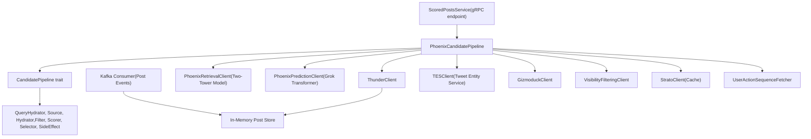
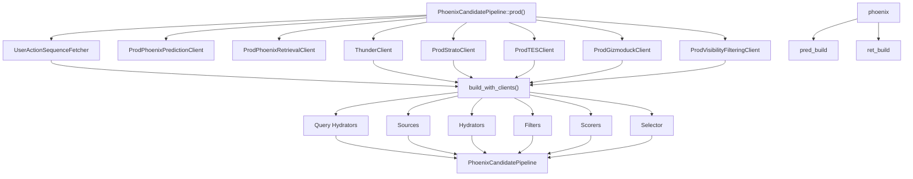
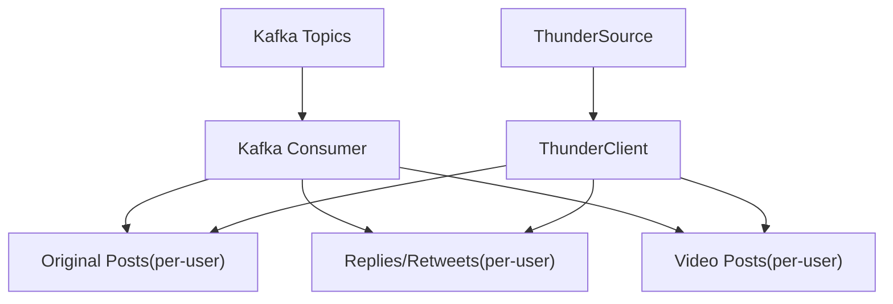
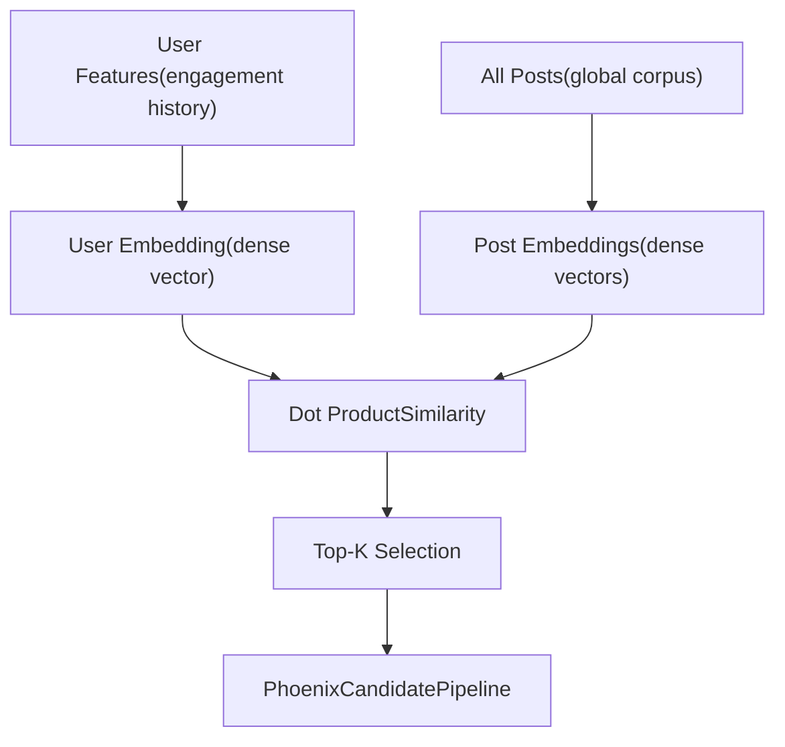
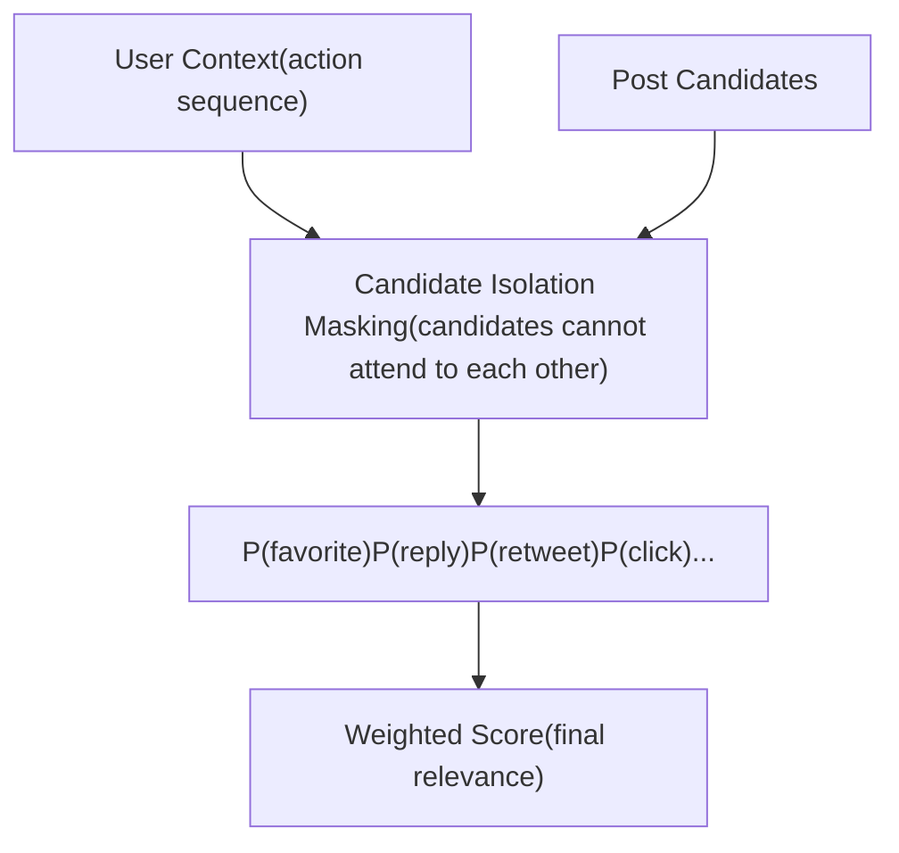
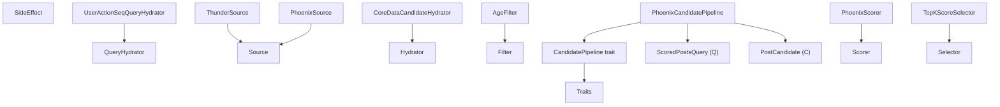
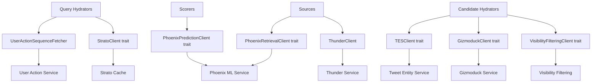

# 系统组件 (System Components)

相关源文件

-   [README.md](https://github.com/xai-org/x-algorithm/blob/aaa167b3/README.md?plain=1)
-   [home-mixer/candidate\_pipeline/phoenix\_candidate\_pipeline.rs](https://github.com/xai-org/x-algorithm/blob/aaa167b3/home-mixer/candidate_pipeline/phoenix_candidate_pipeline.rs)

## 用途与范围

本文档详细介绍了 X Algorithm 系统的主要组件及其职责。该系统由四个主要组件组成：**主混频器 (Home Mixer)**（编排）、**Thunder**（网络内存储）、**Phoenix**（机器学习检索与评分）以及**候选管道框架 (Candidate Pipeline Framework)**（通用抽象）。

有关通过这些组件的执行流程，请参阅[数据流与执行模型 (Data Flow and Execution Model)](/xai-org/x-algorithm/2.2-data-flow-and-execution-model)。有关框架的基于 Trait 的抽象细节，请参阅[候选管道框架 (Candidate Pipeline Framework)](/xai-org/x-algorithm/3-candidate-pipeline-framework)。有关管道阶段的具体实现，请参阅[主混频器实现 (Home Mixer Implementation)](/xai-org/x-algorithm/4-home-mixer-implementation)。

---

## 组件架构概览

下图展示了主要组件及其关系：


**来源：** [README.md1-326](https://github.com/xai-org/x-algorithm/blob/aaa167b3/README.md?plain=1#L1-L326) [home-mixer/candidate\_pipeline/phoenix\_candidate\_pipeline.rs1-256](https://github.com/xai-org/x-algorithm/blob/aaa167b3/home-mixer/candidate_pipeline/phoenix_candidate_pipeline.rs#L1-L256)

---

## 主混频器 (Home Mixer)

主混频器是编排层，负责协调整个“为您推荐”馈送流生成过程。它实现了 `CandidatePipeline` Trait 来执行多阶段推荐管道。

### PhoenixCandidatePipeline

`PhoenixCandidatePipeline` 结构体是“为您推荐”馈送流管道的具体实现。定义见 [home-mixer/candidate\_pipeline/phoenix\_candidate\_pipeline.rs60-70](https://github.com/xai-org/x-algorithm/blob/aaa167b3/home-mixer/candidate_pipeline/phoenix_candidate_pipeline.rs#L60-L70)。

**关键职责：**

-   编排查询充实、候选来源检索、充实、过滤、评分和选择
-   使用生产环境客户端初始化并配置所有管道阶段
-   为馈送流生成请求提供主入口点

**管道阶段：**

| 阶段 | 组件 | 执行模式 |
| --- | --- | --- |
| 查询充实器 | `UserActionSeqQueryHydrator`, `UserFeaturesQueryHydrator` | 并行 |
| 来源 | `PhoenixSource`, `ThunderSource` | 并行 |
| 充实器 | `CoreDataCandidateHydrator`, `GizmoduckCandidateHydrator`, `VFCandidateHydrator`, `VideoDurationCandidateHydrator`, `SubscriptionHydrator`, `InNetworkCandidateHydrator` | 并行 |
| 过滤器 | `DropDuplicatesFilter`, `CoreDataHydrationFilter`, `AgeFilter`, `SelfTweetFilter`, `RetweetDeduplicationFilter`, `IneligibleSubscriptionFilter`, `PreviouslySeenPostsFilter`, `PreviouslyServedPostsFilter`, `MutedKeywordFilter`, `AuthorSocialgraphFilter` | 顺序 |
| 评分器 | `PhoenixScorer`, `WeightedScorer`, `AuthorDiversityScorer`, `OONScorer` | 顺序 |
| 选择器 | `TopKScoreSelector` | 单个 |
| 选择后充实器 | `VFCandidateHydrator` | 并行 |
| 选择后过滤器 | `VFFilter`, `DedupConversationFilter` | 顺序 |
| 副作用 | `CacheRequestInfoSideEffect` | 异步 |

### 组件初始化


`prod()` 方法在 [home-mixer/candidate\_pipeline/phoenix\_candidate\_pipeline.rs162-212](https://github.com/xai-org/x-algorithm/blob/aaa167b3/home-mixer/candidate_pipeline/phoenix_candidate_pipeline.rs#L162-L212) 中初始化所有生产客户端并构造管道。`build_with_clients()` 方法在 [home-mixer/candidate\_pipeline/phoenix\_candidate\_pipeline.rs73-160](https://github.com/xai-org/x-algorithm/blob/aaa167b3/home-mixer/candidate_pipeline/phoenix_candidate_pipeline.rs#L73-L160) 中通过依赖注入组装管道阶段。

**来源：** [home-mixer/candidate\_pipeline/phoenix\_candidate\_pipeline.rs1-256](https://github.com/xai-org/x-algorithm/blob/aaa167b3/home-mixer/candidate_pipeline/phoenix_candidate_pipeline.rs#L1-L256) [README.md128-146](https://github.com/xai-org/x-algorithm/blob/aaa167b3/README.md?plain=1#L128-L146)

---

## Thunder

Thunder 是一个内存中帖子存储，维护所有用户最新帖子的实时状态。它提供网络内候选对象（来自请求用户关注的账号的帖子）的亚毫秒级检索。

### 架构


**关键特性：**

-   **实时摄取**：从 Kafka 消费帖子创建/删除事件
-   **按用户存储**：为每个用户的帖子维护独立的存储，按帖子类型组织
-   **自动修剪**：移除早于保留期的帖子
-   **快速检索**：无需访问外部数据库即可实现亚毫秒级查找
-   **侧重于网络内**：仅返回来自请求用户关注账号的候选对象

### 与管道集成

[home-mixer/candidate\_pipeline/phoenix\_candidate\_pipeline.rs95](https://github.com/xai-org/x-algorithm/blob/aaa167b3/home-mixer/candidate_pipeline/phoenix_candidate_pipeline.rs#L95-L95) 中的 `ThunderSource` 组件包装了 `ThunderClient` 并实现了 `Source` Trait。管道执行时，它会根据用户的关注列表向 Thunder 查询网络内候选对象。

**来源：** [README.md149-161](https://github.com/xai-org/x-algorithm/blob/aaa167b3/README.md?plain=1#L149-L161) [home-mixer/candidate\_pipeline/phoenix\_candidate\_pipeline.rs19-176](https://github.com/xai-org/x-algorithm/blob/aaa167b3/home-mixer/candidate_pipeline/phoenix_candidate_pipeline.rs#L19-L176)

---

## Phoenix

Phoenix 是机器学习 (ML) 组件，负责候选检索（发现相关的网络外内容）和候选评分（对所有候选对象的相关性进行评分）。它由两个主要的子系统组成：

### Phoenix 检索 (双塔模型)


检索系统使用双塔架构，用户和帖子被独立编码到嵌入空间中。[home-mixer/candidate\_pipeline/phoenix\_candidate\_pipeline.rs13-174](https://github.com/xai-org/x-algorithm/blob/aaa167b3/home-mixer/candidate_pipeline/phoenix_candidate_pipeline.rs#L13-L174) 中的 `PhoenixRetrievalClient` 执行相似度搜索，以发现相关的网络外内容。

**集成：** [home-mixer/candidate\_pipeline/phoenix\_candidate\_pipeline.rs43-94](https://github.com/xai-org/x-algorithm/blob/aaa167b3/home-mixer/candidate_pipeline/phoenix_candidate_pipeline.rs#L43-L94) 中的 `PhoenixSource` 包装了检索客户端并实现了 `Source` Trait。

### Phoenix 评分 (Grok Transformer)


评分系统使用基于 Grok 的 Transformer，通过特殊的注意力掩码来预测参与概率。**候选隔离 (candidate isolation)** 设计确保候选对象的分数不取决于批次中的其他候选对象，从而实现了分数的一致性和缓存。

**关键预测：**

-   `P(favorite)` - 喜欢帖子的概率
-   `P(reply)` - 回复的概率
-   `P(retweet)` - 转发的概率
-   `P(quote)` - 引用推文的概率
-   `P(click)` - 点击帖子的概率
-   `P(profile_click)` - 点击作者个人资料的概率
-   `P(video_view)` - 观看视频的概率
-   `P(photo_expand)` - 展开照片的概率
-   `P(share)` - 外部分享的概率
-   `P(dwell)` - 在帖子停留的概率
-   `P(follow_author)` - 关注作者的概率
-   `P(not_interested)` - 标记“不感兴趣”的概率（负向信号）
-   `P(block_author)` - 屏蔽作者的概率（负向信号）
-   `P(mute_author)` - 静音作者的概率（负向信号）
-   `P(report)` - 举报帖子的概率（负向信号）

**集成：** [home-mixer/candidate\_pipeline/phoenix\_candidate\_pipeline.rs39-123](https://github.com/xai-org/x-algorithm/blob/aaa167b3/home-mixer/candidate_pipeline/phoenix_candidate_pipeline.rs#L39-L123) 中的 `PhoenixScorer` 包装了 [home-mixer/candidate\_pipeline/phoenix\_candidate\_pipeline.rs10-169](https://github.com/xai-org/x-algorithm/blob/aaa167b3/home-mixer/candidate_pipeline/phoenix_candidate_pipeline.rs#L10-L169) 中的 `PhoenixPredictionClient` 并实现了 `Scorer` Trait。

**来源：** [README.md163-183](https://github.com/xai-org/x-algorithm/blob/aaa167b3/README.md?plain=1#L163-L183) [README.md244-272](https://github.com/xai-org/x-algorithm/blob/aaa167b3/README.md?plain=1#L244-L272) [home-mixer/candidate\_pipeline/phoenix\_candidate\_pipeline.rs10-174](https://github.com/xai-org/x-algorithm/blob/aaa167b3/home-mixer/candidate_pipeline/phoenix_candidate_pipeline.rs#L10-L174)

---

## 候选管道框架 (Candidate Pipeline Framework)

候选管道框架是一个通用的、可复用的系统，用于构建推荐管道。它提供了基于 Trait 的抽象，将管道编排与业务逻辑分离开来。

### 框架架构


### 类型参数

该框架有两个参数化类型：

-   **Q (Query)**：代表用户请求和上下文的查询类型（例如 `ScoredPostsQuery`）
-   **C (Candidate)**：代表待排序项的候选对象类型（例如 `PostCandidate`）

### 阶段 Trait 摘要

| Trait | 用途 | 执行方式 | 所有权 |
| --- | --- | --- | --- |
| `QueryHydrator<Q>` | 使用用户上下文充实查询 | 并行 | 修改查询 |
| `Source<Q, C>` | 获取初始候选对象 | 并行 | 产出候选对象 |
| `Hydrator<Q, C>` | 使用数据充实候选对象 | 并行 | 修改候选对象 |
| `Filter<Q, C>` | 移除不符合条件的候选对象 | 顺序 | 划分候选对象 |
| `Scorer<Q, C>` | 分配排序分数 | 顺序 | 修改候选对象 |
| `Selector<Q, C>` | 选择前 K 个候选对象 | 单个 | 选择子集 |
| `SideEffect<Q, C>` | 异步非阻塞操作 | 异步 (即发即弃) | 只读 |

### 实现映射

`PhoenixCandidatePipeline` 在 [home-mixer/candidate\_pipeline/phoenix\_candidate\_pipeline.rs215-255](https://github.com/xai-org/x-algorithm/blob/aaa167b3/home-mixer/candidate_pipeline/phoenix_candidate_pipeline.rs#L215-L255) 中实现了 `CandidatePipeline` Trait。Trait 方法返回对管道阶段集合的引用：

```
query_hydrators() -> &[Box<dyn QueryHydrator<ScoredPostsQuery>>]
sources() -> &[Box<dyn Source<ScoredPostsQuery, PostCandidate>>]
hydrators() -> &[Box<dyn Hydrator<ScoredPostsQuery, PostCandidate>>]
filters() -> &[Box<dyn Filter<ScoredPostsQuery, PostCandidate>>]
scorers() -> &[Box<dyn Scorer<ScoredPostsQuery, PostCandidate>>]
selector() -> &dyn Selector<ScoredPostsQuery, PostCandidate>
post_selection_hydrators() -> &[Box<dyn Hydrator<ScoredPostsQuery, PostCandidate>>]
post_selection_filters() -> &[Box<dyn Filter<ScoredPostsQuery, PostCandidate>>]
side_effects() -> Arc<Vec<Box<dyn SideEffect<ScoredPostsQuery, PostCandidate>>>>
result_size() -> usize
```
**来源：** [home-mixer/candidate\_pipeline/phoenix\_candidate\_pipeline.rs48-255](https://github.com/xai-org/x-algorithm/blob/aaa167b3/home-mixer/candidate_pipeline/phoenix_candidate_pipeline.rs#L48-L255) [README.md186-202](https://github.com/xai-org/x-algorithm/blob/aaa167b3/README.md?plain=1#L186-L202)

---

## 外部服务集成层

管道通过客户端抽象与外部服务交互。这种分层架构提供了隔离性、可测试性以及独立的服务演进。

### 客户端架构


### 客户端 Trait 与生产实现

| 客户端 Trait | 生产实现 | 使用者 | 用途 |
| --- | --- | --- | --- |
| `PhoenixRetrievalClient` | `ProdPhoenixRetrievalClient` | `PhoenixSource` | 双塔检索 |
| `PhoenixPredictionClient` | `ProdPhoenixPredictionClient` | `PhoenixScorer` | Grok Transformer 评分 |
| `ThunderClient` | `ThunderClient` | `ThunderSource` | 网络内帖子检索 |
| `TESClient` | `ProdTESClient` | `CoreDataCandidateHydrator`, `VideoDurationCandidateHydrator`, `SubscriptionHydrator` | 推文元数据 |
| `GizmoduckClient` | `ProdGizmoduckClient` | `GizmoduckCandidateHydrator` | 用户个人资料数据 |
| `VisibilityFilteringClient` | `ProdVisibilityFilteringClient` | `VFCandidateHydrator`, `VFFilter` | 内容安全过滤 |
| `StratoClient` | `ProdStratoClient` | `UserFeaturesQueryHydrator`, `CacheRequestInfoSideEffect` | 缓存与特征存储 |
| `UserActionSequenceFetcher` | `UserActionSequenceFetcher` | `UserActionSeqQueryHydrator` | 用户参与历史 |

所有生产客户端实现都在 [home-mixer/candidate\_pipeline/phoenix\_candidate\_pipeline.rs162-212](https://github.com/xai-org/x-algorithm/blob/aaa167b3/home-mixer/candidate_pipeline/phoenix_candidate_pipeline.rs#L162-L212) 的 `prod()` 方法中初始化。

**来源：** [home-mixer/candidate\_pipeline/phoenix\_candidate\_pipeline.rs1-212](https://github.com/xai-org/x-algorithm/blob/aaa167b3/home-mixer/candidate_pipeline/phoenix_candidate_pipeline.rs#L1-L212) [README.md128-146](https://github.com/xai-org/x-algorithm/blob/aaa167b3/README.md?plain=1#L128-L146)

---

## 组件交互摘要

下表总结了主要组件的交互方式：

| 组件 | 依赖于 | 提供 | 通信方法 |
| --- | --- | --- | --- |
| **主混频器 (Home Mixer)** | Thunder, Phoenix, 外部服务 | 排序后的馈送流结果 | 通过管道执行进行编排 |
| **Thunder** | Kafka | 网络内候选对象 | 通过用户 ID 进行内存查询 |
| **Phoenix 检索** | 全局帖子语料库 | 网络外候选对象 | 双塔相似度搜索 |
| **Phoenix 评分** | 用户动作序列、候选对象 | 参与预测 | Grok Transformer 推理 |
| **候选管道框架** | 无（通用） | 执行模型 | 基于 Trait 的抽象 |
| **外部服务** | 服务特定的后端 | 数据充实 | gRPC, Thrift 或自定义协议 |

**来源：** [README.md1-326](https://github.com/xai-org/x-algorithm/blob/aaa167b3/README.md?plain=1#L1-L326) [home-mixer/candidate\_pipeline/phoenix\_candidate\_pipeline.rs1-256](https://github.com/xai-org/x-algorithm/blob/aaa167b3/home-mixer/candidate_pipeline/phoenix_candidate_pipeline.rs#L1-L256)
