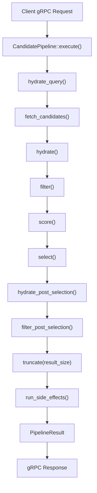
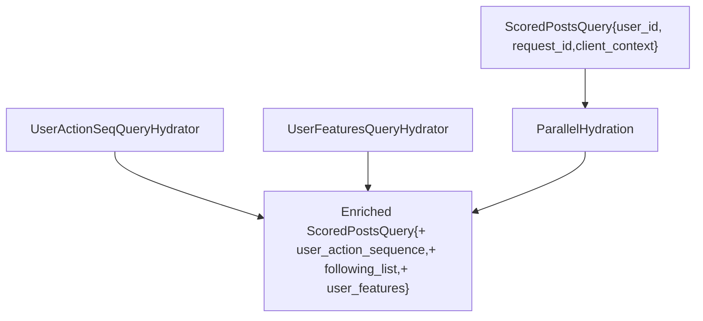
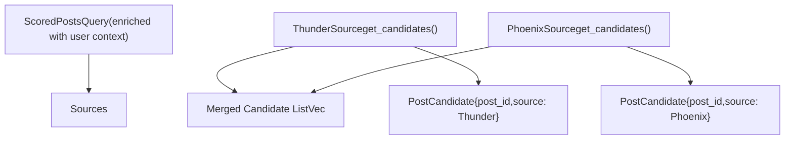
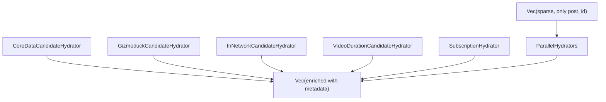
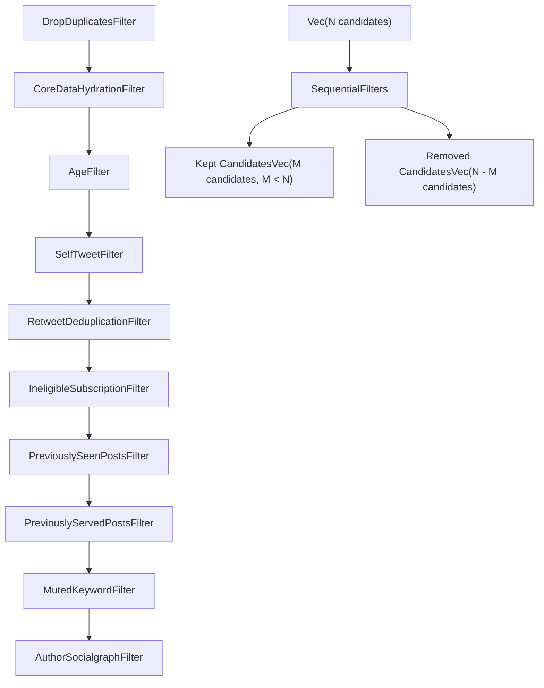
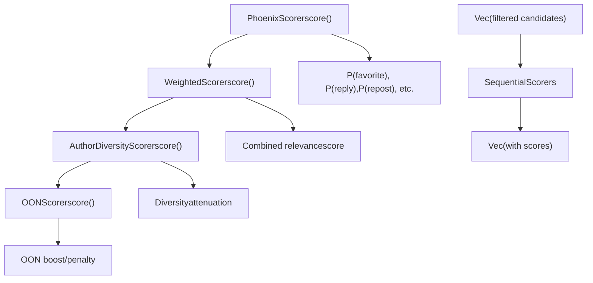
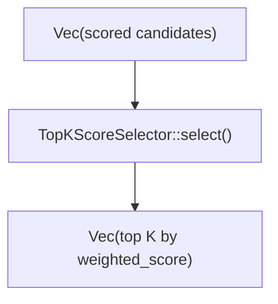
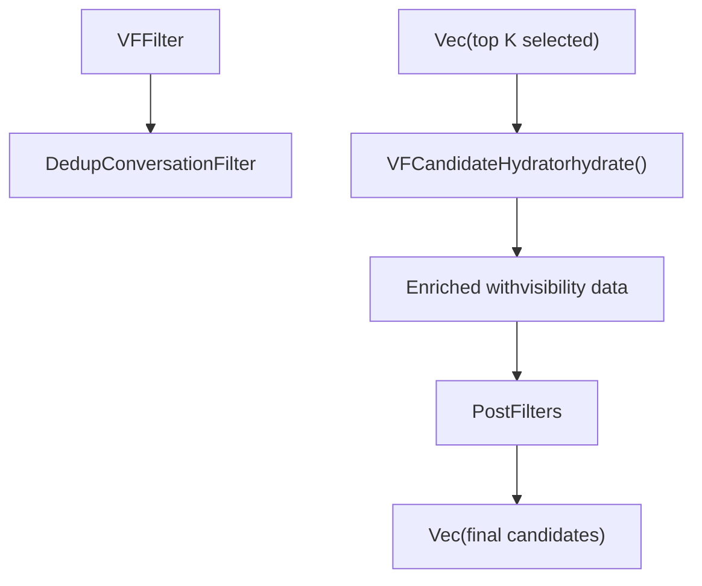
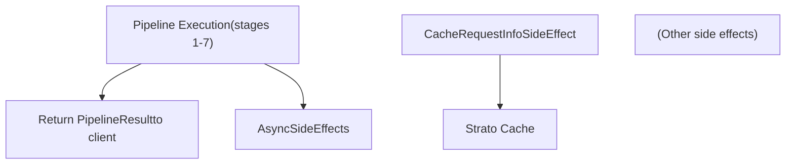
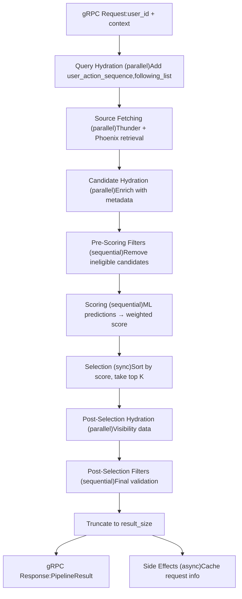

# 数据流与执行模型 (Data Flow and Execution Model)

相关源文件

-   [README.md](https://github.com/xai-org/x-algorithm/blob/aaa167b3/README.md?plain=1)
-   [candidate-pipeline/candidate\_pipeline.rs](https://github.com/xai-org/x-algorithm/blob/aaa167b3/candidate-pipeline/candidate_pipeline.rs)
-   [home-mixer/candidate\_pipeline/phoenix\_candidate\_pipeline.rs](https://github.com/xai-org/x-algorithm/blob/aaa167b3/home-mixer/candidate_pipeline/phoenix_candidate_pipeline.rs)

## 用途与范围

本文档解释了数据如何流经“为您推荐 (For You)”馈送流推荐管道，从最初的查询输入到最终排序后的馈送流输出。它涵盖了每个阶段查询和候选对象数据结构的转换、管道框架所采用的并行和顺序执行模式，以及协调阶段转换的编排逻辑。

有关单个管道组件（来源、充实器、过滤器、评分器）的详细信息，请参阅[系统组件 (System Components)](/xai-org/x-algorithm/2.1-system-components)。有关框架级抽象和 Trait 定义，请参阅[候选管道框架 (Candidate Pipeline Framework)](/xai-org/x-algorithm/3-candidate-pipeline-framework)。

**来源：** [candidate-pipeline/candidate\_pipeline.rs1-329](https://github.com/xai-org/x-algorithm/blob/aaa167b3/candidate-pipeline/candidate_pipeline.rs#L1-L329) [README.md1-326](https://github.com/xai-org/x-algorithm/blob/aaa167b3/README.md?plain=1#L1-L326)

---

## 管道执行流程

管道执行遵循由 `CandidatePipeline::execute` 方法编排的固定阶段序列。每个阶段都会转换查询对象或候选列表，数据从输入到输出单向流动。

### 高层级执行序列


**来源：** [candidate-pipeline/candidate\_pipeline.rs53-92](https://github.com/xai-org/x-algorithm/blob/aaa167b3/candidate-pipeline/candidate_pipeline.rs#L53-L92)

---

## 查询数据流

查询对象 (`ScoredPostsQuery`) 在初始充实阶段被充实，然后以只读方式传递给所有后续阶段。

### 查询充实阶段 (Query Hydration Stage)


| 查询充实器 | 添加的数据 | 源代码 |
| --- | --- | --- |
| `UserActionSeqQueryHydrator` | `user_action_sequence: Vec<UserAction>` | [home-mixer/query\_hydrators/user\_action\_seq\_query\_hydrator.rs](https://github.com/xai-org/x-algorithm/blob/aaa167b3/home-mixer/query_hydrators/user_action_seq_query_hydrator.rs) |
| `UserFeaturesQueryHydrator` | `following_list: Vec<UserId>`，用户特征字段 | [home-mixer/query\_hydrators/user\_features\_query\_hydrator.rs](https://github.com/xai-org/x-algorithm/blob/aaa167b3/home-mixer/query_hydrators/user_features_query_hydrator.rs) |

**执行模式：** 查询充实器使用 `join_all()` 并行运行。每个充实器产出部分结果，并通过 `update()` 方法将其合并到查询对象中。

**来源：** [candidate-pipeline/candidate\_pipeline.rs95-123](https://github.com/xai-org/x-algorithm/blob/aaa167b3/candidate-pipeline/candidate_pipeline.rs#L95-L123) [home-mixer/candidate\_pipeline/phoenix\_candidate\_pipeline.rs84-89](https://github.com/xai-org/x-algorithm/blob/aaa167b3/home-mixer/candidate_pipeline/phoenix_candidate_pipeline.rs#L84-L89)

---

## 候选对象数据流

候选对象经过多个转换阶段，每个阶段都会充实、过滤或对候选列表进行评分。

### 阶段 1：候选检索 (Candidate Retrieval)


**执行模式：** 来源并行执行。结果被收集并连接成单个候选列表。

**来源：** [candidate-pipeline/candidate\_pipeline.rs125-157](https://github.com/xai-org/x-algorithm/blob/aaa167b3/candidate-pipeline/candidate_pipeline.rs#L125-L157) [home-mixer/candidate\_pipeline/phoenix\_candidate\_pipeline.rs92-97](https://github.com/xai-org/x-algorithm/blob/aaa167b3/home-mixer/candidate_pipeline/phoenix_candidate_pipeline.rs#L92-L97)

---

### 阶段 2：候选充实 (Candidate Hydration)


| 充实器 | 添加的字段 | 外部服务 | 源代码 |
| --- | --- | --- | --- |
| `CoreDataCandidateHydrator` | `core_data: CoreData`（文本、author\_id、时间戳等） | 推文实体服务 (Tweet Entity Service) | [home-mixer/candidate\_hydrators/core\_data\_candidate\_hydrator.rs](https://github.com/xai-org/x-algorithm/blob/aaa167b3/home-mixer/candidate_hydrators/core_data_candidate_hydrator.rs) |
| `GizmoduckCandidateHydrator` | `author_screen_name: String`, `author_follower_count: u64` | Gizmoduck | [home-mixer/candidate\_hydrators/gizmoduck\_hydrator.rs](https://github.com/xai-org/x-algorithm/blob/aaa167b3/home-mixer/candidate_hydrators/gizmoduck_hydrator.rs) |
| `InNetworkCandidateHydrator` | `is_in_network: bool` | 无（从查询计算得出） | [home-mixer/candidate\_hydrators/in\_network\_candidate\_hydrator.rs](https://github.com/xai-org/x-algorithm/blob/aaa167b3/home-mixer/candidate_hydrators/in_network_candidate_hydrator.rs) |
| `VideoDurationCandidateHydrator` | `video_duration_ms: Option<u64>` | 推文实体服务 | [home-mixer/candidate\_hydrators/video\_duration\_candidate\_hydrator.rs](https://github.com/xai-org/x-algorithm/blob/aaa167b3/home-mixer/candidate_hydrators/video_duration_candidate_hydrator.rs) |
| `SubscriptionHydrator` | `subscription_author_ids: Vec<UserId>` | 推文实体服务 | [home-mixer/candidate\_hydrators/subscription\_hydrator.rs](https://github.com/xai-org/x-algorithm/blob/aaa167b3/home-mixer/candidate_hydrators/subscription_hydrator.rs) |

**执行模式：** 充实器并行运行。每个充实器返回一个与输入候选列表对齐的 `Vec<PartialCandidate>`。结果通过 `update_all()` 合并。

**来源：** [candidate-pipeline/candidate\_pipeline.rs159-217](https://github.com/xai-org/x-algorithm/blob/aaa167b3/candidate-pipeline/candidate_pipeline.rs#L159-L217) [home-mixer/candidate\_pipeline/phoenix\_candidate\_pipeline.rs100-106](https://github.com/xai-org/x-algorithm/blob/aaa167b3/home-mixer/candidate_pipeline/phoenix_candidate_pipeline.rs#L100-L106)

---

### 阶段 3：预评分过滤 (Pre-Scoring Filtering)


**执行模式：** 过滤器按顺序执行。每个过滤器调用 `filter()`，返回 `FilterResult { kept, removed }`。被保留 (kept) 的列表成为下一个过滤器的输入。所有被移除的候选对象都会被累加。

**来源：** [candidate-pipeline/candidate\_pipeline.rs219-273](https://github.com/xai-org/x-algorithm/blob/aaa167b3/candidate-pipeline/candidate_pipeline.rs#L219-L273) [home-mixer/candidate\_pipeline/phoenix\_candidate\_pipeline.rs109-120](https://github.com/xai-org/x-algorithm/blob/aaa167b3/home-mixer/candidate_pipeline/phoenix_candidate_pipeline.rs#L109-L120)

---

### 阶段 4：评分 (Scoring)


**执行模式：** 评分器按顺序执行。每个评分器产出一个与输入候选对象对齐的 `Vec<PartialScore>`，并通过 `update_all()` 合并。后面的评分器可以读取前面评分器设置的分数。

**来源：** [candidate-pipeline/candidate\_pipeline.rs275-307](https://github.com/xai-org/x-algorithm/blob/aaa167b3/candidate-pipeline/candidate_pipeline.rs#L275-L307) [home-mixer/candidate\_pipeline/phoenix\_candidate\_pipeline.rs123-132](https://github.com/xai-org/x-algorithm/blob/aaa167b3/home-mixer/candidate_pipeline/phoenix_candidate_pipeline.rs#L123-L132)

---

### 阶段 5：选择 (Selection)


**执行模式：** 选择是同步进行的，并在主线程上运行。它按 `weighted_score` 降序对候选对象进行排序，并截断到配置的大小。

**来源：** [candidate-pipeline/candidate\_pipeline.rs309-316](https://github.com/xai-org/x-algorithm/blob/aaa167b3/candidate-pipeline/candidate_pipeline.rs#L310-L316) [home-mixer/candidate\_pipeline/phoenix\_candidate\_pipeline.rs135](https://github.com/xai-org/x-algorithm/blob/aaa167b3/home-mixer/candidate_pipeline/phoenix_candidate_pipeline.rs#L135-L135)

---

### 阶段 6：选择后处理 (Post-Selection Processing)


**执行模式：** 选择后充实器并行运行（尽管通常只有一个）。选择后过滤器按顺序运行。此阶段移除那些通过了预评分过滤器但在最终验证期间被发现不符合条件的候选对象（例如，已删除的推文、垃圾内容）。

**来源：** [candidate-pipeline/candidate\_pipeline.rs166-234](https://github.com/xai-org/x-algorithm/blob/aaa167b3/candidate-pipeline/candidate_pipeline.rs#L166-L234) [home-mixer/candidate\_pipeline/phoenix\_candidate\_pipeline.rs138-143](https://github.com/xai-org/x-algorithm/blob/aaa167b3/home-mixer/candidate_pipeline/phoenix_candidate_pipeline.rs#L138-L143)

---

## 并行执行与顺序执行

管道框架根据阶段依赖关系使用不同的执行策略：

### 并行执行阶段 (Parallel Execution Stages)

| 阶段 | 组件 | 理由 | 实现 |
| --- | --- | --- | --- |
| 查询充实 | `QueryHydrator` 实现 | 每个充实器充实查询中独立的字段 | 对充实器的 future 使用 `join_all()` [candidate-pipeline/candidate\_pipeline.rs102](https://github.com/xai-org/x-algorithm/blob/aaa167b3/candidate-pipeline/candidate_pipeline.rs#L102-L102) |
| 来源获取 | `Source` 实现 | 每个来源从独立的数据存储中检索 | 对来源的 future 使用 `join_all()` [candidate-pipeline/candidate\_pipeline.rs129](https://github.com/xai-org/x-algorithm/blob/aaa167b3/candidate-pipeline/candidate_pipeline.rs#L129-L129) |
| 候选充实 | `Hydrator` 实现 | 每个充实器独立充实候选对象中独立的字段 | 对充实器的 future 使用 `join_all()` [candidate-pipeline/candidate\_pipeline.rs187](https://github.com/xai-org/x-algorithm/blob/aaa167b3/candidate-pipeline/candidate_pipeline.rs#L187-L187) |

**代码模式：**

```rust
let futures = components.iter().map(|c| c.process(query));
let results = join_all(futures).await;
```
**来源：** [candidate-pipeline/candidate\_pipeline.rs8-187](https://github.com/xai-org/x-algorithm/blob/aaa167b3/candidate-pipeline/candidate_pipeline.rs#L8-L187)

---

### 顺序执行阶段 (Sequential Execution Stages)

| 阶段 | 组件 | 理由 | 实现 |
| --- | --- | --- | --- |
| 过滤 | `Filter` 实现 | 每个过滤器都依赖于前一个过滤器的输出 | 带有 await 过滤器调用的循环 [candidate-pipeline/candidate\_pipeline.rs246-263](https://github.com/xai-org/x-algorithm/blob/aaa167b3/candidate-pipeline/candidate_pipeline.rs#L246-L263) |
| 评分 | `Scorer` 实现 | 后面的评分器可能依赖于前面评分器的分数 | 带有 await 评分器调用的循环 [candidate-pipeline/candidate\_pipeline.rs279-304](https://github.com/xai-org/x-algorithm/blob/aaa167b3/candidate-pipeline/candidate_pipeline.rs#L279-L304) |
| 选择 | `Selector` 实现 | 单个同步排序和截断 | 同步方法调用 [candidate-pipeline/candidate\_pipeline.rs310-316](https://github.com/xai-org/x-algorithm/blob/aaa167b3/candidate-pipeline/candidate_pipeline.rs#L310-L316) |

**代码模式（过滤器）：**

```rust
for filter in filters.iter() {
    let result = filter.filter(query, candidates).await?;
    candidates = result.kept;
    all_removed.extend(result.removed);
}
```
**来源：** [candidate-pipeline/candidate\_pipeline.rs246-263](https://github.com/xai-org/x-algorithm/blob/aaa167b3/candidate-pipeline/candidate_pipeline.rs#L246-L263)

---

## 数据结构演变

下表展示了 `PostCandidate` 结构如何通过管道阶段演变：

| 阶段之后 | 填充的字段 | 示例状态 |
| --- | --- | --- |
| **来源 (Source)** | `post_id: u64`, `source: CandidateSource` | `PostCandidate { post_id: 123, source: Thunder, .. }` |
| **充实 (Hydration)** | `+ core_data: CoreData`, `+ author_screen_name: String`, `+ is_in_network: bool`, `+ video_duration_ms: Option<u64>` | `PostCandidate { post_id: 123, core_data: CoreData { text: "...", author_id: 456, .. }, is_in_network: true, .. }` |
| **预评分过滤器 (Pre-Scoring Filters)** | （无新字段，仅移除） | 移除不符合过滤器标准的候选对象 |
| **评分 (Scoring)** | `+ phoenix_scores: PhoenixPredictions`, `+ weighted_score: f32` | `PostCandidate { .., phoenix_scores: { p_favorite: 0.23, .. }, weighted_score: 0.87, .. }` |
| **选择 (Selection)** | （无新字段，仅排序） | 候选对象按 `weighted_score` 降序排序，截断到前 K 个 |
| **选择后 (Post-Selection)** | `+ visibility_reason: Option<FilterReason>` | 添加最终验证数据，移除不符合条件的候选对象 |

**来源：** [home-mixer/candidate\_pipeline/candidate.rs](https://github.com/xai-org/x-algorithm/blob/aaa167b3/home-mixer/candidate_pipeline/candidate.rs)

---

## 副作用执行 (Side Effects Execution)

副作用在主管道完成后异步运行，不会阻塞响应：


**执行模式：** 副作用在构建管道结果后，在独立的 tokio 任务中启动。它们接收一个 `Arc<SideEffectInput>`，其中包含最终查询和选定的候选对象。

**来源：** [candidate-pipeline/candidate\_pipeline.rs319-328](https://github.com/xai-org/x-algorithm/blob/aaa167b3/candidate-pipeline/candidate_pipeline.rs#L319-L328) [home-mixer/candidate\_pipeline/phoenix\_candidate\_pipeline.rs146-147](https://github.com/xai-org/x-algorithm/blob/aaa167b3/home-mixer/candidate_pipeline/phoenix_candidate_pipeline.rs#L146-L147)

---

## 错误处理与韧性 (Error Handling and Resilience)

管道框架在每个阶段都实现了优雅降级：

### 查询充实器 (Query Hydrators)

-   **失败模式**：单个充实器失败会记录错误，但不会使整个请求失败
-   **恢复**：查询以部分充实的状态继续进行
-   **代码**：[candidate-pipeline/candidate\_pipeline.rs111-119](https://github.com/xai-org/x-algorithm/blob/aaa167b3/candidate-pipeline/candidate_pipeline.rs#L111-L119)

### 来源 (Sources)

-   **失败模式**：单个来源失败会记录错误，其他来源继续
-   **恢复**：管道使用来自成功来源的候选对象继续进行
-   **代码**：[candidate-pipeline/candidate\_pipeline.rs145-153](https://github.com/xai-org/x-algorithm/blob/aaa167b3/candidate-pipeline/candidate_pipeline.rs#L145-L153)

### 充实器 (Hydrators)

-   **失败模式**：单个充实器失败会记录错误
-   **恢复**：候选对象以部分充实的状态继续进行
-   **代码**：[candidate-pipeline/candidate\_pipeline.rs205-213](https://github.com/xai-org/x-algorithm/blob/aaa167b3/candidate-pipeline/candidate_pipeline.rs#L205-L213)

### 过滤器 (Filters)

-   **失败模式**：单个过滤器失败会记录错误并恢复到过滤前的候选列表
-   **恢复**：管道使用备份候选列表继续进行
-   **代码**：[candidate-pipeline/candidate\_pipeline.rs247-261](https://github.com/xai-org/x-algorithm/blob/aaa167b3/candidate-pipeline/candidate_pipeline.rs#L247-L261)

### 评分器 (Scorers)

-   **失败模式**：单个评分器失败会记录错误
-   **恢复**：候选对象以部分分数继续进行
-   **代码**：[candidate-pipeline/candidate\_pipeline.rs295-302](https://github.com/xai-org/x-algorithm/blob/aaa167b3/candidate-pipeline/candidate_pipeline.rs#L295-L302)

**来源：** [candidate-pipeline/candidate\_pipeline.rs95-307](https://github.com/xai-org/x-algorithm/blob/aaa167b3/candidate-pipeline/candidate_pipeline.rs#L95-L307)

---

## 总结：完整的执行流程

从请求到响应的完整数据流：


**管道特性：**

-   **总阶段数**：10（包括副作用）
-   **并行阶段**：3（查询充实、来源、候选充实）
-   **顺序阶段**：5（预过滤器、评分器、选择后充实、选择后过滤器、选择）
-   **异步阶段**：1（副作用）
-   **主要数据结构**：`ScoredPostsQuery`, `PostCandidate`, `PipelineResult`

**来源：** [candidate-pipeline/candidate\_pipeline.rs53-92](https://github.com/xai-org/x-algorithm/blob/aaa167b3/candidate-pipeline/candidate_pipeline.rs#L53-L92) [README.md38-122](https://github.com/xai-org/x-algorithm/blob/aaa167b3/README.md?plain=1#L38-L122)
