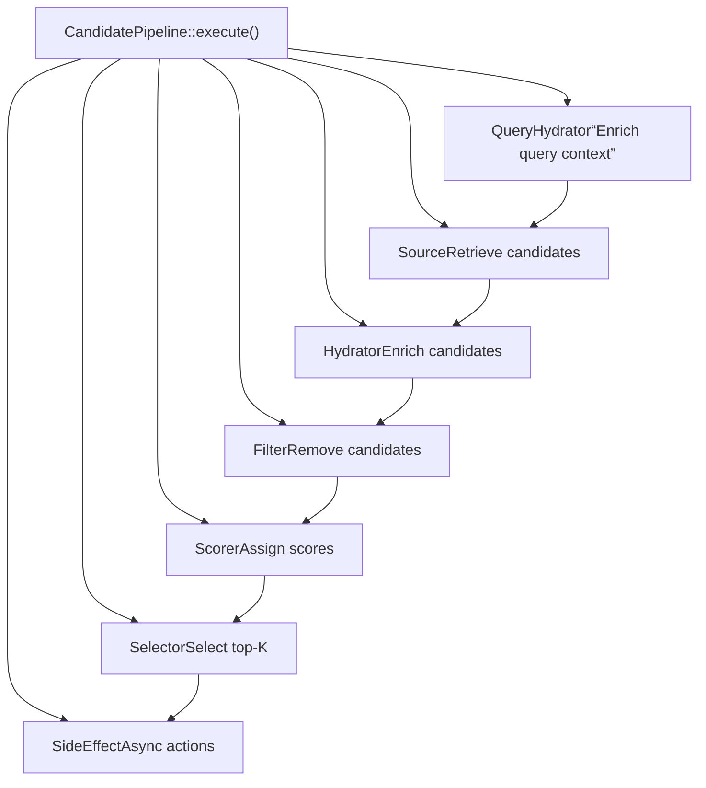
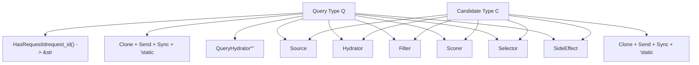
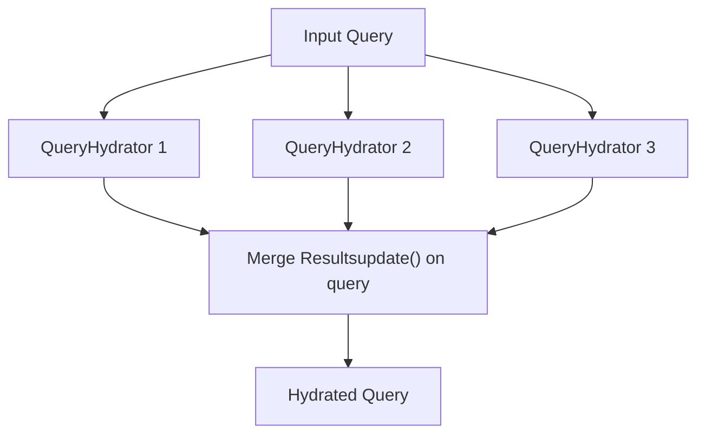
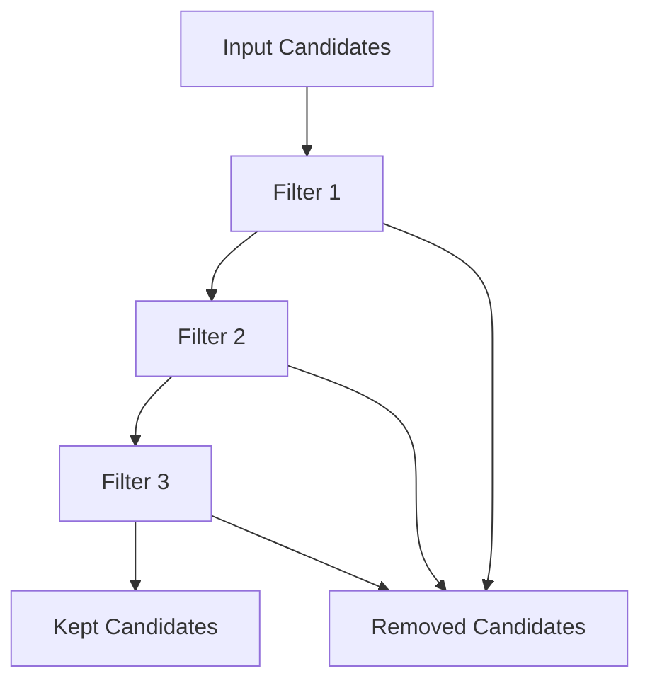
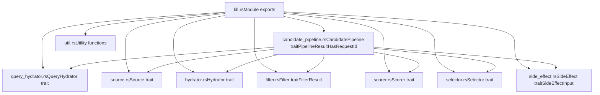

# 候选管道框架 (Candidate Pipeline Framework)

相关源文件

-   [candidate-pipeline/candidate\_pipeline.rs](https://github.com/xai-org/x-algorithm/blob/aaa167b3/candidate-pipeline/candidate_pipeline.rs)
-   [candidate-pipeline/lib.rs](https://github.com/xai-org/x-algorithm/blob/aaa167b3/candidate-pipeline/lib.rs)

## 用途与范围

候选管道框架是 X Algorithm 中用于构建推荐管道的通用、可复用抽象层。它提供了一个基于 Trait 的架构，具有七个可插拔阶段，可以组合这些阶段来从各种数据源中检索、充实、过滤、评分和选择候选对象。

本文档涵盖了该框架的核心设计、Trait 定义、执行模型和类型系统。有关“为您推荐 (For You)”馈送流中使用的特定 Trait 实现的详细信息，请参阅[主混频器实现 (Home Mixer Implementation)](/xai-org/x-algorithm/4-home-mixer-implementation)。有关该框架如何融入整体系统架构的信息，请参阅[架构 (Architecture)](/xai-org/x-algorithm/2-architecture)。

## 框架概览

候选管道框架解决了构建模块化、可测试且可复用的推荐系统的问题。该框架不是硬编码管道逻辑，而是定义了一组可以独立实现并组合在一起的 Trait。

### 设计原则

| 原则 | 描述 |
| --- | --- |
| **基于 Trait 的组合** | 每个管道阶段都被定义为一个 Rust Trait，允许多种实现 |
| **泛型类型参数** | 管道通过查询类型 `Q` 和候选对象类型 `C` 进行参数化 |
| **故障安全执行** | 阶段失败会被记录，但不会导致管道崩溃；回退行为会保留进度 |
| **并行 + 顺序** | 独立的阶段（充实器、来源）并行运行；依赖阶段（过滤器、评分器）顺序运行 |
| **可观测性** | 所有阶段都会发出带有请求 ID 的结构化日志以便追踪 |

来源：[candidate-pipeline/candidate\_pipeline.rs1-330](https://github.com/xai-org/x-algorithm/blob/aaa167b3/candidate-pipeline/candidate_pipeline.rs#L1-L330)

## 核心 Trait 架构

该框架定义了代表不同管道阶段的七个核心 Trait：


**图表：管道阶段流程与数据转换**

来源：[candidate-pipeline/candidate\_pipeline.rs36-92](https://github.com/xai-org/x-algorithm/blob/aaa167b3/candidate-pipeline/candidate_pipeline.rs#L36-L92)

## 管道阶段

`CandidatePipeline` Trait 为每种阶段类型定义了访问器方法：

| 方法 | 返回类型 | 用途 | 执行方式 |
| --- | --- | --- | --- |
| `query_hydrators()` | `&[Box<dyn QueryHydrator<Q>>]` | 使用用户上下文充实查询 | 并行 |
| `sources()` | `&[Box<dyn Source<Q, C>>]` | 获取初始候选对象 | 并行 |
| `hydrators()` | `&[Box<dyn Hydrator<Q, C>>]` | 充实候选对象元数据 | 并行 |
| `filters()` | `&[Box<dyn Filter<Q, C>>]` | 移除不符合条件的候选对象 | 顺序 |
| `scorers()` | `&[Box<dyn Scorer<Q, C>>]` | 分配相关性分数 | 顺序 |
| `selector()` | `&dyn Selector<Q, C>` | 排序并选择前 K 个 | 同步 |
| `post_selection_hydrators()` | `&[Box<dyn Hydrator<Q, C>>]` | 充实选定的候选对象 | 并行 |
| `post_selection_filters()` | `&[Box<dyn Filter<Q, C>>]` | 最终验证过滤 | 顺序 |
| `side_effects()` | `Arc<Vec<Box<dyn SideEffect<Q, C>>>>` | 非阻塞操作 | 异步并行 |

来源：[candidate-pipeline/candidate\_pipeline.rs42-51](https://github.com/xai-org/x-algorithm/blob/aaa167b3/candidate-pipeline/candidate_pipeline.rs#L42-L51)

### 两阶段处理

管道支持两阶段充实和过滤：

1.  **预选择阶段 (Pre-Selection Phase)**：在评分前对所有候选对象进行操作

    -   `hydrators()`：获取过滤和评分所需的元数据
    -   `filters()`：移除明显不符合条件的候选对象，以降低评分成本
2.  **选择后阶段 (Post-Selection Phase)**：在 Top-K 选择后对选定的候选对象进行操作

    -   `post_selection_hydrators()`：仅为选定的候选对象获取昂贵的元数据
    -   `post_selection_filters()`：最终验证（例如，检查已删除/垃圾内容）

这种优化减少了对不会被选中的候选对象执行昂贵操作的次数。

来源：[candidate-pipeline/candidate\_pipeline.rs44-49](https://github.com/xai-org/x-algorithm/blob/aaa167b3/candidate-pipeline/candidate_pipeline.rs#L44-L49)

## 类型参数与约束

该框架在两个类型参数上是泛型的：


**图表：类型参数约束与用法**

### HasRequestId Trait

`HasRequestId` Trait 为日志记录和追踪提供了一个稳定的请求标识符：

```rust
pub trait HasRequestId {    fn request_id(&self) -> &str;}
```
所有查询类型必须实现此 Trait，以便在整个管道中实现结构化日志记录。

来源：[candidate-pipeline/candidate\_pipeline.rs31-40](https://github.com/xai-org/x-algorithm/blob/aaa167b3/candidate-pipeline/candidate_pipeline.rs#L31-L40)

### 类型限定 (Type Bounds)

| 限定 | 原因 |
| --- | --- |
| `Clone` | 允许跨阶段和并行操作共享数据 |
| `Send + Sync` | 跨线程异步执行所需 |
| `'static` | 确保类型可以安全地存储在 tokio 任务中 |

来源：[candidate-pipeline/candidate\_pipeline.rs37-40](https://github.com/xai-org/x-algorithm/blob/aaa167b3/candidate-pipeline/candidate_pipeline.rs#L37-L40)

## 执行模型

`execute()` 方法按固定序列编排所有管道阶段：

**图表：完整的管道执行序列**

来源：[candidate-pipeline/candidate\_pipeline.rs53-92](https://github.com/xai-org/x-algorithm/blob/aaa167b3/candidate-pipeline/candidate_pipeline.rs#L53-L92)

### 管道结果 (Pipeline Result)

`execute()` 方法返回一个 `PipelineResult` 结构，包含：

| 字段 | 类型 | 描述 |
| --- | --- | --- |
| `retrieved_candidates` | `Vec<C>` | 充实后、过滤前的所有候选对象 |
| `filtered_candidates` | `Vec<C>` | 被过滤器移除的所有候选对象 |
| `selected_candidates` | `Vec<C>` | 选定用于响应的最终候选对象 |
| `query` | `Arc<Q>` | 充实后的查询对象 |

此结构为调试、指标和测试提供了对每个阶段的可视化。

来源：[candidate-pipeline/candidate\_pipeline.rs24-29](https://github.com/xai-org/x-algorithm/blob/aaa167b3/candidate-pipeline/candidate_pipeline.rs#L24-L29) [candidate-pipeline/candidate\_pipeline.rs86-91](https://github.com/xai-org/x-algorithm/blob/aaa167b3/candidate-pipeline/candidate_pipeline.rs#L86-L91)

## 阶段执行模式

### 并行执行 (Parallel Execution)

查询充实器、来源和候选对象充实器使用 `futures::future::join_all` 并行执行：


**图表：并行查询充实模式**

模式：

1.  使用 `enable(&query)` 过滤启用的充实器
2.  使用 `join_all()` 同时启动所有充实 future
3.  使用每个充实器的 `update()` 方法将结果合并回查询中

来源：[candidate-pipeline/candidate\_pipeline.rs94-123](https://github.com/xai-org/x-algorithm/blob/aaa167b3/candidate-pipeline/candidate_pipeline.rs#L94-L123) [candidate-pipeline/candidate\_pipeline.rs125-157](https://github.com/xai-org/x-algorithm/blob/aaa167b3/candidate-pipeline/candidate_pipeline.rs#L125-L157) [candidate-pipeline/candidate\_pipeline.rs176-217](https://github.com/xai-org/x-algorithm/blob/aaa167b3/candidate-pipeline/candidate_pipeline.rs#L176-L217)

### 顺序执行 (Sequential Execution)

过滤器和评分器顺序执行，因为每个阶段可能依赖于前一个阶段的输出：


**图表：顺序过滤器链模式**

模式：

1.  使用 `enable(query)` 过滤启用的过滤器
2.  顺序地将每个过滤器应用于候选对象
3.  累加被移除的候选对象以便用于指标/调试
4.  携带被保留的候选对象继续进入下一阶段

来源：[candidate-pipeline/candidate\_pipeline.rs219-273](https://github.com/xai-org/x-algorithm/blob/aaa167b3/candidate-pipeline/filter.rs#L219-L273) [candidate-pipeline/candidate\_pipeline.rs275-307](https://github.com/xai-org/x-algorithm/blob/aaa167b3/candidate-pipeline/candidate_pipeline.rs#L275-L307)

### 条件执行 (Conditional Execution)

每个阶段组件都实现了一个 `enable()` 方法，用于决定是否针对给定的查询运行该组件：

```rust
// 整个阶段使用的伪代码模式
let enabled_components: Vec<_> = self.components()
    .iter()
    .filter(|c| c.enable(query))
    .collect();
```
这允许通过按请求启用/禁用组件来进行运行时配置和 A/B 测试。

来源：[candidate-pipeline/candidate\_pipeline.rs100](https://github.com/xai-org/x-algorithm/blob/aaa167b3/candidate-pipeline/candidate_pipeline.rs#L100-L100) [candidate-pipeline/candidate\_pipeline.rs128](https://github.com/xai-org/x-algorithm/blob/aaa167b3/candidate-pipeline/candidate_pipeline.rs#L128-L128) [candidate-pipeline/candidate\_pipeline.rs185](https://github.com/xai-org/x-algorithm/blob/aaa167b3/candidate-pipeline/candidate_pipeline.rs#L185-L185) [candidate-pipeline/candidate\_pipeline.rs246](https://github.com/xai-org/x-algorithm/blob/aaa167b3/candidate-pipeline/candidate_pipeline.rs#L246-L246) [candidate-pipeline/candidate\_pipeline.rs279](https://github.com/xai-org/x-algorithm/blob/aaa167b3/candidate-pipeline/candidate_pipeline.rs#L279-L279)

## 错误处理策略

框架实现了一种故障安全错误处理方法，阶段失败会被记录，但不会中止整个管道：

### 查询充实器错误

当查询充实器失败时，错误会被记录，并跳过该充实器的贡献：

```rust
match result {
    Ok(hydrated) => {
        hydrator.update(&mut hydrated_query, hydrated);
    }
    Err(err) => {
        error!("request_id={} stage=QueryHydrator component={} failed: {}",
                request_id, hydrator.name(), err);
        // 继续使用部分充实的查询
    }
}
```
来源：[candidate-pipeline/candidate\_pipeline.rs107-120](https://github.com/xai-org/x-algorithm/blob/aaa167b3/candidate-pipeline/candidate_pipeline.rs#L107-L120)

### 来源错误

当一个来源失败时，仍会收集来自其他来源的候选对象：

```rust
match result {
    Ok(mut candidates) => {
        collected.append(&mut candidates);
    }
    Err(err) => {
        error!("request_id={} stage=Source component={} failed: {}",
                request_id, source.name(), err);
        // 继续处理来自其他来源的候选对象
    }
}
```
来源：[candidate-pipeline/candidate\_pipeline.rs134-154](https://github.com/xai-org/x-algorithm/blob/aaa167b3/candidate-pipeline/candidate_pipeline.rs#L134-L154)

### 充实器错误

充实器失败会被记录，候选对象将在没有该项充实的情况下继续处理：

```rust
match result {
    Ok(hydrated) => {
        if hydrated.len() == expected_len {
            hydrator.update_all(&mut candidates, hydrated);
        } else {
            warn!("length_mismatch expected={} got={}", expected_len, hydrated.len());
        }
    }
    Err(err) => {
        error!("request_id={} stage=Hydrator component={} failed: {}",
                request_id, hydrator.name(), err);
        // 继续处理未充实的候选对象
    }
}
```
来源：[candidate-pipeline/candidate\_pipeline.rs190-214](https://github.com/xai-org/x-algorithm/blob/aaa167b3/candidate-pipeline/candidate_pipeline.rs#L190-L214)

### 过滤器错误

过滤器失败会被特殊处理——管道会恢复到过滤前的候选对象集：

```rust
let backup = candidates.clone();
match filter.filter(query, candidates).await {
    Ok(result) => {
        candidates = result.kept;
        all_removed.extend(result.removed);
    }
    Err(err) => {
        error!("request_id={} stage=Filter component={} failed: {}",
                request_id, filter.name(), err);
        candidates = backup;  // 恢复过滤前状态
    }
}
```
这确保了损坏的过滤器不会意外移除所有候选对象。

来源：[candidate-pipeline/candidate\_pipeline.rs247-263](https://github.com/xai-org/x-algorithm/blob/aaa167b3/candidate-pipeline/candidate_pipeline.rs#L247-L263)

### 评分器错误

评分器失败会被记录，候选对象将在没有该项评分贡献的情况下继续处理：

```rust
match scorer.score(query, &candidates).await {
    Ok(scored) => {
        if scored.len() == expected_len {
            scorer.update_all(&mut candidates, scored);
        } else {
            warn!("length_mismatch expected={} got={}", expected_len, scored.len());
        }
    }
    Err(err) => {
        error!("request_id={} stage=Scorer component={} failed: {}",
                request_id, scorer.name(), err);
        // 继续使用部分分数
    }
}
```
来源：[candidate-pipeline/candidate\_pipeline.rs280-304](https://github.com/xai-org/x-algorithm/blob/aaa167b3/candidate-pipeline/candidate_pipeline.rs#L280-L304)

## 模块结构

该框架为每种 Trait 类型组织了独立的模块：


**图表：框架模块组织**

来源：[candidate-pipeline/lib.rs1-10](https://github.com/xai-org/x-algorithm/blob/aaa167b3/candidate-pipeline/lib.rs#L1-L10) [candidate-pipeline/candidate\_pipeline.rs1-11](https://github.com/xai-org/x-algorithm/blob/aaa167b3/candidate-pipeline/candidate_pipeline.rs#L1-L11)

## 具体实现

该框架旨在由具体的管道类型实现。主混频器 (Home Mixer) 提供了一个生产环境实现：

| 组件 | 实现 | 参考 |
| --- | --- | --- |
| 管道 | `PhoenixCandidatePipeline` | 参阅 [Phoenix 候选管道 (Phoenix Candidate Pipeline)](/xai-org/x-algorithm/4.1-phoenix-candidate-pipeline) |
| 查询类型 | `ScoredPostsQuery` | 参阅 [ScoredPostsQuery](/xai-org/x-algorithm/4.2.1-scoredpostsquery) |
| 候选对象类型 | `PostCandidate` | 参阅 [PostCandidate](/xai-org/x-algorithm/4.2.2-postcandidate) |

有关如何为“为您推荐”馈送流实现框架 Trait 的详细信息，请参阅[主混频器实现 (Home Mixer Implementation)](/xai-org/x-algorithm/4-home-mixer-implementation)。

来源：[candidate-pipeline/candidate\_pipeline.rs36-330](https://github.com/xai-org/x-algorithm/blob/aaa167b3/candidate-pipeline/candidate_pipeline.rs#L36-L330)

## 关键要点

| 概念 | 描述 |
| --- | --- |
| **Trait 组合** | 七个独立的 Trait 组合形成一个完整的管道 |
| **类型安全** | 泛型类型参数确保编译时正确性 |
| **并行优化** | 独立阶段并发运行，以最大限度减少延迟 |
| **故障安全** | 阶段失败是隔离的并会被记录；管道继续运行 |
| **可观测性** | 带有请求 ID 的结构化日志记录实现了追踪和调试 |
| **可复用性** | 框架可以针对不同的推荐用例进行实例化 |
| **可测试性** | 基于 Trait 的设计实现了容易的模拟 (mocking) 和单元测试 |

候选管道框架为构建具有模块化、高性能和可靠性的生产环境推荐系统提供了坚实的基础。

来源：[candidate-pipeline/candidate\_pipeline.rs1-330](https://github.com/xai-org/x-algorithm/blob/aaa167b3/candidate-pipeline/candidate_pipeline.rs#L1-L330)
