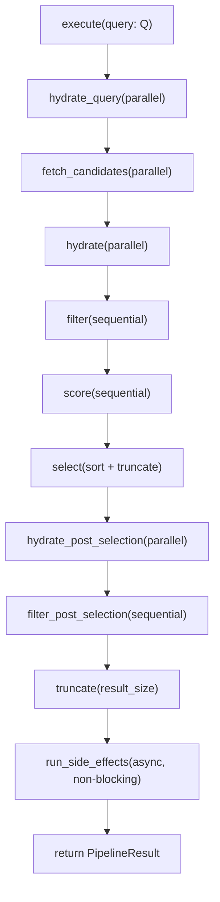
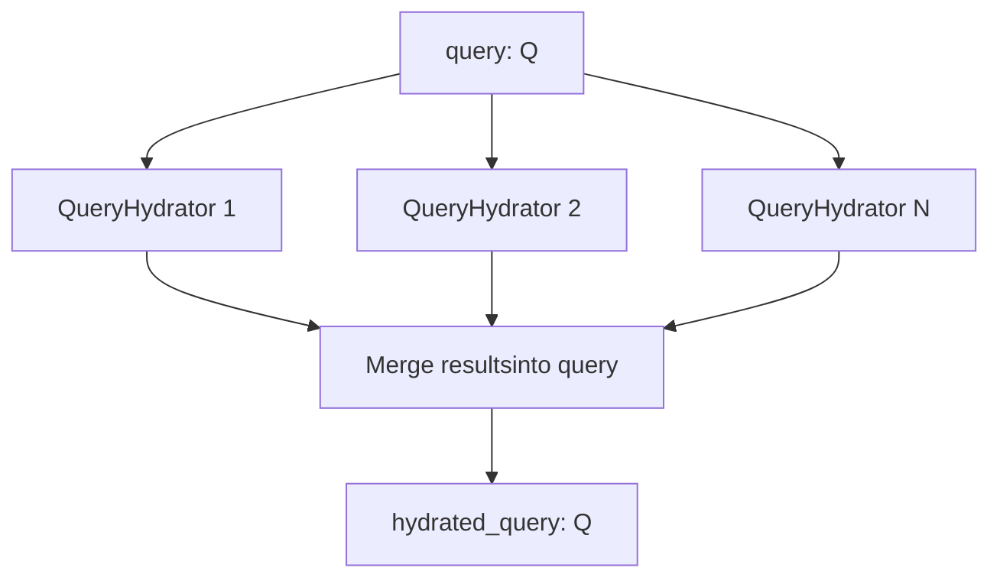
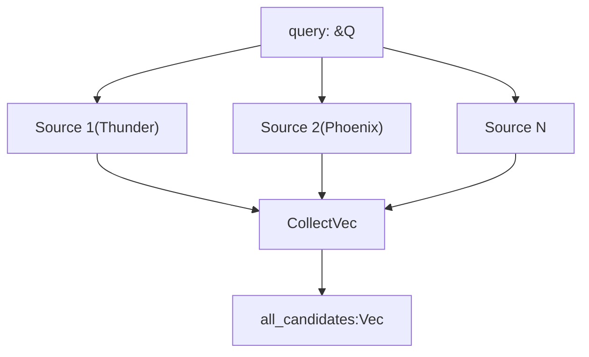
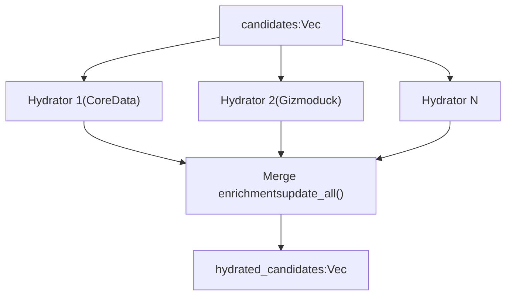
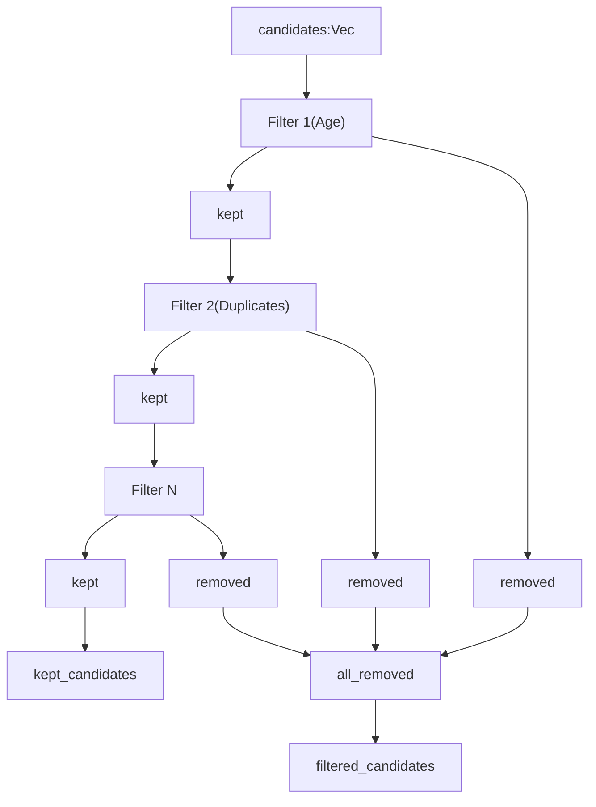
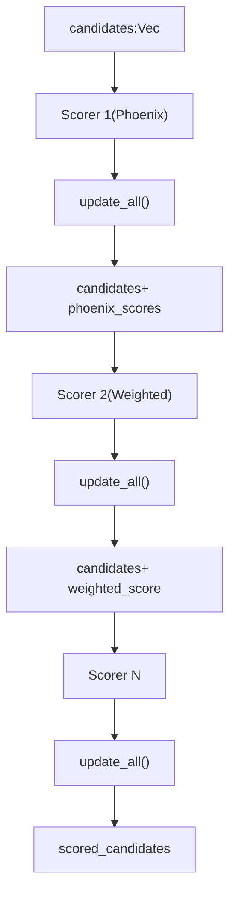
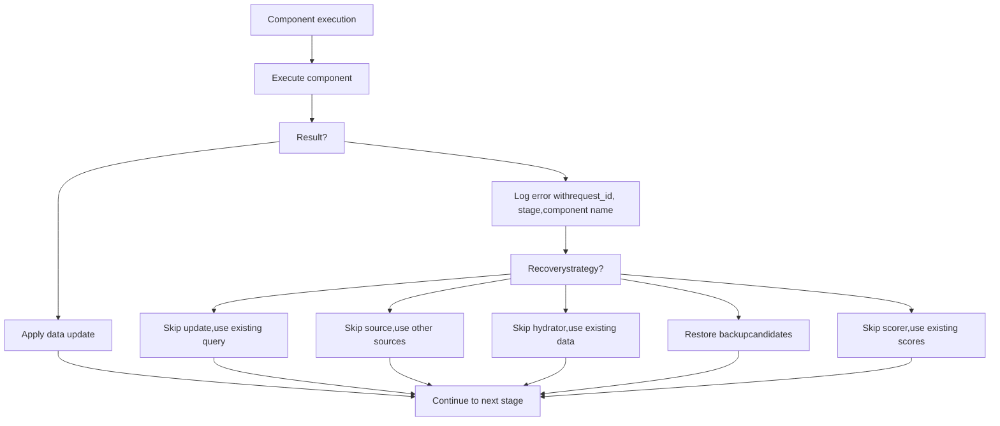
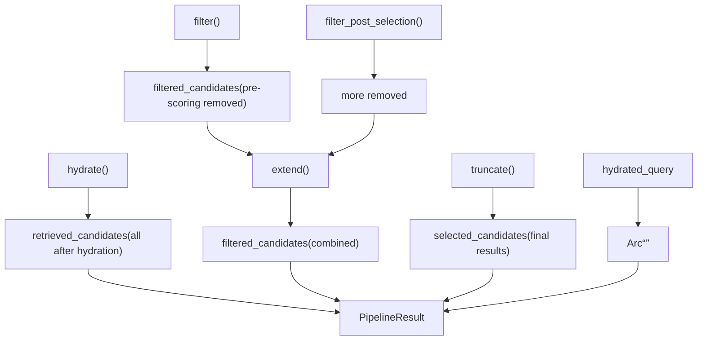
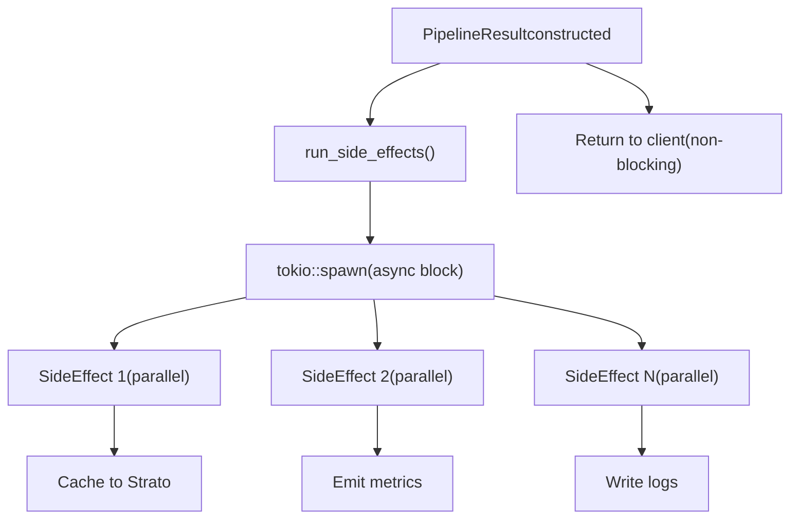

# 管道执行模型 (Pipeline Execution Model)

相关源文件

-   [candidate-pipeline/candidate\_pipeline.rs](https://github.com/xai-org/x-algorithm/blob/aaa167b3/candidate-pipeline/candidate_pipeline.rs)

## 目的与范围

本文档解释了 `CandidatePipeline` trait 的执行模型，该 trait 定义了运行推荐管道的核心编排逻辑。本页涵盖：

-   `CandidatePipeline` trait 结构及其泛型类型参数
-   `execute` 方法的顺序阶段和数据流
-   独立阶段（查询充实器、来源、候选充实器）的并行执行模式
-   依赖阶段（过滤器、评分器）的顺序执行模式
-   错误处理和恢复策略
-   `PipelineResult` 输出结构

有关各个 trait 类型（QueryHydrator, Source, Hydrator 等）的详细信息，请参阅 [3.2](/xai-org/x-algorithm/3.2-queryhydrator-trait) 到 [3.8](/xai-org/x-algorithm/3.8-sideeffect-trait) 页面。有关 Home Mixer 中使用的具体实现，请参阅 [4.1](/xai-org/x-algorithm/4.1-phoenix-candidate-pipeline)。

---

## CandidatePipeline Trait

`CandidatePipeline` trait 定义在 [candidate-pipeline/candidate\_pipeline.rs37-329](https://github.com/xai-org/x-algorithm/blob/aaa167b3/candidate-pipeline/candidate_pipeline.rs#L37-L329) 中，为系统中的所有推荐管道提供通用的编排框架。

### 类型参数

该 trait 由两个泛型类型参数化：

| 类型参数 | 约束 | 用途 |
| --- | --- | --- |
| `Q` | `HasRequestId + Clone + Send + Sync + 'static` | 包含请求上下文、用户 ID 和充实后特征的查询类型 |
| `C` | `Clone + Send + Sync + 'static` | 代表带有分数和元数据的单个内容项的候选类型 |

`HasRequestId` trait [candidate-pipeline/candidate\_pipeline.rs32-34](https://github.com/xai-org/x-algorithm/blob/aaa167b3/candidate-pipeline/candidate_pipeline.rs#L32-L34) 确保查询提供一个稳定的标识符，用于整个管道的日志记录和追踪。

### 组件注册方法 (Component Registry Methods)

该 trait 定义了返回管道组件集合的方法，具体实现必须提供这些组件：

```rust
fn query_hydrators(&self) -> &[Box<dyn QueryHydrator<Q>>];
fn sources(&self) -> &[Box<dyn Source<Q, C>>];
fn hydrators(&self) -> &[Box<dyn Hydrator<Q, C>>];
fn filters(&self) -> &[Box<dyn Filter<Q, C>>];
fn scorers(&self) -> &[Box<dyn Scorer<Q, C>>];
fn selector(&self) -> &dyn Selector<Q, C>;
fn post_selection_hydrators(&self) -> &[Box<dyn Hydrator<Q, C>>];
fn post_selection_filters(&self) -> &[Box<dyn Filter<Q, C>>];
fn side_effects(&self) -> Arc<Vec<Box<dyn SideEffect<Q, C>>>>;
fn result_size(&self) -> usize;
```
这些方法定义在 [candidate-pipeline/candidate\_pipeline.rs42-51](https://github.com/xai-org/x-algorithm/blob/aaa167b3/candidate-pipeline/candidate_pipeline.rs#L42-L51)

**来源：** [candidate-pipeline/candidate\_pipeline.rs32-51](https://github.com/xai-org/x-algorithm/blob/aaa167b3/candidate-pipeline/candidate_pipeline.rs#L32-L51)

---

## 管道执行流程

### Execute 方法概览

`execute` 方法 [candidate-pipeline/candidate\_pipeline.rs53-92](https://github.com/xai-org/x-algorithm/blob/aaa167b3/candidate-pipeline/candidate_pipeline.rs#L53-L92) 是编排所有管道阶段的主入口点。它遵循严格有序的操作序列：

#### 管道执行序列


**图表：展示阶段顺序和执行模式的主管道执行流程**

执行流程包括：

1.  **查询充实 (Query Hydration)** [candidate-pipeline/candidate\_pipeline.rs54](https://github.com/xai-org/x-algorithm/blob/aaa167b3/candidate-pipeline/candidate_pipeline.rs#L54-L54)：使用用户上下文充实查询
2.  **候选获取 (Candidate Fetching)** [candidate-pipeline/candidate\_pipeline.rs56](https://github.com/xai-org/x-algorithm/blob/aaa167b3/candidate-pipeline/candidate_pipeline.rs#L56-L56)：从来源中检索候选对象
3.  **候选充实 (Candidate Hydration)** [candidate-pipeline/candidate\_pipeline.rs58](https://github.com/xai-org/x-algorithm/blob/aaa167b3/candidate-pipeline/candidate_pipeline.rs#L58-L58)：使用元数据充实候选对象
4.  **评分前过滤 (Pre-scoring Filtering)** [candidate-pipeline/candidate\_pipeline.rs60-62](https://github.com/xai-org/x-algorithm/blob/aaa167b3/candidate-pipeline/candidate_pipeline.rs#L60-L62) ：移除不符合条件的候选对象
5.  **评分 (Scoring)** [candidate-pipeline/candidate\_pipeline.rs64](https://github.com/xai-org/x-algorithm/blob/aaa167b3/candidate-pipeline/candidate_pipeline.rs#L64-L64)：分配相关性分数
6.  **选择 (Selection)** [candidate-pipeline/candidate\_pipeline.rs66](https://github.com/xai-org/x-algorithm/blob/aaa167b3/candidate-pipeline/candidate_pipeline.rs#L66-L66)：排序并选择前 K 个候选对象
7.  **选择后充实 (Post-selection Hydration)** [candidate-pipeline/candidate\_pipeline.rs68-70](https://github.com/xai-org/x-algorithm/blob/aaa167b3/candidate-pipeline/candidate_pipeline.rs#L68-L70)：充实选定的候选对象
8.  **选择后过滤 (Post-selection Filtering)** [candidate-pipeline/candidate\_pipeline.rs72-74](https://github.com/xai-org/x-algorithm/blob/aaa167b3/candidate-pipeline/candidate_pipeline.rs#L72-L74)：进行最终验证
9.  **截断 (Truncation)** [candidate-pipeline/candidate\_pipeline.rs77](https://github.com/xai-org/x-algorithm/blob/aaa167b3/candidate-pipeline/candidate_pipeline.rs#L77-L77)：执行结果大小限制
10. **副作用 (Side Effects)** [candidate-pipeline/candidate\_pipeline.rs79-84](https://github.com/xai-org/x-algorithm/blob/aaa167b3/candidate-pipeline/candidate_pipeline.rs#L79-L84)：异步日志记录、缓存、指标统计

**来源：** [candidate-pipeline/candidate\_pipeline.rs53-92](https://github.com/xai-org/x-algorithm/blob/aaa167b3/candidate-pipeline/candidate_pipeline.rs#L53-L92)

---

## 并行 vs 顺序执行

管道根据阶段依赖关系使用不同的执行策略：

### 并行执行阶段 (Parallel Execution Stages)

对独立数据进行操作且相互之间没有依赖关系的阶段使用 `futures::future::join_all` 并行执行：

#### 查询充实 (Query Hydration)（并行）


**图表：查询充实器并行执行并将结果合并**

`hydrate_query` 方法 [candidate-pipeline/candidate\_pipeline.rs95-123](https://github.com/xai-org/x-algorithm/blob/aaa167b3/candidate-pipeline/candidate_pipeline.rs#L95-L123) 筛选已启用的充实器，通过 `join_all` 并行执行它们，并合并结果：

```rust
let hydrate_futures = hydrators.iter().map(|h| h.hydrate(&query));
let results = join_all(hydrate_futures).await;

let mut hydrated_query = query;
for (hydrator, result) in hydrators.iter().zip(results) {
    match result {
        Ok(hydrated) => {
            hydrator.update(&mut hydrated_query, hydrated);
        }
        Err(err) => {
            error!("query hydrator {} failed: {}", hydrator.name(), err);
        }
    }
}
```
**来源：** [candidate-pipeline/candidate\_pipeline.rs95-123](https://github.com/xai-org/x-algorithm/blob/aaa167b3/candidate-pipeline/candidate_pipeline.rs#L95-L123)

#### 候选来源获取 (Candidate Source Fetching)（并行）


**图表：来源并行执行并收集候选对象**

`fetch_candidates` 方法 [candidate-pipeline/candidate\_pipeline.rs126-157](https://github.com/xai-org/x-algorithm/blob/aaa167b3/candidate-pipeline/candidate_pipeline.rs#L126-L157) 并行执行所有已启用的来源，并将其结果收集到单个向量中：

```rust
let source_futures = sources.iter().map(|s| s.get_candidates(query));
let results = join_all(source_futures).await;

let mut collected = Vec::new();
for (source, result) in sources.iter().zip(results) {
    match result {
        Ok(mut candidates) => {
            collected.append(&mut candidates);
        }
        Err(err) => {
            error!("source {} failed: {}", source.name(), err);
        }
    }
}
```
**来源：** [candidate-pipeline/candidate\_pipeline.rs126-157](https://github.com/xai-org/x-algorithm/blob/aaa167b3/candidate-pipeline/candidate_pipeline.rs#L126-L157)

#### 候选充实 (Candidate Hydration)（并行）


**图表：充实器并行执行，结果合并到候选对象中**

`run_hydrators` 辅助方法 [candidate-pipeline/candidate\_pipeline.rs177-217](https://github.com/xai-org/x-algorithm/blob/aaa167b3/candidate-pipeline/candidate_pipeline.rs#L177-L217) 并行执行所有已启用的充实器并合并充实内容：

```rust
let hydrate_futures = hydrators.iter().map(|h| h.hydrate(query, &candidates));
let results = join_all(hydrate_futures).await;

for (hydrator, result) in hydrators.iter().zip(results) {
    match result {
        Ok(hydrated) => {
            if hydrated.len() == expected_len {
                hydrator.update_all(&mut candidates, hydrated);
            } else {
                warn!("hydrator {} length mismatch", hydrator.name());
            }
        }
        Err(err) => {
            error!("hydrator {} failed: {}", hydrator.name(), err);
        }
    }
}
```
此模式被 `hydrate` [candidate-pipeline/candidate\_pipeline.rs160-163](https://github.com/xai-org/x-algorithm/blob/aaa167b3/candidate-pipeline/candidate_pipeline.rs#L160-L163) 和 `hydrate_post_selection` [candidate-pipeline/candidate\_pipeline.rs166-174](https://github.com/xai-org/x-algorithm/blob/aaa167b3/candidate-pipeline/candidate_pipeline.rs#L166-L174) 同时使用。

**来源：** [candidate-pipeline/candidate\_pipeline.rs160-217](https://github.com/xai-org/x-algorithm/blob/aaa167b3/candidate-pipeline/candidate_pipeline.rs#L160-L217)

### 顺序执行阶段 (Sequential Execution Stages)

依赖于前一阶段结果的阶段按顺序执行：

#### 过滤 (Filtering)（顺序）


**图表：过滤器顺序执行，每个过滤器均在前一过滤器的保留集 (kept set) 上进行操作**

`run_filters` 辅助方法 [candidate-pipeline/candidate\_pipeline.rs237-273](https://github.com/xai-org/x-algorithm/blob/aaa167b3/candidate-pipeline/candidate_pipeline.rs#L237-L273) 顺序执行过滤器，并累积移除的候选对象：

```rust
let mut all_removed = Vec::new();
for filter in filters.iter().filter(|f| f.enable(query)) {
    let backup = candidates.clone();
    match filter.filter(query, candidates).await {
        Ok(result) => {
            candidates = result.kept;
            all_removed.extend(result.removed);
        }
        Err(err) => {
            error!("filter {} failed: {}", filter.name(), err);
            candidates = backup;  // 从失败中恢复
        }
    }
}
```
过滤器必须顺序执行，因为每个过滤器都在前一个过滤器的输出上操作。此模式被 `filter` [candidate-pipeline/candidate\_pipeline.rs220-223](https://github.com/xai-org/x-algorithm/blob/aaa167b3/candidate-pipeline/candidate_pipeline.rs#L220-L223) 和 `filter_post_selection` [candidate-pipeline/candidate\_pipeline.rs226-234](https://github.com/xai-org/x-algorithm/blob/aaa167b3/candidate-pipeline/candidate_pipeline.rs#L226-L234) 同时使用。

**来源：** [candidate-pipeline/candidate\_pipeline.rs220-273](https://github.com/xai-org/x-algorithm/blob/aaa167b3/candidate-pipeline/candidate_pipeline.rs#L220-L273)

#### 评分 (Scoring)（顺序）


**图表：评分器顺序执行，每个评分器添加的评分可能依赖于之前的评分**

`score` 方法 [candidate-pipeline/candidate\_pipeline.rs276-307](https://github.com/xai-org/x-algorithm/blob/aaa167b3/candidate-pipeline/candidate_pipeline.rs#L276-L307) 顺序执行评分器：

```rust
for scorer in self.scorers().iter().filter(|s| s.enable(query)) {
    match scorer.score(query, &candidates).await {
        Ok(scored) => {
            if scored.len() == expected_len {
                scorer.update_all(&mut candidates, scored);
            } else {
                warn!("scorer {} length mismatch", scorer.name());
            }
        }
        Err(err) => {
            error!("scorer {} failed: {}", scorer.name(), err);
        }
    }
}
```
评分器按顺序执行，因为后续评分器可能依赖于早期评分器计算的分数（例如，加权评分器合并了多个参与度预测分数）。

**来源：** [candidate-pipeline/candidate\_pipeline.rs276-307](https://github.com/xai-org/x-algorithm/blob/aaa167b3/candidate-pipeline/candidate_pipeline.rs#L276-L307)

### 并行 vs 顺序摘要表

| 阶段 | 执行模式 | 理由 |
| --- | --- | --- |
| 查询充实器 (Query Hydrators) | 并行 | 从不同服务独立获取数据 |
| 来源 (Sources) | 并行 | 从不同来源独立检索候选对象 |
| 候选充实器 (Candidate Hydrators) | 并行 | 从不同服务独立进行元数据充实 |
| 过滤器 (Filters) | 顺序 | 每个过滤器在前一过滤器的保留集 (kept set) 上操作 |
| 评分器 (Scorers) | 顺序 | 后续评分器可能依赖于先前的评分 |
| 选择器 (Selector) | 同步 (Synchronous) | 单次排序和截断操作 |
| 选择后充实器 (Post-selection Hydrators) | 并行 | 独立的元数据充实 |
| 选择后过滤器 (Post-selection Filters) | 顺序 | 最终验证过滤器 |
| 副作用 (Side Effects) | 并行（异步） | 独立的日志、缓存、指标操作 |

**来源：** [candidate-pipeline/candidate\_pipeline.rs95-328](https://github.com/xai-org/x-algorithm/blob/aaa167b3/candidate-pipeline/candidate_pipeline.rs#L95-L328)

---

## 错误处理策略

管道实现了优雅的错误处理，以最大限度地提高可用性：

### 按阶段划分的错误处理模式


**图表：带有针对每种阶段类型特定的恢复策略的错误处理流程**

### 查询充实器错误处理

当查询充实器失败时 [candidate-pipeline/candidate\_pipeline.rs111-119](https://github.com/xai-org/x-algorithm/blob/aaa167b3/candidate-pipeline/candidate_pipeline.rs#L111-L119)，错误会被记录并跳过更新：

```rust
match result {
    Ok(hydrated) => {
        hydrator.update(&mut hydrated_query, hydrated);
    }
    Err(err) => {
        error!(
            "request_id={} stage={:?} component={} failed: {}",
            request_id, PipelineStage::QueryHydrator, hydrator.name(), err
        );
        // 使用未充实的查询继续
    }
}
```
查询继续使用现有数据，即使缺少某些上下文，也允许管道继续。

### 来源错误处理

当一个来源失败时 [candidate-pipeline/candidate\_pipeline.rs145-153](https://github.com/xai-org/x-algorithm/blob/aaa167b3/candidate-pipeline/candidate_pipeline.rs#L145-L153)，来自该来源的候选对象将被跳过：

```rust
match result {
    Ok(mut candidates) => {
        info!("source {} fetched {} candidates", source.name(), candidates.len());
        collected.append(&mut candidates);
    }
    Err(err) => {
        error!(
            "request_id={} stage={:?} component={} failed: {}",
            request_id, PipelineStage::Source, source.name(), err
        );
        // 使用来自其他来源的候选对象继续
    }
}
```
只要至少有一个来源成功，就允许管道继续处理部分结果。

### 充实器错误处理

当一个充实器失败时 [candidate-pipeline/candidate\_pipeline.rs205-213](https://github.com/xai-org/x-algorithm/blob/aaa167b3/candidate-pipeline/candidate_pipeline.rs#L205-L213)，充实操作将被跳过：

```rust
match result {
    Ok(hydrated) => {
        if hydrated.len() == expected_len {
            hydrator.update_all(&mut candidates, hydrated);
        } else {
            warn!("hydrator {} length mismatch", hydrator.name());
        }
    }
    Err(err) => {
        error!(
            "request_id={} stage={:?} component={} failed: {}",
            request_id, stage, hydrator.name(), err
        );
        // 使用未充实的候选对象继续
    }
}
```
候选对象在没有失败充实器的充实情况下继续。

### 过滤器错误处理

当一个过滤器失败时 [candidate-pipeline/candidate\_pipeline.rs247-262](https://github.com/xai-org/x-algorithm/blob/aaa167b3/candidate-pipeline/candidate_pipeline.rs#L247-L262)，管道恢复备份并继续：

```rust
let backup = candidates.clone();
match filter.filter(query, candidates).await {
    Ok(result) => {
        candidates = result.kept;
        all_removed.extend(result.removed);
    }
    Err(err) => {
        error!(
            "request_id={} stage={:?} component={} failed: {}",
            request_id, stage, filter.name(), err
        );
        candidates = backup;  // 恢复过滤前的状态
    }
}
```
这确保了过滤器失败不会丢失本应保留的候选对象。

### 评分器错误处理

当一个评分器失败时 [candidate-pipeline/candidate\_pipeline.rs295-302](https://github.com/xai-org/x-algorithm/blob/aaa167b3/candidate-pipeline/candidate_pipeline.rs#L295-L302)，评分更新将被跳过：

```rust
match scorer.score(query, &candidates).await {
    Ok(scored) => {
        if scored.len() == expected_len {
            scorer.update_all(&mut candidates, scored);
        } else {
            warn!("scorer {} length mismatch", scorer.name());
        }
    }
    Err(err) => {
        error!(
            "request_id={} stage={:?} component={} failed: {}",
            request_id, PipelineStage::Scorer, scorer.name(), err
        );
        // 在没有此评分器更新的情况下继续
    }
}
```
候选对象仅使用成功评分器的评分继续。

**来源：** [candidate-pipeline/candidate\_pipeline.rs107-302](https://github.com/xai-org/x-algorithm/blob/aaa167b3/candidate-pipeline/candidate_pipeline.rs#L107-L302)

---

## 管道结果结构 (Pipeline Result Structure)

管道返回一个 `PipelineResult<Q, C>` 结构体 [candidate-pipeline/candidate\_pipeline.rs24-29](https://github.com/xai-org/x-algorithm/blob/aaa167b3/candidate-pipeline/candidate_pipeline.rs#L24-L24)，用于捕获多个阶段的候选对象：

```rust
pub struct PipelineResult<Q, C> {
    pub retrieved_candidates: Vec<C>,
    pub filtered_candidates: Vec<C>,
    pub selected_candidates: Vec<C>,
    pub query: Arc<Q>,
}
```
### 结果组件 (Result Components)

| 字段 | 来源 | 用途 |
| --- | --- | --- |
| `retrieved_candidates` | 充实后 [candidate-pipeline/candidate\_pipeline.rs87](https://github.com/xai-org/x-algorithm/blob/aaa167b3/candidate-pipeline/candidate_pipeline.rs#L87-L87) | 充实后、过滤前的所有候选对象 |
| `filtered_candidates` | 过滤期间累积 [candidate-pipeline/candidate\_pipeline.rs88](https://github.com/xai-org/x-algorithm/blob/aaa167b3/candidate-pipeline/candidate_pipeline.rs#L88-L88) | 被评分前和选择后过滤器移除的所有候选对象 |
| `selected_candidates` | 最终截断后 [candidate-pipeline/candidate\_pipeline.rs89](https://github.com/xai-org/x-algorithm/blob/aaa167b3/candidate-pipeline/candidate_pipeline.rs#L89-L89) | 返回给客户端的最终候选对象 |
| `query` | 包装在 Arc 中 [candidate-pipeline/candidate\_pipeline.rs90](https://github.com/xai-org/x-algorithm/blob/aaa167b3/candidate-pipeline/candidate_pipeline.rs#L90-L90) | 用于参考的完全充实后的查询 |

### 结果构建流程


**图表：PipelineResult 字段如何从不同阶段填充**

结果组装发生在 [candidate-pipeline/candidate\_pipeline.rs86-91](https://github.com/xai-org/x-algorithm/blob/aaa167b3/candidate-pipeline/candidate_pipeline.rs#L86-L91)：

```rust
PipelineResult {
    retrieved_candidates: hydrated_candidates,
    filtered_candidates,  // 合并自预过滤器和后过滤器
    selected_candidates: final_candidates,
    query: arc_hydrated_query,
}
```
**来源：** [candidate-pipeline/candidate\_pipeline.rs24-92](https://github.com/xai-org/x-algorithm/blob/aaa167b3/candidate-pipeline/candidate_pipeline.rs#L24-L92)

---

## 副作用执行 (Side Effects Execution)

副作用在主响应构建后异步运行，确保它们不会阻塞客户端响应：


**图表：副作用在并行异步任务中执行，不阻塞响应**

`run_side_effects` 方法 [candidate-pipeline/candidate\_pipeline.rs319-328](https://github.com/xai-org/x-algorithm/blob/aaa167b3/candidate-pipeline/candidate_pipeline.rs#L319-L328) 启动一个异步任务：

```rust
fn run_side_effects(&self, input: Arc<SideEffectInput<Q, C>>) {
    let side_effects = self.side_effects();
    tokio::spawn(async move {
        let futures = side_effects
            .iter()
            .filter(|se| se.enable(input.query.clone()))
            .map(|se| se.run(input.clone()));
        let _ = join_all(futures).await;
    });
}
```
这在独立的 tokio 任务中运行，允许主 `execute` 方法在构建结果后立即返回 [candidate-pipeline/candidate\_pipeline.rs84](https://github.com/xai-org/x-algorithm/blob/aaa167b3/candidate-pipeline/candidate_pipeline.rs#L84-L84)。

**来源：** [candidate-pipeline/candidate\_pipeline.rs79-328](https://github.com/xai-org/x-algorithm/blob/aaa167b3/candidate-pipeline/candidate_pipeline.rs#L79-L328)

---

## 管道阶段枚举 (Pipeline Stage Enum)

`PipelineStage` 枚举 [candidate-pipeline/candidate\_pipeline.rs13-22](https://github.com/xai-org/x-algorithm/blob/aaa167b3/candidate-pipeline/candidate_pipeline.rs#L13-L22) 为日志记录提供结构化的阶段标识：

```rust
#[derive(Copy, Clone, Debug)]
pub enum PipelineStage {
    QueryHydrator,
    Source,
    Hydrator,
    PostSelectionHydrator,
    Filter,
    PostSelectionFilter,
    Scorer,
}
```
此枚举用于错误日志 [candidate-pipeline/candidate\_pipeline.rs115-299](https://github.com/xai-org/x-algorithm/blob/aaa167b3/candidate-pipeline/candidate_pipeline.rs#L115-L299) 和信息日志 [candidate-pipeline/candidate\_pipeline.rs137-267](https://github.com/xai-org/x-algorithm/blob/aaa167b3/candidate-pipeline/candidate_pipeline.rs#L137-L267) 中，以标识哪个阶段生成了日志条目，从而简化调试和监控。

**来源：** [candidate-pipeline/candidate\_pipeline.rs13-299](https://github.com/xai-org/x-algorithm/blob/aaa167b3/candidate-pipeline/candidate_pipeline.rs#L13-L299)

---

## 代码实体参考

本节将高层概念映射到具体的代码实体：

### 核心 Trait 与执行

| 概念 | 代码实体 | 位置 |
| --- | --- | --- |
| 管道 trait | `CandidatePipeline<Q, C>` | [candidate-pipeline/candidate\_pipeline.rs37](https://github.com/xai-org/x-algorithm/blob/aaa167b3/candidate-pipeline/candidate_pipeline.rs#L37-L37) |
| 主编排 (Main orchestration) | `CandidatePipeline::execute()` | [candidate-pipeline/candidate\_pipeline.rs53](https://github.com/xai-org/x-algorithm/blob/aaa167b3/candidate-pipeline/candidate_pipeline.rs#L53-L53) |
| 请求追踪 | `HasRequestId` trait | [candidate-pipeline/candidate\_pipeline.rs32](https://github.com/xai-org/x-algorithm/blob/aaa167b3/candidate-pipeline/candidate_pipeline.rs#L32-L32) |
| 结果结构 | `PipelineResult<Q, C>` | [candidate-pipeline/candidate\_pipeline.rs24](https://github.com/xai-org/x-algorithm/blob/aaa167b3/candidate-pipeline/candidate_pipeline.rs#L24-L24) |
| 阶段标识 | `PipelineStage` 枚举 | [candidate-pipeline/candidate\_pipeline.rs13](https://github.com/xai-org/x-algorithm/blob/aaa167b3/candidate-pipeline/candidate_pipeline.rs#L13-L13) |

### 阶段执行方法

| 阶段 | 方法 | 模式 | 位置 |
| --- | --- | --- | --- |
| 查询充实 | `hydrate_query()` | 并行 | [candidate-pipeline/candidate\_pipeline.rs95](https://github.com/xai-org/x-algorithm/blob/aaa167b3/candidate-pipeline/candidate_pipeline.rs#L95-L95) |
| 来源获取 | `fetch_candidates()` | 并行 | [candidate-pipeline/candidate\_pipeline.rs126](https://github.com/xai-org/x-algorithm/blob/aaa167b3/candidate-pipeline/candidate_pipeline.rs#L126-L126) |
| 候选充实 | `hydrate()` | 并行 | [candidate-pipeline/candidate\_pipeline.rs160](https://github.com/xai-org/x-algorithm/blob/aaa167b3/candidate-pipeline/candidate_pipeline.rs#L160-L160) |
| 评分前过滤 | `filter()` | 顺序 | [candidate-pipeline/candidate\_pipeline.rs220](https://github.com/xai-org/x-algorithm/blob/aaa167b3/candidate-pipeline/candidate_pipeline.rs#L220-L220) |
| 评分 | `score()` | 顺序 | [candidate-pipeline/candidate\_pipeline.rs276](https://github.com/xai-org/x-algorithm/blob/aaa167b3/candidate-pipeline/candidate_pipeline.rs#L276-L276) |
| 选择 | `select()` | 同步 | [candidate-pipeline/candidate\_pipeline.rs310](https://github.com/xai-org/x-algorithm/blob/aaa167b3/candidate-pipeline/candidate_pipeline.rs#L310-L310) |
| 选择后充实 | `hydrate_post_selection()` | 并行 | [candidate-pipeline/candidate\_pipeline.rs166](https://github.com/xai-org/x-algorithm/blob/aaa167b3/candidate-pipeline/candidate_pipeline.rs#L166-L166) |
| 选择后过滤 | `filter_post_selection()` | 顺序 | [candidate-pipeline/candidate\_pipeline.rs226](https://github.com/xai-org/x-algorithm/blob/aaa167b3/candidate-pipeline/candidate_pipeline.rs#L226-L226) |
| 副作用 | `run_side_effects()` | 异步并行 | [candidate-pipeline/candidate\_pipeline.rs319](https://github.com/xai-org/x-algorithm/blob/aaa167b3/candidate-pipeline/candidate_pipeline.rs#L319-L319) |

### 辅助方法

| 用途 | 方法 | 位置 |
| --- | --- | --- |
| 共享充实逻辑 | `run_hydrators()` | [candidate-pipeline/candidate\_pipeline.rs177](https://github.com/xai-org/x-algorithm/blob/aaa167b3/candidate-pipeline/candidate_pipeline.rs#L177-L177) |
| 共享过滤逻辑 | `run_filters()` | [candidate-pipeline/candidate\_pipeline.rs237](https://github.com/xai-org/x-algorithm/blob/aaa167b3/candidate-pipeline/candidate_pipeline.rs#L237-L237) |

### 外部依赖

| 依赖 | 用途 | 用法 |
| --- | --- | --- |
| `futures::future::join_all` | 并行异步执行 | [candidate-pipeline/candidate\_pipeline.rs8-326](https://github.com/xai-org/x-algorithm/blob/aaa167b3/candidate-pipeline/candidate_pipeline.rs#L8-L326) |
| `tokio::spawn` | 启动异步任务 | [candidate-pipeline/candidate\_pipeline.rs321](https://github.com/xai-org/x-algorithm/blob/aaa167b3/candidate-pipeline/candidate_pipeline.rs#L321-L321) |
| `log::{error, info, warn}` | 结构化日志记录 | [candidate-pipeline/candidate\_pipeline.rs9-302](https://github.com/xai-org/x-algorithm/blob/aaa167b3/candidate-pipeline/candidate_pipeline.rs#L9-L302) |
| `Arc` | 共享所有权 | [candidate-pipeline/candidate\_pipeline.rs10-83](https://github.com/xai-org/x-algorithm/blob/aaa167b3/candidate-pipeline/candidate_pipeline.rs#L10-L83) |

**来源：** [candidate-pipeline/candidate\_pipeline.rs1-329](https://github.com/xai-org/x-algorithm/blob/aaa167b3/candidate-pipeline/candidate_pipeline.rs#L1-L329)
