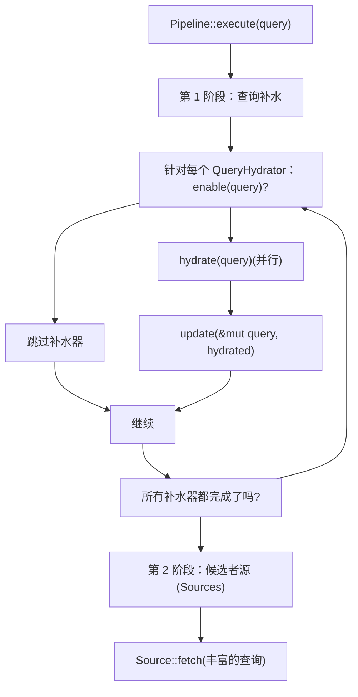
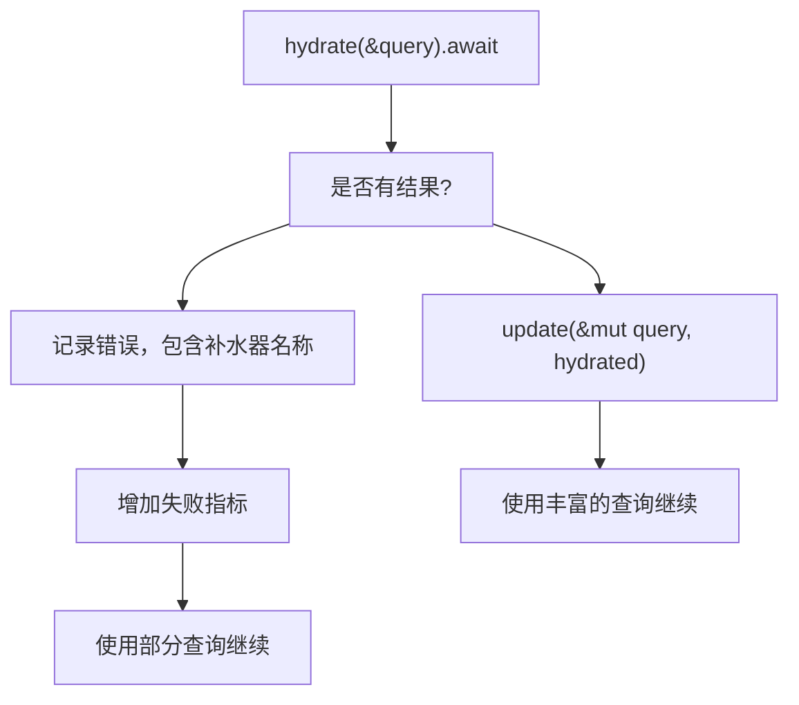

# QueryHydrator Trait (QueryHydrator 特征)

相关源文件

-   [candidate-pipeline/query\_hydrator.rs](https://github.com/xai-org/x-algorithm/blob/aaa167b3/candidate-pipeline/query_hydrator.rs)

## 目的与范围

`QueryHydrator` 特征定义了一个通用接口，用于在候选者检索开始前使用额外上下文丰富查询对象。查询补水器 (Query hydrators) 在候选者流水线执行的第一阶段并行执行，通过用户互动历史、行为特征和上下文信息等特定于用户的数据来增强初始查询。

本页记录了该特征接口、其在流水线执行中的生命周期以及实现模式。有关整体流水线执行模型的信息，请参阅 [流水线执行模型 (Pipeline Execution Model)](/xai-org/x-algorithm/3.1-pipeline-execution-model)。有关首页混合器 (Home Mixer) 中使用的具体实现，请参阅 [查询补水器 (Query Hydrators)](/xai-org/x-algorithm/4.4-query-hydrators)。

**来源：** [candidate-pipeline/query\_hydrator.rs1-28](https://github.com/xai-org/x-algorithm/blob/aaa167b3/candidate-pipeline/query_hydrator.rs#L1-L28)

---

## 特征定义 (Trait Definition)

`QueryHydrator` 特征被定义为一个通用的接口，由查询类型 `Q` 参数化：

```rust
pub trait QueryHydrator<Q>: Any + Send + Syncwhere    Q: Clone + Send + Sync + 'static
```
### 类型参数 (Type Parameters)

| 参数 | 约束 | 描述 |
| --- | --- | --- |
| `Q` | `Clone + Send + Sync + 'static` | 正在被丰富的查询类型（例如：`ScoredPostsQuery`） |

### 特征限定 (Trait Bounds)

-   `Any`：支持运行时类型检查，用于调试和监控
-   `Send + Sync`：允许跨线程的安全并发执行
-   要求 `Q` 为可克隆的，以支持不可变更新模式

**来源：** [candidate-pipeline/query\_hydrator.rs6-10](https://github.com/xai-org/x-algorithm/blob/aaa167b3/candidate-pipeline/query_hydrator.rs#L6-L10)

---

## 流水线集成

下显示了 `QueryHydrator` 在候选者流水线执行流中的位置：


查询补水器在任何候选者检索发生前执行，确保所有下游组件（源、补水器、过滤器、评分器）都在完全丰富的查询上下文上操作。

**来源：** [candidate-pipeline/query\_hydrator.rs1-28](https://github.com/xai-org/x-algorithm/blob/aaa167b3/candidate-pipeline/query_hydrator.rs#L1-L28)

---

## 特征方法 (Trait Methods)

### enable

```rust
fn enable(&self, _query: &Q) -> bool {    true}
```
确定此补水器是否应为给定的查询执行。默认实现返回 `true`，意味着补水器无条件运行。

**用例：**

-   特征标志检查（例如：仅在实验启用时补水）
-   查询特定条件（例如：仅针对某些语言环境）
-   性能优化（例如：如果数据已存在则跳过）

**参数：**

| 名称 | 类型 | 描述 |
| --- | --- | --- |
| `query` | `&Q` | 查询的不可变引用 |

**返回：** 表示是否执行 `hydrate` 的 `bool` 值

**来源：** [candidate-pipeline/query\_hydrator.rs11-14](https://github.com/xai-org/x-algorithm/blob/aaa167b3/candidate-pipeline/query_hydrator.rs#L11-L14)

---

### hydrate

```rust
async fn hydrate(&self, query: &Q) -> Result<Q, String>;
```
执行异步操作以丰富查询。该方法接收原始查询的不可变引用，并返回一个新的、已填充补水字段的查询实例。

**执行上下文：**

-   与其他已启用的查询补水器并行运行
-   在查询的克隆上操作以防止变动冲突
-   可能执行外部服务调用（数据库、RPC 服务、缓存）

**参数：**

| 名称 | 类型 | 描述 |
| --- | --- | --- |
| `query` | `&Q` | 原始查询的不可变引用 |

**返回：** `Result<Q, String>`，包含以下之一：

-   `Ok(Q)`：一个带有补水字段的新查询实例
-   `Err(String)`：描述失败的错误消息

**错误处理：** 如果 `hydrate` 返回错误，流水线通常会记录该失败，并根据配置继续使用部分丰富的数据执行。

**来源：** [candidate-pipeline/query\_hydrator.rs16-18](https://github.com/xai-org/x-algorithm/blob/aaa167b3/candidate-pipeline/query_hydrator.rs#L16-L18)

---

### update

```rust
fn update(&self, query: &mut Q, hydrated: Q);
```
选择性地将补水后的查询字段复制回原始的可变查询中。该方法通过确保每个补水器仅更新其负责的字段来强制执行字段级所有权。

**所有权模式 (Ownership Pattern)：**

`update` 方法实现了一种关键的设计模式：

1.  每个补水器“拥有”查询结构体中的特定字段
2.  只有这些拥有的字段从 `hydrated` 复制到 `query`
3.  其他字段保持不变，保留了其他补水器的成果

**示例模式：**

```rust
// 在 UserActionSeqQueryHydrator 中：
fn update(&self, query: &mut ScoredPostsQuery, hydrated: ScoredPostsQuery) {
    query.user_action_sequence = hydrated.user_action_sequence; // 仅更新拥有的字段
}
```
**参数：**

| 名称 | 类型 | 描述 |
| --- | --- | --- |
| `query` | `&mut Q` | 正在被丰富查询的可变引用 |
| `hydrated` | `Q` | 从 `hydrate` 返回的补水后的查询 |

**来源：** [candidate-pipeline/query\_hydrator.rs20-22](https://github.com/xai-org/x-algorithm/blob/aaa167b3/candidate-pipeline/query_hydrator.rs#L20-L22)

---

### name

```rust
fn name(&self) -> &'static str {    util::short_type_name(type_name_of_val(self))}
```
返回补水器的可读名称，用于日志记录、指标收集和调试。默认实现提取类型名称。

**返回：** 包含补水器简短类型名称的 `&'static str`

**来源：** [candidate-pipeline/query\_hydrator.rs24-26](https://github.com/xai-org/x-algorithm/blob/aaa167b3/candidate-pipeline/query_hydrator.rs#L24-L26)

---

## 执行模型

以下时序图展示了流水线如何编排多个查询补水器：

**关键执行特征：**

1.  **并行补水 (Parallel Hydration)**：所有启用的补水器使用 `tokio::join!` 或类似结构并发执行 `hydrate`
2.  **顺序更新 (Sequential Updates)**：`update` 调用按顺序执行，以安全地更改查询对象
3.  **字段隔离 (Field Isolation)**：每个补水器仅更新其拥有的字段，防止冲突

**来源：** [candidate-pipeline/query\_hydrator.rs1-28](https://github.com/xai-org/x-algorithm/blob/aaa167b3/candidate-pipeline/query_hydrator.rs#L1-L28)

---

## 实现模式

下图显示了特征 (trait)、流水线和具体实现之间的关系：


**来源：** [candidate-pipeline/query\_hydrator.rs1-28](https://github.com/xai-org/x-algorithm/blob/aaa167b3/candidate-pipeline/query_hydrator.rs#L1-L28)

---

## 首页混合器 (Home Mixer) 中的具体实现

首页混合器的 `PhoenixCandidatePipeline` 使用以下查询补水器来丰富 `ScoredPostsQuery`：

| 补水器 | 目的 | 更新的字段 | 外部服务 |
| --- | --- | --- | --- |
| `UserActionSeqQueryHydrator` | 检索最近的用户互动历史 | `user_action_sequence` | `UserActionSequenceFetcher` |
| `UserFeaturesQueryHydrator` | 获取用于评分的用户级特征 | `user_features` | `StratoClient` |

这些实现遵循特征模式：

1.  **`enable`**：检查特征标志或查询条件
2.  **`hydrate`**：进行异步服务调用以获取数据
3.  **`update`**：仅将拥有的字段复制到可变查询中

有关这些实现的详细文档，请参阅 [查询补水器 (Query Hydrators)](/xai-org/x-algorithm/4.4-query-hydrators)。

**来源：** [candidate-pipeline/query\_hydrator.rs1-28](https://github.com/xai-org/x-algorithm/blob/aaa167b3/candidate-pipeline/query_hydrator.rs#L1-L28)

---

## 设计理念 (Design Rationale)

### 不可变补水模式 (Immutable Hydration Pattern)

`hydrate` 方法在不可变引用上操作并返回新的查询实例，而不是原地修改。这种设计选择提供了：

1.  **安全并行 (Safe Parallelism)**：多个补水器可以同时读取原始查询而无需同步
2.  **失败隔离 (Failure Isolation)**：如果一个补水器失败，原始查询保持不变
3.  **测试简单性**：纯函数更容易测试和推理

### 选择性字段更新 (Selective Field Updates)

`update` 方法强制执行字段级所有权，防止补水器意外覆盖彼此的工作。这至关重要，因为：

1.  补水器并行执行，因此 `hydrate` 结果以非确定性顺序到达
2.  每个补水器“声明”其负责的特定字段
3.  顺序的 `update` 阶段安全地合并所有补水后的字段

### 条件执行 (Conditional Execution)

`enable` 方法允许运行时决定是否执行补水器，支持：

1.  **实验标志 (Experiment Flags)**：仅为处于特定实验中的用户补水
2.  **性能优化**：当数据已存在时跳过昂贵的操作
3.  **查询特定逻辑**：根据查询参数有条件地补水

**来源：** [candidate-pipeline/query\_hydrator.rs1-28](https://github.com/xai-org/x-algorithm/blob/aaa167b3/candidate-pipeline/query_hydrator.rs#L1-L28)

---

## 错误处理策略

查询补水器错误通常被优雅处理：


**错误处理特点：**

-   **非致命 (Non-Fatal)**：查询补水器失败通常不会终止流水线
-   **已记录 (Logged)**：错误记录中包含补水器名称和错误消息
-   **已计量 (Metered)**：失败会增加指标以进行监控和告警
-   **降级模式 (Degraded Mode)**：流水线使用部分丰富的查询继续执行

这种方法将可用性置于完整性之上，允许提要在某些丰富服务不可用时仍能提供结果。

**来源：** [candidate-pipeline/query\_hydrator.rs16-18](https://github.com/xai-org/x-algorithm/blob/aaa167b3/candidate-pipeline/query_hydrator.rs#L16-L18)

---

## 总结

`QueryHydrator` 特征为候选者流水线中的查询上下文丰富提供了一个可组合的接口。其设计实现了：

-   **并行执行**：多个补水器并发运行以提高性能
-   **字段隔离**：每个补水器拥有特定字段，防止冲突
-   **条件逻辑**：关于是否执行的运行时决策
-   **优雅降级**：错误不会阻止流水线执行

实现者必须提供获取数据的 `hydrate` 逻辑和选择性字段复制的 `update` 逻辑，而 `enable` 和 `name` 具有合理的默认值。

**来源：** [candidate-pipeline/query\_hydrator.rs1-28](https://github.com/xai-org/x-algorithm/blob/aaa167b3/candidate-pipeline/query_hydrator.rs#L1-L28)
