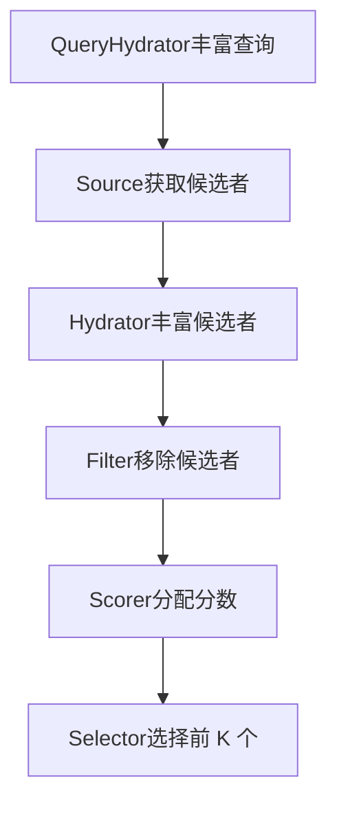
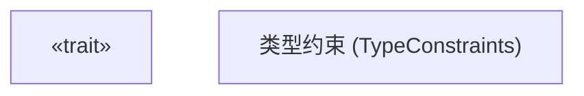
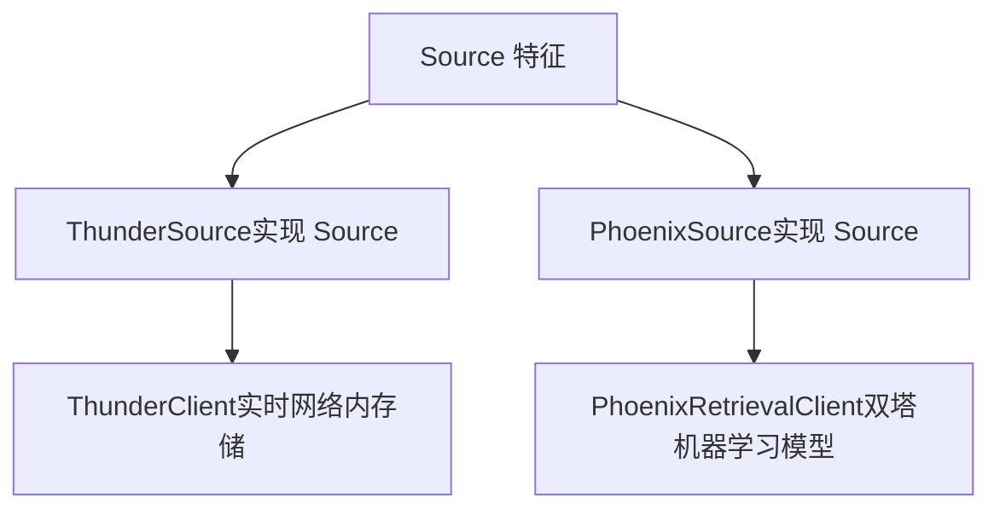

# Source 特征 (Source Trait)

相关源文件

-   [candidate-pipeline/source.rs](https://github.com/xai-org/x-algorithm/blob/aaa167b3/candidate-pipeline/source.rs)

## 目的与范围

本文件介绍了 `Source` 特征，它是候选管道框架中的一个基础抽象，定义了从各种数据源检索初始候选者集的接口。`Source` 特征由查询和候选者类型参数化，并提供条件执行功能，以便根据查询特征启用/禁用特定的源。

有关源如何流水线执行模型中被编排的信息，请参阅 [流水线执行模型 (Pipeline Execution Model)](/xai-org/x-algorithm/3.1-pipeline-execution-model)。有关主混频器 (Home Mixer) 中 `Source` 特征的具体实现（Thunder 和 Phoenix 源），请参阅 [候选者源 (Candidate Sources)](/xai-org/x-algorithm/4.3-candidate-sources)。

---

## 在流水线中的角色

`Source` 特征代表候选管道执行流中的第二个阶段，紧随查询充实之后。源负责获取初始的候选者集合，这些候选者随后将被充实、过滤、评分和选择。多个源可以并行工作，从不同的系统（例如：网络内帖子、网络外推荐）检索候选者。


**流水线阶段位置**

来源：[candidate-pipeline/source.rs1-23](https://github.com/xai-org/x-algorithm/blob/aaa167b3/candidate-pipeline/source.rs#L1-L23)

---

## 特征定义 (Trait Definition)

`Source` 特征被定义为一个通用的、由两个类型参数组成的异步特征：


**类型参数与约束**

| 类型参数 | 目的 | 约束 |
| --- | --- | --- |
| `Q` | 传递给源的查询类型 | `Clone + Send + Sync + 'static` |
| `C` | 由源返回的候选者类型 | `Clone + Send + Sync + 'static` |

该特征还要求实现者必须满足 `Any + Send + Sync`，从而支持运行时类型识别和跨线程的安全并发访问。

来源：[candidate-pipeline/source.rs6-11](https://github.com/xai-org/x-algorithm/blob/aaa167b3/candidate-pipeline/source.rs#L6-L11)

---

## 方法规范 (Method Specifications)

### enable

```rust
fn enable(&self, _query: &Q) -> bool
```
`enable` 方法提供条件执行逻辑，允许源确定是否应为特定查询运行。这支持了基于查询特征、实验配置或用户分群的动态源选择。

**默认实现**：返回 `true`，意味着除非重写，否则源对所有查询都是启用的。

**用例**：

-   针对某些用户分群禁用昂贵的源
-   对不同的候选者源进行 A/B 测试
-   基于查询参数的条件激活
-   速率限制或配额管理

来源：[candidate-pipeline/source.rs12-15](https://github.com/xai-org/x-algorithm/blob/aaa167b3/candidate-pipeline/source.rs#L12-L15)

---

### get\_candidates

```rust
async fn get_candidates(&self, query: &Q) -> Result<Vec<C>, String>
```
`get_candidates` 方法是核心异步操作，用于从底层数据源检索候选者。仅当 `enable` 返回 `true` 时，才会调用此方法。

**签名细节**：

-   **异步 (Async)**：支持网络请求、数据库查询或 RPC 调用的非阻塞 I/O
-   **输入**：查询对象的不可变引用
-   **输出**：`Result<Vec<C>, String>`，成功时包含候选者向量，失败时包含错误消息

**错误处理**：失败时返回 `String` 类型的错误消息，该消息会在流水线执行模型中传播。流水线框架根据其配置的错误容忍策略处理错误。

**性能考量**：

-   在可能的情况下，多个源并行执行
-   源应实现超时逻辑以防止请求挂起
-   当未发现候选者时，空候选者向量 (`Vec::new()`) 是有效的响应

来源：[candidate-pipeline/source.rs17](https://github.com/xai-org/x-algorithm/blob/aaa167b3/candidate-pipeline/source.rs#L17-L17)

---

### name

```rust
fn name(&self) -> &'static str
```
`name` 方法返回源的可读标识符，用于日志记录、指标收集和调试。

**默认实现**：使用 Rust 的类型内省通过 `type_name_of_val` 提取结构体名称，然后应用实用函数将其缩短为可读格式。

**在流水线中的用法**：

-   记录执行了哪些源
-   按源发出指标（延迟、成功率、候选者数量）
-   源发生故障时的错误归因

来源：[candidate-pipeline/source.rs19-21](https://github.com/xai-org/x-algorithm/blob/aaa167b3/candidate-pipeline/source.rs#L19-L21)

---

## 条件执行模型

`Source` 特征的条件执行能力支持灵活的流水线配置。执行流遵循以下模式：

**执行规则**：

1.  流水线为每个注册的源调用 `enable(query)`
2.  仅返回 `true` 的源继续进行候选者检索
3.  启用的源（在独立时）并行执行 `get_candidates`
4.  所有源的结果合并为单个候选者集合

来源：[candidate-pipeline/source.rs12-17](https://github.com/xai-org/x-algorithm/blob/aaa167b3/candidate-pipeline/source.rs#L12-L17)

---

## 与具体实现的集成

主混频器 (Home Mixer) 实现中的具体源类型实现了通用的 `Source` 特征：


**类型特化 (Type Specialization)**：

-   `Q` = `ScoredPostsQuery` (带有上下文的用户请求)
-   `C` = `PostCandidate` (带有元数据的推文候选者)

有关这些实现的详细文档，请参阅：

-   [Thunder 源 (Thunder Source)](/xai-org/x-algorithm/4.3.1-thunder-source) - 从实时存储中检索网络内帖子
-   [Phoenix 检索源 (Phoenix Retrieval Source)](/xai-org/x-algorithm/4.3.2-phoenix-retrieval-source) - 通过机器学习相似度搜索进行网络外发现

来源：[candidate-pipeline/source.rs7-10](https://github.com/xai-org/x-algorithm/blob/aaa167b3/candidate-pipeline/source.rs#L7-L10)

---

## 总结

`Source` 特征为候选者检索提供了一个清晰的抽象，具有以下关键特征：

| 特征 | 描述 |
| --- | --- |
| **通用性 (Genericity)** | 由查询和候选者类型参数化，以提高可复用性 |
| **条件执行 (Conditional Execution)** | `enable` 方法支持源的动态激活 |
| **异步设计 (Async Design)** | 通过 async/await 进行非阻塞的候选者检索 |
| **错误传播 (Error Propagation)** | 基于字符串的错误消息，用于流水线级处理 |
| **并行执行 (Parallel Execution)** | 多个源可以并发执行 |
| **可观测性 (Observable)** | 内置命名支持，用于指标收集和日志记录 |

该特征的设计优先考虑了灵活性、性能和可维护性，使流水线框架能够通过一致的编排语义支持多样化的候选者源。

来源：[candidate-pipeline/source.rs1-23](https://github.com/xai-org/x-algorithm/blob/aaa167b3/candidate-pipeline/source.rs#L1-L23)
