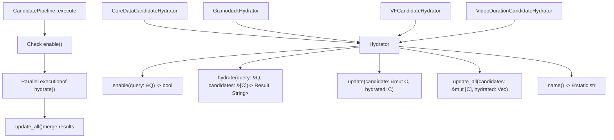
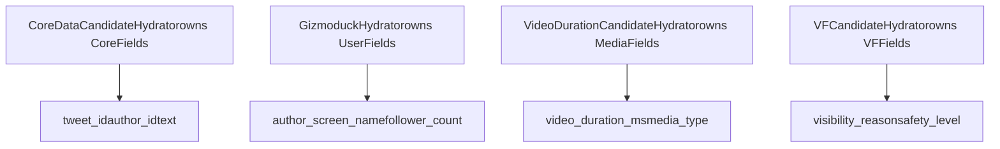
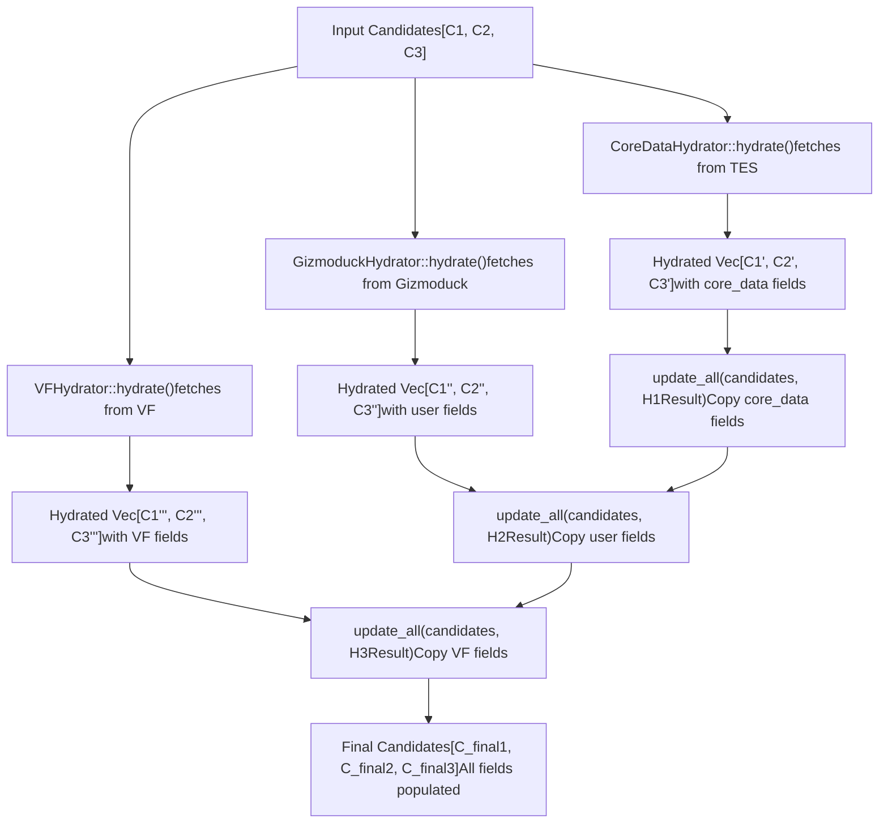
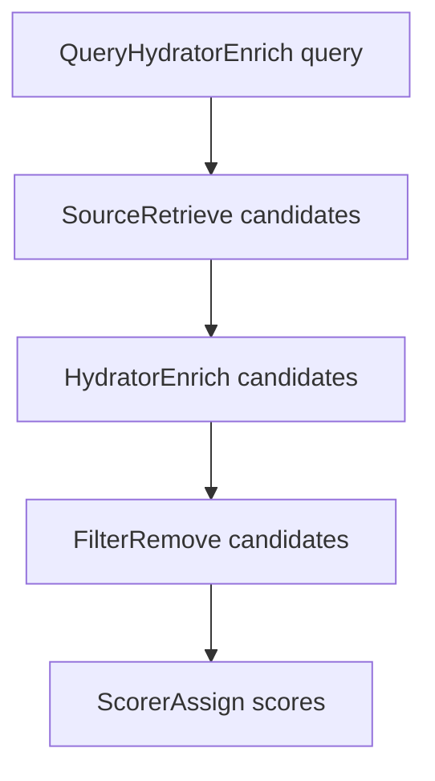

# Hydrator Trait (充实器特征)

相关源文件

-   [candidate-pipeline/hydrator.rs](https://github.com/xai-org/x-algorithm/blob/aaa167b3/candidate-pipeline/hydrator.rs)

## 目的与范围

`Hydrator` 特征是候选管道框架 (Candidate Pipeline Framework) 中的核心抽象，它允许在检索后使用额外数据充实候选者。充实器 (Hydrators) 并行执行，从外部服务获取元数据、用户信息、可见性数据和其他字段，逐步构建完整的候选者对象。

本页面介绍了该特征的接口、执行语义和字段级更新模式。对于查询级充实，请参见 [QueryHydrator 特征](/xai-org/x-algorithm/3.2-queryhydrator-trait)。对于主混频器 (Home Mixer) 中的具体充实器实现，请参见 [候选者充实器](/xai-org/x-algorithm/4.5-candidate-hydrators)。

**来源：** [candidate-pipeline/hydrator.rs1-40](https://github.com/xai-org/x-algorithm/blob/aaa167b3/candidate-pipeline/hydrator.rs#L1-L40)

---

## 特征定义

`Hydrator` 特征定义为一个通用的、异步的候选者充实接口：

```rust
#[async_trait]
pub trait Hydrator<Q, C>: Any + Send + Sync
```

### 类型参数

| 参数 | 描述 | 约束 |
| --- | --- | --- |
| `Q` | 包含请求上下文的查询类型 | `Clone + Send + Sync + 'static` |
| `C` | 待充实的候选者类型 | `Clone + Send + Sync + 'static` |

该特征要求 `Any + Send + Sync` 约束以支持：

-   **`Any`**: 运行时类型内省 (Runtime type introspection) 和向下转型 (Downcasting)
-   **`Send + Sync`**: 跨线程的安全并发执行
-   **生命周期 `'static`**: 无借用引用，实现灵活的异步执行

**来源：** [candidate-pipeline/hydrator.rs5-11](https://github.com/xai-org/x-algorithm/blob/aaa167b3/candidate-pipeline/hydrator.rs#L5-L11)

---

## 特征架构



**来源：** [candidate-pipeline/hydrator.rs5-39](https://github.com/xai-org/x-algorithm/blob/aaa167b3/candidate-pipeline/hydrator.rs#L5-L39)

---

## 方法参考

### `enable()`

```rust
fn enable(&self, _query: &Q) -> bool {    true}
```

**目的：** 条件执行控制。确定此充实器是否应针对给定查询运行。

**默认行为：** 始终返回 `true`，意味着充实器无条件运行。

**使用场景：**

-   基于查询参数的功能门控 (Feature gating)
-   对不同充实策略进行 A/B 测试
-   跳过针对某些用户细分的高昂充实过程

**示例模式：**

```rust
// 假设实现
fn enable(&self, query: &ScoredPostsQuery) -> bool {    query.client_context.is_premium_user}
```

**来源：** [candidate-pipeline/hydrator.rs12-15](https://github.com/xai-org/x-algorithm/blob/aaa167b3/candidate-pipeline/hydrator.rs#L12-L15)

---

### `hydrate()`

```rust
async fn hydrate(&self, query: &Q, candidates: &[C]) -> Result<Vec<C>, String>
```

**目的：** 执行异步数据获取和充实。这是发生外部服务调用、数据库查询和计算的地方。

**参数：**

-   `query`: 用于做出充实决策的请求上下文
-   `candidates`: 待充实的候选者切片 (Slice)

**返回值：**

-   `Ok(Vec<C>)`: 成功充实的候选者
-   `Err(String)`: 失败时的错误消息

**关键约束：** 返回的向量必须：

1.  包含与输入相同数量 host 的候选者
2.  保持候选者的确切顺序
3.  不丢弃任何候选者

丢弃候选者违反了特征契约，必须在 [过滤器 (Filter)](/xai-org/x-algorithm/3.5-filter-trait) 阶段执行。

**来源：** [candidate-pipeline/hydrator.rs17-22](https://github.com/xai-org/x-algorithm/blob/aaa167b3/candidate-pipeline/hydrator.rs#L17-L22)

---

### `update()`

```rust
fn update(&self, candidate: &mut C, hydrated: C)
```

**目的：** 字段级选择性合并。仅将此充实器负责的字段从 `hydrated` 复制到 `candidate` 中。

**字段所有权模型：**



每个充实器实现必须：

-   仅修改其“拥有”的字段
-   保持其他字段不变
-   不依赖于其他充实器拥有的字段

这种所有权模型实现了：

-   **并行执行**：由于充实器修改不相交的字段集，因此不存在数据竞态 (Data races)
-   **模块化**：充实器是独立且可组合的
-   **可测试性**：每个充实器都可以独立测试

**来源：** [candidate-pipeline/hydrator.rs24-26](https://github.com/xai-org/x-algorithm/blob/aaa167b3/candidate-pipeline/hydrator.rs#L24-L26)

---

### `update_all()`

```rust
fn update_all(&self, candidates: &mut [C], hydrated: Vec<C>) {    for (c, h) in candidates.iter_mut().zip(hydrated) {        self.update(c, h);    }}
```

**目的：** 批量字段更新。将 `update()` 应用于每个候选者-充实对。

**默认行为：** 遍历两个集合并为每一对调用 `update()`。

**何时重写：** 很少需要，但可用于：

-   具有副作用的批量操作
-   优化的批量处理
-   特殊的合并逻辑

**来源：** [candidate-pipeline/hydrator.rs28-34](https://github.com/xai-org/x-algorithm/blob/aaa167b3/candidate-pipeline/hydrator.rs#L28-L34)

---

### `name()`

```rust
fn name(&self) -> &'static str {    util::short_type_name(type_name_of_val(self))}
```

**目的：** 返回此充实器的人类可读名称，用于日志记录、指标和调试。

**默认实现：** 通过运行时类型内省提取结构体名称。

**示例输出：**

-   `CoreDataCandidateHydrator` → `"CoreDataCandidateHydrator"`
-   `GizmoduckHydrator` → `"GizmoduckHydrator"`

**来源：** [candidate-pipeline/hydrator.rs36-38](https://github.com/xai-org/x-algorithm/blob/aaa167b3/candidate-pipeline/hydrator.rs#L36-L38)

---

## 并行执行模型

充实器并行执行以最小化延迟。流水线编排所有已启用充实器的并发执行。

### 执行顺序

**并行化的优势**

| 方面 | 串行 | 并行 |
| --- | --- | --- |
| **总延迟** | 所有充实器延迟之和 | 任何充实器中的最大延迟 |
| **吞吐量** | 受最慢充实器限制 | 受可用核心限制 |
| **资源利用率** | 异步运行时利用不足 | 使 I/O 和 CPU 饱和 |

**示例：** 如果 CoreData 耗时 20ms，Gizmoduck 耗时 15ms，VF 耗时 30ms：

-   **串行**：20 + 15 + 30 = 65ms
-   **并行**：max(20, 15, 30) = 30ms

**来源：** [candidate-pipeline/hydrator.rs5](https://github.com/xai-org/x-algorithm/blob/aaa167b3/candidate-pipeline/hydrator.rs#L5-L5)

---

## 字段级更新策略

充实器模式使用一个两阶段过程：**获取 (Fetch)** (并行) + **合并 (Merge)** (串行)。

### 两阶段更新模式



### 为什么采用这种设计？

1.  **并行获取**：外部服务调用是独立的且受 I/O 限制，因此并行化可以最大限度地提高吞吐量
2.  **串行合并**：字段更新涉及不相交的内存区域，但串行执行简化了推理并防止了潜在的合并冲突
3.  **不可变获取**：`hydrate()` 返回新的 `Vec<C>` 而不是原位修改，从而支持纯函数式模式

**来源：** [candidate-pipeline/hydrator.rs17-34](https://github.com/xai-org/x-algorithm/blob/aaa167b3/candidate-pipeline/hydrator.rs#L17-L34)

---

## 约束与不变性

### 顺序保持

```rust
// ✅ 正确：顺序相同，计数相同
async fn hydrate(&self, query: &Q, candidates: &[C]) -> Result<Vec<C>, String> {    let mut result = Vec::with_capacity(candidates.len());    for candidate in candidates {        result.push(self.enrich(candidate).await?);    }    Ok(result)} // ❌ 错误：过滤候选者破坏了顺序
async fn hydrate(&self, query: &Q, candidates: &[C]) -> Result<Vec<C>, String> {    let mut result = Vec::new();    for candidate in candidates {        if candidate.is_valid() {  // ❌ 丢弃了候选者！
            result.push(self.enrich(candidate).await?);        }    }    Ok(result)}
```

**原理：** 流水线通过索引位置跟踪候选者。重新排序或丢弃候选者会破坏下游阶段（如 `update_all()`），后者依赖 `zip()` 来匹配候选者。

**来源：** [candidate-pipeline/hydrator.rs20-21](https://github.com/xai-org/x-algorithm/blob/aaa167b3/candidate-pipeline/hydrator.rs#L20-L21)

---

### 字段所有权

每个充实器必须仅修改其拥有的字段：

```rust
// ✅ 正确：仅更新拥有的字段
fn update(&self, candidate: &mut PostCandidate, hydrated: PostCandidate) {    // CoreDataHydrator 仅更新这些字段
    candidate.tweet_text = hydrated.tweet_text;    candidate.author_id = hydrated.author_id;    candidate.created_at = hydrated.created_at;    // 不触碰 author_screen_name (由 GizmoduckHydrator 拥有)
} // ❌ 错误：修改由其他充实器拥有的字段
fn update(&self, candidate: &mut PostCandidate, hydrated: PostCandidate) {    candidate.tweet_text = hydrated.tweet_text;    candidate.author_screen_name = hydrated.author_screen_name;  // ❌ 不属于它拥有！
}
```

**来源：** [candidate-pipeline/hydrator.rs24-26](https://github.com/xai-org/x-algorithm/blob/aaa167b3/candidate-pipeline/hydrator.rs#L24-L26)

---

### 幂等性

充实器应该是幂等的 (Idempotent)：使用相同的输入多次调用 `hydrate()` 应该产生相同的输出。

**原因：** 支持重试逻辑、缓存以及错误场景下的可预测行为。

---

## 与流水线的集成

`Hydrator` 特征在流水线中集成在 [来源 (Source)](/xai-org/x-algorithm/3.3-source-trait) 和 [过滤器 (Filter)](/xai-org/x-algorithm/3.5-filter-trait) 阶段之间。

### 流水线阶段交互



**主要区别：**

| 方面 | 来源 (Source) | 充实器 (Hydrator) | 过滤器 (Filter) |
| --- | --- | --- | --- |
| **输入** | 仅查询 | 查询 + 候选者 | 查询 + 候选者 |
| **输出** | 新候选者 | 充实的候选者 (数量相同) | 过滤后的候选者 (数量减少) |
| **执行** | 并行 | 并行 | 串行 |
| **目的** | 检索 | 充实 | 消除 |

**来源：** [candidate-pipeline/hydrator.rs1-40](https://github.com/xai-org/x-algorithm/blob/aaa167b3/candidate-pipeline/hydrator.rs#L1-L40)

---

## 具体实现

主混频器 (Home Mixer) 为 Phoenix 候选者流水线实现了多个充实器：

| 充实器 | 填充的字段 | 外部服务 |
| --- | --- | --- |
| `CoreDataCandidateHydrator` | `tweet_text`, `author_id`, `core_data` | TES (推文实体服务 (Tweet Entity Service)) |
| `GizmoduckHydrator` | `author_screen_name`, `follower_count` | Gizmoduck |
| `InNetworkCandidateHydrator` | `is_in_network` | 本地图查找 (Local graph lookup) |
| `SubscriptionHydrator` | `subscription_author_ids` | TES |
| `VFCandidateHydrator` | `visibility_reason`, `vf_result` | 可见性过滤 (Visibility Filtering) |
| `VideoDurationCandidateHydrator` | `video_duration_ms` | TES |

有关每个实现的详细文档，请参见 [候选者充实器](/xai-org/x-algorithm/4.5-candidate-hydrators)。

**来源：** [candidate-pipeline/hydrator.rs1-40](https://github.com/xai-org/x-algorithm/blob/aaa167b3/candidate-pipeline/hydrator.rs#L1-L40)

---

## 使用示例

典型的充实器实现模式：

```rust
pub struct CoreDataCandidateHydrator {    tes_client: Arc<dyn TESClient>,} #[async_trait]impl Hydrator<ScoredPostsQuery, PostCandidate> for CoreDataCandidateHydrator {    fn enable(&self, _query: &ScoredPostsQuery) -> bool {        true  // 始终运行
    }        async fn hydrate(        &self,        _query: &ScoredPostsQuery,        candidates: &[PostCandidate],    ) -> Result<Vec<PostCandidate>, String> {        let tweet_ids: Vec<_> = candidates.iter().map(|c| c.tweet_id).collect();        let tweet_data = self.tes_client.batch_get_tweets(&tweet_ids).await?;                // 必须保持顺序和计数
        let hydrated: Vec<_> = candidates.iter().enumerate().map(|(i, c)| {            let mut enriched = c.clone();            if let Some(data) = tweet_data.get(i) {                enriched.tweet_text = Some(data.text.clone());                enriched.author_id = Some(data.author_id);            }            enriched        }).collect();                Ok(hydrated)    }        fn update(&self, candidate: &mut PostCandidate, hydrated: PostCandidate) {        // 仅复制由此充实器拥有的字段
        candidate.tweet_text = hydrated.tweet_text;        candidate.author_id = hydrated.author_id;        candidate.core_data = hydrated.core_data;    }}
```

**来源：** [candidate-pipeline/hydrator.rs5-39](https://github.com/xai-org/x-algorithm/blob/aaa167b3/candidate-pipeline/hydrator.rs#L5-L39)
