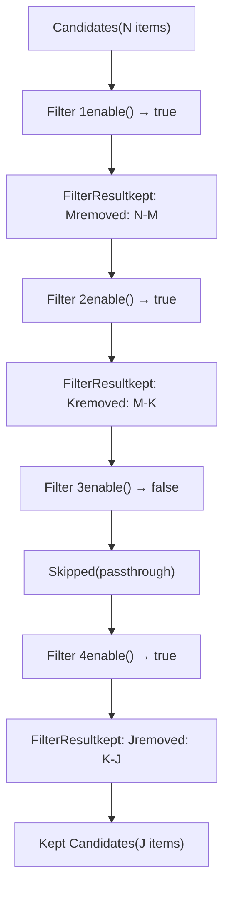
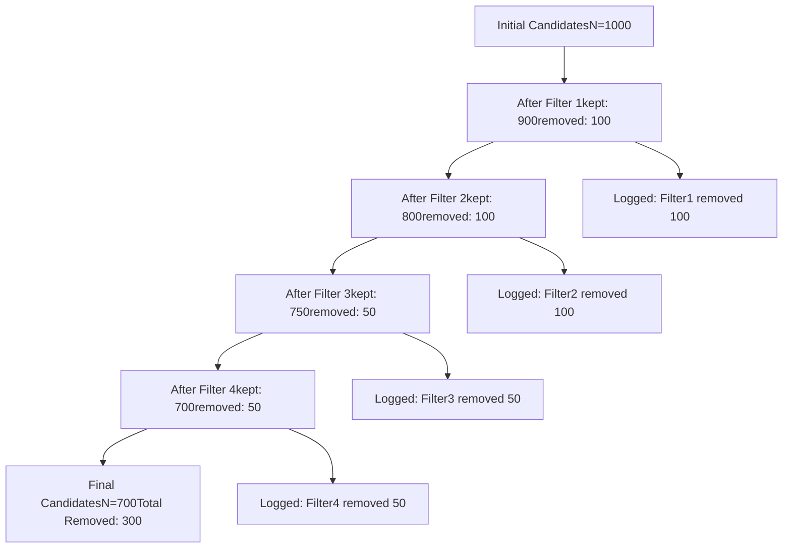
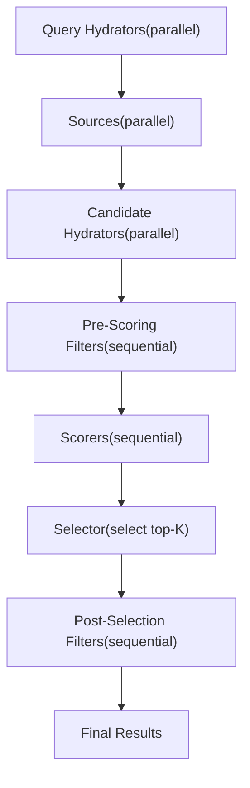
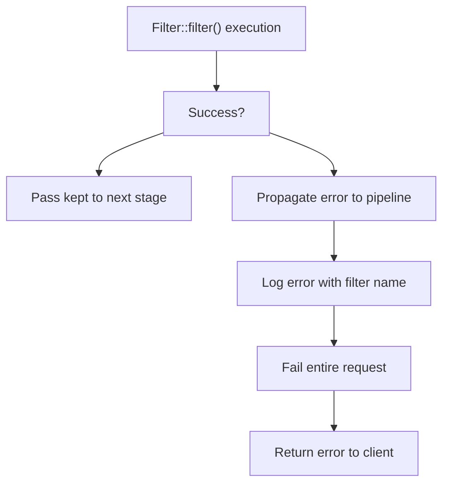

# 过滤器特征 (Filter Trait)

相关源文件

-   [candidate-pipeline/filter.rs](https://github.com/xai-org/x-algorithm/blob/aaa167b3/candidate-pipeline/filter.rs)

## 目的与范围

本文档描述了 `Filter` 特征，它是候选管道框架 (Candidate Pipeline Framework) 中的核心抽象，用于从处理流水线中移除不符合条件的候选者。过滤器 (Filters) 根据资格标准将候选者划分为保留集和移除集。该特征定义在通用框架层，并由主混频器 (Home Mixer) 实现中的各种具体过滤器实现。

有关主混频器中的具体过滤器实现，请参见 [过滤器 (Filters)](/xai-org/x-algorithm/4.6-filters)。有关其他流水线阶段特征，请参见 [QueryHydrator](/xai-org/x-algorithm/3.2-queryhydrator-trait)、[Source](/xai-org/x-algorithm/3.3-source-trait)、[Hydrator](/xai-org/x-algorithm/3.4-hydrator-trait)、[Scorer](/xai-org/x-algorithm/3.6-scorer-trait) 和 [Selector](/xai-org/x-algorithm/3.7-selector-trait)。

---

## 概览

`Filter` 特征提供了一个标准接口，用于移除不满足特定资格标准的候选者。与充实数据 host 的充实器或分配分值的打分器不同，过滤器执行二元决策：每个候选者要么被保留用于进一步处理，要么从流水线中移除。

Filter 特征的关键特性：

-   **顺序执行**：过滤器按定义的顺序一个接一个地执行，每个过滤器在之前过滤器的输出上运行。
-   **划分逻辑**：每个过滤器将输入的候选者划分为两个集合：保留 (Kept) 和移除 (Removed)。
-   **条件执行**：可以根据查询属性条件性地启用过滤器。
-   **不可变决策**：候选者一旦被过滤器移除，就不会进入后续阶段。
-   **显式追踪**：同时返回保留和移除的候选者，以便于记录、指标追踪和调试。

**来源：** [candidate-pipeline/filter.rs1-33](https://github.com/xai-org/x-algorithm/blob/aaa167b3/candidate-pipeline/filter.rs#L1-L33)

---

## 特征定义

`Filter` 特征定义了两个泛型参数：

```rust
pub trait Filter<Q, C>: Any + Send + Syncwhere    Q: Clone + Send + Sync + 'static,    C: Clone + Send + Sync + 'static,
```

| 类型参数 | 描述 |
| --- | --- |
| `Q` | 为过滤决策提供上下文的查询类型（例如 `ScoredPostsQuery`） |
| `C` | 正在被过滤的候选者类型（例如 `PostCandidate`） |

### 类型约束

两个泛型类型都必须满足：

-   `Clone`：允许复制数据结构。
-   `Send + Sync`：允许在线程间进行安全的并发访问。
-   `'static`：确保数据在程序运行期间一直存在。

该特征本身要求 `Any + Send + Sync`，从而支持：

-   通过 `std::any::Any` 进行运行时类型识别。
-   在异步运行时跨线程的安全执行。
-   在特征对象 (Trait object) 集合中的类型擦除存储。

**来源：** [candidate-pipeline/filter.rs13-17](https://github.com/xai-org/x-algorithm/blob/aaa167b3/candidate-pipeline/filter.rs#L13-L17)

---

## FilterResult 结构

每个过滤器返回一个显式划分候选者的 `FilterResult<C>`：

```rust
pub struct FilterResult<C> {    pub kept: Vec<C>,    pub removed: Vec<C>,}
```

### 字段语义

| 字段 | 描述 |
| --- | --- |
| `kept` | 通过过滤器标准并进入下一阶段的候选者 |
| `removed` | 未通过过滤器标准并从后续处理中排除的候选者 |

这种显式的划分结构实现了：

-   **可观察性**：可以记录被移除的候选者及其原因，以便于调试。
-   **指标**：可以衡量过滤器的有效性（例如移除率、移除原因分布）。
-   **可审计性**：流水线维护了哪个过滤器移除了哪些候选者的完整记录。
-   **测试**：可以通过检查保留集和移除集来验证过滤器的行为。

**来源：** [candidate-pipeline/filter.rs6-9](https://github.com/xai-org/x-algorithm/blob/aaa167b3/candidate-pipeline/filter.rs#L6-L9)

---

## 特征方法

### enable 方法

```rust
fn enable(&self, _query: &Q) -> bool {    true}
```

`enable` 方法确定是否应为给定查询执行过滤器。

| 方面 | 详情 |
| --- | --- |
| 默认行为 | 返回 `true`（过滤器始终运行） |
| 重写目的 | 基于查询属性的条件性过滤器执行 |
| 常见使用场景 | \- 为特定用户群组禁用过滤器 <br> \- 为缓存的查询跳过高成本过滤器 <br> \- 通过功能标志启用实验性过滤器 |
| 执行时机 | 在流水线执行期间在 `filter` 方法之前调用 |

重写的示例场景：

-   仅适用于网络外内容的过滤器可以检查查询标志。
-   需要特定充实查询数据的过滤器可以验证其是否存在。
-   处于实验性推出的过滤器可以检查用户队列分配。

**来源：** [candidate-pipeline/filter.rs18-21](https://github.com/xai-org/x-algorithm/blob/aaa167b3/candidate-pipeline/filter.rs#L18-L21)

---

### filter 方法

```rust
async fn filter(&self, query: &Q, candidates: Vec<C>) -> Result<FilterResult<C>, String>;
```

`filter` 方法是划分候选者的核心过滤逻辑。

| 方面 | 详情 |
| --- | --- |
| 执行模型 | 异步，允许 I/O 操作（例如缓存查找、服务调用） |
| 输入 | 查询上下文和要过滤的候选者向量 |
| 输出 | `Result<FilterResult<C>, String>` - 成功时返回包含保留/移除划分的结果，或返回错误消息 |
| 错误处理 | 错误会传播到流水线执行，通常会导致整个请求失败 |

#### 实现模式

**模式 1：同步谓词** 大多数过滤器使用同步逻辑，根据谓词评估每个候选者：

```
for each candidate:
    if predicate(query, candidate):
        kept.push(candidate)
    else:
        removed.push(candidate)
```

**模式 2：异步外部检查** 某些过滤器需要异步操作（例如检查布隆过滤器缓存）：

```
futures = candidates.map(|c| async_check(c))
results = join_all(futures).await
partition results into kept/removed
```

**模式 3：批量优化** 过滤器可以批量进行外部调用以提高效率：

```
ids = extract_ids(candidates)
blocked_ids = fetch_blocked_batch(ids).await
partition candidates based on blocked_ids
```

**来源：** [candidate-pipeline/filter.rs23-26](https://github.com/xai-org/x-algorithm/blob/aaa167b3/candidate-pipeline/filter.rs#L23-L26)

---

### name 方法

```rust
fn name(&self) -> &'static str {    util::short_type_name(type_name_of_val(self))}
```

`name` 方法返回过滤器的稳定标识符。

| 方面 | 详情 |
| --- | --- |
| 默认行为 | 从实现结构体中提取类型名称 |
| 返回类型 | 具有 'static 生命周期的静态字符串切片 (String slice) |
| 常见重写 | 提供比完整类型路径更具可读性的名称 |
| 用途 | \- 记录过滤器执行情况 <br> \- 发送每个过滤器的指标 <br> \- 调试流水线阶段顺序 <br> \- 生成执行追踪 |

示例默认名称：

-   `AgeFilter`（短类型名称）
-   `AuthorSocialgraphFilter`
-   `DropDuplicatesFilter`

**来源：** [candidate-pipeline/filter.rs29-31](https://github.com/xai-org/x-algorithm/blob/aaa167b3/candidate-pipeline/filter.rs#L29-L31)

---

## 执行模型

### 顺序执行模式

与可以并行运行的充实器不同，过滤器以确定的顺序顺序执行。这种设计确保了：

1.  **高效早期拒绝**：低成本过滤器首先运行，以便在高成本操作之前排除候选者。
2.  **依赖排序**：后续过滤器可以假设先前过滤器的不变性成立。
3.  **确定的结果**：相同的输入产生相同的输出，无论执行时机如何。



**来源：** [candidate-pipeline/filter.rs11](https://github.com/xai-org/x-algorithm/blob/aaa167b3/candidate-pipeline/candidate_pipeline.rs#L11-L11)

---

### 划分语义

每个过滤器实现一个满足以下条件的划分函数：

```
kept ∪ removed = input
kept ∩ removed = ∅
```

特性：

-   **完备性**：每个输入的候选者恰好出现在一个输出集中。
-   **不相交性**：候选者不会同时出现在保留集和移除集中。
-   **顺序保持**：保留的候选者（通常）保持其相对顺序。
-   **幂等性**：两次运行相同的过滤器产生相同的保留集。

### 流水线级累积

流水线累积跨所有过滤器的移除信息：



**来源：** [candidate-pipeline/filter.rs6-9](https://github.com/xai-org/x-algorithm/blob/aaa167b3/candidate-pipeline/filter.rs#L6-L9)

---

## 与候选管道的集成

### 在流水线阶段中的位置

过滤器在候选管道执行流中占据两个位置：



**打分前过滤器 (Pre-Scoring Filters)**：在高成本 ML 打分之前移除候选者。

-   年龄过滤器（排除旧推文）
-   重复项过滤器（移除冗余候选者）
-   屏蔽/静音过滤器（尊重用户偏好）
-   自推过滤器（从推荐中移除用户自己的推文）

**选择后过滤器 (Post-Selection Filters)**：打分后验证前 K 个候选者。

-   可见性过滤器（最终安全检查）
-   对话去重（确保线程多样性）
-   实时检查（验证推文仍然存在且未被删除）

**来源：** [candidate-pipeline/filter.rs1-33](https://github.com/xai-org/x-algorithm/blob/aaa167b3/candidate-pipeline/filter.rs#L1-L33)

---

### 类型系统中的 Filter 特征

下图显示了 Filter 特征如何与其他流水线特征相关联：

```mermaid
flowchart TD
    classId_Filter_7["«trait»"]
    classId_FilterResult_8["«struct»"]
    classId_AgeFilter_9["AgeFilter"]
    classId_AuthorSocialgraphFilter_10["AuthorSocialgraphFilter"]
    classId_DropDuplicatesFilter_11["DropDuplicatesFilter"]
    classId_PreviouslySeenPostsFilter_12["PreviouslySeenPostsFilter"]
    classId_MutedKeywordFilter_13["MutedKeywordFilter"]
    classId_VFFilter_14["VFFilter"]
```



**来源：** [candidate-pipeline/filter.rs6-32](https://github.com/xai-org/x-algorithm/blob/aaa167b3/candidate-pipeline/filter.rs#L6-L32)

---

## 实现契约

`Filter` 特征的实现者必须遵守以下契约：

### 正确性要求

| 要求 | 描述 |
| --- | --- |
| **划分完备性** | 每个输入候选者必须出现在 `kept` 或 `removed` 之一中 |
| **无重复** | 候选者不得同时出现在 `kept` 和 `removed` 中 |
| **无损失** | 保留和移除长度之和必须等于输入长度 |
| **无创建** | 不能添加输入中不存在的候选者 |
| **异步安全** | 必须在具有 Send + Sync 绑定的异步上下文中可以安全调用 |

### 性能考虑

| 考虑因素 | 指导建议 |
| --- | --- |
| **时间复杂度** | 应为 O(n) 或更优；尽可能避免 O(n²) 比较 |
| **内存分配** | 尽可能重用向量；避免不必要的克隆 (Cloning) |
| **外部调用** | 批量执行外部服务调用；在过滤器内使用异步并发 |
| **早期退出** | 尽可能短路评估（例如空输入） |

### 示例过滤器骨架

典型的过滤器实现遵循以下结构：

```rust
impl Filter<ScoredPostsQuery, PostCandidate> for MyFilter {
    fn enable(&self, query: &ScoredPostsQuery) -> bool {
        // 检查查询标志、功能门控等。
    }

    async fn filter(
        &self,
        query: &ScoredPostsQuery,
        candidates: Vec<PostCandidate>
    ) -> Result<FilterResult<PostCandidate>, String> {
        let mut kept = Vec::new();
        let mut removed = Vec::new();

        for candidate in candidates {
            if should_keep(query, &candidate) {
                kept.push(candidate);
            } else {
                removed.push(candidate);
            }
        }

        Ok(FilterResult { kept, removed })
    }
}
```

**来源：** [candidate-pipeline/filter.rs1-33](https://github.com/xai-org/x-algorithm/blob/aaa167b3/candidate-pipeline/filter.rs#L1-L33)

---

## 与流水线执行的关系

`CandidatePipeline` 特征作为其 `execute` 方法的一部分编排过滤器执行。流水线：

1.  在每个过滤器上调用 `enable()` 以确定是否应运行。
2.  对于启用的过滤器，使用当前候选者调用 `filter()`。
3.  将 `kept` 候选者传递给下一个过滤器。
4.  累积 `removed` 候选者以实现可观察性。
5.  继续直到所有过滤器处理完毕或发生错误。

**来源：** [candidate-pipeline/filter.rs1-33](https://github.com/xai-org/x-algorithm/blob/aaa167b3/candidate-pipeline/filter.rs#L1-L33)

---

## 常见过滤器模式

### 模式 1：基于属性的过滤器

在没有外部依赖的情况下检查候选者属性的过滤器：

```
示例：
- AgeFilter: 检查候选者时间戳
- SelfTweetFilter: 检查是否 candidate.author_id == query.user_id
- DropDuplicatesFilter: 检查重复的候选者 ID
```

特性：

-   快速（无 I/O）
-   包裹在异步函数中的同步逻辑
-   应在过滤器链中尽早执行

---

### 模式 2：查询上下文过滤器

将候选者与查询充实上下文进行比较的过滤器：

```
示例：
- PreviouslySeenPostsFilter: 检查 candidate.id 是否在 query.seen_ids 中
- MutedKeywordFilter: 检查 candidate.text 是否匹配 query.muted_keywords
- AuthorSocialgraphFilter: 检查 candidate.author_id 是否在 query.blocked_ids 中
```

特性：

-   需要查询充实已完成
-   使用哈希集或布隆过滤器进行快速查找
-   应在基于属性的过滤器之后执行

---

### 模式 3：外部服务过滤器

调用外部服务进行验证的过滤器：

```
示例：
- VFFilter: 调用可见性过滤服务
- RealTimeValidationFilter: 验证推文是否仍存在于数据库中
```

特性：

-   异步 I/O 操作
-   应尽可能批量处理请求
-   应在低成本过滤器减少候选者集合后执行
-   通常用于选择后阶段

**来源：** [candidate-pipeline/filter.rs1-33](https://github.com/xai-org/x-algorithm/blob/aaa167b3/candidate-pipeline/filter.rs#L1-L33)

---

## 错误处理策略

过滤器错误对整个流水线有影响：



### 错误处理准则

| 场景 | 推荐方法 |
| --- | --- |
| **预期失败** | 记录并过滤掉（例如格式错误的候选者） |
| **外部服务故障** | 返回错误以快速失败并触发重试 |
| **无效查询状态** | 返回指示配置错误的错误 |
| **部分结果** | 根据每个过滤器决定：失败或使用可用数据继续 |

**来源：** [candidate-pipeline/filter.rs26](https://github.com/xai-org/x-algorithm/blob/aaa167b3/candidate-pipeline/candidate_pipeline.rs#L26-L26)

---

## 总结

`Filter` 特征在流水线框架中提供了候选者移除的标准接口。关键设计原则包括：

-   **顺序执行**：用于确定的排序和早期拒绝。
-   **显式划分**：分为保留集和移除集，以实现可观察性。
-   **条件执行**：通过 `enable()` 实现动态过滤器行为。
-   **类型安全**：通过泛型参数 Q 和 C 实现。
-   **异步支持**：适用于需要外部服务调用的过滤器。

主混频器中的具体实现利用该特征在打分前和选择后阶段强制执行业务规则、用户偏好和内容安全策略。

**来源：** [candidate-pipeline/filter.rs1-33](https://github.com/xai-org/x-algorithm/blob/aaa167b3/candidate-pipeline/filter.rs#L1-L33)
