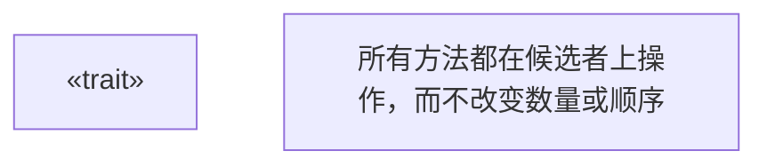
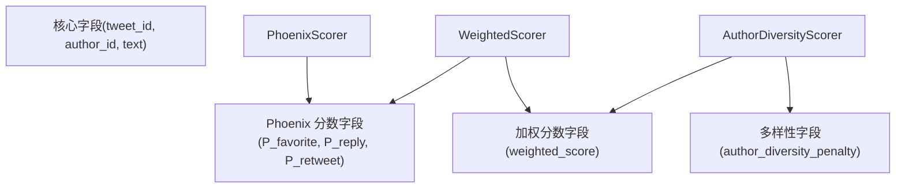
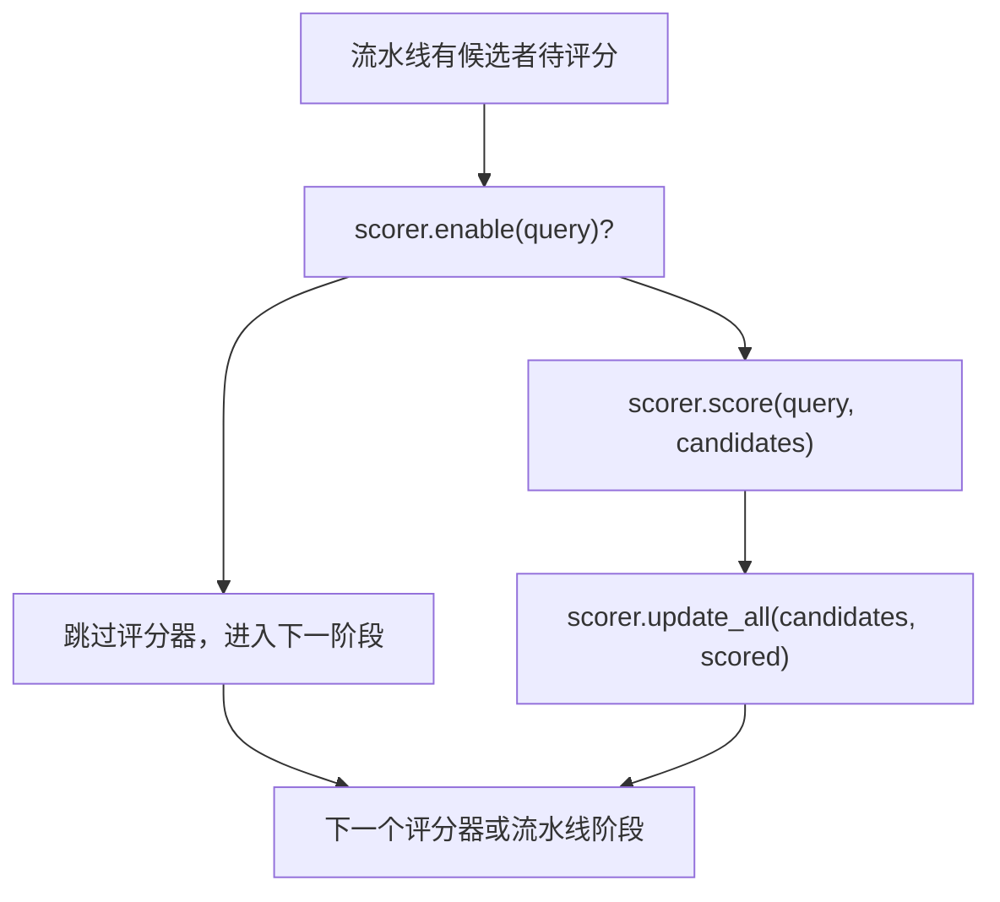
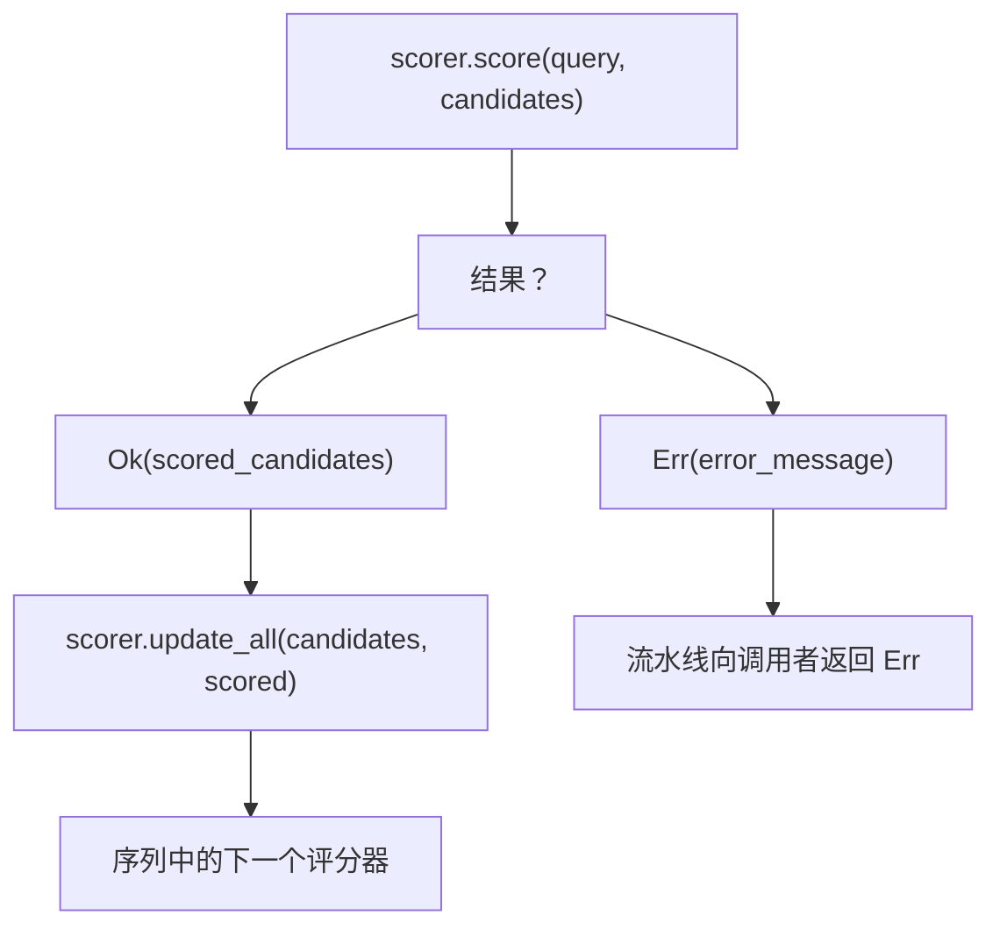

# Scorer Trait (评分器 Trait)

相关源文件

-   [candidate-pipeline/scorer.rs](https://github.com/xai-org/x-algorithm/blob/aaa167b3/candidate-pipeline/scorer.rs)

## 目的与范围

本文档描述了 `Scorer` trait，它是候选管道框架（Candidate Pipeline Framework）的核心组件，用于为候选者分配用于排序的分数。评分器在过滤之后按顺序执行，并使用计算出的分数（例如相关性分数、互动预测）来充实候选者，而不修改候选者的身份或数量。

有关更广泛的流水线执行模型的信息，请参见 [Pipeline Execution Model (流水线执行模型)](/xai-org/x-algorithm/3.1-pipeline-execution-model)。有关之前的过滤阶段，请参见 [Filter Trait (过滤 Trait)](/xai-org/x-algorithm/3.5-filter-trait)。有关后续的选择阶段，请参见 [Selector Trait (选择器 Trait)](/xai-org/x-algorithm/3.7-selector-trait)。有关主混频器 (Home Mixer) 中的具体评分器实现，请参见 [Scorers (评分器)](/xai-org/x-algorithm/4.7-scorers)。

---

## Trait 定义与契约

`Scorer` trait 被定义为一个通用接口，由查询类型 `Q` 和候选者类型 `C` 参数化。它提供了异步对候选者进行评分以及使用计算出的分数更新候选者字段的方法。

### Trait 结构

```rust
pub trait Scorer<Q, C>: Send + Syncwhere    Q: Clone + Send + Sync + 'static,    C: Clone + Send + Sync + 'static,
```
**类型参数：**

-   `Q`：包含评分决策上下文的查询类型
-   `C`：将使用分数字段进行充实的候选者类型

**Trait 限定 (Trait Bounds)：**

-   `Send + Sync`：支持跨线程的并发执行
-   `Clone`：函数式编程模式所需
-   `'static`：确保类型可以在整个程序运行期间存活

**来源：** [candidate-pipeline/scorer.rs7-10](https://github.com/xai-org/x-algorithm/blob/aaa167b3/candidate-pipeline/scorer.rs#L7-L10)

---

## Trait 方法

`Scorer` trait 定义了五个方法，用于实现条件执行、异步评分和字段级更新。

### 方法概览图


**来源：** [candidate-pipeline/scorer.rs5-39](https://github.com/xai-org/x-algorithm/blob/aaa167b3/candidate-pipeline/scorer.rs#L5-L39)

### enable 方法

```rust
fn enable(&self, _query: &Q) -> bool {    true}
```
确定评分器是否应针对给定的查询执行。默认实现返回 `true`，即为所有查询启用该评分器。实现类可以重写此方法，以根据查询参数、功能标志（feature flags）或实验分配来实现条件评分。

**来源：** [candidate-pipeline/scorer.rs13-15](https://github.com/xai-org/x-algorithm/blob/aaa167b3/candidate-pipeline/scorer.rs#L13-L15)

### score 方法

```rust
async fn score(&self, query: &Q, candidates: &[C]) -> Result<Vec<C>, String>;
```
异步执行核心评分逻辑。此方法：

-   接收查询和候选者切片的不可变引用
-   返回一个包含已评分候选者或错误消息的 `Result`
-   必须返回一个包含**与输入相同顺序且相同候选者**的向量

**关键契约：** 返回的向量必须保留候选者的身份和顺序。丢弃、重新排序或添加候选者都会违反评分器契约。若要删除候选者，请改用 Filter trait。

**来源：** [candidate-pipeline/scorer.rs17-22](https://github.com/xai-org/x-algorithm/blob/aaa167b3/candidate-pipeline/scorer.rs#L17-L22)

### update 方法

```rust
fn update(&self, candidate: &mut C, scored: C);
```
使用评分后的字段更新单个候选者。此方法实现了**字段所有权模式 (field ownership pattern)**，其中每个评分器负责特定字段，并且只能将这些字段从已评分的候选者复制到目标候选者。

**字段所有权模式：** 每个评分器拥有特定字段（例如，`PhoenixScorer` 拥有互动概率字段，`WeightedScorer` 拥有最终加权分数）。`update` 方法确保仅修改拥有的字段，从而允许在相同的候选者上组合多个评分器的结果。

**来源：** [candidate-pipeline/scorer.rs24-26](https://github.com/xai-org/x-algorithm/blob/aaa167b3/candidate-pipeline/scorer.rs#L24-L26)

### update\_all 方法

```rust
fn update_all(&self, candidates: &mut [C], scored: Vec<C>) {    for (c, s) in candidates.iter_mut().zip(scored) {        self.update(c, s);    }}
```
通过迭代并为每个“候选者-评分结果”对调用 `update` 来批量更新所有候选者。默认实现提供了一个简单的迭代模式，但实现类可以重写此方法以进行优化的批量操作。

**来源：** [candidate-pipeline/scorer.rs28-34](https://github.com/xai-org/x-algorithm/blob/aaa167b3/candidate-pipeline/scorer.rs#L28-L34)

### name 方法

```rust
fn name(&self) -> &'static str {    util::short_type_name(type_name_of_val(self))}
```
返回评分器的易读名称，用于日志记录、指标和调试。默认实现使用 Rust 的反射能力提取类型名称。

**来源：** [candidate-pipeline/scorer.rs36-38](https://github.com/xai-org/x-algorithm/blob/aaa167b3/candidate-pipeline/scorer.rs#L36-L38)

---

## 顺序执行模型

评分器在流水线内**顺序 (sequentially)** 执行，这与并行执行的 Hydrator 不同。这一设计选择反映了评分操作的依赖结构。

**为什么采用顺序执行？**

1.  **分数组合 (Score Composition)：** 后面的评分器依赖于前面的分数（例如，`WeightedScorer` 读取 `PhoenixScorer` 的预测）
2.  **有序处理：** 多样性调整必须在基础评分之后进行
3.  **确定性结果：** 顺序执行确保了评分结果的可复现性

**来源：** [candidate-pipeline/scorer.rs1-39](https://github.com/xai-org/x-algorithm/blob/aaa167b3/candidate-pipeline/scorer.rs#L1-L39)

---

## 字段所有权与更新模式

评分器架构使用**字段所有权模式 (field ownership pattern)**，其中每个评分器负责特定的候选者字段。这种模式允许在相同的候选者上组合多个独立的评分操作。

### 字段所有权图示


### 更新实现模式

每个评分器实现 `update` 方法以仅复制其拥有的字段：

**示例模式：**

```rust
// PhoenixScorer 仅更新互动概率字段
fn update(&self, candidate: &mut PostCandidate, scored: PostCandidate) {
    candidate.phoenix_scores = scored.phoenix_scores;  // 仅更新拥有的字段
    // 不修改 weighted_score、diversity_penalty 等
}

// WeightedScorer 仅更新加权分数字段
fn update(&self, candidate: &mut PostCandidate, scored: PostCandidate) {
    candidate.weighted_score = scored.weighted_score;  // 仅更新拥有的字段
    // 不修改 phoenix_scores、diversity_penalty 等
}
```
**优势：**

-   **模块化：** 可以独立添加、删除或重新排序评分器
-   **可测试性：** 每个评分器都可以隔离测试
-   **组合性：** 多种评分策略自然结合
-   **类型安全：** Rust 的所有权系统防止了意外的字段冲突

**来源：** [candidate-pipeline/scorer.rs24-34](https://github.com/xai-org/x-algorithm/blob/aaa167b3/candidate-pipeline/scorer.rs#L24-L34)

---

## 评分方法契约

`score` 方法具有严格的契约，实现类必须遵循这些契约以确保流水线行为正确。

### 契约要求

| 要求 | 描述 | 违反影响 |
| --- | --- | --- |
| **数量一致 (Same Count)** | 输出必须具有与输入相同数量的候选者 | 流水线状态损坏 |
| **顺序一致 (Same Order)** | 候选者必须以完全相同的顺序出现 | 破坏下游阶段的假设 |
| **身份一致 (Same Identity)** | 推文 ID 和核心字段不得更改 | 使之前的充实化失效 |
| **不可变输入 (Immutable Input)** | 输入切片是不可变的；创建新的候选者 | 由 Rust 类型系统强制执行 |
| **错误安全 (Error Safety)** | 返回 `Result` 以发出失败信号 | 实现优雅的错误处理 |

### 契约违反示例

```rust
// ❌ 错误：丢弃候选者
async fn score(&self, query: &Q, candidates: &[C]) -> Result<Vec<C>, String> {
    let scored = candidates.iter()
        .filter(|c| some_condition(c))  // 错误：改变了数量
        .map(|c| self.compute_score(c))
        .collect();
    Ok(scored)
}

// ❌ 错误：对候选者重新排序
async fn score(&self, query: &Q, candidates: &[C]) -> Result<Vec<C>, String> {
    let mut scored = candidates.to_vec();
    scored.sort_by_key(|c| c.author_id);  // 错误：改变了顺序
    Ok(scored)
}

// ✅ 正确：保留数量和顺序
async fn score(&self, query: &Q, candidates: &[C]) -> Result<Vec<C>, String> {
    let scored = candidates.iter()
        .map(|c| {
            let mut scored = c.clone();
            scored.score = self.compute_score(c);
            scored
        })
        .collect();
    Ok(scored)
}
```
**来源：** [candidate-pipeline/scorer.rs17-22](https://github.com/xai-org/x-algorithm/blob/aaa167b3/candidate-pipeline/scorer.rs#L17-L22)

---

## 条件执行

`enable` 方法提供了一种机制，可根据查询参数、实验分配或功能标志有条件地执行评分器。

### 条件执行模式


### 常见启用模式

| 模式 | 使用场景 | 示例 |
| --- | --- | --- |
| **功能标志 (Feature Flag)** | 通过配置启用/禁用评分器 | 检查 `query.feature_flags.contains("use_diversity_scoring")` |
| **实验分配 (Experiment Assignment)** | A/B 测试不同的评分策略 | 检查 `query.experiment_id == "diversity_v2"` |
| **内容类型 (Content Type)** | 仅对特定候选者类型进行评分 | 检查 `query.content_type == ContentType::Video` |
| **用户细分 (User Segment)** | 对特定用户群体应用评分 | 检查 `query.user_segment.premium_subscriber` |
| **始终启用 (Always Enabled)** | 默认行为（返回 `true`） | 无需重写 |

**来源：** [candidate-pipeline/scorer.rs13-15](https://github.com/xai-org/x-algorithm/blob/aaa167b3/candidate-pipeline/scorer.rs#L13-L15)

---

## 错误处理

`score` 方法返回 `Result<Vec<C>, String>`，使评分器能够报告失败而不会发生恐慌 (panic)。流水线将错误传播给调用者进行适当处理。

### 错误处理流程


### 常见错误场景

| 场景 | 示例 | 错误消息 |
| --- | --- | --- |
| **外部服务失败** | ML 服务不可用 | "Phoenix 预测服务在 100ms 后超时" |
| **无效输入** | 缺少必需的候选者字段 | "无法在没有 author\_id 的情况下对候选者评分" |
| **计算错误** | 评分计算中除以零 | "无效的互动预测：分母为零" |
| **资源耗尽** | 批量评分的候选者过多 | "批次大小 10000 超过最大限制 5000" |

### 错误消息准则

-   使用描述性消息，标识评分器和失败原因
-   包含相关上下文（例如候选者 ID、查询参数）
-   避免在错误消息中暴露敏感信息
-   使用 `name()` 方法作为错误前缀：`format!("{}: {}", self.name(), error_msg)`

**来源：** [candidate-pipeline/scorer.rs22](https://github.com/xai-org/x-algorithm/blob/aaa167b3/candidate-pipeline/scorer.rs#L22-L22)

---

## 与流水线的集成

评分器作为七个核心阶段之一集成到更广泛的流水线执行流程中。流水线管理评分器的编排、错误传播和状态转换。

### 流水线阶段排序

评分器阶段战略性地定位在流水线执行顺序中：

1.  **QueryHydrators** - 使用用户上下文充实查询
2.  **Sources** - 检索初始候选者
3.  **Hydrators** - 使用元数据充实候选者（并行）
4.  **Filters** - 移除不符合条件的候选者（顺序）
5.  **Scorers** ← 当前阶段（顺序）
6.  **Selector** - 根据分数选择前 K 个
7.  **SideEffects** - 异步日志/指标

**原理：**

-   评分器在**过滤器之后**运行，以避免对将被移除的候选者进行评分
-   评分器在**选择器之前**运行，以为排序提供分数
-   顺序执行支持分数组合和依赖关系

**来源：** [candidate-pipeline/scorer.rs1-39](https://github.com/xai-org/x-algorithm/blob/aaa167b3/candidate-pipeline/scorer.rs#L1-L39)

---

## 核心设计原则

### 1. 顺序优于并行

与 Hydrator 不同，评分器顺序执行，因为：

-   后面的评分器依赖于前面的分数
-   确定性排序确保结果可复现
-   分数组合需要顺序应用

### 2. 字段所有权

每个评分器拥有特定的候选者字段：

-   防止评分器之间的冲突
-   实现模块化测试和开发
-   支持评分器的独立演进

### 3. 不可变输入，函数式更新

`score` 方法接收不可变引用并返回新的候选者：

-   防止意外的副作用
-   符合函数式编程模式
-   支持缓存和记忆化（memoization）优化

### 4. 条件执行

`enable` 方法支持动态评分策略：

-   A/B 测试不同算法
-   功能标志用于渐进式发布
-   针对特定用户细分的评分

### 5. 契约强制执行

严格的契约（相同数量、相同顺序）确保：

-   所有阶段流水线的正确性
-   下游组件的可预测行为
-   评分操作的类型安全组合

**来源：** [candidate-pipeline/scorer.rs1-39](https://github.com/xai-org/x-algorithm/blob/aaa167b3/candidate-pipeline/scorer.rs#L1-L39)

---

## 相关组件

-   **[Pipeline Execution Model (流水线执行模型)](/xai-org/x-algorithm/3.1-pipeline-execution-model)**：整体流水线编排和阶段协调
-   **[Hydrator Trait (充实器 Trait)](/xai-org/x-algorithm/3.4-hydrator-trait)**：并行候选者充实（与顺序评分形成对比）
-   **[Filter Trait (过滤 Trait)](/xai-org/x-algorithm/3.5-filter-trait)**：候选者移除（紧接评分之前）
-   **[Selector Trait (选择器 Trait)](/xai-org/x-algorithm/3.7-selector-trait)**：基于分数的前 K 个选择（紧接评分之后）
-   **[Phoenix Scorer (Phoenix 评分器)](/xai-org/x-algorithm/4.7.1-phoenix-scorer)**：使用 Grok transformer 的具体实现
-   **[Weighted Scorer (加权评分器)](/xai-org/x-algorithm/4.7.2-weighted-scorer)**：用于分数组合的具体实现
-   **[Author Diversity and OON Scorers (作者多样性与 OON 评分器)](/xai-org/x-algorithm/4.7.3-author-diversity-and-oon-scorers)**：用于多样性和发现的具体实现

**来源：** [candidate-pipeline/scorer.rs1-39](https://github.com/xai-org/x-algorithm/blob/aaa167b3/candidate-pipeline/scorer.rs#L1-L39)
