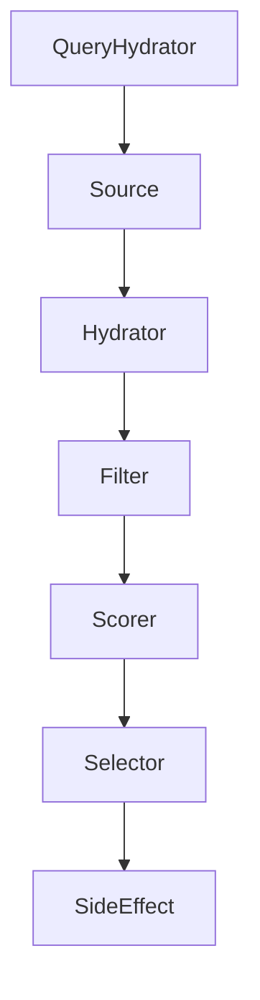
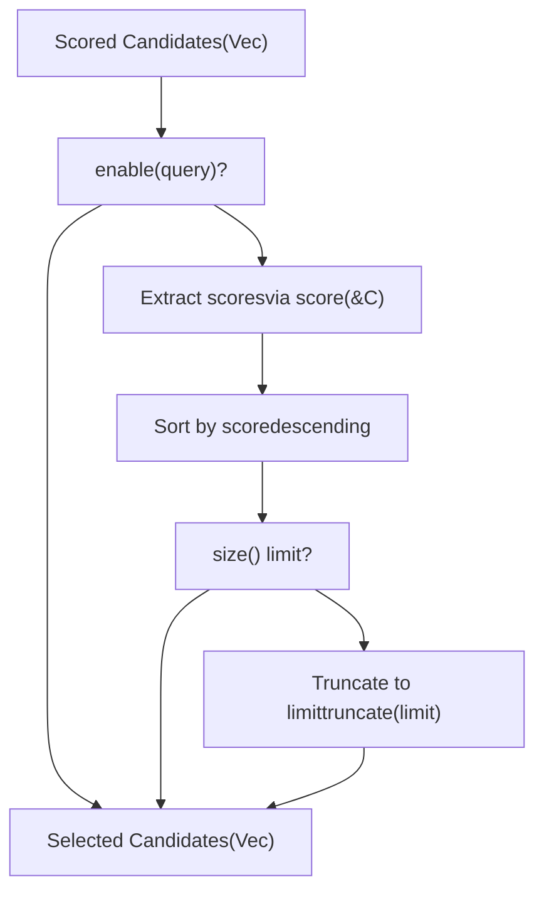
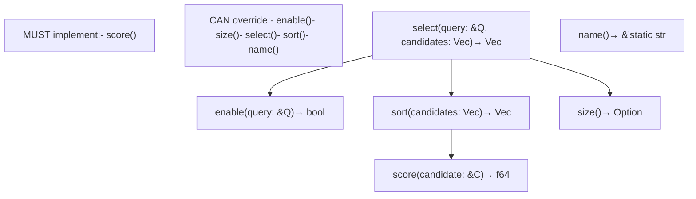
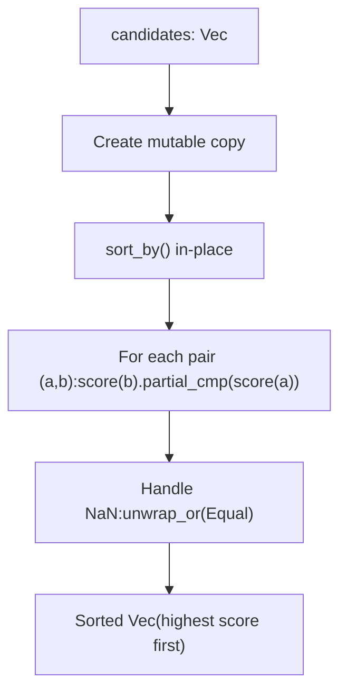
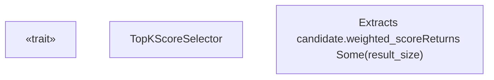
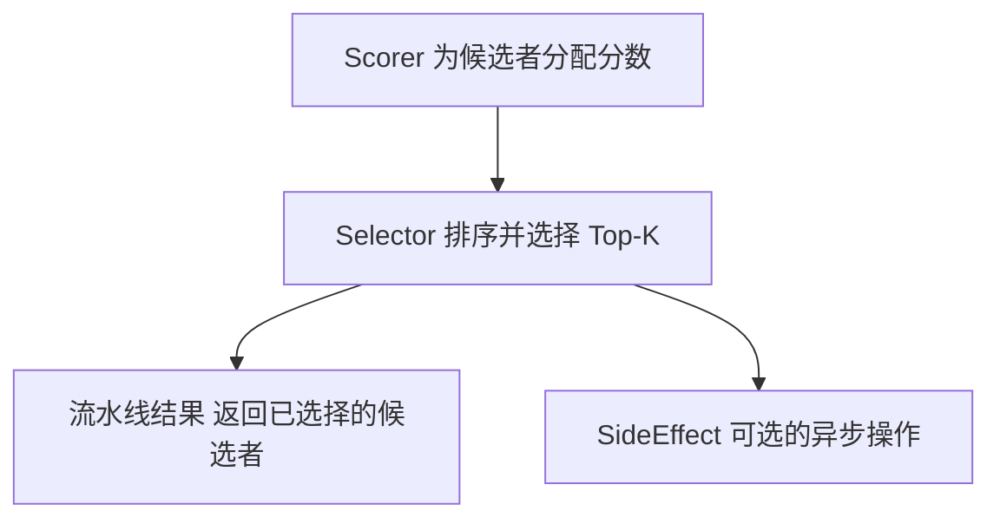

# Selector Trait (选择器特征)

相关源文件

-   [candidate-pipeline/selector.rs](https://github.com/xai-org/x-algorithm/blob/aaa167b3/candidate-pipeline/selector.rs)

## 目的与范围

`Selector` 特征定义了基于评分标准从较大集合中选择候选者子集的接口。该特征提供了候选管道执行模型中的第六阶段（参见 [流水线执行模型](/xai-org/x-algorithm/3.1-pipeline-execution-model)），负责按分值对候选者进行排序，并将其列表截断为可配置的前 K 个大小。

Selector 阶段在 [评分器 (Scorer)](/xai-org/x-algorithm/3.6-scorer-trait) 阶段为候选者分配分值后执行。有关分值计算方式的信息，请参见 [Scorer 特征](/xai-org/x-algorithm/3.6-scorer-trait)。有关主混频器 (Home Mixer) 中使用的具体实现，请参见 [TopKScoreSelector](/xai-org/x-algorithm/4.8-selectors)。

## 在流水线执行中的角色

选择器 (Selector) 作为流水线执行流中的顺序阶段运行，接收所有已评分的候选者，并生成一个有序的、截断的子集。流水线编排器在所有评分阶段完成后调用选择器。

### 选择器阶段位置



**来源：** [candidate-pipeline/selector.rs1-46](https://github.com/xai-org/x-algorithm/blob/aaa167b3/candidate-pipeline/selector.rs#L1-L46)

---

### 选择过程流



**来源：** [candidate-pipeline/selector.rs10-16](https://github.com/xai-org/x-algorithm/blob/aaa167b3/candidate-pipeline/selector.rs#L10-L16)

---

## 特征接口

`Selector` 特征在 [candidate-pipeline/selector.rs4-45](https://github.com/xai-org/x-algorithm/blob/aaa167b3/candidate-pipeline/selector.rs#L4-L45) 中定义为一个以查询类型 `Q` 和候选者类型 `C` 为参数的泛型接口。

### 特征定义

| 方法 | 返回类型 | 目的 | 默认实现 |
| --- | --- | --- | --- |
| `select` | `Vec<C>` | 主要入口点：对候选者进行排序和截断 | 调用 `sort()` 然后调用 `truncate()` |
| `enable` | `bool` | 确定选择器是否应针对给定查询运行 | 始终返回 `true` |
| `score` | `f64` | 从候选者中提取可排序的分值 | **必须实现** |
| `sort` | `Vec<C>` | 按分值降序排列候选者 | 使用 `score()` 比较进行排序 |
| `size` | `Option<usize>` | 要选择的最大候选者数量 | 返回 `None`（无限制） |
| `name` | `&'static str` | 用于日志记录/调试的标识符 | 返回短类型名称 |

**来源：** [candidate-pipeline/selector.rs4-45](https://github.com/xai-org/x-algorithm/blob/aaa167b3/candidate-pipeline/selector.rs#L4-L45)

---

### 方法详情图



**来源：** [candidate-pipeline/selector.rs4-45](https://github.com/xai-org/x-algorithm/blob/aaa167b3/candidate-pipeline/selector.rs#L4-L45)

---

## 选择方法

主要的 `select` 方法 [candidate-pipeline/selector.rs10-16](https://github.com/xai-org/x-algorithm/blob/aaa167b3/candidate-pipeline/selector.rs#L10-L16) 实现了默认的选择逻辑：

1.  **对候选者进行排序**，通过调用 `self.sort(candidates)` 实现
2.  **截断至指定大小**，如果 `self.size()` 返回 `Some(limit)`
3.  **返回结果**，作为 `Vec<C>` 返回

方法签名如下：

```rust
fn select(&self, _query: &Q, candidates: Vec<C>) -> Vec<C>
```

查询参数可供需要查询特定选择逻辑的实现使用，但默认实现并不使用它。

**来源：** [candidate-pipeline/selector.rs10-16](https://github.com/xai-org/x-algorithm/blob/aaa167b3/candidate-pipeline/selector.rs#L10-L16)

---

## 分数提取

`score` 方法 [candidate-pipeline/selector.rs24](https://github.com/xai-org/x-algorithm/blob/aaa167b3/candidate-pipeline/selector.rs#L24-L24) 是实现者**必须**提供的唯一方法。它从候选者中提取用于排序的数值分值：

```rust
fn score(&self, candidate: &C) -> f64;
```

这种抽象允许特征保持通用性，同时允许实现类指定应使用哪个字段或派生值进行排名。在主混频器的实现中，这通常提取由 [评分器 (Scorer) 阶段](/xai-org/x-algorithm/3.6-scorer-trait) 计算的加权互动分值 (Weighted engagement score)。

**来源：** [candidate-pipeline/selector.rs24](https://github.com/xai-org/x-algorithm/blob/aaa167b3/candidate-pipeline/selector.rs#L24-L24)

---

## 排序逻辑

`sort` 方法 [candidate-pipeline/selector.rs27-35](https://github.com/xai-org/x-algorithm/blob/aaa167b3/candidate-pipeline/selector.rs#L27-L35) 实现了使用提取的分数进行的降序排序：

1.  **可变副本**：创建候选者向量的可变副本
2.  **就地排序**：使用 `sort_by` 进行分数比较
3.  **降序排列**：通过比较 `score(b)` 和 `score(a)` 来实现（注意顺序反转）
4.  **NaN 处理**：通过 `partial_cmp` 处理，并回退到 `Equal` 排序



降序排列确保得分最高的候选者首先出现在结果中，这是前 K 个选择的预期行为。

**来源：** [candidate-pipeline/selector.rs27-35](https://github.com/xai-org/x-algorithm/blob/aaa167b3/candidate-pipeline/selector.rs#L27-L35)

---

## 大小配置

`size` 方法 [candidate-pipeline/selector.rs38-40](https://github.com/xai-org/x-algorithm/blob/aaa167b3/candidate-pipeline/selector.rs#L38-L40) 控制结果集的截断：

```rust
fn size(&self) -> Option<usize> {    None}
```

-   **`None`**：无大小限制；返回所有排序后的候选者
-   **`Some(n)`**：排序后将结果截断为前 `n` 个候选者

实现类可以重写此方法以指定其所需的结果大小。[TopKScoreSelector](/xai-org/x-algorithm/4.8-selectors) 实现使用此方法来配置最终 Feed 中返回的帖子数量。

**来源：** [candidate-pipeline/selector.rs38-40](https://github.com/xai-org/x-algorithm/blob/aaa167b3/candidate-pipeline/selector.rs#L38-L40)

---

## 条件执行

`enable` 方法 [candidate-pipeline/selector.rs19-21](https://github.com/xai-org/x-algorithm/blob/aaa167b3/candidate-pipeline/selector.rs#L19-L21) 提供了基于查询的条件执行：

```rust
fn enable(&self, _query: &Q) -> bool {    true}
```

默认实现始终返回 `true`，但实现类可以重写此方法以：

-   根据查询特征跳过选择（例如为不同的客户端类型设置不同的限制）
-   在特定实验条件下禁用选择
-   实现 A/B 测试逻辑

流水线框架在调用 `select` 之前检查此方法，允许选择器在不影响流水线流程的情况下选择不执行。

**来源：** [candidate-pipeline/selector.rs19-21](https://github.com/xai-org/x-algorithm/blob/aaa167b3/candidate-pipeline/selector.rs#L19-L21)

---

## 实现模式

典型的 Selector 实现遵循以下模式：



**来源：** [candidate-pipeline/selector.rs4-45](https://github.com/xai-org/x-algorithm/blob/aaa167b3/candidate-pipeline/selector.rs#L4-L45)

---

## 默认行为总结

该特征为大多数方法提供了合理的默认值，仅要求指定分数提取逻辑：

| 方面 | 默认行为 | 重写原因 |
| --- | --- | --- |
| 选择 (Selection) | 排序 + 可选截断 | 自定义选择逻辑（例如具备多样性意识的选择） |
| 启用 (Enablement) | 始终启用 | 基于查询的条件执行 |
| 排序 (Sorting) | 按分数降序 | 替代排序标准 |
| 大小限制 (Size limit) | 无限制 | 指定结果大小 (Top-K) |
| 命名 (Naming) | 提取类型名称 | 自定义标识符 |

大多数实现只需要重写 `score()` 和 `size()`，这使得该 trait 易于实现，同时在高级用例中保持灵活性。

**来源：** [candidate-pipeline/selector.rs4-45](https://github.com/xai-org/x-algorithm/blob/aaa167b3/candidate-pipeline/selector.rs#L4-L45)

---

## 与流水线阶段的关系

选择器消耗 [评分器 (Scorer) 阶段](/xai-org/x-algorithm/3.6-scorer-trait) 的输出，并生成可选的 [副作用 (SideEffect) 阶段](/xai-org/x-algorithm/3.8-sideeffect-trait) 的输入：



选择器是修改候选者列表的最后一个转换阶段。选择完成后，流水线将结果返回给调用者，尽管 [副作用 (SideEffect) 阶段](/xai-org/x-algorithm/3.8-sideeffect-trait) 可能会出于日志记录或缓存目的观察最终的候选者。

**来源：** [candidate-pipeline/selector.rs1-46](https://github.com/xai-org/x-algorithm/blob/aaa167b3/candidate-pipeline/selector.rs#L1-L46)
