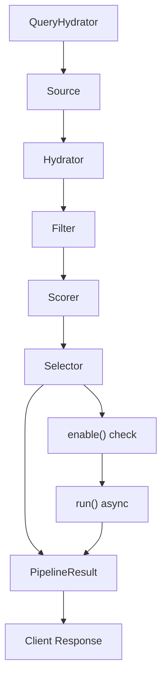
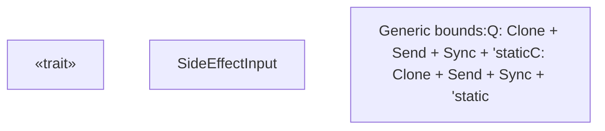
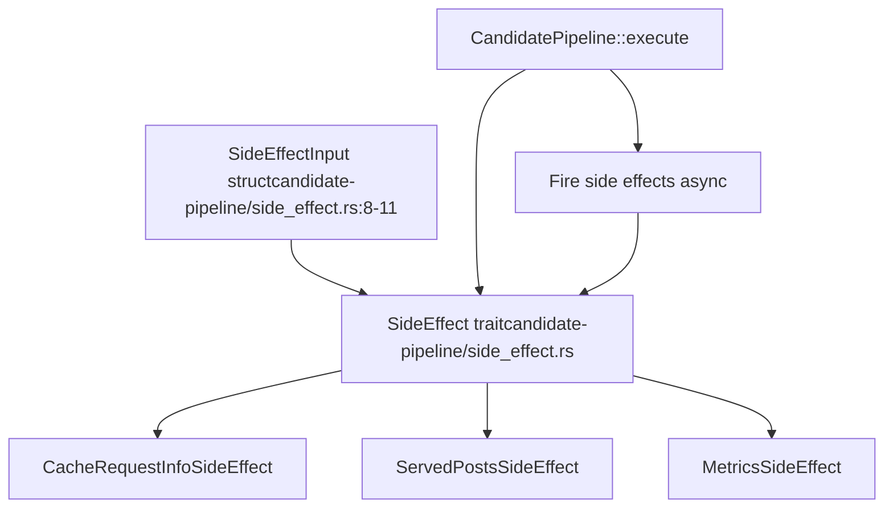

# 副作用 (SideEffect) Trait

相关源文件

-   [candidate-pipeline/side\_effect.rs](https://github.com/xai-org/x-algorithm/blob/aaa167b3/candidate-pipeline/side_effect.rs)

## 目的与范围

`SideEffect` Trait 定义了异步、非阻塞操作的接口，这些操作在管道执行期间运行，且不会影响返回给客户端的最终结果。副作用用于辅助任务，如缓存、日志记录、指标收集和审计追踪，这些任务不应延迟或改变管道的输出。

本文档涵盖了 `SideEffect` Trait 的定义、执行特性以及与候选管道框架的集成。有关整体管道执行模型的信息，请参阅[管道执行模型 (Pipeline Execution Model)](/xai-org/x-algorithm/3.1-pipeline-execution-model)。有关主混频器 (Home Mixer) 中的具体副作用实现，请参阅[主混频器实现 (Home Mixer Implementation)](/xai-org/x-algorithm/4-home-mixer-implementation)。

## 概览

副作用代表了候选管道框架七阶段架构中的最终阶段。与其他管道阶段（来源、充实器、过滤器、评分器、选择器）不同，副作用：

-   在主流水线结果准备就绪后异步执行
-   不能修改查询、候选对象或管道结果
-   接收对查询和选定候选对象的只读访问权限
-   可以失败而不影响对客户端的响应
-   通过启用门 (Enable gate) 支持条件执行

**图表：管道流程中的副作用执行**

**来源：** [candidate-pipeline/side\_effect.rs1-30](https://github.com/xai-org/x-algorithm/blob/aaa167b3/candidate-pipeline/side_effect.rs#L1-L30)

## Trait 定义

`SideEffect` Trait 定义了两个泛型类型参数，分别代表查询类型 (`Q`) 和候选对象类型 (`C`)。它要求实现必须满足 `Send + Sync`，以便安全地进行并发执行。

**图表：SideEffect Trait 结构**

**来源：** [candidate-pipeline/side\_effect.rs6-29](https://github.com/xai-org/x-algorithm/blob/aaa167b3/candidate-pipeline/side_effect.rs#L6-L29)

### 方法规范

| 方法 | 签名 | 目的 | 默认实现 |
| --- | --- | --- | --- |
| `enable` | `fn enable(&self, query: Arc<Q>) -> bool` | 条件执行门 | 返回 `true` |
| `run` | `async fn run(&self, input: Arc<SideEffectInput<Q, C>>) -> Result<(), String>` | 执行副作用 | 必须实现 |
| `name` | `fn name(&self) -> &'static str` | 标识副作用 | 返回短类型名称 |

**来源：** [candidate-pipeline/side\_effect.rs19-28](https://github.com/xai-org/x-algorithm/blob/aaa167b3/candidate-pipeline/side_effect.rs#L19-L28)

## SideEffectInput 结构

`SideEffectInput` 结构体在副作用执行时提供对管道最终状态的只读访问。它包含原始查询和由选择器阶段选出的候选对象。

### 字段定义

| 字段 | 类型 | 描述 |
| --- | --- | --- |
| `query` | `Arc<Q>` | 查询对象的共享引用，可能已被查询充实器充实 |
| `selected_candidates` | `Vec<C>` | 由选择器阶段选出的候选对象，通常是前 K 个结果 |

为查询使用 `Arc<Q>` 可以实现跨多个副作用的高效共享而无需克隆，而 `Vec<C>` 则提供了将返回给客户端的选定候选对象。

**来源：** [candidate-pipeline/side\_effect.rs8-11](https://github.com/xai-org/x-algorithm/blob/aaa167b3/candidate-pipeline/side_effect.rs#L8-L11)

## 执行特性

### 异步执行

副作用在选择器阶段完成后异步执行。管道在向客户端返回结果之前不会等待副作用完成。

> **[Mermaid sequence]**
> *(图表结构无法解析)*

**图表：异步副作用执行序列**

**来源：** [candidate-pipeline/side\_effect.rs6-7](https://github.com/xai-org/x-algorithm/blob/aaa167b3/candidate-pipeline/side_effect.rs#L6-L7)

### 条件执行

`enable` 方法允许实现根据查询属性有条件地执行。这实现了特性标志 (Feature flags)、A/B 测试或基于资源的限流 (Resource-based throttling)。

**Enable 方法模式：**

-   接收 `Arc<Q>` 查询引用
-   返回一个布尔值，指示是否执行
-   默认实现始终返回 `true`
-   在 `run` 方法之前被调用

**来源：** [candidate-pipeline/side\_effect.rs19-22](https://github.com/xai-org/x-algorithm/blob/aaa167b3/candidate-pipeline/side_effect.rs#L19-L22)

### 错误处理

`run` 方法返回 `Result<(), String>`，允许副作用在不影响客户端响应的情况下报告错误。错误通常会被记录用于监控，但不会传播给管道调用者。

**错误契约：**

-   错误不会阻塞或修改管道结果
-   错误字符串用于日志记录和调试
-   无论副作用成功还是失败，管道都会继续执行

**来源：** [candidate-pipeline/side\_effect.rs24](https://github.com/xai-org/x-algorithm/blob/aaa167b3/candidate-pipeline/side_effect.rs#L24-L24)

## 常见用例

候选管道框架中的副作用通常用于：

| 用例 | 描述 | 示例 |
| --- | --- | --- |
| **缓存** | 存储管道状态以用于调试或回放 | 将请求信息缓存到 Strato |
| **指标** | 记录性能和结果统计信息 | 记录候选对象计数、分数、延迟 |
| **审计日志** | 追踪向用户投送的内容 | 记录已投送的帖子 ID 以用于去重 |
| **分析** | 收集数据用于离线分析 | 导出评分特征用于模型训练 |
| **调试** | 捕获详细的执行追踪 | 记录中间管道状态 |

**来源：** [candidate-pipeline/side\_effect.rs6](https://github.com/xai-org/x-algorithm/blob/aaa167b3/candidate-pipeline/side_effect.rs#L6-L6)

## 与管道框架集成

### Trait 要求

实现必须满足以下约束：

-   `Q: Clone + Send + Sync + 'static` - 查询类型必须是可克隆且线程安全的
-   `C: Clone + Send + Sync + 'static` - 候选对象类型必须是可克隆且线程安全的
-   `SideEffect<Q, C>: Send + Sync` - Trait 实现本身必须是线程安全的

这些约束实现了副作用在异步任务中的安全并发执行。

**来源：** [candidate-pipeline/side\_effect.rs14-17](https://github.com/xai-org/x-algorithm/blob/aaa167b3/candidate-pipeline/side_effect.rs#L14-L17)

### 命名约定

`name` 方法为副作用提供了一个人类可读的标识符，由类型名称派生。这用于：

-   记录和追踪管道执行
-   按副作用类型进行指标标记 (Metrics tagging)
-   调试和性能分析 (Profiling)

默认实现使用 `util::short_type_name` 来提取不包含完整模块路径的简短类型名称。

**来源：** [candidate-pipeline/side\_effect.rs26-28](https://github.com/xai-org/x-algorithm/blob/aaa167b3/candidate-pipeline/side_effect.rs#L26-L28)

## 实现示例参考

主混频器 (Home Mixer) 为 Phoenix 候选管道实现了具体的副作用。虽然确切的实现记录在别处，但典型示例包括：

-   **CacheRequestInfoSideEffect**：将请求元数据存储到 Strato 缓存中，用于调试和回放。
-   **ServedPostsSideEffect**：记录已投送的帖子，以防止重复曝光。
-   **MetricsSideEffect**：导出管道指标和候选对象统计信息。

有关这些实现的详细文档，请参阅[主混频器实现 (Home Mixer Implementation)](/xai-org/x-algorithm/4-home-mixer-implementation)。

**来源：** [candidate-pipeline/side\_effect.rs1-30](https://github.com/xai-org/x-algorithm/blob/aaa167b3/candidate-pipeline/side_effect.rs#L1-L30)

## 代码结构

**图表：副作用代码组织与关系**

**来源：** [candidate-pipeline/side\_effect.rs1-30](https://github.com/xai-org/x-algorithm/blob/aaa167b3/candidate-pipeline/side_effect.rs#L1-L30)
