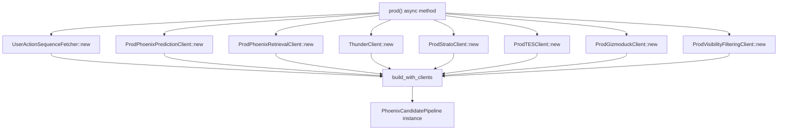
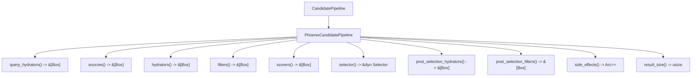

# Home Mixer 实现

相关源文件

-   [home-mixer/candidate\_pipeline/mod.rs](https://github.com/xai-org/x-algorithm/blob/aaa167b3/home-mixer/candidate_pipeline/mod.rs)
-   [home-mixer/candidate\_pipeline/phoenix\_candidate\_pipeline.rs](https://github.com/xai-org/x-algorithm/blob/aaa167b3/home-mixer/candidate_pipeline/phoenix_candidate_pipeline.rs)

## 目的与范围

本节记录了 Home Mixer 对“为你推荐 (For You)”Feed 推荐系统的候选者流水线框架 (Candidate Pipeline Framework) 的具体实现。Home Mixer 通过实例化通用流水线特征 (Traits) 的具体实现，来编排候选者的检索、丰富、过滤、打分和选择（参见 [候选者流水线框架](/xai-org/x-algorithm/3-candidate-pipeline-framework)）。

该实现以 `PhoenixCandidatePipeline` 结构体为中心，它使用外部服务的生产客户端配置并组合了所有流水线阶段。本页面提供了该实现的架构概览。有关特定组件的详细文档，请参见：

-   [Phoenix 候选者流水线](/xai-org/x-algorithm/4.1-phoenix-candidate-pipeline) - 流水线结构体和初始化
-   [数据模型](/xai-org/x-algorithm/4.2-data-models) - 查询和候选者数据结构
-   [候选者来源](/xai-org/x-algorithm/4.3-candidate-sources) - Thunder 和 Phoenix 检索
-   [查询水合器](/xai-org/x-algorithm/4.4-query-hydrators) - 查询丰富实现
-   [候选者水合器](/xai-org/x-algorithm/4.5-candidate-hydrators) - 候选者丰富实现
-   [过滤器](/xai-org/x-algorithm/4.6-filters) - 打分前和选择后过滤器
-   [打分器](/xai-org/x-algorithm/4.7-scorers) - Phoenix ML 打分和加权打分
-   [选择器](/xai-org/x-algorithm/4.8-selectors) - 前 K 个选择实现

## PhoenixCandidatePipeline 结构

```mermaid
flowchart TD
    QH["query_hydratorsVec<Box<dyn QueryHydrator<ScoredPostsQuery>>>"]
    SRC["sourcesVec<Box<dyn Source<ScoredPostsQuery, PostCandidate>>>"]
    HYD["hydratorsVec<Box<dyn Hydrator<ScoredPostsQuery, PostCandidate>>>"]
    FLT["filtersVec<Box<dyn Filter<ScoredPostsQuery, PostCandidate>>>"]
    SCR["scorersVec<Box<dyn Scorer<ScoredPostsQuery, PostCandidate>>>"]
    SEL["selectorTopKScoreSelector"]
    PSH["post_selection_hydratorsVec<Box<dyn Hydrator<ScoredPostsQuery, PostCandidate>>>"]
    PSF["post_selection_filtersVec<Box<dyn Filter<ScoredPostsQuery, PostCandidate>>>"]
    SE["side_effectsArc<Vec<Box<dyn SideEffect<ScoredPostsQuery, PostCandidate>>>>"]
    Execute["CandidatePipeline::execute"]

    QH --> Execute
    SRC --> Execute
    HYD --> Execute
    FLT --> Execute
    SCR --> Execute
    SEL --> Execute
    PSH --> Execute
    PSF --> Execute
    SE --> Execute
```

`PhoenixCandidatePipeline` 结构体是实现了 `CandidatePipeline<ScoredPostsQuery, PostCandidate>` 特征的核心编排器。它持有对所有流水线阶段实现的引用，并管理它们的执行顺序。

**流水线结构体字段**

位于 [home-mixer/candidate\_pipeline/phoenix\_candidate\_pipeline.rs60-70](https://github.com/xai-org/x-algorithm/blob/aaa167b3/home-mixer/candidate_pipeline/phoenix_candidate_pipeline.rs#L60-L70) 的结构体包含代表流水线阶段的九个字段：

| 字段 | 类型 | 目的 |
| --- | --- | --- |
| `query_hydrators` | `Vec<Box<dyn QueryHydrator<ScoredPostsQuery>>>` | 在候选者检索前使用用户上下文丰富查询 |
| `sources` | `Vec<Box<dyn Source<ScoredPostsQuery, PostCandidate>>>` | 从 Thunder 和 Phoenix 检索候选者集 |
| `hydrators` | `Vec<Box<dyn Hydrator<ScoredPostsQuery, PostCandidate>>>` | 在过滤/打分前使用元数据丰富候选者 |
| `filters` | `Vec<Box<dyn Filter<ScoredPostsQuery, PostCandidate>>>` | 在打分前移除不符合条件的候选者 |
| `scorers` | `Vec<Box<dyn Scorer<ScoredPostsQuery, PostCandidate>>>` | 使用 Phoenix ML 和加权打分分配相关性分值 |
| `selector` | `TopKScoreSelector` | 按分值选择前 K 个候选者 |
| `post_selection_hydrators` | `Vec<Box<dyn Hydrator<ScoredPostsQuery, PostCandidate>>>` | 使用额外数据丰富选定的候选者 |
| `post_selection_filters` | `Vec<Box<dyn Filter<ScoredPostsQuery, PostCandidate>>>` | 在选择后应用最终验证 |
| `side_effects` | `Arc<Vec<Box<dyn SideEffect<ScoredPostsQuery, PostCandidate>>>>` | 执行异步操作（缓存、日志记录） |

**来源：** [home-mixer/candidate\_pipeline/phoenix\_candidate\_pipeline.rs60-70](https://github.com/xai-org/x-algorithm/blob/aaa167b3/home-mixer/candidate_pipeline/phoenix_candidate_pipeline.rs#L60-L70)

## 组件初始化架构

流水线通过 `build_with_clients` 方法构建，该方法接收所有外部服务的客户端接口，并实例化每个流水线阶段的具体实现。

```mermaid
flowchart TD
    UAF["UserActionSequenceFetcher"]
    PPC["PhoenixPredictionClient"]
    PRC["PhoenixRetrievalClient"]
    TC["ThunderClient"]
    SC["StratoClient"]
    TESC["TESClient"]
    GC["GizmoduckClient"]
    VFC["VisibilityFilteringClient"]
    Build["PhoenixCandidatePipeline::build_with_clients"]
    UASQH["UserActionSeqQueryHydrator"]
    UFQH["UserFeaturesQueryHydrator"]
    PS["PhoenixSource"]
    TS["ThunderSource"]
    INCH["InNetworkCandidateHydrator"]
    CDCH["CoreDataCandidateHydrator"]
    VDCH["VideoDurationCandidateHydrator"]
    SH["SubscriptionHydrator"]
    GZH["GizmoduckCandidateHydrator"]
    DDF["DropDuplicatesFilter"]
    CDHF["CoreDataHydrationFilter"]
    AF["AgeFilter"]
    STF["SelfTweetFilter"]
    RDF["RetweetDeduplicationFilter"]
    ISF["IneligibleSubscriptionFilter"]
    PSPF["PreviouslySeenPostsFilter"]
    PSRF["PreviouslyServedPostsFilter"]
    MKF["MutedKeywordFilter"]
    ASF["AuthorSocialgraphFilter"]
    PhS["PhoenixScorer"]
    WS["WeightedScorer"]
    ADS["AuthorDiversityScorer"]
    OS["OONScorer"]
    VFCH["VFCandidateHydrator"]
    VFF["VFFilter"]
    DCF["DedupConversationFilter"]
    CRISE["CacheRequestInfoSideEffect"]

    UAF --> Build
    PPC --> Build
    PRC --> Build
    TC --> Build
    SC --> Build
    TESC --> Build
    GC --> Build
    VFC --> Build
    Build --> UASQH
    Build --> UFQH
    Build --> PS
    Build --> TS
    Build --> INCH
    Build --> CDCH
    Build --> VDCH
    Build --> SH
    Build --> GZH
    Build --> DDF
    Build --> CDHF
    Build --> AF
    Build --> STF
    Build --> RDF
    Build --> ISF
    Build --> PSPF
    Build --> PSRF
    Build --> MKF
    Build --> ASF
    Build --> PhS
    Build --> WS
    Build --> ADS
    Build --> OS
    Build --> VFCH
    Build --> VFF
    Build --> DCF
    Build --> CRISE
```

**组件构建**

位于 [home-mixer/candidate\_pipeline/phoenix\_candidate\_pipeline.rs73-160](https://github.com/xai-org/x-algorithm/blob/aaa167b3/home-mixer/candidate_pipeline/phoenix_candidate_pipeline.rs#L73-L160) 的 `build_with_clients` 方法通过以下方式执行依赖注入：

1.  **创建查询水合器 (Query Hydrators)** ([第 84-89 行](https://github.com/xai-org/x-algorithm/blob/aaa167b3/lines 84-89)) - 使用客户端依赖项实例化 `UserActionSeqQueryHydrator` 和 `UserFeaturesQueryHydrator`
2.  **创建来源 (Sources)** ([第 92-97 行](https://github.com/xai-org/x-algorithm/blob/aaa167b3/lines 92-97)) - 实例化用于候选者检索的 `PhoenixSource` 和 `ThunderSource`
3.  **创建水合器 (Hydrators)** ([第 100-106 行](https://github.com/xai-org/x-algorithm/blob/aaa167b3/lines 100-106)) - 实例化五个用于使用元数据丰富候选者的水合器
4.  **创建过滤器 (Filters)** ([第 109-120 行](https://github.com/xai-org/x-algorithm/blob/aaa167b3/lines 109-120)) - 实例化十个用于打分前候选者移除的过滤器
5.  **创建打分器 (Scorers)** ([第 123-132 行](https://github.com/xai-org/x-algorithm/blob/aaa167b3/lines 123-132)) - 实例化四个用于 ML 预测和分值组合的打分器
6.  **创建选择器 (Selector)** ([第 135 行](https://github.com/xai-org/x-algorithm/blob/aaa167b3/line 135)) - 实例化用于前 K 个选择的 `TopKScoreSelector`
7.  **创建选择后组件 (Post-Selection Components)** ([第 138-143 行](https://github.com/xai-org/x-algorithm/blob/aaa167b3/lines 138-143)) - 实例化用于最终处理的水合器和过滤器
8.  **创建副作用 (Side Effects)** ([第 146-147 行](https://github.com/xai-org/x-algorithm/blob/aaa167b3/lines 146-147)) - 实例化用于异步缓存的 `CacheRequestInfoSideEffect`

**来源：** [home-mixer/candidate\_pipeline/phoenix\_candidate\_pipeline.rs73-160](https://github.com/xai-org/x-algorithm/blob/aaa167b3/home-mixer/candidate_pipeline/phoenix_candidate_pipeline.rs#L73-L160)

## 生产客户端初始化

`prod` 方法通过使用生产实现实例化所有客户端接口，创建一个生产就绪的流水线。

**客户端构建详情**

位于 [home-mixer/candidate\_pipeline/phoenix\_candidate\_pipeline.rs162-212](https://github.com/xai-org/x-algorithm/blob/aaa167b3/home-mixer/candidate_pipeline/phoenix_candidate_pipeline.rs#L162-L212) 的 `prod` 方法初始化了：

| 客户端 | 生产实现 | 目的 |
| --- | --- | --- |
| `uas_fetcher` | `UserActionSequenceFetcher` | 获取用于查询水合的用户互动历史 |
| `phoenix_client` | `ProdPhoenixPredictionClient` | 调用 Phoenix Grok transformer 进行打分 |
| `phoenix_retrieval_client` | `ProdPhoenixRetrievalClient` | 调用 Phoenix 双塔模型 (Two-tower model) 进行检索 |
| `thunder_client` | `ThunderClient` | 查询 Thunder 内存存储以获取网络内推文 |
| `strato_client` | `ProdStratoClient` | 访问 Strato 缓存服务 |
| `tes_client` | `ProdTESClient` | 查询推文实体服务 (Tweet Entity Service) 以获取推文元数据 |
| `gizmoduck_client` | `ProdGizmoduckClient` | 查询 Gizmoduck 为用户资料数据 |
| `vf_client` | `ProdVisibilityFilteringClient` | 调用可见性过滤以确保内容安全 |

所有客户端都包装在 `Arc` 中，以便在流水线组件间共享所有权。该方法使用 `.await` 和 `.expect()` 处理启动时的初始化错误。

**来源：** [home-mixer/candidate\_pipeline/phoenix\_candidate\_pipeline.rs162-212](https://github.com/xai-org/x-algorithm/blob/aaa167b3/home-mixer/candidate_pipeline/phoenix_candidate_pipeline.rs#L162-L212)

## CandidatePipeline 特征实现

`PhoenixCandidatePipeline` 实现了 `CandidatePipeline<ScoredPostsQuery, PostCandidate>` 特征，为每个流水线阶段提供了访问方法。

**特征方法实现**

位于 [home-mixer/candidate\_pipeline/phoenix\_candidate\_pipeline.rs215-255](https://github.com/xai-org/x-algorithm/blob/aaa167b3/home-mixer/candidate_pipeline/phoenix_candidate_pipeline.rs#L215-L255) 的特征实现提供了十个方法：

| 方法 | 返回类型 | 实现 |
| --- | --- | --- |
| `query_hydrators()` | `&[Box<dyn QueryHydrator<ScoredPostsQuery>>]` | 返回查询水合器切片 |
| `sources()` | `&[Box<dyn Source<ScoredPostsQuery, PostCandidate>>]` | 返回候选者来源切片 |
| `hydrators()` | `&[Box<dyn Hydrator<ScoredPostsQuery, PostCandidate>>]` | 返回候选者水合器切片 |
| `filters()` | `&[Box<dyn Filter<ScoredPostsQuery, PostCandidate>>]` | 返回打分前过滤器切片 |
| `scorers()` | `&[Box<dyn Scorer<ScoredPostsQuery, PostCandidate>>]` | 返回打分器切片 |
| `selector()` | `&dyn Selector<ScoredPostsQuery, PostCandidate>` | 返回选择器引用 |
| `post_selection_hydrators()` | `&[Box<dyn Hydrator<ScoredPostsQuery, PostCandidate>>]` | 返回选择后水合器切片 |
| `post_selection_filters()` | `&[Box<dyn Filter<ScoredPostsQuery, PostCandidate>>]` | 返回选择后过滤器切片 |
| `side_effects()` | `Arc<Vec<Box<dyn SideEffect<ScoredPostsQuery, PostCandidate>>>>` | 返回 Arc 包装的副作用 |
| `result_size()` | `usize` | 返回 `params::RESULT_SIZE` 常量 |

[第 215 行](https://github.com/xai-org/x-algorithm/blob/aaa167b3/line 215) 的 `#[async_trait]` 宏启用了特征中的异步方法。框架的 `CandidatePipeline::execute` 方法使用这些访问器来编排流水线执行。

**来源：** [home-mixer/candidate\_pipeline/phoenix\_candidate\_pipeline.rs215-255](https://github.com/xai-org/x-algorithm/blob/aaa167b3/home-mixer/candidate_pipeline/phoenix_candidate_pipeline.rs#L215-L255)

## 流水线执行流

当框架使用 `ScoredPostsQuery` 调用 `CandidatePipeline::execute` 方法时，框架会通过实例化的组件编排以下执行序列：

> **[Mermaid sequence]**
> *(图表结构无法解析)*

**执行特性**

执行模型利用了框架的特征系统：

1.  **并行执行** - 查询水合器、来源和候选者水合器使用 `futures::join_all` 并行执行，以最小化延迟
2.  **顺序执行** - 过滤器和打分器顺序执行，因为每个阶段都依赖于前一阶段的输出
3.  **数据转换** - 每个阶段都读取并写入共享的 `ScoredPostsQuery` 和 `PostCandidate` 结构
4.  **错误处理** - 框架根据特征实现处理错误，允许各阶段跳过候选者或返回部分结果
5.  **副作用隔离** - 副作用异步执行，不会阻塞对客户端的响应

各阶段的具体实现记录在子章节 [4.1](/xai-org/x-algorithm/4.1-phoenix-candidate-pipeline) 到 [4.8](/xai-org/x-algorithm/4.8-selectors) 中。

**来源：** [home-mixer/candidate\_pipeline/phoenix\_candidate\_pipeline.rs1-256](https://github.com/xai-org/x-algorithm/blob/aaa167b3/home-mixer/candidate_pipeline/phoenix_candidate_pipeline.rs#L1-L256)

## 模块结构

Home Mixer 实现组织在 `home-mixer/candidate_pipeline/` 目录下的模块中：

| 模块 | 文件 | 目的 |
| --- | --- | --- |
| `candidate` | `candidate.rs` | 定义 `PostCandidate` 结构体 |
| `candidate_features` | `candidate_features.rs` | 定义候选者特征字段 |
| `phoenix_candidate_pipeline` | `phoenix_candidate_pipeline.rs` | 定义 `PhoenixCandidatePipeline` 结构体及实现 |
| `query` | `query.rs` | 定义 `ScoredPostsQuery` 结构体 |
| `query_features` | `query_features.rs` | 定义查询特征字段 |

模块声明位于 [home-mixer/candidate\_pipeline/mod.rs1-6](https://github.com/xai-org/x-algorithm/blob/aaa167b3/home-mixer/candidate_pipeline/mod.rs#L1-L6)

有关数据模型的详细文档，请参见 [数据模型](/xai-org/x-algorithm/4.2-data-models)。

**来源：** [home-mixer/candidate\_pipeline/mod.rs1-6](https://github.com/xai-org/x-algorithm/blob/aaa167b3/home-mixer/candidate_pipeline/mod.rs#L1-L6)
