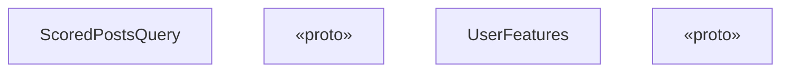
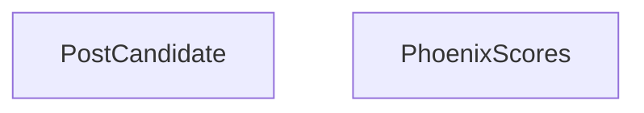
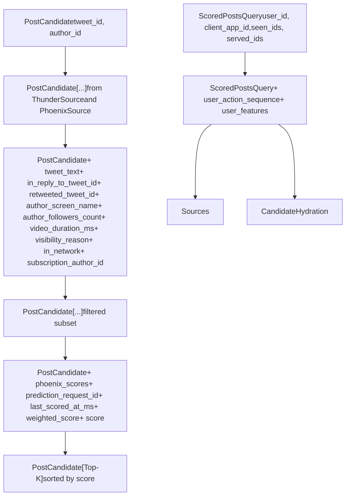
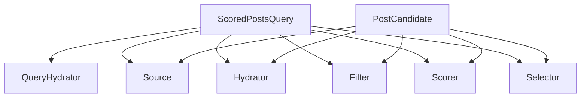

# 数据模型

相关源文件

-   [home-mixer/candidate\_pipeline/candidate.rs](https://github.com/xai-org/x-algorithm/blob/aaa167b3/home-mixer/candidate_pipeline/candidate.rs)
-   [home-mixer/candidate\_pipeline/query.rs](https://github.com/xai-org/x-algorithm/blob/aaa167b3/home-mixer/candidate_pipeline/query.rs)

## 目的与范围

本页面记录了主混频器管道中使用的核心数据结构：`ScoredPostsQuery` 和 `PostCandidate`。这些类型定义了流经管道各阶段的输入查询和候选者对象。

有关每个模型在特定管道阶段中使用的详细文档，请参见 [ScoredPostsQuery](/xai-org/x-algorithm/4.2.1-scoredpostsquery) 和 [PostCandidate](/xai-org/x-algorithm/4.2.2-postcandidate)。有关这些模型在管道执行期间如何转换的信息，请参见 [数据流与执行模型](/xai-org/x-algorithm/2.2-data-flow-and-execution-model)。

## 概览

主混频器管道对 Rust 中定义的两个主要数据结构进行操作：

| 数据结构 | 目的 | 定义于 | 参数化 |
| --- | --- | --- | --- |
| `ScoredPostsQuery` | 代表包含用户上下文、偏好和过滤器的输入请求 | [home-mixer/candidate\_pipeline/query.rs8-21](https://github.com/xai-org/x-algorithm/blob/aaa167b3/home-mixer/candidate_pipeline/query.rs#L8-L21) | 管道 Trait 中的泛型 `Q` 类型参数 |
| `PostCandidate` | 代表具有相关元数据、分值和丰富特征的候选者帖子 | [home-mixer/candidate\_pipeline/candidate.rs6-27](https://github.com/xai-org/x-algorithm/blob/aaa167b3/home-mixer/candidate_pipeline/candidate.rs#L6-L27) | 管道 Trait 中的泛型 `C` 类型参数 |

这些结构在流经管道时会逐步得到丰富。`ScoredPostsQuery` 在查询充实器阶段使用用户行为数据进行充实，而 `PostCandidate` 实例则通过充实器、评分器和其他管道阶段累积元数据、分值和其他特征。

**来源：** [home-mixer/candidate\_pipeline/query.rs1-70](https://github.com/xai-org/x-algorithm/blob/aaa167b3/home-mixer/candidate_pipeline/query.rs#L1-L70) [home-mixer/candidate\_pipeline/candidate.rs1-71](https://github.com/xai-org/x-algorithm/blob/aaa167b3/home-mixer/candidate_pipeline/candidate.rs#L1-L71)

## ScoredPostsQuery 结构



**图：ScoredPostsQuery 类结构**

`ScoredPostsQuery` 结构体包含三类字段：

### 请求上下文字段

-   `user_id`：查看者的用户 ID (i64)
-   `client_app_id`：用于客户端上下文的应用程序标识符 (i32)
-   `country_code`：用户所在的国家（用于本地化） (String)
-   `language_code`：用户的首选语言 (String)
-   `request_id`：请求的唯一标识符，使用 `generate_request_id()` 生成并附加 user\_id

### 过滤与去重字段

-   `seen_ids`：用户之前看过的帖子 ID (Vec)
-   `served_ids`：此会话中之前已投放的帖子 ID (Vec)
-   `bloom_filter_entries`：用于高效曝光 (Impression) 追踪的概率过滤器 (Vec)
-   `in_network_only`：仅限网络内内容的标志 (bool)
-   `is_bottom_request`：指示请求更多内容的分页请求标志 (bool)

### 已充实字段（初始为 None）

-   `user_action_sequence`：用户最近的互动历史，由 UserActionSeqQueryHydrator 填充 (Option)
-   `user_features`：由 UserFeaturesQueryHydrator 填充的额外用户特征数据 (UserFeatures)

该结构体实现了两个 Trait：

-   `GetTwitterContextViewer` [home-mixer/candidate\_pipeline/query.rs53-63](https://github.com/xai-org/x-algorithm/blob/aaa167b3/home-mixer/candidate_pipeline/query.rs#L53-L63) - 为外部服务调用提供查看者上下文
-   `HasRequestId` [home-mixer/candidate\_pipeline/query.rs65-69](https://github.com/xai-org/x-algorithm/blob/aaa167b3/home-mixer/candidate_pipeline/query.rs#L65-L69) - 实现跨管道的请求追踪

**来源：** [home-mixer/candidate\_pipeline/query.rs7-70](https://github.com/xai-org/x-algorithm/blob/aaa167b3/home-mixer/candidate_pipeline/query.rs#L7-L70)

## PostCandidate 结构



**图：PostCandidate 和 PhoenixScores 类结构**

`PostCandidate` 结构体包含在管道不同阶段填充的字段：

### 核心字段（来自数据源）

由 ThunderSource 或 PhoenixSource 填充：

-   `tweet_id`：帖子的唯一标识符 (i64)
-   `author_id`：帖子作者的用户 ID (u64)

### 核心数据字段（来自 CoreDataCandidateHydrator）

由 TES (推文实体服务 (Tweet Entity Service)) 通过 CoreDataCandidateHydrator 填充：

-   `tweet_text`：帖子的内容 (String)
-   `in_reply_to_tweet_id`：如果这是回复，则为父推文 ID (Option)
-   `retweeted_tweet_id`：如果这是转推，则为原始推文 ID (Option)
-   `retweeted_user_id`：如果这是转推，则为原始作者 ID (Option)
-   `ancestors`：回复父级 ID 链 (Vec)

### 作者元数据字段（来自 GizmoduckHydrator）

由 Gizmoduck 服务填充：

-   `author_followers_count`：作者拥有的粉丝数 (Option)
-   `author_screen_name`：作者的显示账号 (Option)
-   `retweeted_screen_name`：转推的原始作者账号 (Option)

### 媒体字段（来自 VideoDurationCandidateHydrator）

-   `video_duration_ms`：视频长度（以毫秒为单位） (Option)

### 订阅字段（来自 SubscriptionHydrator）

-   `subscription_author_id`：如果是付费内容，则为作者 ID (Option)

### 可见性字段（来自 VFCandidateHydrator）

-   `visibility_reason`：如果内容受限，则为安全过滤原因 (Option)

### 网络上下文字段（来自 InNetworkCandidateHydrator）

-   `in_network`：查看者是否关注了作者 (Option)

### 评分字段

由 PhoenixScorer 和 WeightedScorer 填充：

-   `phoenix_scores`：针对各种互动行为的详细 ML 预测 (PhoenixScores)
-   `prediction_request_id`：评分请求的唯一 ID (Option)
-   `last_scored_at_ms`：评分发生时的时间戳 (Option)
-   `weighted_score`：来自多个预测的组合相关性分值 (Option)
-   `score`：经过多样性调整后的最终分值 (Option)

### 投放元数据

-   `served_type`：关于候选者如何被检索的分类 (Option)

**来源：** [home-mixer/candidate\_pipeline/candidate.rs5-70](https://github.com/xai-org/x-algorithm/blob/aaa167b3/home-mixer/candidate_pipeline/candidate.rs#L5-L70)

## PhoenixScores 结构

`PhoenixScores` 结构体 [home-mixer/candidate\_pipeline/candidate.rs29-51](https://github.com/xai-org/x-algorithm/blob/aaa167b3/home-mixer/candidate_pipeline/candidate.rs#L29-L51) 包含 ML 模型针对各种用户互动行为的预测：

### 正向互动分值

-   `favorite_score`：喜欢该帖子的概率
-   `reply_score`：回复的概率
-   `retweet_score`：转推的概率
-   `quote_score`：引用推文的概率
-   `photo_expand_score`：查看媒体的概率
-   `click_score`：点击帖子的概率
-   `profile_click_score`：查看作者资料的概率
-   `vqv_score`：视频高质量观看概率
-   `share_score`：一般分享概率
-   `share_via_dm_score`：通过私信分享的概率
-   `share_via_copy_link_score`：复制链接的概率
-   `quoted_click_score`：点击被引用内容的概率
-   `follow_author_score`：关注作者的概率

### 负向互动分值

-   `not_interested_score`：标记“不感兴趣”的概率
-   `block_author_score`：屏蔽作者的概率
-   `mute_author_score`：静音作者的概率
-   `report_score`：举报帖子的概率

### 持续性指标

-   `dwell_score`：基于观看时间的互动分值
-   `dwell_time`：预期的停留时间（以秒为单位）

所有分值均为 `Option<f64>` 类型，允许在某些模型不适用于候选者时出现缺失预测。

**来源：** [home-mixer/candidate\_pipeline/candidate.rs29-51](https://github.com/xai-org/x-algorithm/blob/aaa167b3/home-mixer/candidate_pipeline/candidate.rs#L29-L51)

## 数据转换流



**图：数据模型在管道阶段中的逐步丰富**

此图展示了两个核心数据模型在流经管道时是如何逐步被丰富的：

1.  **初始状态**：查询是根据具有基本用户上下文的 gRPC 请求创建的；候选者仅包含来自数据源的 ID。
2.  **查询充实**：通过 UserActionSeqQueryHydrator 和 UserFeaturesQueryHydrator 将用户行为数据添加到查询中。
3.  **来源阶段**：从 Thunder 和 Phoenix 来源创建多个 PostCandidate 实例。
4.  **候选者充实**：并行执行多个充实器，添加元数据 (CoreDataCandidateHydrator, GizmoduckHydrator, VideoDurationCandidateHydrator, VFCandidateHydrator, InNetworkCandidateHydrator, SubscriptionHydrator)。
5.  **过滤阶段**：根据资格规则移除候选者，剩余候选者保持不变。
6.  **评分阶段**：通过 PhoenixScorer 添加 ML 预测，通过 WeightedScorer 进行组合。
7.  **选择阶段**：选出前 K 个候选者并按最终分值排序。

**来源：** [home-mixer/candidate\_pipeline/query.rs1-70](https://github.com/xai-org/x-algorithm/blob/aaa167b3/home-mixer/candidate_pipeline/query.rs#L1-L70) [home-mixer/candidate\_pipeline/candidate.rs1-71](https://github.com/xai-org/x-algorithm/blob/aaa167b3/home-mixer/candidate_pipeline/candidate.rs#L1-L71)

## 字段填充映射

下表将每个字段映射到负责填充它的管道阶段：

### ScoredPostsQuery 字段填充

| 字段 | 填充者 | 阶段 |
| --- | --- | --- |
| `user_id` | gRPC 请求处理器 | 管道前 |
| `client_app_id` | gRPC 请求处理器 | 管道前 |
| `country_code` | gRPC 请求处理器 | 管道前 |
| `language_code` | gRPC 请求处理器 | 管道前 |
| `seen_ids` | gRPC 请求处理器 | 管道前 |
| `served_ids` | gRPC 请求处理器 | 管道前 |
| `in_network_only` | gRPC 请求处理器 | 管道前 |
| `is_bottom_request` | gRPC 请求处理器 | 管道前 |
| `bloom_filter_entries` | gRPC 请求处理器 | 管道前 |
| `request_id` | `ScoredPostsQuery::new()` | 管道前 |
| `user_action_sequence` | UserActionSeqQueryHydrator | 查询充实器 |
| `user_features` | UserFeaturesQueryHydrator | 查询充实器 |

### PostCandidate 字段填充

| 字段 | 填充者 | 阶段 |
| --- | --- | --- |
| `tweet_id` | ThunderSource / PhoenixSource | 来源 |
| `author_id` | ThunderSource / PhoenixSource | 来源 |
| `tweet_text` | CoreDataCandidateHydrator | 充实器 |
| `in_reply_to_tweet_id` | CoreDataCandidateHydrator | 充实器 |
| `retweeted_tweet_id` | CoreDataCandidateHydrator | 充实器 |
| `retweeted_user_id` | CoreDataCandidateHydrator | 充实器 |
| `ancestors` | CoreDataCandidateHydrator | 充实器 |
| `author_followers_count` | GizmoduckHydrator | 充实器 |
| `author_screen_name` | GizmoduckHydrator | 充实器 |
| `retweeted_screen_name` | GizmoduckHydrator | 充实器 |
| `video_duration_ms` | VideoDurationCandidateHydrator | 充实器 |
| `subscription_author_id` | SubscriptionHydrator | 充实器 |
| `visibility_reason` | VFCandidateHydrator | 充实器 |
| `in_network` | InNetworkCandidateHydrator | 充实器 |
| `phoenix_scores.*` | PhoenixScorer | 评分器 |
| `prediction_request_id` | PhoenixScorer | 评分器 |
| `last_scored_at_ms` | PhoenixScorer | 评分器 |
| `weighted_score` | WeightedScorer | 评分器 |
| `score` | AuthorDiversityScorer / OONScorer | 评分器 |
| `served_type` | ThunderSource / PhoenixSource | 来源 |

**来源：** [home-mixer/candidate\_pipeline/query.rs7-50](https://github.com/xai-org/x-algorithm/blob/aaa167b3/home-mixer/candidate_pipeline/query.rs#L7-L50) [home-mixer/candidate\_pipeline/candidate.rs5-27](https://github.com/xai-org/x-algorithm/blob/aaa167b3/home-mixer/candidate_pipeline/candidate.rs#L5-L27)

## 辅助 Trait 与方法

### CandidateHelpers Trait

`CandidateHelpers` Trait [home-mixer/candidate\_pipeline/candidate.rs53-55](https://github.com/xai-org/x-algorithm/blob/aaa167b3/home-mixer/candidate_pipeline/candidate.rs#L53-L55) 提供了处理 PostCandidate 实例的工具方法：

```
pub trait CandidateHelpers {    fn get_screen_names(&self) -> HashMap<u64, String>;}
```

其实现 [home-mixer/candidate\_pipeline/candidate.rs57-70](https://github.com/xai-org/x-algorithm/blob/aaa167b3/home-mixer/candidate_pipeline/candidate.rs#L57-L70) 会提取作者和转推用户（如果适用）的账号名称 (Screen names)，返回从用户 ID 到账号名称的映射。这对于在 UI 中渲染用户提及和归属非常有用。

### Trait 实现

`ScoredPostsQuery` 实现了：

-   `GetTwitterContextViewer` - 根据查询字段构建 `TwitterContextViewer`，用于可见性过滤和其他需要查看者上下文的服务调用。
-   `HasRequestId` - 提供对唯一请求标识符的访问，以便于日志记录和追踪。

**来源：** [home-mixer/candidate\_pipeline/candidate.rs53-70](https://github.com/xai-org/x-algorithm/blob/aaa167b3/home-mixer/candidate_pipeline/candidate.rs#L53-L70) [home-mixer/candidate\_pipeline/query.rs53-69](https://github.com/xai-org/x-algorithm/blob/aaa167b3/home-mixer/candidate_pipeline/query.rs#L53-L69)

## 在管道 Trait 中的使用

这些数据模型在整个候选管道框架中作为类型参数使用：



**图：作为泛型类型参数的数据模型**

候选管道框架基于 Trait 的泛型设计（参见 [候选管道框架](/xai-org/x-algorithm/3-candidate-pipeline-framework)）允许这些具体类型在所有管道阶段一致地使用。每个 Trait 都接受 `ScoredPostsQuery` 作为查询类型 (`Q`)，并接受 `PostCandidate` 作为候选者类型 (`C`)，从而确保了类型安全性，并使编译器能够验证整个管道中正确的数据流。

**来源：** [home-mixer/candidate\_pipeline/query.rs1-70](https://github.com/xai-org/x-algorithm/blob/aaa167b3/home-mixer/candidate_pipeline/query.rs#L1-L70) [home-mixer/candidate\_pipeline/candidate.rs1-71](https://github.com/xai-org/x-algorithm/blob/aaa167b3/home-mixer/candidate_pipeline/candidate.rs#L1-L71)
