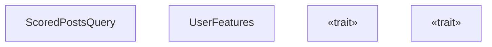
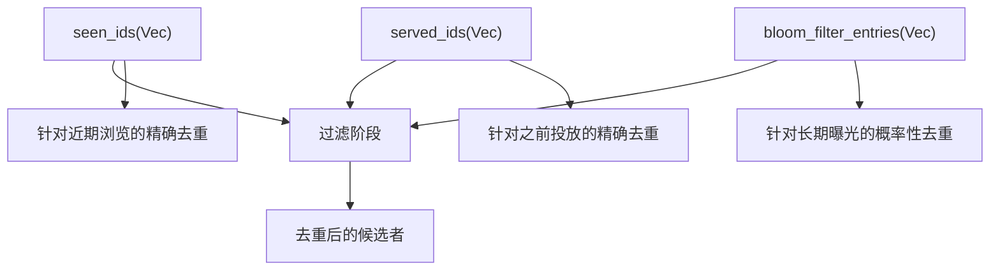
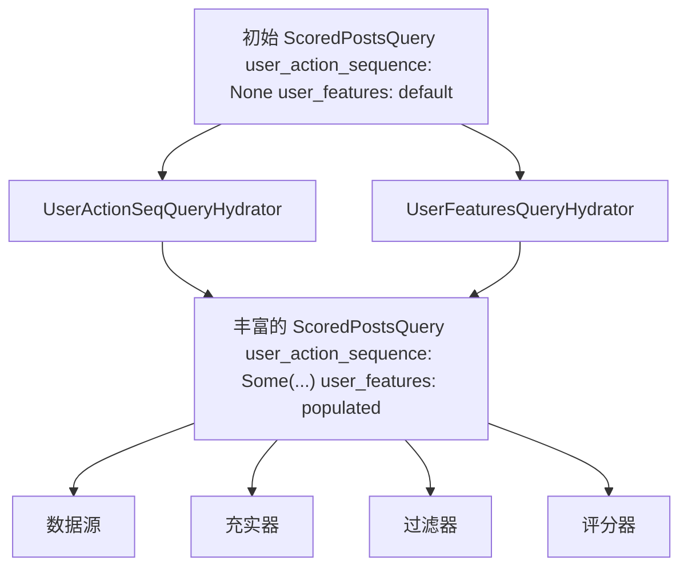
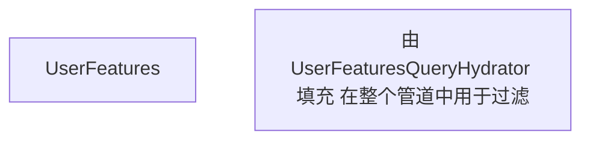
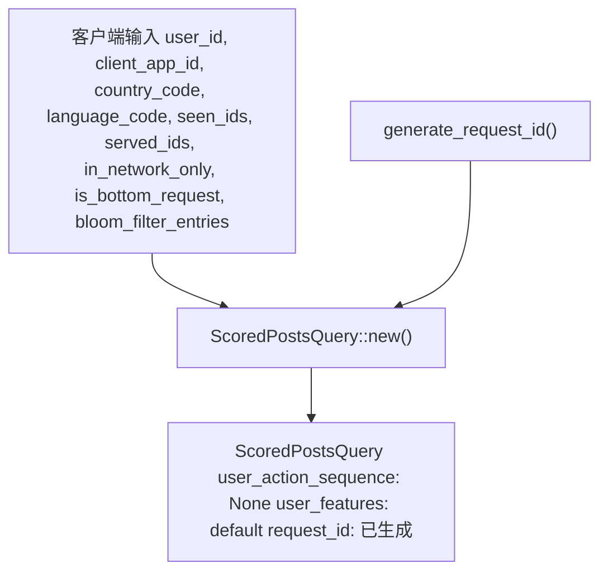
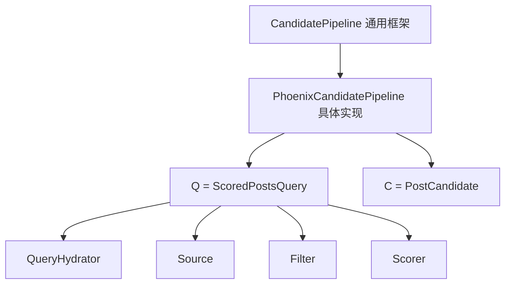

# ScoredPostsQuery

相关源文件

-   [home-mixer/candidate\_pipeline/query.rs](https://github.com/xai-org/x-algorithm/blob/aaa167b3/home-mixer/candidate_pipeline/query.rs)
-   [home-mixer/candidate\_pipeline/query\_features.rs](https://github.com/xai-org/x-algorithm/blob/aaa167b3/home-mixer/candidate_pipeline/query_features.rs)

## 目的与范围

本文档描述了 `ScoredPostsQuery`，它是整个主混频器的 Phoenix 候选管道中使用的主要查询数据结构。`ScoredPostsQuery` 代表了“为你推荐 (For You)”Feed 中对已评分帖子（推文）的请求，封装了关于请求用户、其上下文、本地化偏好、去重状态以及丰富特征的所有必要信息。

`ScoredPostsQuery` 在通用 `CandidatePipeline<Q, C>` 框架中充当查询类型参数 `Q`（参见 [候选管道框架](/xai-org/x-algorithm/3-candidate-pipeline-framework)）。它在每个请求开始时创建，并在流经管道时由查询充实器逐步丰富（参见 [查询充实器](/xai-org/x-algorithm/4.4-query-hydrators)）。有关候选者数据结构的信息，请参见 [PostCandidate](/xai-org/x-algorithm/4.2.2-postcandidate)。

来源：[home-mixer/candidate\_pipeline/query.rs1-70](https://github.com/xai-org/x-algorithm/blob/aaa167b3/home-mixer/candidate_pipeline/query.rs#L1-L70)

## 数据结构概览

`ScoredPostsQuery` 结构体定义在 [home-mixer/candidate\_pipeline/query.rs8-21](https://github.com/xai-org/x-algorithm/blob/aaa167b3/home-mixer/candidate_pipeline/query.rs#L8-L21) 中，包含 12 个字段，分为以下功能类别：用户识别、本地化、去重、请求配置、丰富的查询数据以及请求追踪。


来源：[home-mixer/candidate\_pipeline/query.rs8-21](https://github.com/xai-org/x-algorithm/blob/aaa167b3/home-mixer/candidate_pipeline/query.rs#L8-L21) [home-mixer/candidate\_pipeline/query\_features.rs5-11](https://github.com/xai-org/x-algorithm/blob/aaa167b3/home-mixer/candidate_pipeline/query_features.rs#L5-L11)

## 字段说明

下表记录了 `ScoredPostsQuery` 中的各个字段，按功能类别组织：

| 类别 | 字段 | 类型 | 目的 |
| --- | --- | --- | --- |
| **用户上下文** | `user_id` | `i64` | 请求用户（查看者）的唯一标识符 |
|  | `client_app_id` | `i32` | 客户端应用标识符（例如 iOS, Android, web） |
| **本地化** | `country_code` | `String` | 用户所在位置的 ISO 国家代码 |
|  | `language_code` | `String` | 用户偏好语言的 ISO 语言代码 |
| **去重** | `seen_ids` | `Vec<i64>` | 用户已经看过（滑过）的推文 ID |
|  | `served_ids` | `Vec<i64>` | 之前已向用户投放过的推文 ID |
|  | `bloom_filter_entries` | `Vec<ImpressionBloomFilterEntry>` | 用于对曝光进行概率性去重的布隆过滤器项 |
| **请求配置** | `in_network_only` | `bool` | 如果为 true，则仅检索来自关注用户的候选者（仅限 Thunder 数据源） |
|  | `is_bottom_request` | `bool` | 指示这是否是针对 Feed 底部额外内容的请求 |
| **丰富的查询数据** | `user_action_sequence` | `Option<UserActionSequence>` | 用户的近期互动历史，由查询充实器填充 |
|  | `user_features` | `UserFeatures` | 社交图谱和内容偏好数据，由查询充实器填充 |
| **请求追踪** | `request_id` | `String` | 此请求的唯一标识符，用于日志记录和调试 |

来源：[home-mixer/candidate\_pipeline/query.rs8-21](https://github.com/xai-org/x-algorithm/blob/aaa167b3/home-mixer/candidate_pipeline/query.rs#L8-L21)

### 用户上下文字段

`user_id` 和 `client_app_id` 字段标识了请求用户及其客户端应用。这些字段对于个性化至关重要，并在整个管道中用于：

-   确定从哪些关注的用户中检索网内帖子 (Thunder 数据源)
-   为网外检索生成用户嵌入 (Phoenix 检索)
-   过滤被拉黑/屏蔽的内容
-   应用特定平台的业务逻辑

来源：[home-mixer/candidate\_pipeline/query.rs9-10](https://github.com/xai-org/x-algorithm/blob/aaa167b3/home-mixer/candidate_pipeline/query.rs#L9-L10)

### 本地化字段

`country_code` 和 `language_code` 字段支持地理和语言个性化：

-   基于地区合规性要求的内容过滤
-   针对特定语言的排序调整
-   语言区域感知的可见性过滤

来源：[home-mixer/candidate\_pipeline/query.rs11-12](https://github.com/xai-org/x-algorithm/blob/aaa167b3/home-mixer/candidate_pipeline/query.rs#L11-L12)

### 去重字段

三个字段共同协作以防止展示重复内容：


-   **`seen_ids`**：用户在当前会话中滑过的推文 ID 的精确列表
-   **`served_ids`**：在之前的响应中返回过的推文 ID 的精确列表
-   **`bloom_filter_entries`**：用于以高内存效率追踪较长时间跨度内曝光的概率性数据结构

来源：[home-mixer/candidate\_pipeline/query.rs13-17](https://github.com/xai-org/x-algorithm/blob/aaa167b3/home-mixer/candidate_pipeline/query.rs#L13-L17)

### 请求配置字段

`in_network_only` 和 `is_bottom_request` 标志控制管道行为：

-   **`in_network_only`**：当为 `true` 时，禁用 Phoenix 检索数据源，仅通过 Thunder 投放来自关注用户的候选者。这用于偏好按时间顺序排列的时间线的用户或特定的 UI 上下文。
-   **`is_bottom_request`**：当为 `true` 时，表示用户已滑动到 Feed 底部并请求更多内容。这可能会触发不同的排序策略或候选者混合比例。

来源：[home-mixer/candidate\_pipeline/query.rs15-16](https://github.com/xai-org/x-algorithm/blob/aaa167b3/home-mixer/candidate_pipeline/query.rs#L15-L16)

### 丰富的查询数据字段

有两个字段初始为空/默认值，并在管道执行期间由查询充实器填充：


-   **`user_action_sequence`**：由 `UserActionSeqQueryHydrator` 填充，包含用户的近期互动历史（喜爱、转推、回复等），由 Phoenix 评分器用于个性化评分。
-   **`user_features`**：由 `UserFeaturesQueryHydrator` 填充，包含社交图谱数据和内容偏好（见下文 [UserFeatures 组件](#userfeatures-组件)）。

来源：[home-mixer/candidate\_pipeline/query.rs18-19](https://github.com/xai-org/x-algorithm/blob/aaa167b3/home-mixer/candidate_pipeline/query.rs#L18-L19)

## UserFeatures 组件

`UserFeatures` 结构体嵌套在 `ScoredPostsQuery` 中，包含社交图谱和内容偏好数据。它定义在 [home-mixer/candidate\_pipeline/query\_features.rs5-11](https://github.com/xai-org/x-algorithm/blob/aaa167b3/home-mixer/candidate_pipeline/query_features.rs#L5-L11) 中。


### UserFeatures 字段

| 字段 | 类型 | 目的 |
| --- | --- | --- |
| `muted_keywords` | `Vec<String>` | 用户已屏蔽的关键词和短语；用于过滤包含这些术语的候选者 |
| `blocked_user_ids` | `Vec<i64>` | 查看者已拉黑的用户 ID；来自这些作者的候选者将被过滤掉 |
| `muted_user_ids` | `Vec<i64>` | 查看者已屏蔽的用户 ID；来自这些作者的候选者将被过滤掉 |
| `followed_user_ids` | `Vec<i64>` | 查看者关注的用户 ID；用于确定网内 vs 网外候选者 |
| `subscribed_user_ids` | `Vec<i64>` | 查看者订阅的用户 ID（高级/付费订阅）；用于订阅过滤 |

这些字段被管道中的各种过滤器使用：

-   `AuthorSocialgraphFilter` 使用 `blocked_user_ids` 和 `muted_user_ids`（参见 [AuthorSocialgraphFilter](/xai-org/x-algorithm/4.6.2-authorsocialgraphfilter)）
-   `MutedKeywordFilter` 使用 `muted_keywords`
-   `InNetworkCandidateHydrator` 使用 `followed_user_ids` 将候选者标记为网内内容（参见 [InNetworkCandidateHydrator](/xai-org/x-algorithm/4.5.3-innetworkcandidatehydrator)）
-   `SubscriptionHydrator` 使用 `subscribed_user_ids`（参见 [SubscriptionHydrator](/xai-org/x-algorithm/4.5.4-subscriptionhydrator)）

来源：[home-mixer/candidate\_pipeline/query\_features.rs5-11](https://github.com/xai-org/x-algorithm/blob/aaa167b3/home-mixer/candidate_pipeline/query_features.rs#L5-L11)

## 构建与初始化

### 构造方法

`new()` 构造函数定义在 [home-mixer/candidate\_pipeline/query.rs24-50](https://github.com/xai-org/x-algorithm/blob/aaa167b3/home-mixer/candidate_pipeline/query.rs#L24-L50) 中，使用客户端提供的值初始化 `ScoredPostsQuery`。丰富的查询数据字段被初始化为默认/空值：


构造函数执行以下操作：

1.  接受对应于客户端提供数据的 9 个参数。
2.  使用 `generate_request_id()` 生成唯一 `request_id` 并附加 `user_id`。
3.  将 `user_action_sequence` 设置为 `None`。
4.  将 `user_features` 设置为 `UserFeatures::default()`。
5.  返回初始化的结构体。

来源：[home-mixer/candidate\_pipeline/query.rs24-50](https://github.com/xai-org/x-algorithm/blob/aaa167b3/home-mixer/candidate_pipeline/query.rs#L24-L50)

### 请求 ID 生成

`request_id` 字段会自动按 `{generated_id}-{user_id}` 格式生成，其中：

-   `{generated_id}` 由 `generate_request_id()` 工具函数生成。
-   `{user_id}` 是请求用户的 ID。

此格式支持：

-   唯一标识每个请求，用于日志记录和调试。
-   方便地按用户 ID 过滤日志。
-   跨服务的分布式追踪关联。

来源：[home-mixer/candidate\_pipeline/query.rs35](https://github.com/xai-org/x-algorithm/blob/aaa167b3/home-mixer/candidate_pipeline/query.rs#L35-L35)

## Trait 实现

`ScoredPostsQuery` 实现了两个 Trait，以便与框架组件和外部服务集成。

### HasRequestId Trait

`HasRequestId` Trait 由候选管道框架定义，并在 [home-mixer/candidate\_pipeline/query.rs65-69](https://github.com/xai-org/x-algorithm/blob/aaa167b3/home-mixer/candidate_pipeline/query.rs#L65-L69) 中实现：

```
impl HasRequestId for ScoredPostsQuery {    fn request_id(&self) -> &str {        &self.request_id    }}
```
此 Trait 支持：

-   框架组件访问请求 ID 以进行日志记录。
-   跨管道阶段关联事件。
-   调试和追踪支持。

来源：[home-mixer/candidate\_pipeline/query.rs65-69](https://github.com/xai-org/x-algorithm/blob/aaa167b3/home-mixer/candidate_pipeline/query.rs#L65-L69)

### GetTwitterContextViewer Trait

`GetTwitterContextViewer` Trait 在 [home-mixer/candidate\_pipeline/query.rs53-63](https://github.com/xai-org/x-algorithm/blob/aaa167b3/home-mixer/candidate_pipeline/query.rs#L53-L63) 中实现，以支持与需要查看者上下文的外部服务集成：

```
impl GetTwitterContextViewer for ScoredPostsQuery {    fn get_viewer(&self) -> Option<TwitterContextViewer> {        Some(TwitterContextViewer {            user_id: self.user_id,            client_application_id: self.client_app_id as i64,            request_country_code: self.country_code.clone(),            request_language_code: self.language_code.clone(),            ..Default::default()        })    }}
```
此 Trait 从查询字段构建 `TwitterContextViewer` protobuf 消息，该消息被以下组件使用：

-   可见性过滤服务 (Visibility Filtering Service)，用于内容安全检查。
-   其他需要查看者上下文进行授权或个性化的 Twitter 服务。

来源：[home-mixer/candidate\_pipeline/query.rs53-63](https://github.com/xai-org/x-algorithm/blob/aaa167b3/home-mixer/candidate_pipeline/query.rs#L53-L63)

## 管道中的查询生命周期

下图展示了 `ScoredPostsQuery` 在整个管道执行过程中是如何被创建、丰富和使用的：

> **[Mermaid sequence]**
> *(图表结构无法解析)*

### 管道阶段使用情况

不同的管道阶段访问 `ScoredPostsQuery` 的不同字段：

| 阶段 | 使用的字段 | 目的 |
| --- | --- | --- |
| **查询充实器** | 所有字段 | 读取上下文以获取丰富数据；写入 `user_action_sequence` 和 `user_features` |
| **数据源** | `user_id`, `followed_user_ids`, `in_network_only` | 确定要检索哪些候选者 |
| **充实器** | `user_id`, `country_code`, `language_code` | 为候选者获取额外的元数据 |
| **过滤器** | `seen_ids`, `served_ids`, `bloom_filter_entries`, `blocked_user_ids`, `muted_user_ids`, `muted_keywords` | 移除不符合条件的候选者 |
| **评分器** | `user_action_sequence`, `user_features`, `user_id` | 个性化互动预测 |
| **选择器** | `request_id` (通过 `HasRequestId`) | 日志记录和追踪 |

来源：[home-mixer/candidate\_pipeline/query.rs1-70](https://github.com/xai-org/x-algorithm/blob/aaa167b3/home-mixer/candidate_pipeline/query.rs#L1-L70)

## 与管道框架的集成

`ScoredPostsQuery` 满足通用 `CandidatePipeline<Q, C>` 框架中的查询类型参数 `Q`：


通过实现必需的 Trait (`HasRequestId`) 并遵循框架规范，`ScoredPostsQuery` 使得通用管道机制能够在操作主混频器特定数据的同时，保持类型安全和抽象边界。

来源：[home-mixer/candidate\_pipeline/query.rs1-70](https://github.com/xai-org/x-algorithm/blob/aaa167b3/home-mixer/candidate_pipeline/query.rs#L1-L70)
