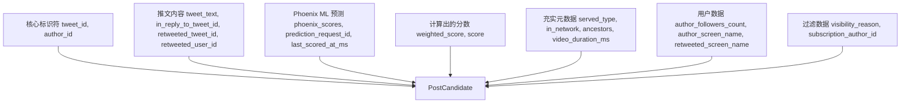
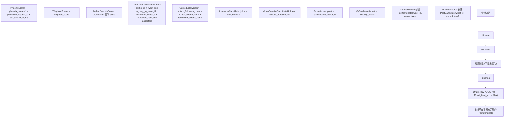
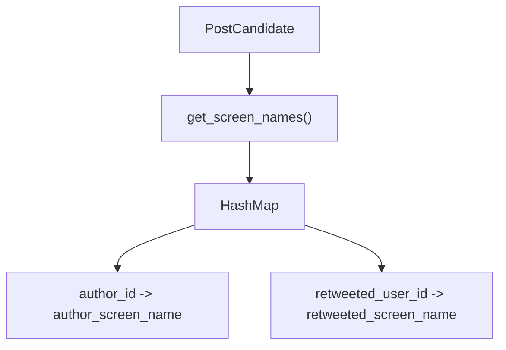
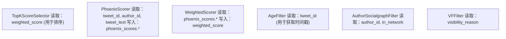

# PostCandidate

相关源文件

-   [home-mixer/candidate\_pipeline/candidate.rs](https://github.com/xai-org/x-algorithm/blob/aaa167b3/home-mixer/candidate_pipeline/candidate.rs)
-   [home-mixer/candidate\_pipeline/candidate\_features.rs](https://github.com/xai-org/x-algorithm/blob/aaa167b3/home-mixer/candidate_pipeline/candidate_features.rs)

## 目的与范围

`PostCandidate` 是代表在 Phoenix 候选管道 (Phoenix Candidate Pipeline) 中流转的推文（帖子）的核心数据结构。本文档描述了该结构的字段、用途、它们是如何被各个管道阶段填充的，以及候选者从初始创建到最终选择的生命周期。

有关驱动候选者检索的查询结构的信息，请参见 [ScoredPostsQuery](/xai-org/x-algorithm/4.2.1-scoredpostsquery)。有关候选者如何从数据源检索的详细信息，请参见 [候选者数据源](/xai-org/x-algorithm/4.3-candidate-sources)。有关候选者如何充实和评分的信息，请参见 [候选者充实器](/xai-org/x-algorithm/4.5-candidate-hydrators) 和 [评分器](/xai-org/x-algorithm/4.7-scorers)。

## PostCandidate 结构

`PostCandidate` 结构体定义在 [home-mixer/candidate\_pipeline/candidate.rs6-27](https://github.com/xai-org/x-algorithm/blob/aaa167b3/home-mixer/candidate_pipeline/candidate.rs#L6-L27) 中，包含 26 个字段，分为几个逻辑组：核心标识符、推文内容、ML 预测、充实元数据和过滤数据。

### 字段组 (Field Groups)

**来源：** [home-mixer/candidate\_pipeline/candidate.rs6-27](https://github.com/xai-org/x-algorithm/blob/aaa167b3/home-mixer/candidate_pipeline/candidate.rs#L6-L27)

### 完整字段参考

| 字段 | 类型 | 目的 | 填充者 |
| --- | --- | --- | --- |
| `tweet_id` | `i64` | 推文的主要标识符 | 数据源 (Thunder/Phoenix) |
| `author_id` | `u64` | 推文作者的用户 ID | CoreDataCandidateHydrator |
| `tweet_text` | `String` | 推文文本内容 | CoreDataCandidateHydrator |
| `in_reply_to_tweet_id` | `Option<u64>` | 此推文回复的推文 ID（如果有） | CoreDataCandidateHydrator |
| `retweeted_tweet_id` | `Option<u64>` | 如果是转推，则为原始推文 ID | CoreDataCandidateHydrator |
| `retweeted_user_id` | `Option<u64>` | 如果是转推，则为原始作者 ID | CoreDataCandidateHydrator |
| `phoenix_scores` | `PhoenixScores` | ML 互动概率预测 | PhoenixScorer |
| `prediction_request_id` | `Option<u64>` | Phoenix 预测批次的标识符 | PhoenixScorer |
| `last_scored_at_ms` | `Option<u64>` | Phoenix 评分发生时的时间戳 | PhoenixScorer |
| `weighted_score` | `Option<f64>` | 用于排名的最终加权分数 | WeightedScorer |
| `score` | `Option<f64>` | 中间分数或调整后的分数 | 各种评分器 |
| `served_type` | `Option<pb::ServedType>` | 候选者的分类（网内、网外等） | 数据源 |
| `in_network` | `Option<bool>` | 查看者是否关注了作者 | InNetworkCandidateHydrator |
| `ancestors` | `Vec<u64>` | 会话祖先推文 ID | CoreDataCandidateHydrator |
| `video_duration_ms` | `Option<i32>` | 视频时长（毫秒） | VideoDurationCandidateHydrator |
| `author_followers_count` | `Option<i32>` | 作者拥有的粉丝数 | GizmoduckHydrator |
| `author_screen_name` | `Option<String>` | 作者的 @用户名 | GizmoduckHydrator |
| `retweeted_screen_name` | `Option<String>` | 转推的原始作者 @用户名 | GizmoduckHydrator |
| `visibility_reason` | `Option<vf::FilteredReason>` | 如果被过滤，则为可见性过滤原因 | VFCandidateHydrator |
| `subscription_author_id` | `Option<u64>` | 如果来自订阅内容，则为作者 ID | SubscriptionHydrator |

**来源：** [home-mixer/candidate\_pipeline/candidate.rs6-27](https://github.com/xai-org/x-algorithm/blob/aaa167b3/home-mixer/candidate_pipeline/candidate.rs#L6-L27)

## PhoenixScores 结构

`PhoenixScores` 结构体定义在 [home-mixer/candidate\_pipeline/candidate.rs29-51](https://github.com/xai-org/x-algorithm/blob/aaa167b3/home-mixer/candidate_pipeline/candidate.rs#L29-L51) 中，包含来自 Phoenix Grok transformer 模型的互动概率预测。所有字段均为 `Option<f64>`，代表 0.0 到 1.0 之间的概率。

### 互动预测类别

**来源：** [home-mixer/candidate\_pipeline/candidate.rs29-51](https://github.com/xai-org/x-algorithm/blob/aaa167b3/home-mixer/candidate_pipeline/candidate.rs#L29-L51)

### Phoenix 分数解析

| 类别 | 字段 | 描述 |
| --- | --- | --- |
| **核心互动** | `favorite_score`, `reply_score`, `retweet_score` | 主要互动行为 |
| **扩展行为** | `quote_score`, `share_score`, `share_via_dm_score`, `share_via_copy_link_score` | 次要分享行为 |
| **基于点击** | `click_score`, `photo_expand_score`, `profile_click_score`, `quoted_click_score` | 点击转化行为 |
| **观看质量** | `vqv_score` | 视频观看质量预测 |
| **关注行为** | `follow_author_score` | 看到帖子后关注作者的概率 |
| **负向信号** | `not_interested_score`, `block_author_score`, `mute_author_score`, `report_score` | 负向互动预测 |
| **停留指标** | `dwell_score`, `dwell_time` | 观看时长的预测 |

**来源：** [home-mixer/candidate\_pipeline/candidate.rs29-51](https://github.com/xai-org/x-algorithm/blob/aaa167b3/home-mixer/candidate_pipeline/candidate.rs#L29-L51)

## 候选者生命周期与数据流

`PostCandidate` 经历了多个管道阶段，不同的组件负责填充不同的字段。下图展示了一个候选者从初始创建到最终选择的演变过程。

**来源：** [home-mixer/candidate\_pipeline/candidate.rs6-27](https://github.com/xai-org/x-algorithm/blob/aaa167b3/home-mixer/candidate_pipeline/candidate.rs#L6-L27)

## 按管道阶段划分的字段填充

下表将每个 `PostCandidate` 字段映射到负责填充它的管道组件：

| 管道阶段 | 组件 | 填充的字段 |
| --- | --- | --- |
| **数据源 (Source)** | ThunderSource, PhoenixSource | `tweet_id`, `served_type` |
| **充实器 (Hydrator)** | CoreDataCandidateHydrator | `author_id`, `tweet_text`, `in_reply_to_tweet_id`, `retweeted_tweet_id`, `retweeted_user_id`, `ancestors` |
| **充实器 (Hydrator)** | GizmoduckHydrator | `author_followers_count`, `author_screen_name`, `retweeted_screen_name` |
| **充实器 (Hydrator)** | InNetworkCandidateHydrator | `in_network` |
| **充实器 (Hydrator)** | VideoDurationCandidateHydrator | `video_duration_ms` |
| **充实器 (Hydrator)** | SubscriptionHydrator | `subscription_author_id` |
| **充实器 (Hydrator)** | VFCandidateHydrator | `visibility_reason` |
| **评分器 (Scorer)** | PhoenixScorer | `phoenix_scores`（所有子字段）, `prediction_request_id`, `last_scored_at_ms` |
| **评分器 (Scorer)** | WeightedScorer | `weighted_score` |
| **评分器 (Scorer)** | AuthorDiversityScorer, OONScorer | `score`（修改） |

**来源：** [home-mixer/candidate\_pipeline/candidate.rs6-27](https://github.com/xai-org/x-algorithm/blob/aaa167b3/home-mixer/candidate_pipeline/candidate.rs#L6-L27)

## CandidateHelpers Trait

[home-mixer/candidate\_pipeline/candidate.rs53-70](https://github.com/xai-org/x-algorithm/blob/aaa167b3/home-mixer/candidate_pipeline/candidate.rs#L53-L70) 中定义的 `CandidateHelpers` Trait 提供了操作 `PostCandidate` 实例的工具方法。

### get\_screen\_names 方法

`get_screen_names()` 方法返回一个 `HashMap<u64, String>`，将与候选者相关的所有用户的用户 ID 映射到显示账号：

-   如果存在，将 `author_id` 映射到 `author_screen_name`
-   如果候选者是转推，将 `retweeted_user_id` 映射到 `retweeted_screen_name`

这对于构建面向用户的显示内容或进行日志记录非常有用，无需重复访问可选字段。

**来源：** [home-mixer/candidate\_pipeline/candidate.rs53-70](https://github.com/xai-org/x-algorithm/blob/aaa167b3/home-mixer/candidate_pipeline/candidate.rs#L53-L70)

## 相关特征结构

虽然不是 `PostCandidate` 的直接字段，但在 [home-mixer/candidate\_pipeline/candidate\_features.rs](https://github.com/xai-org/x-algorithm/blob/aaa167b3/home-mixer/candidate_pipeline/candidate_features.rs) 中定义的几个支持性数据结构在充实过程中被用来填充 `PostCandidate` 字段：

### PureCoreData

定义在 [home-mixer/candidate\_pipeline/candidate\_features.rs5-12](https://github.com/xai-org/x-algorithm/blob/aaa167b3/home-mixer/candidate_pipeline/candidate_features.rs#L5-L12) 中，此结构代表了从 TES (推文实体服务，Tweet Entity Service) 获取的原始核心推文数据，随后会被映射到 `PostCandidate` 字段：

| PureCoreData 字段 | 映射至 PostCandidate 字段 |
| --- | --- |
| `author_id` | `author_id` |
| `text` | `tweet_text` |
| `source_tweet_id` | `retweeted_tweet_id` |
| `source_user_id` | `retweeted_user_id` |
| `in_reply_to_tweet_id` | `in_reply_to_tweet_id` |

### MediaEntity 与 VideoInfo

定义在 [home-mixer/candidate\_pipeline/candidate\_features.rs20-38](https://github.com/xai-org/x-algorithm/blob/aaa167b3/home-mixer/candidate_pipeline/candidate_features.rs#L20-L38) 中，这些结构代表了来自 TES 的媒体元数据：

-   `MediaEntity` 包含一个 `media_info` 字段
-   `MediaInfo::VideoInfo` 变体包含 `VideoInfo`
-   `VideoInfo.duration_millis` 映射至 `PostCandidate.video_duration_ms`

### GizmoduckUser

定义在 [home-mixer/candidate\_pipeline/candidate\_features.rs60-78](https://github.com/xai-org/x-algorithm/blob/aaa167b3/home-mixer/candidate_pipeline/candidate_features.rs#L60-L78) 中，此结构代表了来自 Gizmoduck 服务的用户画像数据：

-   `GizmoduckUserProfile.screen_name` 映射至 `author_screen_name` 或 `retweeted_screen_name`
-   `GizmoduckUserCounts.followers_count` 映射至 `author_followers_count`

**来源：** [home-mixer/candidate\_pipeline/candidate\_features.rs1-79](https://github.com/xai-org/x-algorithm/blob/aaa167b3/home-mixer/candidate_pipeline/candidate_features.rs#L1-L79)

## 内存与性能考量

### 克隆语义 (Clone Semantics)

`PostCandidate` 实现了 `Clone` ([home-mixer/candidate\_pipeline/candidate.rs5](https://github.com/xai-org/x-algorithm/blob/aaa167b3/home-mixer/candidate_pipeline/candidate.rs#L5-L5))，从而支持在需要分叉候选者的管道阶段（例如多样性评分或 A/B 测试）进行高效复制。

### 可选字段 (Optional Fields)

大多数字段均为 `Option<T>` 类型，允许结构体在管道进程中以部分填充的状态存在。这避免了为根据过滤结果可能不需要的字段分配不必要的内存。

### 默认实现 (Default Implementation)

`PostCandidate` 和 `PhoenixScores` 均实现了 `Default` ([home-mixer/candidate\_pipeline/candidate.rs5](https://github.com/xai-org/x-algorithm/blob/aaa167b3/home-mixer/candidate_pipeline/candidate.rs#L5-L5) [home-mixer/candidate\_pipeline/candidate.rs29](https://github.com/xai-org/x-algorithm/blob/aaa167b3/home-mixer/candidate_pipeline/candidate.rs#L29-L29))，从而支持在数据源阶段轻松构建空的候选者。

**来源：** [home-mixer/candidate\_pipeline/candidate.rs5-51](https://github.com/xai-org/x-algorithm/blob/aaa167b3/home-mixer/candidate_pipeline/candidate.rs#L5-L51)

## 使用示例：字段访问模式

在整个管道中，组件根据其所处阶段访问 `PostCandidate` 字段：

**来源：** [home-mixer/candidate\_pipeline/candidate.rs6-27](https://github.com/xai-org/x-algorithm/blob/aaa167b3/home-mixer/candidate_pipeline/candidate.rs#L6-L27)
