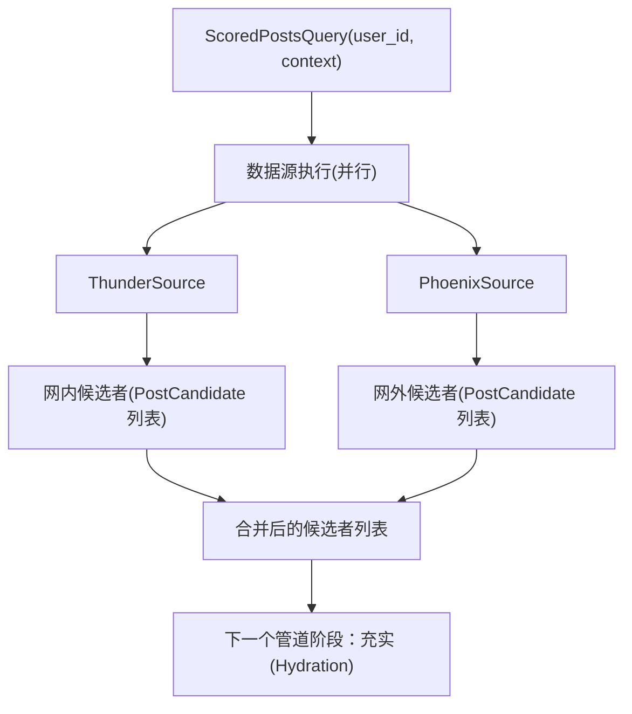
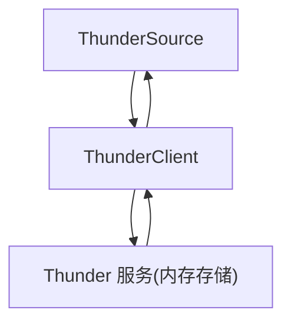
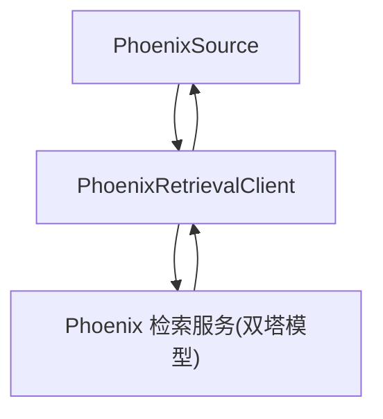
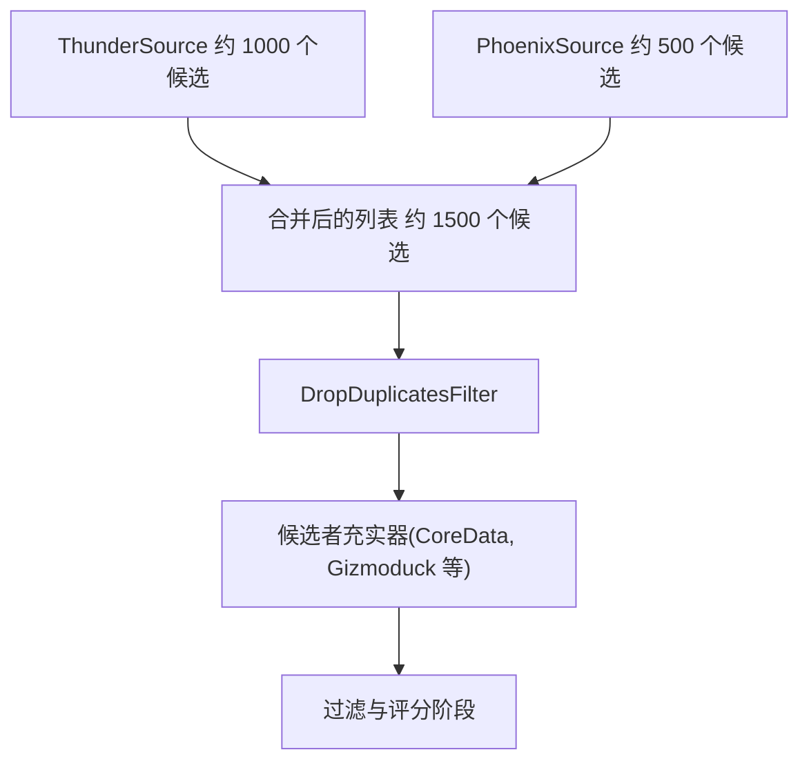

# 候选者数据源

相关源文件

-   [README.md](https://github.com/xai-org/x-algorithm/blob/aaa167b3/README.md?plain=1)
-   [home-mixer/candidate\_pipeline/phoenix\_candidate\_pipeline.rs](https://github.com/xai-org/x-algorithm/blob/aaa167b3/home-mixer/candidate_pipeline/phoenix_candidate_pipeline.rs)

## 目的与范围

本文档描述了为 Phoenix 候选管道 (Phoenix Candidate Pipeline) 检索初始候选者集的**候选者数据源**实现。候选者数据源是管道中的第一个阶段，通过从底层数据存储或检索系统中获取帖子 (post)，生成实际的内容推荐。

主混频器实现使用了两个并行的源：

-   **ThunderSource**：从用户关注的账号中检索网内 (in-network) 帖子。
-   **PhoenixSource**：检索通过基于机器学习 (ML) 的相似度搜索发现的网外 (out-of-network) 帖子。

有关通用 `Source` Trait 及其执行模型的实现细节，请参见 [数据源 Trait](/xai-org/x-algorithm/3.3-source-trait)。有关每个源系统的详细架构，请参见 [Thunder 数据源](/xai-org/x-algorithm/4.3.1-thunder-source) 和 [Phoenix 检索数据源](/xai-org/x-algorithm/4.3.2-phoenix-retrieval-source)。

## 概览

候选者数据源实现了候选管道框架中的 `Source` Trait。它们负责根据查询上下文检索初始候选者集。在管道执行期间，各数据源**并行**执行以最大限度地降低延迟，其结果在随后的管道阶段之前进行合并。

管道在初始化期间实例化这两个源，并将它们存储为 Trait 对象：

[home-mixer/candidate\_pipeline/phoenix\_candidate\_pipeline.rs91-97](https://github.com/xai-org/x-algorithm/blob/aaa167b3/home-mixer/candidate_pipeline/phoenix_candidate_pipeline.rs#L91-L97)


**管道执行流程：候选者数据源**

来源：[home-mixer/candidate\_pipeline/phoenix\_candidate\_pipeline.rs91-97](https://github.com/xai-org/x-algorithm/blob/aaa167b3/home-mixer/candidate_pipeline/phoenix_candidate_pipeline.rs#L91-L97) [README.md61-69](https://github.com/xai-org/x-algorithm/blob/aaa167b3/README.md?plain=1#L61-L69)

## 数据源实现

Phoenix 候选管道使用了两个具体的数据源实现，每个都针对不同的检索策略进行了优化：

| 数据源 | 目的 | 数据存储 | 检索方法 | 典型数量 |
| --- | --- | --- | --- | --- |
| `ThunderSource` | 来自关注账号的网内帖子 | Thunder 内存存储 | 直接用户查询 | 约 1000 个候选 |
| `PhoenixSource` | 网外内容发现 | Phoenix 机器学习系统 | 双塔 (Two-tower) 相似度搜索 | 约 500 个候选 |

### ThunderSource

`ThunderSource` 检索请求用户关注的账号发布的帖子。它查询 Thunder 服务，该服务维护着一个按作者 ID 组织的近期帖子的内存存储。这实现了对网内内容的亚毫秒级检索。

**结构：**

[home-mixer/candidate\_pipeline/phoenix\_candidate\_pipeline.rs95](https://github.com/xai-org/x-algorithm/blob/aaa167b3/home-mixer/candidate_pipeline/phoenix_candidate_pipeline.rs#L95-L95)


**ThunderSource 数据流**

该源将 Thunder 的响应（来自关注账号的帖子 ID）转换为初始数据极少的 `PostCandidate` 对象。随后的充实阶段将使用完整的元数据来丰富这些候选对象。

有关 Thunder 架构、摄取管道和存储模型的详细信息，请参见 [Thunder 数据源](/xai-org/x-algorithm/4.3.1-thunder-source)。

来源：[home-mixer/candidate\_pipeline/phoenix\_candidate\_pipeline.rs95](https://github.com/xai-org/x-algorithm/blob/aaa167b3/home-mixer/candidate_pipeline/phoenix_candidate_pipeline.rs#L95-L95) [README.md149-161](https://github.com/xai-org/x-algorithm/blob/aaa167b3/README.md?plain=1#L149-L161)

### PhoenixSource

`PhoenixSource` 通过 Phoenix 的检索系统检索网外帖子，该系统使用双塔神经网络模型，通过嵌入 (embedding) 相似度搜索从全局语料库中查找相关内容。

**结构：**

[home-mixer/candidate\_pipeline/phoenix\_candidate\_pipeline.rs92-94](https://github.com/xai-org/x-algorithm/blob/aaa167b3/home-mixer/candidate_pipeline/phoenix_candidate_pipeline.rs#L92-L94)


**PhoenixSource 数据流**

该源将用户上下文（互动历史、特征）发送到 Phoenix，Phoenix 计算用户嵌入并从大规模向量索引中检索具有高点积相似度的候选对象。返回的帖子 ID 被包装在 `PostCandidate` 对象中。

有关双塔架构、用户/候选对象嵌入和相似度搜索的详细信息，请参见 [Phoenix 检索数据源](/xai-org/x-algorithm/4.3.2-phoenix-retrieval-source)。

来源：[home-mixer/candidate\_pipeline/phoenix\_candidate\_pipeline.rs92-94](https://github.com/xai-org/x-algorithm/blob/aaa167b3/home-mixer/candidate_pipeline/phoenix_candidate_pipeline.rs#L92-L94) [README.md165-183](https://github.com/xai-org/x-algorithm/blob/aaa167b3/README.md?plain=1#L165-L183)

## 数据源 Trait 实现

两个源都实现了通用的 `Source<ScoredPostsQuery, PostCandidate>` Trait，该 Trait 定义了一个方法：

```
async fn fetch(    &self,    query: &ScoredPostsQuery,) -> Result<Vec<PostCandidate>, SourceError>;
```
该 Trait 要求数据源：

1.  接收包含用户上下文的查询对象的引用。
2.  返回候选对象的向量或错误。
3.  异步执行以支持并行执行。

管道框架使用 `tokio::join!` 或类似的并行执行原语同时调用所有源，并将其结果收集到单个合并的候选列表中。

来源：[home-mixer/candidate\_pipeline/phoenix\_candidate\_pipeline.rs96-97](https://github.com/xai-org/x-algorithm/blob/aaa167b3/home-mixer/candidate_pipeline/phoenix_candidate_pipeline.rs#L96-L97) [README.md192-199](https://github.com/xai-org/x-algorithm/blob/aaa167b3/README.md?plain=1#L192-L199)

## 候选者合并与去重

在并行数据源执行完成后，管道将所有候选列表合并为单个向量。在此阶段，候选对象可能包含：

-   重复的帖子 ID（来自多个源的同一帖子）
-   极少的元数据（仅帖子 ID、源标识符）
-   无充实数据

随后的管道阶段负责处理去重和充实：

-   **DropDuplicatesFilter** 移除重复的帖子 ID [home-mixer/candidate\_pipeline/phoenix\_candidate\_pipeline.rs110](https://github.com/xai-org/x-algorithm/blob/aaa167b3/home-mixer/candidate_pipeline/phoenix_candidate_pipeline.rs#L110-L110)
-   **充实器 (Hydrator)** 使用核心数据、作者信息、媒体元数据等丰富候选对象。
-   **过滤器 (Filter)** 根据充实后的数据移除不符合条件的候选对象。


**数据源后的管道流程**

来源：[home-mixer/candidate\_pipeline/phoenix\_candidate\_pipeline.rs96-110](https://github.com/xai-org/x-algorithm/blob/aaa167b3/home-mixer/candidate_pipeline/phoenix_candidate_pipeline.rs#L96-L110)

## 数据源初始化

管道在构建过程中通过注入客户端依赖来初始化数据源。这种设计实现了：

-   **可测试性**：可以注入 mock 客户端进行单元测试。
-   **关注点分离**：源专注于候选检索逻辑，客户端处理服务通信。
-   **可重用性**：相同的源实现可以与不同的客户端配置一起工作。

[home-mixer/candidate\_pipeline/phoenix\_candidate\_pipeline.rs73-97](https://github.com/xai-org/x-algorithm/blob/aaa167b3/home-mixer/candidate_pipeline/phoenix_candidate_pipeline.rs#L73-L97)

`prod()` 方法创建生产客户端并将其传递给源构造函数：

[home-mixer/candidate\_pipeline/phoenix\_candidate\_pipeline.rs162-212](https://github.com/xai-org/x-algorithm/blob/aaa167b3/home-mixer/candidate_pipeline/phoenix_candidate_pipeline.rs#L162-L212)

## 数据源配置

源的行为通过以下方式配置：

-   **客户端超时**：Thunder 和 Phoenix 服务的 gRPC 请求截止时间。
-   **候选数量限制**：每个源要检索的最大候选数量。
-   **查询参数**：在 `ScoredPostsQuery` 中传递的过滤器和偏好设置。

与充实器和过滤器不同，源通常没有启用/禁用标志，因为候选检索是管道运行的基础。但是，如果检索失败或没有候选对象匹配查询标准，源可以返回空结果。

来源：[home-mixer/candidate\_pipeline/phoenix\_candidate\_pipeline.rs73-97](https://github.com/xai-org/x-algorithm/blob/aaa167b3/home-mixer/candidate_pipeline/phoenix_candidate_pipeline.rs#L73-L97) [home-mixer/candidate\_pipeline/phoenix\_candidate\_pipeline.rs162-212](https://github.com/xai-org/x-algorithm/blob/aaa167b3/home-mixer/candidate_pipeline/phoenix_candidate_pipeline.rs#L162-L212)

## 错误处理

源故障由管道框架根据配置的错误处理策略进行处理。常见的错误场景：

| 错误类型 | 示例 | 处理策略 |
| --- | --- | --- |
| **服务不可用** | Thunder 服务宕机 | 记录错误，继续执行剩余的源 |
| **超时** | Phoenix 检索超过截止时间 | 返回部分结果或空列表 |
| **无效查询** | 缺少所需的用户上下文 | 整个管道因验证错误而失败 |
| **授权** | 用户未获得服务授权 | 跳过该源，继续执行管道 |

由于各数据源并行执行，一个源的失败并不一定会导致整个管道失败。框架可以继续处理来自成功执行的源的候选对象。

来源：[README.md206-239](https://github.com/xai-org/x-algorithm/blob/aaa167b3/README.md?plain=1#L206-L239)

## 性能特性

| 数据源 | 延迟 (p50) | 延迟 (p99) | 吞吐量 | 可扩展性 |
| --- | --- | --- | --- | --- |
| `ThunderSource` | <1ms | <5ms | 极高 | 按用户分片 |
| `PhoenixSource` | 10-50ms | 100-200ms | 中等 | ANN 索引容量 |

**ThunderSource** 通过以下方式实现亚毫秒级延迟：

-   内存存储（无磁盘 I/O）
-   按用户组织数据（无连接或扫描）
-   直接按用户 ID 查找

**PhoenixSource** 延迟较高是因为：

-   神经网络推理（用户嵌入计算）
-   在大规模索引上进行近似最近邻 (ANN) 搜索
-   到独立的 Phoenix 服务的网络往返

管道的并行执行模型确保了 Phoenix 较高的延迟不会阻塞 Thunder 的快速检索。

来源：[README.md149-183](https://github.com/xai-org/x-algorithm/blob/aaa167b3/README.md?plain=1#L149-L183)
