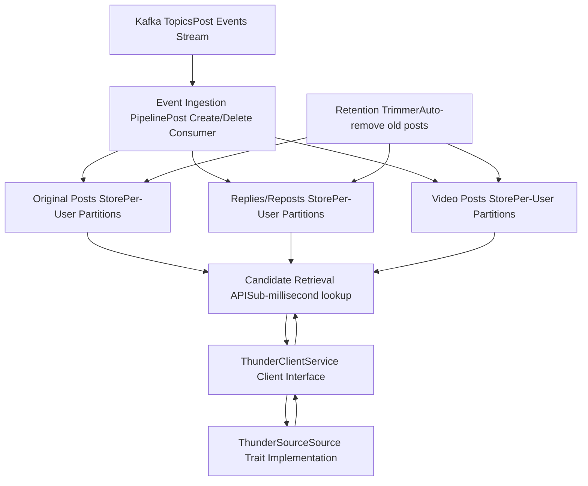
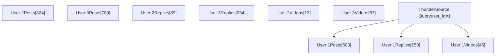
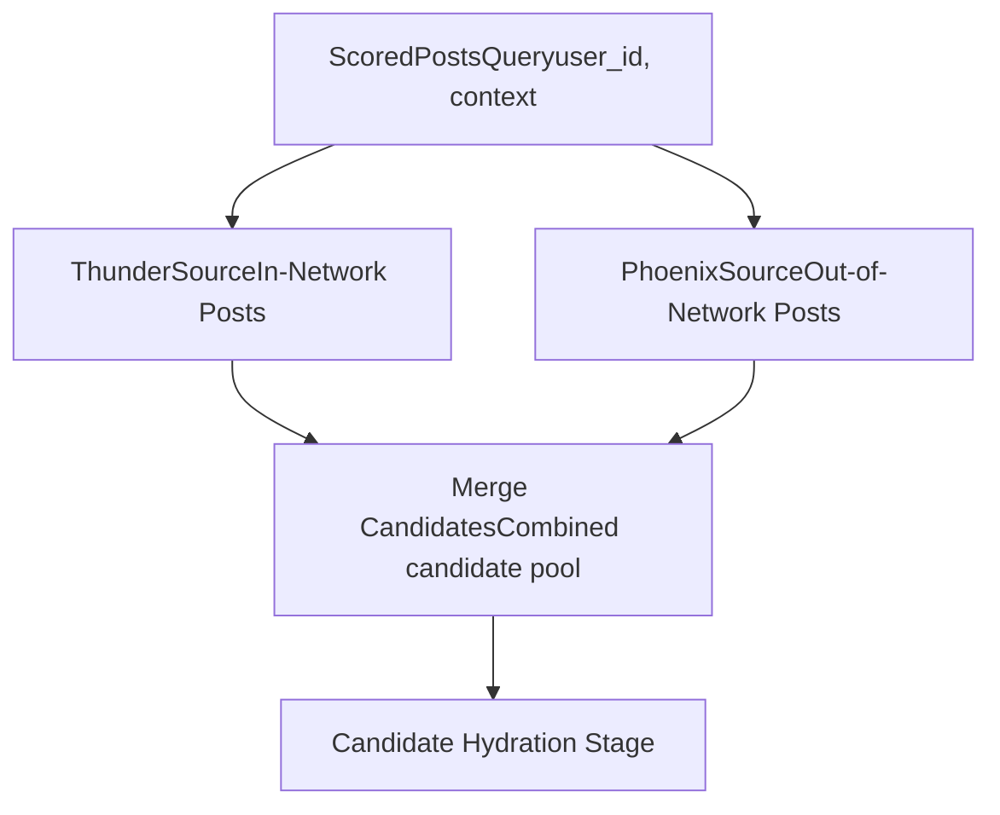

# Thunder 数据源

相关源文件

-   [README.md](https://github.com/xai-org/x-algorithm/blob/aaa167b3/README.md?plain=1)

## 目的与范围

本页面记录了 Thunder 系统，它作为主混频器管道的网络内 (in-network) 候选源。Thunder 是一个实时的内存帖子存储，它维护所有用户的近期帖子，并为请求用户关注的账号提供亚毫秒级的帖子检索。

有关网络外 (out-of-network) 候选源的信息，请参见 [Phoenix 检索数据源](/xai-org/x-algorithm/4.3.2-phoenix-retrieval-source)。有关消耗 Thunder 候选对象的整体管道编排，请参见 [Phoenix 候选管道](/xai-org/x-algorithm/4.1-phoenix-candidate-pipeline)。

## 概述

Thunder 是一个专门的内存数据存储，针对从用户关注账号中检索近期帖子（网络内内容）进行了优化。它作为一个持续更新的缓存运行，能够：

1.  从 Kafka 流中实时消费帖子创建/删除事件
2.  维护包含近期帖子的按用户分区的存储
3.  自动修剪早于配置的保留期的帖子
4.  以亚毫秒级的延迟为主混频器管道提供候选帖子

Thunder 消除了在时间线生成期间为网络内内容查询外部数据库的需求，显著降低了“为你推荐 (For You)”Feed 的 p99 延迟。

**来源：** [README.md149-161](https://github.com/xai-org/x-algorithm/blob/aaa167b3/README.md?plain=1#L149-L161)

## 系统架构

**图：Thunder 服务架构与集成**

该图显示了 Thunder 的内部结构以及它如何与主混频器管道集成。该服务维护三个独立的按用户存储，通过 Kafka 摄取持续更新，并由管道通过 `ThunderClient` 抽象层进行访问。

**来源：** [README.md149-161](https://github.com/xai-org/x-algorithm/blob/aaa167b3/README.md?plain=1#L149-L161)

## Kafka 摄取管道

Thunder 通过从 Kafka 消费帖子事件来维持实时状态。摄取管道处理两种主要的事件类型：

| 事件类型 | 动作 | 影响 |
| --- | --- | --- |
| **帖子创建** | 添加新帖子 | 将帖子插入所有关注者的相应按用户存储中 |
| **帖子删除** | 移除帖子 | 从出现该帖子的所有按用户存储中移除该帖子 |

事件驱动架构确保了 Thunder 对帖子语料库的视图在任何创建或删除操作发生后的数秒内与权威帖子存储保持同步。

### 事件处理流程

> **[Mermaid sequence]**
> *(图表结构无法解析)*

**图：Kafka 事件处理流程**

该序列显示了 Thunder 如何将 Kafka 事件转换为对其内存存储的更新，从而维持帖子语料库的实时视图。

**来源：** [README.md154-156](https://github.com/xai-org/x-algorithm/blob/aaa167b3/README.md?plain=1#L154-L156)

## 存储模型

Thunder 将帖子组织到三个独立的按用户分区存储中，针对不同的内容类型和检索模式进行优化：

### 存储类型

| 存储名称 | 内容类型 | 目的 |
| --- | --- | --- |
| **原创帖子** | 关注用户发布的顶级帖子 | 用户网络中的主要内容 |
| **回复/转推** | 关注用户的回复和转推 | 显示关注者活动的互动内容 |
| **视频帖子** | 包含视频媒体的帖子 | 针对视频密集型 Feed 的视频特定检索 |

### 按用户分区

每个存储都按查看用户 ID 进行分区，从而实现高效查找：

**图：按用户存储分区**

每个用户的网络内内容都存储在专用分区中，允许 Thunder 在单次查找中检索出用户的所有相关帖子，而无需扫描其他用户的数据。

**来源：** [README.md156-157](https://github.com/xai-org/x-algorithm/blob/aaa167b3/README.md?plain=1#L156-L157)

### 保留与修剪

Thunder 会自动移除超过配置的保留期的帖子，以限制内存使用。修剪进程：

1.  定期扫描每个用户分区
2.  识别早于保留阈值的帖子（从雪花 ID (snowflake ID) 时间戳中提取）
3.  从内存存储中移除过期的帖子

这确保了 Thunder 在不造成内存无限增长的情况下维护一个近期帖子的滚动窗口。

**来源：** [README.md159](https://github.com/xai-org/x-algorithm/blob/aaa167b3/README.md?plain=1#L159-L159)

## 候选检索

Thunder 作为候选管道框架中的 `Source` 实现。检索过程遵循以下流程：

> **[Mermaid sequence]**
> *(图表结构无法解析)*

**图：Thunder 候选检索流程**

该序列显示了管道如何通过客户端抽象层向 Thunder 请求网络内候选，Thunder 执行分区查找并合并来自其多个存储的结果。

**来源：** [README.md157-161](https://github.com/xai-org/x-algorithm/blob/aaa167b3/README.md?plain=1#L157-L161)

### 检索性能特性

| 指标 | 典型值 | 解释 |
| --- | --- | --- |
| **延迟** | 亚毫秒级 | 内存查找，无磁盘 I/O |
| **吞吐量** | 高 | 按用户分区支持并行查找 |
| **一致性** | 最终一致性 | Kafka 延迟通常 <1 秒 |
| **新鲜度** | 近乎实时 | 帖子在创建后数秒内即可使用 |

**来源：** [README.md160-161](https://github.com/xai-org/x-algorithm/blob/aaa167b3/README.md?plain=1#L160-L161)

## 与主混频器集成

Thunder 与 Phoenix Retrieval 一起作为多个候选源之一集成到主混频器管道中。集成模式遵循框架的 `Source` Trait：

### Source Trait 实现

`ThunderSource` 结构体实现了 `Source<ScoredPostsQuery, PostCandidate>` Trait，使其成为管道中的一个可插拔组件。关键职责：

1.  **查询解析**：从 `ScoredPostsQuery` 中提取用户 ID 和关注列表
2.  **客户端交互**：调用 `ThunderClient` 获取网络内帖子
3.  **候选构造**：将 Thunder 的响应转换为 `PostCandidate` 对象
4.  **源标记**：将候选对象标记为 `source = SourceType::InNetwork`

### 并行源执行

在候选寻源阶段，Thunder 与 Phoenix Retrieval 并行运行：

**图：多源管道中的 Thunder**

Thunder 与 Phoenix 并行执行，两个源都向合并池提供候选对象，合并池随后流经管道的后续阶段。

**来源：** [README.md62-68](https://github.com/xai-org/x-algorithm/blob/aaa167b3/README.md?plain=1#L62-L68) [README.md210-213](https://github.com/xai-org/x-algorithm/blob/aaa167b3/README.md?plain=1#L210-L213)

### 候选源元数据

来自 Thunder 的候选对象携带元数据，将其与网络外候选对象区分开来：

| 字段 | 值 | 目的 |
| --- | --- | --- |
| `source` | `SourceType::InNetwork` | 为评分和过滤识别来源 |
| `in_network` | `true` | 用于网络内特定逻辑的标志 |
| `author_id` | 取自 Thunder | 作者必须在查看者的关注列表中 |

这些元数据使得下游管道阶段能够对网络内内容和网络外内容应用不同的过滤规则和评分策略。

**来源：** [README.md27-30](https://github.com/xai-org/x-algorithm/blob/aaa167b3/README.md?plain=1#L27-L30)

## 总结

Thunder 通过以下方式为主混频器管道提供快速、可靠的网络内内容访问：

-   **实时 Kafka 摄取**，维护最新的帖子存储
-   **按用户分区的存储**，实现高效的单用户查找
-   **多种存储类型**，针对不同内容类别进行优化
-   **亚毫秒级检索**，消除了数据库查询开销
-   **自动保留管理**，限制了内存使用

该系统的事件驱动架构和内存存储模型对于实现“为你推荐”Feed 生成管道的低延迟要求至关重要。

**来源：** [README.md149-161](https://github.com/xai-org/x-algorithm/blob/aaa167b3/README.md?plain=1#L149-L161)
