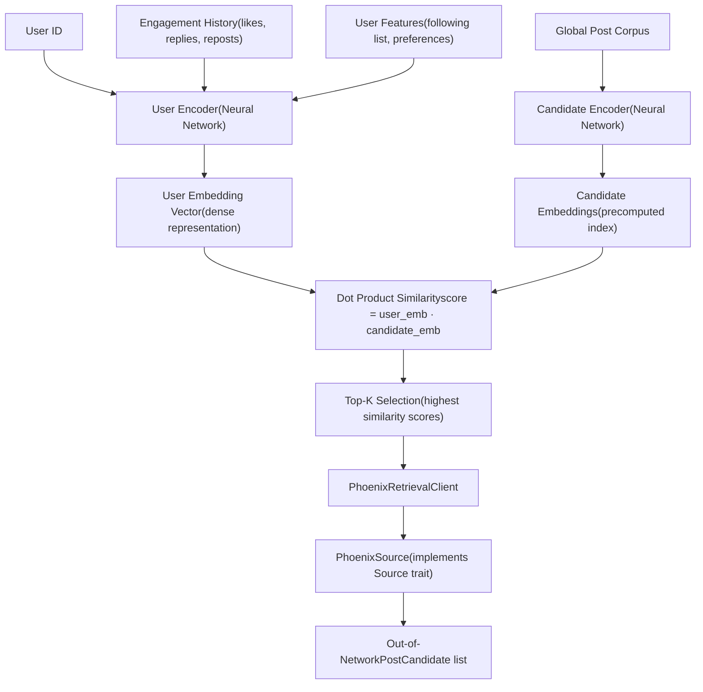
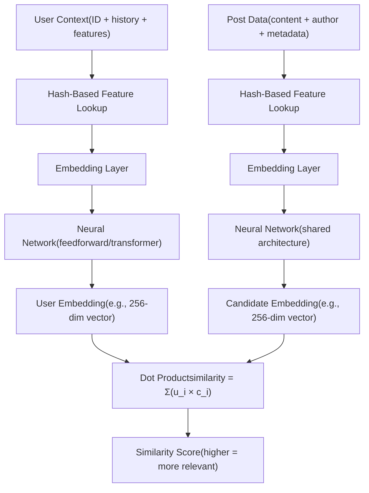
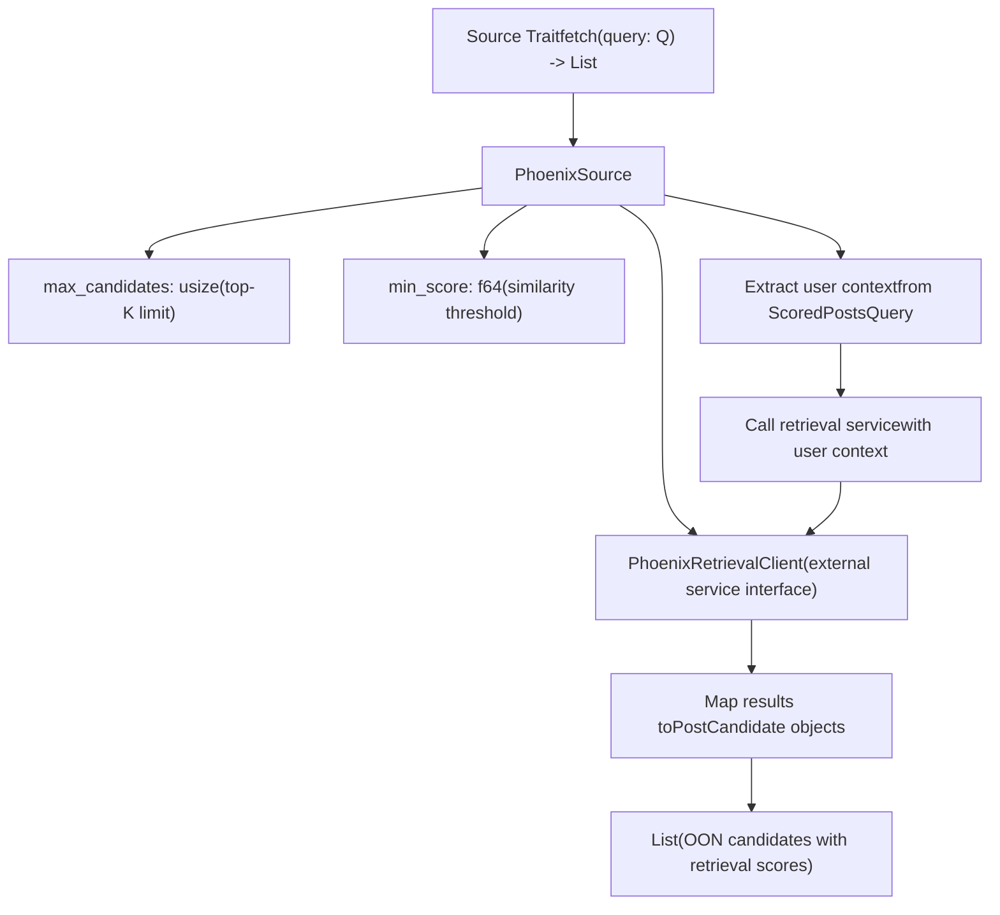
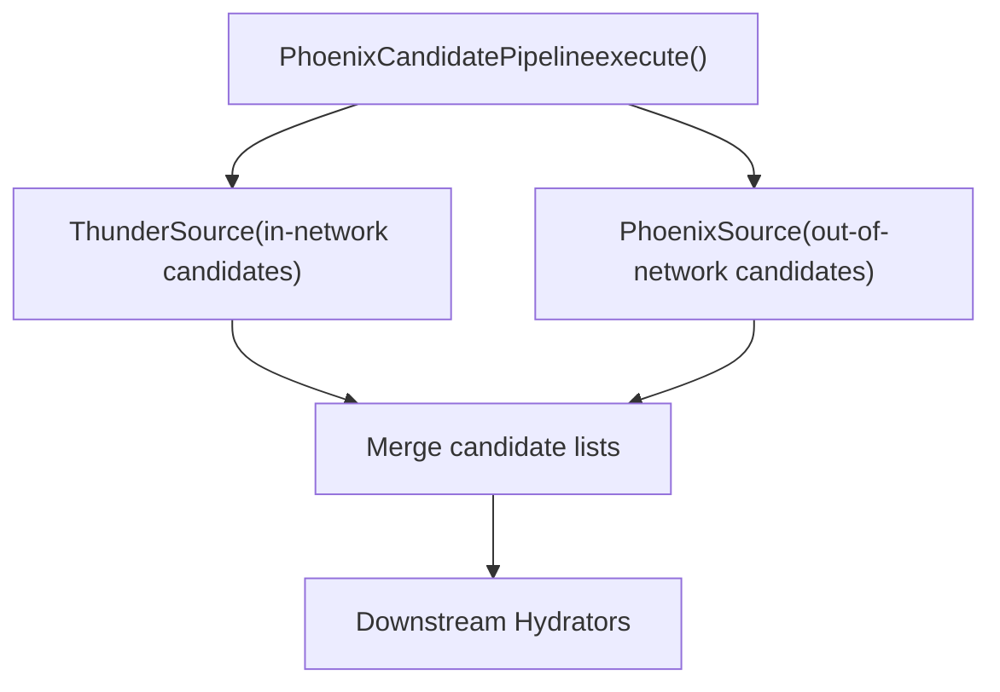

# Phoenix 检索数据源

相关源文件

-   [README.md](https://github.com/xai-org/x-algorithm/blob/aaa167b3/README.md?plain=1)

## 目的与范围

Phoenix 检索数据源负责为用户发现相关的**网络外** (out-of-network, OON) 内容。它使用双塔 (two-tower) 神经网络架构，从全局帖子语料库中执行基于相似度的检索，寻找用户可能感兴趣的内容，即使他们没有关注作者。

本页面记录了检索架构和机制。有关 Phoenix 的评分模型的信息，请参见 [Phoenix 评分器](/xai-org/x-algorithm/4.7.1-phoenix-scorer)。有关网络内 (in-network) 候选源的信息，请参见 [Thunder 数据源](/xai-org/x-algorithm/4.3.1-thunder-source)。有关整体管道集成，请参见 [Phoenix 候选管道](/xai-org/x-algorithm/4.1-phoenix-candidate-pipeline)。

**来源：** [README.md1-326](https://github.com/xai-org/x-algorithm/blob/aaa167b3/README.md?plain=1#L1-L326)

---

## 双塔架构概述

Phoenix 检索实现了一个**双塔模型**，其中用户上下文和候选帖子被独立编码为嵌入 (embedding) 向量。然后使用相似度指标对这些嵌入进行比较，以识别最相关的候选对象。

### 架构图


**来源：** [README.md169-175](https://github.com/xai-org/x-algorithm/blob/aaa167b3/README.md?plain=1#L169-L175)

---

## 双塔模型组件

双塔架构将用户和候选对象编码分离，从而实现了高效的离线预计算和在线服务时的快速检索。

### 用户塔 (User Tower)

用户塔将请求用户的上下文编码为一个稠密嵌入向量。它处理：

| 输入类型 | 描述 |
| --- | --- |
| **用户 ID** | 请求用户的唯一标识符 |
| **互动历史** | 近期的互动（收藏、回复、转推等） |
| **用户特征** | 关注列表、账号元数据、偏好设置 |

用户塔神经网络将这些输入转换为固定维度的嵌入，代表用户当前的兴趣和偏好。

### 候选塔 (Candidate Tower)

候选塔将全局语料库中的单个帖子编码为嵌入向量。这些候选对象嵌入：

-   对所有符合条件的帖子进行**离线预计算**
-   存储在**可搜索索引**中（例如，近似最近邻结构）
-   代表帖子内容、作者元数据和互动模式
-   支持在数百万候选对象中进行亚线性搜索

### 嵌入生成


**关键设计特征：** 两个塔都使用 README 中提到的**基于哈希的嵌入 (hash-based embedding)**。哈希函数将离散特征（用户 ID、帖子 ID、令牌 (token)）映射到嵌入索引，从而实现高效的特征表示，而无需海量的嵌入表。

**来源：** [README.md169-175](https://github.com/xai-org/x-algorithm/blob/aaa167b3/README.md?plain=1#L169-L175) [README.md310-311](https://github.com/xai-org/x-algorithm/blob/aaa167b3/README.md?plain=1#L310-L311)

---

## 相似度搜索与检索

一旦用户塔生成了用户嵌入，系统就会针对预计算的候选对象嵌入执行相似度搜索。

### 检索过程

> **[Mermaid sequence]**
> *(图表结构无法解析)*

### 相似度指标

检索系统使用**点积相似度 (dot product similarity)**：

```
similarity(user, candidate) = user_embedding · candidate_embedding
                             = Σ(user_i × candidate_i)
```
分数越高表示预测的相关性越大。系统检索具有最高相似度分数的 Top-K 个候选对象。

### Top-K 选择

检索到的候选对象数量 (K) 是可配置的，通常在数百到数千之间，取决于：

-   可用的下游处理能力
-   候选池中所需的样性
-   性能要求（K 越大 = 检索越慢）

然后，这些候选对象与来自 Thunder 的网络内候选对象一起，通过管道的补全、过滤和评分阶段。

**来源：** [README.md169-175](https://github.com/xai-org/x-algorithm/blob/aaa167b3/README.md?plain=1#L169-L175)

---

## 与候选管道集成

Phoenix 检索通过 `PhoenixSource` 实现集成到候选管道框架中。

### 源实现 (Source Implementation)


### 数据流

`PhoenixSource` 接收一个 `ScoredPostsQuery` 并执行：

1.  **提取用户上下文**，包括用户 ID、互动历史（如果可从查询充实器获取）和用户特征
2.  **调用 PhoenixRetrievalClient** 以请求远程 Phoenix 机器学习服务
3.  **接收帖子 ID 及其检索分数**（来自相似度搜索）
4.  **构造 PostCandidate 对象**，包含：
    -   填充 `post_id` 字段
    -   `retrieval_score` 字段包含相似度分数
    -   `is_in_network` 设置为 `false`（因为这些是网络外候选对象）
    -   其他字段留空（由下游充实器填充）

### 并行源执行

如高级架构图所示，`PhoenixSource` 与 `ThunderSource` **并行**执行：


两个源并发执行，其结果在进入候选充实阶段之前进行合并。

**来源：** [README.md127-146](https://github.com/xai-org/x-algorithm/blob/aaa167b3/README.md?plain=1#L127-L146) [README.md62-68](https://github.com/xai-org/x-algorithm/blob/aaa167b3/README.md?plain=1#L62-L68)

---

## 实现细节

### 基于哈希的嵌入 (Hash-Based Embeddings)

用户塔和候选塔都利用基于哈希的嵌入进行特征表示。这种方法：

-   通过避免巨大的嵌入表来**减少内存占用**
-   **处理高基数 (high cardinality)** 特征（用户 ID、帖子 ID、令牌）
-   **使用多个哈希函数**以最小化冲突
-   **启用特征哈希**用于文本和类别变量

### 客户端架构 (Client Architecture)

`PhoenixRetrievalClient` 抽象了与外部 Phoenix 机器学习服务的通信：

| 组件 | 职责 |
| --- | --- |
| **PhoenixRetrievalClient** | 检索服务的客户端接口 |
| **Phoenix ML Service** | 托管双塔模型的远程服务 |
| **请求格式** | 用户上下文（ID、特征、历史） |
| **响应格式** | (post\_id, similarity\_score) 元组列表 |

客户端处理：

-   请求序列化
-   网络通信（可能是 gRPC 或 HTTP）
-   响应反序列化
-   错误处理和超时
-   针对瞬时故障的重试逻辑

### 候选对象资格 (Candidate Eligibility)

并非全局语料库中的所有帖子都符合检索条件。候选塔通常只索引满足以下条件的帖子：

-   近期的（在配置的时间窗口内）
-   通过基本质量阈值
-   不来自具有可见性限制的账号
-   具有足够的互动信号以保证嵌入质量

确切的资格标准由填充候选对象嵌入存储的离线索引管道确定。

**来源：** [README.md310-311](https://github.com/xai-org/x-algorithm/blob/aaa167b3/README.md?plain=1#L310-L311)

---

## 与 Phoenix 评分的集成

虽然 Phoenix 检索数据源提供初始候选发现，但 **Phoenix 评分器**（见 [Phoenix 评分器](/xai-org/x-algorithm/4.7.1-phoenix-scorer)）使用不同的模型架构执行最终评分。

| 阶段 | 模型 | 目的 |
| --- | --- | --- |
| **检索 (Retrieval)** | 双塔模型 | 在数百万候选对象中进行快速相似度搜索 |
| **评分 (Scoring)** | Grok Transformer | 对最终排名进行精确的互动预测 |

检索模型优先考虑**速度和召回率 (recall)**（找到所有潜在相关的候选对象），而评分模型优先考虑**精确率 (precision)**（准确预测互动以进行最终排序）。

这种两阶段方法在现代推荐系统中是标准的，它平衡了高效搜索大型语料库的需求与准确最终评分的需求。

**来源：** [README.md164-182](https://github.com/xai-org/x-algorithm/blob/aaa167b3/README.md?plain=1#L164-L182) [README.md177-181](https://github.com/xai-org/x-algorithm/blob/aaa167b3/README.md?plain=1#L177-L181)

---

## 服务配置

`PhoenixSource` 配置有控制检索行为的参数：

| 参数 | 描述 | 典型值 |
| --- | --- | --- |
| **max\_candidates** | 要检索的 OON 候选对象的最大数量 | 500-2000 |
| **min\_score** | 最小相似度分数阈值 | 0.1-0.5 |
| **timeout** | 等待检索服务的最长时间 | 50-200ms |
| **enable\_fallback** | 检索失败时是否继续 | true |

这些参数通常在管道配置中设置，并可以根据以下因素进行调整：

-   下游处理能力
-   延迟要求
-   网络内和网络外内容之间所需的平衡
-   服务可靠性考虑

当检索失败或超时时，管道可以仅使用来自 Thunder 的网络内候选对象继续运行，从而确保即使在 Phoenix 服务降级期间 Feed 仍能正常运行。

**来源：** [README.md127-146](https://github.com/xai-org/x-algorithm/blob/aaa167b3/README.md?plain=1#L127-L146)
