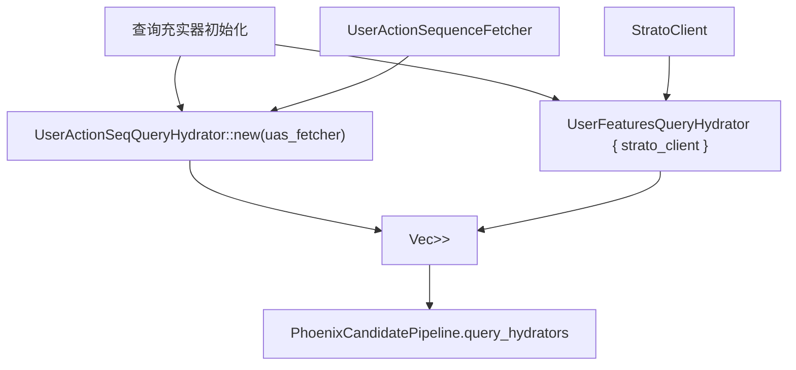
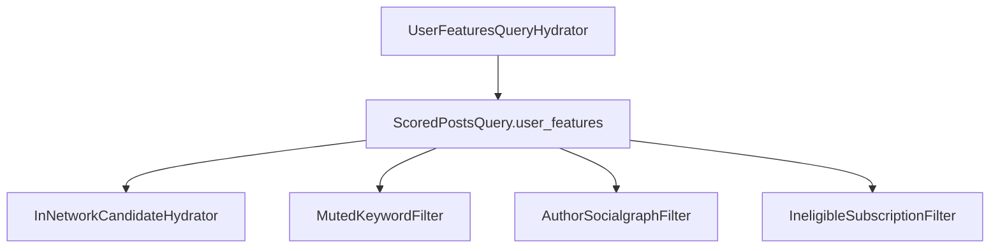
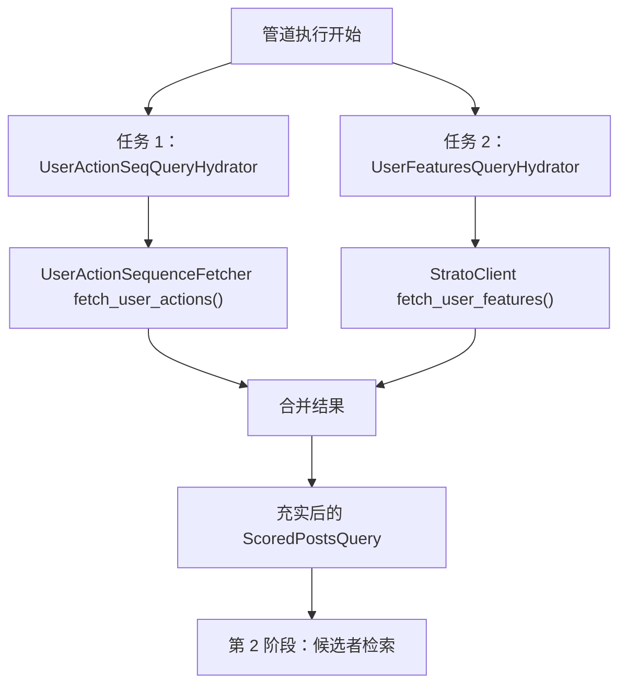
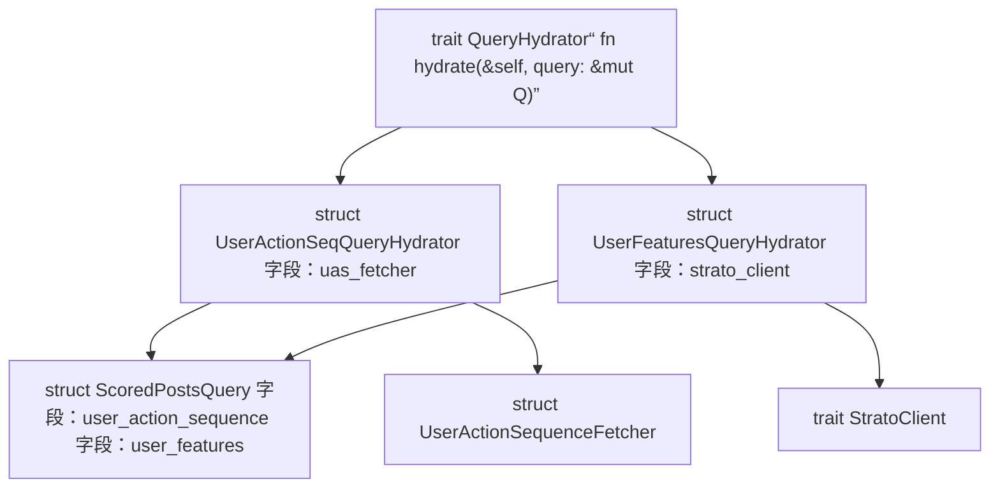

# 查询充实器

相关源文件

-   [home-mixer/candidate\_pipeline/phoenix\_candidate\_pipeline.rs](https://github.com/xai-org/x-algorithm/blob/aaa167b3/home-mixer/candidate_pipeline/phoenix_candidate_pipeline.rs)
-   [home-mixer/candidate\_pipeline/query\_features.rs](https://github.com/xai-org/x-algorithm/blob/aaa167b3/home-mixer/candidate_pipeline/query_features.rs)

## 目的与范围

本文档描述了 Phoenix 候选管道中的查询充实器实现，这些实现负责在检索候选者之前，使用用户上下文和行为数据充实 `ScoredPostsQuery` 对象。查询充实器在管道执行的第一阶段并行执行，添加用户操作序列和用户特征，以支持下游的个性化和过滤。

有关通用 `QueryHydrator` Trait 及其执行模型的信息，请参见 [QueryHydrator Trait](/xai-org/x-algorithm/3.2-queryhydrator-trait)。有关正在被充实的 `ScoredPostsQuery` 结构的信息，请参见 [ScoredPostsQuery](/xai-org/x-algorithm/4.2.1-scoredpostsquery)。

---

## 概览

Phoenix 候选管道注册了两个查询充实器，它们使用来自外部服务的用户特定数据来充实传入的查询：

1.  **UserActionSeqQueryHydrator**：从用户操作序列服务中获取用户的近期互动历史（喜爱、回复、转推）。
2.  **UserFeaturesQueryHydrator**：从 Strato 获取用户社交图谱数据和偏好，包括屏蔽关键词、拉黑用户和关注账号。

这些充实器在管道接收到请求后立即并行执行，确保后续所有阶段（数据源、候选者充实器、过滤器、评分器）都能访问充实后的查询上下文。

### 查询充实器注册

**来源：** [home-mixer/candidate\_pipeline/phoenix\_candidate\_pipeline.rs84-89](https://github.com/xai-org/x-algorithm/blob/aaa167b3/home-mixer/candidate_pipeline/phoenix_candidate_pipeline.rs#L84-L89)

---

## UserActionSeqQueryHydrator

### 目的

`UserActionSeqQueryHydrator` 使用用户的近期互动历史充实查询，这为个性化提供了关键的行为上下文。该充实器从用户操作序列服务中获取一系列近期用户操作（喜爱、回复、转推等）。

### 实现细节

| 方面 | 详情 |
| --- | --- |
| **结构体** | `UserActionSeqQueryHydrator` |
| **Trait 实现** | `QueryHydrator<ScoredPostsQuery>` |
| **外部服务** | 通过 `UserActionSequenceFetcher` 访问用户操作序列服务 |
| **初始化** | `UserActionSeqQueryHydrator::new(uas_fetcher)` |
| **依赖注入** | 接收 `Arc<UserActionSequenceFetcher>` |

### 数据流

### 充实后的字段

该充实器使用以下内容填充查询：

-   **用户操作序列**：按时间顺序排列的近期用户互动列表。
-   **操作类型**：喜爱、回复、转推、个人资料查看、关注。
-   **时间戳**：每个操作发生的时间。
-   **目标 ID**：互动的推文 ID 或用户 ID。

这些数据支持了：

-   **Phoenix 检索**：利用互动历史通过协同过滤寻找相似内容。
-   **Phoenix 评分器**：将互动模式作为特征整合到 Grok transformer 中。
-   **过滤器**：排除之前已互动的内容以避免重复。

**来源：** [home-mixer/candidate\_pipeline/phoenix\_candidate\_pipeline.rs35](https://github.com/xai-org/x-algorithm/blob/aaa167b3/home-mixer/candidate_pipeline/phoenix_candidate_pipeline.rs#L35-L35) [home-mixer/candidate\_pipeline/phoenix\_candidate\_pipeline.rs85](https://github.com/xai-org/x-algorithm/blob/aaa167b3/home-mixer/candidate_pipeline/phoenix_candidate_pipeline.rs#L85-L85)

---

## UserFeaturesQueryHydrator

### 目的

`UserFeaturesQueryHydrator` 使用来自 Strato 的用户社交图谱和偏好数据充实查询。这些数据对于整个管道中的过滤和个性化至关重要。

### 实现细节

| 方面 | 详情 |
| --- | --- |
| **结构体** | `UserFeaturesQueryHydrator` |
| **Trait 实现** | `QueryHydrator<ScoredPostsQuery>` |
| **外部服务** | Strato 缓存层 |
| **字段** | `strato_client: Arc<dyn StratoClient + Send + Sync>` |
| **初始化** | 带有注入的 `strato_client` 的结构体字面量 |

### 数据流

> **[Mermaid sequence]**
> *(图表结构无法解析)*

### UserFeatures 结构

该充实器使用以下字段填充 `UserFeatures` 结构体：

| 字段 | 类型 | 目的 |
| --- | --- | --- |
| `muted_keywords` | `Vec<String>` | 用户已屏蔽的关键词；由 `MutedKeywordFilter` 使用 |
| `blocked_user_ids` | `Vec<i64>` | 查看者已拉黑的用户 ID；由 `AuthorSocialgraphFilter` 使用 |
| `muted_user_ids` | `Vec<i64>` | 查看者已屏蔽的用户 ID；由 `AuthorSocialgraphFilter` 使用 |
| `followed_user_ids` | `Vec<i64>` | 查看者关注的用户 ID；用于网内内容检测 |
| `subscribed_user_ids` | `Vec<i64>` | 查看者订阅的用户 ID；用于付费内容处理 |

### 与管道阶段的集成

**来源：** [home-mixer/candidate\_pipeline/phoenix\_candidate\_pipeline.rs36](https://github.com/xai-org/x-algorithm/blob/aaa167b3/home-mixer/candidate_pipeline/phoenix_candidate_pipeline.rs#L36-L36) [home-mixer/candidate\_pipeline/phoenix\_candidate\_pipeline.rs86-88](https://github.com/xai-org/x-algorithm/blob/aaa167b3/home-mixer/candidate_pipeline/phoenix_candidate_pipeline.rs#L86-L88) [home-mixer/candidate\_pipeline/query\_features.rs1-11](https://github.com/xai-org/x-algorithm/blob/aaa167b3/home-mixer/candidate_pipeline/query_features.rs#L1-L11)

---

## 执行模型

### 并行充实

根据 `QueryHydrator` Trait 的执行契约，两个查询充实器并行执行。管道框架使用异步任务编排并行执行，允许两个外部服务调用并发进行。

### 性能特性

| 特性 | 详情 |
| --- | --- |
| **执行模式** | 并行（并发外部服务调用） |
| **阻塞行为** | 管道会阻塞，直到所有查询充实器完成 |
| **失败处理** | 单个充实器的失败会作为错误传播 |
| **典型延迟** | 合计约 10-50ms（取决于服务响应时间） |
| **缓存** | Strato 为 `UserFeatures` 数据提供缓存 |

### 代码实体映射

**来源：** [home-mixer/candidate\_pipeline/phoenix\_candidate\_pipeline.rs84-89](https://github.com/xai-org/x-algorithm/blob/aaa167b3/home-mixer/candidate_pipeline/phoenix_candidate_pipeline.rs#L84-L89)

---

## 总结

Phoenix 候选管道采用了两个专门的查询充实器，它们并行执行以使用用户上下文充实传入的请求：

-   **UserActionSeqQueryHydrator**：从用户操作序列服务中获取互动历史，从而支持行为个性化。
-   **UserFeaturesQueryHydrator**：从 Strato 获取社交图谱数据，从而支持基于用户偏好的内容过滤。

这些充实器确保了下游所有管道阶段都能访问全面的用户上下文，从而实现了个性化的候选者检索、对不合规内容的准确过滤以及基于相关性的评分。它们的并行执行最大限度地降低了关键的查询充实阶段中外部服务调用带来的延迟影响。

**来源：** [home-mixer/candidate\_pipeline/phoenix\_candidate\_pipeline.rs35-36](https://github.com/xai-org/x-algorithm/blob/aaa167b3/home-mixer/candidate_pipeline/phoenix_candidate_pipeline.rs#L35-L36) [home-mixer/candidate\_pipeline/phoenix\_candidate\_pipeline.rs84-89](https://github.com/xai-org/x-algorithm/blob/aaa167b3/home-mixer/candidate_pipeline/phoenix_candidate_pipeline.rs#L84-L89) [home-mixer/candidate\_pipeline/query\_features.rs1-11](https://github.com/xai-org/x-algorithm/blob/aaa167b3/home-mixer/candidate_pipeline/query_features.rs#L1-L11)
