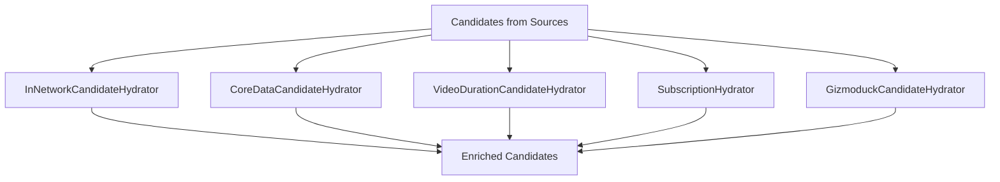
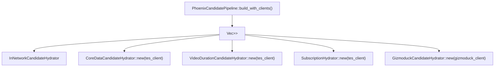
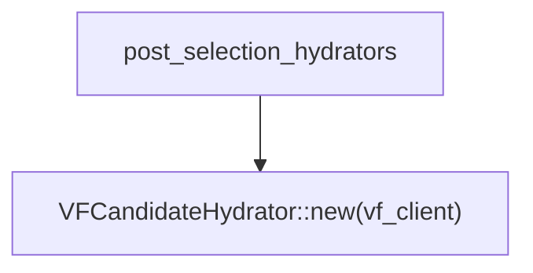
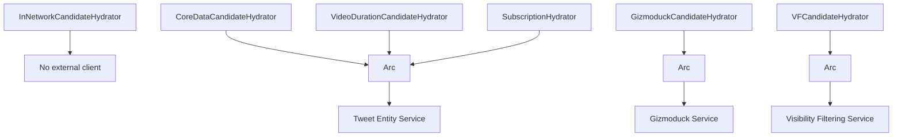
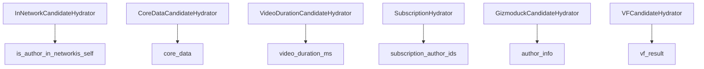

# 候选者充实器

相关源文件

-   [home-mixer/candidate\_hydrators/mod.rs](https://github.com/xai-org/x-algorithm/blob/aaa167b3/home-mixer/candidate_hydrators/mod.rs)
-   [home-mixer/candidate\_pipeline/phoenix\_candidate\_pipeline.rs](https://github.com/xai-org/x-algorithm/blob/aaa167b3/home-mixer/candidate_pipeline/phoenix_candidate_pipeline.rs)

## 目的与范围

本文档概述了 主混频器 中的候选者充实器实现，这些实现通过来自外部服务的数据来充实 `PostCandidate` 对象。充实器在从源检索候选者之后、进行过滤和评分之前并行执行。

有关通用 `Hydrator` Trait 及其执行模型的详细信息，请参阅 [Hydrator Trait](/xai-org/x-algorithm/3.4-hydrator-trait)。有关充实查询对象而非候选者的查询充实器的信息，请参阅 [查询充实器](/xai-org/x-algorithm/4.4-query-hydrators)。有关每个特定充实器实现的详细文档，请参阅 [4.5.1](/xai-org/x-algorithm/4.5.1-coredatacandidatehydrator) 至 [4.5.6](/xai-org/x-algorithm/4.5.6-videodurationcandidatehydrator) 章节。

## 概览

候选者充实器使用下游过滤和评分所需的元数据、用户信息、可见性过滤结果和其他特征来充实 `PostCandidate` 对象。每个充实器负责通过调用外部服务来获取并填充候选对象上的特定字段。

管道并行执行所有候选者充实器以最大限度地降低延迟。充实器在可能的情况下批量处理请求，以减少远程调用的次数。一些充实器（例如 `VFCandidateHydrator`）也用于选择后阶段，在 Top-K 选择后执行最终的充实工作。

**充实器执行模式：**

来源：[home-mixer/candidate\_pipeline/phoenix\_candidate\_pipeline.rs99-106](https://github.com/xai-org/x-algorithm/blob/aaa167b3/home-mixer/candidate_pipeline/phoenix_candidate_pipeline.rs#L99-L106)

## 充实器实现

主混频器 实现了六个候选者充实器，组织在 `candidate_hydrators` 模块中：

| 充实器 | 填充的字段 | 外部服务 | 批处理 |
| --- | --- | --- | --- |
| `InNetworkCandidateHydrator` | `is_author_in_network`, `is_self` | 无 (使用查询数据) | 不适用 |
| `CoreDataCandidateHydrator` | `core_data` (推文文本、作者 ID、回复/转推信息) | TES | 是 |
| `VideoDurationCandidateHydrator` | `video_duration_ms` | TES | 是 |
| `SubscriptionHydrator` | `subscription_author_ids` | TES | 是 |
| `GizmoduckCandidateHydrator` | `author_info` (显示名称、关注者计数) | Gizmoduck | 是 |
| `VFCandidateHydrator` | `vf_result` (可见性过滤原因) | Visibility Filtering | 是 |

### 充实器模块结构

```mermaid
flowchart TD
    Mod["candidate_hydrators/mod.rs"]
    CoreData["core_data_candidate_hydrator.rsCoreDataCandidateHydrator"]
    Gizmoduck["gizmoduck_hydrator.rsGizmoduckCandidateHydrator"]
    InNetwork["in_network_candidate_hydrator.rsInNetworkCandidateHydrator"]
    Subscription["subscription_hydrator.rsSubscriptionHydrator"]
    VF["vf_candidate_hydrator.rsVFCandidateHydrator"]
    Video["video_duration_candidate_hydrator.rsVideoDurationCandidateHydrator"]

    Mod --> CoreData
    Mod --> Gizmoduck
    Mod --> InNetwork
    Mod --> Subscription
    Mod --> VF
    Mod --> Video
```

来源：[home-mixer/candidate\_hydrators/mod.rs1-7](https://github.com/xai-org/x-algorithm/blob/aaa167b3/home-mixer/candidate_hydrators/mod.rs#L1-L7)

### 简要说明

**`InNetworkCandidateHydrator`**：确定候选者的作者是查看用户本人还是被查看用户关注。不调用外部服务；使用查询的 `followed_user_ids` 字段中的数据。参见 [InNetworkCandidateHydrator](/xai-org/x-algorithm/4.5.3-innetworkcandidatehydrator)。

**`CoreDataCandidateHydrator`**：从 TES (Tweet Entity Service) 获取核心推文元数据，包括推文文本、作者 ID、创建时间戳、回复信息 (in\_reply\_to\_tweet\_id, in\_reply\_to\_user\_id) 和转推信息 (retweeted\_tweet\_id)。这是最关键的充实器之一，因为许多过滤器都依赖于核心数据。参见 [CoreDataCandidateHydrator](/xai-org/x-algorithm/4.5.1-coredatacandidatehydrator)。

**`VideoDurationCandidateHydrator`**：当推文包含视频内容时，从 TES 媒体实体中提取以毫秒为单位的视频时长。用于排名特征和过滤。参见 [VideoDurationCandidateHydrator](/xai-org/x-algorithm/4.5.6-videodurationcandidatehydrator)。

**`SubscriptionHydrator`**：从 TES 获取订阅作者 ID 列表，用于识别高级内容。由 `IneligibleSubscriptionFilter` 用于过滤掉非订阅者的订阅内容。参见 [SubscriptionHydrator](/xai-org/x-algorithm/4.5.4-subscriptionhydrator)。

**`GizmoduckCandidateHydrator`**：从 Gizmoduck 服务获取用户信息，包括候选作者的显示名称和关注者计数。高效地批量处理请求。参见 [GizmoduckHydrator](/xai-org/x-algorithm/4.5.2-gizmoduckhydrator)。

**`VFCandidateHydrator`**：调用可见性过滤 (Visibility Filtering) 服务，以确定出于安全原因是否应过滤候选者。对网内 (In-network) 内容 (`TimelineHome`) 与网外 (Out-of-network) 内容 (`TimelineHomeRecommendations`) 使用不同的安全级别。也用于选择后阶段。参见 [VFCandidateHydrator](/xai-org/x-algorithm/4.5.5-vfcandidatehydrator)。

来源：[home-mixer/candidate\_pipeline/phoenix\_candidate\_pipeline.rs99-106](https://github.com/xai-org/x-algorithm/blob/aaa167b3/home-mixer/candidate_pipeline/phoenix_candidate_pipeline.rs#L99-L106) [home-mixer/candidate\_pipeline/phoenix\_candidate\_pipeline.rs138-139](https://github.com/xai-org/x-algorithm/blob/aaa167b3/home-mixer/candidate_pipeline/phoenix_candidate_pipeline.rs#L138-L139)

## 管道集成

充实器在初始化期间通过 `build_with_clients` 方法注册到 `PhoenixCandidatePipeline`。管道维护两个单独的列表：

1.  **主充实器**：在源检索之后、过滤/评分之前执行。
2.  **选择后充实器**：在 Top-K 选择之后执行。

### 主充实器注册

来源：[home-mixer/candidate\_pipeline/phoenix\_candidate\_pipeline.rs99-106](https://github.com/xai-org/x-algorithm/blob/aaa167b3/home-mixer/candidate_pipeline/phoenix_candidate_pipeline.rs#L99-L106)

### 选择后充实器注册

`VFCandidateHydrator` 被单独注册为选择后充实器。这允许在开销较大的 ML 评分阶段之后进行可见性过滤，从而减少需要检查安全违规的候选者数量。

来源：[home-mixer/candidate\_pipeline/phoenix\_candidate\_pipeline.rs138-139](https://github.com/xai-org/x-algorithm/blob/aaa167b3/home-mixer/candidate_pipeline/phoenix_candidate_pipeline.rs#L138-L139)

## 执行模型

候选管道框架使用 `futures::future::join_all` 并行执行主充实器列表中的所有充实器。这种并行执行模式对于在需要多次外部服务调用时最小化总延迟至关重要。

**并行充实序列：**

> **[Mermaid sequence]**
> *(图表结构无法解析)*

有关并行执行机制的详细信息，请参阅 [Hydrator Trait](/xai-org/x-algorithm/3.4-hydrator-trait)。

来源：[home-mixer/candidate\_pipeline/phoenix\_candidate\_pipeline.rs224-226](https://github.com/xai-org/x-algorithm/blob/aaa167b3/home-mixer/candidate_pipeline/phoenix_candidate_pipeline.rs#L224-L226)

## 依赖要求

每个充实器在初始化期间都需要提供特定的外部服务客户端。`PhoenixCandidatePipeline` 创建生产环境客户端并将其注入到充实器中。

**充实器依赖项：**

来源：[home-mixer/candidate\_pipeline/phoenix\_candidate\_pipeline.rs73-82](https://github.com/xai-org/x-algorithm/blob/aaa167b3/home-mixer/candidate_pipeline/phoenix_candidate_pipeline.rs#L73-L82) [home-mixer/candidate\_pipeline/phoenix\_candidate\_pipeline.rs99-106](https://github.com/xai-org/x-algorithm/blob/aaa167b3/home-mixer/candidate_pipeline/phoenix_candidate_pipeline.rs#L99-L106) [home-mixer/candidate\_pipeline/phoenix\_candidate\_pipeline.rs138-139](https://github.com/xai-org/x-algorithm/blob/aaa167b3/home-mixer/candidate_pipeline/phoenix_candidate_pipeline.rs#L138-L139)

### 生产环境中的客户端初始化

`PhoenixCandidatePipeline::prod()` 方法创建生产环境客户端实例并将其传递给 `build_with_clients`：

| 客户端变量 | 生产环境实现 | 供哪些充实器使用 |
| --- | --- | --- |
| `tes_client` | `Arc<ProdTESClient>` | `CoreDataCandidateHydrator`, `VideoDurationCandidateHydrator`, `SubscriptionHydrator` |
| `gizmoduck_client` | `Arc<ProdGizmoduckClient>` | `GizmoduckCandidateHydrator` |
| `vf_client` | `Arc<ProdVisibilityFilteringClient>` | `VFCandidateHydrator` |

来源：[home-mixer/candidate\_pipeline/phoenix\_candidate\_pipeline.rs162-212](https://github.com/xai-org/x-algorithm/blob/aaa167b3/home-mixer/candidate_pipeline/phoenix_candidate_pipeline.rs#L162-L212)

## 字段所有权与更新

每个充实器拥有 `PostCandidate` 结构体上的特定字段。充实器通过改变候选者向量来就地更新候选者。并行执行模型是安全的，因为每个充实器写入不同的字段。

**按充实器划分的字段所有权：**

有关 `PostCandidate` 数据结构的详细信息，请参阅 [PostCandidate](/xai-org/x-algorithm/4.2.2-postcandidate)。

来源：[home-mixer/candidate\_pipeline/phoenix\_candidate\_pipeline.rs1-6](https://github.com/xai-org/x-algorithm/blob/aaa167b3/home-mixer/candidate_pipeline/phoenix_candidate_pipeline.rs#L1-L6)

## 总结

主混频器 中的候选者充实器系统提供了一种模块化的并行机制，用于通过多个外部服务的数据来充实候选者。六个充实器各自具有明确定义的职责和字段所有权，从而实现了高效的并行执行而不会发生数据竞争。两阶段充实模型（评分前和选择后）通过将诸如可见性过滤之类的昂贵操作推迟到 Top-K 选择之后，优化了数据完整性与延迟之间的权衡。

有关每个充实器的实现细节，请参阅子页面 [4.5.1](/xai-org/x-algorithm/4.5.1-coredatacandidatehydrator) 至 [4.5.6](/xai-org/x-algorithm/4.5.6-videodurationcandidatehydrator)。

来源：[home-mixer/candidate\_hydrators/mod.rs1-7](https://github.com/xai-org/x-algorithm/blob/aaa167b3/home-mixer/candidate_hydrators/mod.rs#L1-L7) [home-mixer/candidate\_pipeline/phoenix\_candidate\_pipeline.rs1-256](https://github.com/xai-org/x-algorithm/blob/aaa167b3/home-mixer/candidate_pipeline/phoenix_candidate_pipeline.rs#L1-L256)
