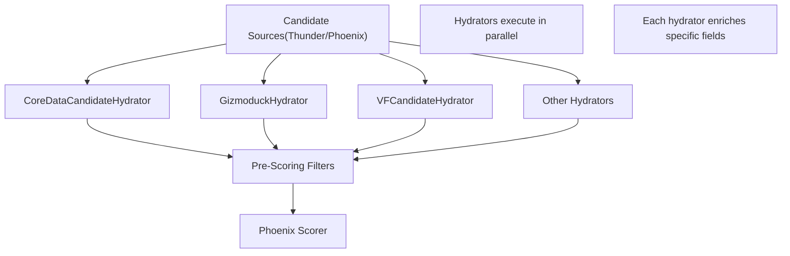
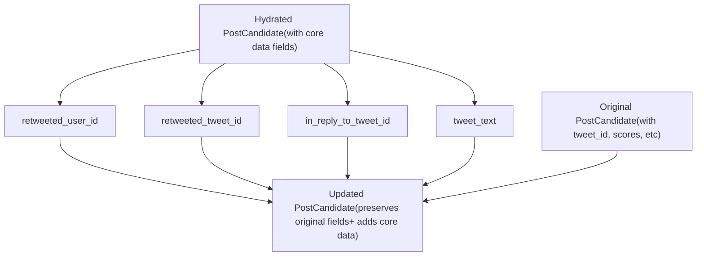
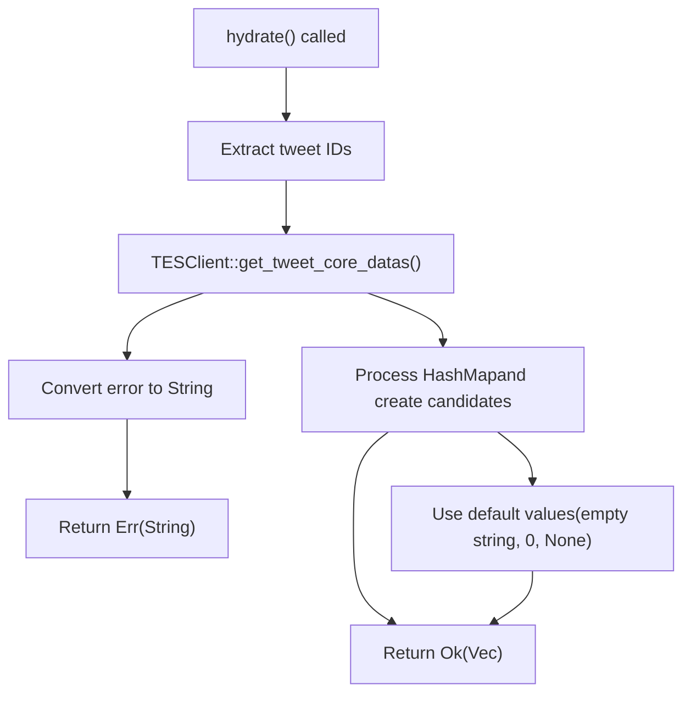
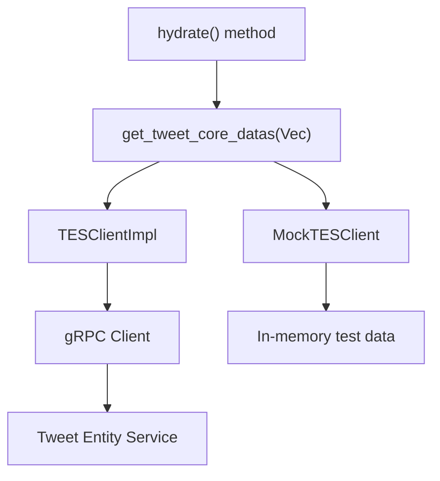

# 核心数据候选者充实器 (CoreDataCandidateHydrator)

相关源文件

-   [home-mixer/candidate\_hydrators/core\_data\_candidate\_hydrator.rs](https://github.com/xai-org/x-algorithm/blob/aaa167b3/home-mixer/candidate_hydrators/core_data_candidate_hydrator.rs)

## 目的与范围

`CoreDataCandidateHydrator` 负责使用从推文实体服务 (Tweet Entity Service, TES) 检索到的基本推文元数据来充实 `PostCandidate` 对象。该充实器提供了下游管道阶段所需的基础数据，包括推文文本、作者信息、转推关系和回复上下文。

本文档涵盖了核心数据充实器的实现、数据流和字段映射。有关其他候选者充实器的信息，请参阅 [候选者充实器](/xai-org/x-algorithm/4.5-candidate-hydrators)。有关推文实体服务客户端集成的详细信息，请参阅 [推文实体服务 (TES)](/xai-org/x-algorithm/5.2-tweet-entity-service-(tes))。有关通用充实器 Trait 规范，请参阅 [Hydrator Trait](/xai-org/x-algorithm/3.4-hydrator-trait)。

**来源：** [home-mixer/candidate\_hydrators/core\_data\_candidate\_hydrator.rs1-59](https://github.com/xai-org/x-algorithm/blob/aaa167b3/home-mixer/candidate_hydrators/core_data_candidate_hydrator.rs#L1-L59)

## 在管道架构中的位置

`CoreDataCandidateHydrator` 在管道的候选者充实阶段执行，即在从源（Thunder 或 Phoenix）检索到候选者之后，但在过滤和评分操作之前。


**标题：** 管道执行中的 CoreDataCandidateHydrator 位置

该充实器与 `GizmoduckHydrator`、`VFCandidateHydrator` 和 `VideoDurationCandidateHydrator` 等其他候选者充实器并行运行。这种并行执行通过重叠多个外部服务调用来优化延迟。

**来源：** [home-mixer/candidate\_hydrators/core\_data\_candidate\_hydrator.rs1-59](https://github.com/xai-org/x-algorithm/blob/aaa167b3/home-mixer/candidate_hydrators/core_data_candidate_hydrator.rs#L1-L59)

## 实现结构

### 结构体定义


**标题：** CoreDataCandidateHydrator 类结构与依赖关系

`CoreDataCandidateHydrator` 结构体包含一个字段：一个包装在 `Arc` 中的、实现了 `TESClient` 的 Trait 对象。这种设计支持依赖注入，并便于使用模拟 (mock) 实现进行测试。

**来源：** [home-mixer/candidate\_hydrators/core\_data\_candidate\_hydrator.rs8-16](https://github.com/xai-org/x-algorithm/blob/aaa167b3/home-mixer/candidate_hydrators/core_data_candidate_hydrator.rs#L8-L16)

### 构造函数

该充实器使用异步 `new()` 方法构造：

| 方法 | 参数 | 返回类型 | 目的 |
| --- | --- | --- | --- |
| `new()` | `tes_client: Arc<dyn TESClient + Send + Sync>` | `Self` | 使用 TES 客户端依赖项初始化充实器 |

构造函数被标记为 `async` 以支持未来可能的初始化逻辑，尽管目前的实现是同步的。

**来源：** [home-mixer/candidate\_hydrators/core\_data\_candidate\_hydrator.rs12-16](https://github.com/xai-org/x-algorithm/blob/aaa167b3/home-mixer/candidate_hydrators/core_data_candidate_hydrator.rs#L12-L16)

## 数据流与充实过程

### Hydrate 方法执行流程

> **[Mermaid sequence]**
> *(图表结构无法解析)*

**标题：** CoreDataCandidateHydrator 执行序列

充实过程遵循以下步骤：

1.  **提取推文 ID**：从输入候选者中收集所有 `tweet_id` 值。
2.  **批量 TES 请求**：使用完整的 ID 集调用 `get_tweet_core_datas()`。
3.  **处理响应**：对于每个推文 ID，查找核心数据并构造充实后的候选者。
4.  **返回结果**：以与输入相同的顺序返回充实后的候选者向量。

**来源：** [home-mixer/candidate\_hydrators/core\_data\_candidate\_hydrator.rs21-50](https://github.com/xai-org/x-algorithm/blob/aaa167b3/home-mixer/candidate_hydrators/core_data_candidate_hydrator.rs#L21-L50)

### 字段映射

下表描述了 TES `CoreData` 字段如何映射到 `PostCandidate` 字段：

| TES CoreData 字段 | PostCandidate 字段 | 类型 | 回退行为 |
| --- | --- | --- | --- |
| `author_id` | `author_id` | `i64` | 如果缺失，默认为 `0` |
| `text` | `tweet_text` | `String` | 如果缺失，默认为空字符串 |
| `source_user_id` | `retweeted_user_id` | `Option<i64>` | 如果不是转推，则为 `None` |
| `source_tweet_id` | `retweeted_tweet_id` | `Option<i64>` | 如果不是转推，则为 `None` |
| `in_reply_to_tweet_id` | `in_reply_to_tweet_id` | `Option<i64>` | 如果不是回复，则为 `None` |

映射逻辑实现在 [第 38-45 行](https://github.com/xai-org/x-algorithm/blob/aaa167b3/lines 38-45)：

```
author_id: core_data.map(|x| x.author_id).unwrap_or_default()
retweeted_user_id: core_data.and_then(|x| x.source_user_id)
retweeted_tweet_id: core_data.and_then(|x| x.source_tweet_id)
in_reply_to_tweet_id: core_data.and_then(|x| x.in_reply_to_tweet_id)
tweet_text: text.unwrap_or_default()
```
**来源：** [home-mixer/candidate\_hydrators/core\_data\_candidate\_hydrator.rs34-46](https://github.com/xai-org/x-algorithm/blob/aaa167b3/home-mixer/candidate_hydrators/core_data_candidate_hydrator.rs#L34-L46)

## Update 方法

`update()` 方法定义了应将充实后候选者的哪些字段复制到原始候选者：


**标题：** CoreDataCandidateHydrator 中的字段更新策略

`update` 方法 [第 52-57 行](https://github.com/xai-org/x-algorithm/blob/aaa167b3/lines 52-57) 选择性地仅复制核心数据字段：

-   `retweeted_user_id`
-   `retweeted_tweet_id`
-   `in_reply_to_tweet_id`
-   `tweet_text`

请注意，`author_id` **不会**通过 `update()` 方法更新。该字段在 `hydrate()` 中创建充实后的候选者期间设置，但不会通过 `update()` 传播。这种设计选择确保了如果 `author_id` 已经由早期阶段填充，它不会被覆盖。

**来源：** [home-mixer/candidate\_hydrators/core\_data\_candidate\_hydrator.rs52-57](https://github.com/xai-org/x-algorithm/blob/aaa167b3/home-mixer/candidate_hydrators/core_data_candidate_hydrator.rs#L52-L57)

## 错误处理

该充实器采用了快速失败 (fail-fast) 的错误处理策略：


**标题：** CoreDataCandidateHydrator 错误处理流程

关键错误处理行为：

1.  **TES 客户端错误**：如果 TES 客户端调用失败，错误将被转换为字符串并沿管道向上传播，导致整个充实失败。
2.  **缺失推文数据**：如果在响应 `HashMap` 中找不到特定推文的数据，充实器将使用默认值而不是报错。
3.  **优雅的字段默认值**：缺失的可选字段结果为 `None`，而必填字段使用类型默认值（`author_id` 为 `0`，`tweet_text` 为空字符串）。

这种方法确保了瞬时的 TES 服务故障会提前中止管道，而单个推文的缺失则会优雅地降级。

**来源：** [home-mixer/candidate\_hydrators/core\_data\_candidate\_hydrator.rs30-46](https://github.com/xai-org/x-algorithm/blob/aaa167b3/home-mixer/candidate_hydrators/core_data_candidate_hydrator.rs#L30-L46)

## 集成点

### TESClient 接口


**标题：** TESClient 抽象与实现变体

`TESClient` Trait 提供了如下抽象边界：

1.  **支持测试**：模拟 (mock) 实现可以提供确定性的测试数据，而无需运行 TES 实例。
2.  **服务解耦**：TES 传输格式或传输层的更改不会影响充实器逻辑。
3.  **支持批处理**：`get_tweet_core_datas()` 方法接受多个 ID，从而实现高效的批量检索。

**来源：** [home-mixer/candidate\_hydrators/core\_data\_candidate\_hydrator.rs9-10](https://github.com/xai-org/x-algorithm/blob/aaa167b3/home-mixer/candidate_hydrators/core_data_candidate_hydrator.rs#L9-L10)

## 可观测性

该充实器的 `hydrate()` 方法配备了 `#[xai_stats_macro::receive_stats]` 属性。此宏自动发送指标，包括：

-   请求计数
-   延迟分布
-   错误率
-   成功率

这些指标的作用域为 `CoreDataCandidateHydrator::hydrate`，并支持对以下内容的监控：

-   TES 服务健康状况和延迟
-   批次大小分布
-   数据可用率（推文在 TES 中被找到的频率）

**来源：** [home-mixer/candidate\_hydrators/core\_data\_candidate\_hydrator.rs20](https://github.com/xai-org/x-algorithm/blob/aaa167b3/home-mixer/candidate_hydrators/core_data_candidate_hydrator.rs#L20-L20)

## 使用示例

该充实器在初始化期间于 `PhoenixCandidatePipeline` 中实例化，并注册为候选者充实阶段的一部分。管道框架自动编排其执行：

| 管道阶段 | 执行模式 | 位置 |
| --- | --- | --- |
| 候选者充实 | 与其他充实器并行 | 在源之后，过滤器之前 |

框架使用当前查询和所有候选者调用 `hydrate()`，然后应用 `update()` 方法将结果合并到原始候选者中。

**来源：** [home-mixer/candidate\_hydrators/core\_data\_candidate\_hydrator.rs1-59](https://github.com/xai-org/x-algorithm/blob/aaa167b3/home-mixer/candidate_hydrators/core_data_candidate_hydrator.rs#L1-L59)
