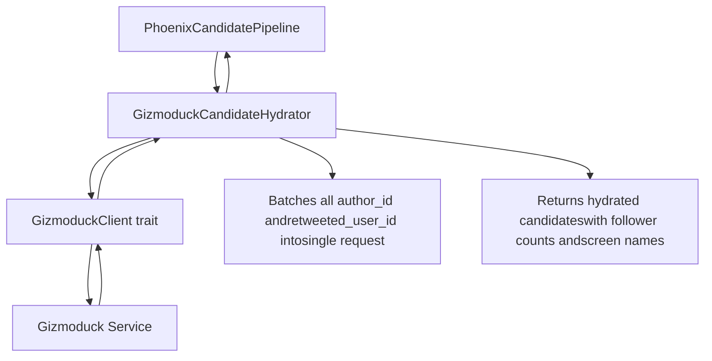
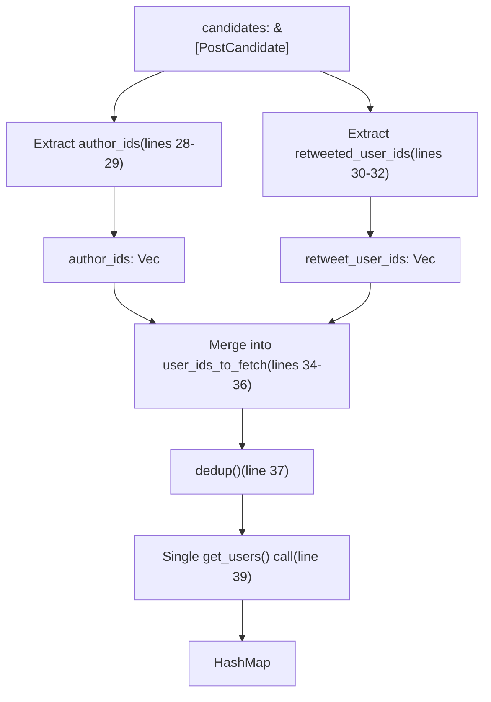
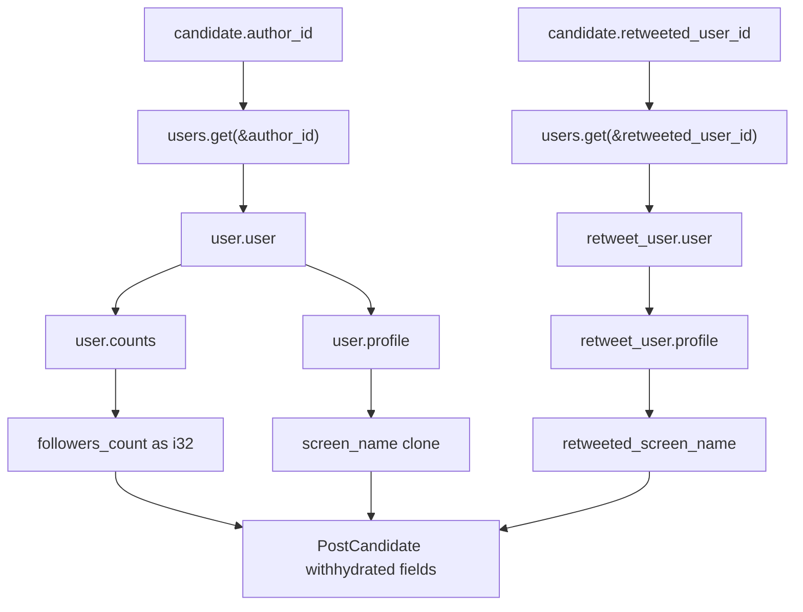
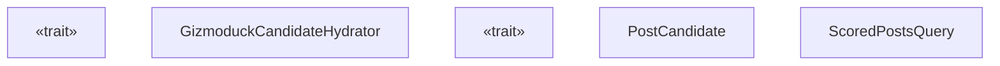

# GizmoduckHydrator

相关源文件

-   [home-mixer/candidate\_hydrators/gizmoduck\_hydrator.rs](https://github.com/xai-org/x-algorithm/blob/aaa167b3/home-mixer/candidate_hydrators/gizmoduck_hydrator.rs)

## 目的与范围

`GizmoduckCandidateHydrator` 通过从 Gizmoduck 服务获取数据，使用用户个人资料信息来充实 `PostCandidate` 对象。该充实器通过批量查询来填充作者关注者计数、作者显示名称以及被转推用户的显示名称，从而最大限度地减少网络开销。有关充实器 Trait 模式的通用信息，请参阅 [Hydrator Trait](/xai-org/x-algorithm/3.4-hydrator-trait)。有关 Gizmoduck 服务集成的详细信息，请参阅 [Gizmoduck 服务](/xai-org/x-algorithm/5.3-gizmoduck-service)。有关其他候选者充实器，请参阅 [候选者充实器](/xai-org/x-algorithm/4.5-candidate-hydrators)。

**来源：** [home-mixer/candidate\_hydrators/gizmoduck\_hydrator.rs1-82](https://github.com/xai-org/x-algorithm/blob/aaa167b3/home-mixer/candidate_hydrators/gizmoduck_hydrator.rs#L1-L82)

## 概述

`GizmoduckCandidateHydrator` 实现了 `Hydrator<ScoredPostsQuery, PostCandidate>` Trait，用于获取推文作者和被转推用户的用户资料元数据。该充实器采用批量处理策略，收集候选者中所有唯一的用户 ID，向 Gizmoduck 服务执行单次批量请求，然后将返回的数据映射回各个候选者。


**来源：** [home-mixer/candidate\_hydrators/gizmoduck\_hydrator.rs8-74](https://github.com/xai-org/x-algorithm/blob/aaa167b3/home-mixer/candidate_hydrators/gizmoduck_hydrator.rs#L8-L74)

## 结构体定义

`GizmoduckCandidateHydrator` 结构体包含一个字段：

| 字段 | 类型 | 描述 |
| --- | --- | --- |
| `gizmoduck_client` | `Arc<dyn GizmoduckClient + Send + Sync>` | 用于向 Gizmoduck 服务发起批量请求的 Trait 对象 |

该结构体通过 `new()` 方法异步构造，该方法接受一个对 `GizmoduckClient` 实现的共享引用。

**来源：** [home-mixer/candidate\_hydrators/gizmoduck\_hydrator.rs8-16](https://github.com/xai-org/x-algorithm/blob/aaa167b3/home-mixer/candidate_hydrators/gizmoduck_hydrator.rs#L8-L16)

## 充实过程

充实过程遵循以下步骤：

> **[Mermaid sequence]**
> *(图表结构无法解析)*

**来源：** [home-mixer/candidate\_hydrators/gizmoduck\_hydrator.rs21-74](https://github.com/xai-org/x-algorithm/blob/aaa167b3/home-mixer/candidate_hydrators/gizmoduck_hydrator.rs#L21-L74)

## 批量处理策略

充实器实现了高效的批量处理策略，以最大限度地减少网络往返次数：

### 用户 ID 收集


实现细节：

1.  从候选者中收集所有 `author_id` 值 [home-mixer/candidate\_hydrators/gizmoduck\_hydrator.rs28-29](https://github.com/xai-org/x-algorithm/blob/aaa167b3/home-mixer/candidate_hydrators/gizmoduck_hydrator.rs#L28-L29)。
2.  收集所有 `retweeted_user_id` 值（扁平化 `Option<u64>`） [home-mixer/candidate\_hydrators/gizmoduck\_hydrator.rs30-32](https://github.com/xai-org/x-algorithm/blob/aaa167b3/home-mixer/candidate_hydrators/gizmoduck_hydrator.rs#L30-L32)。
3.  将这两个集合合并为一个向量 [home-mixer/candidate\_hydrators/gizmoduck\_hydrator.rs34-36](https://github.com/xai-org/x-algorithm/blob/aaa167b3/home-mixer/candidate_hydrators/gizmoduck_hydrator.rs#L34-L36)。
4.  对 ID 进行去重以避免重复获取 [home-mixer/candidate\_hydrators/gizmoduck\_hydrator.rs37](https://github.com/xai-org/x-algorithm/blob/aaa167b3/home-mixer/candidate_hydrators/gizmoduck_hydrator.rs#L37-L37)。
5.  进行单次批量 `get_users()` 调用 [home-mixer/candidate\_hydrators/gizmoduck\_hydrator.rs39](https://github.com/xai-org/x-algorithm/blob/aaa167b3/home-mixer/candidate_hydrators/gizmoduck_hydrator.rs#L39-L39)。

**来源：** [home-mixer/candidate\_hydrators/gizmoduck\_hydrator.rs28-40](https://github.com/xai-org/x-algorithm/blob/aaa167b3/home-mixer/candidate_hydrators/gizmoduck_hydrator.rs#L28-L40)

## 数据提取与映射

在收到批量用户数据后，充实器会为每个候选者提取特定字段：

### 充实后的字段

| 字段 | 来源路径 | 类型 | 描述 |
| --- | --- | --- | --- |
| `author_followers_count` | `user.user.counts.followers_count` | `Option<i32>` | 作者拥有的关注者数量 |
| `author_screen_name` | `user.user.profile.screen_name` | `Option<String>` | 作者的显示账号（例如 "@username"） |
| `retweeted_screen_name` | `retweet_user.user.profile.screen_name` | `Option<String>` | 被转推用户的显示名称 |

### 提取逻辑


提取过程使用链式 `and_then()` 操作来安全地访问嵌套的 `Option` 类型，确保缺失数据不会导致故障 [home-mixer/candidate\_hydrators/gizmoduck\_hydrator.rs45-62](https://github.com/xai-org/x-algorithm/blob/aaa167b3/home-mixer/candidate_hydrators/gizmoduck_hydrator.rs#L45-L62)。

**来源：** [home-mixer/candidate\_hydrators/gizmoduck\_hydrator.rs44-71](https://github.com/xai-org/x-algorithm/blob/aaa167b3/home-mixer/candidate_hydrators/gizmoduck_hydrator.rs#L44-L71)

## Update 方法

`update()` 方法实现了 `Hydrator` Trait 所需的字段级合并策略：

```
fn update(&self, candidate: &mut PostCandidate, hydrated: PostCandidate)
```
此方法更新原始候选者上的三个特定字段：

-   `candidate.author_followers_count` [home-mixer/candidate\_hydrators/gizmoduck\_hydrator.rs77](https://github.com/xai-org/x-algorithm/blob/aaa167b3/home-mixer/candidate_hydrators/gizmoduck_hydrator.rs#L77-L77)
-   `candidate.author_screen_name` [home-mixer/candidate\_hydrators/gizmoduck\_hydrator.rs78](https://github.com/xai-org/x-algorithm/blob/aaa167b3/home-mixer/candidate_hydrators/gizmoduck_hydrator.rs#L78-L78)
-   `candidate.retweeted_screen_name` [home-mixer/candidate\_hydrators/gizmoduck\_hydrator.rs79](https://github.com/xai-org/x-algorithm/blob/aaa167b3/home-mixer/candidate_hydrators/gizmoduck_hydrator.rs#L79-L79)

该模式遵循标准的充实器设计，其中 `hydrate()` 方法返回仅填充了相关字段（其他字段使用 `..Default::default()`）的新 `PostCandidate` 实例，而 `update()` 方法选择性地将这些字段复制到原始候选者。

**来源：** [home-mixer/candidate\_hydrators/gizmoduck\_hydrator.rs76-81](https://github.com/xai-org/x-algorithm/blob/aaa167b3/home-mixer/candidate_hydrators/gizmoduck_hydrator.rs#L76-L81)

## 集成点

### 代码实体关系


### 管道集成

`GizmoduckCandidateHydrator` 在 `PhoenixCandidatePipeline` 中实例化并注册为候选者充实器之一。在管道执行期间，它在充实阶段与其他充实器并行运行，该阶段位于候选者检索之后，但在过滤和评分之前。

**来源：** [home-mixer/candidate\_hydrators/gizmoduck\_hydrator.rs1-81](https://github.com/xai-org/x-algorithm/blob/aaa167b3/home-mixer/candidate_hydrators/gizmoduck_hydrator.rs#L1-L81)

## 错误处理

该充实器传播来自 `GizmoduckClient` 的错误：

| 错误场景 | 处理方式 |
| --- | --- |
| `get_users()` 失败 | 通过 `map_err(|e| e.to_string())` 返回 `Err(String)` [home-mixer/candidate\_hydrators/gizmoduck\_hydrator.rs40](https://github.com/xai-org/x-algorithm/blob/aaa167b3/home-mixer/candidate_hydrators/gizmoduck_hydrator.rs#L40-L40) |
| 缺失用户数据 | 视为 `None` - 字段保持为 `None` [home-mixer/candidate\_hydrators/gizmoduck\_hydrator.rs45-62](https://github.com/xai-org/x-algorithm/blob/aaa167b3/home-mixer/candidate_hydrators/gizmoduck_hydrator.rs#L45-L62) |
| 嵌套字段缺失 | 使用 `and_then()` 链式调用安全地解包嵌套的 `Option` 类型 |

如果 `get_users()` 调用失败，整个充实过程将失败并将错误传播到管道上游。但是，如果调用成功但响应中缺少特定用户，则受影响字段的候选者只需保留 `None` 值。

**来源：** [home-mixer/candidate\_hydrators/gizmoduck\_hydrator.rs39-62](https://github.com/xai-org/x-algorithm/blob/aaa167b3/home-mixer/candidate_hydrators/gizmoduck_hydrator.rs#L39-L62)

## 性能特性

### 批量处理效率

| 指标 | 数值 | 备注 |
| --- | --- | --- |
| 网络调用次数 | 每次充实 1 次 | 所有用户 ID 批量合并到单次请求中 |
| 去重 | 是 | 第 37 行的 `dedup()` 移除冗余 ID |
| 内存分配 | O(n) | 为所有用户使用一个 `HashMap`，为候选者使用一个 `Vec` |
| 并行执行 | 是 | 在管道中与其他充实器并发运行 |

充实器使用 `#[xai_stats_macro::receive_stats]` 注解 [home-mixer/candidate\_hydrators/gizmoduck\_hydrator.rs20](https://github.com/xai-org/x-algorithm/blob/aaa167b3/home-mixer/candidate_hydrators/gizmoduck_hydrator.rs#L20-L20) 来自动发送有关执行时间和成功/失败率的指标。

**来源：** [home-mixer/candidate\_hydrators/gizmoduck\_hydrator.rs20-40](https://github.com/xai-org/x-algorithm/blob/aaa167b3/home-mixer/candidate_hydrators/gizmoduck_hydrator.rs#L20-L40)

## 使用示例流程

> **[Mermaid sequence]**
> *(图表结构无法解析)*

**来源：** [home-mixer/candidate\_hydrators/gizmoduck\_hydrator.rs21-74](https://github.com/xai-org/x-algorithm/blob/aaa167b3/home-mixer/candidate_hydrators/gizmoduck_hydrator.rs#L21-L74)
