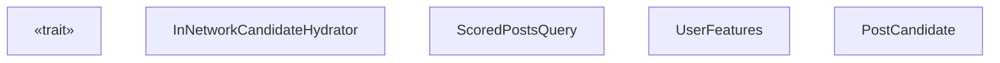
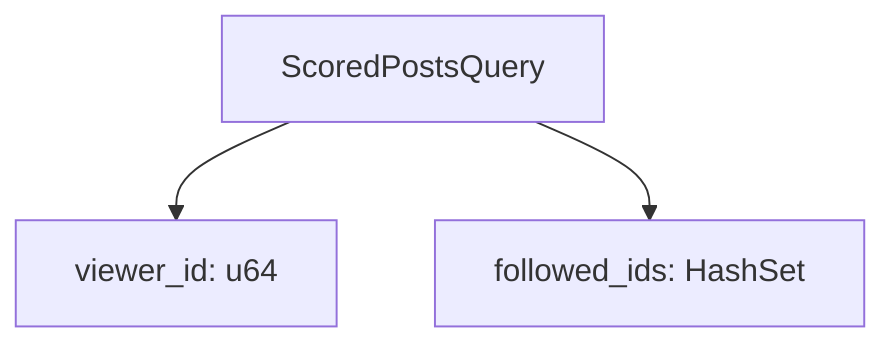
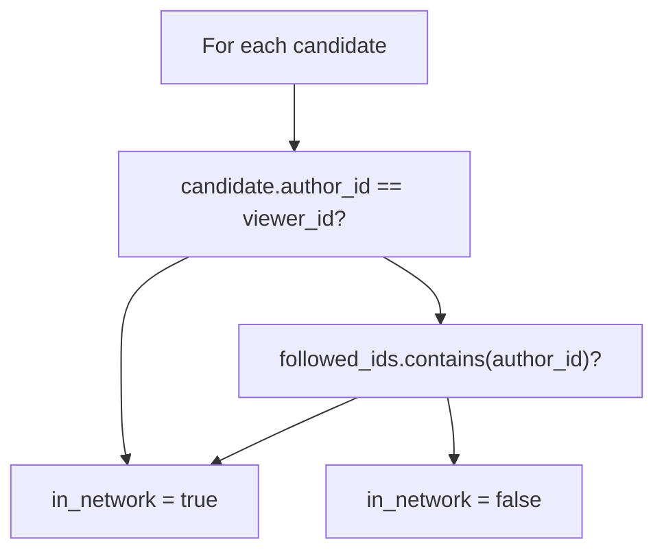

# 网络内候选者充实器 (InNetworkCandidateHydrator)

相关源文件

-   [home-mixer/candidate\_hydrators/in\_network\_candidate\_hydrator.rs](https://github.com/xai-org/x-algorithm/blob/aaa167b3/home-mixer/candidate_hydrators/in_network_candidate_hydrator.rs)

## 目的与范围

`InNetworkCandidateHydrator` 用于确定每个候选推文的作者是否在查看者的社交网络内。如果候选推文的作者是查看者本人或者是查看者关注的用户，则该推文被归类为“网络内 (in-network)”。此布尔分类存储在 `PostCandidate.in_network` 字段中，并由下游过滤器和评分器用于对网络内与网络外内容应用不同的处理方式。

有关充实器 Trait 模式的通用信息，请参阅 [Hydrator Trait](/xai-org/x-algorithm/3.4-hydrator-trait)。有关其他候选者充实实现的信息，请参阅 [候选者充实器](/xai-org/x-algorithm/4.5-candidate-hydrators)。有关根据网络状态使用不同安全级别的可见性过滤，请参阅 [VFCandidateHydrator](/xai-org/x-algorithm/4.5.5-vfcandidatehydrator)。

## 功能概述

该充实器对每个候选者执行简单的集合成员资格检查：

| 输入 | 输出 |
| --- | --- |
| 来自查询的查看者用户 ID | 每个候选者的布尔值 `in_network` 字段 |
| 来自查询用户特征的关注用户 ID 列表 | \- |
| 候选作者 ID | \- |

分类逻辑为：

-   **网络内 (In-network)**：作者是查看者本人，或者作者在查看者的关注用户列表中。
-   **网络外 (Out-of-network)**：所有其他情况。

这种判定使管道能够：

-   应用不同的可见性过滤安全级别（[VFCandidateHydrator](/xai-org/x-algorithm/4.5.5-vfcandidatehydrator) 对网络内内容使用 `TimelineHome`，对网络外内容使用 `TimelineHomeRecommendations`）。
-   应用不同的评分权重或多样性惩罚。
-   根据网络接近度过滤或确定内容的优先级。

来源：[home-mixer/candidate\_hydrators/in\_network\_candidate\_hydrator.rs1-44](https://github.com/xai-org/x-algorithm/blob/aaa167b3/home-mixer/candidate_hydrators/in_network_candidate_hydrator.rs#L1-L44)

## 实现结构


`InNetworkCandidateHydrator` 结构体是一个无状态组件，实现了候选管道框架中的 `Hydrator<ScoredPostsQuery, PostCandidate>` Trait。

**关键特性：**

-   **无状态**：该结构体没有字段 [home-mixer/candidate\_hydrators/in\_network\_candidate\_hydrator.rs7](https://github.com/xai-org/x-algorithm/blob/aaa167b3/home-mixer/candidate_hydrators/in_network_candidate_hydrator.rs#L7-L7)。
-   **无外部服务依赖**：所有需要的数据都存在于查询中。
-   **同步逻辑**：尽管具有异步签名，但计算是纯内存操作。
-   **幂等性**：多次调用产生相同的结果。

来源：[home-mixer/candidate\_hydrators/in\_network\_candidate\_hydrator.rs7-10](https://github.com/xai-org/x-algorithm/blob/aaa167b3/home-mixer/candidate_hydrators/in_network_candidate_hydrator.rs#L7-L10)

## 充实过程

### 输入数据提取

充实器从 `ScoredPostsQuery` 中提取两条信息：


查看者 ID 从 `i64` 转换为 `u64`，以便与候选者的 `author_id` 字段进行比较 [home-mixer/candidate\_hydrators/in\_network\_candidate\_hydrator.rs17](https://github.com/xai-org/x-algorithm/blob/aaa167b3/home-mixer/candidate_hydrators/in_network_candidate_hydrator.rs#L17-L17)。关注的用户 ID 被收集到 `HashSet<u64>` 中，以便进行高效的 O(1) 成员检查 [home-mixer/candidate\_hydrators/in\_network\_candidate\_hydrator.rs18-24](https://github.com/xai-org/x-algorithm/blob/aaa167b3/home-mixer/candidate_hydrators/in_network_candidate_hydrator.rs#L18-L24)。

来源：[home-mixer/candidate\_hydrators/in\_network\_candidate\_hydrator.rs17-24](https://github.com/xai-org/x-algorithm/blob/aaa167b3/home-mixer/candidate_hydrators/in_network_candidate_hydrator.rs#L17-L24)

### 分类逻辑

对于每个候选者，充实器应用以下决策树：


实现使用短路或 (OR) 评估 [home-mixer/candidate\_hydrators/in\_network\_candidate\_hydrator.rs29-30](https://github.com/xai-org/x-algorithm/blob/aaa167b3/home-mixer/candidate_hydrators/in_network_candidate_hydrator.rs#L29-L30)：

```
let is_self = candidate.author_id == viewer_id;let is_in_network = is_self || followed_ids.contains(&candidate.author_id);
```
这确保了用户自己创作的帖子始终被归类为网络内，即使该用户在社交图中技术上并未“关注”自己。

来源：[home-mixer/candidate\_hydrators/in\_network\_candidate\_hydrator.rs26-36](https://github.com/xai-org/x-algorithm/blob/aaa167b3/home-mixer/candidate_hydrators/in_network_candidate_hydrator.rs#L26-L36)

### 充实后的候选者创建

充实器为每个输入候选者创建一个新的 `PostCandidate` 实例，其中仅填充了 `in_network` 字段：

| 字段 | 值 |
| --- | --- |
| `in_network` | 根据分类结果为 `Some(true)` 或 `Some(false)` |
| 所有其他字段 | `Default::default()` |

然后，通过 `update` 方法 [home-mixer/candidate\_hydrators/in\_network\_candidate\_hydrator.rs41-43](https://github.com/xai-org/x-algorithm/blob/aaa167b3/home-mixer/candidate_hydrators/in_network_candidate_hydrator.rs#L41-L43) 将此部分候选者与原始候选者合并，该方法仅将 `in_network` 字段复制到原始候选者。

来源：[home-mixer/candidate\_hydrators/in\_network\_candidate\_hydrator.rs31-34](https://github.com/xai-org/x-algorithm/blob/aaa167b3/home-mixer/candidate_hydrators/in_network_candidate_hydrator.rs#L31-L34) [home-mixer/candidate\_hydrators/in\_network\_candidate\_hydrator.rs41-43](https://github.com/xai-org/x-algorithm/blob/aaa167b3/home-mixer/candidate_hydrators/in_network_candidate_hydrator.rs#L41-L43)

## 管道中的数据流

该充实器在管道的候选者充实阶段执行，同时执行的还有 `CoreDataCandidateHydrator` 和 `GizmoduckHydrator` 等其他充实器。管道框架负责结果的编排和合并。

来源：[home-mixer/candidate\_hydrators/in\_network\_candidate\_hydrator.rs12-43](https://github.com/xai-org/x-algorithm/blob/aaa167b3/home-mixer/candidate_hydrators/in_network_candidate_hydrator.rs#L12-L43)

## 集成点

### 查询依赖项

充实器要求在 `ScoredPostsQuery` 中填充以下字段：

| 字段路径 | 类型 | 目的 |
| --- | --- | --- |
| `query.user_id` | `i64` | 识别查看用户 |
| `query.user_features.followed_user_ids` | `Vec<i64>` | 查看者关注的用户列表 |

`user_features.followed_user_ids` 字段在候选者充实开始之前由查询充实器（参见 [查询充实器](/xai-org/x-algorithm/4.4-query-hydrators)）填充。

### 候选者依赖项

充实器要求在每个 `PostCandidate` 中填充以下字段：

| 字段 | 类型 | 填充者 | 目的 |
| --- | --- | --- | --- |
| `author_id` | `u64` | 源 (Thunder/Phoenix) 或 CoreDataCandidateHydrator | 识别帖子作者 |

`author_id` 通常由候选者源（[Thunder 源](/xai-org/x-algorithm/4.3.1-thunder-source) 或 [Phoenix 检索源](/xai-org/x-algorithm/4.3.2-phoenix-retrieval-source)）或 [CoreDataCandidateHydrator](/xai-org/x-algorithm/4.5.1-coredatacandidatehydrator) 填充。

### 下游消费者

由该充实器填充的 `in_network` 字段由以下组件消费：

1.  **VFCandidateHydrator** ([#4.5.5](/xai-org/x-algorithm/4.5.5-vfcandidatehydrator))：使用 `in_network` 来选择适当的可见性过滤安全级别。

    -   网络内帖子：`TimelineHome` 安全级别。
    -   网络外帖子：`TimelineHomeRecommendations` 安全级别（更严格）。
2.  **评分器**：可能根据网络状态应用不同的评分权重或多样性惩罚。

3.  **过滤器**：可能根据候选者是网络内还是网络外来以不同方式过滤候选者。


来源：[home-mixer/candidate\_hydrators/in\_network\_candidate\_hydrator.rs1-44](https://github.com/xai-org/x-algorithm/blob/aaa167b3/home-mixer/candidate_hydrators/in_network_candidate_hydrator.rs#L1-L44)

## 性能特性

该充实器具有以下性能特征：

| 指标 | 复杂度 | 备注 |
| --- | --- | --- |
| 每个候选者的耗时 | O(1) | HashSet 查找平均为 O(1) |
| 空间 | O(N) | HashSet 存储 N 个关注的用户 ID |
| 外部调用 | 0 | 所有数据都在内存中 |
| 并行化 | 安全 | 无状态，无共享可变状态 |

开销最大的操作是从关注用户 ID 向量初始构建 `HashSet<u64>` [home-mixer/candidate\_hydrators/in\_network\_candidate\_hydrator.rs18-24](https://github.com/xai-org/x-algorithm/blob/aaa167b3/home-mixer/candidate_hydrators/in_network_candidate_hydrator.rs#L18-L24)，其复杂度为 O(N)，其中 N 是关注的用户数量。然而，这一成本在所有候选者中摊销，且后续查找为 O(1)。

该充实器配备了 `#[xai_stats_macro::receive_stats]` 属性 [home-mixer/candidate\_hydrators/in\_network\_candidate\_hydrator.rs11](https://github.com/xai-org/x-algorithm/blob/aaa167b3/home-mixer/candidate_hydrators/in_network_candidate_hydrator.rs#L11-L11)，这可能用于跟踪执行时间和成功/失败指标以便监控。

来源：[home-mixer/candidate\_hydrators/in\_network\_candidate\_hydrator.rs11-24](https://github.com/xai-org/x-algorithm/blob/aaa167b3/home-mixer/candidate_hydrators/in_network_candidate_hydrator.rs#L11-L24)

## 错误处理

该充实器返回 `Result<Vec<PostCandidate>, String>`，但实际上不会产生错误，因为所有操作都是无误的：

-   类型转换（`i64` 转 `u64`）不会失败。
-   HashSet 构建和查找不会失败。
-   布尔值比较不会失败。

`Result` 类型是 `Hydrator` Trait 签名要求的，以便与其他可能执行易错操作（例如外部服务调用）的充实器保持一致。

来源：[home-mixer/candidate\_hydrators/in\_network\_candidate\_hydrator.rs12-39](https://github.com/xai-org/x-algorithm/blob/aaa167b3/home-mixer/candidate_hydrators/in_network_candidate_hydrator.rs#L12-L39)
