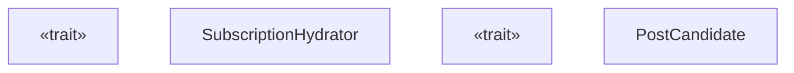
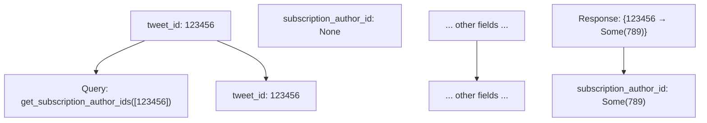
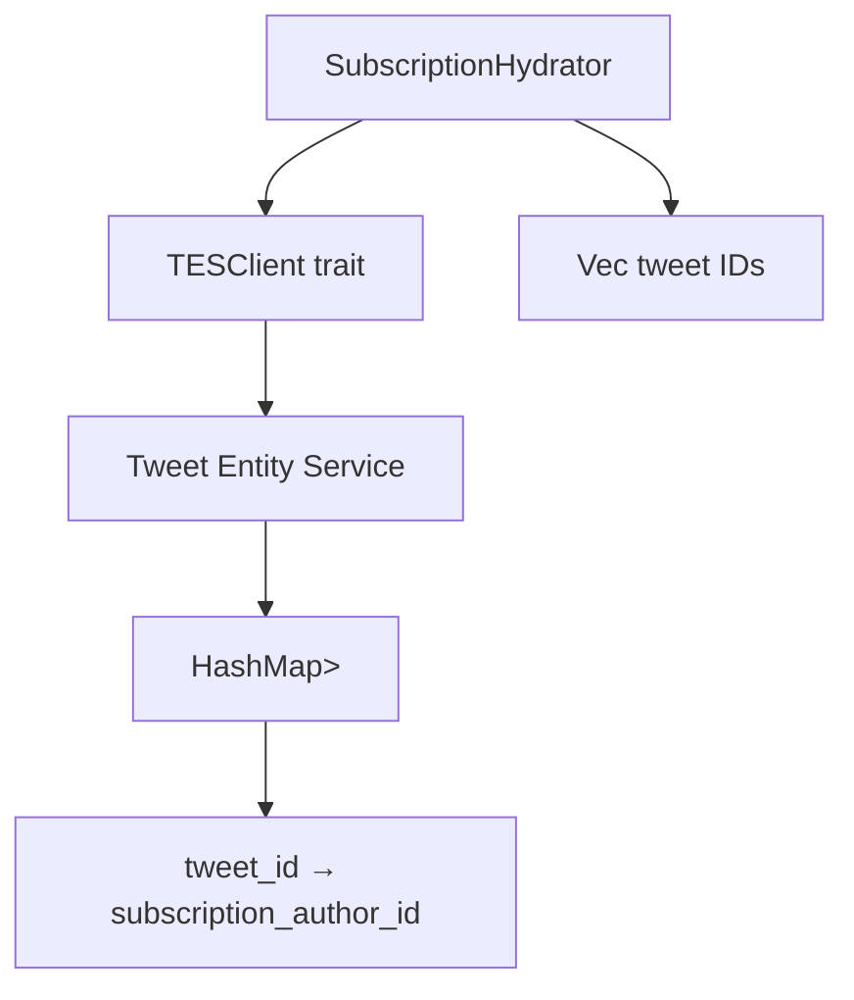
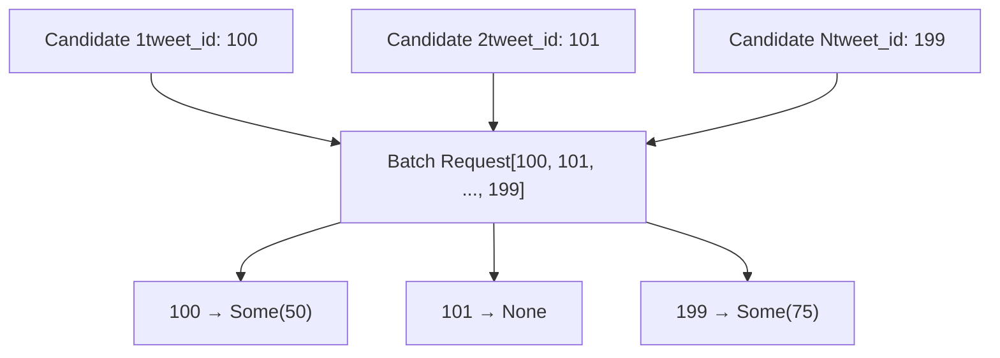
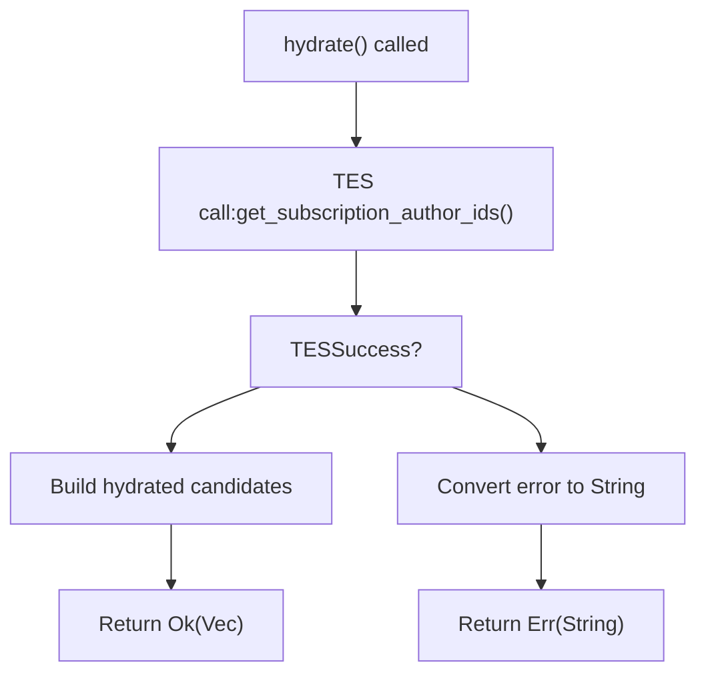

# 订阅充实器 (SubscriptionHydrator)

相关源文件

-   [home-mixer/candidate\_hydrators/subscription\_hydrator.rs](https://github.com/xai-org/x-algorithm/blob/aaa167b3/home-mixer/candidate_hydrators/subscription_hydrator.rs)

## 目的与范围

`SubscriptionHydrator` 使用订阅作者识别数据来充实 `PostCandidate` 对象。该充实器通过查询推文实体服务 (Tweet Entity Service, TES) 来确定推文是否源自订阅作者（高级内容创作者），并填充候选者上的 `subscription_author_id` 字段。此信息使下游管道阶段能够适当地识别、过滤或对高级内容进行评分。

本文档涵盖了 `SubscriptionHydrator` 的实现细节、数据流和集成模式。有关通用 `Hydrator` Trait 和执行模式的信息，请参阅 [Hydrator Trait](/xai-org/x-algorithm/3.4-hydrator-trait)。有关 TES 集成的详细信息，请参阅 [推文实体服务 (TES)](/xai-org/x-algorithm/5.2-tweet-entity-service-(tes))。有关正在被充实的候选者数据结构，请参阅 [PostCandidate](/xai-org/x-algorithm/4.2.2-postcandidate)。

## 架构与设计

### 组件结构

`SubscriptionHydrator` 实现了 `Hydrator<ScoredPostsQuery, PostCandidate>` Trait，遵循整个管道中使用的标准候选者充实器模式。


**来源：** [home-mixer/candidate\_hydrators/subscription\_hydrator.rs1-51](https://github.com/xai-org/x-algorithm/blob/aaa167b3/home-mixer/candidate_hydrators/subscription_hydrator.rs#L1-L51)

### 关键特性

| 特性 | 值 |
| --- | --- |
| **Trait 实现** | `Hydrator<ScoredPostsQuery, PostCandidate>` |
| **外部依赖** | 通过 `TESClient` 访问 TES (Tweet Entity Service) |
| **填充的字段** | `PostCandidate::subscription_author_id` |
| **查询独立性** | 不使用查询数据；仅对候选者进行操作 |
| **批量处理策略** | 对所有候选推文 ID 进行单次批量 TES 调用 |
| **执行模式** | 并行安全（可以与其他充实器并发执行） |

**来源：** [home-mixer/candidate\_hydrators/subscription\_hydrator.rs8-50](https://github.com/xai-org/x-algorithm/blob/aaa167b3/home-mixer/candidate_hydrators/subscription_hydrator.rs#L8-L50)

## 实现细节

### 初始化

`SubscriptionHydrator` 使用依赖注入的 `TESClient` 构造：

```
pub struct SubscriptionHydrator {    pub tes_client: Arc<dyn TESClient + Send + Sync>,} pub async fn new(tes_client: Arc<dyn TESClient + Send + Sync>) -> Self {    Self { tes_client }}
```
客户端抽象允许根据运行时配置注入生产环境的 TES 集成或测试用的模拟 (mock) 实现。

**来源：** [home-mixer/candidate\_hydrators/subscription\_hydrator.rs8-16](https://github.com/xai-org/x-algorithm/blob/aaa167b3/home-mixer/candidate_hydrators/subscription_hydrator.rs#L8-L16)

### Hydration 方法

`hydrate` 方法在单次批量请求中检索所有候选者的订阅作者 ID：

> **[Mermaid sequence]**
> *(图表结构无法解析)*

**来源：** [home-mixer/candidate\_hydrators/subscription\_hydrator.rs20-45](https://github.com/xai-org/x-algorithm/blob/aaa167b3/home-mixer/candidate_hydrators/subscription_hydrator.rs#L20-L45)

#### 逐步执行过程

1.  **推文 ID 收集** [第 28 行](https://github.com/xai-org/x-algorithm/blob/aaa167b3/lines 28)：将每个 `PostCandidate` 的 `tweet_id` 提取到一个向量中。
2.  **批量 TES 查询** [第 30-31 行](https://github.com/xai-org/x-algorithm/blob/aaa167b3/lines 30-31)：使用所有推文 ID 调用 `tes_client.get_subscription_author_ids()`。
3.  **错误处理** [第 31 行](https://github.com/xai-org/x-algorithm/blob/aaa167b3/line 31)：将 TES 错误映射为字符串格式，以便进行管道错误报告。
4.  **结果构建** [第 33-42 行](https://github.com/xai-org/x-algorithm/blob/aaa167b3/lines 33-42)：
    -   按原始顺序遍历推文 ID。
    -   从 TES 响应映射中查找订阅作者 ID。
    -   创建仅填充了 `subscription_author_id` 的新 `PostCandidate`。
    -   其他字段保持默认值（将通过 `update` 合并）。

**来源：** [home-mixer/candidate\_hydrators/subscription\_hydrator.rs28-44](https://github.com/xai-org/x-algorithm/blob/aaa167b3/home-mixer/candidate_hydrators/subscription_hydrator.rs#L28-L44)

### Update 方法

`update` 方法将充实后的订阅数据合并到原始候选者中：

```
fn update(&self, candidate: &mut PostCandidate, hydrated: PostCandidate) {    candidate.subscription_author_id = hydrated.subscription_author_id;}
```
该方法由管道框架在 `hydrate` 完成后为每个候选者调用，在合并 `subscription_author_id` 字段的同时保留所有其他候选者数据。

**来源：** [home-mixer/candidate\_hydrators/subscription\_hydrator.rs47-49](https://github.com/xai-org/x-algorithm/blob/aaa167b3/home-mixer/candidate_hydrators/subscription_hydrator.rs#L47-L49)

## 数据流

### 字段转换

充实器执行有针对性的字段级充实：


**来源：** [home-mixer/candidate\_hydrators/subscription\_hydrator.rs34-42](https://github.com/xai-org/x-algorithm/blob/aaa167b3/home-mixer/candidate_hydrators/subscription_hydrator.rs#L34-L42)

### 订阅作者 ID 语义

`subscription_author_id` 字段表示：

| 值 | 含义 |
| --- | --- |
| `Some(author_id)` | 推文来自订阅作者；`author_id` 标识订阅账号 |
| `None` | 推文并非来自订阅作者，或者 TES 缺少订阅元数据 |

此字段使下游管道阶段能够：

-   根据用户订阅状态**过滤高级内容**。
-   为订阅者与非订阅者应用**不同的评分**。
-   **跟踪有关高级内容分发的指标**。
-   为订阅帖子**应用特殊的渲染**。

**来源：** [home-mixer/candidate\_hydrators/subscription\_hydrator.rs36-38](https://github.com/xai-org/x-algorithm/blob/aaa167b3/home-mixer/candidate_hydrators/subscription_hydrator.rs#L36-L38)

## 集成点

### TESClient 依赖项

充实器依赖于 `TESClient::get_subscription_author_ids` 方法：


客户端抽象提供了：

-   **批量处理效率**：为所有候选者进行单次 RPC。
-   **可测试性**：单元测试用的模拟 (mock) 实现。
-   **错误隔离**：TES 故障映射为充实错误。

**来源：** [home-mixer/candidate\_hydrators/subscription\_hydrator.rs9-30](https://github.com/xai-org/x-algorithm/blob/aaa167b3/home-mixer/candidate_hydrators/subscription_hydrator.rs#L9-L30)

### 管道集成

`SubscriptionHydrator` 在候选者充实阶段与其他充实器一起执行：

| 管道阶段 | SubscriptionHydrator 角色 |
| --- | --- |
| **查询充实** | 未参与 |
| **候选者检索** | 未参与 |
| **候选者充实** | 使用订阅数据充实候选者（与其他充实器并行） |
| **过滤** | 为潜在的基于订阅的过滤器提供数据 |
| **评分** | 为订阅感知的评分逻辑提供数据 |
| **选择** | 未直接参与 |

**来源：** [home-mixer/candidate\_hydrators/subscription\_hydrator.rs19-20](https://github.com/xai-org/x-algorithm/blob/aaa167b3/home-mixer/candidate_hydrators/subscription_hydrator.rs#L19-L20)

## 性能特性

### 批量处理策略

充实器使用高效的批量处理来最大限度地减少 TES 调用：


**效率优势：**

-   **单次 RPC**：无论候选者数量多少，仅进行一次 TES 调用。
-   **O(1) 查找**：为每个推文 ID 进行 HashMap 查找。
-   **并行执行**：可以与其他充实器并发运行。

**来源：** [home-mixer/candidate\_hydrators/subscription_hydrator.rs28-31](https://github.com/xai-org/x-algorithm/blob/aaa167b3/home-mixer/candidate_hydrators/subscription_hydrator.rs#L28-L31)

### 指标配备

`hydrate` 方法通过 `#[xai_stats_macro::receive_stats]` 属性配备了指标功能。这为以下内容提供了自动指标收集：

-   充实延迟
-   成功/错误率
-   TES 调用性能
-   吞吐量跟踪

**来源：** [home-mixer/candidate\_hydrators/subscription\_hydrator.rs20](https://github.com/xai-org/x-algorithm/blob/aaa167b3/home-mixer/candidate_hydrators/subscription_hydrator.rs#L20-L20)

## 错误处理

充实器遵循标准的错误传播模式：


**错误行为：**

-   **TES 故障**：将错误映射为字符串并传播到管道。
-   **管道处理**：管道可能会使整个充实阶段失败，或者使用部分数据继续。
-   **数据缺失**：`None` 值表示没有订阅元数据（有效状态，非错误）。

**来源：** [home-mixer/candidate\_hydrators/subscription\_hydrator.rs30-31](https://github.com/xai-org/x-algorithm/blob/aaa167b3/home-mixer/candidate_hydrators/subscription_hydrator.rs#L30-L31)

## 使用示例

`SubscriptionHydrator` 在管道配置中实例化：

```
// 在管道初始化期间
let subscription_hydrator = SubscriptionHydrator::new(tes_client.clone()).await;

// 添加到管道充实器列表
pipeline.add_hydrator(subscription_hydrator);
```
充实后，候选者可用于订阅感知的逻辑：

```
// 示例：根据订阅状态进行过滤或评分
for candidate in candidates {
    if candidate.subscription_author_id.is_some() {
        // 这是高级内容
        // 应用订阅特定的逻辑
    }
}
```
**来源：** [home-mixer/candidate\_hydrators/subscription\_hydrator.rs13-15](https://github.com/xai-org/x-algorithm/blob/aaa167b3/home-mixer/candidate_hydrators/subscription_hydrator.rs#L13-L15)
