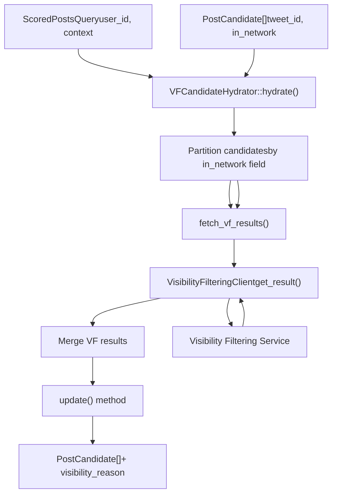
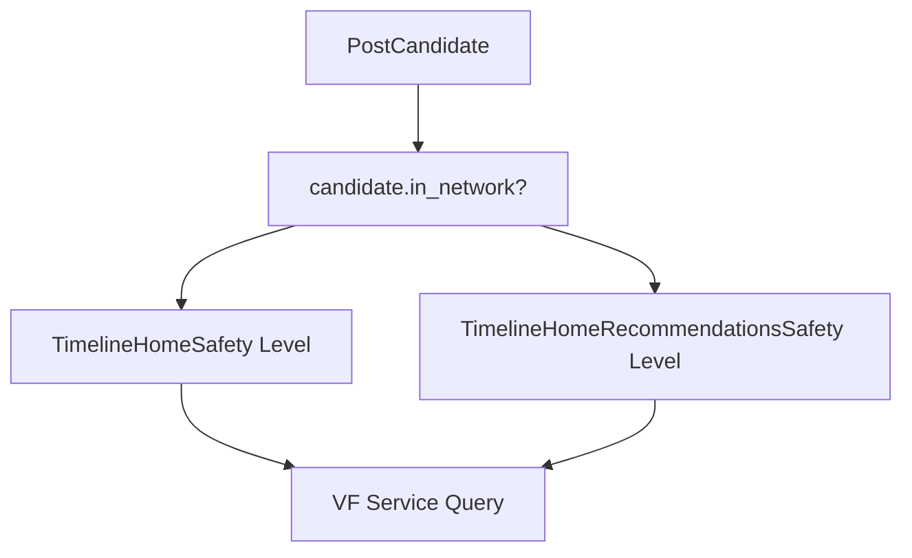
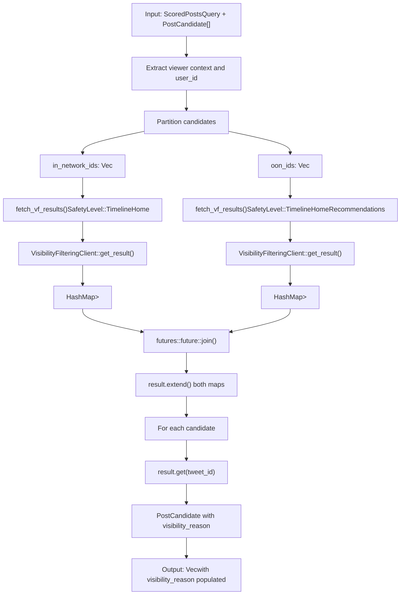

# VFCandidateHydrator

相关源文件

-   [home-mixer/candidate\_hydrators/vf\_candidate\_hydrator.rs](https://github.com/xai-org/x-algorithm/blob/aaa167b3/home-mixer/candidate_hydrators/vf_candidate_hydrator.rs)

## 目的与范围

`VFCandidateHydrator` 通过查询可见性过滤服务 (Visibility Filtering Service) 来充实候选者信息，以根据安全策略确定是否应向用户显示内容。该充实器通过应用不同的安全级别来区分网络内 (in-network) 和网络外 (out-of-network) 内容：对网络内帖子（来自关注的账号）使用 `TimelineHome`，对网络外帖子（来自 Phoenix 检索）使用 `TimelineHomeRecommendations`。结果是在每个候选者中添加了一个 `visibility_reason` 字段，指示内容是否被过滤以及原因。

有关可见性过滤逻辑和服务集成的详细信息，请参阅 [可见性过滤服务](/xai-org/x-algorithm/5.4-visibility-filtering-service)。有关其他候选者充实器，请参阅 [候选者充实器](/xai-org/x-algorithm/4.5-candidate-hydrators)。

**来源：** [home-mixer/candidate\_hydrators/vf\_candidate\_hydrator.rs1-102](https://github.com/xai-org/x-algorithm/blob/aaa167b3/home-mixer/candidate_hydrators/vf_candidate_hydrator.rs#L1-L102)

## 概述

`VFCandidateHydrator` 结构体实现了 `Hydrator<ScoredPostsQuery, PostCandidate>` Trait，并充当管道与内容安全系统的主要集成点。它通过将候选者划分为网络内和网络外两组，为每组查询适当安全级别的可见性过滤服务，并将结果合并回候选者流中，从而执行批量可见性过滤检查。


**来源：** [home-mixer/candidate\_hydrators/vf\_candidate\_hydrator.rs15-101](https://github.com/xai-org/x-algorithm/blob/aaa167b3/home-mixer/candidate_hydrators/vf_candidate_hydrator.rs#L15-L101)

## 结构体定义

`VFCandidateHydrator` 包含一个字段：

| 字段 | 类型 | 描述 |
| --- | --- | --- |
| `vf_client` | `Arc<dyn VisibilityFilteringClient + Send + Sync>` | 用于查询可见性过滤服务的客户端接口 |

该结构体通过 `new()` 异步构造函数实例化，该函数接受一个包装在 `Arc` 中的 `VisibilityFilteringClient` 实现，以便在异步任务之间共享所有权。

**来源：** [home-mixer/candidate\_hydrators/vf\_candidate\_hydrator.rs15-22](https://github.com/xai-org/x-algorithm/blob/aaa167b3/home-mixer/candidate_hydrators/vf_candidate_hydrator.rs#L15-L22)

## 安全级别区分

该充实器的一个关键特征是根据内容来源采用双重安全级别方法：

### 网络内内容 (TimelineHome)

对于 `candidate.in_network == Some(true)` 的候选者，使用 `SafetyLevel::TimelineHome` 级别进行检查。这代表来自用户关注的账号的内容，通常应用更宽松的过滤规则，因为用户已经明确选择关注该内容创作者。

### 网络外内容 (TimelineHomeRecommendations)

对于 `candidate.in_network == Some(false)` 或为 `None` 的候选者，使用 `SafetyLevel::TimelineHomeRecommendations` 级别进行检查。这代表来自用户未关注账号的算法推荐内容，通常应用更严格的安全策略，以确保主动推荐内容的质量和安全性。


**来源：** [home-mixer/candidate\_hydrators/vf\_candidate\_hydrator.rs54-78](https://github.com/xai-org/x-algorithm/blob/aaa167b3/home-mixer/candidate_hydrators/vf_candidate_hydrator.rs#L54-L78)

## 充实实现

### Hydrate 方法

`hydrate()` 方法遵循以下执行流程：

1.  **提取上下文**：从查询中检索查看者上下文和用户 ID。
2.  **划分候选者**：根据 `in_network` 字段将候选者分为 `in_network_ids` 和 `oon_ids`。
3.  **并行获取**：使用 `futures::future::join` 向可见性过滤服务发出两个并发请求。
4.  **合并结果**：将两个结果映射合并为一个 `HashMap<i64, Option<FilteredReason>>`。
5.  **创建充实后的候选者**：构造充实了 `visibility_reason` 字段的新 `PostCandidate` 实例。

实现使用 `#[xai_stats_macro::receive_stats]` 属性进行自动指标配备和数据收集。

**来源：** [home-mixer/candidate\_hydrators/vf\_candidate\_hydrator.rs44-96](https://github.com/xai-org/x-algorithm/blob/aaa167b3/home-mixer/candidate_hydrators/vf_candidate_hydrator.rs#L44-L96)

### 获取 VF 结果辅助方法

`fetch_vf_results()` 静态异步方法封装了可见性过滤请求逻辑：

> **[Mermaid sequence]**
> *(图表结构无法解析)*

该方法通过检查 `tweet_ids` 是否为空并立即返回空 `HashMap` 来执行早返优化，从而避免不必要的服务调用。

**来源：** [home-mixer/candidate\_hydrators/vf\_candidate\_hydrator.rs24-39](https://github.com/xai-org/x-algorithm/blob/aaa167b3/home-mixer/candidate_hydrators/vf_candidate_hydrator.rs#L24-L39)

## 并行执行模式

充实器利用 `futures::future::join` 并发执行网络内和网络外可见性过滤请求：

```
let (in_network_result, oon_result) = join(in_network_future, oon_future).await;
```
这种并行执行模式通过重叠两个独立的服务调用来减少总的充实延迟。两个 Future 同时被 Await，充实器仅阻塞到两个请求中较慢的一个完成为止。

**来源：** [home-mixer/candidate\_hydrators/vf\_candidate\_hydrator.rs3-80](https://github.com/xai-org/x-algorithm/blob/aaa167b3/home-mixer/candidate_hydrators/vf_candidate_hydrator.rs#L3-L80)

## Update 方法

`update()` 方法定义了将充实后的数据应用到现有候选者的字段级合并策略：

| 方法签名 | 更新的字段 |
| --- | --- |
| `fn update(&self, candidate: &mut PostCandidate, hydrated: PostCandidate)` | `visibility_reason` |

此方法通过将原始候选者的 `visibility_reason` 字段替换为来自充实后候选者的值来改变原始候选者。这遵循标准的充实器模式，其中 `hydrate()` 生成仅包含新获取字段的最小候选者结构体，而 `update()` 执行选择性字段替换。

**来源：** [home-mixer/candidate\_hydrators/vf\_candidate\_hydrator.rs98-100](https://github.com/xai-org/x-algorithm/blob/aaa167b3/home-mixer/candidate_hydrators/vf_candidate_hydrator.rs#L98-L100)

## 数据流图

下图说明了从输入候选者到充实后候选者的完整数据转换过程：


**来源：** [home-mixer/candidate\_hydrators/vf\_candidate\_hydrator.rs44-96](https://github.com/xai-org/x-algorithm/blob/aaa167b3/home-mixer/candidate_hydrators/vf_candidate_hydrator.rs#L44-L96)

## 与候选管道的集成

`VFCandidateHydrator` 被注册为 `PhoenixCandidatePipeline` 中的候选者充实器之一。管道并行执行所有充实器（参见 [Hydrator Trait](/xai-org/x-algorithm/3.4-hydrator-trait)），这意味着可见性过滤与其他充实操作（如核心数据获取和用户个人资料加载）并发进行。

由该充实器填充的 `visibility_reason` 字段随后由以下组件使用：

-   **VFFilter**（选择后阶段）：过滤掉 `visibility_reason.is_some()` 的候选者，移除未通过可见性检查的内容。
-   **指标与日志**：跟踪被过滤内容的原因，以进行可观测性和安全策略调整。

**来源：** [home-mixer/candidate\_hydrators/vf\_candidate\_hydrator.rs1-13](https://github.com/xai-org/x-algorithm/blob/aaa167b3/home-mixer/candidate_hydrators/vf_candidate_hydrator.rs#L1-L13)

## 错误处理

充实器通过将 `VisibilityFilteringClient` 的错误转换为字符串来进行传播：

```
.map_err(|e| e.to_string())
```
如果网络内或网络外可见性过滤请求中的任何一个失败，整个充实操作将通过第 82 行的 `?` 运算符失败，从而防止出现部分充实状态。

**来源：** [home-mixer/candidate\_hydrators/vf\_candidate\_hydrator.rs38-82](https://github.com/xai-org/x-algorithm/blob/aaa167b3/home-mixer/candidate_hydrators/vf_candidate_hydrator.rs#L38-L82)

## 类型依赖关系

| 类型 | 来源 | 目的 |
| --- | --- | --- |
| `PostCandidate` | `crate::candidate_pipeline::candidate` | 正在被充实的候选者数据结构 |
| `ScoredPostsQuery` | `crate::candidate_pipeline::query` | 包含查看者信息的查询上下文 |
| `VisibilityFilteringClient` | `xai_visibility_filtering::vf_client` | 服务客户端 Trait |
| `SafetyLevel` | `xai_visibility_filtering::vf_client` | 包含 `TimelineHome` 和 `TimelineHomeRecommendations` 的枚举 |
| `FilteredReason` | `xai_visibility_filtering::models` | 内容被过滤的可选原因 |
| `TwitterContextViewer` | `xai_twittercontext_proto` | 传递给可见性服务的查看者上下文 |

**来源：** [home-mixer/candidate\_hydrators/vf\_candidate\_hydrator.rs1-13](https://github.com/xai-org/x-algorithm/blob/aaa167b3/home-mixer/candidate_hydrators/vf_candidate_hydrator.rs#L1-L13)
