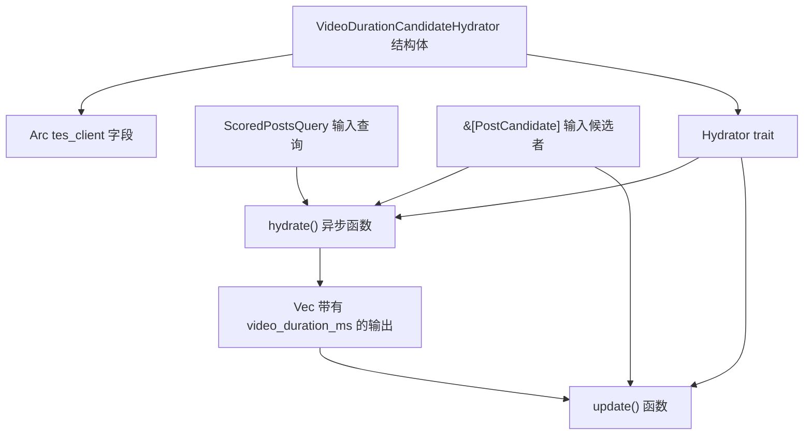
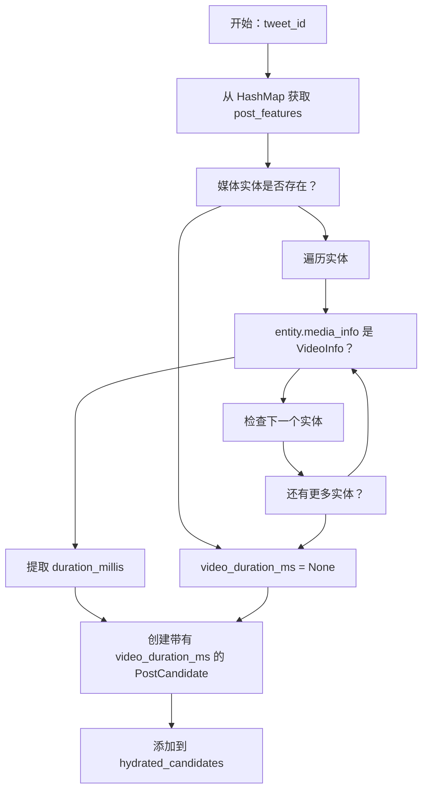
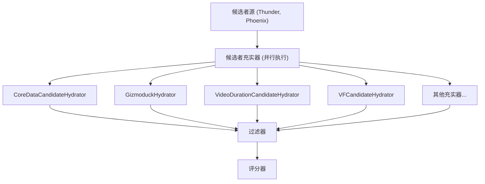

# 视频时长候选者充实器 (VideoDurationCandidateHydrator)

相关源文件

-   [home-mixer/candidate\_hydrators/video\_duration\_candidate\_hydrator.rs](https://github.com/xai-org/x-algorithm/blob/aaa167b3/home-mixer/candidate_hydrators/video_duration_candidate_hydrator.rs)

## 目的与范围

`VideoDurationCandidateHydrator` 使用以毫秒为单位的视频时长元数据来充实帖子候选者。该充实器通过查询推文实体服务 (Tweet Entity Service, TES) 来检索每个候选帖子的媒体实体，并在可用时提取视频时长。此元数据使下游组件能够根据视频长度做出排名决策，例如优先处理较短的视频或过滤超过特定时长阈值的视频。

有关充实器 Trait 抽象的通用信息，请参阅 [Hydrator Trait](/xai-org/x-algorithm/3.4-hydrator-trait)。有关所有候选者充实器的概述，请参阅 [候选者充实器](/xai-org/x-algorithm/4.5-candidate-hydrators)。有关 TES 客户端集成详情，请参阅 [推文实体服务 (TES)](/xai-org/x-algorithm/5.2-tweet-entity-service-(tes))。

**来源：** [home-mixer/candidate\_hydrators/video\_duration\_candidate\_hydrator.rs1-63](https://github.com/xai-org/x-algorithm/blob/aaa167b3/home-mixer/candidate_hydrators/video_duration_candidate_hydrator.rs#L1-L63)

## 组件架构

`VideoDurationCandidateHydrator` 结构体包含对 `TESClient` 实现的单一依赖，该实现提供了对推文媒体实体数据的访问。该充实器遵循整个管道框架中使用的标准基于 Trait 的架构。


**图表：VideoDurationCandidateHydrator 组件结构**

该充实器实现了 `Hydrator<ScoredPostsQuery, PostCandidate>` Trait，提供了两个方法：用于充实数据的 `hydrate()` 和用于将充实后的数据合并到现有候选者的 `update()`。

**来源：** [home-mixer/candidate\_hydrators/video\_duration\_candidate\_hydrator.rs9-17](https://github.com/xai-org/x-algorithm/blob/aaa167b3/home-mixer/candidate_hydrators/video_duration_candidate_hydrator.rs#L9-L17) [home-mixer/candidate\_hydrators/video\_duration\_candidate\_hydrator.rs19-62](https://github.com/xai-org/x-algorithm/blob/aaa167b3/home-mixer/candidate_hydrators/video_duration_candidate_hydrator.rs#L19-L62)

## 依赖关系与初始化

### 构造函数

`VideoDurationCandidateHydrator::new()` 异步函数使用提供的 TES 客户端创建一个新的充实器实例：

| 参数 | 类型 | 描述 |
| --- | --- | --- |
| `tes_client` | `Arc<dyn TESClient + Send + Sync>` | 用于查询推文实体服务的客户端 |

构造函数非常简单，仅存储 TES 客户端引用以便在充实期间使用：

**来源：** [home-mixer/candidate\_hydrators/video\_duration\_candidate\_hydrator.rs13-17](https://github.com/xai-org/x-algorithm/blob/aaa167b3/home-mixer/candidate_hydrators/video_duration_candidate_hydrator.rs#L13-L17)

### TESClient 依赖项

`tes_client` 字段是一个包装在 `Arc` 中的、实现了 `TESClient + Send + Sync` 的 Trait 对象。这使得充实器可以在异步任务之间共享，同时为测试和生产配置抽象出具体的 TES 客户端实现。

**来源：** [home-mixer/candidate\_hydrators/video\_duration\_candidate\_hydrator.rs10](https://github.com/xai-org/x-algorithm/blob/aaa167b3/home-mixer/candidate_hydrators/video_duration_candidate_hydrator.rs#L10-L10)

## 充实实现

### 方法签名

`hydrate()` 方法实现了核心的 `Hydrator` Trait 方法：

```
async fn hydrate(    &self,    _query: &ScoredPostsQuery,    candidates: &[PostCandidate],) -> Result<Vec<PostCandidate>, String>
```
查询参数未使用（带有 `_` 前缀），因为视频时长是特定于推文的元数据，不依赖于用户上下文。

**来源：** [home-mixer/candidate\_hydrators/video\_duration\_candidate\_hydrator.rs22-26](https://github.com/xai-org/x-algorithm/blob/aaa167b3/home-mixer/candidate_hydrators/video_duration_candidate_hydrator.rs#L22-L26)

### 执行流程

充实过程遵循以下序列：

> **[Mermaid sequence]**
> *(图表结构无法解析)*

**图表：VideoDurationCandidateHydrator 执行流程**

**来源：** [home-mixer/candidate\_hydrators/video\_duration\_candidate\_hydrator.rs22-57](https://github.com/xai-org/x-algorithm/blob/aaa167b3/home-mixer/candidate_hydrators/video_duration_candidate_hydrator.rs#L22-L57)

### 推文 ID 收集

充实器首先从输入候选者中收集所有推文 ID，以便进行单次批量 TES 查询：

**来源：** [home-mixer/candidate\_hydrators/video\_duration\_candidate\_hydrator.rs29](https://github.com/xai-org/x-algorithm/blob/aaa167b3/home-mixer/candidate_hydrators/video_duration_candidate_hydrator.rs#L29-L29)

### 媒体实体检索

充实器使用所有推文 ID 调用 `tes_client.get_tweet_media_entities()`，接收一个将推文 ID 映射到其媒体实体的 `HashMap`。错误处理会将任何 TES 错误转换为字符串表示形式：

**来源：** [home-mixer/candidate\_hydrators/video\_duration\_candidate\_hydrator.rs31-32](https://github.com/xai-org/x-algorithm/blob/aaa167b3/home-mixer/candidate_hydrators/video_duration_candidate_hydrator.rs#L31-L32)

### 视频时长提取

对于每条推文，充实器处理媒体实体以查找视频时长：


**图表：视频时长提取逻辑**

提取逻辑：

1.  从响应映射中检索该推文 ID 的媒体实体。
2.  遍历所有媒体实体。
3.  检查 `entity.media_info` 是否为 `MediaInfo::VideoInfo`。
4.  从找到的第一个视频中提取 `duration_millis`。
5.  如果不存在视频，则将 `video_duration_ms` 设置为 `None`。

**来源：** [home-mixer/candidate\_hydrators/video\_duration\_candidate\_hydrator.rs35-47](https://github.com/xai-org/x-algorithm/blob/aaa167b3/home-mixer/candidate_hydrators/video_duration_candidate_hydrator.rs#L35-L47)

### 结果构建

充实器为每条推文构造一个新的 `PostCandidate`，其中仅填充了 `video_duration_ms` 字段，所有其他字段使用默认值：

**来源：** [home-mixer/candidate\_hydrators/video\_duration\_candidate\_hydrator.rs49-54](https://github.com/xai-org/x-algorithm/blob/aaa167b3/home-mixer/candidate_hydrators/video_duration_candidate_hydrator.rs#L49-L54)

## Update 方法

`update()` 方法将充实后的数据合并到现有候选者中：

```
fn update(&self, candidate: &mut PostCandidate, hydrated: PostCandidate) {    candidate.video_duration_ms = hydrated.video_duration_ms;}
```
该方法由管道框架在 `hydrate()` 返回后调用，将 `video_duration_ms` 字段从充实后的候选者复制到可变候选者引用中。这种模式允许充实器从 `hydrate()` 返回最小的 `PostCandidate` 结构体，同时保留所有其他候选者字段。

**来源：** [home-mixer/candidate\_hydrators/video\_duration\_candidate\_hydrator.rs59-61](https://github.com/xai-org/x-algorithm/blob/aaa167b3/home-mixer/candidate_hydrators/video_duration_candidate_hydrator.rs#L59-L61)

## 数据转换

下表显示了该充实器执行的数据转换：

| 阶段 | 数据结构 | 关键字段 | 来源 |
| --- | --- | --- | --- |
| **输入** | `PostCandidate` | `tweet_id`, `video_duration_ms = None` | 管道候选者 |
| **TES 查询** | `Vec<TweetId>` | 推文 ID | 从候选者中提取 |
| **TES 响应** | `HashMap<TweetId, Vec<MediaEntity>>` | `media_info: Option<MediaInfo>` | TES 客户端 |
| **提取** | `MediaInfo::VideoInfo` | `duration_millis: i64` | 媒体实体变体 |
| **输出** | `PostCandidate` | `video_duration_ms: Option<i64>` | 更新后的候选者字段 |

充实器使用以毫秒为单位的视频时长来充实候选者，从而使下游组件（过滤器、评分器、选择器）能够根据视频长度做出决策。没有视频内容的候选者的 `video_duration_ms` 将保持为 `None`。

**来源：** [home-mixer/candidate\_hydrators/video\_duration\_candidate\_hydrator.rs1-63](https://github.com/xai-org/x-algorithm/blob/aaa167b3/home-mixer/candidate_hydrators/video_duration_candidate_hydrator.rs#L1-L63)

## 与管道的集成

`VideoDurationCandidateHydrator` 在管道的候选者充实阶段执行，即在从源检索到候选者之后，但在过滤和评分之前。作为充实阶段的一部分，该充实器与其他充实器并行运行。


**图表：VideoDurationCandidateHydrator 在管道中的位置**

由该充实器充实的视频时长元数据可供所有后续管道阶段使用，从而实现特定于视频的过滤、评分调整或 Phoenix 排名器模型的特征提取。

**来源：** [home-mixer/candidate\_hydrators/video\_duration\_candidate\_hydrator.rs19-62](https://github.com/xai-org/x-algorithm/blob/aaa167b3/home-mixer/candidate_hydrators/video_duration_candidate_hydrator.rs#L19-L62)
