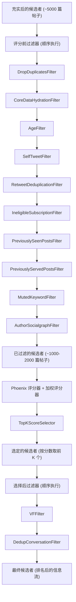
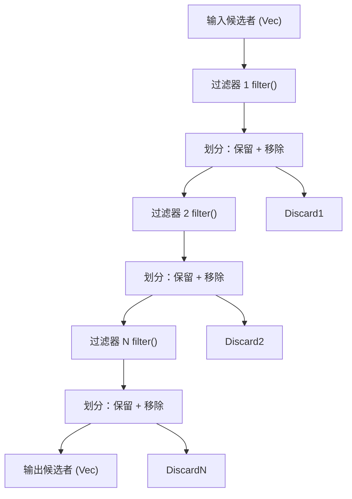

# 过滤器 (Filters)

相关源文件

-   [README.md](https://github.com/xai-org/x-algorithm/blob/aaa167b3/README.md?plain=1)
-   [home-mixer/candidate\_pipeline/phoenix\_candidate_pipeline.rs](https://github.com/xai-org/x-algorithm/blob/aaa167b3/home-mixer/candidate_pipeline/phoenix_candidate_pipeline.rs)

## 目的与范围

本文档描述了主混频器 (Home Mixer) 流水线中的过滤器实现，这些过滤器负责从信息流中移除不符合条件的候选者。过滤器在两个截然不同的阶段运行：评分前过滤器，用于在昂贵的机器学习评分前廉价地消除候选者；以及选择后过滤器，用于在选择前 K 个候选者后进行最终验证。

有关通用 `Filter` Trait 及其执行模型的详细信息，请参阅 [Filter Trait](/xai-org/x-algorithm/3.5-filter-trait)。有关分配相关性评分的评分实现，请参阅 [评分器 (Scorers)](/xai-org/x-algorithm/4.7-scorers)。

**来源：** [README.md275-298](https://github.com/xai-org/x-algorithm/blob/aaa167b3/README.md?plain=1#L275-L298) [home-mixer/candidate\_pipeline/phoenix\_candidate\_pipeline.rs108-143](https://github.com/xai-org/x-algorithm/blob/aaa167b3/home-mixer/candidate_pipeline/phoenix_candidate_pipeline.rs#L108-L143)

## 过滤架构

流水线采用两阶段过滤策略来优化性能并确保内容质量：

**评分前过滤器 (Pre-scoring filters)** 在机器学习评分之前顺序运行，以移除明显不符合条件的候选者。这减少了需要昂贵机器学习推理的候选者数量，从而提高了延迟和吞吐量。

**选择后过滤器 (Post-selection filters)** 在前 K 个选择之后运行，以执行最终验证检查，这些检查可能需要选择后填充阶段获取的额外数据（例如可见性过滤状态）。

**来源：** [README.md275-298](https://github.com/xai-org/x-algorithm/blob/aaa167b3/README.md?plain=1#L275-L298) [home-mixer/candidate\_pipeline/phoenix\_candidate\_pipeline.rs108-143](https://github.com/xai-org/x-algorithm/blob/aaa167b3/home-mixer/candidate_pipeline/phoenix_candidate_pipeline.rs#L108-L143)

## 过滤器执行模型

过滤器实现了候选管道框架中的 `Filter<Q, C>` Trait。流水线顺序执行过滤器，每个过滤器将候选者划分为“保留”和“移除”集合：

每个过滤器接收上一个过滤器“保留”的候选者，并返回一个 `(kept, removed)` 向量元组。流水线记录移除统计信息，用于监控和调试。

**来源：** [home-mixer/candidate\_pipeline/phoenix\_candidate\_pipeline.rs108-120](https://github.com/xai-org/x-algorithm/blob/aaa167b3/home-mixer/candidate_pipeline/phoenix_candidate_pipeline.rs#L108-L120)

## 评分前过滤器

`PhoenixCandidatePipeline` 按以下顺序应用十个评分前过滤器：

| 过滤器 | 目的 | 实现 |
| --- | --- | --- |
| `DropDuplicatesFilter` | 从候选者集合中移除重复的帖子 ID | 维护已见 ID 的 `HashSet` |
| `CoreDataHydrationFilter` | 移除核心数据填充失败的候选者 | 检查 `core_data` 字段是否存在 |
| `AgeFilter` | 移除早于配置的最大时长的帖子 | 从雪花 ID (snowflake ID) 中提取时间戳，参见 [AgeFilter](/xai-org/x-algorithm/4.6.1-agefilter) |
| `SelfTweetFilter` | 移除请求用户自己创作的帖子 | 将作者 ID 与查看者 ID 进行比较 |
| `RetweetDeduplicationFilter` | 移除相同内容的重复转推 (retweet) | 通过源推文 ID 进行去重 |
| `IneligibleSubscriptionFilter` | 移除用户无法访问的订阅内容 | 检查订阅状态和查看者资格 |
| `PreviouslySeenPostsFilter` | 移除用户已经看过的帖子 | 使用查询中的布隆过滤器 (bloom filter) |
| `PreviouslyServedPostsFilter` | 移除近期请求中已送达的帖子 | 使用查询中的布隆过滤器 |
| `MutedKeywordFilter` | 移除包含用户屏蔽关键字的帖子 | 与用户的屏蔽关键字列表匹配 |
| `AuthorSocialgraphFilter` | 移除来自被封禁或被屏蔽作者的帖子 | 参见 [AuthorSocialgraphFilter](/xai-org/x-algorithm/4.6.2-authorsocialgraphfilter) |

过滤器按此特定顺序顺序执行以优化性能：首先运行廉价的过滤器（重复检测、核心数据检查），随后是成本逐渐增加的过滤器。

**来源：** [home-mixer/candidate\_pipeline/phoenix\_candidate\_pipeline.rs109-120](https://github.com/xai-org/x-algorithm/blob/aaa167b3/home-mixer/candidate_pipeline/phoenix_candidate_pipeline.rs#L109-L120) [README.md280-291](https://github.com/xai-org/x-algorithm/blob/aaa167b3/README.md?plain=1#L280-L291)

## 选择后过滤器

在评分和前 K 个选择之后，流水线应用两个选择后过滤器：

| 过滤器 | 目的 | 实现 |
| --- | --- | --- |
| `VFFilter` | 移除被可见性过滤 (visibility filtering) 标记的帖子（已删除、垃圾信息、暴力、血腥等） | 使用来自 `VFCandidateHydrator` 的可见性过滤结果 |
| `DedupConversationFilter` | 对同一对话线程的多个分支进行去重 | 按对话 ID 分组并选择评分最高的分支 |

这些过滤器在选择之后运行，因为它们依赖于选择后填充期间获取的数据，或者仅需要对最终候选者集合进行评估。

**来源：** [home-mixer/candidate\_pipeline/phoenix\_candidate\_pipeline.rs142-143](https://github.com/xai-org/x-algorithm/blob/aaa167b3/home-mixer/candidate_pipeline/phoenix_candidate_pipeline.rs#L142-L143) [README.md293-297](https://github.com/xai-org/x-algorithm/blob/aaa167b3/README.md?plain=1#L293-L297)

## 过滤器流水线集成

下图显示了过滤器如何与 `PhoenixCandidatePipeline` 结构体集成：

```mermaid
flowchart TD
    Pipeline["PhoenixCandidatePipeline"]
    QH["query_hydrators: Vec<Box<dyn QueryHydrator>>"]
    Sources["sources: Vec<Box<dyn Source>>"]
    Hydrators["hydrators: Vec<Box<dyn Hydrator>>"]
    Filters["filters: Vec<Box<dyn Filter>>"]
    Scorers["scorers: Vec<Box<dyn Scorer>>"]
    Selector["selector: TopKScoreSelector"]
    PostHydrators["post_selection_hydrators: Vec<Box<dyn Hydrator>>"]
    PostFilters["post_selection_filters: Vec<Box<dyn Filter>>"]
    F1["DropDuplicatesFilter"]
    F2["CoreDataHydrationFilter"]
    F3["AgeFilter"]
    F4["SelfTweetFilter"]
    F5["RetweetDeduplicationFilter"]
    F6["IneligibleSubscriptionFilter"]
    F7["PreviouslySeenPostsFilter"]
    F8["PreviouslyServedPostsFilter"]
    F9["MutedKeywordFilter"]
    F10["AuthorSocialgraphFilter"]
    PF1["VFFilter"]
    PF2["DedupConversationFilter"]

    Pipeline --> QH
    Pipeline --> Sources
    Pipeline --> Hydrators
    Pipeline --> Filters
    Pipeline --> Scorers
    Pipeline --> Selector
    Pipeline --> PostHydrators
    Pipeline --> PostFilters
    Filters --> F1
    Filters --> F2
    Filters --> F3
    Filters --> F4
    Filters --> F5
    Filters --> F6
    Filters --> F7
    Filters --> F8
    Filters --> F9
    Filters --> F10
    PostFilters --> PF1
    PostFilters --> PF2
```

`build_with_clients` 方法使用具体的过滤器实现初始化过滤器向量。`CandidatePipeline` Trait 的 `execute` 方法在适当的流水线阶段编排过滤器的执行。

**来源：** [home-mixer/candidate\_pipeline/phoenix\_candidate\_pipeline.rs72-160](https://github.com/xai-org/x-algorithm/blob/aaa167b3/home-mixer/candidate_pipeline/phoenix_candidate_pipeline.rs#L72-L160)

## 过滤器初始化

过滤器在 `build_with_clients` 方法中实例化：

```mermaid
flowchart TD
    Build["PhoenixCandidatePipeline::build_with_clients()"]
    PreVec["filters: Vec<Box<dyn Filter>>"]
    PostVec["post_selection_filters: Vec<Box<dyn Filter>>"]
    DD["Box::new(DropDuplicatesFilter)"]
    CD["Box::new(CoreDataHydrationFilter)"]
    Age["Box::new(AgeFilter::new(Duration::from_secs(params::MAX_POST_AGE)))"]
    Self["Box::new(SelfTweetFilter)"]
    RT["Box::new(RetweetDeduplicationFilter)"]
    Sub["Box::new(IneligibleSubscriptionFilter)"]
    Seen["Box::new(PreviouslySeenPostsFilter)"]
    Served["Box::new(PreviouslyServedPostsFilter)"]
    Muted["Box::new(MutedKeywordFilter::new())"]
    Author["Box::new(AuthorSocialgraphFilter)"]
    VF["Box::new(VFFilter)"]
    Dedup["Box::new(DedupConversationFilter)"]

    Build --> PreVec
    Build --> PostVec
    PreVec --> DD
    PreVec --> CD
    PreVec --> Age
    PreVec --> Self
    PreVec --> RT
    PreVec --> Sub
    PreVec --> Seen
    PreVec --> Served
    PreVec --> Muted
    PreVec --> Author
    PostVec --> VF
    PostVec --> Dedup
```

大多数过滤器是无状态的，通过 `new()` 构造。`AgeFilter` 需要配置最大帖子时长参数。所有过滤器都被类型擦除为 `Box<dyn Filter<ScoredPostsQuery, PostCandidate>>` 并存储在向量中。

**来源：** [home-mixer/candidate\_pipeline/phoenix\_candidate\_pipeline.rs108-143](https://github.com/xai-org/x-algorithm/blob/aaa167b3/home-mixer/candidate_pipeline/phoenix_candidate_pipeline.rs#L108-L143)

## 过滤器实现详情

特定过滤器实现的详细文档：

-   **[AgeFilter](/xai-org/x-algorithm/4.6.1-agefilter)**：根据帖子时长过滤候选者，使用雪花 ID 时间戳提取和可配置的最大时长参数。
-   **[AuthorSocialgraphFilter](/xai-org/x-algorithm/4.6.2-authorsocialgraphfilter)**：使用查看者的社交图谱 (social graph) 数据过滤来自被封禁或被屏蔽作者的候选者。
-   **[其他过滤器 (Additional Filters)](/xai-org/x-algorithm/4.6.3-additional-filters)**：关于其他过滤器的文档，包括 `DropDuplicatesFilter`、`SelfTweetFilter`、`PreviouslySeenPostsFilter`、`MutedKeywordFilter` 以及选择后过滤器。

每个过滤器独立运行，可以进行单独测试。顺序执行确保了过滤器之间的依赖关系得到尊重（例如 `CoreDataHydrationFilter` 必须在访问核心数据字段的过滤器之前运行）。

**来源：** [home-mixer/candidate\_pipeline/phoenix\_candidate\_pipeline.rs108-143](https://github.com/xai-org/x-algorithm/blob/aaa167b3/home-mixer/candidate_pipeline/phoenix_candidate_pipeline.rs#L108-L143)

## 性能特性

两阶段过滤策略提供了显著的性能优势：

| 阶段 | 典型输入规模 | 典型输出规模 | 每个候选者的成本 | 总成本 |
| --- | --- | --- | --- | --- |
| 评分前过滤器 | ~5,000 个候选者 | ~1,000-2,000 个候选者 | 低 (内存操作) | ~1-2ms |
| 机器学习评分 | ~1,000-2,000 个候选者 | ~1,000-2,000 个评分 | 高 (Transformer 推理) | ~50-100ms |
| 选择 | ~1,000-2,000 个候选者 | ~100-200 个被选出 | 低 (排序) | <1ms |
| 选择后过滤器 | ~100-200 个候选者 | ~50-100 个最终结果 | 中 (可见性 API 调用) | ~5-10ms |

通过在机器学习评分之前进行激进的过滤，流水线将昂贵的 Transformer 推理调用次数减少了 60-80%，使总延迟从 ~150ms 降低到 ~60ms。

**来源：** [README.md275-298](https://github.com/xai-org/x-algorithm/blob/aaa167b3/README.md?plain=1#L275-L298)
