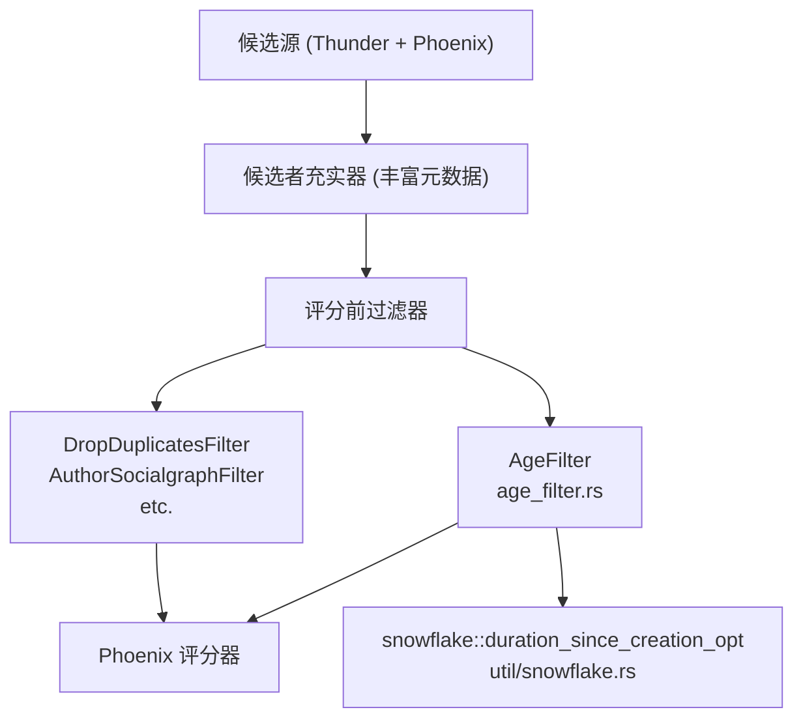
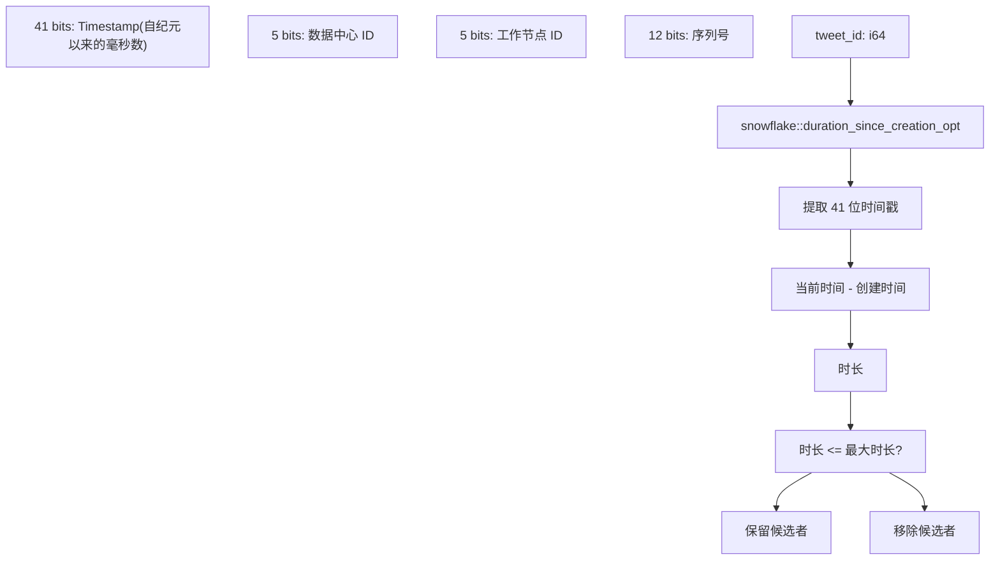
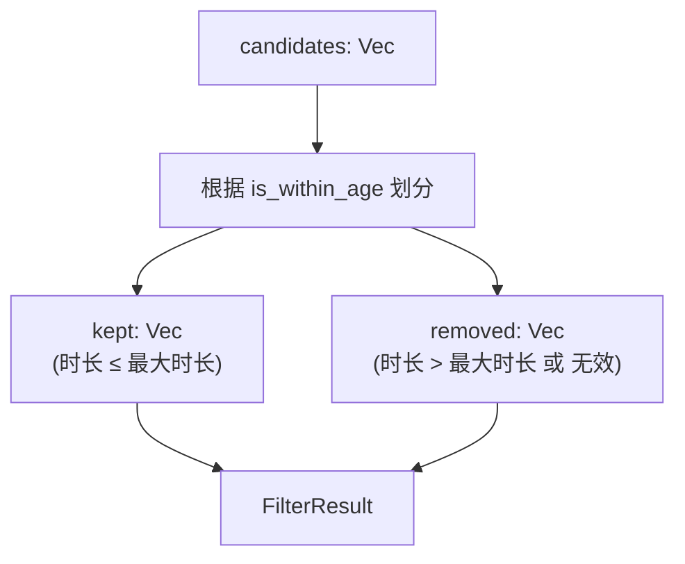
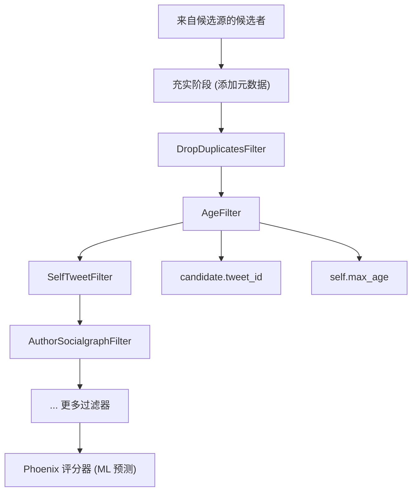
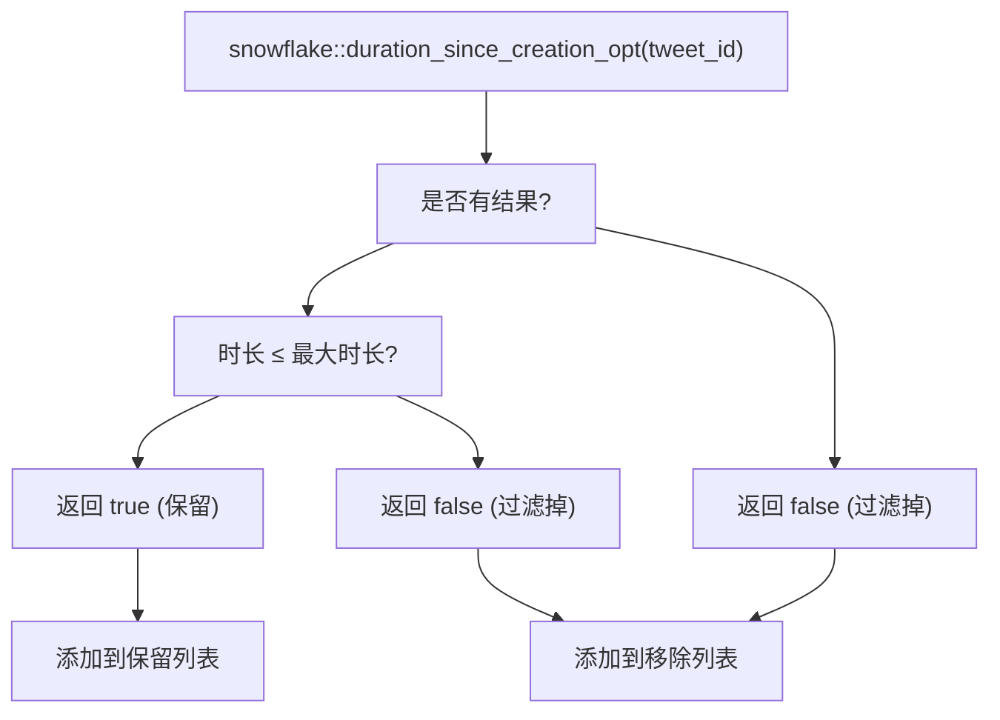
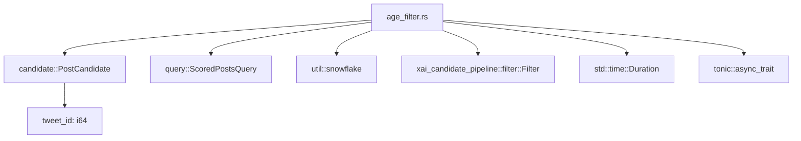

# 帖龄过滤器 (AgeFilter)

相关源文件

-   [home-mixer/filters/age\_filter.rs](https://github.com/xai-org/x-algorithm/blob/aaa167b3/home-mixer/filters/age_filter.rs)

## 目的与范围

`AgeFilter` 从推荐流水线中移除超过配置的最大时长阈值的推文候选者。该过滤器通过从 Twitter 的雪花 ID (snowflake ID) 中提取帖子创建时间戳并将其与当前时间进行比较，防止“为您推荐 (For You)”馈送显示陈旧内容。

本页面记录了位于 [home-mixer/filters/age\_filter.rs](https://github.com/xai-org/x-algorithm/blob/aaa167b3/home-mixer/filters/age_filter.rs) 的 `AgeFilter` 实现。有关其他过滤机制的信息，请参阅 [其他过滤器 (Additional Filters)](/xai-org/x-algorithm/4.6.3-additional-filters)。有关更广泛的过滤框架，请参阅 [Filter Trait](/xai-org/x-algorithm/3.5-filter-trait)。

**来源：** [home-mixer/filters/age\_filter.rs1-39](https://github.com/xai-org/x-algorithm/blob/aaa167b3/home-mixer/filters/age_filter.rs#L1-L39)

## 概述

`AgeFilter` 是一种评分前过滤器，在流水线早期运行，以在进行昂贵的机器学习 (ML) 评分操作之前消除过时内容。它利用 Twitter 雪花 ID 格式中嵌入的时间信息来确定帖子时长，而无需调用外部服务。

### 架构上下文


**来源：** [home-mixer/filters/age\_filter.rs1-39](https://github.com/xai-org/x-algorithm/blob/aaa167b3/home-mixer/filters/age_filter.rs#L1-L39)

## 实现细节

### 数据结构

`AgeFilter` 结构体包含一个配置字段：

| 字段 | 类型 | 描述 |
| --- | --- | --- |
| `max_age` | `Duration` | 允许帖子保留在候选者集合中的最大时长 |

**来源：** [home-mixer/filters/age\_filter.rs9-11](https://github.com/xai-org/x-algorithm/blob/aaa167b3/home-mixer/filters/age_filter.rs#L9-L11)

### 雪花 ID 时间戳提取

该过滤器依赖于 Twitter 的雪花 ID 格式，其中推文 ID 在其最高有效位中编码了创建时间戳。这允许在不进行外部服务调用的情况下进行帖龄计算。


**来源：** [home-mixer/filters/age\_filter.rs18-22](https://github.com/xai-org/x-algorithm/blob/aaa167b3/home-mixer/filters/age_filter.rs#L18-L22)

### 过滤器逻辑

核心过滤操作在 `filter` 方法中实现，该方法符合 `Filter<ScoredPostsQuery, PostCandidate>` Trait。

**来源：** [home-mixer/filters/age\_filter.rs26-37](https://github.com/xai-org/x-algorithm/blob/aaa167b3/home-mixer/filters/age_filter.rs#L26-L37)

### 代码实体映射

下表将自然语言概念映射到具体的代码实体：

| 概念 | 代码实体 | 位置 |
| --- | --- | --- |
| 过滤器实现 | `AgeFilter` 结构体 | [home-mixer/filters/age\_filter.rs9-11](https://github.com/xai-org/x-algorithm/blob/aaa167b3/home-mixer/filters/age_filter.rs#L9-L11) |
| 构造函数 | `AgeFilter::new` | [home-mixer/filters/age\_filter.rs14-16](https://github.com/xai-org/x-algorithm/blob/aaa167b3/home-mixer/filters/age_filter.rs#L14-L16) |
| 帖龄验证 | `AgeFilter::is_within_age` | [home-mixer/filters/age\_filter.rs18-22](https://github.com/xai-org/x-algorithm/blob/aaa167b3/home-mixer/filters/age_filter.rs#L18-L22) |
| 过滤器 Trait 方法 | `AgeFilter::filter` | [home-mixer/filters/age\_filter.rs27-37](https://github.com/xai-org/x-algorithm/blob/aaa167b3/home-mixer/filters/age_filter.rs#L27-L37) |
| 时间戳提取 | `snowflake::duration_since_creation_opt` | 在 [home-mixer/filters/age\_filter.rs19](https://github.com/xai-org/x-algorithm/blob/aaa167b3/home-mixer/filters/age_filter.rs#L19-L19) 被引用 |
| 流水线集成 | `Filter<ScoredPostsQuery, PostCandidate>` | [home-mixer/filters/age\_filter.rs26](https://github.com/xai-org/x-algorithm/blob/aaa167b3/home-mixer/filters/age_filter.rs#L26-L26) |

**来源：** [home-mixer/filters/age\_filter.rs1-39](https://github.com/xai-org/x-algorithm/blob/aaa167b3/home-mixer/filters/age_filter.rs#L1-L39)

## 功能行为

### 帖龄验证逻辑

`is_within_age` 方法实现核心帖龄验证：

1.  **提取时间戳**：调用 `snowflake::duration_since_creation_opt(tweet_id)` 从雪花 ID 中提取帖龄。
2.  **比较时长**：检查提取出的帖龄是否小于或等于 `max_age`。
3.  **处理缺失的时间戳**：如果时间戳提取失败（通过 `unwrap_or(false)`），则返回 `false`。

这种防御性方法确保了具有无效 ID 的推文会被过滤掉，而不是导致流水线故障。

**来源：** [home-mixer/filters/age\_filter.rs18-22](https://github.com/xai-org/x-algorithm/blob/aaa167b3/home-mixer/filters/age_filter.rs#L18-L22)

### 划分策略

该过滤器使用 Rust 的 `partition` 迭代器方法来高效地分离候选者：


划分操作发生在 [home-mixer/filters/age\_filter.rs32-34](https://github.com/xai-org/x-algorithm/blob/aaa167b3/home-mixer/filters/age_filter.rs#L32-L34)，使用闭包 `|c| self.is_within_age(c.tweet_id)` 对每个候选者进行分类。

**来源：** [home-mixer/filters/age\_filter.rs32-36](https://github.com/xai-org/x-algorithm/blob/aaa167b3/home-mixer/filters/age_filter.rs#L32-L36)

## 配置与初始化

### 构造函数

`AgeFilter::new` 方法提供了一个接受 `Duration` 参数的简单构造函数：

```rust
AgeFilter::new(max_age: Duration)
```
流水线中的典型初始化会使用诸如 `Duration::from_hours(48)` 之类的时长来过滤掉早于 48 小时的帖子。

**来源：** [home-mixer/filters/age\_filter.rs14-16](https://github.com/xai-org/x-algorithm/blob/aaa167b3/home-mixer/filters/age_filter.rs#L14-L16)

### 配置示例

| 使用场景 | 配置 | 效果 |
| --- | --- | --- |
| 仅限近期内容 | `Duration::from_hours(24)` | 仅保留最近 24 小时内的帖子 |
| 扩展新鲜度 | `Duration::from_hours(72)` | 保留最长达 3 天前的帖子 |
| 关注实时性 | `Duration::from_hours(6)` | 仅保留非常近期的帖子 |

## 流水线集成

### Filter Trait 实现

`AgeFilter` 实现了候选管道框架中定义的 `Filter<ScoredPostsQuery, PostCandidate>` Trait。此 Trait 要求实现异步的 `filter` 方法：

```rust
async fn filter(
    &self,
    _query: &ScoredPostsQuery,
    candidates: Vec<PostCandidate>,
) -> Result<FilterResult<PostCandidate>, String>
```
**来源：** [home-mixer/filters/age\_filter.rs26-37](https://github.com/xai-org/x-algorithm/blob/aaa167b3/home-mixer/filters/age_filter.rs#L26-L37)

### 查询独立性

请注意，`filter` 方法签名包含带下划线前缀的 `_query: &ScoredPostsQuery`，这表示故意不使用该查询参数。`AgeFilter` 仅对候选者数据（推文 ID）进行操作，不需要诸如用户偏好或本地化之类的查询上下文。

**来源：** [home-mixer/filters/age\_filter.rs29](https://github.com/xai-org/x-algorithm/blob/aaa167b3/home-mixer/filters/age_filter.rs#L29-L29)

### 流水线执行顺序


`AgeFilter` 在评分前阶段与其他过滤器顺序执行，位于充实之后、昂贵的 ML 评分操作之前。

**来源：** [home-mixer/filters/age\_filter.rs1-39](https://github.com/xai-org/x-algorithm/blob/aaa167b3/home-mixer/filters/age_filter.rs#L1-L39)

## 性能特性

### 计算复杂度

| 指标 | 复杂度 | 描述 |
| --- | --- | --- |
| 时间复杂度 | O(n) | 对所有候选者进行线性扫描 |
| 空间复杂度 | O(n) | 创建新的“保留”/“移除”向量 |
| 外部调用 | 0 | 无网络请求；纯计算操作 |

### 性能优势

1.  **无外部依赖**：从雪花 ID 提取帖龄是本地的位运算。
2.  **早期过滤**：减少了发送到昂贵的 ML 评分环节的候选者数量。
3.  **快速失败行为**：无效的推文 ID 会被立即过滤，而不会引发错误。

**来源：** [home-mixer/filters/age\_filter.rs18-37](https://github.com/xai-org/x-algorithm/blob/aaa167b3/home-mixer/filters/age_filter.rs#L18-L37)

## 错误处理

`AgeFilter` 通过其错误处理策略展示了防御性编程：


[home-mixer/filters/age\_filter.rs21](https://github.com/xai-org/x-algorithm/blob/aaa167b3/home-mixer/filters/age_filter.rs#L21-L21) 处的 `unwrap_or(false)` 确保了具有无效雪花 ID 的候选者会被过滤掉，而不是引发崩溃或破坏流水线的错误。

**来源：** [home-mixer/filters/age\_filter.rs18-22](https://github.com/xai-org/x-algorithm/blob/aaa167b3/home-mixer/filters/age_filter.rs#L18-L22)

## 依赖关系

### 模块依赖项


**来源：** [home-mixer/filters/age\_filter.rs1-6](https://github.com/xai-org/x-algorithm/blob/aaa167b3/home-mixer/filters/age_filter.rs#L1-L6)

### 关键导入

| 导入 | 目的 |
| --- | --- |
| `PostCandidate` | 包含 `tweet_id` 字段的候选者类型 |
| `ScoredPostsQuery` | 查询类型 (未使用但 Trait 要求) |
| `snowflake` | 用于提取时间戳的辅助模块 |
| `Filter` Trait | 该过滤器实现的框架 Trait |
| `FilterResult` | 包含“保留”/“移除”分区的返回类型 |

**来源：** [home-mixer/filters/age\_filter.rs1-6](https://github.com/xai-org/x-algorithm/blob/aaa167b3/home-mixer/filters/age_filter.rs#L1-L6)
