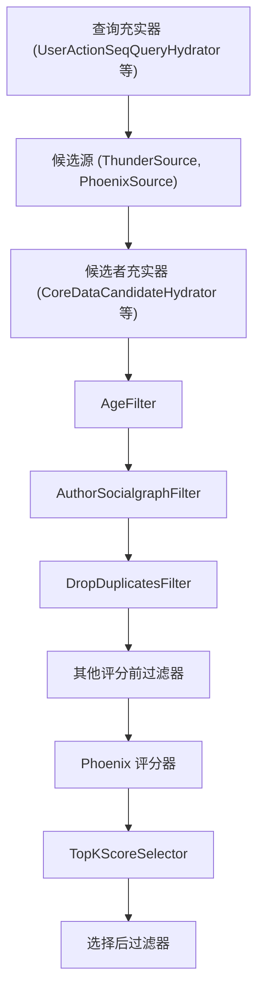
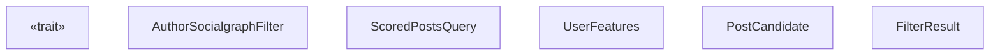
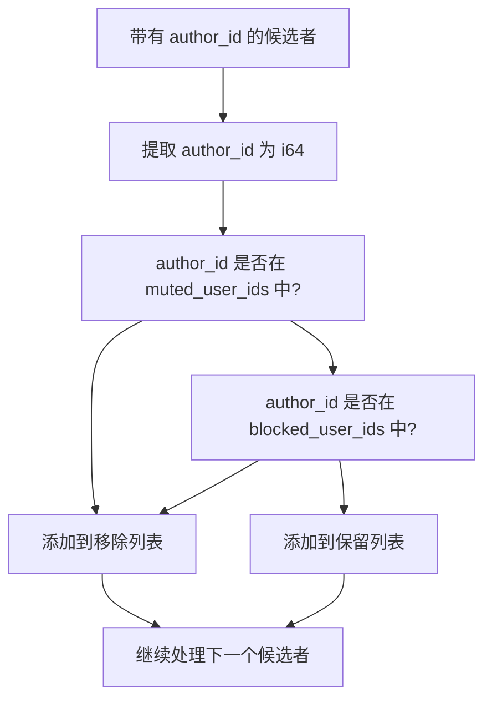
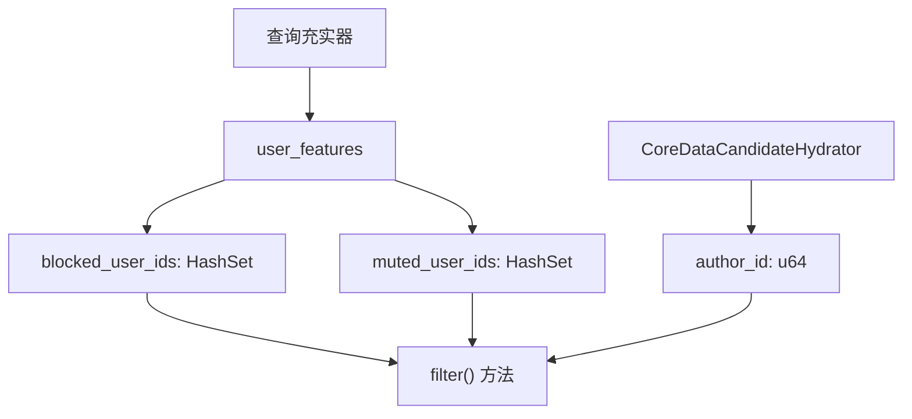
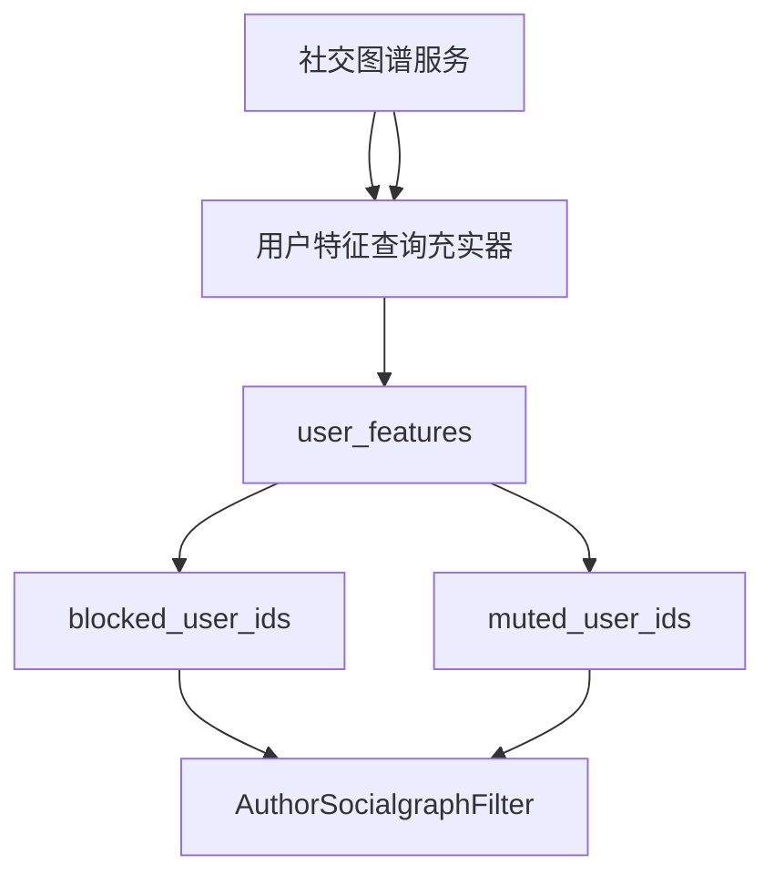

# 作者社交图谱过滤器 (AuthorSocialgraphFilter)

相关源文件

-   [home-mixer/filters/author\_socialgraph\_filter.rs](https://github.com/xai-org/x-algorithm/blob/aaa167b3/home-mixer/filters/author_socialgraph_filter.rs)

## 目的与范围

`AuthorSocialgraphFilter` 用于移除由查看者已封禁或已屏蔽的用户创作的候选者。该过滤器通过防止来自不想要作者的内容出现在查看者的“为您推荐 (For You)”馈送中来强制执行社交图谱边界，无论其相关性评分如何。

本文档涵盖了该过滤器的实现、算法、数据依赖关系以及与候选管道框架的集成。有关更广泛的过滤系统和其他过滤器实现的信息，请参阅 [过滤器 (Filters)](/xai-org/x-algorithm/4.6-filters)。有关通用 Filter Trait 规范，请参阅 [Filter Trait](/xai-org/x-algorithm/3.5-filter-trait)。

**来源：** [home-mixer/filters/author\_socialgraph\_filter.rs1-43](https://github.com/xai-org/x-algorithm/blob/aaa167b3/home-mixer/filters/author_socialgraph_filter.rs#L1-L43)

---

## 概述

`AuthorSocialgraphFilter` 是一种评分前过滤器，在流水线早期运行，以在进行昂贵的机器学习 (ML) 评分操作之前消除来自被封禁或屏蔽作者的候选者。它实现了候选管道框架中的 `Filter<ScoredPostsQuery, PostCandidate>` Trait。

### 关键特性

| 特性 | 值 |
| --- | --- |
| **Trait 实现** | `Filter<ScoredPostsQuery, PostCandidate>` |
| **执行阶段** | 评分前 (在 Phoenix 评分器之前) |
| **执行模式** | 顺序执行 |
| **主要数据源** | `ScoredPostsQuery.user_features` |
| **性能影响** | 低 (集合成员检查) |
| **过滤标准** | 作者在 `blocked_user_ids` 或 `muted_user_ids` 中 |

**来源：** [home-mixer/filters/author\_socialgraph\_filter.rs1-43](https://github.com/xai-org/x-algorithm/blob/aaa167b3/home-mixer/filters/author_socialgraph_filter.rs#L1-L43)

---

## 流水线集成

下图显示了 `AuthorSocialgraphFilter` 在 `PhoenixCandidatePipeline` 中的执行位置：


**图表：AuthorSocialgraphFilter 在流水线中的位置**

该过滤器在候选者充实（填充了 `author_id` 字段）之后、ML 评分之前执行，从而减少了需要进行昂贵推理的候选者数量。

**来源：** [home-mixer/filters/author\_socialgraph\_filter.rs1-43](https://github.com/xai-org/x-algorithm/blob/aaa167b3/home-mixer/filters/author_socialgraph_filter.rs#L1-L43)

---

## 实现细节

### 结构体定义

`AuthorSocialgraphFilter` 是一个零大小类型 (ZST)，不携带任何状态：

```rust
pub struct AuthorSocialgraphFilter;
```
所有过滤逻辑都是无状态的，完全取决于来自查询和候选者的数据。

**来源：** [home-mixer/filters/author\_socialgraph\_filter.rs7](https://github.com/xai-org/x-algorithm/blob/aaa167b3/home-mixer/filters/author_socialgraph_filter.rs#L7-L7)

### Filter Trait 实现

该结构体实现了异步的 `Filter` Trait：


**图表：AuthorSocialgraphFilter 类型关系**

**来源：** [home-mixer/filters/author\_socialgraph\_filter.rs10-15](https://github.com/xai-org/x-algorithm/blob/aaa167b3/home-mixer/filters/author_socialgraph_filter.rs#L10-L15)

---

## 过滤算法

### 数据提取

过滤器首先从查询中提取被封禁和被屏蔽的用户 ID 集合：

```rust
let viewer_blocked_user_ids = query.user_features.blocked_user_ids.clone();
let viewer_muted_user_ids = query.user_features.muted_user_ids.clone();
```
这些集合由流水线早期的查询充实器填充，包含了查看者已封禁或已屏蔽的用户 ID。

**来源：** [home-mixer/filters/author\_socialgraph\_filter.rs16-17](https://github.com/xai-org/x-algorithm/blob/aaa167b3/home-mixer/filters/author_socialgraph_filter.rs#L16-L17)

### 早返优化 (Early Return Optimization)

如果两个集合都为空，过滤器会短路并返回所有候选者为“保留”：

```rust
if viewer_blocked_user_ids.is_empty() && viewer_muted_user_ids.is_empty() {
    return Ok(FilterResult {
        kept: candidates,
        removed: Vec::new(),
    });
}
```
这种优化避免了在查看者没有封禁或屏蔽任何用户时遍历候选者，这对于新账号来说很常见。

**来源：** [home-mixer/filters/author\_socialgraph\_filter.rs19-24](https://github.com/xai-org/x-algorithm/blob/aaa167b3/home-mixer/filters/author_socialgraph_filter.rs#L19-L24)

### 候选者划分

对于每个候选者，过滤器会检查作者是否被封禁或被屏蔽：


**图表：候选者过滤决策流程**

实现将 `author_id` 从 `u64` 转换为 `i64` 以进行集合成员检查：

```rust
for candidate in candidates {
    let author_id = candidate.author_id as i64;
    let muted = viewer_muted_user_ids.contains(&author_id);
    let blocked = viewer_blocked_user_ids.contains(&author_id);
    if muted || blocked {
        removed.push(candidate);
    } else {
        kept.push(candidate);
    }
}
```
候选者被划分为两个向量：

-   **`kept`**：来自未被封禁或已屏蔽作者的候选者。
-   **`removed`**：来自被封禁或已屏蔽作者的候选者。

**来源：** [home-mixer/filters/author\_socialgraph\_filter.rs29-38](https://github.com/xai-org/x-algorithm/blob/aaa167b3/home-mixer/filters/author_socialgraph_filter.rs#L29-L38)

### 过滤结果

该方法返回一个包含保留和移除的候选者的 `FilterResult` 结构体：

```rust
Ok(FilterResult { kept, removed })
```
移除的候选者会被跟踪以用于指标和调试目的，尽管它们不会继续在流水线中传递。

**来源：** [home-mixer/filters/author\_socialgraph\_filter.rs40](https://github.com/xai-org/x-algorithm/blob/aaa167b3/home-mixer/filters/author_socialgraph_filter.rs#L40-L40)

---

## 数据依赖关系

该过滤器要求特定字段由较早的流水线阶段填充：


**图表：AuthorSocialgraphFilter 数据依赖关系**

### 要求的查询字段

| 字段路径 | 类型 | 来源 | 目的 |
| --- | --- | --- | --- |
| `query.user_features.blocked_user_ids` | `HashSet<i64>` | 查询充实器 | 被查看者封禁的用户 ID |
| `query.user_features.muted_user_ids` | `HashSet<i64>` | 查询充实器 | 被查看者屏蔽的用户 ID |

### 要求的候选者字段

| 字段路径 | 类型 | 来源 | 目的 |
| --- | --- | --- | --- |
| `candidate.author_id` | `u64` | CoreDataCandidateHydrator | 推文作者的 ID |

**来源：** [home-mixer/filters/author\_socialgraph\_filter.rs16-30](https://github.com/xai-org/x-algorithm/blob/aaa167b3/home-mixer/filters/author_socialgraph_filter.rs#L16-L30)

---

## 性能特性

### 时间复杂度

过滤器执行以下操作：

1.  **集合提取**：O(1) - 克隆对哈希集合的引用。
2.  **早返检查**：O(1) - 检查两个集合是否都为空。
3.  **候选者遍历**：O(n)，其中 n 是候选者数量。
4.  **集合成员检查**：每个候选者 O(1) (HashSet 查找)。

**总体复杂度**：O(n)，其中 n 是输入候选者的数量。

### 空间复杂度

-   **输入**：候选者向量 O(n)。
-   **输出**：保留 + 移除向量 O(n)。
-   **辅助空间**：O(1) - 没有分配额外的数据结构。

### 优化策略

实现包含一个关键优化：

**当没有封禁/屏蔽用户时早返**：[home-mixer/filters/author\_socialgraph\_filter.rs](https://github.com/xai-org/x-algorithm/blob/aaa167b3/home-mixer/filters/author_socialgraph_filter.rs#L19-L24) 的第 19-24 行在遍历候选者之前检查两个集合是否都为空。对于没有封禁或已屏蔽任何账号的用户，这将执行时间减少到接近于零。

**来源：** [home-mixer/filters/author\_socialgraph\_filter.rs19-41](https://github.com/xai-org/x-algorithm/blob/aaa167b3/home-mixer/filters/author_socialgraph_filter.rs#L19-L41)

---

## 使用示例

以下序列图说明了 `AuthorSocialgraphFilter` 如何处理一批候选者：

**图表：AuthorSocialgraphFilter 执行序列**

**来源：** [home-mixer/filters/author\_socialgraph\_filter.rs11-41](https://github.com/xai-org/x-algorithm/blob/aaa167b3/home-mixer/filters/author_socialgraph_filter.rs#L11-L41)

---

## 与社交图谱系统的集成

封禁和屏蔽的用户 ID 源自查看者的社交图谱，社交图谱由外部服务管理，并在充实期间填充到查询中：


**图表：社交图谱数据流向过滤器**

该过滤器作为查看者通过封禁和屏蔽操作表达的偏好的执行点。

**来源：** [home-mixer/filters/author\_socialgraph\_filter.rs16-17](https://github.com/xai-org/x-algorithm/blob/aaa167b3/home-mixer/filters/author_socialgraph_filter.rs#L16-L17)

---

## 错误处理

`filter()` 方法返回 `Result<FilterResult<PostCandidate>, String>`，尽管目前的实现从未返回错误。所有操作都是无误的：

-   集合克隆不会失败。
-   集合成员检查不会失败。
-   向量操作具有足够的容量。

如果未来的增强功能需要错误处理（例如获取额外的社交图谱数据），`String` 错误类型提供了基础的错误报告功能。

**来源：** [home-mixer/filters/author\_socialgraph\_filter.rs15](https://github.com/xai-org/x-algorithm/blob/aaa167b3/home-mixer/filters/author_socialgraph_filter.rs#L15-L15)

---

## 与其他过滤器的关系

`AuthorSocialgraphFilter` 补充了评分前阶段的其他过滤器：

| 过滤器 | 目的 | 与 AuthorSocialgraphFilter 的关系 |
| --- | --- | --- |
| **AgeFilter** | 移除旧帖子 | 独立 - 对时间数据进行操作 |
| **SelfTweetFilter** | 移除查看者自己的推文 | 相关 - 都按作者过滤，但标准不同 |
| **MutedKeywordFilter** | 移除带有屏蔽关键字的帖子 | 独立 - 对内容而非作者进行操作 |
| **DropDuplicatesFilter** | 移除重复的帖子 ID | 独立 - 对帖子 ID 进行操作 |

这些过滤器顺序执行，每个过滤器都为后续过滤器减少候选者集合。顺序经过优化，首先应用成本较低的过滤器。

**来源：** [home-mixer/filters/author\_socialgraph\_filter.rs1-43](https://github.com/xai-org/x-algorithm/blob/aaa167b3/home-mixer/filters/author_socialgraph_filter.rs#L1-L43)

---

## 测试注意事项

在测试 `AuthorSocialgraphFilter` 时，请考虑以下场景：

| 场景 | 输入 | 预期输出 |
| --- | --- | --- |
| **空的封禁/屏蔽列表** | 两个集合都为空 | 所有候选者保留 (早返) |
| **作者在封禁列表中** | 作者 ID 在 `blocked_user_ids` 中 | 候选者被移除 |
| **作者在屏蔽列表中** | 作者 ID 在 `muted_user_ids` 中 | 候选者被移除 |
| **作者在两个列表中** | 作者 ID 在两个集合中 | 候选者被移除 |
| **作者不在任何列表中** | 作者 ID 不在任何一个集合中 | 候选者保留 |
| **混合候选者** | 一些被封禁/屏蔽，一些没有 | 正确划分 |

**来源：** [home-mixer/filters/author\_socialgraph\_filter.rs19-41](https://github.com/xai-org/x-algorithm/blob/aaa167b3/home-mixer/filters/author_socialgraph_filter.rs#L19-L41)

---

## 总结

`AuthorSocialgraphFilter` 提供了一个简单但关键的功能：通过移除来自封禁或已屏蔽作者的内容来强制执行社交图谱边界。其关键设计特性包括：

-   **无状态实现**：零大小类型，没有内部状态。
-   **早返优化**：当不需要过滤时绕过处理。
-   **高效的基于集合的查找**：每个候选者 O(1) 的成员检查。
-   **评分前执行**：减轻了昂贵的 ML 评分操作的负载。
-   **清晰的关注点分离**：读取查询、过滤候选者、返回结果。

该过滤器无缝集成了候选管道框架的 `Filter` Trait，并依赖查询充实器来填充社交图谱数据，以及候选者充实器来填充作者 ID。

**来源：** [home-mixer/filters/author\_socialgraph\_filter.rs1-43](https://github.com/xai-org/x-algorithm/blob/aaa167b3/home-mixer/filters/author_socialgraph_filter.rs#L1-L43)
