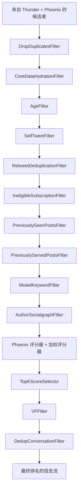

# 其他过滤器 (Additional Filters)

相关源文件

-   [README.md](https://github.com/xai-org/x-algorithm/blob/aaa167b3/README.md?plain=1)
-   [home-mixer/candidate\_pipeline/phoenix\_candidate\_pipeline.rs](https://github.com/xai-org/x-algorithm/blob/aaa167b3/home-mixer/candidate_pipeline/phoenix_candidate_pipeline.rs)

本页面记录了主混频器 (Home Mixer) 流水线中未在 [4.6.1](/xai-org/x-algorithm/4.6.1-agefilter) (AgeFilter) 和 [4.6.2](/xai-org/x-algorithm/4.6.2-authorsocialgraphfilter) 章节涵盖的其他过滤器实现。这些过滤器在评分前阶段和选择后阶段移除不符合条件的候选者。所有过滤器都实现了候选管道框架中的 `Filter<ScoredPostsQuery, PostCandidate>` Trait（有关该 Trait 的详情，请参阅 [3.5](/xai-org/x-algorithm/3.5-filter-trait)）。

此处记录的过滤器包括去重过滤器、内容资格过滤器、用户偏好过滤器以及选择后验证过滤器。它们按定义的顺序执行，以逐步消除不应出现在用户信息流 (feed) 中的候选者。

## 过滤器流水线组织

过滤发生在流水线执行流中的两个不同阶段：

**评分前过滤器 (Pre-Scoring Filters)**：在机器学习评分之前执行，以廉价地消除明显不符合条件的候选者，从而减少昂贵的 Transformer 推理计算成本。

**选择后过滤器 (Post-Selection Filters)**：在 Top-K 选择之后执行，对实际将要提供给用户的候选者进行最终验证，包括内容安全的可见性检查。

来源：[home-mixer/candidate\_pipeline/phoenix\_candidate\_pipeline.rs109-143](https://github.com/xai-org/x-algorithm/blob/aaa167b3/home-mixer/candidate_pipeline/phoenix_candidate_pipeline.rs#L109-L143) [README.md277-298](https://github.com/xai-org/x-algorithm/blob/aaa167b3/README.md?plain=1#L277-L298)

## 评分前过滤器实现

### DropDuplicatesFilter

移除具有重复帖子 ID 的候选者，以确保每个帖子在信息流中最多出现一次。

**实现**：`DropDuplicatesFilter`

**位置**：[home-mixer/filters/drop\_duplicates\_filter.rs](https://github.com/xai-org/x-algorithm/blob/aaa167b3/home-mixer/filters/drop_duplicates_filter.rs)

**目的**：基于推文 ID 消除完全重复的项。如果一个帖子 ID 同时从 Thunder 和 Phoenix 源检索到，或者出现在不同上下文中（原始帖子与转推），则多个候选者可能会引用该 ID。

**过滤逻辑**：

-   使用哈希集合 (HashSet) 跟踪已见到的帖子 ID
-   保留每个帖子 ID 的第一次出现
-   移除所有后续出现

**流水线位置**：评分前链条中的第一个 [home-mixer/candidate\_pipeline/phoenix\_candidate\_pipeline.rs110](https://github.com/xai-org/x-algorithm/blob/aaa167b3/home-mixer/candidate_pipeline/phoenix_candidate_pipeline.rs#L110-L110)

来源：[home-mixer/candidate\_pipeline/phoenix\_candidate\_pipeline.rs110](https://github.com/xai-org/x-algorithm/blob/aaa167b3/home-mixer/candidate_pipeline/phoenix_candidate_pipeline.rs#L110-L110) [README.md282](https://github.com/xai-org/x-algorithm/blob/aaa167b3/README.md?plain=1#L282-L282)

---

### CoreDataHydrationFilter

移除无法充实核心推文元数据的候选者，这表明推文已被删除、无法访问或存在数据完整性问题。

**实现**：`CoreDataHydrationFilter`

**位置**：[home-mixer/filters/core\_data\_hydration\_filter.rs](https://github.com/xai-org/x-algorithm/blob/aaa167b3/home-mixer/filters/core_data_hydration_filter.rs)

**目的**：确保所有剩余的候选者都已成功从推文实体服务 (Tweet Entity Service, TES) 获取基本元数据。没有核心数据的候选者无法被正确显示或评分。

**过滤逻辑**：

-   检查 `PostCandidate.core_data` 字段是否已填充
-   移除充实失败或返回 null 的候选者
-   在 `CoreDataCandidateHydrator` 执行后充当数据质量关卡

**流水线位置**：评分前链条中的第二个，紧跟在去重之后 [home-mixer/candidate\_pipeline/phoenix\_candidate\_pipeline.rs111](https://github.com/xai-org/x-algorithm/blob/aaa167b3/home-mixer/candidate_pipeline/phoenix_candidate_pipeline.rs#L111-L111)

**依赖项**：需要已执行 `CoreDataCandidateHydrator`（参见 [4.5.1](/xai-org/x-algorithm/4.5.1-coredatacandidatehydrator)）

来源：[home-mixer/candidate\_pipeline/phoenix\_candidate\_pipeline.rs111](https://github.com/xai-org/x-algorithm/blob/aaa167b3/home-mixer/candidate_pipeline/phoenix_candidate_pipeline.rs#L111-L111) [README.md283](https://github.com/xai-org/x-algorithm/blob/aaa167b3/README.md?plain=1#L283-L283)

---

### SelfTweetFilter

移除由请求用户本人创作的推文。

**实现**：`SelfTweetFilter`

**位置**：[home-mixer/filters/self\_tweet\_filter.rs](https://github.com/xai-org/x-algorithm/blob/aaa167b3/home-mixer/filters/self_tweet_filter.rs)

**目的**：防止用户在“为您推荐”信息流中看到自己的推文。用户的自有内容会出现在不同的信息流上下文中，但不会出现在推荐中。

**过滤逻辑**：

-   将 `PostCandidate.author_id` 与 `ScoredPostsQuery.user_id` 进行比较
-   移除作者与查看者匹配的候选者

**流水线位置**：评分前链条中的第四个 [home-mixer/candidate\_pipeline/phoenix\_candidate\_pipeline.rs113](https://github.com/xai-org/x-algorithm/blob/aaa167b3/home-mixer/candidate_pipeline/phoenix_candidate_pipeline.rs#L113-L113)

来源：[home-mixer/candidate\_pipeline/phoenix\_candidate\_pipeline.rs113](https://github.com/xai-org/x-algorithm/blob/aaa167b3/home-mixer/candidate_pipeline/phoenix_candidate_pipeline.rs#L113-L113) [README.md285](https://github.com/xai-org/x-algorithm/blob/aaa167b3/README.md?plain=1#L285-L285)

---

### RetweetDeduplicationFilter

对同一底层内容的转推 (retweet) 进行去重，仅保留最相关的实例。

**实现**：`RetweetDeduplicationFilter`

**位置**：[home-mixer/filters/retweet\_deduplication\_filter.rs](https://github.com/xai-org/x-algorithm/blob/aaa167b3/home-mixer/filters/retweet_deduplication_filter.rs)

**目的**：当查看者网络中的多名用户转推同一帖子时，此过滤器确保信息流中仅出现一个实例。这在保留社交信号的同时防止了重复内容。

**过滤逻辑**：

-   通过检查 `PostCandidate.core_data.retweeted_status_id` 来识别转推
-   按底层原始推文 ID 对候选者进行分组
-   保留一个代表（通常是得分最高或最新的）
-   移除同一内容的其他转推

**流水线位置**：评分前链条中的第五个 [home-mixer/candidate\_pipeline/phoenix\_candidate\_pipeline.rs114](https://github.com/xai-org/x-algorithm/blob/aaa167b3/home-mixer/candidate_pipeline/phoenix_candidate_pipeline.rs#L114-L114)

来源：[home-mixer/candidate\_pipeline/phoenix\_candidate\_pipeline.rs114](https://github.com/xai-org/x-algorithm/blob/aaa167b3/home-mixer/candidate_pipeline/phoenix_candidate_pipeline.rs#L114-L114) [README.md286](https://github.com/xai-org/x-algorithm/blob/aaa167b3/README.md?plain=1#L286-L286)

---

### IneligibleSubscriptionFilter

移除查看者无权访问的付费订阅内容。

**实现**：`IneligibleSubscriptionFilter`

**位置**：[home-mixer/filters/ineligible\_subscription\_filter.rs](https://github.com/xai-org/x-algorithm/blob/aaa167b3/home-mixer/filters/ineligible_subscription_filter.rs)

**目的**：当查看者没有所需的订阅时，过滤掉来自订阅作者的付费墙内容。防止显示用户实际上无法查看的内容。

**过滤逻辑**：

-   检查 `PostCandidate.subscription_author_id` 字段（由 `SubscriptionHydrator` 填充）
-   确定查看者是否对该作者有活跃订阅
-   移除查看者无法访问的候选者

**流水线位置**：评分前链条中的第六个 [home-mixer/candidate\_pipeline/phoenix\_candidate\_pipeline.rs115](https://github.com/xai-org/x-algorithm/blob/aaa167b3/home-mixer/candidate_pipeline/phoenix_candidate_pipeline.rs#L115-L115)

**依赖项**：需要 `SubscriptionHydrator` 填充订阅元数据（参见 [4.5.4](/xai-org/x-algorithm/4.5.4-subscriptionhydrator)）

来源：[home-mixer/candidate\_pipeline/phoenix\_candidate\_pipeline.rs115](https://github.com/xai-org/x-algorithm/blob/aaa167b3/home-mixer/candidate_pipeline/phoenix_candidate_pipeline.rs#L115-L115) [README.md287](https://github.com/xai-org/x-algorithm/blob/aaa167b3/README.md?plain=1#L287-L287)

---

### PreviouslySeenPostsFilter

使用参与历史记录 (engagement history) 来跟踪曝光，移除用户之前看过的帖子。

**实现**：`PreviouslySeenPostsFilter`

**位置**：[home-mixer/filters/previously\_seen\_posts\_filter.rs](https://github.com/xai-org/x-algorithm/blob/aaa167b3/home-mixer/filters/previously_seen_posts_filter.rs)

**目的**：防止重复显示用户在之前的会话中已经遇到的内容。提高信息流新鲜度并减少重复。

**过滤逻辑**：

-   使用来自用户动作序列的 `ScoredPostsQuery.seen_post_ids`
-   对比已见集合检查每个候选者的帖子 ID
-   移除匹配的候选者

**流水线位置**：评分前链条中的第七个 [home-mixer/candidate\_pipeline/phoenix\_candidate\_pipeline.rs116](https://github.com/xai-org/x-algorithm/blob/aaa167b3/home-mixer/candidate_pipeline/phoenix_candidate_pipeline.rs#L116-L116)

**数据源**：由 `UserActionSeqQueryHydrator` 填充的 `seen_post_ids`（参见 [4.4](/xai-org/x-algorithm/4.4-query-hydrators)）

来源：[home-mixer/candidate\_pipeline/phoenix\_candidate\_pipeline.rs116](https://github.com/xai-org/x-algorithm/blob/aaa167b3/home-mixer/candidate_pipeline/phoenix_candidate_pipeline.rs#L116-L116) [README.md288](https://github.com/xai-org/x-algorithm/blob/aaa167b3/README.md?plain=1#L288-L288)

---

### PreviouslyServedPostsFilter

移除当前会话或最近请求中已经提供给用户的帖子。

**实现**：`PreviouslyServedPostsFilter`

**位置**：[home-mixer/filters/previously\_served\_posts\_filter.rs](https://github.com/xai-org/x-algorithm/blob/aaa167b3/home-mixer/filters/previously_served_posts_filter.rs)

**目的**：防止在同一会话内出现重复帖子，这种情况可能在用户刷新或加载更多页面时发生。这与使用历史参与数据的 `PreviouslySeenPostsFilter` 不同。

**过滤逻辑**：

-   使用来自查询的 `ScoredPostsQuery.previously_served_post_ids`
-   也可能使用布隆过滤器 (bloom filter) `ScoredPostsQuery.served_post_ids_bloom_filter` 进行高效的成员测试
-   移除匹配已提供 ID 的候选者

**流水线位置**：评分前链条中的第八个 [home-mixer/candidate\_pipeline/phoenix\_candidate\_pipeline.rs117](https://github.com/xai-org/x-algorithm/blob/aaa167b3/home-mixer/candidate_pipeline/phoenix_candidate_pipeline.rs#L117-L117)

**数据源**：来自请求上下文的 `previously_served_post_ids` 和布隆过滤器

来源：[home-mixer/candidate\_pipeline/phoenix\_candidate\_pipeline.rs117](https://github.com/xai-org/x-algorithm/blob/aaa167b3/home-mixer/candidate_pipeline/phoenix_candidate_pipeline.rs#L117-L117) [README.md289](https://github.com/xai-org/x-algorithm/blob/aaa167b3/README.md?plain=1#L289-L289)

---

### MutedKeywordFilter

移除包含用户在偏好设置中明确屏蔽的关键字的帖子。

**实现**：`MutedKeywordFilter`

**位置**：[home-mixer/filters/muted\_keyword\_filter.rs](https://github.com/xai-org/x-algorithm/blob/aaa167b3/home-mixer/filters/muted_keyword_filter.rs)

**目的**：通过过滤匹配其屏蔽关键字列表的帖子来尊重用户的内容偏好。使用户能够避开特定的主题或词汇。

**过滤逻辑**：

-   从用户特征或偏好中检索用户的屏蔽关键字
-   扫描 `PostCandidate.core_data.text` 以匹配关键字
-   执行不区分大小写的匹配
-   移除包含任何屏蔽关键字的候选者

**实例化**：使用 `MutedKeywordFilter::new()` 创建 [home-mixer/candidate\_pipeline/phoenix\_candidate\_pipeline.rs118](https://github.com/xai-org/x-algorithm/blob/aaa167b3/home-mixer/candidate_pipeline/phoenix_candidate_pipeline.rs#L118-L118)

**流水线位置**：评分前链条中的第九个 [home-mixer/candidate\_pipeline/phoenix\_candidate\_pipeline.rs118](https://github.com/xai-org/x-algorithm/blob/aaa167b3/home-mixer/candidate_pipeline/phoenix_candidate_pipeline.rs#L118-L118)

来源：[home-mixer/candidate\_pipeline/phoenix\_candidate\_pipeline.rs118](https://github.com/xai-org/x-algorithm/blob/aaa167b3/home-mixer/candidate_pipeline/phoenix_candidate_pipeline.rs#L118-L118) [README.md290](https://github.com/xai-org/x-algorithm/blob/aaa167b3/README.md?plain=1#L290-L290)

---

## 选择后过滤器实现

选择后过滤器在 `TopKScoreSelector` 根据机器学习分数选出顶级候选者后执行。这些过滤器仅对实际将要提供给用户的候选者执行昂贵或最终验证检查。

### VFFilter

应用可见性过滤规则，移除违反平台政策或不可用的内容。

**实现**：`VFFilter`

**位置**：[home-mixer/filters/vf\_filter.rs](https://github.com/xai-org/x-algorithm/blob/aaa167b3/home-mixer/filters/vf_filter.rs)

**目的**：使用可见性过滤服务 (Visibility Filtering Service) 进行最终内容安全检查。移除以下帖子：

-   已删除或被停用的
-   被标记为垃圾邮件的
-   包含写实暴力或血腥内容的
-   违反其他平台安全政策的

**过滤逻辑**：

-   检查由 `VFCandidateHydrator` 填充的 `PostCandidate.vf_result` 字段
-   审查可见性过滤结论和原因
-   移除被标记为过滤掉的候选者
-   不同的安全级别适用于网内 (in-network) 与网外 (out-of-network) 内容

**流水线位置**：第一个选择后过滤器 [home-mixer/candidate\_pipeline/phoenix\_candidate\_pipeline.rs143](https://github.com/xai-org/x-algorithm/blob/aaa167b3/home-mixer/candidate_pipeline/phoenix_candidate_pipeline.rs#L143-L143)

**依赖项**：需要选择后充实阶段中的 `VFCandidateHydrator`（参见 [4.5.5](/xai-org/x-algorithm/4.5.5-vfcandidatehydrator)）

**选择后的理由**：可见性过滤计算成本高且需要充实数据。通过在选择后应用，系统仅验证前 K 个候选者而非所有候选者，从而减少延迟和服务负载。

来源：[home-mixer/candidate\_pipeline/phoenix\_candidate\_pipeline.rs139-143](https://github.com/xai-org/x-algorithm/blob/aaa167b3/home-mixer/candidate_pipeline/phoenix_candidate_pipeline.rs#L139-L143) [README.md295-296](https://github.com/xai-org/x-algorithm/blob/aaa167b3/README.md?plain=1#L295-L296)

---

### DedupConversationFilter

对同一对话线程的多个帖子进行去重，防止信息流被单一讨论占据。

**实现**：`DedupConversationFilter`

**位置**：[home-mixer/filters/dedup\_conversation\_filter.rs](https://github.com/xai-org/x-algorithm/blob/aaa167b3/home-mixer/filters/dedup_conversation_filter.rs)

**目的**：当一个对话线程中的多个帖子排名都很高时，此过滤器确保仅显示一个分支或回复。防止来自同一讨论的重复内容。

**过滤逻辑**：

-   使用 `PostCandidate.core_data.conversation_id` 识别对话线程
-   按对话分组候选者
-   保留每个对话中得分最高的代表
-   移除来自同一线程的其他帖子

**流水线位置**：第二个（最终）选择后过滤器 [home-mixer/candidate\_pipeline/phoenix\_candidate\_pipeline.rs143](https://github.com/xai-org/x-algorithm/blob/aaa167b3/home-mixer/candidate_pipeline/phoenix_candidate_pipeline.rs#L143-L143)

**选择后的理由**：对话去重需要比较评分后的候选者以确定哪个分支最相关，因此它必须在评分和选择之后发生。

来源：[home-mixer/candidate\_pipeline/phoenix\_candidate\_pipeline.rs143](https://github.com/xai-org/x-algorithm/blob/aaa167b3/home-mixer/candidate_pipeline/phoenix_candidate_pipeline.rs#L143-L143) [README.md297](https://github.com/xai-org/x-algorithm/blob/aaa167b3/README.md?plain=1#L297-L297)

---

## 过滤器实现详情

```mermaid
flowchart TD
    classId_Filter_55["«Trait»"]
    classId_FilterResult_56["FilterResult<C>"]
    classId_DropDuplicatesFilter_57["DropDuplicatesFilter"]
    classId_CoreDataHydrationFilter_58["CoreDataHydrationFilter"]
    classId_SelfTweetFilter_59["SelfTweetFilter"]
    classId_RetweetDeduplicationFilter_60["RetweetDeduplicationFilter"]
    classId_IneligibleSubscriptionFilter_61["IneligibleSubscriptionFilter"]
    classId_PreviouslySeenPostsFilter_62["PreviouslySeenPostsFilter"]
    classId_PreviouslyServedPostsFilter_63["PreviouslyServedPostsFilter"]
    classId_MutedKeywordFilter_64["MutedKeywordFilter"]
    classId_VFFilter_65["VFFilter"]
    classId_DedupConversationFilter_66["DedupConversationFilter"]
```

所有过滤器都实现了 `Filter<ScoredPostsQuery, PostCandidate>` Trait，该特性定义了 `filter` 方法：

来源：[home-mixer/candidate\_pipeline/phoenix\_candidate\_pipeline.rs22-33](https://github.com/xai-org/x-algorithm/blob/aaa167b3/home-mixer/candidate_pipeline/phoenix_candidate_pipeline.rs#L22-L33)

---

## 过滤器执行流

下图显示了过滤器如何逐步减少候选者集合：

```mermaid
flowchart TD
    Start["初始候选者 (Thunder + Phoenix)\n~500-1000 个"]
    DD["DropDuplicatesFilter\n移除重复 ID"]
    DD_Result["~400-900 个候选者"]
    CDH["CoreDataHydrationFilter\n移除充实失败项"]
    CDH_Result["~390-880 个候选者"]
    Age["AgeFilter\n移除旧帖子"]
    Age_Result["~370-850 个候选者"]
    Self["SelfTweetFilter\n移除自有帖子"]
    Self_Result["~368-845 个候选者"]
    Retweet["RetweetDeduplicationFilter\n转推去重"]
    Retweet_Result["~340-800 个候选者"]
    Sub["IneligibleSubscriptionFilter\n移除无法访问的内容"]
    Sub_Result["~335-795 个候选者"]
    Seen["PreviouslySeenPostsFilter\n移除已见帖子"]
    Seen_Result["~280-700 个候选者"]
    Served["PreviouslyServedPostsFilter\n移除最近提供项"]
    Served_Result["~270-690 个候选者"]
    Muted["MutedKeywordFilter\n移除屏蔽关键字"]
    Muted_Result["~265-685 个候选者"]
    SG["AuthorSocialgraphFilter\n移除被屏蔽/静音的作者"]
    SG_Result["~260-680 个候选者\n(评分前完成)"]
    Score["Phoenix 评分 + 加权评分"]
    Score_Result["~260-680 个已评分候选者"]
    Select["TopKScoreSelector\n选择前 K 个"]
    Select_Result["前 50-100 个候选者"]
    VF["VFFilter\n可见性过滤"]
    VF_Result["~48-98 个候选者"]
    Conv["DedupConversationFilter\n对话去重"]
    Final["最终 45-95 个用于 Feed 显示的候选者"]

    Start --> DD
    DD --> DD_Result
    DD --> Result_CDH
    CDH --> CDH_Result
    CDH --> Result_Age
    Age --> Age_Result
    Age --> Result_Self
    Self --> Self_Result
    Self --> Result_Retweet
    Retweet --> Retweet_Result
    Retweet --> Result_Sub
    Sub --> Sub_Result
    Sub --> Result_Seen
    Seen --> Seen_Result
    Seen --> Result_Served
    Served --> Served_Result
    Served --> Result_Muted
    Muted --> Muted_Result
    Muted --> Result_SG
    SG --> SG_Result
    SG --> Result_Score
    Score --> Score_Result
    Score --> Result_Select
    Select --> Select_Result
    Select --> Result_VF
    VF --> VF_Result
    VF --> Result_Conv
    Conv --> Final
```

**注意**：候选者计数是近似值，根据用户活动、网络规模和内容可用性而有所不同。数字仅说明了通过过滤器链条的逐步减少过程。

来源：[home-mixer/candidate\_pipeline/phoenix\_candidate\_pipeline.rs109-143](https://github.com/xai-org/x-algorithm/blob/aaa167b3/home-mixer/candidate_pipeline/phoenix_candidate_pipeline.rs#L109-L143) [README.md277-298](https://github.com/xai-org/x-algorithm/blob/aaa167b3/README.md?plain=1#L277-L298)

---

## 过滤器配置

过滤器在 `PhoenixCandidatePipeline::build_with_clients()` 中被实例化，并存储在向量中以进行顺序执行：

```mermaid
flowchart TD
    SF1["VFFilter"]
    SF2["DedupConversationFilter"]
    PF1["DropDuplicatesFilter"]
    PF2["CoreDataHydrationFilter"]
    PF3["AgeFilter"]
    PF4["SelfTweetFilter"]
    PF5["RetweetDeduplicationFilter"]
    PF6["IneligibleSubscriptionFilter"]
    PF7["PreviouslySeenPostsFilter"]
    PF8["PreviouslyServedPostsFilter"]
    PF9["MutedKeywordFilter"]
    PF10["AuthorSocialgraphFilter"]
    PreFilters["filters: Vec<Box<dyn Filter>>"]
    PostFilters["post_selection_filters: Vec<Box<dyn Filter>>"]

    PreFilters --> PreScoring
    PostFilters --> PostScoring
```

评分前过滤器定义在 [home-mixer/candidate\_pipeline/phoenix\_candidate\_pipeline.rs109-120](https://github.com/xai-org/x-algorithm/blob/aaa167b3/home-mixer/candidate_pipeline/phoenix_candidate_pipeline.rs#L109-L120)

选择后过滤器定义在 [home-mixer/candidate\_pipeline/phoenix\_candidate\_pipeline.rs142-143](https://github.com/xai-org/x-algorithm/blob/aaa167b3/home-mixer/candidate_pipeline/phoenix_candidate_pipeline.rs#L142-L143)

来源：[home-mixer/candidate\_pipeline/phoenix\_candidate\_pipeline.rs60-70](https://github.com/xai-org/x-algorithm/blob/aaa167b3/home-mixer/candidate_pipeline/phoenix_candidate_pipeline.rs#L60-L70) [home-mixer/candidate\_pipeline/phoenix\_candidate\_pipeline.rs109-143](https://github.com/xai-org/x-algorithm/blob/aaa167b3/home-mixer/candidate_pipeline/phoenix_candidate_pipeline.rs#L109-L143)

---

## 过滤器性能特性

| 过滤器 | 复杂度 | 数据依赖项 | 执行成本 |
| --- | --- | --- | --- |
| `DropDuplicatesFilter` | O(n) | 无 | 极低 (哈希集合) |
| `CoreDataHydrationFilter` | O(n) | CoreDataCandidateHydrator | 极低 (字段检查) |
| `SelfTweetFilter` | O(n) | 无 | 极低 (ID 比较) |
| `RetweetDeduplicationFilter` | O(n) | CoreDataCandidateHydrator | 低 (分组 + 选择) |
| `IneligibleSubscriptionFilter` | O(n) | SubscriptionHydrator | 低 (字段检查 + 查找) |
| `PreviouslySeenPostsFilter` | O(n) | UserActionSeqQueryHydrator | 低 (哈希集合查找) |
| `PreviouslyServedPostsFilter` | O(n) | 请求上下文 | 低 (布隆过滤器 + 集合) |
| `MutedKeywordFilter` | O(n\*m) | 用户偏好 | 中 (文本扫描) |
| `VFFilter` | O(n) | VFCandidateHydrator | 低 (字段检查) |
| `DedupConversationFilter` | O(n) | CoreDataCandidateHydrator | 低 (分组 + 选择) |

**注意**：n = 候选者数量，m = 每篇帖子的平均关键字计数

评分前链条中过滤器的顺序执行设计为优先应用最廉价的过滤器，在执行更昂贵的操作之前逐步减少候选者集合。

来源：[home-mixer/candidate\_pipeline/phoenix\_candidate\_pipeline.rs109-143](https://github.com/xai-org/x-algorithm/blob/aaa167b3/home-mixer/candidate_pipeline/phoenix_candidate_pipeline.rs#L109-L143)

---

## 汇总表

| 过滤器 | 阶段 | 主要目的 | 数据源 |
| --- | --- | --- | --- |
| `DropDuplicatesFilter` | 评分前 | 消除重复帖子 ID | 候选者 ID |
| `CoreDataHydrationFilter` | 评分前 | 移除充实失败项 | CoreDataCandidateHydrator |
| `SelfTweetFilter` | 评分前 | 移除查看者本人的帖子 | 查询 user\_id |
| `RetweetDeduplicationFilter` | 评分前 | 去重同一底层内容 | CoreDataCandidateHydrator |
| `IneligibleSubscriptionFilter` | 评分前 | 移除无法访问的付费内容 | SubscriptionHydrator |
| `PreviouslySeenPostsFilter` | 评分前 | 移除历史已见帖子 | UserActionSeqQueryHydrator |
| `PreviouslyServedPostsFilter` | 评分前 | 移除最近提供项 | 请求上下文 |
| `MutedKeywordFilter` | 评分前 | 尊重屏蔽关键字偏好 | 用户偏好 |
| `VFFilter` | 选择后 | 内容安全验证 | VFCandidateHydrator |
| `DedupConversationFilter` | 选择后 | 防止线程主导 | CoreDataCandidateHydrator |

来源：[home-mixer/candidate\_pipeline/phoenix\_candidate\_pipeline.rs109-143](https://github.com/xai-org/x-algorithm/blob/aaa167b3/home-mixer/candidate_pipeline/phoenix_candidate_pipeline.rs#L109-L143) [README.md277-298](https://github.com/xai-org/x-algorithm/blob/aaa167b3/README.md?plain=1#L277-L298)
