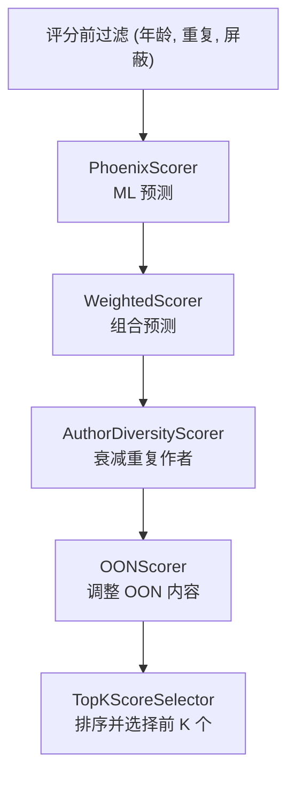
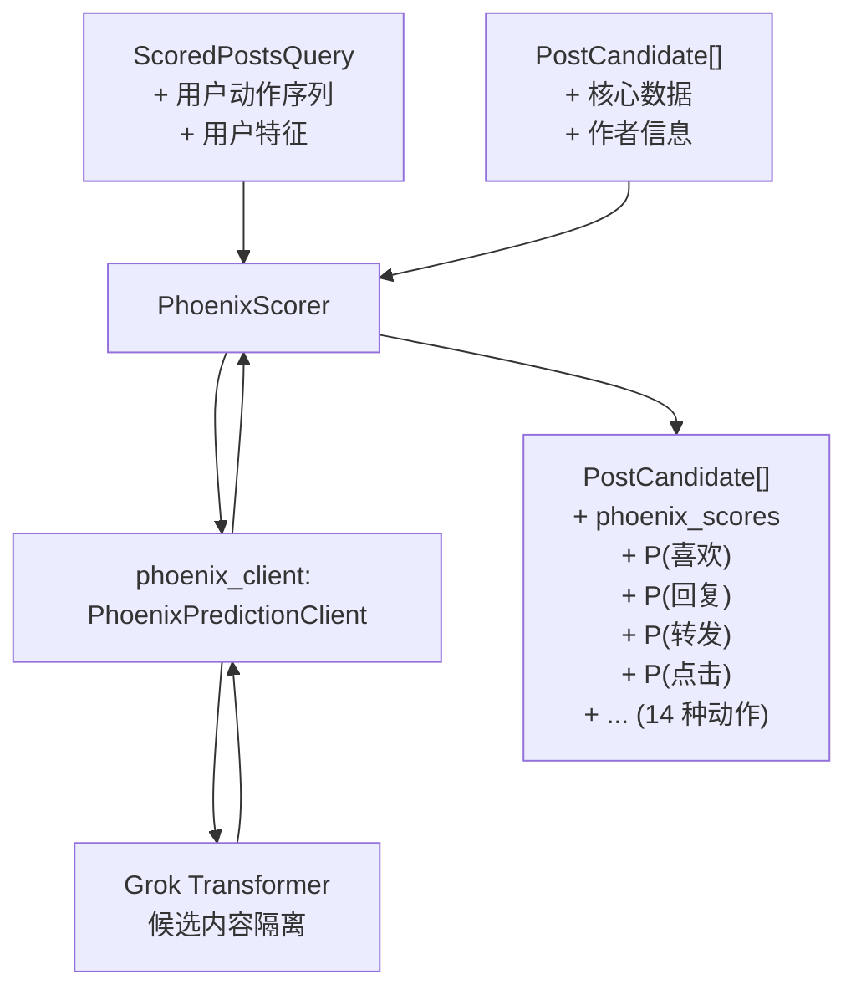
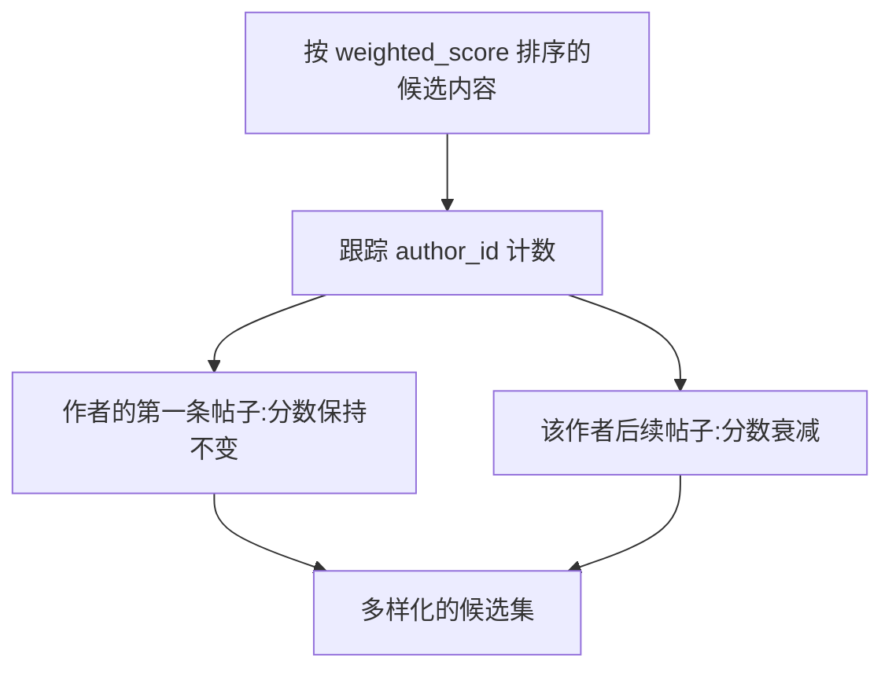
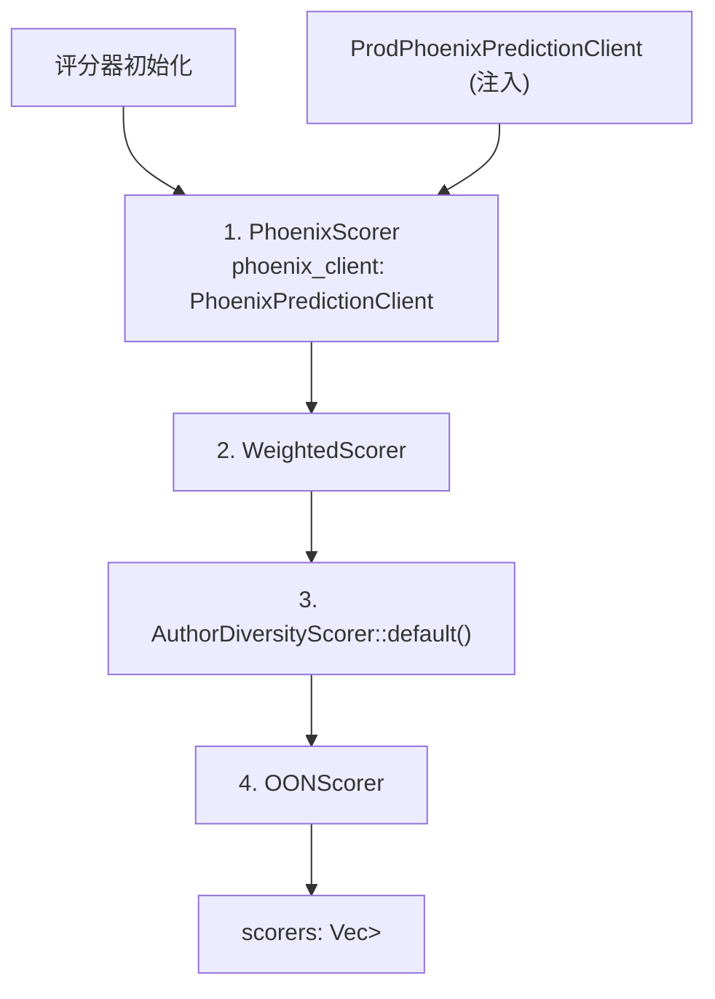
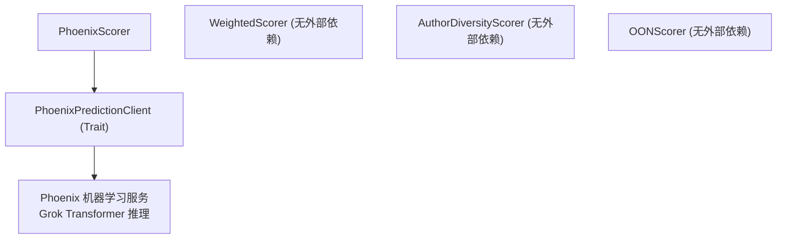

# 评分器 (Scorers)

相关源文件

-   [README.md](https://github.com/xai-org/x-algorithm/blob/aaa167b3/README.md?plain=1)
-   [home-mixer/candidate\_pipeline/phoenix\_candidate\_pipeline.rs](https://github.com/xai-org/x-algorithm/blob/aaa167b3/home-mixer/candidate_pipeline/phoenix_candidate_pipeline.rs)

## 目的与范围

本文档描述了主混频器 (Home Mixer) 流水线中的评分实现。评分器负责为候选内容分配数值分数，从而决定它们在“为你推荐 (For You)”信息流中的最终排名。流水线使用四个顺序执行的评分器，每个评分器都会基于前一阶段的分数进行构建或修改：

1.  **PhoenixScorer**: 使用 Grok transformer 生成基于机器学习的参与度预测
2.  **WeightedScorer**: 将预测结果组合成单一的相关性分数
3.  **AuthorDiversityScorer**: 对重复作者的分数进行衰减，以确保多样性
4.  **OONScorer**: 应用针对网外 (out-of-network) 内容的特定调整

有关通用 `Scorer` Trait 抽象的信息，请参见 [Scorer Trait](/xai-org/x-algorithm/3.6-scorer-trait)。有关驱动 PhoenixScorer 的 Phoenix 机器学习服务的详细信息，请参见 [Phoenix ML Services](/xai-org/x-algorithm/5.5-phoenix-ml-services)。

**来源:** [README.md230-240](https://github.com/xai-org/x-algorithm/blob/aaa167b3/README.md?plain=1#L230-L240) [home-mixer/candidate\_pipeline/phoenix\_candidate\_pipeline.rs122-132](https://github.com/xai-org/x-algorithm/blob/aaa167b3/home-mixer/candidate_pipeline/phoenix_candidate_pipeline.rs#L122-L132)

---

## 在流水线中的作用

评分器在候选内容充实 (hydration) 和评分前过滤完成后执行。在此阶段，流水线拥有一组经过过滤且丰富的候选内容，需要进行排名。评分器按顺序运行（而非并行），因为每个评分器可能依赖于前一个评分器设置的分数或字段。


**图表:** Phoenix 候选管道中的顺序评分器执行流程

**来源:** [home-mixer/candidate\_pipeline/phoenix\_candidate\_pipeline.rs122-136](https://github.com/xai-org/x-algorithm/blob/aaa167b3/home-mixer/candidate_pipeline/phoenix_candidate_pipeline.rs#L122-L136) [README.md230-237](https://github.com/xai-org/x-algorithm/blob/aaa167b3/README.md?plain=1#L230-L237)

---

## Scorer Trait 实现

每个评分器都实现了候选管道框架中定义的 `Scorer<ScoredPostsQuery, PostCandidate>` Trait。该 Trait 要求实现一个方法：

```rust
async fn score(
    &self,
    query: &ScoredPostsQuery,
    candidates: &mut [PostCandidate]
) -> Result<(), ScorerError>
```
评分器通过就地修改 `candidates` 切片来运行，在每个 `PostCandidate` 结构体上添加或修改分数属性。顺序执行确保下游评分器可以读取上游评分器设置的字段。

**来源:** [home-mixer/candidate\_pipeline/phoenix\_candidate\_pipeline.rs52-54](https://github.com/xai-org/x-algorithm/blob/aaa167b3/home-mixer/candidate_pipeline/phoenix_candidate_pipeline.rs#L52-L54)

---

## Phoenix 评分器

`PhoenixScorer` 是主要的评分组件，它使用 Phoenix 机器学习服务为每个候选内容生成参与概率预测。

### 架构


**图表:** PhoenixScorer 架构和数据流

### 参与度预测

基于 Grok 的 Phoenix transformer 模型预测 14 种不同参与类型的概率。这些预测涵盖了正面参与信号（表明感兴趣的操作）和负面信号（表明不感兴趣的操作）：

| 预测字段 | 描述 | 信号类型 |
| --- | --- | --- |
| `P(favorite)` | 用户点赞帖子的概率 | 正面 |
| `P(reply)` | 用户回复帖子的概率 | 正面 |
| `P(repost)` | 用户转发的概率 | 正面 |
| `P(quote)` | 用户引用推文的概率 | 正面 |
| `P(click)` | 用户点击进入帖子的概率 | 正面 |
| `P(profile_click)` | 用户点击作者个人资料的概率 | 正面 |
| `P(video_view)` | 用户观看视频的概率 | 正面 |
| `P(photo_expand)` | 用户展开照片的概率 | 正面 |
| `P(share)` | 用户通过外部方式分享的概率 | 正面 |
| `P(dwell)` | 用户停留/逗留在帖子上的概率 | 正面 |
| `P(follow_author)` | 用户关注作者的概率 | 正面 |
| `P(not_interested)` | 用户标记“不感兴趣”的概率 | 负面 |
| `P(block_author)` | 用户屏蔽作者的概率 | 负面 |
| `P(mute_author)` | 用户静音作者的概率 | 负面 |
| `P(report)` | 用户举报帖子的概率 | 负面 |

这些预测存储在每个 `PostCandidate` 的 `phoenix_scores` 字段中，供下游评分器使用。

### 模型特性

Phoenix 排序器使用基于 Grok 的 transformer 架构，并带有强制执行 **候选内容隔离 (candidate isolation)** 的特殊注意力掩码。这意味着：

-   候选内容在推理过程中不能相互关注
-   每个候选内容仅关注用户上下文（参与历史）
-   无论批次中有哪些其他候选内容，分数都是一致的
-   分数可以按（用户，帖子）对进行缓存

这一设计决策对于维持分数一致性和启用缓存优化至关重要。

**来源:** [README.md245-263](https://github.com/xai-org/x-algorithm/blob/aaa167b3/README.md?plain=1#L245-L263) [README.md176-182](https://github.com/xai-org/x-algorithm/blob/aaa167b3/README.md?plain=1#L176-L182) [home-mixer/candidate\_pipeline/phoenix\_candidate\_pipeline.rs123](https://github.com/xai-org/x-algorithm/blob/aaa167b3/home-mixer/candidate_pipeline/phoenix_candidate_pipeline.rs#L123-L123)

---

## 加权评分器 (Weighted Scorer)

`WeightedScorer` 使用加权线性组合将来自 PhoenixScorer 的多个参与概率组合成单一的相关性分数。

### 分数计算

加权分数计算如下：

```rust
weighted_score = Σ (weight_i × P(action_i))
```
其中：

-   正面动作（点赞、回复、转发等）具有 **正权重**
-   负面动作（屏蔽、静音、举报）具有 **负权重**

该公式产生一个标量值，代表帖子对用户的总体预测相关性。具有高正面参与概率的帖子获得高分，而具有高负面参与概率的帖子其分数会被降低。

### 权重配置

具体的权重值在代码库中配置，并可以进行调整以强调不同类型的参与。例如：

-   `P(favorite)` 的高权重强调用户可能喜欢的帖子
-   `P(not_interested)` 的负权重压低用户认为无关的内容
-   `P(reply)` 和 `P(repost)` 的权重鼓励引发对话的内容

最终的 `weighted_score` 字段被写入每个 `PostCandidate`，并作为排名的主要分数。

**来源:** [README.md265-272](https://github.com/xai-org/x-algorithm/blob/aaa167b3/README.md?plain=1#L265-L272) [home-mixer/candidate\_pipeline/phoenix\_candidate\_pipeline.rs124](https://github.com/xai-org/x-algorithm/blob/aaa167b3/home-mixer/candidate_pipeline/phoenix_candidate_pipeline.rs#L124-L124)

---

## 作者多样性评分器 (Author Diversity Scorer)

`AuthorDiversityScorer` 通过衰减在候选集中已有多个帖子的作者的候选内容分数，来确保信息流的多样性。

### 多样性机制


**图表:** 作者多样性评分衰减逻辑

该评分器处理候选内容，并对在候选列表前面已经出现过的作者的帖子应用惩罚因子。这防止了单个高产作者主导信息流，即使他们的所有帖子都有很高的相关性分数。

### 实现细节

`AuthorDiversityScorer` 使用默认参数实例化：

```rust
let author_diversity_scorer = Box::new(AuthorDiversityScorer::default());
```
衰减通常通过以下方式工作：

1.  跟踪已见过的 `author_id` 值
2.  对于每个重复出现的作者，对 `weighted_score` 应用乘法惩罚
3.  惩罚可能会随着同一作者的额外帖子增加而增加

这确保了用户能看到来自不同作者的内容，而不是集中在少数高参与度创作者身上。

**来源:** [README.md99-101](https://github.com/xai-org/x-algorithm/blob/aaa167b3/README.md?plain=1#L99-L101) [home-mixer/candidate\_pipeline/phoenix\_candidate\_pipeline.rs125](https://github.com/xai-org/x-algorithm/blob/aaa167b3/home-mixer/candidate_pipeline/phoenix_candidate_pipeline.rs#L125-L125)

---

## OON 评分器

`OONScorer` 专门对从 Phoenix Retrieval 检索到的网外 (out-of-network) 候选内容应用分数调整。该评分器根据候选内容是网内还是网外来修改最终分数。

### 目的

网外内容需要不同的评分处理，因为：

-   用户与作者之间没有先前的关系
-   发现类内容可能需要不同的阈值
-   双塔检索模型提供的质量信号与网内 Thunder 不同

`OONScorer` 读取 `is_in_network` 字段（由 `InNetworkCandidateHydrator` 在充实期间设置）并相应地调整分数。

### 分数调整

具体的调整可能包括：

-   按一定比例缩放 OON 分数，以平衡网内与 OON 内容
-   对 OON 内容应用最小质量阈值
-   根据来自 Phoenix Retrieval 的检索置信度分数进行调整

**来源:** [home-mixer/candidate\_pipeline/phoenix\_candidate\_pipeline.rs126](https://github.com/xai-org/x-algorithm/blob/aaa167b3/home-mixer/candidate_pipeline/phoenix_candidate_pipeline.rs#L126-L126)

---

## 评分器流水线初始化

在流水线构建期间，评分器按特定顺序实例化并注册到流水线中：


**图表:** 流水线构建中的评分器实例化顺序

实例化的顺序很重要，因为评分器按照它们在 `scorers` 向量中出现的顺序执行。顺序流水线确保：

1.  `PhoenixScorer` 首先运行以生成原始机器学习预测
2.  `WeightedScorer` 将这些预测组合成单一分数
3.  `AuthorDiversityScorer` 为多样性进行衰减
4.  `OONScorer` 根据内容来源应用最终调整

**来源:** [home-mixer/candidate\_pipeline/phoenix\_candidate\_pipeline.rs122-132](https://github.com/xai-org/x-algorithm/blob/aaa167b3/home-mixer/candidate_pipeline/phoenix_candidate_pipeline.rs#L122-L132)

---

## 分数属性构成

下表显示了 `PostCandidate` 上与分数相关的字段是如何被每个评分器逐步设置的：

| 评分器 | 写入字段 | 读取字段 | 依赖项 |
| --- | --- | --- | --- |
| `PhoenixScorer` | `phoenix_scores` (全部 14 种概率) | `user_action_sequence`, `core_data` | `PhoenixPredictionClient` |
| `WeightedScorer` | `weighted_score` | `phoenix_scores` | 无 |
| `AuthorDiversityScorer` | `weighted_score` (已修改) | `weighted_score`, `author_id` | 无 |
| `OONScorer` | `weighted_score` (已修改) | `weighted_score`, `is_in_network` | 无 |

在所有评分器执行完毕后，`weighted_score` 字段包含最终分数，供 `TopKScoreSelector` 用于对候选内容进行排序并选择前 K 个结果。

**来源:** [home-mixer/candidate\_pipeline/phoenix\_candidate\_pipeline.rs122-136](https://github.com/xai-org/x-algorithm/blob/aaa167b3/home-mixer/candidate_pipeline/phoenix_candidate_pipeline.rs#L122-L136)

---

## 与外部服务的集成

评分器通过客户端抽象与外部服务集成：


**图表:** 评分器对外部服务的依赖

只有 `PhoenixScorer` 需要与外部服务通信。其他评分器纯粹对查询和候选内容中已存在的数据进行操作，使其轻量化且具有确定性。

`PhoenixPredictionClient` 抽象了与 Phoenix 机器学习服务的通信，该服务运行 Grok transformer 模型以生成预测。有关客户端接口和 Phoenix 服务集成的详细信息，请参见 [Phoenix ML Services](/xai-org/x-algorithm/5.5-phoenix-ml-services)。

**来源:** [home-mixer/candidate\_pipeline/phoenix\_candidate\_pipeline.rs10-12](https://github.com/xai-org/x-algorithm/blob/aaa167b3/home-mixer/candidate_pipeline/phoenix_candidate_pipeline.rs#L10-L12) [home-mixer/candidate\_pipeline/phoenix\_candidate\_pipeline.rs123](https://github.com/xai-org/x-algorithm/blob/aaa167b3/home-mixer/candidate_pipeline/phoenix_candidate_pipeline.rs#L123-L123)

---

## 总结

评分阶段通过四个顺序评分器将丰富且经过过滤的候选内容转换为排序列表：

1.  **PhoenixScorer** 使用 Grok transformer 生成 14 种参与概率预测
2.  **WeightedScorer** 使用正面和负面权重将预测组合成单一的相关性分数
3.  **AuthorDiversityScorer** 对重复作者进行分数衰减以确保多样性
4.  **OONScorer** 为网外内容应用最终调整

这种多阶段评分方法实现了关注点分离：机器学习预测生成、分数构成、多样性强制执行以及特定内容类型的调整。顺序执行允许每个评分器基于先前的结果进行构建，同时保持清晰的责任分离。

每个 `PostCandidate` 上的最终 `weighted_score` 字段由 `TopKScoreSelector` 使用，以对候选内容进行排序并为“为你推荐”信息流选择前 K 个结果。

**来源:** [home-mixer/candidate\_pipeline/phoenix\_candidate\_pipeline.rs122-136](https://github.com/xai-org/x-algorithm/blob/aaa167b3/home-mixer/candidate_pipeline/phoenix_candidate_pipeline.rs#L122-L136) [README.md230-240](https://github.com/xai-org/x-algorithm/blob/aaa167b3/README.md?plain=1#L230-L240)
