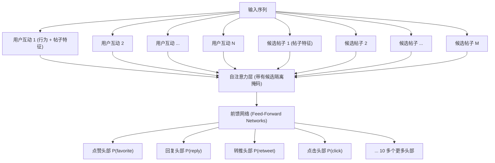
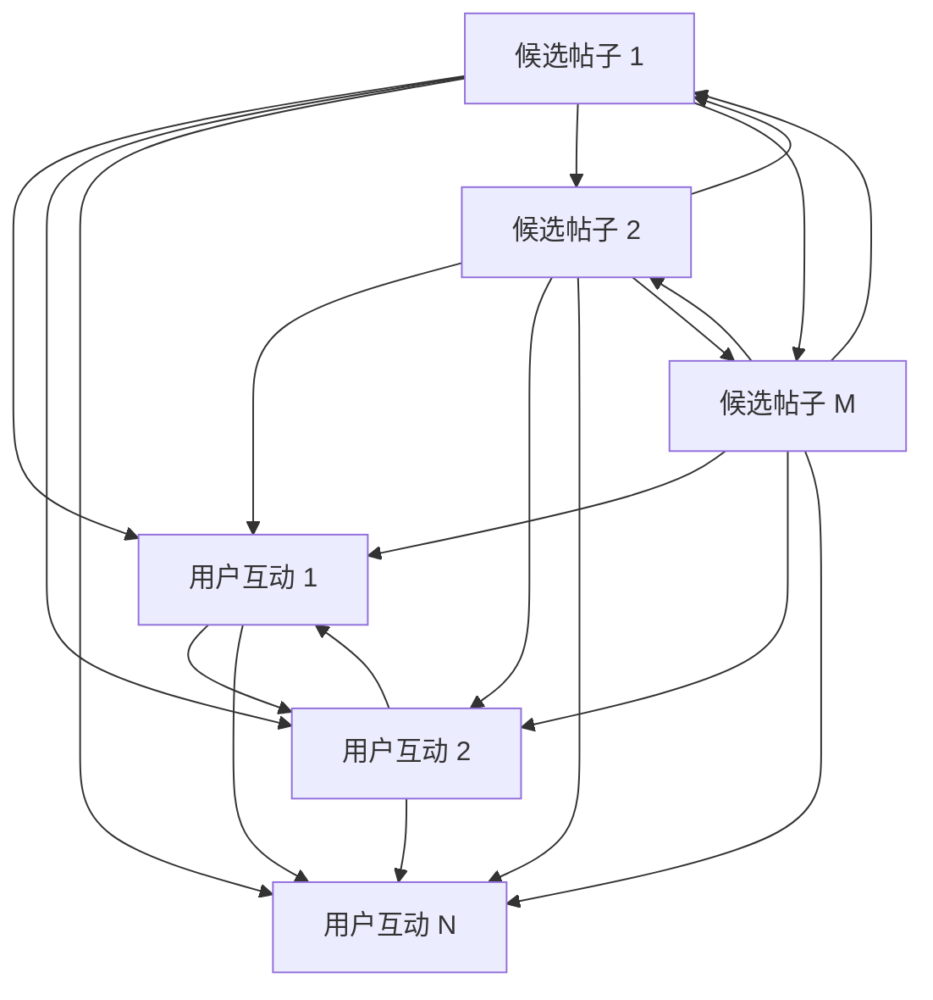
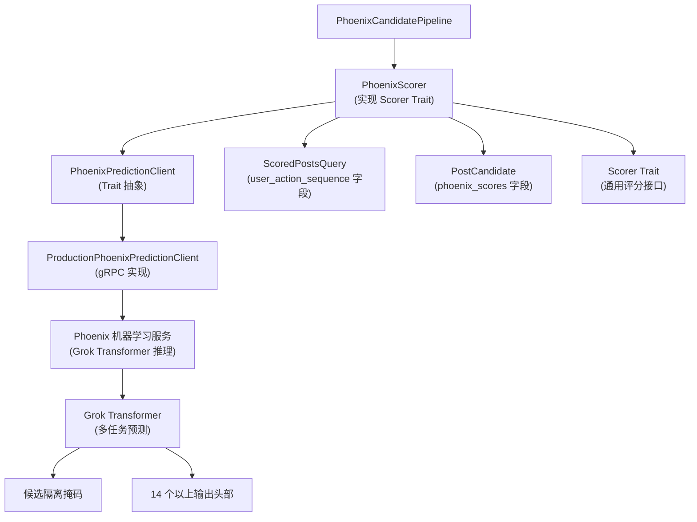

# Phoenix 评分器 (Phoenix Scorer)

相关源文件

-   [README.md](https://github.com/xai-org/x-algorithm/blob/aaa167b3/README.md?plain=1)

## 目的与范围

Phoenix 评分器 (Phoenix Scorer) 是一个评分器实现，它使用基于 Grok 的 Transformer 模型来预测候选帖子的互动概率。它为每个候选帖子分配多个概率分数，代表不同用户行为（点赞、回复、转推等）的可能性。该组件负责流水线中主要的基于机器学习 (ML) 的评分，随后由下游评分器进行组合。

有关将这些预测组合成最终分数的更多信息，请参阅[加权评分器 (Weighted Scorer)](/xai-org/x-algorithm/4.7.2-weighted-scorer)。有关其他评分机制（如多样性调整），请参阅[作者多样性与 OON 评分器 (Author Diversity and OON Scorers)](/xai-org/x-algorithm/4.7.3-author-diversity-and-oon-scorers)。

---

## 概述

`PhoenixScorer` 是一个顺序执行的评分器，它通过适配自 Grok-1 开源版本的基于 Grok 的 Transformer 模型来处理候选帖子。与输出单一相关性分数的传统排名模型不同，Phoenix 同时预测多种互动类型的概率，从而能够精细地理解用户可能如何与内容进行交互。

该评分器作为主混频器 (Home Mixer) 候选管道的一部分实现，并通过 `PhoenixPredictionClient` 接口与 Phoenix 机器学习服务集成。

**关键特性：**

-   **顺序执行 (Sequential Execution)**：在单个批处理请求中处理候选帖子。
-   **多任务预测 (Multi-Task Prediction)**：输出 14 种以上不同互动类型的概率。
-   **候选隔离 (Candidate Isolation)**：使用注意力掩码 (Attention Masking) 防止候选帖子之间相互干扰。
-   **可缓存分数 (Cacheable Scores)**：一致的分数使得能够对之前见过的候选帖子进行缓存。

来源：[README.md1-326](https://github.com/xai-org/x-algorithm/blob/aaa167b3/README.md?plain=1#L1-L326)

---

## 模型架构

Phoenix 评分器采用源自 Grok-1 的 Transformer 架构，专门针对推荐用例进行了适配。该模型同时处理用户信息（互动历史）和候选帖子，以生成互动预测。

### Transformer 结构


**图表：带有多头输出的 Phoenix Transformer 架构**

Transformer 将用户互动历史与候选帖子一起处理，应用注意力掩码来实现候选隔离。每个输出头预测特定的互动类型概率。

来源：[README.md176-182](https://github.com/xai-org/x-algorithm/blob/aaa167b3/README.md?plain=1#L176-L182) [README.md244-263](https://github.com/xai-org/x-algorithm/blob/aaa167b3/README.md?plain=1#L244-L263)

---

## 候选隔离机制

Phoenix 评分器的一个关键设计决策是**候选隔离 (Candidate Isolation)**：候选帖子在 Transformer 推理期间不能相互关注 (Attend to)。这是通过专门的注意力掩码实现的，该掩码仅允许候选帖子关注用户上下文 (User Context) 标记。

### 注意力掩码模式


**图表：候选隔离注意力掩码**

### 候选隔离的好处

| 好处 | 描述 |
| --- | --- |
| **分数一致性** | 候选帖子的分数独立于批次中的其他候选帖子 |
| **启用缓存** | 分数可以被缓存并在不同的请求上下文中重用 |
| **确定性排名** | 对于给定的用户状态，相同的候选帖子始终获得相同的分数 |
| **批次大小不变性** | 无论批次组成如何，分数都保持一致 |

这种设计与传统的 Transformer 排名模型形成对比，在传统模型中，候选帖子可以相互关注，使得分数取决于整个候选集。

来源：[README.md176-182](https://github.com/xai-org/x-algorithm/blob/aaa167b3/README.md?plain=1#L176-L182) [README.md302-308](https://github.com/xai-org/x-algorithm/blob/aaa167b3/README.md?plain=1#L302-L308)

---

## 互动预测

Phoenix 评分器输出多种互动类型的概率预测，涵盖了正向和负向的用户行为。

### 预测类型

```mermaid
flowchart TD
    N1["P(not_interested)\n用户标记不感兴趣"]
    N2["P(block_author)\n用户屏蔽作者"]
    N3["P(mute_author)\n用户静音作者"]
    N4["P(report)\n用户举报帖子"]
    P1["P(favorite)\n用户喜欢帖子"]
    P2["P(reply)\n用户回复帖子"]
    P3["P(repost)\n用户转发内容"]
    P4["P(quote)\n用户引用帖子"]
    P5["P(click)\n用户点击帖子"]
    P6["P(profile_click)\n用户查看作者个人资料"]
    P7["P(video_view)\n用户观看视频"]
    P8["P(photo_expand)\n用户展开照片"]
    P9["P(share)\n用户外部分享"]
    P10["P(dwell)\n用户在帖子上停留"]
    P11["P(follow_author)\n用户关注作者"]
```


**图表：Phoenix 多任务预测输出**

### 预测输出结构

每个候选帖子都会接收一组结构化预测：

| 预测字段 | 类型 | 范围 | 用途 |
| --- | --- | --- | --- |
| `p_favorite` | float | \[0, 1\] | 用户喜欢帖子的概率 |
| `p_reply` | float | \[0, 1\] | 用户回复的概率 |
| `p_repost` | float | \[0, 1\] | 用户转发的概率 |
| `p_quote` | float | \[0, 1\] | 用户引用帖子的概率 |
| `p_click` | float | \[0, 1\] | 用户点击查看详情的概率 |
| `p_profile_click` | float | \[0, 1\] | 用户查看作者个人资料的概率 |
| `p_video_view` | float | \[0, 1\] | 用户观看视频的概率 |
| `p_photo_expand` | float | \[0, 1\] | 用户展开照片的概率 |
| `p_share` | float | \[0, 1\] | 用户外部分享的概率 |
| `p_dwell` | float | \[0, 1\] | 用户在帖子上停留的概率 |
| `p_follow_author` | float | \[0, 1\] | 用户关注作者的概率 |
| `p_not_interested` | float | \[0, 1\] | 用户标记不感兴趣的概率 |
| `p_block_author` | float | \[0, 1\] | 用户屏蔽作者的概率 |
| `p_mute_author` | float | \[0, 1\] | 用户静音作者的概率 |
| `p_report` | float | \[0, 1\] | 用户举报帖子的概率 |

这些概率存储在 `PostCandidate` 结构中，并由下游评分器用于计算加权相关性分数。

来源：[README.md244-263](https://github.com/xai-org/x-algorithm/blob/aaa167b3/README.md?plain=1#L244-L263) [README.md265-272](https://github.com/xai-org/x-algorithm/blob/aaa167b3/README.md?plain=1#L265-L272)

---

## 与流水线集成

Phoenix 评分器作为 `Scorer` Trait 的实现集成到候选管道框架中，在流水线执行的评分阶段运行。

### 评分器接口实现

`PhoenixScorer` 实现了候选管道框架中的 `Scorer` Trait：

**Trait 契约：**

-   **输入**：`ScoredPostsQuery`（包含用户上下文）和 `Vec<PostCandidate>`（待评分的候选帖子）。
-   **输出**：填充了 `phoenix_scores` 字段的 `Vec<PostCandidate>`。
-   **执行**：顺序执行（在单个批处理请求中处理所有候选帖子）。
-   **错误处理**：如果机器学习服务不可用，则优雅降级。

**数据流：**

1.  从 `ScoredPostsQuery` 中提取用户互动序列。
2.  从 `PostCandidate` 对象中提取候选帖子特征。
3.  通过批处理请求调用 `PhoenixPredictionClient.predict()`。
4.  解析响应并将预测结果附加到每个候选帖子的 `phoenix_scores` 字段。
5.  返回填充了机器学习预测结果的候选帖子。

来源：[README.md230-235](https://github.com/xai-org/x-algorithm/blob/aaa167b3/README.md?plain=1#L230-L235) [README.md85-101](https://github.com/xai-org/x-algorithm/blob/aaa167b3/README.md?plain=1#L85-L101)

---

## 代码结构

### 组件层次结构


**图表：Phoenix 评分器代码结构与依赖关系**

### 关键代码实体

| 组件 | 位置 | 描述 |
| --- | --- | --- |
| `PhoenixScorer` | `home-mixer/src/scorers/phoenix_scorer.rs` | 主要评分器实现 |
| `PhoenixPredictionClient` | `home-mixer/src/clients/phoenix_prediction_client.rs` | 定义机器学习服务接口的 Trait |
| `ProductionPhoenixPredictionClient` | `home-mixer/src/clients/impl/production_phoenix_prediction_client.rs` | gRPC 客户端实现 |
| `PostCandidate.phoenix_scores` | `home-mixer/src/models/post_candidate.rs` | 存储预测结果的结构体字段 |
| `ScoredPostsQuery.user_action_sequence` | `home-mixer/src/models/scored_posts_query.rs` | 用于预测的用户上下文 |
| Phoenix 机器学习服务 | `phoenix/src/service/` | Transformer 推理服务 |
| Grok Transformer | `phoenix/src/model/transformer.rs` | 核心模型架构 |

### 数据结构

**Phoenix 分数结构 (存储在 `PostCandidate` 中):**

```rust
struct PhoenixScores {
    p_favorite: f32,
    p_reply: f32,
    p_repost: f32,
    p_quote: f32,
    p_click: f32,
    p_profile_click: f32,
    p_video_view: f32,
    p_photo_expand: f32,
    p_share: f32,
    p_dwell: f32,
    p_follow_author: f32,
    p_not_interested: f32,
    p_block_author: f32,
    p_mute_author: f32,
    p_report: f32,
}
```
来源：[README.md128-146](https://github.com/xai-org/x-algorithm/blob/aaa167b3/README.md?plain=1#L128-L146) [README.md163-183](https://github.com/xai-org/x-algorithm/blob/aaa167b3/README.md?plain=1#L163-L183) [README.md244-263](https://github.com/xai-org/x-algorithm/blob/aaa167b3/README.md?plain=1#L244-L263)

---

## 实现细节

### 批处理

Phoenix 评分器在发往机器学习服务的单个批处理请求中处理所有候选帖子。这种方法可以：

-   最大限度地减少网络开销（单个 gRPC 调用）。
-   在机器学习服务上实现高效的 GPU 利用。
-   通过注意力掩码保持候选隔离。
-   无论候选帖子数量多少，都能保持一致的性能。

### 特征提取

**用户上下文特征：**

-   用户互动序列（带有时间戳的最近 N 个行为）。
-   用户个人资料元数据。
-   时间特征（一天中的时间、星期几）。

**候选帖子特征：**

-   帖子文本嵌入（基于哈希的查找）。
-   作者特征（粉丝数、认证状态）。
-   媒体类型指标。
-   帖子元数据（回复/转推状态、对话上下文）。

### 错误处理

该评分器实现了优雅降级：

-   **机器学习服务不可用**：回退到默认分数或跳过评分。
-   **部分失败**：处理成功的预测，记录失败。
-   **超时保护**：强制执行请求超时以防止流水线阻塞。
-   **响应格式错误**：在附加预测结果之前验证其结构。

来源：[README.md176-182](https://github.com/xai-org/x-algorithm/blob/aaa167b3/README.md?plain=1#L176-L182) [README.md302-320](https://github.com/xai-org/x-algorithm/blob/aaa167b3/README.md?plain=1#L302-L320)

---

## 性能特性

### 延迟配置文件

| 组件 | 典型延迟 | 备注 |
| --- | --- | --- |
| 特征提取 | 1-2ms | 内存中字段访问 |
| gRPC 请求 | 10-30ms | 网络 + 机器学习推理 |
| 响应解析 | 1-2ms | 反序列化和验证 |
| **总计** | **15-40ms** | 主要开销是机器学习推理 |

### 优化策略

1.  **批处理 (Batching)**：针对所有候选帖子的单一请求减少了开销。
2.  **候选隔离 (Candidate Isolation)**：允许对重复出现的候选帖子进行分数缓存。
3.  **特征预计算 (Feature Pre-computation)**：在查询充实过程中仅提取一次用户上下文。
4.  **并行服务调用 (Parallel Service Calls)**：如果需要，多个 Phoenix 评分器可以并发运行。
5.  **模型量化 (Model Quantization)**：机器学习服务使用优化的模型格式以实现更快的推理。

### 可扩展性注意事项

-   **水平扩展**：机器学习服务可以独立于主混频器进行扩展。
-   **模型版本控制**：支持新模型版本的逐步推出。
-   **A/B 测试**：可以同时运行多个模型变体。
-   **缓存**：在 Strato 中为经常见到的候选帖子缓存分数。

来源：[README.md302-320](https://github.com/xai-org/x-algorithm/blob/aaa167b3/README.md?plain=1#L302-L320)
