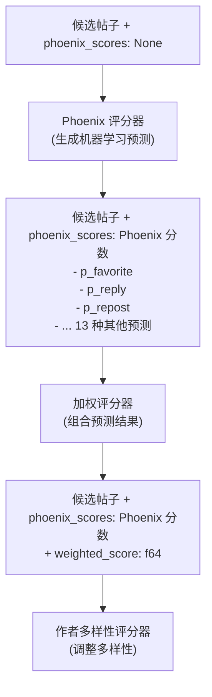
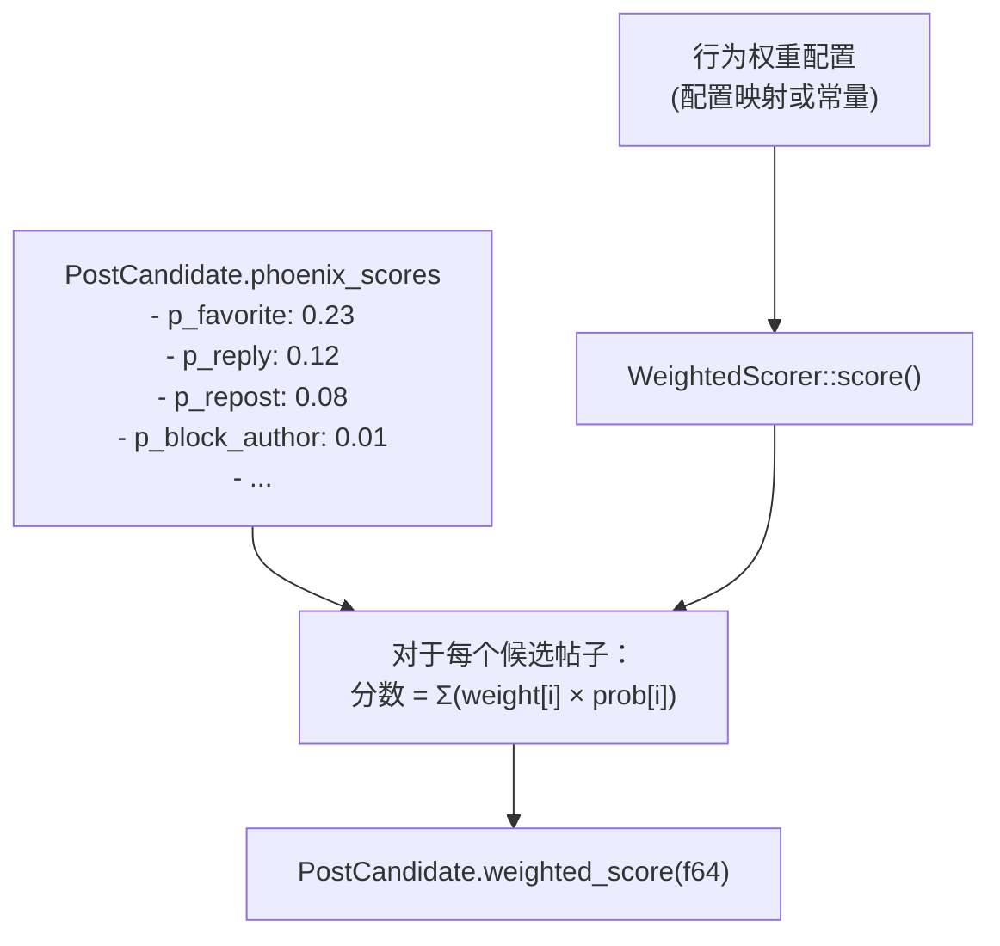
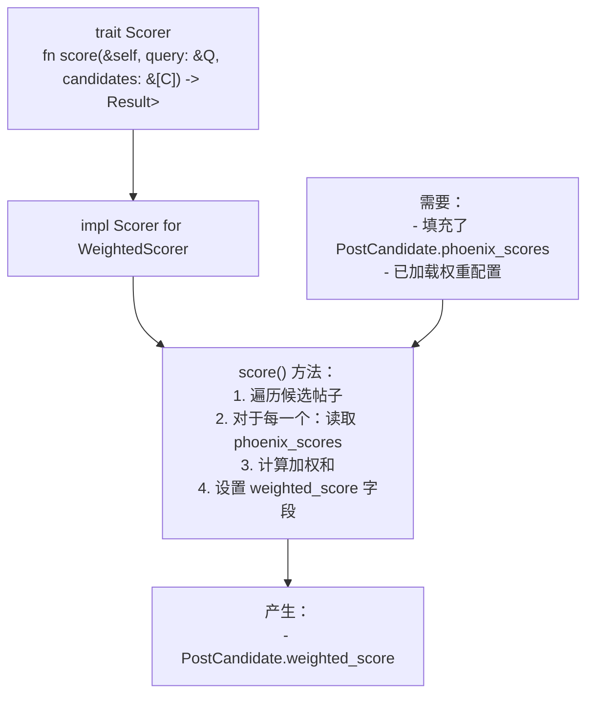

# 加权评分器 (Weighted Scorer)

相关源文件

-   [README.md](https://github.com/xai-org/x-algorithm/blob/aaa167b3/README.md?plain=1)

## 目的与范围

加权评分器 (Weighted Scorer) 将来自 Phoenix 评分器的多个互动概率预测组合成一个用于对候选帖子进行排名的相关性分数。它对每种预测的互动行为类型应用可配置的权重，并计算加权和以生成确定候选帖子排名的最终分数。

有关互动概率如何生成的更多信息，请参阅 [Phoenix 评分器 (Phoenix Scorer)](/xai-org/x-algorithm/4.7.1-phoenix-scorer)。有关加权评分后应用的分数调整信息，请参阅[作者多样性与 OON 评分器 (Author Diversity and OON Scorers)](/xai-org/x-algorithm/4.7.3-author-diversity-and-oon-scorers)。

**来源：** [README.md1-326](https://github.com/xai-org/x-algorithm/blob/aaa167b3/README.md?plain=1#L1-L326)

---

## 概述

加权评分器作用于已经由 Phoenix 评分器评分过的候选帖子。它接收多种互动概率预测（P(favorite)、P(reply)、P(repost) 等），并通过加权线性组合将它们合并为单一的数值分数。这个合并后的分数由 [选择器 (Selectors)](/xai-org/x-algorithm/4.8-selectors) 用于对最终的候选帖子进行排名和选择。


**图表：加权评分器在评分流水线中的位置**

**来源：** [README.md85-102](https://github.com/xai-org/x-algorithm/blob/aaa167b3/README.md?plain=1#L85-L102)

---

## 互动行为类型

Phoenix 评分器预测多种互动行为类型的概率。加权评分器使用这些预测作为输入来计算最终分数。下表显示了 Phoenix 模型预测的互动行为：

| 行为类型 | 字段名称 | 描述 | 权重类别 |
| --- | --- | --- | --- |
| 点赞 (Favorite) | `p_favorite` | 用户喜欢帖子的概率 | 正向 |
| 回复 (Reply) | `p_reply` | 用户回复帖子的概率 | 正向 |
| 转发 (Repost) | `p_repost` | 用户转发帖子的概率 | 正向 |
| 引用 (Quote) | `p_quote` | 用户引用帖子的概率 | 正向 |
| 点击 (Click) | `p_click` | 用户点击帖子的概率 | 正向 |
| 个人资料点击 (Profile Click) | `p_profile_click` | 用户点击作者个人资料的概率 | 正向 |
| 视频观看 (Video View) | `p_video_view` | 用户观看视频的概率（如果是视频帖子） | 正向 |
| 照片展开 (Photo Expand) | `p_photo_expand` | 用户展开照片的概率（如果是照片帖子） | 正向 |
| 分享 (Share) | `p_share` | 用户外部分享帖子的概率 | 正向 |
| 停留 (Dwell) | `p_dwell` | 用户在帖子上停留的概率 | 正向 |
| 关注作者 (Follow Author) | `p_follow_author` | 用户关注帖子作者的概率 | 正向 |
| 不感兴趣 (Not Interested) | `p_not_interested` | 用户标记“不感兴趣”的概率 | 负向 |
| 屏蔽作者 (Block Author) | `p_block_author` | 用户屏蔽帖子作者的概率 | 负向 |
| 静音作者 (Mute Author) | `p_mute_author` | 用户静音帖子作者的概率 | 负向 |
| 举报 (Report) | `p_report` | 用户举报帖子的概率 | 负向 |

**来源：** [README.md244-263](https://github.com/xai-org/x-algorithm/blob/aaa167b3/README.md?plain=1#L244-L263)

---

## 分数计算

### 加权和公式

加权评分器使用所有互动概率的加权线性组合来计算最终的相关性分数：

```rust
weighted_score = Σ (weight_i × P(action_i))
                 i∈actions
```
其中：

-   `weight_i` 是为行为类型 `i` 配置的权重。
-   `P(action_i)` 是 Phoenix 评分器对行为类型 `i` 的概率预测。
-   总和是对所有互动行为类型进行计算的。

**来源：** [README.md267-269](https://github.com/xai-org/x-algorithm/blob/aaa167b3/README.md?plain=1#L267-L269)

### 权重符号约定

根据互动行为是正向（理想）还是负向（不理想），权重被分配为正值或负值：

-   **正权重 (Positive Weights)**：应用于指示用户兴趣和互动的行为（点赞、回复、转发、分享等）。这些权重会增加最终分数。
-   **负权重 (Negative Weights)**：应用于指示用户不满的行为（屏蔽、静音、举报、不感兴趣）。这些权重会降低最终分数，并压低用户可能不喜欢的内容。

这允许模型优化用户会产生正向互动的内容，同时避免产生负面反应的内容。

**来源：** [README.md271-272](https://github.com/xai-org/x-algorithm/blob/aaa167b3/README.md?plain=1#L271-L272)

### 分数字段存储

计算出的加权分数存储在 `PostCandidate` 结构的 `weighted_score` 字段中。随后，流水线的后续阶段会使用该字段：

1.  **作者多样性评分器 (AuthorDiversityScorer)**：可能会对重复出现的作者的加权分数进行衰减。
2.  **OON 评分器 (OONScorer)**：可能会调整网外内容的相关性分数。
3.  **选择器 (Selectors)**：使用最终分数进行排序并选择排名靠前的候选帖子。

**来源：** [README.md85-108](https://github.com/xai-org/x-algorithm/blob/aaa167b3/README.md?plain=1#L85-L108) [README.md231-235](https://github.com/xai-org/x-algorithm/blob/aaa167b3/README.md?plain=1#L231-L235)

---

## 权重配置


**图表：权重配置和分数计算流程**

权重的配置基于：

-   **产品目标**：哪些互动对平台最有价值。
-   **用户体验**：优化能够指示真实兴趣的行为。
-   **模型校准**：考虑不同行为类型之间基础率的差异。
-   **实验**：权重可以通过 A/B 测试和离线评估进行调整。

具体的权重值可能是可配置且可调优的，以便在不需要重新训练模型的情况下进行优化。

**来源：** [README.md267-272](https://github.com/xai-org/x-algorithm/blob/aaa167b3/README.md?plain=1#L267-L272)

---

## 在流水线中的实现

### Scorer Trait 实现

加权评分器实现了候选管道框架中的 `Scorer` Trait（参见 [Scorer Trait](/xai-org/x-algorithm/3.6-scorer-trait)）。Trait 的 `score` 方法作用于一批候选帖子：


**图表：WeightedScorer 的 Scorer Trait 实现**

**来源：** [README.md190-201](https://github.com/xai-org/x-algorithm/blob/aaa167b3/README.md?plain=1#L190-L201) [README.md231-235](https://github.com/xai-org/x-algorithm/blob/aaa167b3/README.md?plain=1#L231-L235)

### 顺序执行

加权评分器在 Phoenix 评分器之后**顺序执行**。这是必要的，因为：

1.  它依赖于由 Phoenix 评分器填充的 `phoenix_scores`。
2.  分数计算是一个轻量级操作（简单的算术运算）。
3.  顺序执行确保了正确的数据依赖关系。

流水线按以下顺序执行评分器：

1.  `PhoenixScorer` - 填充 `phoenix_scores` 字段。
2.  `WeightedScorer` - 从 `phoenix_scores` 计算 `weighted_score`。
3.  `AuthorDiversityScorer` - 可能会衰减 `weighted_score`。
4.  `OONScorer` - 可能会为网外 (OON) 候选帖子调整 `weighted_score`。

**来源：** [README.md85-102](https://github.com/xai-org/x-algorithm/blob/aaa167b3/README.md?plain=1#L85-L102) [README.md231-235](https://github.com/xai-org/x-algorithm/blob/aaa167b3/README.md?plain=1#L231-L235)

---

## 设计理念

### 预测与评分的分离

将 Phoenix 评分器（预测）和加权评分器（组合）分离提供了以下几个好处：

| 好处 | 描述 |
| --- | --- |
| **模块化** | 机器学习预测独立于权重调优 |
| **实验** | 权重可以在不重新训练模型的情况下进行调整 |
| **透明度** | 保留了单个互动的概率，以便进行调试和分析 |
| **灵活性** | 可以轻松地对不同的权重配置进行 A/B 测试 |

### 多行为预测的优势

系统不是预测单个“相关性”分数，而是预测多种行为概率并将其组合。这种方法：

-   **捕捉微妙的用户意图**：不同的用户可能以不同的方式互动（有些人喜欢回复，有些人喜欢点赞）。
-   **能够整合负面信号**：可以预测并惩罚负面行为（屏蔽、举报）。
-   **改进模型训练**：多任务学习有助于模型学习更好的表征。
-   **支持多样化的优化目标**：权重可以被调优以优化特定的业务指标。

**来源：** [README.md304-314](https://github.com/xai-org/x-algorithm/blob/aaa167b3/README.md?plain=1#L304-L314)

### 无人工特征工程

系统完全依靠基于 Grok 的 Transformer 从用户互动序列中学习相关性，没有人工特征工程。加权评分器的可配置权重是将产品目标和偏好编码到排名函数中的主要机制，而不需要复杂的特征工程流水线。

**来源：** [README.md301-304](https://github.com/xai-org/x-algorithm/blob/aaa167b3/README.md?plain=1#L301-L304)

---

## 与选择集成

在加权评分（以及随后由多样性和 OON 评分器进行的分数调整）之后，最终分数由 `TopKScoreSelector` 使用：

**图表：评分到选择的流程**

`TopKScoreSelector` 按 `weighted_score` 字段（在所有分数调整之后）降序对候选帖子进行排序，并选择前 K 个候选帖子返回。有关选择过程的更多详细信息，请参阅[选择器 (Selectors)](/xai-org/x-algorithm/4.8-selectors)。

**来源：** [README.md85-108](https://github.com/xai-org/x-algorithm/blob/aaa167b3/README.md?plain=1#L85-L108) [README.md231-237](https://github.com/xai-org/x-algorithm/blob/aaa167b3/README.md?plain=1#L231-L237)
