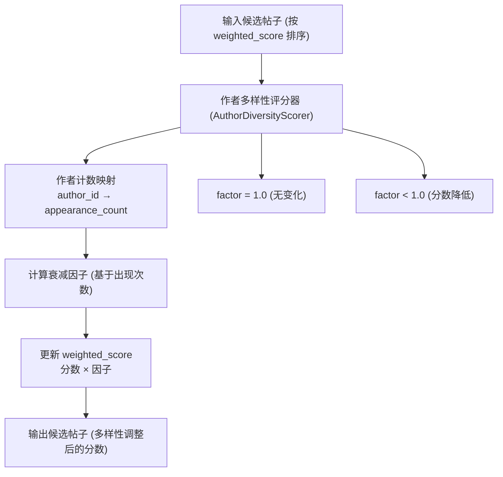
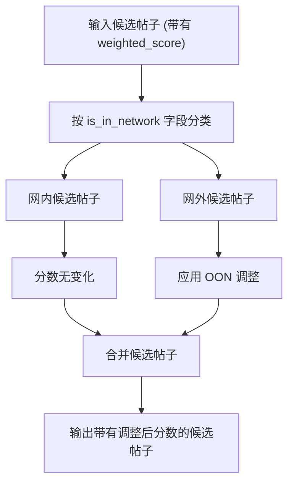
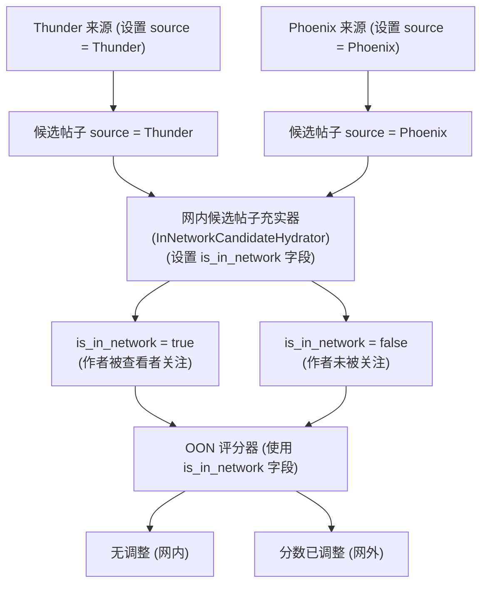
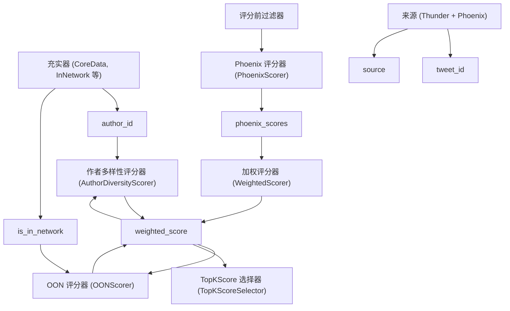

# 作者多样性与 OON 评分器 (Author Diversity and OON Scorers)

相关源文件

-   [README.md](https://github.com/xai-org/x-algorithm/blob/aaa167b3/README.md?plain=1)

## 目的与范围

本文档描述了在 Phoenix ML 预测和加权分数组合之后应用的最终分数调整。**作者多样性评分器 (Author Diversity Scorer)** 会对来自重复出现作者的候选帖子进行分数的衰减，以确保信息流的多样性。**OON 评分器 (OON Scorer)** 应用专门针对网外内容 (Out-of-Network Content) 的校准调整。这些评分器在加权评分阶段之后、候选帖子选择之前按顺序执行。

有关 Phoenix ML 预测的信息，请参阅 [Phoenix 评分器 (Phoenix Scorer)](/xai-org/x-algorithm/4.7.1-phoenix-scorer)。有关加权分数组合的信息，请参阅[加权评分器 (Weighted Scorer)](/xai-org/x-algorithm/4.7.2-weighted-scorer)。有关整体评分流水线的信息，请参阅[评分器 (Scorers)](/xai-org/x-algorithm/4.7-scorers)。

---

## 加权评分后流水线 (Post-Weighted Scoring Pipeline)

在 Phoenix Transformer 生成互动预测且加权评分器将它们合并为相关性分数之后，另外两个评分阶段会修改加权分数以提高信息流质量：

| 评分器 | 目的 | 执行模式 |
| --- | --- | --- |
| 作者多样性评分器 | 衰减重复作者的分数 | 顺序执行 |
| OON 评分器 | 调整网外内容的分数 | 顺序执行 |

这些评分器实现了 `Scorer` Trait 并按顺序执行，每个评分器都会接收来自前一阶段的输出。它们修改 `PostCandidate` 实例上的 `weighted_score` 字段，而不改变底层的 Phoenix 预测。

### 评分顺序图

**图表：评分器执行顺序**

来源：[README.md85-102](https://github.com/xai-org/x-algorithm/blob/aaa167b3/README.md?plain=1#L85-L102) [README.md230-235](https://github.com/xai-org/x-algorithm/blob/aaa167b3/README.md?plain=1#L230-L235)

---

## 作者多样性评分器 (Author Diversity Scorer)

### 目的

作者多样性评分器通过在候选集中出现来自同一作者的多条帖子时衰减分数，从而防止信息流同质化。如果没有这种调整，高产的作者或高互动率的账户可能会占据信息流的主导地位，从而减少内容的多样性。

### 操作

该评分器按顺序处理候选帖子（保持当前顺序）并跟踪作者的出现情况：

1.  **作者跟踪 (Author Tracking)**：为遇到的每个唯一作者 ID 维护一个计数器。
2.  **渐进衰减 (Progressive Attenuation)**：对同一作者的后续出现应用递增的惩罚。
3.  **分数修改 (Score Modification)**：使用衰减后的值更新 `weighted_score` 字段。
4.  **保留 Phoenix 分数**：不修改底层的 `phoenix_scores` 字段。

### 衰减策略

典型的衰减方法是使用随着出现次数增加而增加的衰减因子：

```rust
attenuated_score = original_score × decay_function(author_appearance_count)
```
常见的衰减函数包括：

-   **线性衰减**：`factor = 1.0 - (count - 1) × decay_rate`
-   **指数衰减**：`factor = decay_base ^ (count - 1)`
-   **基于阈值**：前 N 次出现采用全额分数，之后采用降低的分数。

每个作者的第一次出现通常不接收任何惩罚 (`count = 1, factor = 1.0`)，从而确保每个作者得分最高的帖子保留其原始分数。

### 与流水线互动


来源：[README.md99-101](https://github.com/xai-org/x-algorithm/blob/aaa167b3/README.md?plain=1#L99-L101) [README.md230-234](https://github.com/xai-org/x-algorithm/blob/aaa167b3/README.md?plain=1#L230-L234)

### 配置参数

典型配置包括：

| 参数 | 描述 | 类型 |
| --- | --- | --- |
| `enabled` | 是否应用作者多样性评分 | boolean |
| `decay_rate` | 每次出现的评分衰减率 | float |
| `decay_function` | 衰减类型（线性、指数、阈值） | enum |
| `max_appearances` | 达到全额衰减前的最大出现次数 | integer (可选) |

### 示例效果

考虑来自同一作者的三条帖子，其原始加权分数为：

| 帖子 ID | 作者 ID | 原始分数 | 出现次数 | 衰减因子 | 最终分数 |
| --- | --- | --- | --- | --- | --- |
| 帖子 A | 作者 123 | 0.95 | 1 | 1.0 | 0.95 |
| 帖子 B | 作者 123 | 0.88 | 2 | 0.7 | 0.616 |
| 帖子 C | 作者 123 | 0.82 | 3 | 0.4 | 0.328 |

这确保了帖子 A（来自作者 123 的最高分帖子）保持其位置，而后续帖子接收渐进降低的分数，从而允许来自其他作者的内容在信息流中交错出现。

来源：[README.md99-101](https://github.com/xai-org/x-algorithm/blob/aaa167b3/README.md?plain=1#L99-L101)

---

## OON 评分器 (OON Scorer)

### 目的

OON (网外，Out-of-Network) 评分器专门针对从 Phoenix Retrieval 检索到的候选帖子（网外内容）应用分数调整。这些调整考虑了网内 (In-Network) 和网外内容之间在分数分布、校准或政策要求方面的差异。

### 网外检测 (Out-of-Network Detection)

该评分器使用 `PostCandidate` 上的 `is_in_network` 字段来识别 OON 候选帖子，该字段是由 `InNetworkCandidateHydrator` 在充实阶段设置的。该字段指示候选帖子的作者是否被查看者关注。

### 分数调整类型

OON 分数调整可能包括：

1.  **校准调整 (Calibration Adjustment)**：规范化网内和 OON 内容之间的分数分布。
2.  **发现提升 (Discovery Boost)**：提高 OON 分数以确保出现足够的发现内容。
3.  **质量阈值 (Quality Threshold)**：对 OON 内容应用更高的质量门槛。
4.  **政策调整 (Policy Adjustment)**：执行内容混合政策（例如最小/最大 OON 比例）。

### 操作流程


来源：[README.md234](https://github.com/xai-org/x-algorithm/blob/aaa167b3/README.md?plain=1#L234-L234) [README.md29-31](https://github.com/xai-org/x-algorithm/blob/aaa167b3/README.md?plain=1#L29-L31)

### 调整公式

典型调整应用乘法或加法因子：

```rust
adjusted_score = original_score × oon_multiplier + oon_offset
```
或者，基于百分位数的调整可能会规范化 OON 分数以匹配网内分数分布：

```rust
adjusted_score = percentile_match(oon_score, in_network_distribution)
```
### 配置参数

| 参数 | 描述 | 类型 |
| --- | --- | --- |
| `enabled` | 是否应用 OON 分数调整 | boolean |
| `oon_multiplier` | OON 内容的分数乘数 | float |
| `oon_offset` | OON 内容的加法偏移量 | float |
| `adjustment_strategy` | 调整类型（乘数、百分位数、阈值） | enum |
| `min_oon_ratio` | 结果中 OON 的最小比例 | float (可选) |
| `max_oon_ratio` | 结果中 OON 的最大比例 | float (可选) |

### 与来源信息的集成

OON 评分器依赖于在流水线早期阶段设置的元数据：


请注意，`is_in_network` 状态由社交图谱关系（查看者是否关注作者）决定，而不是由候选帖子来源决定。通过 Phoenix 检索到的候选帖子，如果其作者被关注，则其 `is_in_network = true` 且不会接收 OON 调整。

来源：[README.md29-31](https://github.com/xai-org/x-algorithm/blob/aaa167b3/README.md?plain=1#L29-L31) [README.md234](https://github.com/xai-org/x-algorithm/blob/aaa167b3/README.md?plain=1#L234-L234)

---

## 执行顺序与依赖关系

### 顺序评分链

完整的评分流水线按严格的顺序执行：

1.  **Phoenix 评分器 (PhoenixScorer)**：生成机器学习预测 → 设置 `phoenix_scores` 字段。
2.  **加权评分器 (WeightedScorer)**：组合预测结果 → 设置 `weighted_score` 字段。
3.  **作者多样性评分器 (AuthorDiversityScorer)**：对重复作者进行衰减 → 修改 `weighted_score`。
4.  **OON 评分器 (OONScorer)**：调整网外内容 → 修改 `weighted_score`。

每个评分器都依赖于前一个评分器的输出。顺序执行确保了：

-   一致的分数变换。
-   可预测的衰减顺序。
-   分数更新不存在竞态条件。

### 数据依赖关系


来源：[README.md85-102](https://github.com/xai-org/x-algorithm/blob/aaa167b3/README.md?plain=1#L85-L102) [README.md230-235](https://github.com/xai-org/x-algorithm/blob/aaa167b3/README.md?plain=1#L230-L235)

### Trait 实现

这两个评分器都实现了候选管道框架中的 `Scorer` Trait：

```
特性: Scorer<ScoredPostsQuery, PostCandidate>
├── score(query, candidates) -> Result<Vec<PostCandidate>>
└── 由 PhoenixCandidatePipeline 顺序执行
```
`Scorer` Trait 契约要求：

-   输入：查询对象和候选帖子列表。
-   输出：修改了分数的相同候选帖子。
-   保证：不添加或删除候选帖子（仅修改分数）。
-   执行：顺序处理（保持候选帖子顺序）。

来源：[README.md196-198](https://github.com/xai-org/x-algorithm/blob/aaa167b3/README.md?plain=1#L196-L198)

---

## 配置与调优

### 分数调整的权衡

多样性评分器和 OON 评分器平衡了相互竞争的目标：

| 目标 | 评分器 | 调整策略 |
| --- | --- | --- |
| 最大化相关性 | 无（保留加权分数） | 无调整 |
| 最大化多样性 | 作者多样性 | 强力衰减 |
| 平衡网内/网外 | OON 评分器 | 校准乘数 |
| 发现新内容 | OON 评分器 | OON 提升 |
| 防止作者主导 | 作者多样性 | 渐进衰减 |

### A/B 测试考虑因素

这些评分器通常通过实验进行调优：

1.  **要跟踪的指标**：

    -   信息流多样性指标（每个会话的唯一作者数）。
    -   按作者出现位置划分的互动率。
    -   网外内容互动与网内互动。
    -   会话时长和留存率。
2.  **常见实验**：

    -   改变作者多样性衰减率。
    -   测试不同的 OON 乘数。
    -   比较线性衰减与指数衰减函数。
    -   评估基于阈值与连续衰减的效果。
3.  **护栏指标**：

    -   整体互动率（防止以相关性为代价换取过度多样性）。
    -   OON 负面反馈率（屏蔽、静音、举报）。
    -   用户留存率和满意度调查。

来源：[README.md230-235](https://github.com/xai-org/x-algorithm/blob/aaa167b3/README.md?plain=1#L230-L235)

### 实现位置

这些评分器作为主混频器流水线的一部分实现：

```
home-mixer/
├── phoenix_candidate_pipeline/
│   ├── scorers/
│   │   ├── phoenix_scorer.rs
│   │   ├── weighted_scorer.rs
│   │   ├── author_diversity_scorer.rs  ← 作者多样性评分器
│   │   └── oon_scorer.rs               ← OON 评分器
│   └── pipeline.rs
```
`PhoenixCandidatePipeline` 结构体按顺序配置并编排所有评分器。

来源：[README.md130-146](https://github.com/xai-org/x-algorithm/blob/aaa167b3/README.md?plain=1#L130-L146)

---

## 总结

作者多样性评分器和 OON 评分器在机器学习预测和加权组合之后应用最终分数调整：

-   **作者多样性评分器 (Author Diversity Scorer)**：通过对重复出现的作者进行渐进式分数衰减，防止信息流同质化，确保用户看到来自多个账户的内容。
-   **OON 评分器 (OON Scorer)**：校准网外内容的分数以平衡发现与相关性，调整分数分布或政策要求的差异。

这两个评分器都按顺序执行，修改 `weighted_score` 字段，而不改变底层的 Phoenix 预测。它们使流水线能够平衡原始机器学习相关性与信息流质量目标（如多样性和发现）。

来源：[README.md85-102](https://github.com/xai-org/x-algorithm/blob/aaa167b3/README.md?plain=1#L85-L102) [README.md230-235](https://github.com/xai-org/x-algorithm/blob/aaa167b3/README.md?plain=1#L230-L235)
