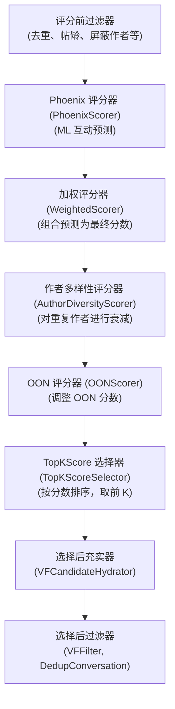
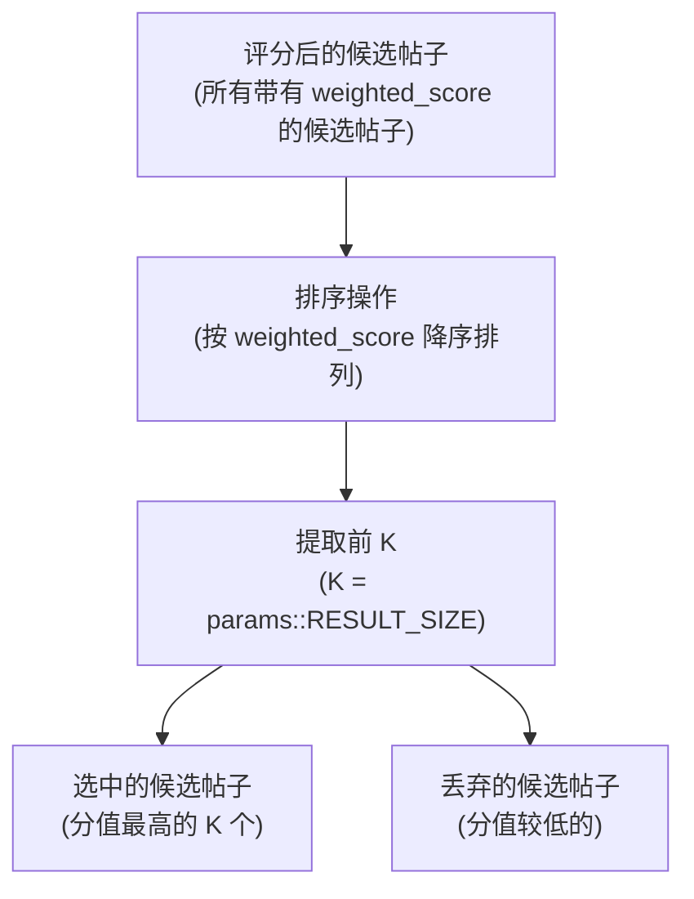
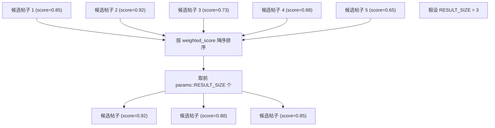
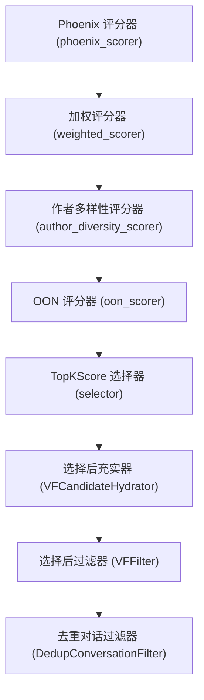

# 选择器 (Selectors)

相关源文件

-   [README.md](https://github.com/xai-org/x-algorithm/blob/aaa167b3/README.md?plain=1)
-   [home-mixer/candidate\_pipeline/phoenix\_candidate\_pipeline.rs](https://github.com/xai-org/x-algorithm/blob/aaa167b3/home-mixer/candidate_pipeline/phoenix_candidate_pipeline.rs)

## 目的与范围

本文档描述了主混频器 (Home Mixer) 的 Phoenix 候选管道中使用的选择器实现。选择器负责对评分后的候选帖子进行排序，并选择前 K 个结果返回给客户端。本页重点介绍生产环境中使用的具体实现 (`TopKScoreSelector`)。有关候选管道框架中通用 `Selector` Trait 的文档，请参阅[选择器 Trait (Selector Trait)](/xai-org/x-algorithm/3.7-selector-trait)。

---

## 概述

选择器阶段在所有评分操作完成后执行。其目的是：

1.  按最终加权分数降序排列候选帖子。
2.  根据配置的结果大小选择前 N 个候选帖子。
3.  丢弃得分较低的候选帖子，以减少下游处理。

选择器作用于已经经过资格过滤、并充实了来自 Phoenix Transformer 模型、加权组合、多样性调整和网外 (OON) 分数修改的基于机器学习 (ML) 分数的候选帖子。

**来源：** [README.md106-108](https://github.com/xai-org/x-algorithm/blob/aaa167b3/README.md?plain=1#L106-L108) [README.md236-237](https://github.com/xai-org/x-algorithm/blob/aaa167b3/README.md?plain=1#L236-L237)

---

## 流水线位置

选择器在流水线流程中的特定点执行，即在所有评分阶段之后、选择后处理之前：


**来源：** [home-mixer/candidate\_pipeline/phoenix\_candidate\_pipeline.rs122-135](https://github.com/xai-org/x-algorithm/blob/aaa167b3/home-mixer/candidate_pipeline/phoenix_candidate_pipeline.rs#L122-L135) [README.md230-237](https://github.com/xai-org/x-algorithm/blob/aaa167b3/README.md?plain=1#L230-L237)

---

## TopKScore 选择器 (TopKScoreSelector)

`TopKScoreSelector` 是 Phoenix 候选管道中使用的 `Selector` Trait 的具体实现。它执行基于分数的排序和前 K 个选择。

### 实现细节

选择器在流水线配置中实例化：

| 组件 | 类型 | 位置 |
| --- | --- | --- |
| 结构体定义 | `TopKScoreSelector` | `home-mixer/selectors/` (已导入) |
| 流水线字段 | `selector: TopKScoreSelector` | [home-mixer/candidate\_pipeline/phoenix\_candidate\_pipeline.rs66](https://github.com/xai-org/x-algorithm/blob/aaa167b3/home-mixer/candidate_pipeline/phoenix_candidate_pipeline.rs#L66-L66) |
| 初始化 | `let selector = TopKScoreSelector;` | [home-mixer/candidate\_pipeline/phoenix\_candidate\_pipeline.rs135](https://github.com/xai-org/x-algorithm/blob/aaa167b3/home-mixer/candidate_pipeline/phoenix_candidate_pipeline.rs#L135-L135) |
| Trait 方法 | `fn selector(&self) -> &dyn Selector<ScoredPostsQuery, PostCandidate>` | [home-mixer/candidate\_pipeline/phoenix\_candidate\_pipeline.rs236-238](https://github.com/xai-org/x-algorithm/blob/aaa167b3/home-mixer/candidate_pipeline/phoenix_candidate_pipeline.rs#L236-L238) |

**来源：** [home-mixer/candidate\_pipeline/phoenix\_candidate\_pipeline.rs41](https://github.com/xai-org/x-algorithm/blob/aaa167b3/home-mixer/candidate_pipeline/phoenix_candidate_pipeline.rs#L41-L41) [home-mixer/candidate\_pipeline/phoenix\_candidate\_pipeline.rs66](https://github.com/xai-org/x-algorithm/blob/aaa167b3/home-mixer/candidate_pipeline/phoenix_candidate_pipeline.rs#L66-L66) [home-mixer/candidate\_pipeline/phoenix\_candidate\_pipeline.rs135](https://github.com/xai-org/x-algorithm/blob/aaa167b3/home-mixer/candidate_pipeline/phoenix_candidate_pipeline.rs#L135-L135) [home-mixer/candidate\_pipeline/phoenix\_candidate\_pipeline.rs236-238](https://github.com/xai-org/x-algorithm/blob/aaa167b3/home-mixer/candidate_pipeline/phoenix_candidate_pipeline.rs#L236-L238)

---

## 选择逻辑

选择器实现以下逻辑：


### 排序键

候选帖子按其 `weighted_score` 字段进行排序，该字段包含由 `WeightedScorer` 计算的最终相关性分数，并可能由 `AuthorDiversityScorer` 和 `OONScorer` 进行了调整。

### 结果大小配置

要选择的候选帖子数量由 `params::RESULT_SIZE` 决定：

```rust
fn result_size(&self) -> usize {
    params::RESULT_SIZE
}
```
此配置值由流水线框架在选择器执行期间访问，以确定要保留多少候选帖子。

**来源：** [home-mixer/candidate\_pipeline/phoenix\_candidate\_pipeline.rs252-254](https://github.com/xai-org/x-algorithm/blob/aaa167b3/home-mixer/candidate_pipeline/phoenix_candidate_pipeline.rs#L252-L254)

---

## 与流水线框架集成

`TopKScoreSelector` 通过 Trait 实现与通用的候选管道框架集成。

**来源：** [home-mixer/candidate\_pipeline/phoenix\_candidate\_pipeline.rs60-70](https://github.com/xai-org/x-algorithm/blob/aaa167b3/home-mixer/candidate_pipeline/phoenix_candidate_pipeline.rs#L60-L70) [home-mixer/candidate\_pipeline/phoenix\_candidate\_pipeline.rs216-255](https://github.com/xai-org/x-algorithm/blob/aaa167b3/home-mixer/candidate_pipeline/phoenix_candidate_pipeline.rs#L216-L255)

---

## 经过选择的数据流

选择器作用于完全评分后的 `PostCandidate` 实例：


### 分数字段要求

为了使选择器正常工作，候选帖子必须具备：

-   `weighted_score`：由评分器计算的最终组合分数。
-   有效的数值分数（非 NaN 或无穷大）。

**来源：** [README.md265-271](https://github.com/xai-org/x-algorithm/blob/aaa167b3/README.md?plain=1#L265-L271)

---

## 执行上下文

### 顺序执行

选择器按顺序执行（非并行），因为：

1.  它需要所有评分操作都已完成。
2.  排序是一个顺序操作。
3.  它依赖于将所有候选帖子相互比较。

### 在流水线阶段中的位置

选择器在两个主要流水线阶段之间执行：

| 阶段 | 组件 | 执行方式 |
| --- | --- | --- |
| **评分阶段** | `PhoenixScorer`, `WeightedScorer`, `AuthorDiversityScorer`, `OONScorer` | 顺序评分器 |
| **选择阶段** | `TopKScoreSelector` | 顺序选择 |
| **选择后阶段** | `VFCandidateHydrator`, `VFFilter`, `DedupConversationFilter` | 充实器（并行），然后是过滤器（顺序） |

**来源：** [home-mixer/candidate\_pipeline/phoenix\_candidate\_pipeline.rs122-143](https://github.com/xai-org/x-algorithm/blob/aaa167b3/home-mixer/candidate_pipeline/phoenix_candidate_pipeline.rs#L122-L143)

---

## 配置参数

选择器的行为受 `result_size()` 方法控制：

```rust
fn result_size(&self) -> usize {
    params::RESULT_SIZE
}
```
| 参数 | 来源 | 目的 |
| --- | --- | --- |
| `params::RESULT_SIZE` | 系统配置 | 决定要选择多少分值最高的候选帖子 |

此值代表选择后要返回的目标候选帖子数量，尽管在选择后过滤后，最终响应可能包含更少的候选帖子。

**来源：** [home-mixer/candidate\_pipeline/phoenix\_candidate\_pipeline.rs252-254](https://github.com/xai-org/x-algorithm/blob/aaa167b3/home-mixer/candidate_pipeline/phoenix_candidate_pipeline.rs#L252-L254)

---

## 与其他流水线组件的关系

选择器接收来自评分器的输入，并为选择后阶段提供输出：


**来源：** [home-mixer/candidate\_pipeline/phoenix\_candidate\_pipeline.rs122-143](https://github.com/xai-org/x-algorithm/blob/aaa167b3/home-mixer/candidate_pipeline/phoenix_candidate_pipeline.rs#L122-L143)

---

## 总结

`TopKScoreSelector` 为在所有评分操作完成后选择分值最高的候选帖子提供了一种简单、高效的机制。其实现：

-   按 `weighted_score` 降序排列候选帖子。
-   选择前 `params::RESULT_SIZE` 个候选帖子。
-   在所有评分阶段后顺序执行。
-   在执行昂贵的选择后操作之前减少候选集的大小。

该选择器是一个关键组件，它决定了哪些候选帖子可以进入最终的可见性过滤，并最终出现在用户的“为您推荐 (For You)”信息流中。

**来源：** [home-mixer/candidate\_pipeline/phoenix\_candidate\_pipeline.rs60-255](https://github.com/xai-org/x-algorithm/blob/aaa167b3/home-mixer/candidate_pipeline/phoenix_candidate_pipeline.rs#L60-L255) [README.md106-108](https://github.com/xai-org/x-algorithm/blob/aaa167b3/README.md?plain=1#L106-L108) [README.md230-237](https://github.com/xai-org/x-algorithm/blob/aaa167b3/README.md?plain=1#L230-L237)
