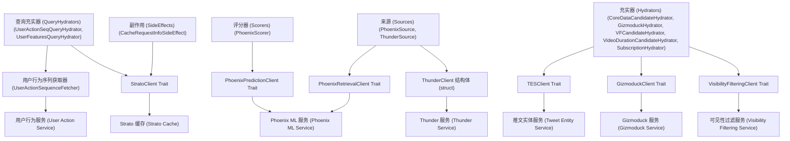
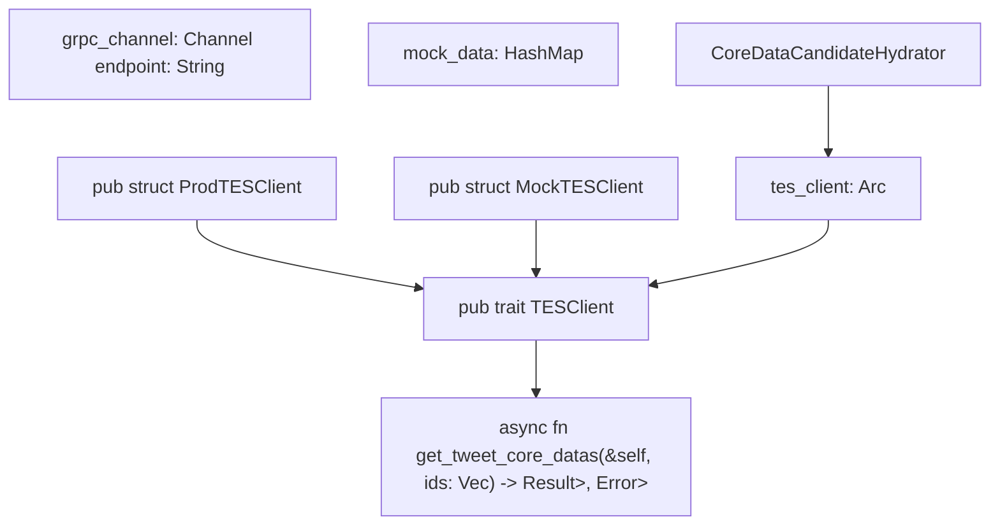
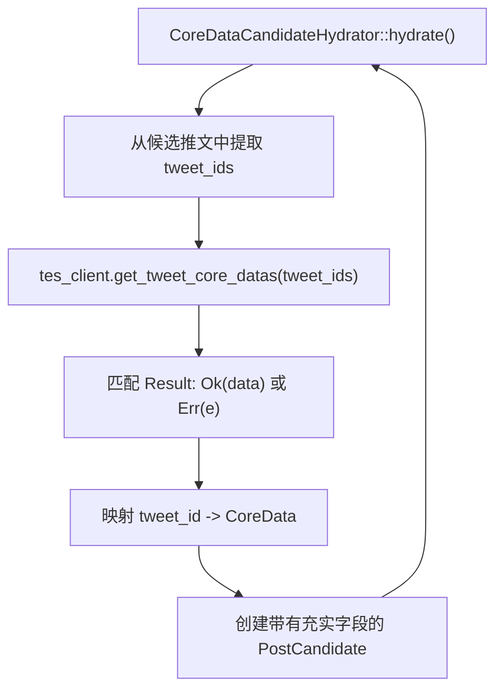

# 外部服务集成 (External Services Integration)

相关源文件

-   [home-mixer/candidate_hydrators/core_data_candidate_hydrator.rs](https://github.com/xai-org/x-algorithm/blob/aaa167b3/home-mixer/candidate_hydrators/core_data_candidate_hydrator.rs)
-   [home-mixer/candidate_pipeline/phoenix_candidate_pipeline.rs](https://github.com/xai-org/x-algorithm/blob/aaa167b3/home-mixer/candidate_pipeline/phoenix_candidate_pipeline.rs)

## 目的与范围

本文档概述了 X 算法如何与外部服务集成，以检索数据并执行专门的操作。主混频器 (Home Mixer) 的 Phoenix 候选管道框架依赖于多个外部服务，用于获取推文元数据、用户个人资料、可见性过滤、机器学习预测和实时推文存储。这些集成遵循一致的架构模式，即使用基于 Trait 的客户端抽象和依赖注入。

本页涵盖了整体集成架构、抽象模式和初始化策略。有关各个服务集成的详细文档，请参阅：

-   [客户端架构 (Client Architecture)](/xai-org/x-algorithm/5.1-client-architecture) - Trait 设计和依赖注入模式
-   [推文实体服务 (Tweet Entity Service, TES)](/xai-org/x-algorithm/5.2-tweet-entity-service-(tes)) - 推文元数据检索
-   [Gizmoduck 服务 (Gizmoduck Service)](/xai-org/x-algorithm/5.3-gizmoduck-service) - 用户个人资料数据
-   [可见性过滤服务 (Visibility Filtering Service)](/xai-org/x-algorithm/5.4-visibility-filtering-service) - 内容安全检查
-   [Phoenix ML 服务 (Phoenix ML Services)](/xai-org/x-algorithm/5.5-phoenix-ml-services) - 检索与排名
-   [Thunder 服务 (Thunder Service)](/xai-org/x-algorithm/5.6-thunder-service) - 实时网内推文
-   [Strato 及其他服务 (Strato and Other Services)](/xai-org/x-algorithm/5.7-strato-and-other-services) - 缓存与用户行为

## 集成架构

外部服务集成遵循三层架构，将管道逻辑与服务通信细节分离：


**来源：** [home-mixer/candidate_pipeline/phoenix_candidate_pipeline.rs1-256](https://github.com/xai-org/x-algorithm/blob/aaa167b3/home-mixer/candidate_pipeline/phoenix_candidate_pipeline.rs#L1-L256)

### 各层职责

| 层 | 职责 | 关键特征 |
| --- | --- | --- |
| **管道组件** | 查询充实、候选推文检索、丰富、评分的业务逻辑 | 类型安全、基于框架、可重用 |
| **客户端抽象** | 服务通信协议、错误处理、序列化 | 基于 Trait、可模拟 (Mockable)、依赖注入 |
| **外部服务** | 数据存储、机器学习推理、实时处理 | 独立部署、专门功能 |

## 服务集成概述

Phoenix 候选管道框架集成了七个主要的外部服务，每个服务提供专门的功能：

| 服务 | 客户端接口 | 主要使用者 | 目的 |
| --- | --- | --- | --- |
| **用户行为服务 (User Action Service)** | `UserActionSequenceFetcher` | `UserActionSeqQueryHydrator` | 检索用户互动历史以进行个性化推荐 |
| **推文实体服务 (TES)** | `TESClient` Trait | `CoreDataCandidateHydrator`, `VideoDurationCandidateHydrator`, `SubscriptionHydrator` | 获取推文元数据、媒体实体、订阅数据 |
| **Gizmoduck** | `GizmoduckClient` Trait | `GizmoduckCandidateHydrator` | 检索用户个人资料、粉丝数、显示名称 |
| **可见性过滤** | `VisibilityFilteringClient` Trait | `VFCandidateHydrator`, `VFFilter` | 应用内容安全和政策过滤 |
| **Phoenix ML 服务** | `PhoenixPredictionClient` Trait, `PhoenixRetrievalClient` Trait | `PhoenixSource`, `PhoenixScorer` | 双塔检索和 Grok Transformer 排名 |
| **Thunder 服务** | `ThunderClient` 结构体 | `ThunderSource` | 从内存存储中检索实时网内推文 |
| **Strato 缓存** | `StratoClient` Trait | `UserFeaturesQueryHydrator`, `CacheRequestInfoSideEffect` | 用户特征和请求元数据的分布式缓存 |

**来源：** [home-mixer/candidate_pipeline/phoenix_candidate_pipeline.rs9-21](https://github.com/xai-org/x-algorithm/blob/aaa167b3/home-mixer/candidate_pipeline/phoenix_candidate_pipeline.rs#L9-L21) [home-mixer/candidate_pipeline/phoenix_candidate_pipeline.rs73-82](https://github.com/xai-org/x-algorithm/blob/aaa167b3/home-mixer/candidate_pipeline/phoenix_candidate_pipeline.rs#L73-L82)

## 客户端抽象模式

所有外部服务集成都遵循一致的基于 Trait 的抽象模式，这使得依赖注入、测试和服务演进成为可能：


**来源：** [home-mixer/candidate_hydrators/core_data_candidate_hydrator.rs8-10](https://github.com/xai-org/x-algorithm/blob/aaa167b3/home-mixer/candidate_hydrators/core_data_candidate_hydrator.rs#L8-L10)

### 关键设计原则

1.  **基于 Trait 的契约**：每个服务定义一个 Trait 接口，指定所需的方法和返回类型。
2.  **线程安全引用**：客户端被包装在 `Arc<dyn Trait + Send + Sync>` 中，以便进行并发访问。
3.  **生产与测试实现**：生产客户端实现实际的 gRPC 通信，而测试实现提供可模拟的数据。
4.  **异步优先**：所有客户端方法均为异步 (async)，以支持非阻塞 I/O。
5.  **错误传播**：客户端返回 `Result` 类型，以便将服务错误传播给调用者。

## 客户端初始化与依赖注入

`PhoenixCandidatePipeline` 遵循基于构造函数的依赖注入模式，在管道创建期间初始化所有客户端，并将它们传递给依赖组件：

> **[Mermaid sequence]**
> *(图表结构无法解析)*

**来源：** [home-mixer/candidate_pipeline/phoenix_candidate_pipeline.rs162-212](https://github.com/xai-org/x-algorithm/blob/aaa167b3/home-mixer/candidate_pipeline/phoenix_candidate_pipeline.rs#L162-L212)

### 生产客户端初始化

`PhoenixCandidatePipeline::prod()` 方法 [home-mixer/candidate_pipeline/phoenix_candidate_pipeline.rs162-212](https://github.com/xai-org/x-algorithm/blob/aaa167b3/home-mixer/candidate_pipeline/phoenix_candidate_pipeline.rs#L162-L212) 展示了初始化顺序：

1.  **用户行为获取器 (User Action Fetcher)** - 创建到用户行为服务的连接，以获取互动历史。
2.  **Phoenix 客户端** - 初始化检索（双塔）和预测（Grok Transformer）客户端。
3.  **Thunder 客户端** - 建立到实时网内推文存储的连接。
4.  **Strato 客户端** - 连接到分布式缓存，用于获取用户特征和请求跟踪。
5.  **TES 客户端** - 初始化到推文实体服务 (TES) 的 gRPC 通道。
6.  **Gizmoduck 客户端** - 创建用于用户个人资料检索的连接。
7.  **可见性过滤客户端** - 配置带有 S2S 证书的 mTLS，用于内容安全检查。

所有客户端都包装在 `Arc` 中，以便在可能并行执行的多个管道组件之间共享所有权。

### 使用注入的客户端构造组件

在客户端初始化之后，`build_with_clients()` 方法 [home-mixer/candidate_pipeline/phoenix_candidate_pipeline.rs73-160](https://github.com/xai-org/x-algorithm/blob/aaa167b3/home-mixer/candidate_pipeline/phoenix_candidate_pipeline.rs#L73-L160) 通过注入适当的客户端来构造管道组件：

```rust
// 示例：CoreDataCandidateHydrator 接收 TESClient
let hydrators: Vec<Box<dyn Hydrator<ScoredPostsQuery, PostCandidate>>> = vec![
    Box::new(CoreDataCandidateHydrator::new(tes_client.clone()).await),
    Box::new(VideoDurationCandidateHydrator::new(tes_client.clone()).await),
    Box::new(SubscriptionHydrator::new(tes_client.clone()).await),
    Box::new(GizmoduckCandidateHydrator::new(gizmoduck_client).await),
];
```
多个组件可以通过 `Arc::clone()` 共享同一个客户端实例，这会增加引用计数而不会复制底层客户端。

**来源：** [home-mixer/candidate_pipeline/phoenix_candidate_pipeline.rs100-106](https://github.com/xai-org/x-algorithm/blob/aaa167b3/home-mixer/candidate_pipeline/phoenix_candidate_pipeline.rs#L100-L106)

## 客户端使用模式

管道组件通过客户端的 Trait 接口与之交互，从而实现了与实现细节的解耦：


**来源：** [home-mixer/candidate_hydrators/core_data_candidate_hydrator.rs19-58](https://github.com/xai-org/x-algorithm/blob/aaa167b3/home-mixer/candidate_hydrators/core_data_candidate_hydrator.rs#L19-L58)

### 典型的客户端交互流程

`CoreDataCandidateHydrator` 展示了使用客户端的标准模式 [home-mixer/candidate_hydrators/core_data_candidate_hydrator.rs21-50](https://github.com/xai-org/x-algorithm/blob/aaa167b3/home-mixer/candidate_hydrators/core_data_candidate_hydrator.rs#L21-L50)：

1.  **提取请求参数** - 从候选推文中收集推文 ID：`let tweet_ids = candidates.iter().map(|c| c.tweet_id).collect::<Vec<_>>()`。
2.  **调用客户端方法** - 调用异步 Trait 方法：`let post_features = client.get_tweet_core_datas(tweet_ids.clone()).await`。
3.  **处理错误** - 将服务错误转换为管道错误：`let post_features = post_features.map_err(|e| e.to_string())?`。
4.  **映射响应数据** - 将返回的数据与候选推文关联：`let post_features = post_features.get(&tweet_id)`。
5.  **更新候选推文** - 使用获取的数据创建或修改候选推文结构。
6.  **返回结果** - 返回 `Ok(Vec<PostCandidate>)` 或传播错误。

这种模式确保了所有服务集成中一致的错误处理和数据流。

## 通信协议与错误处理

外部服务客户端根据服务要求使用各种通信协议：

| 客户端 | 协议 | 连接管理 | 错误处理 |
| --- | --- | --- | --- |
| `ProdTESClient` | gRPC | 带有连接池的持久通道 | 返回 `Result<T, tonic::Status>` |
| `ProdGizmoduckClient` | gRPC | 带有连接池的持久通道 | 返回 `Result<T, tonic::Status>` |
| `ProdVisibilityFilteringClient` | 带有 mTLS 的 gRPC | 带有证书轮换的 S2S 认证通道 | 返回 `Result<T, tonic::Status>` |
| `ProdPhoenixPredictionClient` | gRPC | 到机器学习推理服务的持久通道 | 返回 `Result<T, tonic::Status>` |
| `ProdPhoenixRetrievalClient` | gRPC | 到机器学习检索服务的持久通道 | 返回 `Result<T, tonic::Status>` |
| `ThunderClient` | gRPC | 到实时服务的持久通道 | 返回 `Result<T, tonic::Status>` |
| `ProdStratoClient` | gRPC | 到缓存服务的持久通道 | 返回 `Result<T, tonic::Status>` |

所有 gRPC 客户端都通过返回 `Result` 类型来处理连接失败、超时和服务错误。管道组件将这些错误沿执行链向上传播，在那里 `CandidatePipeline::execute()` 方法可以应用适当的降级策略。

**来源：** [home-mixer/candidate_pipeline/phoenix_candidate_pipeline.rs162-212](https://github.com/xai-org/x-algorithm/blob/aaa167b3/home-mixer/candidate_pipeline/phoenix_candidate_pipeline.rs#L162-L212)

## 服务认证与安全

可见性过滤服务需要使用服务到服务 (S2S) 证书进行双向 TLS (mTLS) 认证：

```rust
let vf_client = Arc::new(
    ProdVisibilityFilteringClient::new(
        S2S_CHAIN_PATH.clone(),
        S2S_CRT_PATH.clone(),
        S2S_KEY_PATH.clone()
    )
    .await
    .expect("Failed to create VF client"),
);
```
S2S 证书路径 [home-mixer/candidate_pipeline/phoenix_candidate_pipeline.rs16](https://github.com/xai-org/x-algorithm/blob/aaa167b3/home-mixer/candidate_pipeline/phoenix_candidate_pipeline.rs#L16-L16) 指向：

-   `S2S_CHAIN_PATH` - 证书颁发机构链。
-   `S2S_CRT_PATH` - 客户端证书。
-   `S2S_KEY_PATH` - 私钥。

这种认证机制确保只有授权的服务才能请求内容安全过滤操作。

**来源：** [home-mixer/candidate_pipeline/phoenix_candidate_pipeline.rs193-200](https://github.com/xai-org/x-algorithm/blob/aaa167b3/home-mixer/candidate_pipeline/phoenix_candidate_pipeline.rs#L193-L200)

## 性能考虑因素

客户端抽象层包含了多项优化：

1.  **连接池** - gRPC 通道维护持久连接并带有连接池，以最大限度地减少握手开销。
2.  **批量请求** - 像 `TESClient` 和 `GizmoduckClient` 这样的客户端接受 ID 向量并返回批量响应，从而减少往返次数。
3.  **并行执行** - 多个充实器可以并发调用各自的客户端，因为客户端是 `Send + Sync` 的。
4.  **共享客户端实例** - 使用 `Arc` 可以避免在多个组件需要相同服务时重复客户端状态。
5.  **异步 I/O** - 所有客户端方法均为异步，防止在网络操作期间阻塞线程。

## 总结

外部服务集成架构通过基于 Trait 的客户端抽象，实现了管道逻辑与服务通信之间的清晰分离。依赖注入模式实现了可测试性，而一致的错误处理和异步设计支持稳健、高性能的操作。以下页面详细介绍了每个服务的集成：

-   [客户端架构 (Client Architecture)](/xai-org/x-algorithm/5.1-client-architecture) - 详细的 Trait 设计模式和测试策略
-   [推文实体服务 (Tweet Entity Service, TES)](/xai-org/x-algorithm/5.2-tweet-entity-service-(tes)) - 核心推文元数据和媒体信息
-   [Gizmoduck 服务 (Gizmoduck Service)](/xai-org/x-algorithm/5.3-gizmoduck-service) - 用户个人资料和社交图谱数据
-   [可见性过滤服务 (Visibility Filtering Service)](/xai-org/x-algorithm/5.4-visibility-filtering-service) - 内容安全和政策执行
-   [Phoenix ML 服务 (Phoenix ML Services)](/xai-org/x-algorithm/5.5-phoenix-ml-services) - 双塔检索和 Grok Transformer 排名
-   [Thunder 服务 (Thunder Service)](/xai-org/x-algorithm/5.6-thunder-service) - 实时网内推文存储与检索
-   [Strato 及其他服务 (Strato and Other Services)](/xai-org/x-algorithm/5.7-strato-and-other-services) - 缓存、用户行为及辅助服务

**来源：** [home-mixer/candidate_pipeline/phoenix_candidate_pipeline.rs1-256](https://github.com/xai-org/x-algorithm/blob/aaa167b3/home-mixer/candidate_pipeline/phoenix_candidate_pipeline.rs#L1-L256) [home-mixer/candidate_hydrators/core_data_candidate_hydrator.rs1-59](https://github.com/xai-org/x-algorithm/blob/aaa167b3/home-mixer/candidate_hydrators/core_data_candidate_hydrator.rs#L1-L59)
