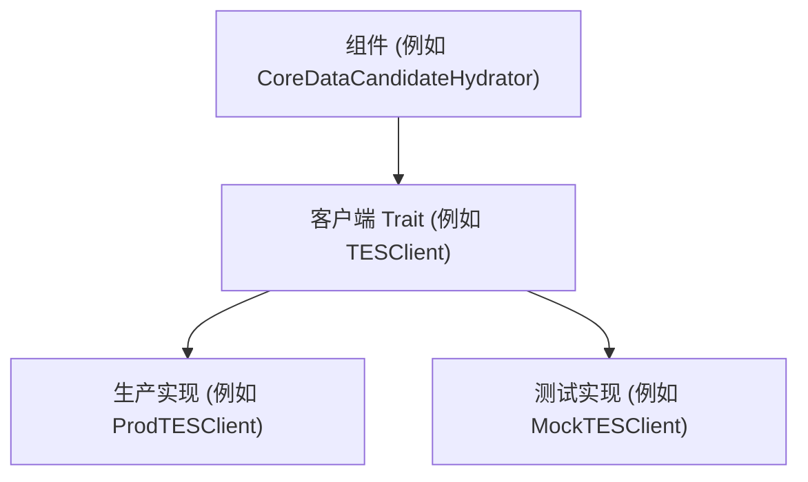
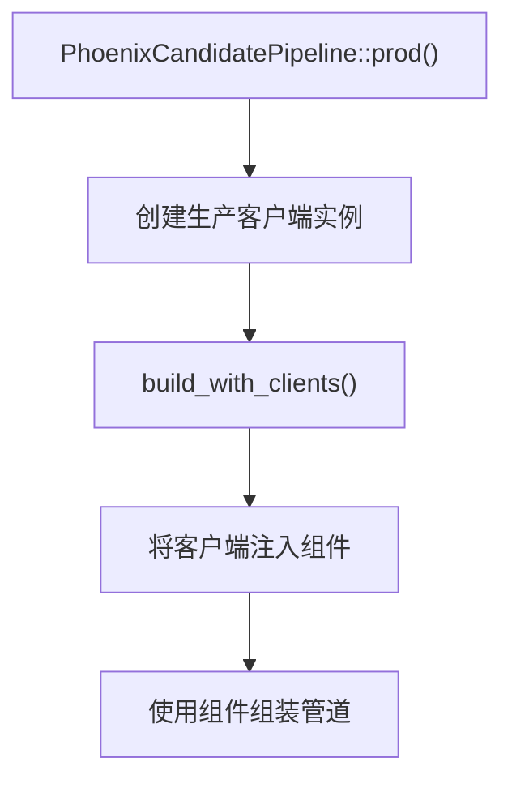
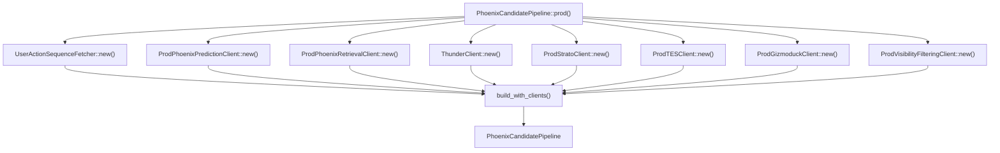
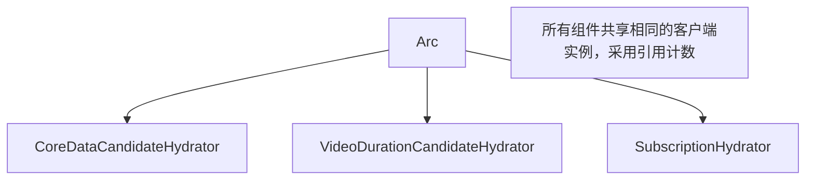

# 客户端架构 (Client Architecture)

相关源文件

-   [home-mixer/candidate_pipeline/phoenix_candidate_pipeline.rs](https://github.com/xai-org/x-algorithm/blob/aaa167b3/home-mixer/candidate_pipeline/phoenix_candidate_pipeline.rs)

## 目的与范围

本页记录了主混频器 (Home Mixer) 用于与外部服务通信的基于 Trait 的抽象层。它涵盖了客户端接口设计模式、依赖注入策略、生产与测试配置，以及客户端实例在整个候选管道框架中的生命周期。

有关特定客户端实现及其服务交互的文档，请参阅[推文实体服务 (Tweet Entity Service, TES)](/xai-org/x-algorithm/5.2-tweet-entity-service-(tes))、[Gizmoduck 服务 (Gizmoduck Service)](/xai-org/x-algorithm/5.3-gizmoduck-service)、[可见性过滤服务 (Visibility Filtering Service)](/xai-org/x-algorithm/5.4-visibility-filtering-service)、[Phoenix ML 服务 (Phoenix ML Services)](/xai-org/x-algorithm/5.5-phoenix-ml-services)、[Thunder 服务 (Thunder Service)](/xai-org/x-algorithm/5.6-thunder-service) 以及 [Strato 及其他服务 (Strato and Other Services)](/xai-org/x-algorithm/5.7-strato-and-other-services)。

---

## 概述

客户端架构遵循基于 Trait 的抽象模式，将管道实现与具体的服务集成解耦。每个外部服务都通过一个 Rust Trait 接口进行访问，其中生产实现处理实际的 gRPC/HTTP 通信，而潜在的测试实现则提供模拟 (Mock) 或存根 (Stub)。

这种架构提供了：

-   **可测试性**：可以在不依赖实时服务的情况下注入模拟客户端进行单元测试。
-   **模块化**：服务可以独立于管道逻辑进行更换或升级。
-   **类型安全**：Trait 限定 (Trait Bounds) 强制执行关于客户端能力的编译时保证。
-   **线程安全**：`Send + Sync` 限定确保客户端可以安全地在异步任务之间共享。

来源：[home-mixer/candidate_pipeline/phoenix_candidate_pipeline.rs1-256](https://github.com/xai-org/x-algorithm/blob/aaa167b3/home-mixer/candidate_pipeline/phoenix_candidate_pipeline.rs#L1-L256)

---

## 客户端 Trait 模式 (Client Trait Pattern)

### Trait 接口与实现结构

每个外部服务集成都遵循一致的模式：

1.  **Trait 接口**：定义与服务交互的契约（例如 `TESClient`, `GizmoduckClient`）。
2.  **生产实现**：实现 Trait 的具体结构体，包含实际的服务调用（例如 `ProdTESClient`, `ProdGizmoduckClient`）。
3.  **Trait 限定**：所有客户端 Trait 都需要 `Send + Sync`，以便在异步上下文中安全地进行线程间共享。


**Trait 接口示例模式**

Trait 通常为服务操作定义异步方法：

```rust
pub trait TESClient: Send + Sync {
    async fn get_tweets(&self, ids: Vec<i64>) -> Result<Vec<Tweet>>;
    async fn get_media_entities(&self, ids: Vec<i64>) -> Result<Vec<MediaEntity>>;
}
```
**生产实现模式**

生产实现包含 gRPC 客户端 and 连接逻辑：

```rust
pub struct ProdTESClient {
    grpc_client: TweetEntityServiceGrpcClient,
}

impl TESClient for ProdTESClient {
    async fn get_tweets(&self, ids: Vec<i64>) -> Result<Vec<Tweet>> {
        // 到 TES 的实际 gRPC 调用
    }
}
```
来源：[home-mixer/candidate_pipeline/phoenix_candidate_pipeline.rs9-21](https://github.com/xai-org/x-algorithm/blob/aaa167b3/home-mixer/candidate_pipeline/phoenix_candidate_pipeline.rs#L9-L21) [home-mixer/candidate_pipeline/phoenix_candidate_pipeline.rs73-82](https://github.com/xai-org/x-algorithm/blob/aaa167b3/home-mixer/candidate_pipeline/phoenix_candidate_pipeline.rs#L73-L82)

---

## 客户端清单 (Client Inventory)

下表列出了管道中使用的所有客户端 Trait：

| 客户端 Trait | 生产实现 | 目的 | 使用者 |
| --- | --- | --- | --- |
| `TESClient` | `ProdTESClient` | 推文元数据、媒体实体、订阅数据 | CoreDataCandidateHydrator, VideoDurationCandidateHydrator, SubscriptionHydrator |
| `GizmoduckClient` | `ProdGizmoduckClient` | 用户个人资料数据、粉丝数、显示名称 | GizmoduckCandidateHydrator |
| `VisibilityFilteringClient` | `ProdVisibilityFilteringClient` | 带有安全级别的内容安全过滤 | VFCandidateHydrator, VFFilter |
| `PhoenixPredictionClient` | `ProdPhoenixPredictionClient` | Grok Transformer 互动预测 | PhoenixScorer |
| `PhoenixRetrievalClient` | `ProdPhoenixRetrievalClient` | 针对网外候选推文的双塔相似性搜索 | PhoenixSource |
| `StratoClient` | `ProdStratoClient` | 分布式缓存和用户特征 | UserFeaturesQueryHydrator, CacheRequestInfoSideEffect |
| `ThunderClient` | `ThunderClient` | 实时网内推文检索 | ThunderSource |
| `SocialGraphClient` | `SocialGraphClient` | 用户关系（关注、屏蔽、静音） | AuthorSocialgraphFilter (间接) |
| `UserActionSequenceFetcher` | `UserActionSequenceFetcher` | 用户互动历史和行为序列 | UserActionSeqQueryHydrator |

来源：[home-mixer/candidate_pipeline/phoenix_candidate_pipeline.rs9-21](https://github.com/xai-org/x-algorithm/blob/aaa167b3/home-mixer/candidate_pipeline/phoenix_candidate_pipeline.rs#L9-L21) [home-mixer/candidate_pipeline/phoenix_candidate_pipeline.rs35-44](https://github.com/xai-org/x-algorithm/blob/aaa167b3/home-mixer/candidate_pipeline/phoenix_candidate_pipeline.rs#L35-L44)

---

## 依赖注入模式 (Dependency Injection Pattern)

### build_with_clients 方法

`PhoenixCandidatePipeline` 使用两阶段初始化模式，将客户端创建与管道构造分离。


**build_with_clients 签名**

`build_with_clients` 方法接受包装在 `Arc` 中的所有客户端依赖项作为 Trait 对象参数：

[home-mixer/candidate_pipeline/phoenix_candidate_pipeline.rs73-82](https://github.com/xai-org/x-algorithm/blob/aaa167b3/home-mixer/candidate_pipeline/phoenix_candidate_pipeline.rs#L73-L82)

```rust
async fn build_with_clients(
    uas_fetcher: Arc<UserActionSequenceFetcher>,
    phoenix_client: Arc<dyn PhoenixPredictionClient + Send + Sync>,
    phoenix_retrieval_client: Arc<dyn PhoenixRetrievalClient + Send + Sync>,
    thunder_client: Arc<ThunderClient>,
    strato_client: Arc<dyn StratoClient + Send + Sync>,
    tes_client: Arc<dyn TESClient + Send + Sync>,
    gizmoduck_client: Arc<dyn GizmoduckClient + Send + Sync>,
    vf_client: Arc<dyn VisibilityFilteringClient + Send + Sync>,
) -> PhoenixCandidatePipeline
```
**关键设计选择**：

-   **Arc 包装**：支持在需要相同客户端的多个组件之间共享所有权。
-   **Trait 对象**：`Arc<dyn Trait + Send + Sync>` 允许注入任何实现。
-   **Send + Sync 限定**：在管道中的异步任务之间共享客户端所必需的。

### 向组件分发客户端

在 `build_with_clients` 内部，客户端被分发到需要它们的组件中：

[home-mixer/candidate_pipeline/phoenix_candidate_pipeline.rs84-147](https://github.com/xai-org/x-algorithm/blob/aaa167b3/home-mixer/candidate_pipeline/phoenix_candidate_pipeline.rs#L84-L147)

**查询充实器接收客户端**：

```rust
let query_hydrators: Vec<Box<dyn QueryHydrator<ScoredPostsQuery>>> = vec![
    Box::new(UserActionSeqQueryHydrator::new(uas_fetcher)),
    Box::new(UserFeaturesQueryHydrator {
        strato_client: strato_client.clone(),
    }),
];
```
**来源接收客户端**：

```rust
let phoenix_source = Box::new(PhoenixSource {
    phoenix_retrieval_client,
});
let thunder_source = Box::new(ThunderSource { thunder_client });
```
**充实器接收客户端**：

```rust
let hydrators: Vec<Box<dyn Hydrator<ScoredPostsQuery, PostCandidate>>> = vec![
    Box::new(CoreDataCandidateHydrator::new(tes_client.clone()).await),
    Box::new(GizmoduckCandidateHydrator::new(gizmoduck_client).await),
    Box::new(VideoDurationCandidateHydrator::new(tes_client.clone()).await),
    Box::new(SubscriptionHydrator::new(tes_client.clone()).await),
    // ...
];
```
**评分器接收客户端**：

```rust
let phoenix_scorer = Box::new(PhoenixScorer { phoenix_client });
```
**副作用接收客户端**：

```rust
let side_effects: Arc<Vec<Box<dyn SideEffect<ScoredPostsQuery, PostCandidate>>>> =
    Arc::new(vec![Box::new(CacheRequestInfoSideEffect { strato_client })]);
```
来源：[home-mixer/candidate_pipeline/phoenix_candidate_pipeline.rs73-160](https://github.com/xai-org/x-algorithm/blob/aaa167b3/home-mixer/candidate_pipeline/phoenix_candidate_pipeline.rs#L73-L160)

---

## 生产与测试配置

### 生产配置

`prod()` 方法使用真实的服务客户端创建生产配置：

[home-mixer/candidate_pipeline/phoenix_candidate_pipeline.rs162-212](https://github.com/xai-org/x-algorithm/blob/aaa167b3/home-mixer/candidate_pipeline/phoenix_candidate_pipeline.rs#L162-L212)


每个生产客户端执行：

1.  **异步初始化**：在 `new()` 上调用 `.await` 以建立连接。
2.  **错误处理**：`expect()` 用于传播初始化失败。
3.  **Arc 包装**：包装实例以便共享所有权。
4.  **服务特定配置**：某些客户端（例如 VF）需要 TLS 证书路径。

**VF 客户端 TLS 配置示例**：

[home-mixer/candidate_pipeline/phoenix_candidate_pipeline.rs192-200](https://github.com/xai-org/x-algorithm/blob/aaa167b3/home-mixer/candidate_pipeline/phoenix_candidate_pipeline.rs#L192-L200)

```rust
let vf_client = Arc::new(
    ProdVisibilityFilteringClient::new(
        S2S_CHAIN_PATH.clone(),
        S2S_CRT_PATH.clone(),
        S2S_KEY_PATH.clone()
    )
    .await
    .expect("Failed to create VF client"),
);
```
### 测试配置模式

虽然在提供的文件中未显示，但测试配置模式将遵循：

```rust
impl PhoenixCandidatePipeline {
    #[cfg(test)]
    pub async fn test(
        mock_tes: Arc<dyn TESClient + Send + Sync>,
        mock_gizmoduck: Arc<dyn GizmoduckClient + Send + Sync>,
        // ... 其他模拟对象
    ) -> PhoenixCandidatePipeline {
        PhoenixCandidatePipeline::build_with_clients(
            // 注入模拟实现
        ).await
    }
}
```
这允许单元测试注入模拟客户端，从而在不需要实时服务的情况下返回受控数据。

来源：[home-mixer/candidate_pipeline/phoenix_candidate_pipeline.rs162-212](https://github.com/xai-org/x-algorithm/blob/aaa167b3/home-mixer/candidate_pipeline/phoenix_candidate_pipeline.rs#L162-L212)

---

## 客户端生命周期与所有权

### 基于 Arc 的共享所有权

客户端使用 `Arc<T>` (原子引用计数) 在管道组件之间共享所有权：


**客户端克隆模式**：

当多个组件 need 相同的客户端时，使用 `Arc::clone()` 来增加引用计数，而不会复制底层的客户端：

[home-mixer/candidate_pipeline/phoenix_candidate_pipeline.rs102-104](https://github.com/xai-org/x-algorithm/blob/aaa167b3/home-mixer/candidate_pipeline/phoenix_candidate_pipeline.rs#L102-L104)

```rust
Box::new(CoreDataCandidateHydrator::new(tes_client.clone()).await),
Box::new(VideoDurationCandidateHydrator::new(tes_client.clone()).await),
Box::new(SubscriptionHydrator::new(tes_client.clone()).await),
```
这种模式确保了：

-   **单一实例**：每个服务只有一个连接池。
-   **自动清理**：当所有引用被释放时，客户端将被丢弃。
-   **线程安全**：`Arc` 为并发访问提供原子引用计数。

### 线程安全要求

所有客户端必须实现 `Send + Sync`：

-   **Send**：客户端可以在线程之间转移。
-   **Sync**：可以通过 `&self` 引用同时从多个线程访问客户端。

这些限定在 Trait 对象声明中强制执行：

```rust
Arc<dyn TESClient + Send + Sync>
Arc<dyn GizmoduckClient + Send + Sync>
Arc<dyn VisibilityFilteringClient + Send + Sync>
```
这是至关重要的，因为管道在跨异步任务并行执行各阶段，需要对共享客户端实例进行并发访问。

来源：[home-mixer/candidate_pipeline/phoenix_candidate_pipeline.rs73-82](https://github.com/xai-org/x-algorithm/blob/aaa167b3/home-mixer/candidate_pipeline/phoenix_candidate_pipeline.rs#L73-L82) [home-mixer/candidate_pipeline/phoenix_candidate_pipeline.rs100-106](https://github.com/xai-org/x-algorithm/blob/aaa167b3/home-mixer/candidate_pipeline/phoenix_candidate_pipeline.rs#L100-L106)

---

## 客户端到组件的依赖流

下图展示了哪些管道组件依赖于哪些客户端：

```mermaid
flowchart TD
    UASClient["UserActionSequenceFetcher"]
    StratoClient["Arc<dyn StratoClient>"]
    PhoenixPredClient["Arc<dyn PhoenixPredictionClient>"]
    PhoenixRetClient["Arc<dyn PhoenixRetrievalClient>"]
    ThunderClient["Arc<ThunderClient>"]
    TESClient["Arc<dyn TESClient>"]
    GizmoClient["Arc<dyn GizmoduckClient>"]
    VFClient["Arc<dyn VisibilityFilteringClient>"]
    UASQH["UserActionSeqQueryHydrator"]
    UFQH["UserFeaturesQueryHydrator"]
    PhoenixSrc["PhoenixSource"]
    ThunderSrc["ThunderSource"]
    CoreData["CoreDataCandidateHydrator"]
    VideoDur["VideoDurationCandidateHydrator"]
    Subscription["SubscriptionHydrator"]
    Gizmoduck["GizmoduckCandidateHydrator"]
    VFHydrator["VFCandidateHydrator"]
    PhoenixScorer["PhoenixScorer"]
    CacheSE["CacheRequestInfoSideEffect"]

    UASClient --> UASQH
    StratoClient --> UFQH
    StratoClient --> CacheSE
    PhoenixRetClient --> PhoenixSrc
    ThunderClient --> ThunderSrc
    TESClient --> CoreData
    TESClient --> VideoDur
    TESClient --> Subscription
    GizmoClient --> Gizmoduck
    VFClient --> VFHydrator
    PhoenixPredClient --> PhoenixScorer
```


这种架构创造了清晰的职责分离：

-   **查询充实器**从 UAS 和 Strato 获取用户上下文。
-   **来源**从 Thunder 和 Phoenix 检索中获取候选推文。
-   **充实器**使用 TES、Gizmoduck 和 VF 富集候选推文。
-   **评分器**使用 Phoenix 机器学习 (ML) 计算互动预测。
-   **副作用**使用 Strato 缓存请求元数据。

来源：[home-mixer/candidate_pipeline/phoenix_candidate_pipeline.rs73-147](https://github.com/xai-org/x-algorithm/blob/aaa167b3/home-mixer/candidate_pipeline/phoenix_candidate_pipeline.rs#L73-L147)

---

## 总结

客户端架构通过以下方式实现了管道逻辑与外部服务集成之间的清晰分离：

1.  **基于 Trait 的抽象**：服务交互由 Trait 定义，而非具体实现。
2.  **依赖注入**：通过 `build_with_clients()` 构造函数注入客户端。
3.  **基于 Arc 的共享**：单个客户端实例在多个组件之间共享。
4.  **线程安全**：`Send + Sync` 限定实现了安全的并发访问。
5.  **生产/测试分离**：相同的管道代码可以与真实或模拟客户端配合使用。

这种设计使得管道能够在保持类型安全和线程安全保证的同时，保持可测试性、模块化，并独立于服务的实现细节。

来源：[home-mixer/candidate_pipeline/phoenix_candidate_pipeline.rs1-256](https://github.com/xai-org/x-algorithm/blob/aaa167b3/home-mixer/candidate_pipeline/phoenix_candidate_pipeline.rs#L1-L256)
