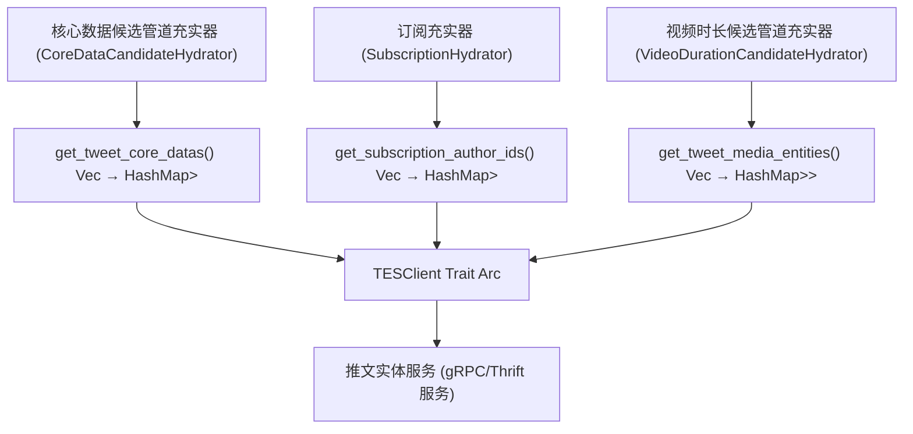
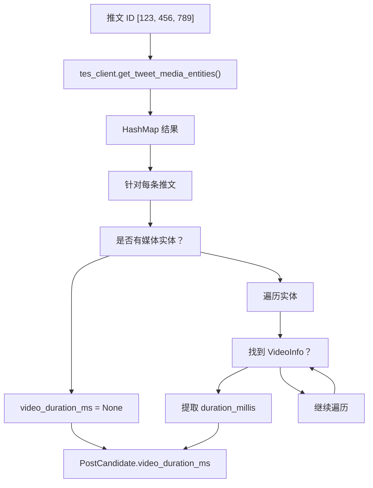
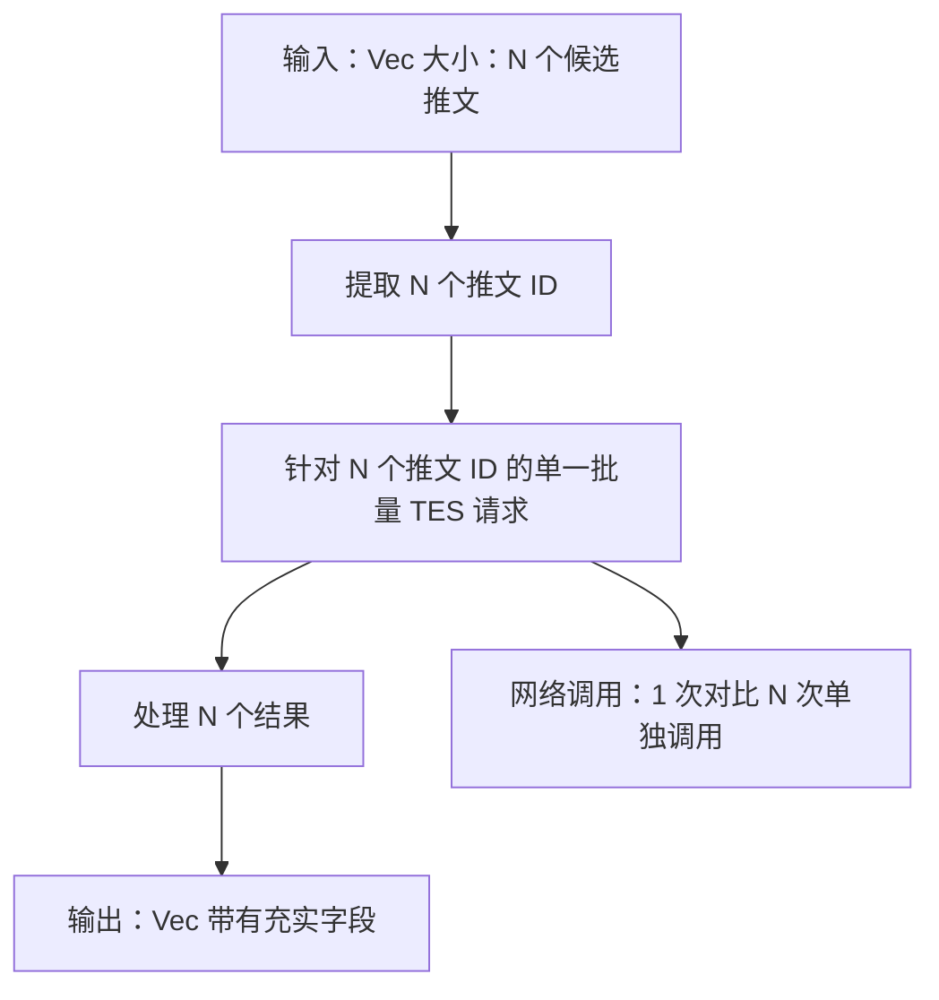
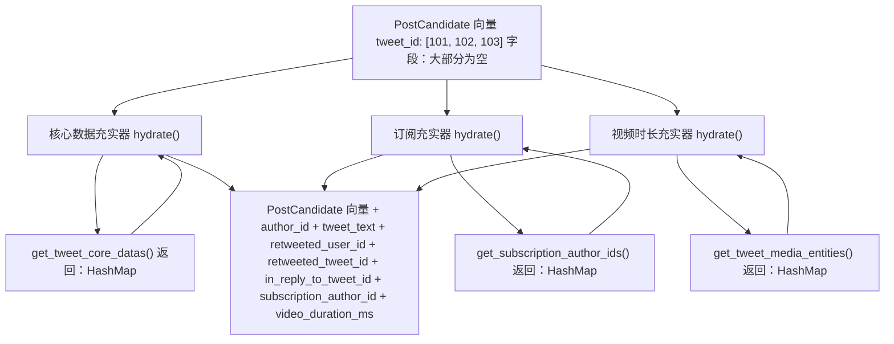

# 推文实体服务 (Tweet Entity Service, TES)

相关源文件

-   [home-mixer/candidate_hydrators/core_data_candidate_hydrator.rs](https://github.com/xai-org/x-algorithm/blob/aaa167b3/home-mixer/candidate_hydrators/core_data_candidate_hydrator.rs)
-   [home-mixer/candidate_hydrators/subscription_hydrator.rs](https://github.com/xai-org/x-algorithm/blob/aaa167b3/home-mixer/candidate_hydrators/subscription_hydrator.rs)
-   [home-mixer/candidate_hydrators/video_duration_candidate_hydrator.rs](https://github.com/xai-org/x-algorithm/blob/aaa167b3/home-mixer/candidate_hydrators/video_duration_candidate_hydrator.rs)

## 目的与范围

本文档描述了通过 `TESClient` Trait 抽象与推文实体服务 (TES) 的集成。TES 提供推文元数据，包括核心数据（文本、作者、转发/回复信息）、媒体实体（视频时长、图像）以及订阅相关信息。

有关通用客户端架构模式和依赖注入，请参阅[客户端架构 (Client Architecture)](/xai-org/x-algorithm/5.1-client-architecture)。有关其他外部服务集成，请参阅 [Gizmoduck 服务 (Gizmoduck Service)](/xai-org/x-algorithm/5.3-gizmoduck-service)、[可见性过滤服务 (Visibility Filtering Service)](/xai-org/x-algorithm/5.4-visibility-filtering-service) 以及 [Phoenix ML 服务 (Phoenix ML Services)](/xai-org/x-algorithm/5.5-phoenix-ml-services)。

## 概述

推文实体服务 (TES) 是一个集中的外部服务，用于存储和提供推文级的元数据。在主混频器 (Home Mixer) 管道中，三个充实器依赖于 `TESClient` 来为 `PostCandidate` 对象富集不同类型的推文数据：

| 充实器 | TES 方法 | 检索到的数据 |
| --- | --- | --- |
| `CoreDataCandidateHydrator` | `get_tweet_core_datas()` | 推文文本、作者 ID、转发信息、回复元数据 |
| `SubscriptionHydrator` | `get_subscription_author_ids()` | 高级内容的订阅作者 ID |
| `VideoDurationCandidateHydrator` | `get_tweet_media_entities()` | 带有以毫秒为单位的视频时长的媒体实体 |

所有 TES 操作都按推文 ID 进行批处理，以最大限度地减少候选管道充实阶段的网络往返。

## TESClient Trait 接口

`TESClient` Trait 定义了与 TES 通信的抽象层。该 Trait 旨在支持接受多个推文 ID 并返回结果映射的批量检索操作。


**TESClient 方法签名**

该 Trait 公开了三个异步方法，每个方法都返回一个 `Result<HashMap<i64, Option<T>>, Error>`：

1.  **`get_tweet_core_datas(tweet_ids: Vec<i64>)`**：返回核心推文元数据，包括文本、作者 ID、针对转发的原始推文/用户，以及回复信息。

2.  **`get_subscription_author_ids(tweet_ids: Vec<i64>)`**：针对属于高级/订阅内容的推文返回订阅作者 ID，或者针对非订阅推文返回 `None`。

3.  **`get_tweet_media_entities(tweet_ids: Vec<i64>)`**：返回附加到推文的媒体实体向量，其中可能包括照片、视频或 GIF 及其相关的元数据。

所有方法都使用 `HashMap<i64, Option<T>>` 作为返回类型，以处理：

-   **缺失键 (Missing keys)**：TES 中未找到的推文将不在映射中。
-   **None 值**：已找到推文但缺少请求的数据（例如无订阅、无媒体）。

来源：[home-mixer/candidate_hydrators/core_data_candidate_hydrator.rs1-59](https://github.com/xai-org/x-algorithm/blob/aaa167b3/home-mixer/candidate_hydrators/core_data_candidate_hydrator.rs#L1-L59) [home-mixer/candidate_hydrators/subscription_hydrator.rs1-51](https://github.com/xai-org/x-algorithm/blob/aaa167b3/home-mixer/candidate_hydrators/subscription_hydrator.rs#L1-L51) [home-mixer/candidate_hydrators/video_duration_candidate_hydrator.rs1-63](https://github.com/xai-org/x-algorithm/blob/aaa167b3/home-mixer/candidate_hydrators/video_duration_candidate_hydrator.rs#L1-L63)

## 数据模型

### TweetCoreData (推文核心数据)

`TweetCoreData` 结构包含基本的推文信息：

| 字段 | 类型 | 描述 |
| --- | --- | --- |
| `text` | `String` | 推文的文本内容 |
| `author_id` | `i64` | 推文作者的用户 ID |
| `source_user_id` | `Option<i64>` | 针对转发的原始作者 ID |
| `source_tweet_id` | `Option<i64>` | 针对转发的原始推文 ID |
| `in_reply_to_tweet_id` | `Option<i64>` | 如果这是回复，则为父推文 ID |

**使用模式**：`CoreDataCandidateHydrator` 提取这些字段来填充 `PostCandidate` 结构的核心元数据字段 [home-mixer/candidate_hydrators/core_data_candidate_hydrator.rs38-43](https://github.com/xai-org/x-algorithm/blob/aaa167b3/home-mixer/candidate_hydrators/core_data_candidate_hydrator.rs#L38-L43)。

### MediaEntity 和 MediaInfo (媒体实体与信息)

`MediaEntity` 结构代表带有可选 `MediaInfo` 的附件媒体：


`VideoDurationCandidateHydrator` 遍历媒体实体，查找 `MediaInfo::VideoInfo` 变体以提取 `duration_millis` 字段 [home-mixer/candidate_hydrators/video_duration_candidate_hydrator.rs39-47](https://github.com/xai-org/x-algorithm/blob/aaa167b3/home-mixer/candidate_hydrators/video_duration_candidate_hydrator.rs#L39-L47)。

来源：[home-mixer/candidate_hydrators/video_duration_candidate_hydrator.rs1-63](https://github.com/xai-org/x-algorithm/blob/aaa167b3/home-mixer/candidate_hydrators/video_duration_candidate_hydrator.rs#L1-L63) [home-mixer/candidate_hydrators/core_data_candidate_hydrator.rs34-46](https://github.com/xai-org/x-algorithm/blob/aaa167b3/home-mixer/candidate_hydrators/core_data_candidate_hydrator.rs#L34-L46)

## 充实器集成模式

### CoreDataCandidateHydrator (核心数据候选管道充实器)

**目的**：使用来自 TES 的核心推文元数据富集候选推文。

**实现流程**：

> **[Mermaid sequence]**
> *(图表结构无法解析)*

**字段映射**：

充实器从 `TweetCoreData` 中提取特定字段，并将它们映射到 `PostCandidate` 字段 [home-mixer/candidate_hydrators/core_data_candidate_hydrator.rs38-46](https://github.com/xai-org/x-algorithm/blob/aaa167b3/home-mixer/candidate_hydrators/core_data_candidate_hydrator.rs#L38-L46)：

```text
TweetCoreData.author_id          → PostCandidate.author_id
TweetCoreData.source_user_id     → PostCandidate.retweeted_user_id
TweetCoreData.source_tweet_id    → PostCandidate.retweeted_tweet_id
TweetCoreData.in_reply_to_tweet_id → PostCandidate.in_reply_to_tweet_id
TweetCoreData.text               → PostCandidate.tweet_text
```
**更新策略**：`update()` 方法将充实后的字段合并到现有的候选推文中 [home-mixer/candidate_hydrators/core_data_candidate_hydrator.rs52-57](https://github.com/xai-org/x-algorithm/blob/aaa167b3/home-mixer/candidate_hydrators/core_data_candidate_hydrator.rs#L52-L57)，遵循标准的充实器模式，其中 `hydrate()` 产生新的候选推文对象，而 `update()` 执行字段级的合并。

来源：[home-mixer/candidate_hydrators/core_data_candidate_hydrator.rs1-59](https://github.com/xai-org/x-algorithm/blob/aaa167b3/home-mixer/candidate_hydrators/core_data_candidate_hydrator.rs#L1-L59)

### SubscriptionHydrator (订阅充实器)

**目的**：通过检索订阅作者 ID 来识别高级/订阅推文。

**实现流程**：

充实器遵循相同的批处理模式：

1.  从候选推文中提取推文 ID [home-mixer/candidate_hydrators/subscription_hydrator.rs28](https://github.com/xai-org/x-algorithm/blob/aaa167b3/home-mixer/candidate_hydrators/subscription_hydrator.rs#L28-L28)。
2.  调用 `tes_client.get_subscription_author_ids(tweet_ids)` [home-mixer/candidate_hydrators/subscription_hydrator.rs30](https://github.com/xai-org/x-algorithm/blob/aaa167b3/home-mixer/candidate_hydrators/subscription_hydrator.rs#L30-L30)。
3.  对于每条推文，从结果映射中提取 `subscription_author_id` [home-mixer/candidate_hydrators/subscription_hydrator.rs36](https://github.com/xai-org/x-algorithm/blob/aaa167b3/home-mixer/candidate_hydrators/subscription_hydrator.rs#L36-L36)。
4.  填充 `PostCandidate.subscription_author_id` 字段 [home-mixer/candidate_hydrators/subscription_hydrator.rs38](https://github.com/xai-org/x-algorithm/blob/aaa167b3/home-mixer/candidate_hydrators/subscription_hydrator.rs#L38-L38)。

**字段更新**：`update()` 方法分配 `subscription_author_id` 字段 [home-mixer/candidate_hydrators/subscription_hydrator.rs47-49](https://github.com/xai-org/x-algorithm/blob/aaa167b3/home-mixer/candidate_hydrators/subscription_hydrator.rs#L47-L49)，下游过滤器可以使用该字段来应用订阅特定的规则。

**用例**：这些数据使管道能够区分免费和高级内容，从而允许对订阅推文进行专门的过滤或排名调整。

来源：[home-mixer/candidate_hydrators/subscription_hydrator.rs1-51](https://github.com/xai-org/x-algorithm/blob/aaa167b3/home-mixer/candidate_hydrators/subscription_hydrator.rs#L1-L51)

### VideoDurationCandidateHydrator (视频时长候选管道充实器)

**目的**：为带有视频附件的候选推文提取视频时长元数据。

**实现流程**：


**关键逻辑**：充实器在媒体实体向量中搜索第一个 `MediaInfo::VideoInfo` 变体，并提取其 `duration_millis` 字段 [home-mixer/candidate_hydrators/video_duration_candidate_hydrator.rs39-47](https://github.com/xai-org/x-algorithm/blob/aaa167b3/home-mixer/candidate_hydrators/video_duration_candidate_hydrator.rs#L39-L47)：

```rust
// 模式匹配以查找视频时长
let video_duration_ms = media_entities.and_then(|entities| {
    entities.iter().find_map(|entity| {
        if let Some(MediaInfo::VideoInfo(video_info)) = &entity.media_info {
            Some(video_info.duration_millis)
        } else {
            None
        }
    })
});
```
**结果**：为视频推文填充 `video_duration_ms` 字段，允许下游组件应用针对视频的逻辑（例如过滤长视频、对视频内容进行不同的排名）。

来源：[home-mixer/candidate_hydrators/video_duration_candidate_hydrator.rs1-63](https://github.com/xai-org/x-algorithm/blob/aaa167b3/home-mixer/candidate_hydrators/video_duration_candidate_hydrator.rs#L1-L63)

## 批处理与性能特征

### 批量请求模式

所有三个充实器都遵循相同的批处理模式，以优化网络效率：


**效率**：通过在单个 RPC 调用中批量处理所有推文 ID，充实器最大限度地减少了：

-   网络往返（1 次调用对比 N 次调用）。
-   连接开销。
-   来自多个小请求的服务负载。

**实现**：每个充实器：

1.  从候选推文切片中收集所有推文 ID [home-mixer/candidate_hydrators/core_data_candidate_hydrator.rs28](https://github.com/xai-org/x-algorithm/blob/aaa167b3/home-mixer/candidate_hydrators/core_data_candidate_hydrator.rs#L28-L28)。
2.  发起单次批量调用 [home-mixer/candidate_hydrators/core_data_candidate_hydrator.rs30](https://github.com/xai-org/x-algorithm/blob/aaa167b3/home-mixer/candidate_hydrators/core_data_candidate_hydrator.rs#L30-L30)。
3.  处理返回的映射以构建充实后的候选推文 [home-mixer/candidate_hydrators/core_data_candidate_hydrator.rs33-49](https://github.com/xai-org/x-algorithm/blob/aaa167b3/home-mixer/candidate_hydrators/core_data_candidate_hydrator.rs#L33-L49)。

### 错误处理

所有三个充实器都使用 `.map_err(|e| e.to_string())?` 将 TES 客户端错误转换为字符串错误 [home-mixer/candidate_hydrators/core_data_candidate_hydrator.rs31](https://github.com/xai-org/x-algorithm/blob/aaa167b3/home-mixer/candidate_hydrators/core_data_candidate_hydrator.rs#L31-L31)。如果 TES 调用失败，则整个充实步骤失败，并向上传播到管道执行器。

**缺失数据处理**：代码能够优雅地处理缺失数据：

-   缺失映射条目：使用 `.get(&tweet_id)`，它返回 `Option` [home-mixer/candidate_hydrators/core_data_candidate_hydrator.rs35](https://github.com/xai-org/x-algorithm/blob/aaa167b3/home-mixer/candidate_hydrators/core_data_candidate_hydrator.rs#L35-L35)。
-   映射中的 None 值：使用 `.and_then()` 进行安全链式调用 [home-mixer/candidate_hydrators/core_data_candidate_hydrator.rs36](https://github.com/xai-org/x-algorithm/blob/aaa167b3/home-mixer/candidate_hydrators/core_data_candidate_hydrator.rs#L36-L36)。
-   默认值：使用 `.unwrap_or_default()` 或显式默认值 [home-mixer/candidate_hydrators/core_data_candidate_hydrator.rs39](https://github.com/xai-org/x-algorithm/blob/aaa167b3/home-mixer/candidate_hydrators/core_data_candidate_hydrator.rs#L39-L39)。

这种模式确保了单个推文的缺失不会导致整个批次的失败。

来源：[home-mixer/candidate_hydrators/core_data_candidate_hydrator.rs28-49](https://github.com/xai-org/x-algorithm/blob/aaa167b3/home-mixer/candidate_hydrators/core_data_candidate_hydrator.rs#L28-L49) [home-mixer/candidate_hydrators/subscription_hydrator.rs28-44](https://github.com/xai-org/x-algorithm/blob/aaa167b3/home-mixer/candidate_hydrators/subscription_hydrator.rs#L28-L44) [home-mixer/candidate_hydrators/video_duration_candidate_hydrator.rs28-54](https://github.com/xai-org/x-algorithm/blob/aaa167b3/home-mixer/candidate_hydrators/video_duration_candidate_hydrator.rs#L28-L54)

## 依赖注入

所有三个充实器都通过其构造函数接收 `TESClient`，形式为 `Arc<dyn TESClient + Send + Sync>`：

| 充实器 | 构造函数 |
| --- | --- |
| `CoreDataCandidateHydrator` | `new(tes_client: Arc<dyn TESClient + Send + Sync>)` |
| `SubscriptionHydrator` | `new(tes_client: Arc<dyn TESClient + Send + Sync>)` |
| `VideoDurationCandidateHydrator` | `new(tes_client: Arc<dyn TESClient + Send + Sync>)` |

这种基于 Trait 的依赖注入实现了：

-   **测试**：可以为单元测试注入模拟实现。
-   **配置**：可以更换生产对比分阶段 (Staging) 的 TES 端点。
-   **共享实例**：在所有充实器之间共享同一个 `Arc<dyn TESClient>` 实例，以启用连接池。

`PhoenixCandidatePipeline` 实例化一个单一的 `TESClient`，并在管道构造期间将其传递给所有三个充实器。

来源：[home-mixer/candidate_hydrators/core_data_candidate_hydrator.rs8-16](https://github.com/xai-org/x-algorithm/blob/aaa167b3/home-mixer/candidate_hydrators/core_data_candidate_hydrator.rs#L8-L16) [home-mixer/candidate_hydrators/subscription_hydrator.rs8-16](https://github.com/xai-org/x-algorithm/blob/aaa167b3/home-mixer/candidate_hydrators/subscription_hydrator.rs#L8-L16) [home-mixer/candidate_hydrators/video_duration_candidate_hydrator.rs9-17](https://github.com/xai-org/x-algorithm/blob/aaa167b3/home-mixer/candidate_hydrators/video_duration_candidate_hydrator.rs#L9-L17)

## 数据流总结

下图说明了从候选管道通过 TES 到充实后的候选推文的完整数据流：


来源：[home-mixer/candidate_hydrators/core_data_candidate_hydrator.rs19-58](https://github.com/xai-org/x-algorithm/blob/aaa167b3/home-mixer/candidate_hydrators/core_data_candidate_hydrator.rs#L19-L58) [home-mixer/candidate_hydrators/subscription_hydrator.rs19-50](https://github.com/xai-org/x-algorithm/blob/aaa167b3/home-mixer/candidate_hydrators/subscription_hydrator.rs#L19-L50) [home-mixer/candidate_hydrators/video_duration_candidate_hydrator.rs19-62](https://github.com/xai-org/x-algorithm/blob/aaa167b3/home-mixer/candidate_hydrators/video_duration_candidate_hydrator.rs#L19-L62)
