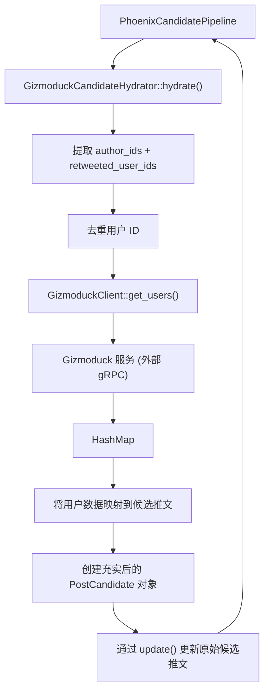
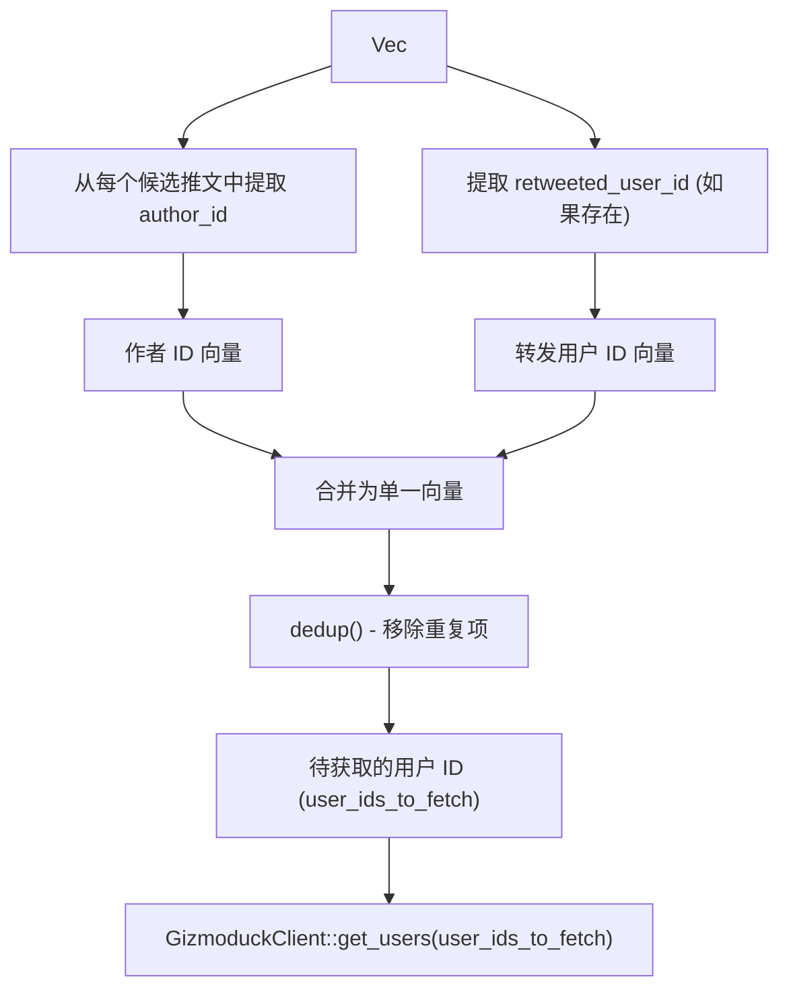
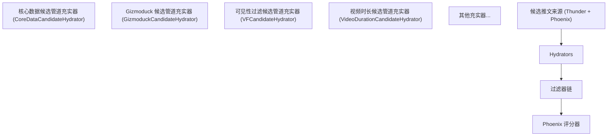

# Gizmoduck 服务 (Gizmoduck Service)

相关源文件

-   [home-mixer/candidate_hydrators/gizmoduck_hydrator.rs](https://github.com/xai-org/x-algorithm/blob/aaa167b3/home-mixer/candidate_hydrators/gizmoduck_hydrator.rs)

## 目的与范围

本文档描述了主混频器 (Home Mixer) 管道与 Gizmoduck 服务之间的集成，Gizmoduck 是一个提供用户个人资料信息和元数据的外部系统。主要的接口是 `GizmoduckCandidateHydrator`，它利用作者个人资料数据（包括粉丝数和显示名称）来富集候选推文。

有关候选管道充实器框架的一般信息，请参阅[候选管道充实器 (Candidate Hydrators)](/xai-org/x-algorithm/4.5-candidate-hydrators)。有关更广泛的客户端抽象架构的详细信息，请参阅[客户端架构 (Client Architecture)](/xai-org/x-algorithm/5.1-client-architecture)。

---

## 服务概述

Gizmoduck 服务是一个外部用户个人资料服务，存储并提供对用户账户信息的访问，包括：

-   显示名称 (Screen names)
-   关注者 (Follower) 和关注 (Following) 计数
-   用户个人资料元数据
-   账户状态信息

在主混频器管道中，Gizmoduck 在候选管道充实阶段被查询，以便将人类可读的作者信息附加到候选推文中。这些数据对于下游过滤（例如，屏蔽用户检查）以及在最终 Feed 响应中的呈现至关重要。

**关键特性：**

| 属性 | 值 |
| --- | --- |
| **服务类型** | 外部 gRPC/Thrift 服务 |
| **提供的数据** | 用户个人资料、计数、显示名称 |
| **查询模式** | 按用户 ID 进行批量的 multi-get |
| **流水线阶段** | 候选管道充实 |
| **执行模式** | 并行（与其他充实器一起） |

---

## 客户端架构

集成遵循在整个管道中使用的基于 Trait 的客户端抽象模式。`GizmoduckClient` Trait 定义了查询用户数据的接口，支持依赖注入和测试模拟。

### GizmoduckClient Trait

Trait 定义了单一的批量用户检索方法：

```rust
trait GizmoduckClient {
    async fn get_users(
        &self,
        user_ids: Vec<i64>
    ) -> Result<HashMap<i64, Option<UserProfile>>, Error>;
}
```
**方法语义：**

-   **输入**：用户 ID (i64) 的向量。
-   **输出**：从用户 ID 到可选用户个人资料数据的映射。
-   **错误处理**：如果服务调用失败则返回错误；部分结果以 `None` 值返回。
-   **批处理**：单次调用同时检索多个用户。

生产实现可能包装了一个 gRPC 或 Thrift 客户端来与 Gizmoduck 服务通信。测试实现可以在不依赖外部系统的情况下返回模拟数据。

**来源：** [home-mixer/candidate_hydrators/gizmoduck_hydrator.rs3-4](https://github.com/xai-org/x-algorithm/blob/aaa167b3/home-mixer/candidate_hydrators/gizmoduck_hydrator.rs#L3-L4)

---

## GizmoduckCandidateHydrator 实现

`GizmoduckCandidateHydrator` 实现了 `Hydrator<ScoredPostsQuery, PostCandidate>` Trait，以便在管道的充实阶段使用用户个人资料信息富集候选推文。

### 结构体定义

```rust
GizmoduckCandidateHydrator {
    gizmoduck_client: Arc<dyn GizmoduckClient + Send + Sync>
}
```
充实器持有一个对客户端的 `Arc` 引用，从而能够在不克隆底层服务连接的情况下，在异步管道中共享所有权。

**来源：** [home-mixer/candidate_hydrators/gizmoduck_hydrator.rs8-10](https://github.com/xai-org/x-algorithm/blob/aaa167b3/home-mixer/candidate_hydrators/gizmoduck_hydrator.rs#L8-L10)

### 数据流图


**来源：** [home-mixer/candidate_hydrators/gizmoduck_hydrator.rs18-81](https://github.com/xai-org/x-algorithm/blob/aaa167b3/home-mixer/candidate_hydrators/gizmoduck_hydrator.rs#L18-L81)

---

## 批处理策略

充实器实现了高效的批处理策略，以最大限度地减少服务调用并降低延迟。它不是单独查询每个用户，而是收集整个候选推文集中的所有唯一用户 ID，并发出单次批量请求。

### 用户 ID 收集过程


### 实现细节

批处理逻辑从候选推文中提取两类用户 ID：

1.  **作者 ID**：创建每条推文的用户 ([gizmoduck_hydrator.rs28-29](https://github.com/xai-org/x-algorithm/blob/aaa167b3/gizmoduck_hydrator.rs#L28-L29))。
2.  **转发用户 ID**：如果推文是转发的，则为原始作者 ([gizmoduck_hydrator.rs30-32](https://github.com/xai-org/x-algorithm/blob/aaa167b3/gizmoduck_hydrator.rs#L30-L32))。

实现执行以下步骤：

1.  将所有候选推文映射到其 `author_id` 值（始终存在）。
2.  将所有候选推文映射到其 `retweeted_user_id` 值（可能为 `None`）。
3.  扁平化转发 ID 列表以移除 `None` 条目。
4.  将两个 ID 列表从 `u64` 转换为 `i64`（Gizmoduck 预期的类型）。
5.  将两个列表合并为一个向量。
6.  调用 `dedup()` 移除重复的用户 ID。
7.  使用去重后的列表发起单次 `get_users()` 调用。

这种方法确保了如果多个候选推文共享同一作者，或者如果一位作者既作为创建者又作为转发者出现，他们也只会被获取一次。

**来源：** [home-mixer/candidate_hydrators/gizmoduck_hydrator.rs28-37](https://github.com/xai-org/x-algorithm/blob/aaa167b3/home-mixer/candidate_hydrators/gizmoduck_hydrator.rs#L28-L37) [home-mixer/candidate_hydrators/gizmoduck_hydrator.rs39-40](https://github.com/xai-org/x-algorithm/blob/aaa167b3/home-mixer/candidate_hydrators/gizmoduck_hydrator.rs#L39-L40)

---

## 充实后的字段

充实器使用从 Gizmoduck 服务响应中提取的三个字段来富集每个 `PostCandidate`。

### 字段映射表

| PostCandidate 字段 | 来源 | 类型 | 描述 |
| --- | --- | --- | --- |
| `author_followers_count` | `user.counts.followers_count` | `Option<i32>` | 推文作者的关注者数量 |
| `author_screen_name` | `user.profile.screen_name` | `Option<String>` | 推文作者的显示名称（句柄） |
| `retweeted_screen_name` | `retweeted_user.profile.screen_name` | `Option<String>` | 原始作者的显示名称（针对转发推文） |

### 字段提取逻辑

对于每个候选推文，充实器：

1.  **提取作者数据**：
    -   在返回的用户映射中查找候选推文的 `author_id`。
    -   通过嵌套结构导航：`user.user.counts.followers_count`。
    -   通过：`user.user.profile.screen_name` 导航。
    -   将关注者数量从 `i64` 转换为 `i32`。
    -   克隆显示名称字符串。
2.  **提取转发作者数据（有条件）**：
    -   检查是否存在 `retweeted_user_id`。
    -   如果存在，在映射中查找该用户 ID。
    -   从被转发用户的个人资料中提取 `screen_name`。
    -   如果 `retweeted_user_id` 为 `None`，则该字段保持为 `None`。

所有字段都是 `Option` 类型，因为：

-   用户数据可能缺失（注销账户、服务错误）。
-   嵌套字段在服务响应中可能为 `None`。
-   并非所有推文都是转发的（大多数推文的 `retweeted_user_id = None`）。

**来源：** [home-mixer/candidate_hydrators/gizmoduck_hydrator.rs44-70](https://github.com/xai-org/x-algorithm/blob/aaa167b3/home-mixer/candidate_hydrators/gizmoduck_hydrator.rs#L44-L70)

---

## 更新模式

充实器遵循标准的双方法充实模式：

1.  **`hydrate()` 方法**：创建新的 `PostCandidate` 结构体，仅填充 Gizmoduck 字段，并为所有其他字段使用 `Default::default()` ([gizmoduck_hydrator.rs64-70](https://github.com/xai-org/x-algorithm/blob/aaa167b3/gizmoduck_hydrator.rs#L64-L70))。

2.  **`update()` 方法**：选择性地将充实后的候选推文中的三个 Gizmoduck 字段复制到原始候选推文中，并保留所有其他字段 ([gizmoduck_hydrator.rs76-80](https://github.com/xai-org/x-algorithm/blob/aaa167b3/gizmoduck_hydrator.rs#L76-L80))。

这种模式确保充实器仅修改其拥有的字段，防止意外覆盖由其他充实器填充的数据。

**来源：** [home-mixer/candidate_hydrators/gizmoduck_hydrator.rs76-80](https://github.com/xai-org/x-algorithm/blob/aaa167b3/home-mixer/candidate_hydrators/gizmoduck_hydrator.rs#L76-L80)

---

## 在管道中的集成

`GizmoduckCandidateHydrator` 在 `PhoenixCandidatePipeline` 的候选管道充实阶段执行，与其他充实器（如 `CoreDataCandidateHydrator`、`VFCandidateHydrator` 和 `VideoDurationCandidateHydrator`）并行运行。

### 管道位置


### 执行特性

-   **并行性**：与其他充实器并发执行，以最大限度地减少总延迟。
-   **错误处理**：来自 `get_users()` 的错误会向上传播，导致整个充实阶段失败。
-   **统计收集**：`hydrate()` 方法上的 `#[xai_stats_macro::receive_stats]` 注解会自动记录延迟和错误指标 ([gizmoduck_hydrator.rs20](https://github.com/xai-org/x-algorithm/blob/aaa167b3/gizmoduck_hydrator.rs#L20-L20))。
-   **依赖项**：要求候选推文上存在 `author_id`（由 `CoreDataCandidateHydrator` 或来源填充）。

**来源：** [home-mixer/candidate_hydrators/gizmoduck_hydrator.rs20](https://github.com/xai-org/x-algorithm/blob/aaa167b3/home-mixer/candidate_hydrators/gizmoduck_hydrator.rs#L20-L20)

---

## 代码实体参考

### 主要类型

-   **充实器**：`GizmoduckCandidateHydrator` ([gizmoduck_hydrator.rs8](https://github.com/xai-org/x-algorithm/blob/aaa167b3/gizmoduck_hydrator.rs#L8-L8))
-   **客户端 Trait**：`GizmoduckClient` ([gizmoduck_hydrator.rs9](https://github.com/xai-org/x-algorithm/blob/aaa167b3/gizmoduck_hydrator.rs#L9-L9))
-   **查询类型**：`ScoredPostsQuery` ([gizmoduck_hydrator.rs2](https://github.com/xai-org/x-algorithm/blob/aaa167b3/gizmoduck_hydrator.rs#L2-L2))
-   **候选推文类型**：`PostCandidate` ([gizmoduck_hydrator.rs1](https://github.com/xai-org/x-algorithm/blob/aaa167b3/gizmoduck_hydrator.rs#L1-L1))

### 关键方法

-   **构造函数**：`GizmoduckCandidateHydrator::new()` ([gizmoduck_hydrator.rs13-15](https://github.com/xai-org/x-algorithm/blob/aaa167b3/gizmoduck_hydrator.rs#L13-L15))
-   **充实**：`Hydrator::hydrate()` ([gizmoduck_hydrator.rs21-74](https://github.com/xai-org/x-algorithm/blob/aaa167b3/gizmoduck_hydrator.rs#L21-L74))
-   **字段更新**：`Hydrator::update()` ([gizmoduck_hydrator.rs76-80](https://github.com/xai-org/x-algorithm/blob/aaa167b3/gizmoduck_hydrator.rs#L76-L80))
-   **客户端调用**：`GizmoduckClient::get_users()` ([gizmoduck_hydrator.rs39](https://github.com/xai-org/x-algorithm/blob/aaa167b3/gizmoduck_hydrator.rs#L39-L39))

### 文件位置

-   **实现**：[home-mixer/candidate_hydrators/gizmoduck_hydrator.rs](https://github.com/xai-org/x-algorithm/blob/aaa167b3/home-mixer/candidate_hydrators/gizmoduck_hydrator.rs)

**来源：** [home-mixer/candidate_hydrators/gizmoduck_hydrator.rs1-82](https://github.com/xai-org/x-algorithm/blob/aaa167b3/home-mixer/candidate_hydrators/gizmoduck_hydrator.rs#L1-L82)
