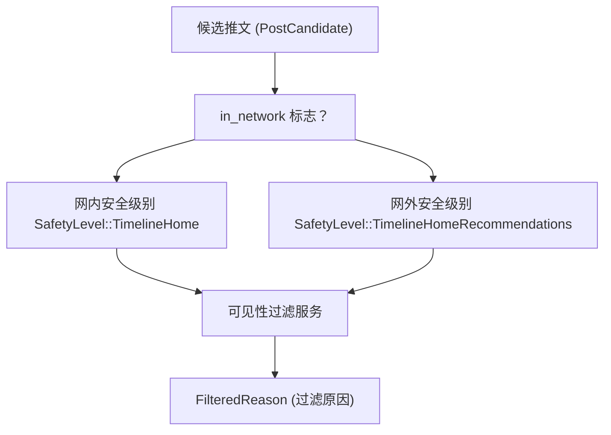
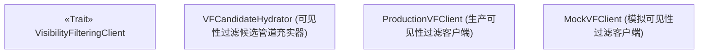
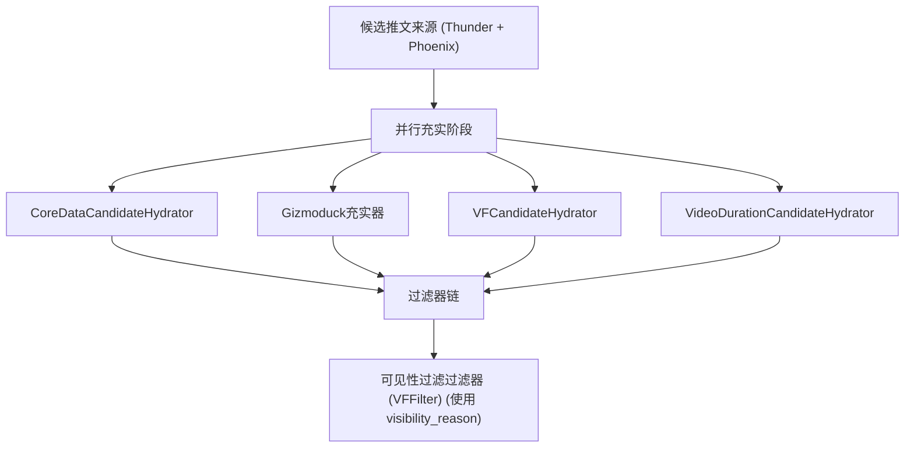

# 可见性过滤服务 (Visibility Filtering Service)

相关源文件

-   [home-mixer/candidate_hydrators/vf_candidate_hydrator.rs](https://github.com/xai-org/x-algorithm/blob/aaa167b3/home-mixer/candidate_hydrators/vf_candidate_hydrator.rs)

## 目的与范围

可见性过滤服务是一个外部平台服务，通过确定特定的推文是否应该展示给特定的用户，来执行内容安全政策。本文档涵盖了客户端抽象层 (`VisibilityFilteringClient` Trait)、充实器集成 (`VFCandidateHydrator`)、安全级别配置以及过滤决策模型。有关如何在后续过滤阶段使用可见性过滤结果的信息，请参阅[过滤器 (Filters)](/xai-org/x-algorithm/4.6-filters)。有关更广泛的客户端架构模式，请参阅[客户端架构 (Client Architecture)](/xai-org/x-algorithm/5.1-client-architecture)。

## 服务概述

可见性过滤服务根据平台安全规则、用户特定偏好（例如，屏蔽关键词、屏蔽账户）以及上下文相关政策来评估推文内容。该服务为每条推文返回一个 `FilteredReason`，这可能表示内容应该被隐藏、带警告展示或正常显示。

该服务在候选管道框架的候选管道充实阶段被调用，对批量推文进行操作，以便在评分和选择发生之前确定其可见性状态。这种早期过滤使管道能够避免对最终将被过滤掉的内容执行昂贵的机器学习操作。

**关键特性：**

-   **批处理**：在单次请求中处理多个推文 ID，以提高效率。
-   **上下文感知**：考虑查看者身份、关系和偏好。
-   **安全级别区分**：根据内容来源应用不同的政策严格程度。
-   **非阻塞**：失败会被优雅地处理，而不会阻塞整个管道。

来源：[home-mixer/candidate_hydrators/vf_candidate_hydrator.rs1-102](https://github.com/xai-org/x-algorithm/blob/aaa167b3/home-mixer/candidate_hydrators/vf_candidate_hydrator.rs#L1-L102)

## 安全级别 (Safety Levels)

可见性过滤服务根据内容类型和来源应用不同级别的政策执行。主混频器 (Home Mixer) 使用两个不同的安全级别：

| 安全级别 | 应用于 | 目的 | 严格程度 |
| --- | --- | --- | --- |
| `TimelineHome` | 网内候选推文 | 来自用户关注的账户的内容 | 较低严格程度，优先考虑用户选择 |
| `TimelineHomeRecommendations` | 网外候选推文 | 来自用户未关注的账户的内容 | 较高严格程度，更具保护性的政策 |

这种区分承认了用户已经主动选择关注某些账户，这意味着即使内容触及了政策边界，用户仍希望看到这些内容。相反，推荐的网外内容由于用户并未显式选择查看，因此持有更严格的标准。


**图表：安全级别选择逻辑**

安全级别通过检查每个 `PostCandidate` 上的 `in_network` 字段来确定，该字段由 `InNetworkCandidateHydrator` 在管道早期设置。有关该字段如何填充的详细信息，请参阅 [InNetworkCandidateHydrator](/xai-org/x-algorithm/4.5.3-innetworkcandidatehydrator)。

来源：[home-mixer/candidate_hydrators/vf_candidate_hydrator.rs54-78](https://github.com/xai-org/x-algorithm/blob/aaa167b3/home-mixer/candidate_hydrators/vf_candidate_hydrator.rs#L54-L78)

## 客户端架构

### VisibilityFilteringClient Trait

`VisibilityFilteringClient` Trait 定义了与可见性过滤服务交互的接口。这种抽象支持依赖注入、使用模拟实现进行测试，以及与服务实现细节的隔离。


**图表：客户端 Trait 及实现结构**

### 接口契约

`get_result` 方法接受：

-   **`tweet_ids: Vec<i64>`**：要评估的推文 ID 批次。
-   **`safety_level: SafetyLevel`**：政策严格级别 (TimelineHome 或 TimelineHomeRecommendations)。
-   **`for_user_id: i64`**：查看者的用户 ID，用于上下文特定的过滤。
-   **`context: Option<TwitterContextViewer>`**：用于偏好评估的额外查看者上下文。

该方法返回一个 `HashMap<i64, Option<FilteredReason>>`，其中：

-   键是推文 ID。
-   如果推文应该被过滤，则值为 `Some(FilteredReason)`，如果它通过了所有检查，则值为 `None`。

来源：[home-mixer/candidate_hydrators/vf_candidate_hydrator.rs15-40](https://github.com/xai-org/x-algorithm/blob/aaa167b3/home-mixer/candidate_hydrators/vf_candidate_hydrator.rs#L15-L40)

## VFCandidateHydrator 集成

`VFCandidateHydrator` 通过实现 `Hydrator<ScoredPostsQuery, PostCandidate>` Trait，将可见性过滤服务集成到候选管道中。该充实器使用可见性过滤结果来富集候选推文，这些结果随后由选择后过滤阶段中的 `VFFilter` 使用。

### 结构

```rust
pub struct VFCandidateHydrator {
    pub vf_client: Arc<dyn VisibilityFilteringClient + Send + Sync>,
}
```
充实器持有对 `VisibilityFilteringClient` 实现的共享引用，从而能够从多个管道执行中并发访问。

来源：[home-mixer/candidate_hydrators/vf_candidate_hydrator.rs15-22](https://github.com/xai-org/x-algorithm/blob/aaa167b3/home-mixer/candidate_hydrators/vf_candidate_hydrator.rs#L15-L22)

## 充实过程

充实过程遵循以下步骤：

> **[Mermaid sequence]**
> *(图表结构无法解析)*

**图表：VFCandidateHydrator 执行流程**

来源：[home-mixer/candidate_hydrators/vf_candidate_hydrator.rs43-101](https://github.com/xai-org/x-algorithm/blob/aaa167b3/home-mixer/candidate_hydrators/vf_candidate_hydrator.rs#L43-L101)

### 实现细节

#### 1. 候选管道分区

充实器根据 `in_network` 字段将候选推文划分为两组：

[home-mixer/candidate_hydrators/vf_candidate_hydrator.rs54-62](https://github.com/xai-org/x-algorithm/blob/aaa167b3/home-mixer/candidate_hydrators/vf_candidate_hydrator.rs#L54-L62)

这种分区能够对每组应用不同的安全级别，如上文“安全级别”部分所述。

#### 2. 并行服务调用

充实器使用 `futures::future::join` 向可见性过滤服务发起两个并发请求：

[home-mixer/candidate_hydrators/vf_candidate_hydrator.rs64-80](https://github.com/xai-org/x-algorithm/blob/aaa167b3/home-mixer/candidate_hydrators/vf_candidate_hydrator.rs#L64-L80)

这种并行执行模式通过重叠两个服务调用而非顺序执行，从而最大限度地降低延迟。

#### 3. 结果合并

在两个服务调用完成后，结果将被合并到单个 `HashMap` 中：

[home-mixer/candidate_hydrators/vf_candidate_hydrator.rs80-83](https://github.com/xai-org/x-algorithm/blob/aaa167b3/home-mixer/candidate_hydrators/vf_candidate_hydrator.rs#L80-L83)

#### 4. 候选管道富集

对于每个候选推文，充实器创建一个仅包含 `visibility_reason` 字段的 `PostCandidate` 更新：

[home-mixer/candidate_hydrators/vf_candidate_hydrator.rs85-95](https://github.com/xai-org/x-algorithm/blob/aaa167b3/home-mixer/candidate_hydrators/vf_candidate_hydrator.rs#L85-L95)

然后，`update` 方法将此字段合并到现有的候选推文中：

[home-mixer/candidate_hydrators/vf_candidate_hydrator.rs98-100](https://github.com/xai-org/x-algorithm/blob/aaa167b3/home-mixer/candidate_hydrators/vf_candidate_hydrator.rs#L98-L100)

这种模式遵循框架的字段级更新策略，即充实器仅填充其负责的字段。有关此模式的更多信息，请参阅[充实器 Trait (Hydrator Trait)](/xai-org/x-algorithm/3.4-hydrator-trait)。

#### 5. 空批次优化

`fetch_vf_results` 辅助方法包含一项优化，当批次为空时避免服务调用：

[home-mixer/candidate_hydrators/vf_candidate_hydrator.rs31-33](https://github.com/xai-org/x-algorithm/blob/aaa167b3/home-mixer/candidate_hydrators/vf_candidate_hydrator.rs#L31-L33)

这可以在所有候选推文都属于同一类别（例如，全部为网内或全部为网外）时，防止不必要的网络请求。

来源：[home-mixer/candidate_hydrators/vf_candidate_hydrator.rs24-40](https://github.com/xai-org/x-algorithm/blob/aaa167b3/home-mixer/candidate_hydrators/vf_candidate_hydrator.rs#L24-L40)

## 数据模型

### FilteredReason (过滤原因)

`FilteredReason` 枚举（在 `xai_visibility_filtering` 模块中定义）代表推文应该被过滤或受限展示的原因。此枚举存储在 `PostCandidate` 的 `visibility_reason` 字段中：

```rust
pub struct PostCandidate {
    // ... 其他字段
    pub visibility_reason: Option<FilteredReason>,
    // ... 其他字段
}
```
`visibility_reason` 字段语义：

-   **`None`**：推文通过了所有可见性检查，应该正常展示。
-   **`Some(FilteredReason)`**：推文违反了政策，应该被过滤或带警告展示。

具体的 `FilteredReason` 变体由可见性过滤服务的数据模型定义，可能包括如下原因：

-   屏蔽作者关系。
-   屏蔽关键词。
-   内容政策违规。
-   在没有查看者资格的情况下展示受限内容。
-   基于用户偏好的 NSFW 内容。

### TwitterContextViewer (Twitter 查看者上下文)

`TwitterContextViewer` 结构体提供有关查看用户的额外上下文，以便进行更准确的过滤决策：

[home-mixer/candidate_hydrators/vf_candidate_hydrator.rs8-9](https://github.com/xai-org/x-algorithm/blob/aaa167b3/home-mixer/candidate_hydrators/vf_candidate_hydrator.rs#L8-L9)

此上下文使用 `get_viewer()` 方法从查询中检索：

[home-mixer/candidate_hydrators/vf_candidate_hydrator.rs50](https://github.com/xai-org/x-algorithm/blob/aaa167b3/home-mixer/candidate_hydrators/vf_candidate_hydrator.rs#L50-L50)

该上下文包含有关查看者的偏好、设置和可能影响可见性决策的关系状态的信息。

来源：[home-mixer/candidate_hydrators/vf_candidate_hydrator.rs1-13](https://github.com/xai-org/x-algorithm/blob/aaa167b3/home-mixer/candidate_hydrators/vf_candidate_hydrator.rs#L1-L13)

## 错误处理

可见性过滤服务集成包含多个级别的错误处理：

### 服务级错误

服务调用失败将被转换为字符串错误，并沿管道向上传播：

[home-mixer/candidate_hydrators/vf_candidate_hydrator.rs35-38](https://github.com/xai-org/x-algorithm/blob/aaa167b3/home-mixer/candidate_hydrators/vf_candidate_hydrator.rs#L35-L38)

这些错误可能由于以下原因发生：

-   网络连接问题。
-   服务超时。
-   服务端故障。
-   请求或响应格式错误。

### 结果传播

充实器使用 `?` 运算符传播服务调用的错误：

[home-mixer/candidate_hydrators/vf_candidate_hydrator.rs82-83](https://github.com/xai-org/x-algorithm/blob/aaa167b3/home-mixer/candidate_hydrators/vf_candidate_hydrator.rs#L82-L83)

当发生错误时，整个充实操作失败，管道的错误处理机制将确定是否：

-   重试请求。
-   回退到缓存结果。
-   以错误响应告知客户端整个请求失败。

有关管道级错误处理的详细信息，请参阅[管道执行模型 (Pipeline Execution Model)](/xai-org/x-algorithm/3.1-pipeline-execution-model)。

### 部分失败的弹性

并行执行模式对部分失败提供了一定的弹性。如果一个安全级别的请求成功而另一个失败，整个充实仍然失败，但通过并发执行，服务调用开销被降至最低。

来源：[home-mixer/candidate_hydrators/vf_candidate_hydrator.rs24-40](https://github.com/xai-org/x-algorithm/blob/aaa167b3/home-mixer/candidate_hydrators/vf_candidate_hydrator.rs#L24-L40) [home-mixer/candidate_hydrators/vf_candidate_hydrator.rs80-83](https://github.com/xai-org/x-algorithm/blob/aaa167b3/home-mixer/candidate_hydrators/vf_candidate_hydrator.rs#L80-L83)

## 性能考虑因素

### 批处理策略

可见性过滤服务使用推文 ID 批次而非单个请求进行调用，从而减少了网络开销和服务负载。批次大小取决于在管道较早阶段（来源和预充实过滤器）幸存下来的候选推文数量。

### Parallel Execution (并行执行)

通过为网内和网外候选推文发出并行请求，充实器缩短了关键路径延迟。总时间大约为：

```text
total_time ≈ max(in_network_request_time, oon_request_time)
```
而非：

```text
total_time ≈ in_network_request_time + oon_request_time
```
这种优化在某一类别包含的候选推文远多于另一类别时尤为有益，因为较小的请求可以快速完成，同时等待较大的请求。

### 缓存与记忆化

可见性过滤服务本身可能对经常评估的推文-查看者对实施缓存策略。客户端接口不公开缓存控制，将缓存管理委托给服务实现。

来源：[home-mixer/candidate_hydrators/vf_candidate_hydrator.rs64-80](https://github.com/xai-org/x-algorithm/blob/aaa167b3/home-mixer/candidate_hydrators/vf_candidate_hydrator.rs#L64-L80)

## 管道集成

`VFCandidateHydrator` 在 `PhoenixCandidatePipeline` 的候选管道充实阶段执行，与其他充实器（如 `CoreDataCandidateHydrator`、`GizmoduckHydrator` 和 `VideoDurationCandidateHydrator`）一起。这些充实器尽可能地并行执行。


**图表：管道上下文中的 VFCandidateHydrator**

在充实之后，`visibility_reason` 字段被 `VFFilter` (一个选择后过滤器) 用于移除未通过可见性检查的候选推文。这种两阶段方法（先充实，后过滤）允许可见性结果用于日志记录、调试和指标收集，即使候选推文最终被过滤掉。

有关 `VFFilter` 如何使用 `visibility_reason` 字段的详细信息，请参阅[附加过滤器 (Additional Filters)](/xai-org/x-algorithm/4.6.3-additional-filters)。

来源：[home-mixer/candidate_hydrators/vf_candidate_hydrator.rs1-102](https://github.com/xai-org/x-algorithm/blob/aaa167b3/home-mixer/candidate_hydrators/vf_candidate_hydrator.rs#L1-L102)
