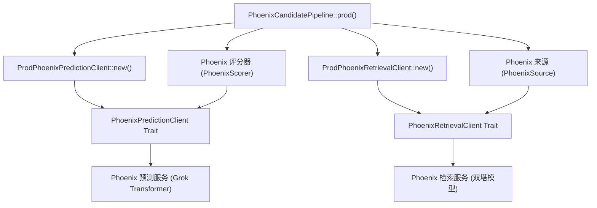
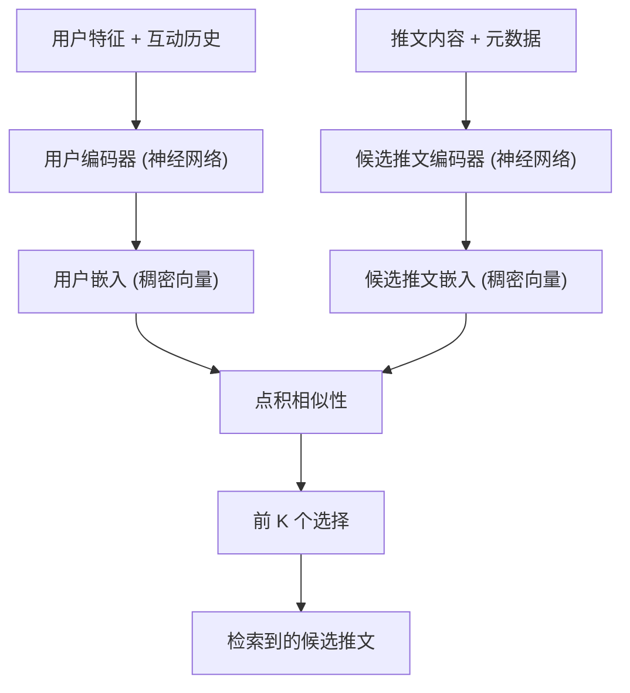
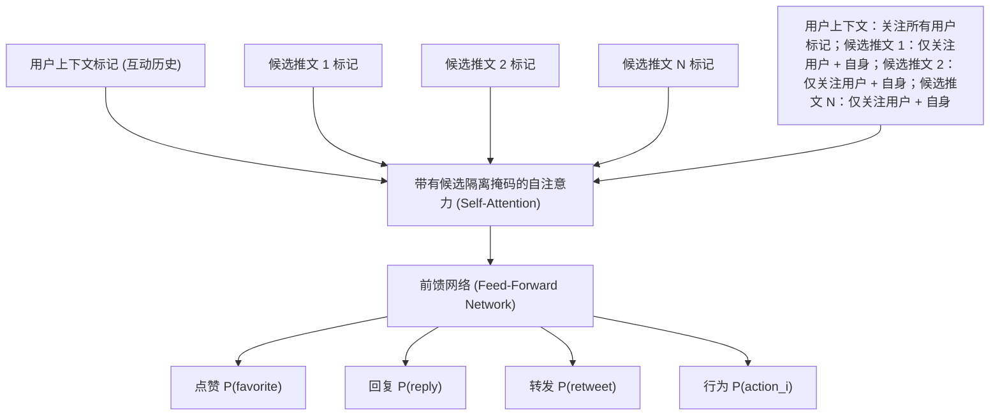
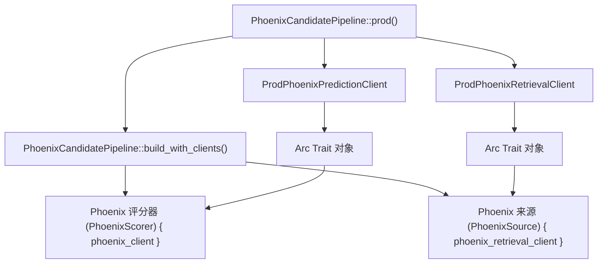

# Phoenix ML 服务 (Phoenix ML Services)

相关源文件

-   [README.md](https://github.com/xai-org/x-algorithm/blob/aaa167b3/README.md?plain=1)
-   [home-mixer/candidate_pipeline/phoenix_candidate_pipeline.rs](https://github.com/xai-org/x-algorithm/blob/aaa167b3/home-mixer/candidate_pipeline/phoenix_candidate_pipeline.rs)

## 目的与范围

本文档描述了与 Phoenix 机器学习 (ML) 服务的集成，这些服务在“为您推荐 (For You)” Feed 中提供候选推文检索和排名的机器学习能力。Phoenix 由通过客户端接口访问的两个不同服务组成：用于通过双塔模型发现网外 (Out-of-Network) 内容的 `PhoenixRetrievalClient`，以及用于通过基于 Grok 的 Transformer 预测互动概率的 `PhoenixPredictionClient`。

有关 Phoenix 如何融入整体管道执行的信息，请参阅 [Phoenix 候选管道 (Phoenix Candidate Pipeline)](/xai-org/x-algorithm/4.1-phoenix-candidate-pipeline)。有关使用 `PhoenixPredictionClient` 的 Phoenix 评分器实现的详细信息，请参阅 [Phoenix 评分器 (Phoenix Scorer)](/xai-org/x-algorithm/4.7.1-phoenix-scorer)。有关使用 `PhoenixRetrievalClient` 的 Phoenix 检索来源的详细信息，请参阅 [Phoenix 检索来源 (Phoenix Retrieval Source)](/xai-org/x-algorithm/4.3.2-phoenix-retrieval-source)。

## 概述

Phoenix 通过独立的客户端接口提供两项核心机器学习能力：

| 服务 | 客户端接口 | 目的 | 用例 |
| --- | --- | --- | --- |
| **Phoenix 检索** | `PhoenixRetrievalClient` | 双塔相似性搜索 | 网外内容发现 |
| **Phoenix 预测** | `PhoenixPredictionClient` | Grok Transformer 排名 | 多行为互动概率预测 |

这两项服务都在管道中作为生产客户端初始化，并通过依赖注入注入到各自的组件中。

**来源：** [README.md163-183](https://github.com/xai-org/x-algorithm/blob/aaa167b3/README.md?plain=1#L163-L183) [home-mixer/candidate_pipeline/phoenix_candidate_pipeline.rs10-14](https://github.com/xai-org/x-algorithm/blob/aaa167b3/home-mixer/candidate_pipeline/phoenix_candidate_pipeline.rs#L10-L14)

## 客户端集成架构

下图说明了 Phoenix 机器学习服务客户端是如何集成到主混频器 (Home Mixer) 管道中的：


**来源：** [home-mixer/candidate_pipeline/phoenix_candidate_pipeline.rs73-212](https://github.com/xai-org/x-algorithm/blob/aaa167b3/home-mixer/candidate_pipeline/phoenix_candidate_pipeline.rs#L73-L212)

## Phoenix 检索服务 (Phoenix Retrieval Service)

### 双塔架构 (Two-Tower Architecture)

Phoenix 检索使用双塔神经网络架构，通过嵌入 (Embedding) 相似性搜索来发现相关的网外内容。这使得系统能够推荐来自用户未关注账户的推文。


这两座“塔”独立运行：

-   **用户塔 (User Tower)**：将用户特征和互动历史编码为单一的稠密嵌入向量。
-   **候选塔 (Candidate Tower)**：将语料库中的所有推文编码为嵌入向量。
-   **相似性搜索**：通过计算用户嵌入和候选推文嵌入之间的点积相似性来检索前 K 个候选推文。

**来源：** [README.md169-175](https://github.com/xai-org/x-algorithm/blob/aaa167b3/README.md?plain=1#L169-L175)

### PhoenixRetrievalClient 集成

`PhoenixRetrievalClient` Trait 抽象了与 Phoenix 检索服务的通信。生产实现 `ProdPhoenixRetrievalClient` 在管道初始化期间实例化，并注入到 `PhoenixSource` 中。

> **[Mermaid sequence]**
> *(图表结构无法解析)*

该检索客户端专门用于 `PhoenixSource`，在候选管道获取阶段获取网外候选推文。来源组件将服务响应转换为带有初始元数据的 `PostCandidate` 结构。

**来源：** [home-mixer/candidate_pipeline/phoenix_candidate_pipeline.rs92-94](https://github.com/xai-org/x-algorithm/blob/aaa167b3/home-mixer/candidate_pipeline/phoenix_candidate_pipeline.rs#L92-L94) [README.md169-175](https://github.com/xai-org/x-algorithm/blob/aaa167b3/README.md?plain=1#L169-L175)

### 客户端初始化

生产环境的 Phoenix 检索客户端在管道初始化期间创建：

```rust
// 摘自 phoenix_candidate_pipeline.rs:171-174
let phoenix_retrieval_client = Arc::new(
    ProdPhoenixRetrievalClient::new()
        .await
        .expect("Failed to create Phoenix retrieval client"),
);
```
客户端包装在 `Arc` 中，以便在管道组件之间共享所有权，并在管道构造期间注入到 `PhoenixSource` 中。

**来源：** [home-mixer/candidate_pipeline/phoenix_candidate_pipeline.rs171-174](https://github.com/xai-org/x-algorithm/blob/aaa167b3/home-mixer/candidate_pipeline/phoenix_candidate_pipeline.rs#L171-L174) [home-mixer/candidate_pipeline/phoenix_candidate_pipeline.rs92-94](https://github.com/xai-org/x-algorithm/blob/aaa167b3/home-mixer/candidate_pipeline/phoenix_candidate_pipeline.rs#L92-L94)

## Phoenix 预测服务 (Phoenix Prediction Service)

### 候选隔离的 Grok Transformer (Grok Transformer with Candidate Isolation)

Phoenix 预测使用基于 Grok 的 Transformer 模型来预测候选推文的互动概率。其关键的架构特征是**候选隔离 (Candidate Isolation)**：候选推文在推理过程中不能相互关注，只能关注用户上下文。


这种注意力掩码模式确保了每个候选推文的分数独立于批次中出现的其他候选推文，从而使分数**一致且可缓存**。

**来源：** [README.md176-181](https://github.com/xai-org/x-algorithm/blob/aaa167b3/README.md?plain=1#L176-L181) [README.md306-308](https://github.com/xai-org/x-algorithm/blob/aaa167b3/README.md?plain=1#L306-L308)

### 多行为预测

Phoenix Transformer 预测多种互动行为的概率，而非单一的相关性分数：

| 预测输出 | 描述 | 在评分中的用途 |
| --- | --- | --- |
| `P(favorite)` | 用户喜欢推文的概率 | 正权重 |
| `P(reply)` | 用户回复的概率 | 正权重 |
| `P(repost)` | 用户转发的概率 | 正权重 |
| `P(quote)` | 用户引用推文的概率 | 正权重 |
| `P(click)` | 用户点击详情的概率 | 正权重 |
| `P(profile_click)` | 用户查看作者个人资料的概率 | 正权重 |
| `P(video_view)` | 用户观看视频的概率 | 正权重 |
| `P(photo_expand)` | 用户展开照片的概率 | 正权重 |
| `P(share)` | 用户外部分享的概率 | 正权重 |
| `P(dwell)` | 用户在推文上停留的概率 | 正权重 |
| `P(follow_author)` | 用户关注作者的概率 | 正权重 |
| `P(not_interested)` | 用户标记“不感兴趣”的概率 | 负权重 |
| `P(block_author)` | 用户屏蔽作者的概率 | 负权重 |
| `P(mute_author)` | 用户静音作者的概率 | 负权重 |
| `P(report)` | 用户举报推文的概率 | 负权重 |

这些预测存储在 `PostCandidate` 结构体中，并由 `WeightedScorer` 使用来计算最终排名分数。

**来源：** [README.md244-263](https://github.com/xai-org/x-algorithm/blob/aaa167b3/README.md?plain=1#L244-L263) [README.md313](https://github.com/xai-org/x-algorithm/blob/aaa167b3/README.md?plain=1#L313-L313)

### PhoenixPredictionClient 集成

`PhoenixPredictionClient` Trait 抽象了与 Phoenix 预测服务的通信。生产实现 `ProdPhoenixPredictionClient` 在管道初始化期间实例化，并注入到 `PhoenixScorer` 中。

> **[Mermaid sequence]**
> *(图表结构无法解析)*

该预测客户端专门用于 `PhoenixScorer` 在评分阶段。评分器接收所有候选推文的预测结果，并使用其 Phoenix 分数更新每个 `PostCandidate`。

**来源：** [home-mixer/candidate_pipeline/phoenix_candidate_pipeline.rs123](https://github.com/xai-org/x-algorithm/blob/aaa167b3/home-mixer/candidate_pipeline/phoenix_candidate_pipeline.rs#L123-L123) [README.md176-181](https://github.com/xai-org/x-algorithm/blob/aaa167b3/README.md?plain=1#L176-L181)

### 客户端初始化

生产环境的 Phoenix 预测客户端在管道初始化期间创建：

```rust
// 摘自 phoenix_candidate_pipeline.rs:166-169
let phoenix_client = Arc::new(
    ProdPhoenixPredictionClient::new()
        .await
        .expect("Failed to create Phoenix prediction client"),
);
```
客户端包装在 `Arc` 中，以便共享所有权，并在管道构造期间注入到 `PhoenixScorer` 中。

**来源：** [home-mixer/candidate_pipeline/phoenix_candidate_pipeline.rs166-169](https://github.com/xai-org/x-algorithm/blob/aaa167b3/home-mixer/candidate_pipeline/phoenix_candidate_pipeline.rs#L166-L169) [home-mixer/candidate_pipeline/phoenix_candidate_pipeline.rs123](https://github.com/xai-org/x-algorithm/blob/aaa167b3/home-mixer/candidate_pipeline/phoenix_candidate_pipeline.rs#L123-L123)

## 管道集成

### 组件依赖图

下图展示了 Phoenix 客户端如何集成到管道的依赖图中：


**来源：** [home-mixer/candidate_pipeline/phoenix_candidate_pipeline.rs73-212](https://github.com/xai-org/x-algorithm/blob/aaa167b3/home-mixer/candidate_pipeline/phoenix_candidate_pipeline.rs#L73-L212)

### 使用模式

Phoenix 的两个客户端都遵循相同的集成模式：

1.  **创建客户端**：生产客户端实例在 `PhoenixCandidatePipeline::prod()` 中异步创建。
2.  **Trait 包装**：客户端被包装在 `Arc<dyn Trait>` 中，以支持共享所有权和 Trait 对象多态性。
3.  **注入组件**：Trait 对象在构造期间被注入到管道组件中。
4.  **执行**：组件在管道执行期间调用 Trait 方法来访问机器学习服务。

这种模式实现了：

-   **可测试性**：可以注入模拟 (Mock) 实现进行测试。
-   **抽象性**：管道组件依赖于 Trait 而非具体实现。
-   **所有权共享**：多个组件可以引用同一个客户端实例。

**来源：** [home-mixer/candidate_pipeline/phoenix_candidate_pipeline.rs73-212](https://github.com/xai-org/x-algorithm/blob/aaa167b3/home-mixer/candidate_pipeline/phoenix_candidate_pipeline.rs#L73-L212)

## 关键设计决策

### 基于 Trait 的抽象

这两个 Phoenix 服务都通过 Trait 抽象而非具体类型进行访问。这支持了依赖注入、使用模拟实现进行测试，并将服务实现细节与管道逻辑隔离。

| 设计选择 | 好处 |
| --- | --- |
| 基于 Trait 的客户端接口 | 支持为测试提供模拟实现 |
| `Arc<dyn Trait>` 所有权 | 在组件之间共享客户端实例 |
| 异步初始化 | 非阻塞式服务连接设置 |
| 生产/测试分离 | 管道逻辑独立于客户端实现 |

**来源：** [home-mixer/candidate_pipeline/phoenix_candidate_pipeline.rs75-81](https://github.com/xai-org/x-algorithm/blob/aaa167b3/home-mixer/candidate_pipeline/phoenix_candidate_pipeline.rs#L75-L81)

### 排名中的候选隔离

Phoenix 预测服务通过注意力掩码实现候选隔离。这确保了分配给某候选推文的分数仅取决于用户上下文和该候选推文本体，而不受批次中其他候选推文的影响。这一属性实现了：

-   **分数一致性**：相同的候选推文无论批次组成如何都获得相同的分数。
-   **可缓存性**：分数可以跨请求进行缓存和重用。
-   **并行评分**：候选推文可以在不同的批次中进行评分而不影响结果。

**来源：** [README.md306-308](https://github.com/xai-org/x-algorithm/blob/aaa167b3/README.md?plain=1#L306-L308)

### 基于哈希的嵌入 (Hash-Based Embeddings)

检索和评分都使用基于哈希的嵌入查找，而非传统的基于词汇表的嵌入。这种方法提供：

-   **开放词汇表**：新术语不存在词汇表外 (Out-of-Vocabulary) 问题。
-   **内存效率**：无论词汇量大小，嵌入表大小固定。
-   **碰撞处理**：多个哈希函数可降低哈希碰撞的影响。

**来源：** [README.md310](https://github.com/xai-org/x-algorithm/blob/aaa167b3/README.md?plain=1#L310-L310)
