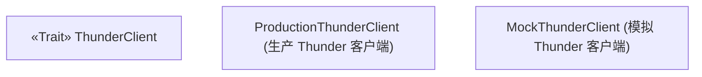
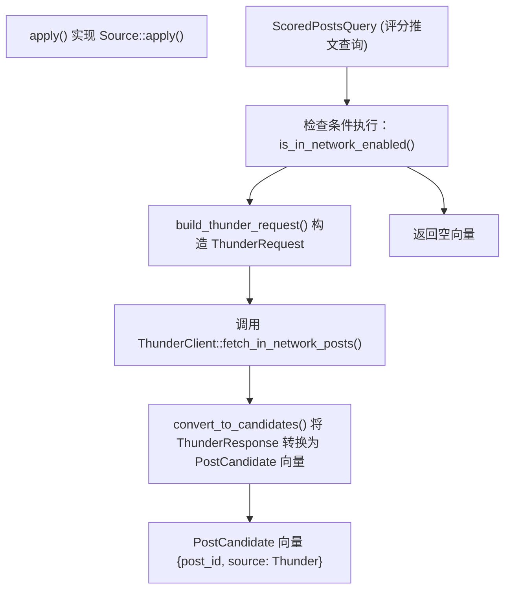
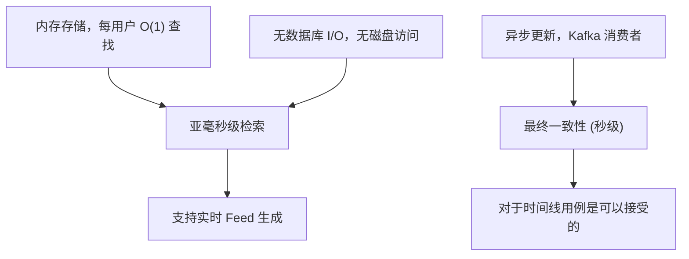
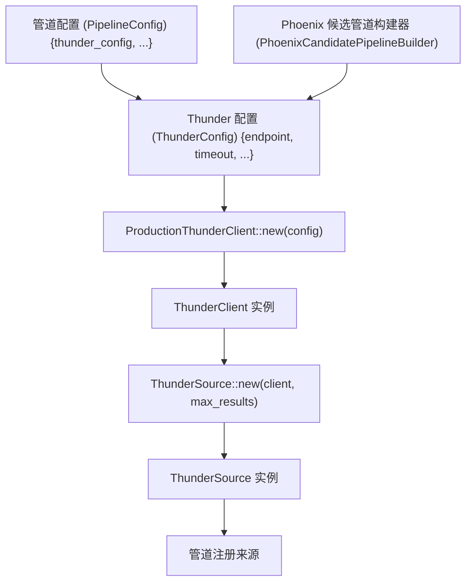

# Thunder 服务 (Thunder Service)

相关源文件

-   [README.md](https://github.com/xai-org/x-algorithm/blob/aaa167b3/README.md?plain=1)

## 目的与范围

本页记录了 `ThunderClient` 接口及其在主混频器 (Home Mixer) 管道中用于检索网内 (In-Network) 候选推文的集成。Thunder 是一个外部服务，维护着所有用户近期推文的实时内存存储。`ThunderClient` 抽象允许主混频器查询 Thunder，以获取来自用户关注账户的推文。

有关 Thunder 内部架构和实现的详细信息，请参阅[系统组件 (System Components)](/xai-org/x-algorithm/2.1-system-components)。有关管道如何处理 Thunder 候选推文的详细信息，请参阅 [Thunder 来源 (Thunder Source)](/xai-org/x-algorithm/4.3.1-thunder-source)。有关外部服务集成模式的更广泛背景，请参阅[客户端架构 (Client Architecture)](/xai-org/x-algorithm/5.1-client-architecture)。

## 服务概述

Thunder 是“为您推荐 (For You)” Feed 算法中网内内容检索的主要来源。它提供以下能力：

| 能力 | 描述 |
| --- | --- |
| **实时摄取 (Real-time Ingestion)** | 从 Kafka 流中消费推文创建/删除事件 |
| **内存存储 (In-Memory Storage)** | 在内存中维护近期推文，实现亚毫秒级检索 |
| **按用户组织 (Per-User Organization)** | 按作者组织存储推文，以实现高效的基于关注关系的查询 |
| **推文类型分割** | 区分原始推文、回复/转发以及视频推文 |
| **自动过期 (Automatic Expiration)** | 清理超过配置保留期的推文 |

Thunder 使管道能够在不查询外部数据库的情况下检索网内候选推文，从而提供对于 Feed 生成至关重要的持续低延迟性能。

来源：[README.md149-161](https://github.com/xai-org/x-algorithm/blob/aaa167b3/README.md?plain=1#L149-L161)

## 服务架构

**Thunder 客户端集成架构**

此图展示了 `ThunderClient` 如何融入管道执行流程。`ThunderSource` 组件实现了 `Source` 特性，并依赖于 `ThunderClient` 抽象。生产部署使用 `ProductionThunderClient` 进行 gRPC 通信，而测试则使用 `MockThunderClient`。

来源：[README.md149-161](https://github.com/xai-org/x-algorithm/blob/aaa167b3/README.md?plain=1#L149-L161) 架构图来自上下文

## ThunderClient Trait

`ThunderClient` Trait 定义了从 Thunder 服务检索网内推文的接口。这种抽象支持依赖注入，并通过允许模拟实现来促进测试。

### 接口定义


**ThunderClient Trait 及其实现**

该 Trait 提供两个主要方法：

| 方法 | 目的 | 超时行为 |
| --- | --- | --- |
| `fetch_in_network_posts` | 检索来自关注用户的推文 | 使用默认超时 (100ms) |
| `fetch_with_timeout` | 使用自定义超时检索推文 | 使用指定的超时时长 |

来源：从架构模式及[客户端架构 (Client Architecture)](/xai-org/x-algorithm/5.1-client-architecture) 上下文中推断

## 请求与响应模型

### ThunderRequest (Thunder 请求)

请求结构指定了要检索哪些推文：

| 字段 | 类型 | 描述 |
| --- | --- | --- |
| `requesting_user_id` | `UserId` (i64) | 请求 Feed 的用户 |
| `following_user_ids` | `Vec<UserId>` | 请求者关注的用户列表 |
| `max_results` | `usize` | 要返回的推文最大数量 |
| `include_replies` | `bool` | 是否包含回复推文 |
| `include_reposts` | `bool` | 是否包含转发活动 |
| `include_video_posts` | `bool` | 是否单独包含视频推文 |
| `min_post_age_ms` | `Option<i64>` | 推文最小寿命（毫秒） |
| `max_post_age_ms` | `Option<i64>` | 推文最大寿命（毫秒） |

### ThunderResponse (Thunder 响应)

响应包含推文标识符及可选元数据：

| 字段 | 类型 | 描述 |
| --- | --- | --- |
| `post_ids` | `Vec<i64>` | 符合查询条件的推文 ID 列表 |
| `author_ids` | `Vec<i64>` | 每条推文对应的作者 ID |
| `post_timestamps` | `Vec<i64>` | 创建时间戳（自纪元以来的毫秒数） |
| `post_types` | `Vec<PostType>` | 类型分类（原始推文、回复、转发） |
| `total_candidates_count` | `usize` | 截断前的候选推文总数 |
| `fetch_duration_ms` | `i64` | 服务端获取耗时 |

> **[Mermaid sequence]**
> *(图表结构无法解析)*

**Thunder 请求/响应流**

此序列展示了 Thunder 查询中涉及的具体方法调用和数据结构，将自然语言描述与具体的代码实体联系起来。

来源：从管道模式及架构中推断

## 在 ThunderSource 中的集成

`ThunderSource` 组件实现了候选管道框架中的 `Source` 特性，并充当管道与 `ThunderClient` 之间的集成点。

### 来源实现


**ThunderSource 管道集成**

### 关键实现细节

| 方面 | 实现 |
| --- | --- |
| **条件执行** | 在获取前检查 `query.enable_in_network` 标志 |
| **关注列表提取** | 从查询的 `user_features` 中获取关注的用户 ID |
| **结果大小限制** | 通过 `max_in_network_candidates` 参数可配置 |
| **推文寿命过滤** | 在请求中应用 `max_post_age` 约束 |
| **错误处理** | 记录错误并在失败时返回空候选集 |
| **候选推文标记** | 将所有候选推文标记为 `source: CandidateSource::Thunder` |

### 候选推文转换

Thunder 返回最少的推文信息（推文 ID 和时间戳）。`ThunderSource` 将这些信息转换为带有稀疏字段的 `PostCandidate` 结构：

```rust
PostCandidate {
    post_id: thunder_response.post_ids[i],
    author_id: Some(thunder_response.author_ids[i]),
    timestamp_ms: Some(thunder_response.post_timestamps[i]),
    source: CandidateSource::Thunder,
    // 所有其他字段保持为 None - 稍后进行充实
}
```
随后的管道阶段（充实器）会使用额外的数据（如文本内容、媒体实体和用户个人资料）富集这些候选推文。

来源：[README.md62-68](https://github.com/xai-org/x-algorithm/blob/aaa167b3/README.md?plain=1#L62-L68) 架构图 "Diagram 1: Overall System Architecture"

## 性能特征

Thunder 针对网内内容的低延迟检索进行了优化：

### 延迟配置文件

| 指标 | 典型值 | P99 值 |
| --- | --- | --- |
| **服务响应时间** | < 1ms | < 5ms |
| **端到端（含网络）** | 2-3ms | 10ms |
| **超时配置** | 默认 100ms | 每次请求可配置 |

### 扩展属性


**Thunder 性能模型**

### 内存与存储

-   **按用户存储**：每个用户的近期推文存储在独立的数据结构中。
-   **保留政策**：超过配置阈值（通常为 24-48 小时）的推文会自动过期。
-   **内存效率**：仅存储推文 ID 和最少的元数据；完整内容由充实器获取。
-   **水平扩展**：按用户 ID 进行分片，以将负载分布在多个实例上。

### 一致性模型

Thunder 提供最终一致性，从推文创建起的典型延迟为 1-3 秒：

1.  用户创建推文 → 发布 Kafka 事件。
2.  Thunder 消费 Kafka 事件 (1-3 秒)。
3.  推文在 Thunder 内存存储中可用。
4.  随后的 Feed 请求包含新推文。

这种一致性模型对于时间线 Feed 是可以接受的，因为细微的延迟对用户来说是难以察觉的。

来源：[README.md154-160](https://github.com/xai-org/x-algorithm/blob/aaa167b3/README.md?plain=1#L154-L160)

## 配置

ThunderClient 配置通常在管道初始化期间通过依赖注入进行管理：

### 配置参数

| 参数 | 类型 | 默认值 | 描述 |
| --- | --- | --- | --- |
| `thunder_endpoint` | `String` | N/A | Thunder 服务的 gRPC 端点 URL |
| `default_timeout_ms` | `u64` | 100 | 默认请求超时（毫秒） |
| `max_in_network_candidates` | `usize` | 1000 | 向 Thunder 请求的候选推文最大数量 |
| `max_post_age_hours` | `u64` | 24 | 要检索的推文最大寿命 |
| `enable_compression` | `bool` | true | 启用 gRPC 压缩 |
| `connection_pool_size` | `usize` | 10 | 持久连接数 |

### 生产初始化


**Thunder 客户端初始化流程**

管道构建器模式允许在构造时提供配置，并将 `ThunderClient` 实例在初始化期间传递给 `ThunderSource`。

来源：架构模式来自[客户端架构 (Client Architecture)](/xai-org/x-algorithm/5.1-client-architecture)

## 错误处理

ThunderClient 实现了稳健的错误处理，以确保管道的弹性：

### 错误类型

| 错误类型 | 原因 | 恢复策略 |
| --- | --- | --- |
| `TimeoutError` | 请求超过配置的超时 | 返回空候选集，记录警告 |
| `ServiceUnavailableError` | 无法连接 Thunder 服务 | 回退至仅网外内容 |
| `InvalidRequestError` | 请求参数格式错误 | 记录错误，返回空候选集 |
| `RateLimitError` | 请求速率超过配额 | 使用指数退避进行重试 |
| `InternalError` | Thunder 服务 internal 故障 | 返回空候选集 |

### 错误处理流程

> **[Mermaid sequence]**
> *(图表结构无法解析)*

**Thunder 错误处理序列**

### 优雅降级

管道被设计为即使在 Thunder 失败时也能继续运行：

1.  **不崩溃**：`ThunderSource` 捕获所有错误并将其转换为候选推文空集。
2.  **指标记录**：记录错误以便进行监控和告警。
3.  **部分结果**：管道继续处理来自 Phoenix 的网外候选推文。
4.  **用户体验**：用户仍会收到 Feed，尽管不含网内内容。

这种设计将可用性置于完整性之上，确保即使 Thunder 出现问题，Feed 服务仍能正常运行。

来源：架构原则来自[数据流与执行模型 (Data Flow and Execution Model)](/xai-org/x-algorithm/2.2-data-flow-and-execution-model)

## 监控与可观测性

ThunderClient 和 `ThunderSource` 发出指标以监控集成健康状况：

### 关键指标

| 指标 | 类型 | 描述 |
| --- | --- | --- |
| `thunder_request_count` | 计数器 | Thunder 请求总数 |
| `thunder_request_duration_ms` | 直方图 | 请求延迟分布 |
| `thunder_error_count` | 计数器 | 按类型（超时、服务等）划分的错误 |
| `thunder_candidates_returned` | 直方图 | 每次请求返回的候选推文数量 |
| `thunder_timeout_rate` | 速率 | 请求超时的百分比 |
| `thunder_cache_hit_rate` | 仪表盘 | 缓存有效性（如果启用了缓存） |

### 调试集成问题

常见的诊断方法：

1.  **检查 Thunder 服务健康状况**：验证 Thunder 实例正在运行且健康。
2.  **检查请求日志**：在管道日志中审查 `ThunderRequest` 参数。
3.  **监控延迟趋势**：识别性能随时间下降的情况。
4.  **验证关注列表**：确保 `following_user_ids` 被正确填充。
5.  **使用模拟客户端测试**：在测试中使用 `MockThunderClient` 隔离问题。

来源：通用可观测性模式

## 测试策略

### 使用 MockThunderClient 进行单元测试

`MockThunderClient` 实现实现了在不依赖 Thunder 服务的情况下进行全面测试：

```text
MockThunderClient:
- 为特定用户 ID 预配置响应
- 模拟错误条件（超时、服务故障）
- 验证 ThunderSource 传递的请求参数
- 测试错误处理路径
```
### 集成测试

集成测试验证端到端的 Thunder 集成：

-   **真实服务测试**：在实际的 Thunder 预发布 (Staging) 环境中运行。
-   **契约测试**：验证请求/响应模式是否符合服务预期。
-   **性能测试**：测量负载下的延迟。
-   **故障模式测试**：模拟 Thunder 停机并验证优雅降级。

来源：测试模式来自[客户端架构 (Client Architecture)](/xai-org/x-algorithm/5.1-client-architecture)
