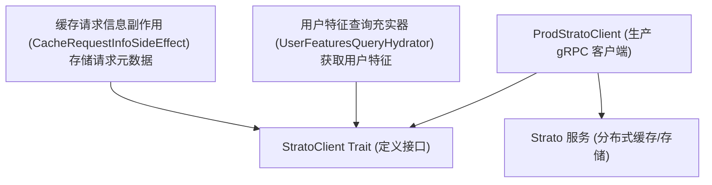
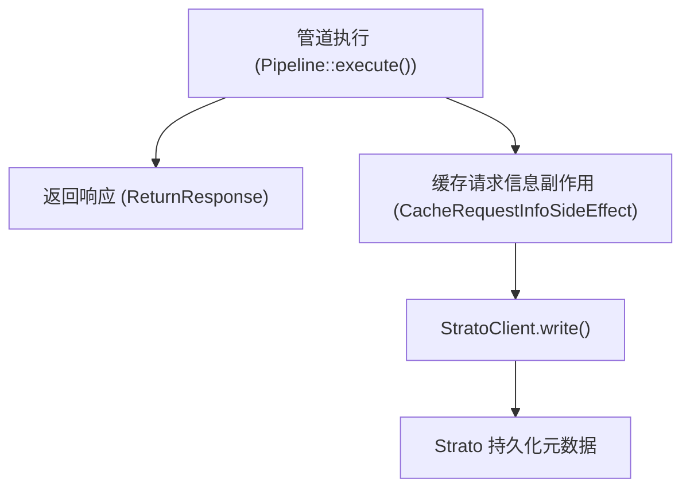
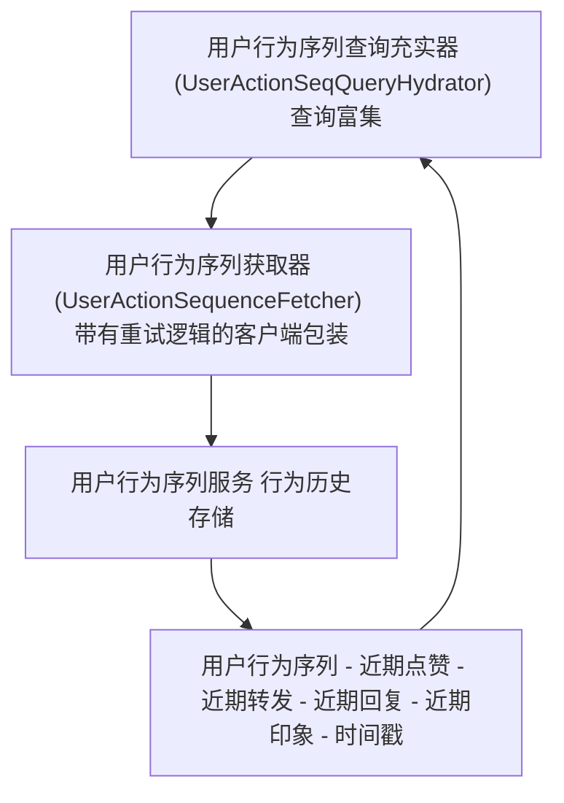
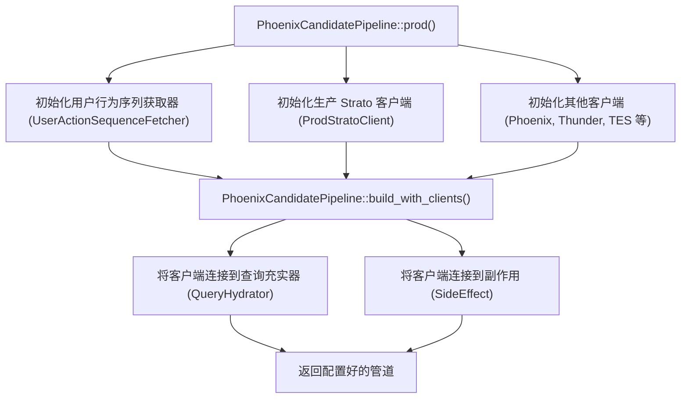
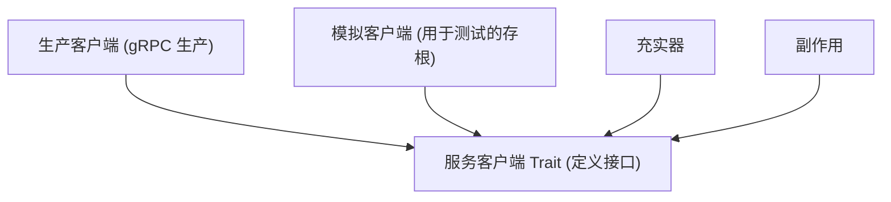

# Strato 及其他服务 (Strato and Other Services)

相关源文件

-   [home-mixer/candidate_pipeline/phoenix_candidate_pipeline.rs](https://github.com/xai-org/x-algorithm/blob/aaa167b3/home-mixer/candidate_pipeline/phoenix_candidate_pipeline.rs)

## 目的与范围

本页记录了与分布式缓存服务 Strato 以及支持候选管道框架的其他杂项服务客户端的集成。主要侧重于用于缓存操作的 `StratoClient` 和用于检索用户行为数据的 `UserActionSequenceFetcher`。有关其他主要服务的集成，请参阅推文实体服务 [5.2](/xai-org/x-algorithm/5.2-tweet-entity-service-(tes))、Gizmoduck [5.3](/xai-org/x-algorithm/5.3-gizmoduck-service)、可见性过滤 [5.4](/xai-org/x-algorithm/5.4-visibility-filtering-service)、Phoenix ML 服务 [5.5](/xai-org/x-algorithm/5.5-phoenix-ml-services) 以及 Thunder [5.6](/xai-org/x-algorithm/5.6-thunder-service)。

## 概述

候选管道框架依赖于主要数据源和机器学习系统之外的几个支持服务：

-   **Strato**：一个分布式缓存和存储服务，用于持久化请求元数据和检索用户特征。
-   **用户行为序列服务 (User Action Sequence Service)**：提供用户行为历史，包括最近的互动、印象 (Impressions) 和行为。

这些服务通过缓存副作用、查询充实和行为信号检索来支持管道操作。

来源：[home-mixer/candidate_pipeline/phoenix_candidate_pipeline.rs1-256](https://github.com/xai-org/x-algorithm/blob/aaa167b3/home-mixer/candidate_pipeline/phoenix_candidate_pipeline.rs#L1-L256)

## StratoClient 架构

### 客户端接口

`StratoClient` Trait 定义了与 Strato 服务交互的抽象。基于 Trait 的设计支持依赖注入和测试模拟。


**StratoClient 集成架构**

`StratoClient` Trait 提供了向 Strato 读取和写入数据的异步方法。生产实现 `ProdStratoClient` 建立到 Strato 服务集群的 gRPC 连接。

来源：[home-mixer/candidate_pipeline/phoenix_candidate_pipeline.rs18](https://github.com/xai-org/x-algorithm/blob/aaa167b3/home-mixer/candidate_pipeline/phoenix_candidate_pipeline.rs#L18-L18) [home-mixer/candidate_pipeline/phoenix_candidate_pipeline.rs78](https://github.com/xai-org/x-algorithm/blob/aaa167b3/home-mixer/candidate_pipeline/phoenix_candidate_pipeline.rs#L78-L78)

### 生产实现

`ProdStratoClient` 在管道初始化期间通过连接配置实例化：

| 组件 | 描述 |
| --- | --- |
| **ProdStratoClient** | Strato 的生产 gRPC 客户端实现 |
| **连接** | 在管道设置期间异步建立 |
| **生命周期** | 创建一次并通过 `Arc` 在管道组件之间共享 |

生产客户端在 `PhoenixCandidatePipeline::prod()` 方法中初始化：

```rust
let strato_client = Arc::new(
    ProdStratoClient::new()
        .await
        .expect("Failed to create Strato client"),
);
```
此客户端实例随后通过依赖注入传递给需要访问 Strato 的组件。

来源：[home-mixer/candidate_pipeline/phoenix_candidate_pipeline.rs177-181](https://github.com/xai-org/x-algorithm/blob/aaa167b3/home-mixer/candidate_pipeline/phoenix_candidate_pipeline.rs#L177-L181)

## Strato 在管道中的用法

### 用户特征查询充实器 (User Features Query Hydrator)

`UserFeaturesQueryHydrator` 使用 `StratoClient` 检索丰富查询上下文的用户级特征。该充实器在查询充实阶段运行，以获取存储的用户属性和偏好。

> **[Mermaid sequence]**
> *(图表结构无法解析)*

**用户特征检索流程**

充实器附加 Strato 客户端并调用它来检索缓存的用户特征，这些特征随后被合并到 `ScoredPostsQuery` 对象中以供下游使用。

来源：[home-mixer/candidate_pipeline/phoenix_candidate_pipeline.rs85-89](https://github.com/xai-org/x-algorithm/blob/aaa167b3/home-mixer/candidate_pipeline/phoenix_candidate_pipeline.rs#L85-L89)

### 缓存请求信息副作用 (Cache Request Info Side Effect)

`CacheRequestInfoSideEffect` 使用 `StratoClient` 异步地持久化请求元数据，用于分析和调试目的向。该副作用在主管道响应后执行，且不产生阻塞。


**异步缓存副作用模式**

该副作用以异步方式触发，不会影响响应延迟。请求元数据（查询参数、候选推文 ID、分数、时间戳）被写入 Strato 以供后续分析。

来源：[home-mixer/candidate_pipeline/phoenix_candidate_pipeline.rs146-147](https://github.com/xai-org/x-algorithm/blob/aaa167b3/home-mixer/candidate_pipeline/phoenix_candidate_pipeline.rs#L146-L147)

## 用户行为序列获取器 (UserActionSequenceFetcher)

### 目的与架构

`UserActionSequenceFetcher` 客户端从用户行为序列 (UAS) 服务检索用户行为历史。该服务维护用户行为（点赞、转发、回复、印象等）的时间序列日志，用于个性化推荐。


**UserActionSequenceFetcher 架构**

该获取器抽象了查询 UAS 服务的复杂性，包括连接池、重试逻辑和数据反序列化。

来源：[home-mixer/candidate_pipeline/phoenix_candidate_pipeline.rs21](https://github.com/xai-org/x-algorithm/blob/aaa167b3/home-mixer/candidate_pipeline/phoenix_candidate_pipeline.rs#L21-L21) [home-mixer/candidate_pipeline/phoenix_candidate_pipeline.rs74](https://github.com/xai-org/x-algorithm/blob/aaa167b3/home-mixer/candidate_pipeline/phoenix_candidate_pipeline.rs#L74-L74)

### 实现细节

`UserActionSequenceFetcher` 在管道初始化期间实例化：

```rust
let uas_fetcher =
    Arc::new(UserActionSequenceFetcher::new().expect("Failed to create UAS fetcher"));
```
关键特性：

| 特性 | 描述 |
| --- | --- |
| **连接** | 建立到 UAS 服务集群的 gRPC 连接 |
| **错误处理** | 返回 Result 类型；在初始化错误时管道快速失败 |
| **生命周期** | 通过 `Arc` 在查询充实器之间共享的单例实例 |
| **查询模式** | 按具有可配置时间窗口的用户 ID 获取行为序列 |

来源：[home-mixer/candidate_pipeline/phoenix_candidate_pipeline.rs163-164](https://github.com/xai-org/x-algorithm/blob/aaa167b3/home-mixer/candidate_pipeline/phoenix_candidate_pipeline.rs#L163-L164)

### 在查询充实中的用法

`UserActionSeqQueryHydrator` 使用获取器通过用户行为信号富集查询：

> **[Mermaid sequence]**
> *(图表结构无法解析)*

**用户行为序列充实流程**

充实器获取用户的近期行为历史并将其附加到查询对象。这些行为数据随后由评分器（例如，用于基于新鲜度的提升）和过滤器（例如，用于去重）使用。

来源：[home-mixer/candidate_pipeline/phoenix_candidate_pipeline.rs85](https://github.com/xai-org/x-algorithm/blob/aaa167b3/home-mixer/candidate_pipeline/phoenix_candidate_pipeline.rs#L85-L85)

## 客户端初始化与依赖注入

### 生产管道构造

`PhoenixCandidatePipeline::prod()` 方法展示了 Strato 和其他服务客户端的初始化和连接：


**管道客户端初始化流程**

在管道构造之前，所有服务客户端均以异步方式初始化。`build_with_clients()` 方法接收这些客户端并将其注入相应的管道组件。

来源：[home-mixer/candidate_pipeline/phoenix_candidate_pipeline.rs162-212](https://github.com/xai-org/x-algorithm/blob/aaa167b3/home-mixer/candidate_pipeline/phoenix_candidate_pipeline.rs#L162-L212)

### 客户端依赖映射

下表显示了哪些管道组件依赖于 Strato 和 UAS 客户端：

| 管道组件 | 客户端依赖 | 使用目的 |
| --- | --- | --- |
| `UserActionSeqQueryHydrator` | `UserActionSequenceFetcher` | 获取用户行为历史 |
| `UserFeaturesQueryHydrator` | `StratoClient` | 检索缓存的用户特征 |
| `CacheRequestInfoSideEffect` | `StratoClient` | 持久化请求元数据 |

这些依赖通过构造函数注入满足，客户端被包装在 `Arc` 中，以便在异步管道执行中共享所有权。

来源：[home-mixer/candidate_pipeline/phoenix_candidate_pipeline.rs84-89](https://github.com/xai-org/x-algorithm/blob/aaa167b3/home-mixer/candidate_pipeline/phoenix_candidate_pipeline.rs#L84-L89) [home-mixer/candidate_pipeline/phoenix_candidate_pipeline.rs146-147](https://github.com/xai-org/x-algorithm/blob/aaa167b3/home-mixer/candidate_pipeline/phoenix_candidate_pipeline.rs#L146-L147)

## 集成模式

### 基于 Trait 的抽象

`StratoClient` 和服务获取器都遵循在整个管道中使用的基于 Trait 的抽象模式：


**服务客户端抽象模式**

使用者依赖于 Trait 接口而非具体实现，从而实现测试隔离和未来的服务迁移。

来源：[home-mixer/candidate_pipeline/phoenix_candidate_pipeline.rs18-21](https://github.com/xai-org/x-algorithm/blob/aaa167b3/home-mixer/candidate_pipeline/phoenix_candidate_pipeline.rs#L18-L21)

### 错误处理策略

服务客户端初始化遵循快速失败 (fail-fast) 模式：

```rust
ProdStratoClient::new()
    .await
    .expect("Failed to create Strato client")
```
这种 approach 确保：

-   在启动时检测配置错误。
-   管道永远不会在缺失依赖的情况下运行。
-   在服务初始化期间立即记录错误。
-   通过编译时 Trait 强制执行防止运行时错误。

来源：[home-mixer/candidate_pipeline/phoenix_candidate_pipeline.rs177-181](https://github.com/xai-org/x-algorithm/blob/aaa167b3/home-mixer/candidate_pipeline/phoenix_candidate_pipeline.rs#L177-L181)

### 通过 Arc 共享所有权

所有服务客户端均被包装在 `Arc<T>` 中，以支持：

-   **共享所有权**：多个管道组件引用同一个客户端实例。
-   **线程安全**：客户端满足 `Send + Sync`，支持并行充实器执行。
-   **资源效率**：每个客户端使用单一连接池，避免冗余连接。
-   **异步兼容性**：Arc 支持克隆到异步任务中而不会产生生命周期问题。

来源：[home-mixer/candidate_pipeline/phoenix_candidate_pipeline.rs74-81](https://github.com/xai-org/x-algorithm/blob/aaa167b3/home-mixer/candidate_pipeline/phoenix_candidate_pipeline.rs#L74-L81)
