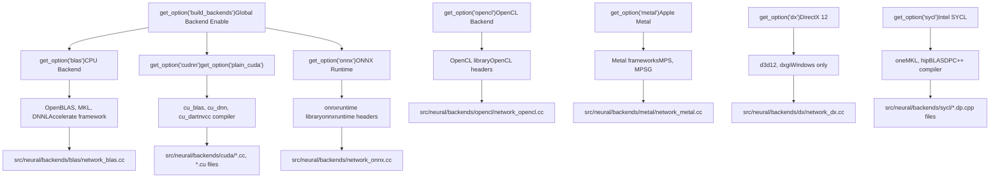
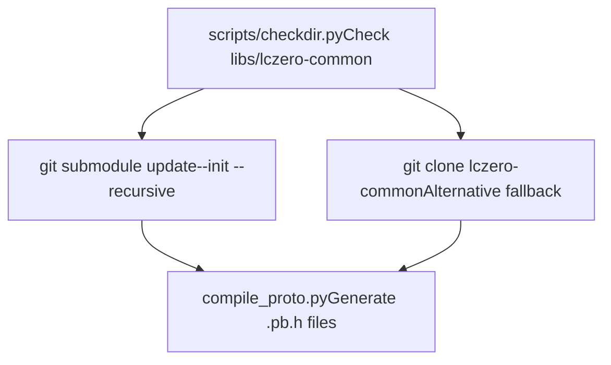
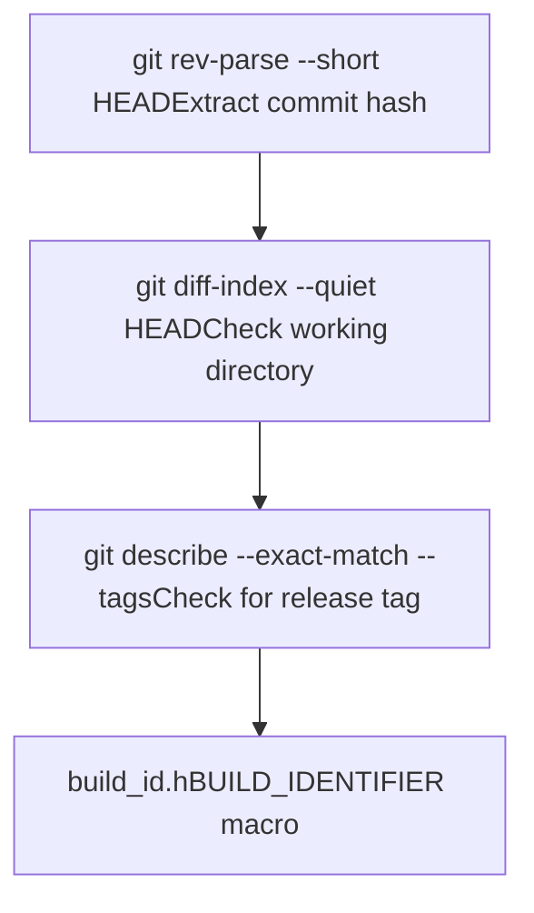

# Building and Installation

Relevant source files

-   [CONTRIBUTING.md](https://github.com/LeelaChessZero/lc0/blob/b4e98c19/CONTRIBUTING.md)
-   [README.md](https://github.com/LeelaChessZero/lc0/blob/b4e98c19/README.md)
-   [appveyor.yml](https://github.com/LeelaChessZero/lc0/blob/b4e98c19/appveyor.yml)
-   [install\_openSUSE\_lc0.sh](https://github.com/LeelaChessZero/lc0/blob/b4e98c19/install_openSUSE_lc0.sh)
-   [meson.build](https://github.com/LeelaChessZero/lc0/blob/b4e98c19/meson.build)
-   [meson\_options.txt](https://github.com/LeelaChessZero/lc0/blob/b4e98c19/meson_options.txt)
-   [openSUSE\_install.md](https://github.com/LeelaChessZero/lc0/blob/b4e98c19/openSUSE_install.md)
-   [pyproject.toml](https://github.com/LeelaChessZero/lc0/blob/b4e98c19/pyproject.toml)

This document provides a comprehensive guide to building and installing lc0 (Leela Chess Zero) across different platforms and backend configurations. It covers the Meson build system architecture, dependency management, and the various neural network backends available.

For detailed platform-specific build procedures, see [Linux and macOS Build Process](/LeelaChessZero/lc0/2.2-linux-and-macos-build-process) and [Windows Build Process](/LeelaChessZero/lc0/2.3-windows-build-process). For information about the underlying build system mechanics, see [Build System Architecture](/LeelaChessZero/lc0/2.1-build-system-architecture). For release management and versioning, see [Version Management](/LeelaChessZero/lc0/2.4-version-management).

## Prerequisites and Dependencies

Lc0 requires several core dependencies that must be satisfied before building:

**Core Requirements:**

-   C++20 compatible compiler (GCC 10+, Clang 12+, or Visual Studio 2019 16.11+)
-   Meson build system (0.55+)
-   Python 3.7+
-   Git (for submodule management)
-   At least one neural network backend library

**Neural Network Backends:** The build system supports multiple backends for neural network inference. At least one must be available:

| Backend Type | Libraries | Platforms | Hardware Support |
| --- | --- | --- | --- |
| CPU BLAS | OpenBLAS, Intel MKL, DNNL, Accelerate | All | CPU |
| CUDA | CUDA Toolkit, cuDNN (optional) | Linux, Windows | NVIDIA GPU |
| ONNX | ONNX Runtime | All | CPU, GPU, TPU |
| OpenCL | OpenCL | Linux, Windows, macOS | AMD/Intel GPU |
| Metal | Metal Performance Shaders | macOS | Apple GPU |
| DirectX | DirectX 12 | Windows | DirectX compatible GPU |
| SYCL | Intel oneAPI DPC++ | Linux, Windows | Intel/AMD GPU |

Sources: [meson.build43-47](https://github.com/LeelaChessZero/lc0/blob/b4e98c19/meson.build#L43-L47) [README.md43-47](https://github.com/LeelaChessZero/lc0/blob/b4e98c19/README.md#L43-L47) [meson\_options.txt51-261](https://github.com/LeelaChessZero/lc0/blob/b4e98c19/meson_options.txt#L51-L261)

## Build System Architecture

The lc0 build system is centered around Meson with extensive backend detection and configuration capabilities:

```mermaid
flowchart TD
    MesonBuild["meson.buildMain Configuration"]
    MesonOptions["meson_options.txtBuild Options"]
    CrossFiles["cross-files/Target Platforms"]
    GitSubmodules["Git Submoduleslczero-common"]
    ProtoCompiler["scripts/compile_proto.pyProtobuf Generation"]
    VersionExtractor["Git Version Extractionbuild_id.h generation"]
    CudaDetection["CUDA/cuDNN Detectionnvcc, libraries"]
    OnnxDetection["ONNX Runtime Detectiononnxruntime libraries"]
    BlasDetection["BLAS Library DetectionOpenBLAS, MKL, DNNL"]
    OtherBackends["Metal, OpenCL, DirectXPlatform-specific"]
    Lc0Binary["lc0 executableMain engine binary"]
    Tests["Test Executablesgtest-based tests"]
    PythonBindings["Python Extensionslczero.backends module"]
    Rescorer["rescorer executableTraining data rescoring"]

    MesonBuild --> GitSubmodules
    MesonBuild --> ProtoCompiler
    MesonBuild --> VersionExtractor
    MesonOptions --> CudaDetection
    MesonOptions --> OnnxDetection
    MesonOptions --> BlasDetection
    MesonOptions --> OtherBackends
    CudaDetection --> Lc0Binary
    OnnxDetection --> Lc0Binary
    BlasDetection --> Lc0Binary
    OtherBackends --> Lc0Binary
    MesonBuild --> Tests
    MesonBuild --> PythonBindings
    MesonBuild --> Rescorer
```


Sources: [meson.build17-19](https://github.com/LeelaChessZero/lc0/blob/b4e98c19/meson.build#L17-L19) [meson.build67-83](https://github.com/LeelaChessZero/lc0/blob/b4e98c19/meson.build#L67-L83) [meson.build852-856](https://github.com/LeelaChessZero/lc0/blob/b4e98c19/meson.build#L852-L856)

## Backend Selection Matrix

The build system automatically detects available backends and enables them based on configuration options and library availability:


Sources: [meson.build261-777](https://github.com/LeelaChessZero/lc0/blob/b4e98c19/meson.build#L261-L777) [meson\_options.txt46-261](https://github.com/LeelaChessZero/lc0/blob/b4e98c19/meson_options.txt#L46-L261)

## Build Process Overview

The standard build process follows these phases:

**1\. Submodule Initialization** The build system automatically handles the `lczero-common` submodule containing shared protocol buffer definitions:


**2\. Version Detection** Build identifier generation from git repository state:


**3\. Backend Detection and Compilation** For each enabled backend, the system detects libraries and compiles corresponding source files.

Sources: [meson.build67-83](https://github.com/LeelaChessZero/lc0/blob/b4e98c19/meson.build#L67-L83) [meson.build92-111](https://github.com/LeelaChessZero/lc0/blob/b4e98c19/meson.build#L92-L111) [meson.build261-777](https://github.com/LeelaChessZero/lc0/blob/b4e98c19/meson.build#L261-L777)

## Platform-Specific Considerations

**Linux/macOS:**

-   Uses standard Unix build tools and library detection
-   Supports package manager installed dependencies
-   Automated CI via CircleCI

**Windows:**

-   Requires Visual Studio 2019+
-   Uses AppVeyor for continuous integration
-   Special handling for MSVC runtime linking
-   PowerShell-based build scripts

**Cross-Compilation:**

-   Android cross-compilation support via NDK
-   ARM/AArch64 target support
-   Cross-file configuration in `cross-files/` directory

Sources: [meson.build237-241](https://github.com/LeelaChessZero/lc0/blob/b4e98c19/meson.build#L237-L241) [appveyor.yml1-192](https://github.com/LeelaChessZero/lc0/blob/b4e98c19/appveyor.yml#L1-L192) [README.md83-105](https://github.com/LeelaChessZero/lc0/blob/b4e98c19/README.md#L83-L105)

## Installation Methods

**Local Development Build:**

```
meson setup builddir
ninja -C builddir lc0
```
**System Installation:**

```
meson setup builddir --prefix=/usr/local
ninja -C builddir install
```
**Python Bindings:**

```
pip install --user git+https://github.com/LeelaChessZero/lc0.git
```
**Package Distribution:**

-   Windows: ZIP archives with dependencies
-   Linux: Distribution-specific packages
-   macOS: Universal binaries
-   Android: APK packages

Sources: [meson.build852-856](https://github.com/LeelaChessZero/lc0/blob/b4e98c19/meson.build#L852-L856) [appveyor.yml154-181](https://github.com/LeelaChessZero/lc0/blob/b4e98c19/appveyor.yml#L154-L181) [pyproject.toml1-27](https://github.com/LeelaChessZero/lc0/blob/b4e98c19/pyproject.toml#L1-L27)

## Build Verification

The build system includes comprehensive testing via Google Test framework:

**Test Categories:**

-   `ChessBoard` - Board representation and move generation
-   `Position` - Game state management
-   `Encoder` - Neural network input encoding
-   `OptionsParser` - Configuration system
-   `Syzygy` - Endgame tablebase integration

**Backend Benchmarking:** The `backendbench` tool provides performance measurement capabilities for comparing different neural network backends.

Sources: [meson.build873-914](https://github.com/LeelaChessZero/lc0/blob/b4e98c19/meson.build#L873-L914) [meson.build216-217](https://github.com/LeelaChessZero/lc0/blob/b4e98c19/meson.build#L216-L217)
